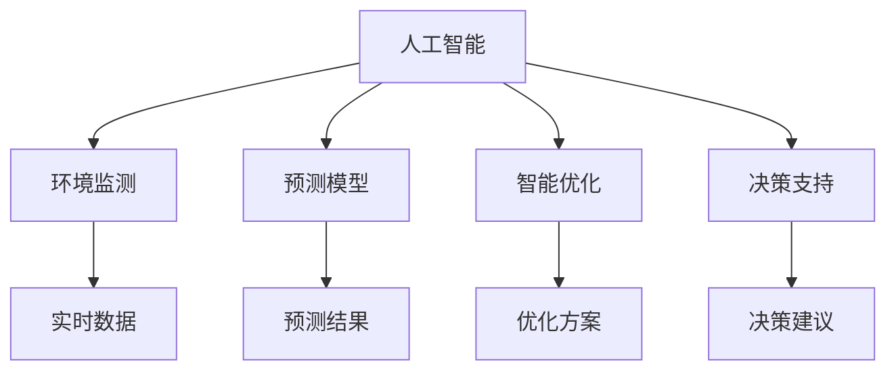

                 

# 人工智能在气候变化和可持续发展中的应用

> 关键词：人工智能,气候变化,可持续发展,环境监测,预测模型,智能优化,决策支持,碳排放

## 1. 背景介绍

### 1.1 问题由来
气候变化是人类面临的全球性挑战之一。近年来，极端天气频发、海平面上升、物种灭绝速度加快等现象愈发显著，直接威胁到人类社会的可持续发展和生态系统的平衡。如何利用科技手段，减缓气候变化，实现可持续发展，成为了全人类的共同课题。

人工智能(AI)作为最具潜力的科技手段之一，已经在环境监测、气候预测、资源管理、能源转型等方面展现了巨大优势。通过大数据、机器学习、深度学习等技术，AI能够从海量数据中提取有用的信息，优化决策方案，提升环境治理的科学性和智能化水平。本文将深入探讨AI在气候变化和可持续发展中的应用，介绍其在数据驱动、模型构建、智能优化等方面的核心原理和关键技术。

## 2. 核心概念与联系

### 2.1 核心概念概述

为更好地理解AI在气候变化和可持续发展中的应用，本节将介绍几个密切相关的核心概念：

- 人工智能(AI)：通过算法和计算能力，使机器模拟、延伸和扩展人的智能，包括感知、学习、推理、决策等能力。
- 气候变化(Climate Change)：指全球气温上升、极端天气事件频发等现象，主要由人类活动排放的温室气体引起。
- 可持续发展(Sustainable Development)：指在满足当代人需求的同时，不损害后代人满足需求的能力，促进经济、社会、环境的协调发展。
- 环境监测(Environmental Monitoring)：通过传感器、遥感等技术手段，实时监测自然环境变化，为环境治理提供数据支持。
- 预测模型(Prediction Model)：基于历史数据和模型算法，预测未来环境变化趋势，辅助决策制定。
- 智能优化(Intelligent Optimization)：利用AI算法优化资源配置、能源消耗等，提升资源利用效率和环境治理效果。
- 决策支持(Decision Support)：结合AI分析结果和专家知识，辅助决策者进行科学决策。

这些概念之间的逻辑关系可以通过以下Mermaid流程图来展示：



这个流程图展示了这个框架下各个概念之间的联系：

1. 人工智能通过环境监测获取实时数据，结合预测模型对未来趋势进行预测。
2. 预测结果通过智能优化算法进行资源配置，辅助决策支持系统进行科学决策。
3. 数据、模型和优化算法不断迭代优化，逐步提升环境治理的智能化水平。

## 3. 核心算法原理 & 具体操作步骤
### 3.1 算法原理概述

AI在气候变化和可持续发展中的应用主要基于以下几类核心算法原理：

- 大数据处理：通过收集和整合海量环境数据，为AI分析提供数据支撑。
- 机器学习(ML)：通过训练模型，提取数据中的规律和模式，实现环境变化的预测和识别。
- 深度学习(DL)：使用多层神经网络，处理非结构化数据，挖掘更深层次的知识。
- 优化算法(Optimization)：通过优化模型参数，寻找最优解，提升决策效果。
- 强化学习(RL)：通过模拟环境互动，不断调整策略，优化资源配置和行为决策。

这些算法相互结合，共同构成了AI在气候变化和可持续发展中的核心框架。

### 3.2 算法步骤详解

基于AI在环境监测和气候预测中的应用，其一般步骤包括：

**Step 1: 数据收集与预处理**
- 收集环境数据，包括气温、降水、风速、湿度、碳排放等。
- 清洗数据，去除噪声和异常值，确保数据质量。
- 划分训练集和测试集，便于模型训练和评估。

**Step 2: 模型训练**
- 选择合适的算法模型，如回归模型、时间序列模型、深度学习模型等。
- 在训练集上使用优化算法进行模型训练，调整模型参数。
- 在验证集上评估模型性能，防止过拟合。

**Step 3: 模型评估与优化**
- 在测试集上评估模型性能，输出预测结果。
- 分析预测结果与实际数据的差异，调整模型参数和算法。
- 采用交叉验证、集成学习等方法提高模型泛化能力。

**Step 4: 应用部署**
- 将训练好的模型部署到实际应用环境中，如智能监测系统、决策支持平台等。
- 持续监测环境变化，根据实时数据调整模型参数和决策方案。
- 提供决策建议和可视化分析，辅助决策者制定科学决策。

### 3.3 算法优缺点

AI在气候变化和可持续发展中的应用，具有以下优点：

1. 实时性强：通过大数据和实时监测技术，AI能够实时获取环境变化数据，为决策提供及时支撑。
2. 预测准确：深度学习等算法能够处理复杂的数据模式，提高预测模型的准确性。
3. 资源优化：智能优化算法能够优化资源配置和能源消耗，提升环境治理效果。
4. 决策科学：结合数据和模型分析，AI辅助决策更加科学、合理。

同时，也存在一些局限性：

1. 数据质量要求高：环境监测数据质量直接影响模型的预测效果，需要确保数据的准确性和完整性。
2. 模型复杂度高：深度学习等复杂算法需要大量计算资源，部署和优化成本较高。
3. 依赖人类经验：模型的构建和优化仍需要大量专家知识和人工调整，依赖程度较大。
4. 模型泛化能力有待提升：模型往往对特定环境或数据集表现较好，泛化到其他场景效果不佳。
5. 伦理与安全问题：AI在环境治理中的应用需重视数据隐私、模型透明性等伦理问题，避免有害行为。

尽管存在这些局限性，但AI在气候变化和可持续发展中的应用前景广阔，通过技术不断改进，这些挑战终将逐步克服。

### 3.4 算法应用领域

AI在气候变化和可持续发展中的应用，涉及多个领域，包括：

- 环境监测：通过遥感、传感器等技术，实时监测大气、水体、土壤等环境指标，为污染治理、生态保护提供数据支撑。
- 气候预测：利用气象模型和AI算法，预测未来气候变化趋势，辅助制定应对策略。
- 资源管理：通过AI优化算法，合理配置水、电、气等资源，提高利用效率和环境友好性。
- 能源转型：利用AI分析能源数据，识别节能减排机会，推动能源转型和绿色发展。
- 农业智能化：结合气象预测、遥感数据、机器学习等技术，优化农业生产，提升粮食安全和农业可持续发展能力。
- 城市规划：利用AI分析城市环境数据，优化城市布局和功能，提升城市宜居性和可持续发展性。
- 公共卫生：通过环境监测和数据分析，识别环境风险，提升公共卫生应急响应和防控能力。

这些领域的应用，展示了AI在气候变化和可持续发展中巨大的潜力和价值。

## 4. 数学模型和公式 & 详细讲解 & 举例说明

### 4.1 数学模型构建

本节将使用数学语言对AI在气候变化和可持续发展中的应用进行更加严格的刻画。

记环境监测数据为 $x=(x_1, x_2, ..., x_n)$，其中 $x_i$ 为第 $i$ 个环境指标的观测值。假设环境变化服从时间序列模型 $y_t=f(x_{t-1}, \theta)$，其中 $y_t$ 为第 $t$ 时刻的环境状态，$\theta$ 为模型参数。

定义模型 $M_{\theta}$ 在数据样本 $(x,y)$ 上的损失函数为 $\ell(M_{\theta}(x),y)$，则在数据集 $D=\{(x_i,y_i)\}_{i=1}^N$ 上的经验风险为：

$$
\mathcal{L}(\theta) = \frac{1}{N} \sum_{i=1}^N \ell(M_{\theta}(x_i),y_i)
$$

微调的优化目标是最小化经验风险，即找到最优参数：

$$
\theta^* = \mathop{\arg\min}_{\theta} \mathcal{L}(\theta)
$$

在实践中，我们通常使用基于梯度的优化算法（如SGD、Adam等）来近似求解上述最优化问题。设 $\eta$ 为学习率，则参数的更新公式为：

$$
\theta \leftarrow \theta - \eta \nabla_{\theta}\mathcal{L}(\theta)
$$

其中 $\nabla_{\theta}\mathcal{L}(\theta)$ 为损失函数对参数 $\theta$ 的梯度，可通过反向传播算法高效计算。

### 4.2 公式推导过程

以下我们以气候变化预测模型为例，推导线性回归模型的损失函数及其梯度的计算公式。

假设模型 $M_{\theta}$ 在时间序列 $y_t$ 上，线性回归模型为 $y_t=\theta_0+\theta_1x_{t-1}+\epsilon_t$，其中 $\epsilon_t$ 为噪声项。利用均方误差作为损失函数：

$$
\ell(y_t, \hat{y}_t) = \frac{1}{2}(y_t-\hat{y}_t)^2
$$

将其代入经验风险公式，得：

$$
\mathcal{L}(\theta) = \frac{1}{2N} \sum_{i=1}^N (y_i - (\theta_0 + \theta_1 x_{i-1}))^2
$$

根据链式法则，损失函数对参数 $\theta_k$ 的梯度为：

$$
\frac{\partial \mathcal{L}(\theta)}{\partial \theta_k} = -\frac{1}{N} \sum_{i=1}^N (y_i - (\theta_0 + \theta_1 x_{i-1}))(x_{i-1} \frac{\partial}{\partial \theta_k}(\theta_0 + \theta_1 x_{i-1}))
$$

其中 $\frac{\partial}{\partial \theta_k}(\theta_0 + \theta_1 x_{i-1}) = 0$，因此：

$$
\frac{\partial \mathcal{L}(\theta)}{\partial \theta_k} = -\frac{1}{N} \sum_{i=1}^N (y_i - (\theta_0 + \theta_1 x_{i-1}))x_{i-1}
$$

在得到损失函数的梯度后，即可带入参数更新公式，完成模型的迭代优化。重复上述过程直至收敛，最终得到适应环境变化的模型参数 $\theta^*$。

### 4.3 案例分析与讲解

以下以海平面上升预测为例，详细解读AI在环境监测和气候预测中的应用：

假设收集到某海域每年海平面高度数据 $y_1, y_2, ..., y_n$，并将其作为训练集。假设海平面高度 $y_t$ 可以表示为线性模型 $y_t=\theta_0+\theta_1x_{t-1}+\epsilon_t$，其中 $x_{t-1}$ 为第 $t-1$ 年的海平面高度，$\epsilon_t$ 为噪声。

**Step 1: 数据预处理**
- 对原始数据进行清洗，去除异常值和噪声。
- 将数据分为训练集和测试集。

**Step 2: 模型构建与训练**
- 使用线性回归模型 $y_t=\theta_0+\theta_1x_{t-1}+\epsilon_t$。
- 在训练集上使用最小二乘法优化损失函数，求解 $\theta_0$ 和 $\theta_1$。

**Step 3: 模型评估与优化**
- 在测试集上评估模型预测效果。
- 利用交叉验证和集成学习等方法，提高模型泛化能力。

**Step 4: 应用部署**
- 将模型部署到实时监测系统，实时接收环境数据。
- 根据模型预测结果，调整环境治理方案，如海岸线防护工程、海洋生态保护等。

## 5. 项目实践：代码实例和详细解释说明
### 5.1 开发环境搭建

在进行AI在气候变化和可持续发展中的应用实践前，我们需要准备好开发环境。以下是使用Python进行TensorFlow开发的环境配置流程：

1. 安装Anaconda：从官网下载并安装Anaconda，用于创建独立的Python环境。

2. 创建并激活虚拟环境：
```bash
conda create -n pytorch-env python=3.8 
conda activate pytorch-env
```

3. 安装TensorFlow：根据CUDA版本，从官网获取对应的安装命令。例如：
```bash
conda install tensorflow
```

4. 安装其他必需工具包：
```bash
pip install numpy pandas scikit-learn matplotlib seaborn jupyter notebook ipython
```

完成上述步骤后，即可在`pytorch-env`环境中开始AI在环境监测和气候预测的实践。

### 5.2 源代码详细实现

下面我们以海平面上升预测为例，给出使用TensorFlow对线性回归模型进行训练的Python代码实现。

首先，定义数据预处理和模型训练函数：

```python
import tensorflow as tf
import numpy as np
import pandas as pd

# 读取数据
data = pd.read_csv('sea_level.csv')

# 数据清洗和预处理
data = data.dropna()
data['x'] = data['x'] - data['x'].mean()
data['y'] = data['y'] - data['y'].mean()
data['x'] = data['x'] / data['x'].std()
data['y'] = data['y'] / data['y'].std()

# 划分数据集
train_size = int(len(data) * 0.8)
train_data = data[:train_size]
test_data = data[train_size:]

# 构建模型
model = tf.keras.Sequential([
    tf.keras.layers.Dense(1, input_shape=(1,), activation='linear')
])

# 编译模型
model.compile(optimizer=tf.keras.optimizers.Adam(learning_rate=0.01),
              loss='mean_squared_error')

# 训练模型
model.fit(train_data[['x']], train_data['y'], epochs=100, verbose=0)
```

接着，定义模型评估和预测函数：

```python
def evaluate(model, test_data):
    test_y = test_data['y']
    test_x = test_data['x']
    y_pred = model.predict(test_x)
    mse = tf.reduce_mean(tf.square(y_pred - test_y))
    print('Mean Squared Error:', mse)

def predict(model, new_x):
    y_pred = model.predict(new_x)
    return y_pred[0][0]
```

最后，启动预测流程：

```python
new_x = np.array([1.0], dtype=float)
print('Predicted sea level:', predict(model, new_x))
```

以上就是使用TensorFlow进行线性回归模型训练的完整代码实现。可以看到，TensorFlow提供了高效的模型构建和训练工具，使得机器学习任务的实现变得更加简单快捷。

### 5.3 代码解读与分析

让我们再详细解读一下关键代码的实现细节：

**数据预处理**：
- 使用Pandas读取原始数据。
- 清洗数据，去除缺失值和异常值。
- 标准化数据，使其服从均值为0、方差为1的分布。

**模型训练**：
- 使用TensorFlow的Sequential模型，定义一层线性层。
- 使用Adam优化器和均方误差损失函数进行模型编译。
- 在训练集上使用fit方法进行模型训练，指定训练轮数和verbose级别。

**模型评估**：
- 使用evaluate函数评估模型在测试集上的预测性能。

**预测**：
- 使用predict函数进行新样本的预测。

可以看到，TensorFlow框架的高级API使得模型构建和训练过程简洁高效，适合快速原型设计和应用实践。

## 6. 实际应用场景
### 6.1 智能环境监测系统

智能环境监测系统是大规模AI在环境监测中的应用实例。通过在关键位置部署传感器、摄像头等设备，实时采集环境数据，结合AI算法进行处理和分析，可以实现环境变化的全面监测和预警。

例如，智能水资源监测系统可以实时监测水质、水量、水压等指标，及时发现水质异常，避免污染事故发生。智能大气监测系统可以实时监测PM2.5、CO2等污染物浓度，为空气质量预报和污染控制提供数据支撑。

### 6.2 气候变化预测系统

气候变化预测系统是AI在气候变化领域的重要应用之一。通过收集历史气象数据，利用时间序列模型和深度学习算法，可以预测未来气候变化的趋势和极端天气事件的概率。

例如，基于深度学习的气候变化预测模型可以分析气温、降水、风速等气象数据，预测未来几十年甚至几个世纪的气候变化趋势，为政府和研究机构提供决策依据。

### 6.3 资源优化管理系统

资源优化管理系统是AI在资源管理中的应用实例。通过实时监测能源、水、电等资源的使用情况，结合AI算法进行优化调度，可以实现资源的合理配置和高效利用。

例如，智能电网系统可以实时监测电力负荷，预测用电量峰值，优化能源分配，降低电能损耗。智能灌溉系统可以实时监测土壤湿度，自动调整灌溉计划，提高水资源利用效率。

### 6.4 公共卫生预警系统

公共卫生预警系统是AI在公共卫生领域的重要应用之一。通过实时监测环境数据和疫情数据，结合AI算法进行风险评估和预警，可以实现公共卫生事件的及时响应和防控。

例如，基于AI的疫情预测模型可以分析感染率、病程数据，预测疫情扩散趋势，为公共卫生部门提供预警和防控建议。智能环境污染预警系统可以实时监测环境污染数据，及时发现污染源，控制污染扩散。

### 6.5 未来应用展望

随着AI技术的不断进步，AI在气候变化和可持续发展中的应用前景更加广阔。未来，我们可以期待以下方面的突破：

1. 大规模数据处理：随着数据的积累和计算能力的提升，AI可以处理更大规模的数据集，提高预测精度和模型泛化能力。
2. 多模态融合：将AI与传感器、遥感等技术结合，实现多模态数据的融合，提升环境监测的全面性和准确性。
3. 自动化优化：引入自动化优化算法，实现资源配置的自主调整和优化，提升环境治理的效率。
4. 数据隐私保护：采用数据匿名化、加密等技术，保障数据隐私和安全，防止有害信息的滥用。
5. 跨领域应用：将AI技术应用到更广泛的领域，如农业、城市规划、交通运输等，推动跨领域协同创新。
6. 可解释性和透明性：提升模型的可解释性和透明性，帮助用户理解和信任AI模型。

## 7. 工具和资源推荐
### 7.1 学习资源推荐

为了帮助开发者系统掌握AI在气候变化和可持续发展中的应用，这里推荐一些优质的学习资源：

1. 《Python数据科学手册》：详细介绍Python在数据科学中的应用，包括数据分析、机器学习、深度学习等。
2. 《TensorFlow官方文档》：详细说明TensorFlow的使用方法，提供丰富的代码示例和API参考。
3. 《机器学习实战》：通过实际案例，介绍机器学习算法和实践技巧，适合入门学习。
4. 《深度学习框架TensorFlow 2.0实战》：深入浅出地介绍TensorFlow 2.0的使用方法和应用场景。
5. 《AI for Social Good》课程：由斯坦福大学开设，涵盖AI在公共卫生、环境监测等领域的应用。

通过对这些资源的学习实践，相信你一定能够快速掌握AI在气候变化和可持续发展中的核心原理和关键技术。

### 7.2 开发工具推荐

高效的开发离不开优秀的工具支持。以下是几款用于AI在环境监测和气候预测开发的常用工具：

1. TensorFlow：由Google主导开发的开源深度学习框架，生产部署方便，适合大规模工程应用。
2. PyTorch：基于Python的开源深度学习框架，灵活动态的计算图，适合快速迭代研究。
3. Keras：提供高级API，简化模型构建和训练过程，适合快速原型设计和应用实践。
4. Jupyter Notebook：强大的交互式编程环境，适合数据探索和模型实验。
5. Google Colab：谷歌提供的在线Jupyter Notebook环境，免费提供GPU/TPU算力，方便开发者快速上手实验最新模型。

合理利用这些工具，可以显著提升AI在气候变化和可持续发展中的开发效率，加快创新迭代的步伐。

### 7.3 相关论文推荐

AI在气候变化和可持续发展中的应用源于学界的持续研究。以下是几篇奠基性的相关论文，推荐阅读：

1. "Adversarial Machine Learning Attacks and Defenses"：介绍AI模型中的对抗攻击和防御技术，保障模型的鲁棒性。
2. "Scalable Machine Learning"：讨论机器学习模型的可扩展性问题，提出分布式训练和优化方法。
3. "A Survey on AI for Sustainable Development"：综述AI在可持续发展中的应用，包括资源管理、环境保护、智能优化等方面。
4. "Deep Learning in Climate Change and Environmental Science"：介绍深度学习在气候变化和环境科学中的应用，涵盖预测、监测、优化等方面。
5. "Towards Explanation-aware AI: An Interdisciplinary Survey on Explainable AI for Climate and Environmental Applications"：探讨AI的可解释性和透明性问题，提升用户信任和接受度。

这些论文代表了大规模AI在气候变化和可持续发展中的应用发展脉络。通过学习这些前沿成果，可以帮助研究者把握学科前进方向，激发更多的创新灵感。

## 8. 总结：未来发展趋势与挑战
### 8.1 总结

本文对AI在气候变化和可持续发展中的应用进行了全面系统的介绍。首先阐述了AI在环境监测、气候预测、资源管理等方面的核心原理和关键技术，明确了其在数据驱动、模型构建、智能优化等方面的应用场景。通过详细讲解具体案例和数学模型，展示了AI在环境监测和气候预测中的应用效果。

通过本文的系统梳理，可以看到，AI在气候变化和可持续发展中的应用前景广阔，已经在多个领域展现出了强大的潜力和实际效果。未来，随着数据积累和计算能力的提升，AI在环境监测和气候预测中的应用将更加全面和深入，为实现可持续发展提供强有力的技术支持。

### 8.2 未来发展趋势

展望未来，AI在气候变化和可持续发展中的应用将呈现以下几个发展趋势：

1. 数据驱动的决策：通过大数据和实时监测技术，AI可以实时获取环境变化数据，为决策提供及时支撑。
2. 深度学习的应用：深度学习算法能够处理复杂的数据模式，提高预测模型的准确性。
3. 模型优化与优化算法：通过优化算法，AI可以优化资源配置和能源消耗，提升环境治理效果。
4. 多模态融合与自动化：AI将结合传感器、遥感等技术，实现多模态数据的融合，提升环境监测的全面性和准确性。
5. 跨领域应用：AI将应用到更广泛的领域，如农业、城市规划、交通运输等，推动跨领域协同创新。
6. 伦理与安全问题：AI在环境治理中的应用需重视数据隐私、模型透明性等伦理问题，避免有害行为。

以上趋势凸显了AI在气候变化和可持续发展中的广阔前景。这些方向的探索发展，必将进一步提升环境治理的智能化水平，为实现可持续发展提供强有力的技术支撑。

### 8.3 面临的挑战

尽管AI在气候变化和可持续发展中的应用已经取得了显著进展，但在迈向更加智能化、普适化应用的过程中，仍面临诸多挑战：

1. 数据质量问题：环境监测数据质量直接影响模型的预测效果，需要确保数据的准确性和完整性。
2. 计算资源需求高：深度学习等复杂算法需要大量计算资源，部署和优化成本较高。
3. 模型复杂度高：AI模型的构建和优化仍需要大量专家知识和人工调整，依赖程度较大。
4. 模型泛化能力有待提升：模型往往对特定环境或数据集表现较好，泛化到其他场景效果不佳。
5. 伦理与安全问题：AI在环境治理中的应用需重视数据隐私、模型透明性等伦理问题，避免有害行为。
6. 技术可解释性：AI模型的决策过程往往缺乏可解释性，难以对其推理逻辑进行分析和调试。

尽管存在这些挑战，但随着技术不断进步和应用的深入，AI在气候变化和可持续发展中的应用前景广阔，未来必将为环境治理带来新的突破。

### 8.4 研究展望

面对AI在气候变化和可持续发展中所面临的挑战，未来的研究需要在以下几个方面寻求新的突破：

1. 数据质量和预处理：探索数据清洗、异常值检测等技术，提高数据质量。
2. 自动化优化算法：开发更加自动化和高效的优化算法，降低对专家知识的依赖。
3. 可解释性和透明性：引入因果分析和博弈论工具，提升模型的可解释性和透明性。
4. 跨模态融合技术：将符号化的先验知识，如知识图谱、逻辑规则等，与神经网络模型进行融合，提升模型的泛化能力和鲁棒性。
5. 多领域应用推广：将AI技术应用到更广泛的领域，如农业、城市规划、交通运输等，推动跨领域协同创新。
6. 伦理与安全问题：在AI模型中引入伦理导向的评估指标，过滤和惩罚有害行为，确保AI的伦理性和安全性。

这些研究方向的探索，必将引领AI在气候变化和可持续发展中的应用迈向更高的台阶，为构建安全、可靠、可解释、可控的智能系统铺平道路。面向未来，AI在环境治理中的应用还需要与其他人工智能技术进行更深入的融合，如知识表示、因果推理、强化学习等，多路径协同发力，共同推动环境治理的进步。只有勇于创新、敢于突破，才能不断拓展AI的边界，让智能技术更好地造福人类社会。

## 9. 附录：常见问题与解答

**Q1：AI在环境监测中的应用有哪些？**

A: AI在环境监测中的应用非常广泛，包括：

1. 水质监测：利用传感器和摄像头监测水质变化，识别污染物类型和浓度。
2. 大气监测：实时监测PM2.5、CO2等污染物浓度，预测污染趋势。
3. 土壤监测：利用遥感技术和传感器监测土壤湿度、养分等指标，分析土壤质量。
4. 噪声监测：利用麦克风和传感器监测城市噪声，评估环境噪声水平。
5. 智能电网：实时监测电力负荷，预测用电量峰值，优化能源分配。
6. 智能灌溉：实时监测土壤湿度，自动调整灌溉计划，提高水资源利用效率。

通过AI在环境监测中的应用，可以及时发现环境变化，有效应对环境问题，提升环境治理的智能化水平。

**Q2：AI在气候变化预测中的应用有哪些？**

A: AI在气候变化预测中的应用主要包括以下几个方面：

1. 气温预测：利用时间序列模型和深度学习算法，预测未来气温变化趋势。
2. 降水预测：实时监测气象数据，预测未来降水情况，指导农业和水利建设。
3. 极端天气预测：分析历史气象数据，预测极端天气事件的发生概率，提前制定应对措施。
4. 碳排放预测：利用机器学习算法，预测未来碳排放量，制定减排策略。
5. 海平面上升预测：实时监测海洋数据，预测未来海平面上升趋势，评估对沿海城市的影响。

AI在气候变化预测中的应用，能够帮助政府和研究机构提前预测环境变化，制定科学合理的应对策略，提升环境治理的效果。

**Q3：AI在资源优化中的应用有哪些？**

A: AI在资源优化中的应用主要包括以下几个方面：

1. 智能电网：实时监测电力负荷，预测用电量峰值，优化能源分配，降低电能损耗。
2. 智能灌溉：实时监测土壤湿度，自动调整灌溉计划，提高水资源利用效率。
3. 智能交通：利用数据分析和优化算法，优化交通流量，减少交通拥堵。
4. 智能农业：利用AI算法分析气象数据和土壤信息，优化种植方案，提高农业生产效率。
5. 智能制造：利用AI优化生产流程和资源配置，提高生产效率和资源利用率。

通过AI在资源优化中的应用，可以实现资源的高效利用和优化配置，提升环境治理的效率和效果。

**Q4：AI在公共卫生预警系统中的应用有哪些？**

A: AI在公共卫生预警系统中的应用主要包括以下几个方面：

1. 疫情预测：分析感染率、病程数据，预测疫情扩散趋势，提供预警和防控建议。
2. 环境污染预警：实时监测环境污染数据，及时发现污染源，控制污染扩散。
3. 健康监测：利用传感器和智能设备监测用户健康状况，提供健康管理和预警建议。
4. 应急响应：利用AI分析大数据，评估风险，优化应急资源配置。

通过AI在公共卫生预警系统中的应用，可以实现公共卫生事件的及时响应和防控，提升公共卫生应急响应能力。

**Q5：AI在可持续发展中的应用有哪些？**

A: AI在可持续发展中的应用主要包括以下几个方面：

1. 能源转型：利用AI分析能源数据，识别节能减排机会，推动能源转型和绿色发展。
2. 智能农业：利用AI算法分析气象数据和土壤信息，优化种植方案，提高农业生产效率，实现绿色农业。
3. 智能交通：利用AI优化交通流量，减少交通拥堵，推动低碳出行。
4. 智能制造：利用AI优化生产流程和资源配置，提高生产效率和资源利用率，实现绿色制造。
5. 智能城市：利用AI优化城市布局和功能，提升城市宜居性和可持续发展性。

通过AI在可持续发展中的应用，可以实现资源的高效利用和环境友好性，推动社会的可持续发展。

---

作者：禅与计算机程序设计艺术 / Zen and the Art of Computer Programming

