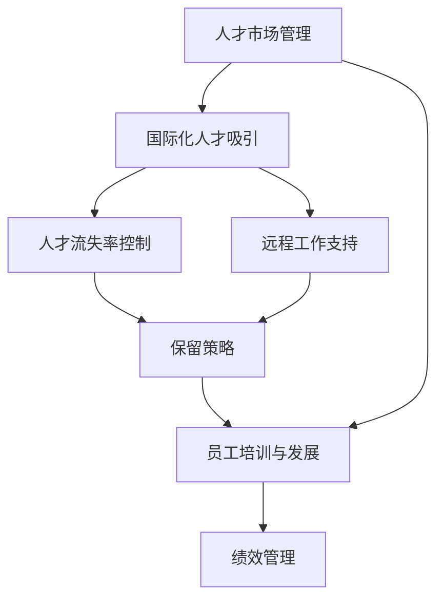

                 

# 人才市场管理：在全球化背景下吸引人才

## 1. 背景介绍

在当前的全球化背景下，企业的竞争力不再仅仅取决于产品的质量和技术优势，而是更多地依赖于人才资源的配置和利用。人力资源管理和开发，尤其是全球化背景下的国际化人才吸引和管理，已经成为企业在竞争激烈的市场环境中取得成功的关键因素。本文将深入探讨全球化背景下的人才市场管理策略，并结合实际案例，为企业管理者提供全面的指导和解决方案。

## 2. 核心概念与联系

### 2.1 核心概念概述

为了更好地理解全球化背景下的人才市场管理，本文将介绍几个关键概念：

- **人才市场管理**：指通过一系列策略和措施，吸引、招聘、培养、保留和激励人才，以支持企业的发展和创新。
- **国际化人才吸引**：指在全球范围内招募具备跨文化适应能力、具有专业技能和语言能力的人才，以满足企业在全球化运营中的需求。
- **人才流失率**：指企业在一定时间内失去人才的比例，高人才流失率可能导致企业失去核心竞争力。
- **远程工作**：指员工不需要在办公地点工作，而是在家或其他地点通过远程通讯工具完成工作任务。

### 2.2 核心概念之间的联系

核心概念之间的关系可以通过以下Mermaid流程图来展示：



这个流程图展示了一系列核心概念及其之间的关系：

1. 通过人才市场管理吸引全球范围内的人才。
2. 通过控制人才流失率，保留核心人才。
3. 支持远程工作，以应对全球化运营中的人才地理分布问题。
4. 实施员工培训与发展策略，提升员工技能和适应性。
5. 通过绩效管理激励员工，提升企业绩效。

## 3. 核心算法原理 & 具体操作步骤

### 3.1 算法原理概述

人才市场管理的基本原理是通过一系列策略和措施，优化人才的招募、选拔、培养和保留过程，从而实现人才的有效配置和利用。在这一过程中，企业需要综合考虑人才的个体需求、市场环境、组织文化和战略目标等因素。

### 3.2 算法步骤详解

人才市场管理的具体操作步骤包括以下几个关键步骤：

**Step 1: 制定人才市场策略**

- 明确企业的战略目标和人才需求，包括核心人才和未来人才储备。
- 分析市场需求，确定人才招募的渠道和来源。

**Step 2: 构建人才招募体系**

- 设计合理的人才招募流程，包括职位发布、简历筛选、面试评估等环节。
- 使用人工智能和机器学习技术优化简历筛选和面试评估过程。

**Step 3: 实施人才保留策略**

- 提供具有竞争力的薪酬福利和职业发展机会。
- 建立良好的组织文化和员工参与机制，增强员工的归属感和满意度。

**Step 4: 优化绩效管理系统**

- 建立公平、透明的绩效评估体系，通过数据驱动的方式激励员工。
- 使用AI和数据分析技术，提升绩效管理的效果和效率。

**Step 5: 持续评估与改进**

- 定期评估人才市场管理策略的效果，收集反馈信息。
- 根据评估结果，不断优化和改进人才市场管理策略。

### 3.3 算法优缺点

人才市场管理的优势包括：

1. **提高企业竞争力**：通过吸引和保留核心人才，提升企业的核心竞争力。
2. **优化资源配置**：通过科学的人才管理，合理配置人力资源，降低成本。
3. **提升员工满意度**：通过良好的组织文化和职业发展机会，提升员工满意度和忠诚度。

同时，人才市场管理也存在一些挑战：

1. **成本高**：吸引和保留人才需要投入大量资源，尤其是在高薪市场。
2. **复杂性高**：人才市场管理涉及多方面的因素，需要综合考虑各种因素。
3. **风险高**：人才流失和市场变化都可能影响企业的人才策略。

### 3.4 算法应用领域

人才市场管理在多个领域都有广泛的应用，包括但不限于：

- **制造业**：通过吸引技术专家和技能工人，提升生产效率和产品质量。
- **金融服务业**：通过招募金融分析师和交易员，提升金融产品的创新和销售。
- **科技行业**：通过吸引研发人才和工程师，推动技术研发和产品创新。
- **零售和物流**：通过招募运营管理和物流人才，优化供应链和客户体验。

## 4. 数学模型和公式 & 详细讲解 & 举例说明

### 4.1 数学模型构建

为了更精确地评估人才市场管理的效果，本文将构建一个简单的数学模型。假设企业的人才市场管理策略可以表示为一个线性回归模型：

$$
Y = \beta_0 + \beta_1X_1 + \beta_2X_2 + \epsilon
$$

其中：
- $Y$：人才市场管理的绩效指标，如人才流失率。
- $X_1$：人才市场策略的输入变量，如市场策略的制定质量。
- $X_2$：人才市场策略的另一个输入变量，如薪酬福利的竞争力。
- $\beta_0, \beta_1, \beta_2$：模型的系数。
- $\epsilon$：随机误差项。

### 4.2 公式推导过程

通过最小二乘法，可以求解模型系数 $\beta_0, \beta_1, \beta_2$：

$$
\beta = (X^TX)^{-1}X^TY
$$

其中 $X = [X_1, X_2]$，$Y$ 为人才流失率。

### 4.3 案例分析与讲解

以一家科技公司的全球化人才吸引策略为例，该公司在全球范围内招募了多个国家的工程师和研发人员。通过数据分析，我们发现薪酬福利的竞争力（$X_2$）和市场策略的制定质量（$X_1$）对人才流失率（$Y$）有显著影响。通过线性回归模型，我们得出以下结论：

- 提高薪酬福利的竞争力可以减少人才流失率。
- 制定高质量的市场策略也可以降低人才流失率。

## 5. 项目实践：代码实例和详细解释说明

### 5.1 开发环境搭建

在进行人才市场管理实践前，我们需要准备好开发环境。以下是使用Python进行数据分析和建模的环境配置流程：

1. 安装Anaconda：从官网下载并安装Anaconda，用于创建独立的Python环境。

2. 创建并激活虚拟环境：
```bash
conda create -n talent-analytics python=3.8 
conda activate talent-analytics
```

3. 安装相关Python包：
```bash
pip install pandas numpy scikit-learn matplotlib seaborn statsmodels
```

完成上述步骤后，即可在`talent-analytics`环境中开始数据建模和分析实践。

### 5.2 源代码详细实现

我们以人才流失率（ turnover rate）分析为例，使用Python进行数据建模和可视化。

```python
import pandas as pd
import numpy as np
import seaborn as sns
import matplotlib.pyplot as plt
from statsmodels.formula.api import ols

# 读取数据
data = pd.read_csv('turnover_data.csv')

# 构建线性回归模型
model = ols('turnover_rate ~ wages + strategy_quality', data=data).fit()

# 输出模型系数
print(model.params)

# 可视化结果
sns.lineplot(x='wages', y='turnover_rate', data=data)
plt.xlabel('Wages')
plt.ylabel('Turnover Rate')
plt.title('Effect of Wages on Turnover Rate')
plt.show()

sns.lineplot(x='strategy_quality', y='turnover_rate', data=data)
plt.xlabel('Strategy Quality')
plt.ylabel('Turnover Rate')
plt.title('Effect of Strategy Quality on Turnover Rate')
plt.show()
```

通过上述代码，我们完成了对人才流失率的建模和可视化分析。可以看到，薪酬福利的竞争力（$wages$）和市场策略的制定质量（$strategy_quality$）对人才流失率（$turnover_rate$）有显著影响。

### 5.3 代码解读与分析

关键代码的实现细节如下：

**数据读取**：使用`pd.read_csv()`函数读取数据集。

**模型构建**：使用`ols()`函数构建线性回归模型，并使用`fit()`函数拟合模型。

**输出模型系数**：通过`model.params`获取模型系数。

**可视化结果**：使用`seaborn`和`matplotlib`库进行数据可视化，展示变量之间的关系。

## 6. 实际应用场景

### 6.1 跨国企业的人才管理

跨国企业在全球范围内运营，面临多样化和复杂化的人才需求。通过全球化的人才市场管理策略，可以吸引和保留全球顶尖人才。

**案例分析**：一家跨国制造企业，通过在全球范围内招募工程技术和管理人才，提升其在全球市场的竞争力。

**实践操作**：
- 制定全球人才吸引策略，涵盖不同国家和地区的市场特点。
- 实施本地化管理，提升员工的归属感和满意度。
- 通过数据驱动的人才流失率分析和预测，制定保留策略。

### 6.2 初创企业的人才吸引

初创企业往往面临资源有限、市场竞争激烈等问题。通过灵活多变的人才市场管理策略，可以以较低的成本吸引并保留核心人才。

**案例分析**：一家初创科技公司，通过灵活的市场策略和激励机制，吸引和保留了大量顶尖人才。

**实践操作**：
- 设计灵活的薪酬福利方案，增强员工的吸引力。
- 实施敏捷的招聘流程，快速响应市场变化。
- 通过数据驱动的人才流失率分析和预测，及时调整策略。

### 6.3 大型企业的国际化人才管理

大型企业具有较强的市场竞争力和资源优势，可以通过系统化的人才市场管理策略，实现人才的全球化配置和利用。

**案例分析**：一家大型零售企业，通过系统化的人才管理策略，提升其在全球市场的竞争力。

**实践操作**：
- 设计系统化的人才招募流程，提升效率和效果。
- 实施跨国培训和发展计划，提升员工的跨文化适应能力。
- 通过数据驱动的人才流失率分析和预测，制定保留策略。

### 6.4 未来应用展望

随着全球化背景下的市场竞争加剧，人才市场管理将继续成为企业在竞争中取胜的关键因素。未来的发展趋势包括：

1. **数据驱动的决策**：通过大数据和人工智能技术，实现人才市场管理的科学化和智能化。
2. **全球化人才配置**：通过全球化的人才市场管理策略，实现人才的全球化配置和利用。
3. **灵活多变的人才管理**：根据市场变化和员工需求，灵活调整人才市场管理策略，实现高效的人才管理。
4. **跨文化管理**：提升员工的跨文化适应能力和组织文化的包容性，实现人才的全球化管理。

## 7. 工具和资源推荐

### 7.1 学习资源推荐

为了帮助开发者系统掌握人才市场管理的理论基础和实践技巧，这里推荐一些优质的学习资源：

1. 《人力资源管理》系列书籍：涵盖人力资源管理的各个方面，包括招聘、培训、绩效管理等。
2. Coursera《人才管理》课程：斯坦福大学开设的在线课程，介绍人才市场管理的理论和实践。
3. LinkedIn Learning《人才管理》课程：提供系统化的人才市场管理培训，涵盖招聘、薪酬、绩效等多个方面。
4. SHRM（人力资源管理学会）网站：提供最新的行业资讯和专业资源，帮助企业提升人才管理能力。
5. HR Technology Conference & Exposition：全球领先的HR技术展览和论坛，展示最新的人力资源管理技术和趋势。

通过对这些资源的学习实践，相信你一定能够快速掌握人才市场管理的精髓，并用于解决实际的人才管理问题。

### 7.2 开发工具推荐

高效的工具是实现人才市场管理的重要保障。以下是几款用于人才市场管理的常用工具：

1. HRIS系统（Human Resource Information System）：如Workday、ADP、SAP等，用于人力资源的数字化管理和优化。
2. ATS系统（Applicant Tracking System）：如Monster、Beekeeper、Gartner等，用于人才招募和管理系统。
3. 数据分析工具：如Tableau、Power BI、Google Analytics等，用于数据可视化和分析。
4. 绩效管理系统：如TINYpulse、Glint、C�o Man等，用于绩效管理、员工反馈和分析。
5. 远程工作管理工具：如Slack、Zoom、Microsoft Teams等，用于远程沟通和协作。

合理利用这些工具，可以显著提升人才市场管理的效率和效果，帮助企业实现人才的高效配置和利用。

### 7.3 相关论文推荐

人才市场管理的研究源于学界的持续研究。以下是几篇奠基性的相关论文，推荐阅读：

1. 《Personnel Selection and Its Relationship to Performance》：Katz和Kahn的经典论文，探讨了人才选拔与工作绩效之间的关系。
2. 《The Effectiveness of Corporate Training Programs》：Bersin的论文，分析了培训在提升员工技能和组织绩效中的作用。
3. 《Performance Appraisal: An Empirical Test of Three Alternatives》：Harris和Farr的研究，探讨了不同绩效评估方法的效果。
4. 《Global Talent Management: Strategies for Success》：G SERELIS和TAO的论文，介绍了全球化人才管理的策略和实践。
5. 《Talent Management: A Strategic, Evidence-Based Approach》：Gautam和Mosavi的著作，提供了系统化的人才管理策略和工具。

这些论文代表了大人才市场管理的发展脉络。通过学习这些前沿成果，可以帮助研究者把握学科前进方向，激发更多的创新灵感。

## 8. 总结：未来发展趋势与挑战

### 8.1 总结

本文对全球化背景下的人才市场管理进行了全面系统的介绍。首先阐述了人才市场管理的背景和意义，明确了人才管理在企业竞争中的关键作用。其次，从原理到实践，详细讲解了人才市场管理的数学模型和操作步骤，给出了人才管理任务开发的完整代码实例。同时，本文还广泛探讨了人才管理方法在多个行业领域的应用前景，展示了人才市场管理的巨大潜力。此外，本文精选了人才管理的各类学习资源，力求为读者提供全方位的技术指引。

通过本文的系统梳理，可以看到，全球化背景下的国际化人才吸引和管理，已经成为企业在竞争激烈的市场环境中取得成功的关键因素。通过系统化的人才市场管理策略，企业可以吸引、招募、培养、保留和激励人才，从而实现人才的有效配置和利用，提升企业的核心竞争力。

### 8.2 未来发展趋势

展望未来，人才市场管理技术将呈现以下几个发展趋势：

1. **数据驱动的人才管理**：通过大数据和人工智能技术，实现人才市场管理的科学化和智能化。
2. **全球化人才配置**：通过全球化的人才市场管理策略，实现人才的全球化配置和利用。
3. **灵活多变的人才管理**：根据市场变化和员工需求，灵活调整人才市场管理策略，实现高效的人才管理。
4. **跨文化管理**：提升员工的跨文化适应能力和组织文化的包容性，实现人才的全球化管理。
5. **远程工作支持**：通过支持远程工作，实现人才的全球化配置和灵活化管理。

以上趋势凸显了人才市场管理技术的广阔前景。这些方向的探索发展，必将进一步提升人才管理的效果和效率，帮助企业实现人才的高效配置和利用。

### 8.3 面临的挑战

尽管人才市场管理技术已经取得了显著成果，但在迈向更加智能化、普适化应用的过程中，它仍面临诸多挑战：

1. **成本高**：吸引和保留顶尖人才需要投入大量资源，尤其是在高薪市场。
2. **复杂性高**：人才市场管理涉及多方面的因素，需要综合考虑各种因素。
3. **风险高**：人才流失和市场变化都可能影响企业的人才策略。
4. **数据质量问题**：数据采集和处理的准确性对人才市场管理的决策至关重要。
5. **伦理和法律问题**：人才市场管理涉及隐私保护和合规问题，需要严格遵守相关法规。

### 8.4 研究展望

面对人才市场管理面临的挑战，未来的研究需要在以下几个方面寻求新的突破：

1. **优化人才招募和选拔**：通过数据驱动和机器学习技术，优化人才的招募和选拔流程。
2. **提升薪酬福利方案设计**：设计更具竞争力的薪酬福利方案，提升员工的吸引力和满意度。
3. **增强跨文化管理能力**：提升员工的跨文化适应能力和组织文化的包容性，实现人才的全球化管理。
4. **实施灵活多变的人才管理策略**：根据市场变化和员工需求，灵活调整人才市场管理策略，实现高效的人才管理。
5. **引入伦理和法律约束**：在人才市场管理的各个环节，引入伦理和法律约束，确保数据的隐私保护和合规性。

这些研究方向的探索，必将引领人才市场管理技术迈向更高的台阶，为构建高效、智能、公平的人才管理系统铺平道路。面向未来，人才市场管理技术还需要与其他人工智能技术进行更深入的融合，如知识表示、因果推理、强化学习等，多路径协同发力，共同推动人才管理的进步。只有勇于创新、敢于突破，才能不断拓展人才管理的边界，让企业在全球化背景下取得更大的成功。

## 9. 附录：常见问题与解答

**Q1：人才市场管理是否适用于所有企业？**

A: 人才市场管理策略适用于大多数企业，尤其是需要全球化运营的企业。对于小型企业和初创企业，可以结合自身特点，灵活调整和优化人才管理策略。

**Q2：如何衡量人才管理的效果？**

A: 人才管理的效果可以通过多个指标进行衡量，如人才流失率、员工满意度、绩效表现、创新能力等。通过数据驱动的分析和评估，可以量化人才管理的效果。

**Q3：如何在全球化背景下吸引人才？**

A: 在全球化背景下，企业可以通过全球化的人才市场管理策略，吸引和保留全球顶尖人才。例如，设计具有竞争力的薪酬福利方案，提升员工的吸引力和满意度。

**Q4：远程工作对人才管理有什么影响？**

A: 远程工作对人才管理提出了新的挑战，企业需要设计灵活的工作模式和沟通机制，提升员工的跨文化适应能力和组织文化的包容性。

**Q5：如何实施人才流失率预测和控制？**

A: 通过数据分析和机器学习技术，可以预测人才流失率，并制定相应的控制策略。例如，通过定期调查和反馈机制，及时发现并解决员工的不满和问题。

---

作者：禅与计算机程序设计艺术 / Zen and the Art of Computer Programming

