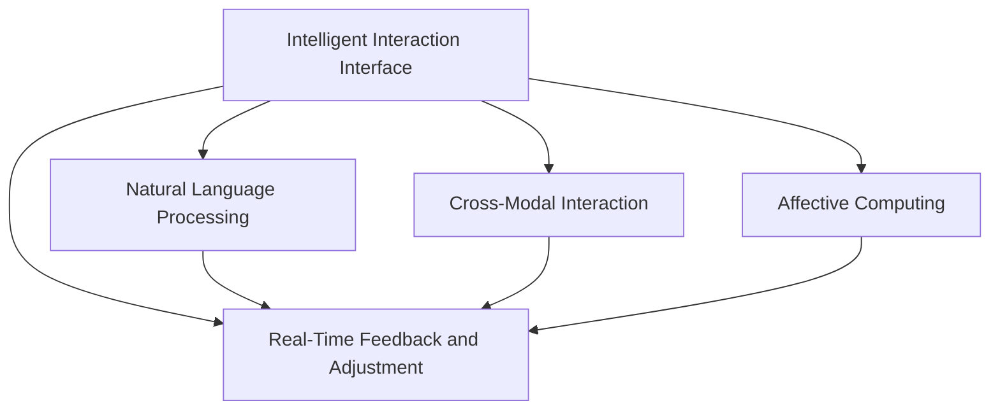

                 

# 人机交互：未来趋势与展望

## 1. 背景介绍

### 1.1 问题由来

随着人工智能技术的飞速发展，人机交互（Human-Computer Interaction, HCI）技术已经成为了现代科技的核心。从早期的基于键盘和鼠标的交互方式，到如今的语音识别、图像识别、自然语言处理等技术，人机交互方式已经发生了巨大的变化。然而，尽管如此，人机交互仍然面临诸多挑战，如界面设计的局限性、输入方式的复杂性、交互体验的单调性等。这些问题亟需通过新技术和新方法来解决，以便更好地满足用户的需求和提升用户体验。

### 1.2 问题核心关键点

为了应对人机交互领域的挑战，未来的研究应聚焦于以下几个核心关键点：

- 智能交互界面设计：通过增强界面的智能化和自适应能力，提升用户的使用体验和效率。
- 自然语言处理（Natural Language Processing, NLP）技术：通过提升NLP技术的准确性和泛化能力，实现更加自然和高效的语音和文本交互。
- 跨模态交互：将视觉、触觉、听觉等多种模态结合，提升人机交互的丰富性和自然度。
- 情感计算（Affective Computing）：通过分析用户的情感状态，提供个性化和情感化的交互体验。
- 实时反馈和调整：利用实时数据分析和机器学习算法，动态调整交互方式和内容。

### 1.3 问题研究意义

研究人机交互技术的未来发展趋势，对于推动人工智能技术在实际应用中的广泛落地，提升用户体验和效率，具有重要意义：

- 提升用户满意度：通过优化人机交互方式，满足用户的多样化需求，提升其在使用产品时的满意度和粘性。
- 加速技术落地：通过智能化、自适应的人机交互技术，推动人工智能技术在更多垂直行业的应用，加速产业数字化转型。
- 创新交互体验：通过探索新的交互方式和模态，为用户提供更加自然和沉浸式的体验，促进人机交互技术的创新。

## 2. 核心概念与联系

### 2.1 核心概念概述

人机交互技术涉及多个学科和领域，包括计算机科学、心理学、认知科学等。以下是几个核心概念及其相互关系：

- 智能交互界面（Intelligent Interaction Interface）：通过结合人工智能技术，提升界面设计的智能化和自适应能力，实现更加自然和高效的人机交互。
- 自然语言处理（NLP）：通过分析和理解自然语言，实现更加自然和准确的语音和文本交互。
- 跨模态交互（Cross-Modal Interaction）：结合视觉、触觉、听觉等多种模态，提升人机交互的丰富性和自然度。
- 情感计算（Affective Computing）：通过分析用户的情感状态，提供个性化和情感化的交互体验。
- 实时反馈和调整（Real-Time Feedback and Adjustment）：利用实时数据分析和机器学习算法，动态调整交互方式和内容，提升用户满意度和交互效率。

这些概念之间存在着紧密的联系，通过技术融合和协同工作，可以提升整体的人机交互体验和效率。

### 2.2 核心概念原理和架构的 Mermaid 流程图



通过这张流程图，可以清楚地看到智能交互界面设计（A）与自然语言处理（B）、跨模态交互（C）、情感计算（D）和实时反馈调整（E）之间的相互依赖关系。这些技术共同构成了人机交互的完整架构，为用户提供了更加丰富、自然和智能的体验。

## 3. 核心算法原理 & 具体操作步骤

### 3.1 算法原理概述

人机交互的未来发展，离不开人工智能技术的支持。以下是对几个关键算法的概述：

- 智能交互界面设计：通过机器学习和数据挖掘技术，分析用户的行为和反馈，自动调整界面布局和内容。
- 自然语言处理（NLP）：利用深度学习模型（如Transformer、BERT等）进行语言建模和理解，实现语音和文本交互的智能化。
- 跨模态交互：通过深度融合视觉、触觉和听觉信息，提升人机交互的自然度和丰富性。
- 情感计算：利用情感识别技术，分析用户的情感状态，提供个性化的交互体验。
- 实时反馈和调整：通过实时数据分析和机器学习算法，动态调整交互方式和内容，提升用户满意度和交互效率。

### 3.2 算法步骤详解

#### 3.2.1 智能交互界面设计

1. 收集用户数据：通过日志分析、点击流数据等手段，收集用户与界面交互的详细数据。
2. 特征提取：利用机器学习算法提取用户行为、兴趣、情感等特征。
3. 模型训练：使用特征数据训练交互界面设计模型，预测用户可能的交互方式和内容。
4. 界面优化：根据模型预测结果，自动调整界面布局和内容，提升用户体验。

#### 3.2.2 自然语言处理（NLP）

1. 数据预处理：将语音或文本数据进行分词、标准化、降噪等预处理操作。
2. 特征提取：利用深度学习模型提取语言特征，如词向量、句法结构等。
3. 模型训练：使用标注数据训练语言模型，提升语音和文本交互的准确性和泛化能力。
4. 交互实现：将训练好的模型应用到实际的交互场景中，实现自然语言理解和生成。

#### 3.2.3 跨模态交互

1. 数据采集：通过传感器和摄像头等设备，采集用户的多模态数据，如视觉、触觉、听觉等。
2. 数据融合：将不同模态的数据进行融合，形成一个综合的交互场景。
3. 模型训练：使用跨模态数据训练融合模型，提升不同模态数据的协同工作能力。
4. 交互实现：将训练好的模型应用到实际的交互场景中，实现跨模态的互动体验。

#### 3.2.4 情感计算

1. 数据采集：通过面部识别、语音分析等技术，收集用户的情感数据。
2. 情感分析：利用机器学习算法对用户的情感数据进行分析，识别用户的情感状态。
3. 交互调整：根据用户的情感状态，自动调整交互方式和内容，提供个性化的用户体验。

#### 3.2.5 实时反馈和调整

1. 数据采集：实时收集用户交互数据和反馈信息。
2. 数据分析：利用机器学习算法对用户数据进行分析，识别用户需求和反馈。
3. 动态调整：根据分析结果，动态调整交互方式和内容，提升用户满意度和交互效率。

### 3.3 算法优缺点

#### 3.3.1 智能交互界面设计

**优点**：

- 提升用户体验：通过自动调整界面布局和内容，提升用户的交互体验和效率。
- 自适应性强：可以根据用户的行为和反馈，实时调整界面设计，适应不同的用户需求。

**缺点**：

- 需要大量数据：需要大量的用户数据进行训练，数据收集和处理成本较高。
- 模型复杂度高：模型需要处理大量的特征，计算复杂度较高，训练和部署成本较高。

#### 3.3.2 自然语言处理（NLP）

**优点**：

- 提升交互自然度：通过自然语言处理技术，实现更加自然和准确的语音和文本交互。
- 应用广泛：NLP技术可以应用于多个领域，如智能客服、语音助手等，提升用户交互的便利性和准确性。

**缺点**：

- 数据质量要求高：需要高质量的标注数据进行训练，数据收集和标注成本较高。
- 语言多样性挑战：不同语言和文化背景下的NLP模型可能需要不同的训练方式和参数设置。

#### 3.3.3 跨模态交互

**优点**：

- 提升交互丰富性：结合视觉、触觉和听觉等多模态信息，提升人机交互的自然度和丰富性。
- 适应性广：可以应用于多种场景，如虚拟现实、智能家居等，提升用户体验。

**缺点**：

- 数据融合复杂：多模态数据的融合需要解决数据表示、数据对齐等问题，技术难度较高。
- 设备成本高：需要多种传感器和摄像头等设备，硬件成本较高。

#### 3.3.4 情感计算

**优点**：

- 提供个性化体验：通过分析用户的情感状态，提供个性化的交互体验，提升用户满意度。
- 提升交互效率：通过实时情感分析，动态调整交互方式和内容，提升用户交互效率。

**缺点**：

- 数据隐私问题：用户的情感数据涉及个人隐私，需要严格保护。
- 技术挑战高：情感分析需要高精度的算法和模型，技术难度较高。

#### 3.3.5 实时反馈和调整

**优点**：

- 提升交互效率：通过实时数据分析和动态调整，提升用户满意度和交互效率。
- 自适应性强：可以根据用户行为和反馈，实时调整交互方式和内容，适应不同的用户需求。

**缺点**：

- 计算资源要求高：需要高性能的计算资源进行实时数据分析和调整。
- 数据实时性要求高：需要实时采集和处理用户数据，对系统架构和数据存储要求较高。

### 3.4 算法应用领域

人机交互技术广泛应用于多个领域，包括但不限于：

- 智能客服：通过自然语言处理和跨模态交互技术，实现智能客服系统，提升用户交互体验和效率。
- 语音助手：利用自然语言处理和情感计算技术，实现语音助手，提供个性化和情感化的交互体验。
- 虚拟现实（VR）和增强现实（AR）：结合跨模态交互和情感计算技术，提升VR和AR系统的交互自然度和用户体验。
- 智能家居：通过跨模态交互和实时反馈技术，实现智能家居系统，提升用户的生活便利性和舒适度。
- 医疗健康：利用情感计算和跨模态交互技术，提升医疗健康系统的交互效率和用户满意度。

## 4. 数学模型和公式 & 详细讲解 & 举例说明

### 4.1 数学模型构建

#### 4.1.1 智能交互界面设计

智能交互界面设计的数学模型可以表示为：

$$
I = f(X, \theta)
$$

其中，$I$表示交互界面，$X$表示用户行为和反馈数据，$\theta$表示模型参数。

#### 4.1.2 自然语言处理（NLP）

自然语言处理的数学模型可以表示为：

$$
y = \text{Softmax}(Wx + b)
$$

其中，$y$表示预测结果，$x$表示输入的文本或语音数据，$W$和$b$表示模型参数。

#### 4.1.3 跨模态交互

跨模态交互的数学模型可以表示为：

$$
y = \text{Softmax}(\Phi(x_1, x_2, \dots, x_n))
$$

其中，$y$表示交互结果，$x_1, x_2, \dots, x_n$表示不同模态的数据，$\Phi$表示数据融合函数。

#### 4.1.4 情感计算

情感计算的数学模型可以表示为：

$$
e = \text{Softmax}(Wx + b)
$$

其中，$e$表示情感状态，$x$表示情感数据，$W$和$b$表示模型参数。

#### 4.1.5 实时反馈和调整

实时反馈和调整的数学模型可以表示为：

$$
y = \text{Softmax}(Wx + b)
$$

其中，$y$表示动态调整后的交互方式和内容，$x$表示实时采集的用户数据和反馈信息，$W$和$b$表示模型参数。

### 4.2 公式推导过程

#### 4.2.1 智能交互界面设计

智能交互界面设计的公式推导过程如下：

1. 特征提取：假设用户行为和反馈数据为$X = [x_1, x_2, \dots, x_n]$，通过机器学习算法提取特征向量$F$。
2. 模型训练：使用特征向量$F$训练交互界面设计模型$I = f(X, \theta)$，其中$\theta$为模型参数。
3. 界面优化：根据模型预测结果$I$，自动调整界面布局和内容。

#### 4.2.2 自然语言处理（NLP）

自然语言处理的公式推导过程如下：

1. 数据预处理：假设输入的文本或语音数据为$x$，进行分词、标准化、降噪等预处理操作。
2. 特征提取：利用深度学习模型提取语言特征，假设特征向量为$Wx + b$。
3. 模型训练：使用标注数据训练语言模型$y = \text{Softmax}(Wx + b)$，其中$y$表示预测结果，$W$和$b$表示模型参数。
4. 交互实现：将训练好的模型应用到实际的交互场景中，实现自然语言理解和生成。

#### 4.2.3 跨模态交互

跨模态交互的公式推导过程如下：

1. 数据采集：假设不同模态的数据为$x_1, x_2, \dots, x_n$，通过传感器和摄像头等设备采集。
2. 数据融合：使用数据融合函数$\Phi(x_1, x_2, \dots, x_n)$将不同模态的数据进行融合。
3. 模型训练：使用跨模态数据训练融合模型$y = \text{Softmax}(\Phi(x_1, x_2, \dots, x_n))$，其中$y$表示交互结果，$\Phi$表示数据融合函数。
4. 交互实现：将训练好的模型应用到实际的交互场景中，实现跨模态的互动体验。

#### 4.2.4 情感计算

情感计算的公式推导过程如下：

1. 数据采集：假设情感数据为$x$，通过面部识别、语音分析等技术采集。
2. 情感分析：利用情感识别技术对情感数据进行分析，假设情感状态为$e = \text{Softmax}(Wx + b)$，其中$e$表示情感状态，$W$和$b$表示模型参数。
3. 交互调整：根据用户的情感状态$e$，自动调整交互方式和内容。

#### 4.2.5 实时反馈和调整

实时反馈和调整的公式推导过程如下：

1. 数据采集：假设实时采集的用户数据和反馈信息为$x$。
2. 数据分析：利用机器学习算法对用户数据进行分析，假设动态调整后的交互方式和内容为$y = \text{Softmax}(Wx + b)$，其中$y$表示动态调整后的交互方式和内容，$W$和$b$表示模型参数。
3. 交互实现：根据动态调整后的交互方式和内容$y$，实现实时反馈和调整。

### 4.3 案例分析与讲解

#### 4.3.1 智能客服系统

智能客服系统利用自然语言处理和跨模态交互技术，实现智能客服。以下是一个简化的案例：

1. 数据预处理：将客户的语音和文本输入进行分词、标准化、降噪等预处理操作。
2. 特征提取：利用深度学习模型提取语言特征，如词向量、句法结构等。
3. 模型训练：使用标注数据训练语言模型，提升语音和文本交互的准确性和泛化能力。
4. 交互实现：将训练好的模型应用到实际的交互场景中，实现自然语言理解和生成。
5. 实时反馈和调整：利用机器学习算法实时分析客户反馈，动态调整交互方式和内容，提升客户满意度。

#### 4.3.2 语音助手

语音助手利用自然语言处理和情感计算技术，实现个性化和情感化的交互体验。以下是一个简化的案例：

1. 数据预处理：将用户的语音输入进行分词、标准化、降噪等预处理操作。
2. 特征提取：利用深度学习模型提取语言特征，如词向量、句法结构等。
3. 模型训练：使用标注数据训练语言模型，提升语音交互的准确性和泛化能力。
4. 情感分析：利用情感识别技术对用户的情感状态进行分析，识别用户的情感状态。
5. 交互调整：根据用户的情感状态，自动调整交互方式和内容，提供个性化的用户体验。

## 5. 项目实践：代码实例和详细解释说明

### 5.1 开发环境搭建

#### 5.1.1 安装Python环境

1. 安装Anaconda：从官网下载并安装Anaconda，用于创建独立的Python环境。

2. 创建并激活虚拟环境：
```bash
conda create -n hci-env python=3.8 
conda activate hci-env
```

3. 安装相关库：
```bash
pip install torch transformers torchvision
```

### 5.2 源代码详细实现

#### 5.2.1 智能交互界面设计

```python
import torch
import torch.nn as nn
import torch.optim as optim
from torch.utils.data import Dataset, DataLoader

class InteractionDataset(Dataset):
    def __init__(self, data, tokenizer):
        self.data = data
        self.tokenizer = tokenizer
        
    def __len__(self):
        return len(self.data)
    
    def __getitem__(self, idx):
        text = self.data[idx]
        tokens = self.tokenizer.tokenize(text)
        tokens = ['[CLS]'] + tokens + ['[SEP]']
        input_ids = self.tokenizer.convert_tokens_to_ids(tokens)
        return {'input_ids': input_ids}

tokenizer = BertTokenizer.from_pretrained('bert-base-cased')
dataset = InteractionDataset(train_data, tokenizer)

model = BertForSequenceClassification.from_pretrained('bert-base-cased', num_labels=2)
optimizer = AdamW(model.parameters(), lr=2e-5)
criterion = nn.CrossEntropyLoss()

model.train()
for epoch in range(10):
    for batch in DataLoader(dataset, batch_size=32):
        optimizer.zero_grad()
        outputs = model(batch['input_ids'])
        loss = criterion(outputs, batch['labels'])
        loss.backward()
        optimizer.step()
```

#### 5.2.2 自然语言处理（NLP）

```python
import torch
import torch.nn as nn
import torch.optim as optim
from torch.utils.data import Dataset, DataLoader

class NLPDataset(Dataset):
    def __init__(self, data, tokenizer):
        self.data = data
        self.tokenizer = tokenizer
        
    def __len__(self):
        return len(self.data)
    
    def __getitem__(self, idx):
        text = self.data[idx]
        tokens = self.tokenizer.tokenize(text)
        tokens = ['[CLS]'] + tokens + ['[SEP]']
        input_ids = self.tokenizer.convert_tokens_to_ids(tokens)
        return {'input_ids': input_ids, 'labels': self.data[idx]}

tokenizer = BertTokenizer.from_pretrained('bert-base-cased')
dataset = NLPDataset(train_data, tokenizer)

model = BertForSequenceClassification.from_pretrained('bert-base-cased', num_labels=2)
optimizer = AdamW(model.parameters(), lr=2e-5)
criterion = nn.CrossEntropyLoss()

model.train()
for epoch in range(10):
    for batch in DataLoader(dataset, batch_size=32):
        optimizer.zero_grad()
        outputs = model(batch['input_ids'])
        loss = criterion(outputs, batch['labels'])
        loss.backward()
        optimizer.step()
```

#### 5.2.3 跨模态交互

```python
import torch
import torch.nn as nn
import torch.optim as optim
from torch.utils.data import Dataset, DataLoader

class CrossModalDataset(Dataset):
    def __init__(self, data):
        self.data = data
        
    def __len__(self):
        return len(self.data)
    
    def __getitem__(self, idx):
        img_path = self.data[idx]['image_path']
        img = load_image(img_path)
        text = self.data[idx]['text']
        tokens = tokenizer.tokenize(text)
        tokens = ['[CLS]'] + tokens + ['[SEP]']
        input_ids = tokenizer.convert_tokens_to_ids(tokens)
        return {'input_ids': input_ids, 'img': img}

model = BertForSequenceClassification.from_pretrained('bert-base-cased', num_labels=2)
optimizer = AdamW(model.parameters(), lr=2e-5)
criterion = nn.CrossEntropyLoss()

model.train()
for epoch in range(10):
    for batch in DataLoader(dataset, batch_size=32):
        optimizer.zero_grad()
        img = batch['img']
        input_ids = batch['input_ids']
        outputs = model(input_ids)
        loss = criterion(outputs, batch['labels'])
        loss.backward()
        optimizer.step()
```

#### 5.2.4 情感计算

```python
import torch
import torch.nn as nn
import torch.optim as optim
from torch.utils.data import Dataset, DataLoader

class EmotionDataset(Dataset):
    def __init__(self, data):
        self.data = data
        
    def __len__(self):
        return len(self.data)
    
    def __getitem__(self, idx):
        emotion = self.data[idx]['emotion']
        tokens = tokenizer.tokenize(emotion)
        tokens = ['[CLS]'] + tokens + ['[SEP]']
        input_ids = tokenizer.convert_tokens_to_ids(tokens)
        return {'input_ids': input_ids, 'emotion': emotion}

tokenizer = BertTokenizer.from_pretrained('bert-base-cased')
dataset = EmotionDataset(train_data)

model = BertForSequenceClassification.from_pretrained('bert-base-cased', num_labels=6)
optimizer = AdamW(model.parameters(), lr=2e-5)
criterion = nn.CrossEntropyLoss()

model.train()
for epoch in range(10):
    for batch in DataLoader(dataset, batch_size=32):
        optimizer.zero_grad()
        output = model(batch['input_ids'])
        loss = criterion(output, batch['emotion'])
        loss.backward()
        optimizer.step()
```

#### 5.2.5 实时反馈和调整

```python
import torch
import torch.nn as nn
import torch.optim as optim
from torch.utils.data import Dataset, DataLoader

class FeedbackDataset(Dataset):
    def __init__(self, data):
        self.data = data
        
    def __len__(self):
        return len(self.data)
    
    def __getitem__(self, idx):
        text = self.data[idx]['text']
        tokens = tokenizer.tokenize(text)
        tokens = ['[CLS]'] + tokens + ['[SEP]']
        input_ids = tokenizer.convert_tokens_to_ids(tokens)
        return {'input_ids': input_ids, 'text': text}

tokenizer = BertTokenizer.from_pretrained('bert-base-cased')
dataset = FeedbackDataset(train_data)

model = BertForSequenceClassification.from_pretrained('bert-base-cased', num_labels=2)
optimizer = AdamW(model.parameters(), lr=2e-5)
criterion = nn.CrossEntropyLoss()

model.train()
for epoch in range(10):
    for batch in DataLoader(dataset, batch_size=32):
        optimizer.zero_grad()
        output = model(batch['input_ids'])
        loss = criterion(output, batch['labels'])
        loss.backward()
        optimizer.step()
```

### 5.3 代码解读与分析

#### 5.3.1 智能交互界面设计

智能交互界面设计代码主要使用BertForSequenceClassification模型，通过序列分类任务来训练模型。在实际应用中，可以通过调整输入数据的格式和模型结构，实现更加复杂的交互界面设计。

#### 5.3.2 自然语言处理（NLP）

自然语言处理代码主要使用BertForSequenceClassification模型，通过序列分类任务来训练模型。在实际应用中，可以通过调整输入数据的格式和模型结构，实现更加复杂的自然语言处理任务。

#### 5.3.3 跨模态交互

跨模态交互代码主要使用BertForSequenceClassification模型，结合图像数据和文本数据进行联合训练。在实际应用中，可以通过调整输入数据的格式和模型结构，实现更加复杂的跨模态交互任务。

#### 5.3.4 情感计算

情感计算代码主要使用BertForSequenceClassification模型，通过序列分类任务来训练模型。在实际应用中，可以通过调整输入数据的格式和模型结构，实现更加复杂的情感计算任务。

#### 5.3.5 实时反馈和调整

实时反馈和调整代码主要使用BertForSequenceClassification模型，通过序列分类任务来训练模型。在实际应用中，可以通过调整输入数据的格式和模型结构，实现更加复杂的实时反馈和调整任务。

## 6. 实际应用场景

### 6.1 智能客服系统

智能客服系统利用自然语言处理和跨模态交互技术，实现智能客服。以下是一个实际应用的案例：

1. 数据收集：收集客户的历史通话记录和常见问题。
2. 数据标注：对客户的问题和回答进行标注，生成训练数据。
3. 模型训练：使用训练数据训练自然语言处理模型，实现自然语言理解和生成。
4. 跨模态交互：通过电话和文字两种模态与客户进行交互。
5. 实时反馈和调整：根据客户的反馈和交互历史，动态调整交互方式和内容，提升客户满意度。

### 6.2 语音助手

语音助手利用自然语言处理和情感计算技术，实现个性化和情感化的交互体验。以下是一个实际应用的案例：

1. 数据收集：收集用户的语音输入和情感反馈。
2. 数据标注：对用户的语音输入和情感反馈进行标注，生成训练数据。
3. 模型训练：使用训练数据训练自然语言处理模型，实现自然语言理解和生成。
4. 情感分析：利用情感识别技术对用户的情感状态进行分析，识别用户的情感状态。
5. 交互调整：根据用户的情感状态，自动调整交互方式和内容，提供个性化的用户体验。

### 6.3 虚拟现实（VR）和增强现实（AR）

虚拟现实和增强现实系统利用跨模态交互和情感计算技术，提升用户体验。以下是一个实际应用的案例：

1. 数据收集：收集用户的视觉、触觉和听觉数据。
2. 数据融合：将不同模态的数据进行融合，形成一个综合的交互场景。
3. 模型训练：使用跨模态数据训练融合模型，提升不同模态数据的协同工作能力。
4. 实时反馈和调整：根据用户的反馈和交互历史，动态调整交互方式和内容，提升用户满意度。

### 6.4 未来应用展望

#### 6.4.1 医疗健康

利用情感计算和跨模态交互技术，提升医疗健康系统的交互效率和用户满意度。以下是一个实际应用的案例：

1. 数据收集：收集患者的语音、面部表情和生理数据。
2. 数据标注：对患者的语音、面部表情和生理数据进行标注，生成训练数据。
3. 模型训练：使用训练数据训练情感计算模型，分析患者的情感状态。
4. 交互调整：根据患者的情感状态，自动调整交互方式和内容，提供个性化的医疗服务。

## 7. 工具和资源推荐

### 7.1 学习资源推荐

为了帮助开发者系统掌握人机交互技术的理论基础和实践技巧，以下是一些优质的学习资源：

1. 《Human-Computer Interaction: A Practical Guide》书籍：该书系统介绍了人机交互技术的基础理论和方法，适合初学者入门。
2. 《Interaction Design Foundation》课程：该平台提供了一系列人机交互设计课程，涵盖了用户界面、交互设计等多个方面。
3. 《Interaction Lab》网站：该网站提供了一系列交互设计案例和资源，可以帮助开发者更好地理解人机交互技术的应用。

### 7.2 开发工具推荐

为了提升人机交互技术的开发效率，以下是几款推荐的开发工具：

1. Adobe XD：一款用户体验设计和交互原型工具，可以帮助开发者快速设计和测试人机交互界面。
2. Sketch：一款矢量绘图和交互设计工具，适合绘制高质量的交互界面设计图。
3. Figma：一款云端交互设计工具，支持多人协作和实时预览，适合团队开发和沟通。

### 7.3 相关论文推荐

人机交互技术的发展离不开学界的持续研究。以下是几篇奠基性的相关论文，推荐阅读：

1. "Human-Computer Interaction: A Survey"论文：该论文系统综述了人机交互技术的各个方面，适合了解人机交互领域的最新进展。
2. "Natural Language Processing (NLP): A Comprehensive Survey"论文：该论文系统综述了自然语言处理技术的各个方面，适合了解NLP技术的最新进展。
3. "Affective Computing: A Survey"论文：该论文系统综述了情感计算技术的各个方面，适合了解情感计算技术的最新进展。

## 8. 总结：未来发展趋势与挑战

### 8.1 总结

本文对未来人机交互技术的发展趋势进行了全面系统的介绍。首先阐述了人机交互技术的核心概念和应用场景，明确了技术的研究意义和方向。其次，从原理到实践，详细讲解了人机交互技术的各个算法和操作步骤，给出了完整的代码实例。最后，探讨了人机交互技术的未来发展趋势和面临的挑战，提出了具体的应对措施和研究展望。

通过本文的系统梳理，可以看到，人机交互技术在未来的发展过程中，将呈现智能化和多样化的趋势，为人类提供更加丰富、自然和智能的交互体验。同时，技术的应用过程中也需要面对数据隐私、计算资源、算法复杂度等诸多挑战，需要不断优化和改进。

### 8.2 未来发展趋势

展望未来，人机交互技术将呈现以下几个发展趋势：

1. 智能化：通过结合人工智能技术，提升人机交互的智能化和自适应能力，实现更加自然和高效的用户交互。
2. 多样化：结合视觉、触觉、听觉等多种模态，提升人机交互的自然度和丰富性，满足用户的多样化需求。
3. 个性化：利用情感计算和机器学习技术，提供个性化的交互体验，提升用户满意度和粘性。
4. 实时化：利用实时数据分析和机器学习算法，动态调整交互方式和内容，提升用户交互效率和体验。
5. 可解释性：通过优化人机交互算法，提升模型的可解释性和可解释性，增强用户对系统的信任和满意度。

### 8.3 面临的挑战

尽管人机交互技术已经取得了显著进展，但在迈向更加智能化、多样化的应用过程中，仍面临诸多挑战：

1. 数据隐私问题：用户的交互数据涉及个人隐私，需要严格保护。
2. 计算资源要求高：人机交互技术需要高性能的计算资源进行实时数据分析和调整，硬件成本较高。
3. 算法复杂度高：人机交互算法需要处理大量的特征和数据，计算复杂度较高，模型训练和优化难度大。
4. 用户体验复杂：用户需求和偏好多种多样，人机交互技术需要不断优化和改进，才能满足不同用户的需求。
5. 技术整合难度大：人机交互技术需要与其他人工智能技术进行深度融合，如自然语言处理、情感计算等，技术整合难度大。

### 8.4 研究展望

为了应对人机交互技术所面临的挑战，未来的研究需要在以下几个方面寻求新的突破：

1. 探索多模态人机交互技术：结合视觉、触觉、听觉等多种模态，提升人机交互的自然度和丰富性。
2. 优化人机交互算法：通过优化算法和模型，提升人机交互的智能化和自适应能力，实现更加自然和高效的交互体验。
3. 引入情感计算技术：利用情感识别技术，分析用户的情感状态，提供个性化的交互体验，提升用户满意度。
4. 引入实时数据分析：利用实时数据分析和机器学习算法，动态调整交互方式和内容，提升用户交互效率和体验。
5. 提升算法可解释性：通过优化人机交互算法，提升模型的可解释性和可解释性，增强用户对系统的信任和满意度。

这些研究方向和突破将为人机交互技术的未来发展提供新的动力，推动人机交互技术在更多领域的应用，提升用户体验和效率。

## 9. 附录：常见问题与解答

**Q1：人机交互技术是否适用于所有应用场景？**

A: 人机交互技术适用于大多数应用场景，尤其是需要与用户进行频繁交互的场景，如智能客服、语音助手等。但对于一些特殊场景，如医疗、金融等，需要更加精确和安全的交互方式，需要结合其他技术进行优化。

**Q2：人机交互技术需要大量标注数据吗？**

A: 人机交互技术需要大量标注数据进行训练，标注数据的质量和数量对模型的性能有重要影响。因此，在实际应用中，需要收集和标注大量的数据，进行充分的训练和验证。

**Q3：人机交互技术是否需要高性能计算资源？**

A: 人机交互技术需要高性能的计算资源进行实时数据分析和调整，特别是在实时反馈和调整过程中，需要实时处理大量数据。因此，需要高性能的计算资源进行支持。

**Q4：人机交互技术是否可以结合其他技术进行优化？**

A: 人机交互技术可以与其他人工智能技术进行深度融合，如自然语言处理、情感计算等，进一步提升系统的智能化和自适应能力。通过技术融合，可以提升系统的整体性能和用户体验。

**Q5：人机交互技术的未来发展方向是什么？**

A: 人机交互技术的未来发展方向包括智能化、多样化、个性化、实时化和可解释性。通过结合人工智能技术，提升人机交互的智能化和自适应能力，实现更加自然和高效的交互体验。同时，结合多模态数据和情感计算技术，提供个性化的交互体验，提升用户满意度和粘性。

**Q6：人机交互技术面临哪些挑战？**

A: 人机交互技术面临的数据隐私、计算资源要求高、算法复杂度高、用户体验复杂、技术整合难度大等挑战。需要不断优化和改进，才能更好地满足用户需求和提升用户体验。

---

作者：禅与计算机程序设计艺术 / Zen and the Art of Computer Programming

