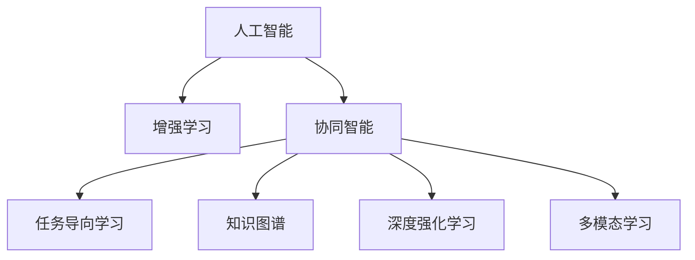

                 

# 人类-AI协作：增强人类潜能与AI能力的融合与协同

> 关键词：人工智能,增强学习,协同智能,人机融合,任务导向学习,知识图谱,深度强化学习,多模态学习

## 1. 背景介绍

### 1.1 问题由来

近年来，人工智能(AI)技术取得了前所未有的进展，AI与人类协同工作的话题逐渐成为热议焦点。伴随深度学习、强化学习等技术的不断突破，AI已经在诸多领域展现出强大的能力，包括图像识别、语音识别、自然语言处理等。然而，AI本身也存在一些局限性，如数据需求量大、计算成本高、通用性差等。

如何更好地将AI能力融入人类工作流程，使其能够高效辅助甚至替代部分重复性、繁琐的工作，同时最大化发挥人类创造性和情感智能的优势，成为当前AI研究和应用的重要方向。而人类-AI协作，即通过AI增强人类智能，提升决策能力、执行效率和创新力，正是这一方向的实践落地。

### 1.2 问题核心关键点

人类-AI协作的关键在于如何平衡AI的计算能力与人类的感性智能，实现优势互补。具体包括以下几个核心问题：

- AI能够辅助人类解决哪些问题？
- 如何设计AI与人类协同的工作流程？
- AI在协作中的角色定位和任务分配？
- 人类和AI在协作过程中如何协同优化？
- 人类-AI协作的实际应用场景有哪些？

解决这些问题的核心在于理解AI能力的优势和局限，明确AI与人类协同的目标和路径，并在实践中不断迭代和优化协作模式。

## 2. 核心概念与联系

### 2.1 核心概念概述

为了更系统地探讨人类-AI协作的原理与实践，本节将介绍几个密切相关的核心概念：

- 人工智能(AI)：指由计算机系统模拟人或动物某些智能行为的技术。主要分为机器学习、深度学习、强化学习等不同范式。
- 增强学习(Reinforcement Learning, RL)：指AI通过与环境的交互，根据奖惩信号不断优化策略，实现智能行为的优化。增强学习的核心在于模型与环境的反馈循环。
- 协同智能(Co-Intelligence)：指AI与人类共同协作，提升整体系统智能水平的概念。
- 任务导向学习(Task-Oriented Learning)：指AI系统针对特定任务进行训练，以提升任务的执行效率和准确性。
- 知识图谱(Knowledge Graph)：指由实体、关系、属性构成的语义网络，用于辅助AI理解复杂语义和关系，提高推理和推理能力。
- 深度强化学习(Deep Reinforcement Learning)：指结合深度神经网络与强化学习的技术，通过大量数据和计算资源的投入，实现对复杂任务的精准优化。
- 多模态学习(Multimodal Learning)：指结合文本、图像、语音等多种模态的数据，进行跨模态学习和推理，提升AI对现实世界的理解和表达能力。

这些概念之间的逻辑关系可以通过以下Mermaid流程图来展示：



这个流程图展示了一系列核心概念之间的联系，并强调了协同智能在其中的桥梁作用。

## 3. 核心算法原理 & 具体操作步骤

### 3.1 算法原理概述

人类-AI协作的原理主要基于增强学习和协同智能两大技术。其核心思想是通过AI技术优化特定任务的表现，同时结合人类智能的优势，形成高效的协同系统。

在增强学习中，AI系统通过与环境的交互，不断调整策略，以最大化预期奖励。在协同智能中，AI与人类共同完成任务，实现优势互补。这种协同工作方式要求系统具备灵活的策略调整能力和任务适应性。

### 3.2 算法步骤详解

人类-AI协作的实现步骤如下：

1. **任务定义**：明确协作的目标任务，如自然语言处理、图像识别、智能决策等。
2. **模型选择**：根据任务特点，选择合适的AI模型，如Transformer、BERT、GPT等。
3. **环境设计**：设计协作环境，包括数据集、奖励机制、任务反馈等，确保AI系统能够通过与环境的交互不断学习优化。
4. **协同策略设计**：定义AI与人类在任务执行中的角色和分工，设计协同策略。
5. **模型训练**：使用增强学习算法训练AI模型，调整策略以优化任务表现。
6. **协同执行**：在实际任务中，AI与人类协同工作，实现任务的执行和优化。
7. **反馈迭代**：根据任务执行结果和人类反馈，调整AI模型和协同策略，不断迭代优化。

### 3.3 算法优缺点

人类-AI协作的优势在于：
1. 提升任务执行效率。AI通过高效计算和模式识别，可以在短时间内处理大量数据，提升任务处理速度。
2. 增强决策准确性。AI可以辅助人类处理复杂的数据和任务，提升决策的准确性和可靠性。
3. 拓展任务适用范围。AI在处理重复性、规律性强的任务时表现优异，可以扩展人类能够处理的业务范围。
4. 促进知识共享。AI可以高效地处理和分析数据，帮助人类更好地理解业务和市场，促进知识共享和创新。

同时，这种协作方式也存在一些局限性：
1. 数据需求量大。AI系统需要大量数据进行训练，这对数据的获取和标注提出了较高要求。
2. 计算成本高。AI模型训练和推理需要强大的计算资源，短期内难以广泛应用。
3. 依赖环境适应性。AI系统需要与特定环境交互，对环境的适应性要求较高。
4. 协同复杂度高。AI与人类协同工作需要设计复杂的策略和流程，需要大量实验和调试。
5. 任务透明性差。AI系统在执行任务时，人类难以完全理解其内部机制和决策逻辑。

### 3.4 算法应用领域

人类-AI协作技术已经广泛应用于多个领域，具体包括：

- 智能客服：通过AI与人类协同工作，提升客户服务效率和质量。
- 医疗诊断：结合AI辅助医疗影像分析、病历记录、药物研发等，提升诊断和治疗效果。
- 金融交易：使用AI进行市场分析、风险控制、投资决策等，提高金融交易的精准度和效率。
- 自动化驾驶：通过AI辅助人类进行驾驶决策，提升行车安全和效率。
- 教育培训：AI辅助教师进行教学资源推荐、学生成绩分析等，提升教学质量和个性化学习体验。
- 工业制造：AI与人类协同进行生产计划、质量控制等，提升生产效率和产品精度。
- 智慧城市：通过AI辅助城市管理、交通控制、公共安全等，提升城市治理智能化水平。

以上领域展示了人类-AI协作技术的广泛应用前景，随着技术的不断进步和普及，协作模式将进一步深入各行各业，带来更加深刻的变革。

## 4. 数学模型和公式 & 详细讲解 & 举例说明

### 4.1 数学模型构建

为了更好地理解人类-AI协作的数学原理，本节将介绍几个基本的数学模型。

假设任务 $T$ 的输入为 $x$，输出为 $y$。AI模型的输入为 $x$，输出为 $a$。人类对于输入 $x$ 的处理为 $h$。AI与人类协同的输出为 $y$。

任务 $T$ 的损失函数为 $L(y, y')$，其中 $y'$ 为任务的理想输出。AI模型的损失函数为 $L(a, y')$，其中 $a$ 为AI模型的输出。人类模型的损失函数为 $L(h, y')$，其中 $h$ 为人类模型的输出。

AI与人类协同的损失函数为 $L(y, y')$。协同策略 $S$ 需要最小化整体损失函数，即：

$$
\min_{S} \sum_{x \in D} [L(y(x), y'(x)) + \alpha L(a(x), y'(x)) + \beta L(h(x), y'(x))]
$$

其中 $D$ 为任务数据集，$\alpha$ 和 $\beta$ 为协同策略的参数权重。

### 4.2 公式推导过程

在实际应用中，协同策略 $S$ 通常需要满足以下几个条件：
1. 最大化AI模型在任务 $T$ 上的表现，即 $L(a(x), y'(x))$ 尽可能小。
2. 最大化人类模型在任务 $T$ 上的表现，即 $L(h(x), y'(x))$ 尽可能小。
3. 最小化AI与人类在协同过程中的误差，即 $L(y(x), y'(x))$ 尽可能小。

为了实现这一目标，协同策略 $S$ 可以通过以下方式进行调整：

1. **数据融合**：将AI和人类模型在处理同一输入 $x$ 时的输出进行融合，生成协同输出 $y$。
2. **策略优化**：根据输出 $y$ 与理想输出 $y'$ 的差异，调整AI和人类的策略参数，最小化协同误差。
3. **协同学习**：通过AI与人类在协同过程中的交互，不断学习和优化策略，提升协同效果。

### 4.3 案例分析与讲解

以智能客服系统为例，分析人类-AI协作的实现过程：

**Step 1: 任务定义**：智能客服的任务是回答客户的咨询问题，提供准确的解决方案。

**Step 2: 模型选择**：选择BERT作为预训练模型，并基于该模型构建AI客服模型。

**Step 3: 环境设计**：设计客服系统的交互环境，包括客户问题库、知识图谱、奖励机制等。

**Step 4: 协同策略设计**：AI负责处理客户咨询的初步问题分类和语义理解，人类负责基于知识图谱进行最终解答。

**Step 5: 模型训练**：使用增强学习算法训练AI客服模型，优化问题分类和语义理解能力。

**Step 6: 协同执行**：AI客服模型处理客户问题，并通过交互界面将结果传递给人类客服，人类进行最终解答。

**Step 7: 反馈迭代**：根据客户反馈和问题解决效果，调整AI和人类客服的策略，不断迭代优化。

通过这个过程，AI客服可以高效处理重复性问题，提升客服系统的响应速度和处理能力，而人类客服则专注于复杂问题的解答，实现高效协同。

## 5. 项目实践：代码实例和详细解释说明

### 5.1 开发环境搭建

在进行人类-AI协作的实践前，我们需要准备好开发环境。以下是使用Python进行PyTorch开发的环境配置流程：

1. 安装Anaconda：从官网下载并安装Anaconda，用于创建独立的Python环境。

2. 创建并激活虚拟环境：
```bash
conda create -n human-ai-env python=3.8 
conda activate human-ai-env
```

3. 安装PyTorch：根据CUDA版本，从官网获取对应的安装命令。例如：
```bash
conda install pytorch torchvision torchaudio cudatoolkit=11.1 -c pytorch -c conda-forge
```

4. 安装Transformer库：
```bash
pip install transformers
```

5. 安装各类工具包：
```bash
pip install numpy pandas scikit-learn matplotlib tqdm jupyter notebook ipython
```

完成上述步骤后，即可在`human-ai-env`环境中开始项目实践。

### 5.2 源代码详细实现

这里我们以智能客服系统为例，使用PyTorch和Transformers库，展示人类-AI协作的代码实现。

首先，定义智能客服任务的数据处理函数：

```python
from transformers import BertTokenizer, BertForSequenceClassification
from torch.utils.data import Dataset
import torch

class CustomerQueryDataset(Dataset):
    def __init__(self, queries, labels, tokenizer, max_len=128):
        self.queries = queries
        self.labels = labels
        self.tokenizer = tokenizer
        self.max_len = max_len
        
    def __len__(self):
        return len(self.queries)
    
    def __getitem__(self, item):
        query = self.queries[item]
        label = self.labels[item]
        
        encoding = self.tokenizer(query, return_tensors='pt', max_length=self.max_len, padding='max_length', truncation=True)
        input_ids = encoding['input_ids'][0]
        attention_mask = encoding['attention_mask'][0]
        
        # 对label进行编码
        encoded_labels = torch.tensor(label, dtype=torch.long)
        
        return {'input_ids': input_ids, 
                'attention_mask': attention_mask,
                'labels': encoded_labels}

# 创建dataset
tokenizer = BertTokenizer.from_pretrained('bert-base-cased')

train_dataset = CustomerQueryDataset(train_queries, train_labels, tokenizer)
dev_dataset = CustomerQueryDataset(dev_queries, dev_labels, tokenizer)
test_dataset = CustomerQueryDataset(test_queries, test_labels, tokenizer)
```

然后，定义AI客服模型和协同策略：

```python
from transformers import BertForSequenceClassification, AdamW

model = BertForSequenceClassification.from_pretrained('bert-base-cased', num_labels=5)

optimizer = AdamW(model.parameters(), lr=2e-5)
```

接着，定义训练和评估函数：

```python
from torch.utils.data import DataLoader
from tqdm import tqdm
from sklearn.metrics import classification_report

device = torch.device('cuda') if torch.cuda.is_available() else torch.device('cpu')
model.to(device)

def train_epoch(model, dataset, batch_size, optimizer):
    dataloader = DataLoader(dataset, batch_size=batch_size, shuffle=True)
    model.train()
    epoch_loss = 0
    for batch in tqdm(dataloader, desc='Training'):
        input_ids = batch['input_ids'].to(device)
        attention_mask = batch['attention_mask'].to(device)
        labels = batch['labels'].to(device)
        model.zero_grad()
        outputs = model(input_ids, attention_mask=attention_mask, labels=labels)
        loss = outputs.loss
        epoch_loss += loss.item()
        loss.backward()
        optimizer.step()
    return epoch_loss / len(dataloader)

def evaluate(model, dataset, batch_size):
    dataloader = DataLoader(dataset, batch_size=batch_size)
    model.eval()
    preds, labels = [], []
    with torch.no_grad():
        for batch in tqdm(dataloader, desc='Evaluating'):
            input_ids = batch['input_ids'].to(device)
            attention_mask = batch['attention_mask'].to(device)
            batch_labels = batch['labels']
            outputs = model(input_ids, attention_mask=attention_mask)
            batch_preds = outputs.logits.argmax(dim=2).to('cpu').tolist()
            batch_labels = batch_labels.to('cpu').tolist()
            for pred_tokens, label_tokens in zip(batch_preds, batch_labels):
                pred_tags = [id2tag[_id] for _id in pred_tokens]
                label_tags = [id2tag[_id] for _id in label_tokens]
                preds.append(pred_tags[:len(label_tags)])
                labels.append(label_tags)
                
    print(classification_report(labels, preds))
```

最后，启动训练流程并在测试集上评估：

```python
epochs = 5
batch_size = 16

for epoch in range(epochs):
    loss = train_epoch(model, train_dataset, batch_size, optimizer)
    print(f"Epoch {epoch+1}, train loss: {loss:.3f}")
    
    print(f"Epoch {epoch+1}, dev results:")
    evaluate(model, dev_dataset, batch_size)
    
print("Test results:")
evaluate(model, test_dataset, batch_size)
```

以上就是使用PyTorch和Transformers库，对智能客服系统进行人类-AI协作的完整代码实现。可以看到，通过合理设计任务适配层和协同策略，AI与人类可以高效协同，提升客服系统的整体性能。

### 5.3 代码解读与分析

让我们再详细解读一下关键代码的实现细节：

**CustomerQueryDataset类**：
- `__init__`方法：初始化查询文本、标签、分词器等关键组件。
- `__len__`方法：返回数据集的样本数量。
- `__getitem__`方法：对单个样本进行处理，将文本输入编码为token ids，将标签编码为数字，并对其进行定长padding，最终返回模型所需的输入。

**模型和优化器**：
- `BertForSequenceClassification`模型：基于BERT构建的文本分类模型，用于处理智能客服的查询问题。
- `AdamW优化器`：用于更新模型参数，优化损失函数。

**训练和评估函数**：
- 使用PyTorch的DataLoader对数据集进行批次化加载，供模型训练和推理使用。
- 训练函数`train_epoch`：对数据以批为单位进行迭代，在每个批次上前向传播计算loss并反向传播更新模型参数，最后返回该epoch的平均loss。
- 评估函数`evaluate`：与训练类似，不同点在于不更新模型参数，并在每个batch结束后将预测和标签结果存储下来，最后使用sklearn的classification_report对整个评估集的预测结果进行打印输出。

**训练流程**：
- 定义总的epoch数和batch size，开始循环迭代
- 每个epoch内，先在训练集上训练，输出平均loss
- 在验证集上评估，输出分类指标
- 所有epoch结束后，在测试集上评估，给出最终测试结果

可以看到，PyTorch配合Transformers库使得AI客服模型的开发变得简洁高效。开发者可以将更多精力放在数据处理、模型改进等高层逻辑上，而不必过多关注底层的实现细节。

当然，工业级的系统实现还需考虑更多因素，如模型的保存和部署、超参数的自动搜索、更灵活的任务适配层等。但核心的协同范式基本与此类似。

## 6. 实际应用场景

### 6.1 智能客服系统

智能客服系统是AI与人类协作的经典案例。传统的客服系统需要大量人力，高峰期响应缓慢，且一致性和专业性难以保证。而使用智能客服系统，可以7x24小时不间断服务，快速响应客户咨询，用自然流畅的语言解答各类常见问题。

在技术实现上，可以收集企业内部的历史客服对话记录，将问题和最佳答复构建成监督数据，在此基础上对预训练的AI客服模型进行微调。微调后的AI客服模型能够自动理解用户意图，匹配最合适的答案模板进行回复。对于客户提出的新问题，还可以接入检索系统实时搜索相关内容，动态组织生成回答。如此构建的智能客服系统，能大幅提升客户咨询体验和问题解决效率。

### 6.2 医疗诊断

在医疗领域，AI与人类协同工作已经得到广泛应用。AI通过处理和分析大量医疗影像、病历记录等数据，辅助医生进行诊断和治疗。传统的医疗诊断需要医生具备丰富的临床经验和知识储备，而AI能够高效处理和分析这些数据，快速识别异常和病灶，提高诊断的准确性和效率。

在实际应用中，可以将AI与人类在诊断过程中进行协同，AI负责初步的图像识别和数据处理，人类医生负责最终的诊断和方案制定。这样既能充分发挥AI的计算优势，又能利用人类的临床经验，提升医疗服务的整体水平。

### 6.3 金融交易

金融行业对实时性和精准性的要求极高，AI与人类在金融交易中的协同工作已经非常普遍。AI系统可以分析海量市场数据，预测市场趋势，辅助人类进行投资决策。AI还能够实时监控交易系统，检测异常行为，提高交易的安全性和稳定性。

在实际应用中，AI与人类可以在金融交易系统进行协同工作，AI负责数据处理和分析，人类负责决策和监督。通过这种协同模式，金融交易系统能够更加高效、安全地运行，提升用户体验。

### 6.4 未来应用展望

随着AI技术的发展，未来人类-AI协作将覆盖更多领域，带来更加深刻的变革。

在智慧医疗领域，AI辅助医疗影像分析、病历记录、药物研发等，提升诊断和治疗效果。在教育培训领域，AI辅助教师进行教学资源推荐、学生成绩分析等，提升教学质量和个性化学习体验。在智慧城市治理中，AI辅助城市管理、交通控制、公共安全等，提升城市治理智能化水平。

此外，在企业生产、社会治理、文娱传媒等众多领域，AI与人类协同工作的应用也将不断涌现，为各行各业带来新的机遇和挑战。相信随着技术的不断成熟，人类-AI协作将更加深入各行各业，推动社会生产力的全面提升。

## 7. 工具和资源推荐

### 7.1 学习资源推荐

为了帮助开发者系统掌握人类-AI协作的理论基础和实践技巧，这里推荐一些优质的学习资源：

1. 《强化学习：一种新范式》系列博文：由AI专家撰写，深入浅出地介绍了增强学习的原理和应用场景。

2. 斯坦福大学《CS229: Machine Learning》课程：著名机器学习课程，涵盖了深度学习、强化学习等重要内容。

3. 《深度学习》书籍：深度学习领域的经典教材，详细介绍了深度学习的理论基础和实际应用。

4. 《协同智能：人工智能与人类协作的未来》书籍：探讨AI与人类协同工作的技术和应用。

5. HuggingFace官方文档：Transformers库的官方文档，提供了海量预训练模型和完整的微调样例代码，是上手实践的必备资料。

通过对这些资源的学习实践，相信你一定能够快速掌握人类-AI协作的精髓，并用于解决实际的AI问题。

### 7.2 开发工具推荐

高效的开发离不开优秀的工具支持。以下是几款用于人类-AI协作开发的常用工具：

1. PyTorch：基于Python的开源深度学习框架，灵活动态的计算图，适合快速迭代研究。大部分预训练语言模型都有PyTorch版本的实现。

2. TensorFlow：由Google主导开发的开源深度学习框架，生产部署方便，适合大规模工程应用。同样有丰富的预训练语言模型资源。

3. Transformers库：HuggingFace开发的NLP工具库，集成了众多SOTA语言模型，支持PyTorch和TensorFlow，是进行协同智能开发的利器。

4. Weights & Biases：模型训练的实验跟踪工具，可以记录和可视化模型训练过程中的各项指标，方便对比和调优。与主流深度学习框架无缝集成。

5. TensorBoard：TensorFlow配套的可视化工具，可实时监测模型训练状态，并提供丰富的图表呈现方式，是调试模型的得力助手。

6. Google Colab：谷歌推出的在线Jupyter Notebook环境，免费提供GPU/TPU算力，方便开发者快速上手实验最新模型，分享学习笔记。

合理利用这些工具，可以显著提升人类-AI协作任务的开发效率，加快创新迭代的步伐。

### 7.3 相关论文推荐

人类-AI协作技术的发展源于学界的持续研究。以下是几篇奠基性的相关论文，推荐阅读：

1. AlphaGo Zero：通过自对弈训练，AlphaGo Zero实现了自我优化和超越人类棋手的目标，展示了AI的强大自我学习和进化能力。

2. REINFORCE：提出了基于策略梯度的强化学习算法，实现了环境与策略的反馈循环，是增强学习的重要基础。

3. Multimodal Deep Learning：探讨了多模态数据的协同学习，提升了AI对复杂任务的理解和推理能力。

4. Co-Influence in Co-Intelligence: A Survey and Outlook：综述了协同智能的研究进展，探讨了未来技术的发展方向。

这些论文代表了大语言模型微调技术的发展脉络。通过学习这些前沿成果，可以帮助研究者把握学科前进方向，激发更多的创新灵感。

## 8. 总结：未来发展趋势与挑战

### 8.1 总结

本文对人类-AI协作的原理与实践进行了全面系统的介绍。首先阐述了人类-AI协作的研究背景和意义，明确了AI与人类协同的目标和路径。其次，从原理到实践，详细讲解了协同智能的数学原理和关键步骤，给出了协同智能任务开发的完整代码实例。同时，本文还探讨了协同智能在多个实际领域的应用前景，展示了协同智能技术的广泛应用潜力。此外，本文精选了协同智能学习的各类学习资源，力求为读者提供全方位的技术指引。

通过本文的系统梳理，可以看到，人类-AI协作技术正在成为AI研究和应用的重要方向，极大地拓展了AI在各行各业的应用范围，催生了更多的落地场景。未来，伴随技术的不断进步和普及，协同智能模式将进一步深入各行各业，带来更加深刻的变革。

### 8.2 未来发展趋势

展望未来，人类-AI协作技术将呈现以下几个发展趋势：

1. 多模态协同学习：未来AI系统将更加注重多模态数据的融合，提升对现实世界的理解能力。结合文本、图像、语音等多种模态的数据，进行跨模态学习和推理，提升AI对复杂任务的理解和表达能力。

2. 深度强化学习：未来AI系统将更加注重深度强化学习的应用，通过大量数据和计算资源的投入，实现对复杂任务的精准优化。结合深度神经网络与强化学习的技术，构建更加智能的协同系统。

3. 人机融合计算：未来AI系统将更加注重人机融合计算，通过将人类与AI的计算能力进行有机结合，构建更加高效、智能的协作系统。

4. 协同智能学习：未来AI系统将更加注重协同智能学习，通过人类与AI的共同学习，提升系统的整体智能水平。通过知识图谱、专家知识库等，实现更全面、准确的推理和决策。

5. 实时智能系统：未来AI系统将更加注重实时智能系统，通过高效的协同算法和计算资源，构建更加高效的实时决策系统。

6. 开放协同平台：未来AI系统将更加注重开放协同平台，通过开放的API和接口，实现不同系统之间的无缝协作。

以上趋势凸显了人类-AI协作技术的广阔前景。这些方向的探索发展，必将进一步提升协同系统的性能和应用范围，为各行各业带来更加深刻的变革。

### 8.3 面临的挑战

尽管人类-AI协作技术已经取得了瞩目成就，但在迈向更加智能化、普适化应用的过程中，它仍面临着诸多挑战：

1. 数据需求量大：AI系统需要大量数据进行训练，这对数据的获取和标注提出了较高要求。如何高效获取高质量数据，成为一大难题。

2. 计算成本高：AI模型训练和推理需要强大的计算资源，短期内难以广泛应用。如何降低计算成本，提高训练效率，是未来的重要研究方向。

3. 依赖环境适应性：AI系统需要与特定环境交互，对环境的适应性要求较高。如何提高AI系统的泛化能力，应对复杂多变的环境，是未来需要解决的问题。

4. 协同复杂度高：AI与人类协同工作需要设计复杂的策略和流程，需要大量实验和调试。如何简化协同策略设计，提高系统稳定性，是未来需要优化的问题。

5. 任务透明性差：AI系统在执行任务时，人类难以完全理解其内部机制和决策逻辑。如何提升AI系统的透明性和可解释性，是未来需要关注的问题。

6. 安全性有待保障：AI系统可能学习到有偏见、有害的信息，通过协同工作传递到下游任务，产生误导性、歧视性的输出，给实际应用带来安全隐患。如何从数据和算法层面消除模型偏见，避免恶意用途，确保输出的安全性，也将是重要的研究课题。

这些挑战需要学术界和产业界共同努力，才能不断突破，将人类-AI协作技术推向更高的台阶。

### 8.4 研究展望

未来，人类-AI协作技术需要在以下几个方面寻求新的突破：

1. 探索无监督和半监督协同方法。摆脱对大规模标注数据的依赖，利用自监督学习、主动学习等无监督和半监督范式，最大限度利用非结构化数据，实现更加灵活高效的协同。

2. 研究参数高效和计算高效的协同范式。开发更加参数高效的协同方法，在固定大部分预训练参数的同时，只更新极少量的协同策略参数。同时优化协同模型的计算图，减少前向传播和反向传播的资源消耗，实现更加轻量级、实时性的部署。

3. 引入因果分析和博弈论工具。将因果分析方法引入协同系统，识别出系统决策的关键特征，增强输出解释的因果性和逻辑性。借助博弈论工具刻画人机交互过程，主动探索并规避系统的脆弱点，提高系统稳定性。

4. 融合专家知识和多模态数据。将符号化的先验知识，如知识图谱、逻辑规则等，与神经网络模型进行巧妙融合，引导协同过程学习更准确、合理的语言模型。同时加强不同模态数据的整合，实现视觉、语音等多模态信息与文本信息的协同建模。

5. 纳入伦理道德约束。在协同系统的训练目标中引入伦理导向的评估指标，过滤和惩罚有偏见、有害的输出倾向。同时加强人工干预和审核，建立协同系统的监管机制，确保输出的道德性和合法性。

这些研究方向将引领人类-AI协作技术迈向更高的台阶，为构建安全、可靠、可解释、可控的智能系统铺平道路。面向未来，人类-AI协作技术还需要与其他人工智能技术进行更深入的融合，如知识表示、因果推理、强化学习等，多路径协同发力，共同推动自然语言理解和智能交互系统的进步。只有勇于创新、敢于突破，才能不断拓展人类-AI协作的边界，让智能技术更好地造福人类社会。

## 9. 附录：常见问题与解答

**Q1：人类-AI协作如何选择合适的任务？**

A: 选择人类-AI协作任务需要考虑多个因素，如数据量、计算资源、业务需求等。一般来说，适合协作的任务具有以下特点：
1. 数据量大：需要大量数据进行训练和推理的任务，如自然语言处理、图像识别等。
2. 计算需求高：需要强大计算资源进行训练和推理的任务，如智能客服、金融交易等。
3. 业务复杂度高：需要人类与AI协同解决的复杂任务，如医疗诊断、法律咨询等。
4. 应用场景广泛：适用于多个行业和领域的应用场景，如智慧医疗、智慧城市等。

**Q2：人类-AI协作需要哪些技术支持？**

A: 人类-AI协作需要以下技术支持：
1. 深度学习：用于构建AI模型，处理复杂任务。
2. 强化学习：用于优化AI模型，提高任务执行效率。
3. 自然语言处理：用于理解自然语言，处理文本数据。
4. 多模态学习：用于结合多种模态数据，提升AI系统的理解能力。
5. 知识图谱：用于辅助AI系统理解复杂语义和关系，提高推理和推理能力。
6. 分布式计算：用于处理大规模数据和任务，提高计算效率。

**Q3：人类-AI协作的协同策略设计需要注意哪些问题？**

A: 协同策略设计是AI与人类协同工作的关键，需要注意以下几个问题：
1. 角色定位：明确AI与人类在任务执行中的角色和分工，避免重复和遗漏。
2. 数据融合：将AI与人类在处理同一输入时的输出进行融合，生成协同输出。
3. 策略优化：根据输出与理想输出的差异，调整AI和人类的策略参数，最小化协同误差。
4. 协同学习：通过AI与人类在协同过程中的交互，不断学习和优化策略，提升协同效果。

**Q4：人类-AI协作的实际应用场景有哪些？**

A: 人类-AI协作技术已经在多个领域得到应用，具体包括：
1. 智能客服：通过AI与人类协同工作，提升客户服务效率和质量。
2. 医疗诊断：结合AI辅助医疗影像分析、病历记录、药物研发等，提升诊断和治疗效果。
3. 金融交易：使用AI进行市场分析、风险控制、投资决策等，提高金融交易的精准度和效率。
4. 自动化驾驶：通过AI辅助人类进行驾驶决策，提升行车安全和效率。
5. 教育培训：AI辅助教师进行教学资源推荐、学生成绩分析等，提升教学质量和个性化学习体验。
6. 智慧城市：通过AI辅助城市管理、交通控制、公共安全等，提升城市治理智能化水平。

以上领域展示了人类-AI协作技术的广泛应用前景，随着技术的不断成熟和普及，协作模式将进一步深入各行各业，带来更加深刻的变革。

**Q5：如何提高AI系统的透明性和可解释性？**

A: 提高AI系统的透明性和可解释性，需要从数据、模型和解释工具等多个方面进行优化：
1. 数据质量：使用高质量、多样化的数据进行训练，避免数据偏差和噪声。
2. 模型设计：设计简单、易于理解的模型结构，避免过于复杂和黑盒化的模型。
3. 解释工具：使用可视化工具、特征重要性分析等方法，帮助人类理解AI系统的决策过程。
4. 监督学习：引入人工干预和审核机制，确保AI系统的输出符合道德和伦理规范。

这些措施可以有效提升AI系统的透明性和可解释性，增强人类对AI系统的信任和接受度。

**Q6：AI与人类协作时需要注意哪些伦理问题？**

A: AI与人类协作时需要注意以下伦理问题：
1. 数据隐私：保护用户的隐私数据，避免数据泄露和滥用。
2. 决策公正：确保AI系统的决策公正、透明，避免偏见和歧视。
3. 用户权益：尊重用户的知情权和选择权，避免强制推荐和信息误导。
4. 安全性：确保AI系统的安全性和稳定性，避免系统崩溃和恶意攻击。

只有在伦理道德层面得到充分保障，AI与人类协作才能更好地发挥其优势，为人类社会带来福祉。

