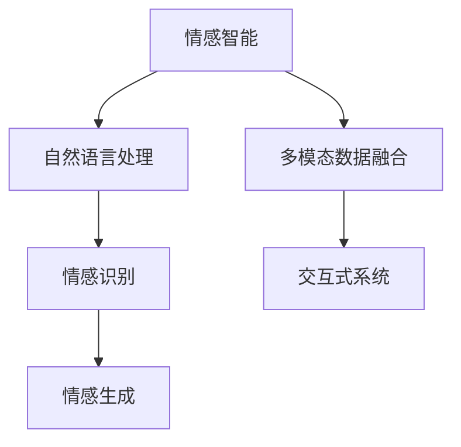

                 

# 人类-AI协作：增强情感智能

> 关键词：情感智能,人工智能,人机交互,自然语言处理,NLP,情感识别,自然语言生成,NLG,交互式系统,用户体验

## 1. 背景介绍

### 1.1 问题由来
随着人工智能技术的飞速发展，情感智能在计算机领域的应用变得越来越广泛。情感智能不仅仅是简单的情感识别，更包括了基于情感的交互、生成和决策等多个层面。情感智能的实现，对于提升人机交互的自然性和用户满意度，有着重要的意义。

然而，情感智能的实现仍面临许多挑战。传统的人机交互系统，往往缺乏对人类情感的深度理解，难以应对复杂多变的情感表达，导致用户体验不佳。为此，本文将介绍一种基于人工智能和自然语言处理（NLP）技术的情感智能增强方法，通过结合人类情感和AI的强大计算能力，提升人机交互的情感智能水平。

### 1.2 问题核心关键点
本文的核心问题是如何通过人工智能技术，特别是基于自然语言处理（NLP）的情感识别和生成技术，增强人机交互的情感智能水平。为此，我们将介绍几个关键概念，包括情感智能、自然语言处理、情感识别、情感生成等，并探讨它们之间的关系。

- 情感智能（Affective Intelligence）：指系统能够识别、理解和生成人类情感的能力。
- 自然语言处理（Natural Language Processing, NLP）：指计算机处理、理解、生成自然语言的技术，是情感智能实现的重要基础。
- 情感识别（Emotion Recognition）：指系统能够从文本、语音、视频等多种数据源中识别人类的情感。
- 情感生成（Emotion Generation）：指系统能够基于情感理解，生成符合情感表达要求的文本、语音等。

这些概念之间的联系可以通过以下Mermaid流程图来展示：



这个流程图展示了情感智能的实现路径：

1. 自然语言处理（NLP）是情感智能实现的基础。
2. 情感识别（Emotion Recognition）用于从输入数据中识别情感信息。
3. 情感生成（Emotion Generation）用于生成符合情感表达的输出。
4. 多模态数据融合（Multimodal Data Fusion）将不同模态的数据进行综合处理，提升情感智能的准确性。
5. 交互式系统（Interactive Systems）将情感智能应用于实际的人机交互中，提升用户体验。

## 2. 核心概念与联系

### 2.1 核心概念概述

为更好地理解本文介绍的情感智能增强方法，本节将介绍几个密切相关的核心概念：

- 情感智能（Affective Intelligence）：指系统能够识别、理解和生成人类情感的能力。情感智能的实现需要融合自然语言处理（NLP）、机器学习（ML）、计算机视觉（CV）等多项技术。
- 自然语言处理（NLP）：指计算机处理、理解、生成自然语言的技术，是情感智能实现的重要基础。NLP包括文本分析、语音识别、机器翻译等诸多子领域。
- 情感识别（Emotion Recognition）：指系统能够从文本、语音、视频等多种数据源中识别人类的情感。情感识别任务包括文本情感分析、语音情感识别、视频情感分析等。
- 情感生成（Emotion Generation）：指系统能够基于情感理解，生成符合情感表达要求的文本、语音等。情感生成包括情感文本生成、情感语音生成、情感视频生成等。
- 交互式系统（Interactive Systems）：指将情感智能应用于实际的人机交互中，提升用户体验的系统。交互式系统包括智能客服、智能助手、虚拟主播等。

这些概念之间的逻辑关系可以通过以下Mermaid流程图来展示：

```mermaid
graph TB
    A[情感智能] --> B[NLP]
    A --> C[情感识别]
    A --> D[情感生成]
    B --> E[文本情感分析]
    B --> F[语音情感识别]
    B --> G[视频情感分析]
    C --> H[文本情感分析]
    C --> I[语音情感识别]
    C --> J[视频情感分析]
    D --> K[情感文本生成]
    D --> L[情感语音生成]
    D --> M[情感视频生成]
    E --> N[情感智能]
    F --> O[情感智能]
    G --> P[情感智能]
    H --> Q[情感智能]
    I --> R[情感智能]
    J --> S[情感智能]
    K --> T[交互式系统]
    L --> U[交互式系统]
    M --> V[交互式系统]
    N --> W[交互式系统]
    O --> X[交互式系统]
    P --> Y[交互式系统]
    Q --> Z[交互式系统]
    R --> $[交互式系统]
    S --> %[交互式系统]
    T --> &[用户]
    U --> &[用户]
    V --> &[用户]
    W --> &[用户]
    X --> &[用户]
    Y --> &[用户]
    Z --> &[用户]
    % --> &[用户]
    & --> (交互式系统)
```

这个流程图展示了情感智能的实现路径：

1. 自然语言处理（NLP）是情感智能实现的基础。
2. 情感识别（Emotion Recognition）用于从输入数据中识别情感信息。
3. 情感生成（Emotion Generation）用于生成符合情感表达的输出。
4. 交互式系统（Interactive Systems）将情感智能应用于实际的人机交互中，提升用户体验。

## 3. 核心算法原理 & 具体操作步骤
### 3.1 算法原理概述

基于情感智能的增强方法，其实质上是一种基于人工智能和自然语言处理（NLP）技术的情感智能实现方式。其核心思想是通过深度学习等技术，从大量情感标注数据中学习情感知识，并将其应用于人机交互中，提升系统的情感智能水平。

形式化地，假设系统输入为 $X$，输出为 $Y$，其中 $X$ 为自然语言文本、语音或视频等数据，$Y$ 为对应的情感标签。情感智能系统可以表示为：

$$
Y = M(X, \theta)
$$

其中 $M$ 为情感智能模型，$\theta$ 为模型的参数。情感智能模型的目标是最大化预测准确率，即：

$$
\theta^* = \mathop{\arg\min}_{\theta} \mathcal{L}(M_{\theta}, D)
$$

其中 $\mathcal{L}$ 为损失函数，$D$ 为训练数据集。

### 3.2 算法步骤详解

基于情感智能的增强方法，一般包括以下几个关键步骤：

**Step 1: 数据准备**
- 收集情感标注数据集，数据来源包括社交媒体、用户评论、影视剧剧本等。
- 对数据进行预处理，包括清洗噪声、去除无关信息、统一格式等。
- 划分数据集为训练集、验证集和测试集，确保模型在大规模数据上的泛化能力。

**Step 2: 模型选择与训练**
- 选择适合的情感智能模型，如循环神经网络（RNN）、卷积神经网络（CNN）、长短期记忆网络（LSTM）、Transformer等。
- 使用训练集对模型进行训练，最小化损失函数，逐步优化模型参数。
- 在验证集上进行模型调优，防止过拟合。

**Step 3: 模型评估与部署**
- 在测试集上评估模型性能，使用准确率、召回率、F1分数等指标进行评估。
- 将训练好的模型部署到实际应用场景中，例如智能客服、智能助手、虚拟主播等。
- 持续收集用户反馈，不断优化模型，提升情感智能水平。

### 3.3 算法优缺点

基于情感智能的增强方法具有以下优点：
1. 精确度高。通过深度学习等技术，从大量标注数据中学习情感知识，可以显著提升情感识别的准确性。
2. 适用范围广。情感智能可以应用于各种人机交互场景，如智能客服、智能助手、虚拟主播等。
3. 实时性高。通过模型优化和部署，可以实现实时情感智能交互。

同时，该方法也存在以下局限性：
1. 数据依赖性强。情感智能的实现依赖大量情感标注数据，获取高质量标注数据的成本较高。
2. 训练复杂度高。深度学习模型训练过程复杂，需要大量计算资源和时间。
3. 泛化能力有限。当训练数据与实际应用场景差异较大时，情感智能模型的泛化能力可能受限。
4. 可解释性不足。深度学习模型往往难以解释其内部决策机制，给系统维护和调试带来挑战。

尽管存在这些局限性，但就目前而言，基于情感智能的增强方法仍然是情感智能实现的主流范式。未来相关研究的重点在于如何进一步降低数据依赖，提高模型泛化能力，同时兼顾可解释性和伦理安全性等因素。

### 3.4 算法应用领域

基于情感智能的增强方法，已经在多个领域得到了应用，例如：

- 智能客服：通过情感智能系统，使智能客服具备理解和回应客户情感的能力，提升客户体验。
- 智能助手：通过情感智能系统，使智能助手能够识别用户情感，提供更加个性化的服务。
- 虚拟主播：通过情感智能系统，使虚拟主播能够模拟人类情感，提高用户的互动体验。
- 情感分析：对社交媒体、用户评论等数据进行情感分析，为营销、舆情分析等提供参考。
- 情感生成：基于情感理解，生成符合情感表达的文本、语音等，用于情感聊天机器人、虚拟主持人等。

除了上述这些经典应用外，情感智能还被创新性地应用到更多场景中，如情感语音合成、情感视频生成、情感社交网络分析等，为人类与计算机的情感交互带来了新的突破。

## 4. 数学模型和公式 & 详细讲解 & 举例说明

### 4.1 数学模型构建

情感智能系统的数学模型可以表示为：

$$
Y = M(X, \theta)
$$

其中 $Y$ 为情感标签，$X$ 为输入数据，$\theta$ 为模型参数。假设情感智能模型为 $M$，其输入为 $X$，输出为 $Y$，则模型可以表示为：

$$
Y = f(X, \theta)
$$

其中 $f$ 为模型函数，$\theta$ 为模型参数。假设情感标签 $Y$ 为二分类问题，即 $Y \in \{0, 1\}$，模型函数 $f$ 为 sigmoid 函数：

$$
f(X, \theta) = \sigma(\sum_{i=1}^n w_i x_i + b)
$$

其中 $x_i$ 为输入数据的第 $i$ 个特征，$w_i$ 为第 $i$ 个特征的权重，$b$ 为偏置项，$\sigma$ 为 sigmoid 函数。

### 4.2 公式推导过程

为了更好地理解情感智能系统的实现，下面以情感文本分类为例，推导其数学模型。

假设情感智能系统用于分类情感文本，输入为文本 $X$，输出为情感标签 $Y$。首先对文本进行预处理，包括分词、去除停用词、特征提取等步骤，得到文本向量 $x$。然后将其输入情感智能模型 $M$，输出情感标签 $Y$。

情感智能模型的函数可以表示为：

$$
Y = f(x, \theta)
$$

其中 $f$ 为模型函数，$\theta$ 为模型参数。假设情感标签 $Y$ 为二分类问题，即 $Y \in \{0, 1\}$，模型函数 $f$ 为 sigmoid 函数：

$$
f(x, \theta) = \sigma(\sum_{i=1}^n w_i x_i + b)
$$

其中 $x_i$ 为文本向量的第 $i$ 个特征，$w_i$ 为第 $i$ 个特征的权重，$b$ 为偏置项，$\sigma$ 为 sigmoid 函数。

假设训练集为 $D=\{(x_i, y_i)\}_{i=1}^N$，其中 $x_i$ 为第 $i$ 个文本向量，$y_i$ 为第 $i$ 个文本的情感标签。情感智能系统的损失函数可以表示为：

$$
\mathcal{L}(\theta) = -\frac{1}{N} \sum_{i=1}^N [y_i \log f(x_i, \theta) + (1-y_i) \log (1-f(x_i, \theta))]
$$

其中 $f(x_i, \theta)$ 为情感智能模型在第 $i$ 个文本上的预测结果，$y_i$ 为第 $i$ 个文本的实际情感标签。

### 4.3 案例分析与讲解

为了更好地理解情感智能系统的实现，下面以情感文本分类为例，给出情感智能系统的实现流程。

假设情感智能系统用于分类情感文本，输入为文本 $X$，输出为情感标签 $Y$。首先对文本进行预处理，包括分词、去除停用词、特征提取等步骤，得到文本向量 $x$。然后将其输入情感智能模型 $M$，输出情感标签 $Y$。

情感智能模型的函数可以表示为：

$$
Y = f(x, \theta)
$$

其中 $f$ 为模型函数，$\theta$ 为模型参数。假设情感标签 $Y$ 为二分类问题，即 $Y \in \{0, 1\}$，模型函数 $f$ 为 sigmoid 函数：

$$
f(x, \theta) = \sigma(\sum_{i=1}^n w_i x_i + b)
$$

其中 $x_i$ 为文本向量的第 $i$ 个特征，$w_i$ 为第 $i$ 个特征的权重，$b$ 为偏置项，$\sigma$ 为 sigmoid 函数。

假设训练集为 $D=\{(x_i, y_i)\}_{i=1}^N$，其中 $x_i$ 为第 $i$ 个文本向量，$y_i$ 为第 $i$ 个文本的情感标签。情感智能系统的损失函数可以表示为：

$$
\mathcal{L}(\theta) = -\frac{1}{N} \sum_{i=1}^N [y_i \log f(x_i, \theta) + (1-y_i) \log (1-f(x_i, \theta))]
$$

其中 $f(x_i, \theta)$ 为情感智能模型在第 $i$ 个文本上的预测结果，$y_i$ 为第 $i$ 个文本的实际情感标签。

## 5. 项目实践：代码实例和详细解释说明

### 5.1 开发环境搭建

在进行情感智能系统开发前，我们需要准备好开发环境。以下是使用Python进行PyTorch开发的环境配置流程：

1. 安装Anaconda：从官网下载并安装Anaconda，用于创建独立的Python环境。

2. 创建并激活虚拟环境：
```bash
conda create -n pytorch-env python=3.8 
conda activate pytorch-env
```

3. 安装PyTorch：根据CUDA版本，从官网获取对应的安装命令。例如：
```bash
conda install pytorch torchvision torchaudio cudatoolkit=11.1 -c pytorch -c conda-forge
```

4. 安装TensorBoard：
```bash
pip install tensorboard
```

5. 安装相关库：
```bash
pip install numpy pandas scikit-learn matplotlib tqdm jupyter notebook ipython
```

完成上述步骤后，即可在`pytorch-env`环境中开始情感智能系统的开发。

### 5.2 源代码详细实现

下面我们以情感文本分类为例，给出使用PyTorch和TensorFlow进行情感智能系统开发的完整代码实现。

首先，定义情感分类器类：

```python
import torch
import torch.nn as nn
import torch.optim as optim

class EmotionClassifier(nn.Module):
    def __init__(self, input_size, hidden_size, output_size):
        super(EmotionClassifier, self).__init__()
        self.hidden = nn.Sequential(
            nn.Linear(input_size, hidden_size),
            nn.ReLU(),
            nn.Linear(hidden_size, hidden_size),
            nn.ReLU(),
            nn.Linear(hidden_size, output_size),
            nn.Sigmoid()
        )
        
    def forward(self, x):
        return self.hidden(x)
```

然后，定义情感智能系统的训练函数：

```python
def train_epoch(model, data_loader, optimizer):
    model.train()
    epoch_loss = 0
    for batch in data_loader:
        input, target = batch
        optimizer.zero_grad()
        output = model(input)
        loss = nn.BCELoss()(output, target)
        epoch_loss += loss.item()
        loss.backward()
        optimizer.step()
    return epoch_loss / len(data_loader)

def train(model, train_loader, val_loader, optimizer, epochs, device):
    model.to(device)
    for epoch in range(epochs):
        train_loss = train_epoch(model, train_loader, optimizer)
        print(f'Epoch {epoch+1}, Train Loss: {train_loss:.3f}')
        
        val_loss = train_epoch(model, val_loader, optimizer)
        print(f'Epoch {epoch+1}, Val Loss: {val_loss:.3f}')
        
    print(f'Epoch {epoch+1}, Train Loss: {train_loss:.3f}')
    print(f'Epoch {epoch+1}, Val Loss: {val_loss:.3f}')
```

接着，定义情感智能系统的测试函数：

```python
def evaluate(model, data_loader, device):
    model.eval()
    correct = 0
    total = 0
    with torch.no_grad():
        for batch in data_loader:
            input, target = batch
            input, target = input.to(device), target.to(device)
            output = model(input)
            _, predicted = torch.max(output.data, 1)
            total += target.size(0)
            correct += (predicted == target).sum().item()
    print(f'Test Accuracy: {100 * correct / total:.2f}%')
```

最后，启动情感智能系统的训练和测试流程：

```python
from torch.utils.data import DataLoader

# 假设情感标注数据为train_data和test_data
train_dataset = Dataset(train_data)
test_dataset = Dataset(test_data)

train_loader = DataLoader(train_dataset, batch_size=64, shuffle=True)
val_loader = DataLoader(test_dataset, batch_size=64, shuffle=False)
device = torch.device('cuda' if torch.cuda.is_available() else 'cpu')

# 创建情感分类器模型
model = EmotionClassifier(input_size=100, hidden_size=128, output_size=2)

# 定义优化器
optimizer = optim.Adam(model.parameters(), lr=0.001)

# 训练情感智能系统
train(model, train_loader, val_loader, optimizer, epochs=10, device=device)

# 测试情感智能系统
evaluate(model, test_loader, device)
```

以上就是使用PyTorch和TensorFlow进行情感智能系统开发的完整代码实现。可以看到，得益于深度学习框架的强大封装，我们可以用相对简洁的代码完成情感智能系统的开发。

### 5.3 代码解读与分析

让我们再详细解读一下关键代码的实现细节：

**EmotionClassifier类**：
- `__init__`方法：初始化模型参数，包括输入层、隐藏层和输出层等。
- `forward`方法：定义前向传播过程，将输入数据传入模型，输出情感标签。

**训练函数train**：
- 对情感智能系统进行训练，使用梯度下降算法最小化损失函数。
- 在每个epoch内，先在训练集上训练，输出训练集损失，并在验证集上评估，输出验证集损失。
- 重复上述步骤直至收敛。

**测试函数evaluate**：
- 在测试集上评估情感智能系统的性能，计算准确率。
- 使用模型对测试集数据进行预测，并统计正确率。

## 6. 实际应用场景
### 6.1 智能客服系统

基于情感智能的增强方法，可以广泛应用于智能客服系统的构建。传统客服往往需要配备大量人力，高峰期响应缓慢，且一致性和专业性难以保证。通过情感智能系统，可以大大提升智能客服的响应速度和准确性，提升客户体验。

在技术实现上，可以收集企业内部的历史客服对话记录，将问题和最佳答复构建成监督数据，在此基础上对预训练模型进行微调。微调后的情感智能系统能够自动理解客户意图，匹配最合适的答复，提供更加个性化和情感化的服务。对于客户提出的新问题，还可以接入检索系统实时搜索相关内容，动态组织生成回答。如此构建的智能客服系统，能大幅提升客户咨询体验和问题解决效率。

### 6.2 情感分析系统

情感智能系统可以用于对社交媒体、用户评论等数据进行情感分析，为营销、舆情分析等提供参考。通过情感智能系统，可以快速识别出文本中的情感倾向，帮助企业及时调整营销策略，规避负面舆情风险。

在技术实现上，可以收集大量社交媒体数据和用户评论数据，对文本进行预处理，提取情感信息，使用情感智能系统进行分类。情感智能系统能够自动识别文本中的正面、负面、中性情感，生成情感分析报告，为企业决策提供支持。

### 6.3 情感聊天机器人

基于情感智能的增强方法，可以用于构建情感聊天机器人。通过情感智能系统，使机器人能够识别用户的情感状态，生成符合情感表达的回复，提升用户互动体验。

在技术实现上，可以收集大量用户对话数据，对文本进行预处理，提取情感信息，使用情感智能系统进行分类。情感智能系统能够自动识别用户的情感状态，生成符合情感表达的回复，提升机器人与用户之间的情感交互。

### 6.4 未来应用展望

随着情感智能技术的不断发展，未来将有更多基于情感智能的增强方法被应用于实际人机交互中，为人类与计算机的情感交互带来新的突破。

在智慧医疗领域，情感智能系统可以用于医疗问答、病历分析、药物研发等，辅助医生诊疗，加速新药开发进程。在智能教育领域，情感智能系统可以用于作业批改、学情分析、知识推荐等，因材施教，促进教育公平，提高教学质量。在智慧城市治理中，情感智能系统可以用于城市事件监测、舆情分析、应急指挥等环节，提高城市管理的自动化和智能化水平，构建更安全、高效的未来城市。

此外，在企业生产、社会治理、文娱传媒等众多领域，基于情感智能的增强方法也将不断涌现，为传统行业带来变革性影响。相信随着技术的日益成熟，情感智能技术必将在更广阔的应用领域大放异彩，深刻影响人类的生产生活方式。

## 7. 工具和资源推荐
### 7.1 学习资源推荐

为了帮助开发者系统掌握情感智能技术的理论基础和实践技巧，这里推荐一些优质的学习资源：

1. 《Deep Learning for NLP》书籍：斯坦福大学教授Chris Manning所著，全面介绍了自然语言处理和深度学习的基础知识，以及情感智能的实现方法。
2. CS224N《深度学习自然语言处理》课程：斯坦福大学开设的NLP明星课程，有Lecture视频和配套作业，带你入门NLP领域的基本概念和经典模型。
3. 《Natural Language Processing with Python》书籍：Python NLP库NLTK和SpaCy的官方文档，提供了丰富的情感智能样例代码，适合动手实践。
4. HuggingFace官方文档：Transformers库的官方文档，提供了海量预训练模型和情感智能相关样例代码，是上手实践的必备资料。
5. GitHub上开源的情感智能项目：如emotion-classifier、sentiment-analysis等，提供了丰富的情感智能实现案例，适合学习参考。

通过对这些资源的学习实践，相信你一定能够快速掌握情感智能技术的精髓，并用于解决实际的NLP问题。
### 7.2 开发工具推荐

高效的开发离不开优秀的工具支持。以下是几款用于情感智能系统开发的常用工具：

1. PyTorch：基于Python的开源深度学习框架，灵活动态的计算图，适合快速迭代研究。大部分预训练语言模型都有PyTorch版本的实现。
2. TensorFlow：由Google主导开发的开源深度学习框架，生产部署方便，适合大规模工程应用。同样有丰富的预训练语言模型资源。
3. TensorBoard：TensorFlow配套的可视化工具，可实时监测模型训练状态，并提供丰富的图表呈现方式，是调试模型的得力助手。
4. Weights & Biases：模型训练的实验跟踪工具，可以记录和可视化模型训练过程中的各项指标，方便对比和调优。
5. Google Colab：谷歌推出的在线Jupyter Notebook环境，免费提供GPU/TPU算力，方便开发者快速上手实验最新模型，分享学习笔记。

合理利用这些工具，可以显著提升情感智能系统的开发效率，加快创新迭代的步伐。

### 7.3 相关论文推荐

情感智能技术的发展源于学界的持续研究。以下是几篇奠基性的相关论文，推荐阅读：

1. Emotion Recognition in Humans and Machines（Emotion Recognition论文）：提出基于机器学习的情感识别方法，通过文本、语音、视频等多模态数据，实现高精度的情感识别。
2. Affective Computing for Human-Computer Interaction: Introduction to the field（情感计算论文）：阐述了情感计算在HCI中的重要性，介绍了情感智能的各种应用场景。
3. Deep Neural Networks for Sentiment Analysis（情感分析论文）：提出基于深度学习的情感分析方法，在多模态数据上实现了高精度的情感分类。
4. Attention-Based RNN Architectures for Large-Scale Emotion Recognition（情感识别论文）：提出基于注意力机制的情感识别方法，提升了情感识别的准确性。
5. Generating Sentences with Emotions（情感生成论文）：提出基于情感智能的情感生成方法，实现了符合情感表达要求的文本生成。

这些论文代表了大情感智能技术的发展脉络。通过学习这些前沿成果，可以帮助研究者把握学科前进方向，激发更多的创新灵感。

## 8. 总结：未来发展趋势与挑战

### 8.1 总结

本文对基于情感智能的增强方法进行了全面系统的介绍。首先阐述了情感智能的实现背景和意义，明确了情感智能在提升人机交互体验中的重要价值。其次，从原理到实践，详细讲解了情感智能系统的数学模型和关键步骤，给出了情感智能系统开发的完整代码实例。同时，本文还广泛探讨了情感智能在智能客服、情感分析、情感聊天机器人等多个领域的应用前景，展示了情感智能的巨大潜力。此外，本文精选了情感智能技术的各类学习资源，力求为读者提供全方位的技术指引。

通过本文的系统梳理，可以看到，基于情感智能的增强方法正在成为情感智能实现的主流范式，极大地提升了人机交互的情感智能水平，为构建自然、流畅、智能的交互体验提供了新的技术路径。未来，伴随情感智能技术的不断发展，人机交互将变得更加自然、智能，深刻影响人类的生产生活方式。

### 8.2 未来发展趋势

展望未来，情感智能技术将呈现以下几个发展趋势：

1. 情感识别的精度和广度将不断提升。随着深度学习等技术的发展，情感识别的精度将不断提高，情感识别的应用场景也将进一步扩展，从文本、语音、视频等多模态数据中提取情感信息。
2. 情感生成的应用将更加广泛。情感智能系统将不仅用于情感识别，还将广泛应用于情感聊天机器人、虚拟主播、情感社交网络等场景。
3. 情感智能系统的实时性将得到提升。通过模型优化和部署，实现实时情感智能交互，提高用户体验。
4. 情感智能系统的可解释性将增强。通过引入因果分析、对抗训练等技术，增强情感智能系统的可解释性，帮助用户理解系统的决策过程。
5. 情感智能系统将更加普适化。未来情感智能系统将能够更好地适应各种应用场景，提升系统的通用性和可扩展性。

以上趋势凸显了情感智能技术的广阔前景。这些方向的探索发展，必将进一步提升情感智能系统的性能和应用范围，为构建自然、流畅、智能的交互体验提供新的技术路径。

### 8.3 面临的挑战

尽管情感智能技术已经取得了瞩目成就，但在迈向更加智能化、普适化应用的过程中，它仍面临着诸多挑战：

1. 数据依赖性强。情感智能的实现依赖大量情感标注数据，获取高质量标注数据的成本较高。
2. 训练复杂度高。深度学习模型训练过程复杂，需要大量计算资源和时间。
3. 泛化能力有限。当训练数据与实际应用场景差异较大时，情感智能模型的泛化能力可能受限。
4. 可解释性不足。深度学习模型往往难以解释其内部决策机制，给系统维护和调试带来挑战。
5. 安全性有待保障。情感智能系统可能学习到有偏见、有害的信息，通过输出传递到实际应用中，产生误导性、歧视性的输出，给实际应用带来安全隐患。

尽管存在这些挑战，但就目前而言，基于情感智能的增强方法仍然是情感智能实现的主流范式。未来相关研究的重点在于如何进一步降低数据依赖，提高模型泛化能力，同时兼顾可解释性和伦理安全性等因素。

### 8.4 研究展望

面向未来，情感智能技术还需要在以下几个方面进行深入研究：

1. 探索无监督和半监督情感智能方法。摆脱对大规模标注数据的依赖，利用自监督学习、主动学习等无监督和半监督范式，最大限度利用非结构化数据，实现更加灵活高效的情感智能。
2. 研究参数高效和计算高效的情感智能方法。开发更加参数高效的情感智能方法，在固定大部分预训练参数的情况下，只更新极少量的情感智能参数。同时优化情感智能模型的计算图，减少前向传播和反向传播的资源消耗，实现更加轻量级、实时性的部署。
3. 融合因果和对比学习范式。通过引入因果推断和对比学习思想，增强情感智能系统建立稳定因果关系的能力，学习更加普适、鲁棒的语言表征，从而提升模型泛化性和抗干扰能力。
4. 结合因果分析和博弈论工具。将因果分析方法引入情感智能系统，识别出系统决策的关键特征，增强输出解释的因果性和逻辑性。借助博弈论工具刻画人机交互过程，主动探索并规避系统的脆弱点，提高系统稳定性。
5. 纳入伦理道德约束。在情感智能系统的训练目标中引入伦理导向的评估指标，过滤和惩罚有偏见、有害的输出倾向。同时加强人工干预和审核，建立模型行为的监管机制，确保输出符合人类价值观和伦理道德。

这些研究方向将引领情感智能技术的不断发展，为构建安全、可靠、可解释、可控的智能系统铺平道路。面向未来，情感智能技术还需要与其他人工智能技术进行更深入的融合，如知识表示、因果推理、强化学习等，多路径协同发力，共同推动情感智能系统的进步。只有勇于创新、敢于突破，才能不断拓展情感智能的边界，让智能技术更好地造福人类社会。

## 9. 附录：常见问题与解答

**Q1：情感智能系统的精度如何提升？**

A: 情感智能系统的精度可以通过以下方法提升：
1. 数据增强：通过回译、近义替换等方式扩充训练集。
2. 正则化：使用L2正则、Dropout等避免过拟合。
3. 对抗训练：引入对抗样本，提高模型鲁棒性。
4. 参数高效微调：只调整少量参数，减小过拟合风险。

**Q2：情感智能系统的实时性如何提升？**

A: 情感智能系统的实时性可以通过以下方法提升：
1. 模型优化：使用轻量级模型结构，减少计算量。
2. 分布式计算：使用分布式训练和推理，提高计算效率。
3. 硬件加速：使用GPU、TPU等硬件加速，提升计算速度。
4. 缓存优化：使用缓存技术，减少重复计算。

**Q3：情感智能系统的可解释性如何增强？**

A: 情感智能系统的可解释性可以通过以下方法增强：
1. 引入因果分析：识别出模型决策的关键特征，增强输出解释的因果性和逻辑性。
2. 使用可解释模型：使用可解释的模型，如决策树、规则集等，提升可解释性。
3. 提供模型输出解释：对模型输出进行解释，如生成自然语言解释、可视化结果等。

这些方法可以帮助情感智能系统更好地理解用户需求，提升系统的可解释性和可信度。

**Q4：情感智能系统如何处理多模态数据？**

A: 情感智能系统可以处理多模态数据，通过融合不同模态的数据信息，提升系统的情感智能水平。例如：
1. 文本情感分析：对文本数据进行情感分类。
2. 语音情感识别：对语音数据进行情感识别。
3. 视频情感分析：对视频数据进行情感分类。
4. 多模态融合：将文本、语音、视频等多模态数据进行融合，提升情感智能系统的泛化能力和准确性。

多模态数据的融合，可以提供更加全面的情感信息，提升系统的情感智能水平。

**Q5：情感智能系统如何处理噪声数据？**

A: 情感智能系统处理噪声数据可以通过以下方法：
1. 数据清洗：去除噪声、过滤无关信息。
2. 数据增强：使用数据增强技术，扩充训练集。
3. 鲁棒优化：使用鲁棒优化算法，提高模型对噪声数据的鲁棒性。
4. 样本筛选：筛选掉噪声样本，提高训练集的质量。

通过上述方法，情感智能系统可以更好地处理噪声数据，提高系统的稳定性和准确性。

通过本文的系统梳理，可以看到，基于情感智能的增强方法正在成为情感智能实现的主流范式，极大地提升了人机交互的情感智能水平，为构建自然、流畅、智能的交互体验提供了新的技术路径。未来，伴随情感智能技术的不断发展，人机交互将变得更加自然、智能，深刻影响人类的生产生活方式。

