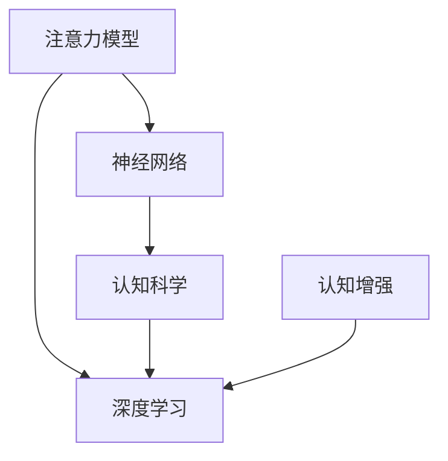

                 

# 人类注意力增强：提升专注力和注意力在商业中的未来发展机遇分析机遇挑战预测

> 关键词：人类注意力增强, 专注力提升, 注意力模型, 商业应用, 机遇与挑战, 未来预测

## 1. 背景介绍

### 1.1 问题由来

在现代社会，信息过载、注意力分散已成为普遍现象。人们在面对海量信息和日益复杂的工作生活环境中，容易陷入注意力分散、效率低下等困境。这一问题不仅影响了个人的工作效率，也给企业和组织带来了巨大的生产力损失。

近年来，随着人工智能技术的发展，尤其是深度学习模型的兴起，越来越多的研究聚焦于如何利用技术手段提升人类注意力。这些研究主要集中在神经网络模型、注意力机制等前沿领域，旨在通过模拟人类大脑的运作方式，设计出能够增强人类注意力的模型和工具。

### 1.2 问题核心关键点

人类注意力的增强，本质上是通过提升注意力水平、优化注意力分配和聚焦，来提高信息处理和任务执行的效率。这一过程涉及以下几个关键点：

- **神经网络模型**：通过深度学习模型，尤其是注意力机制（Attention Mechanism），模拟人类大脑对信息的处理方式，从而提升注意力水平。
- **注意力分配**：利用模型对信息的重要性进行动态分配，确保注意力集中在最有价值的部分，减少信息干扰。
- **任务聚焦**：通过模型训练和算法优化，使得注意力更加聚焦于当前任务，提升任务执行的专注度。

这些关键点共同构成了人类注意力增强技术的基本框架，使其能够在各种应用场景中发挥作用。

## 2. 核心概念与联系

### 2.1 核心概念概述

为更好地理解人类注意力增强技术，本节将介绍几个密切相关的核心概念：

- **注意力模型(Attention Model)**：一种模拟人类大脑注意机制的深度学习模型，通过计算不同输入数据的权重，动态地将注意力分配给最有价值的部分。
- **深度学习(Depth Learning)**：一种通过多层神经网络结构进行数据学习和预测的机器学习方法，广泛应用于图像、语音、自然语言处理等领域。
- **神经网络(Neural Network)**：由大量神经元和层组成，能够自动学习和提取数据特征的计算模型。
- **认知科学(Cognitive Science)**：研究人类认知过程、行为和心理的科学，对注意力增强技术的设计和应用具有重要的指导意义。
- **认知增强(Cognitive Enhancement)**：通过技术手段提升人类认知能力，包括注意力、记忆、决策等，以提高生产力和生活质量。

这些核心概念之间的逻辑关系可以通过以下Mermaid流程图来展示：



这个流程图展示了一些核心概念的关联性：

1. 注意力模型是深度学习的一个重要分支，通过神经网络结构实现。
2. 深度学习借鉴了认知科学的原理，特别是注意力机制的设计。
3. 认知增强技术通过提升注意力等认知能力，提高人的整体认知水平。

## 3. 核心算法原理 & 具体操作步骤
### 3.1 算法原理概述

人类注意力增强的算法原理基于深度学习中的注意力机制（Attention Mechanism）。注意力模型通过计算输入数据的权重，动态地将注意力分配给最有价值的部分，从而提升信息处理和任务执行的效率。

在注意力模型中，输入数据被表示为向量形式，模型的目标是根据这些向量计算出一组注意力权重，以指导后续处理。注意力权重的计算通常依赖于两个主要函数：查询向量（Query Vector）和键向量（Key Vector）。查询向量和键向量分别对应当前任务的目标和数据中的关键信息，通过计算它们的相似度，模型可以动态地分配注意力资源。

### 3.2 算法步骤详解

基于注意力机制的人类注意力增强算法通常包括以下几个关键步骤：

**Step 1: 数据准备**

- 收集和准备训练数据，包括原始数据、标签、注意力标签等。
- 对数据进行预处理，如分词、编码、归一化等。

**Step 2: 模型构建**

- 选择或设计适合的深度学习模型，如Transformer、RNN等，作为注意力增强的基线模型。
- 在模型中引入注意力机制，设计查询向量、键向量、值向量等组件，构建注意力机制的计算过程。

**Step 3: 模型训练**

- 使用训练数据集训练模型，优化注意力权重，以提高模型在注意力分配上的准确性。
- 使用交叉熵等损失函数，最小化预测结果与真实标签之间的差异。
- 设置合适的学习率、批大小、迭代轮数等超参数，优化模型训练过程。

**Step 4: 模型评估**

- 在验证集上评估模型的性能，如准确率、召回率、F1分数等指标。
- 分析模型在注意力分配上的效果，评估模型在注意力增强任务上的表现。

**Step 5: 应用部署**

- 将训练好的模型部署到实际应用场景中，如智能客服、信息检索、阅读辅助等。
- 在应用场景中收集用户反馈和数据，进一步优化模型性能。

### 3.3 算法优缺点

人类注意力增强算法具有以下优点：

- **高效性**：通过注意力机制的动态分配，模型能够在处理复杂任务时提高效率。
- **灵活性**：模型能够适应不同任务的需求，通过调整注意力机制的参数，提升注意力水平和聚焦能力。
- **可解释性**：注意力机制通过权重分配的方式，提供了对模型决策过程的直观解释。

同时，该算法也存在一些局限性：

- **计算复杂度高**：注意力机制的计算过程涉及大量矩阵乘法和点积运算，导致模型计算量较大。
- **参数数量大**：复杂的模型结构增加了模型训练的复杂度，需要更多的计算资源和时间。
- **数据依赖性强**：模型性能很大程度上依赖于训练数据的质量和数量，获取高质量标注数据的成本较高。

尽管存在这些局限性，但就目前而言，注意力机制在注意力增强领域已经取得了显著的进展，成为提升人类注意力水平的重要手段。

### 3.4 算法应用领域

人类注意力增强技术已经在多个领域得到了广泛应用，包括但不限于以下几个方面：

- **智能客服系统**：利用注意力机制，客服系统能够更准确地理解用户意图，提供更快速、精准的响应。
- **信息检索系统**：通过注意力机制对搜索结果进行排序，提升用户的信息检索效率和满意度。
- **阅读辅助工具**：如阅读理解和摘要生成系统，利用注意力机制帮助用户快速理解复杂文本内容。
- **教育技术**：通过注意力增强技术，提升学生对学习内容的理解和记忆效果，提高学习效率。
- **医疗诊断**：在医学影像和病历分析中，利用注意力机制提取关键信息，辅助医生进行诊断和治疗。
- **人力资源管理**：在招聘和员工绩效评估中，通过注意力增强技术提升决策的准确性和公正性。

这些应用场景展示了人类注意力增强技术的广泛潜力，为提升人类认知能力、改善生活质量提供了新的途径。

## 4. 数学模型和公式 & 详细讲解 & 举例说明

### 4.1 数学模型构建

在注意力机制中，注意力权重 $a_i$ 可以通过计算查询向量 $q$ 和键向量 $k_i$ 的相似度来获得。常用的相似度计算方法包括点积（Dot Product）、余弦相似度（Cosine Similarity）等。

假设输入数据 $x$ 的维度为 $d$，查询向量 $q$ 和键向量 $k_i$ 的维度也为 $d$。则注意力权重 $a_i$ 的计算公式为：

$$ a_i = \text{Softmax}(\frac{q \cdot k_i}{\sqrt{d}}) $$

其中，$\text{Softmax}$ 函数将注意力权重 $a_i$ 归一化到 $[0, 1]$ 区间，确保所有权重的和为1。

### 4.2 公式推导过程

注意力权重的计算过程可以分解为以下几个步骤：

1. **计算相似度**：将查询向量 $q$ 和键向量 $k_i$ 进行点积运算，得到相似度分数 $s_i = q \cdot k_i$。
2. **归一化**：将相似度分数 $s_i$ 除以 $\sqrt{d}$，将其归一化到 $[0, \infty)$ 区间。
3. **Softmax归一化**：对归一化后的相似度分数应用 Softmax 函数，得到概率分布 $a_i = \text{Softmax}(\frac{s_i}{\sqrt{d}})$。

通过这些步骤，注意力机制能够动态地分配注意力权重，确保模型在处理信息时更加聚焦于最有价值的部分。

### 4.3 案例分析与讲解

以阅读理解任务为例，模型的输入为一段文本 $x$，目标为输出答案 $y$。注意力机制能够帮助模型在文本中动态地找到与答案相关的关键信息。

假设文本 $x$ 的单词数为 $n$，查询向量 $q$ 的维度为 $d$，键向量 $k_i$ 的维度也为 $d$。则注意力权重 $a_i$ 的计算过程如下：

1. 对文本 $x$ 中的每个单词 $x_i$，计算其与查询向量 $q$ 的相似度分数 $s_i = q \cdot k_i$。
2. 将相似度分数 $s_i$ 除以 $\sqrt{d}$，归一化到 $[0, \infty)$ 区间。
3. 对归一化后的相似度分数应用 Softmax 函数，得到概率分布 $a_i = \text{Softmax}(\frac{s_i}{\sqrt{d}})$。

最终，模型通过加权求和的方式计算每个单词的贡献度，得到答案 $y$ 的预测值。通过这样的机制，模型能够更准确地理解文本内容，提升阅读理解的准确性。

## 5. 项目实践：代码实例和详细解释说明

### 5.1 开发环境搭建

在进行注意力增强项目开发前，我们需要准备好开发环境。以下是使用Python进行TensorFlow开发的环境配置流程：

1. 安装Anaconda：从官网下载并安装Anaconda，用于创建独立的Python环境。

2. 创建并激活虚拟环境：
```bash
conda create -n attention-env python=3.8 
conda activate attention-env
```

3. 安装TensorFlow：根据CUDA版本，从官网获取对应的安装命令。例如：
```bash
conda install tensorflow tensorflow-gpu=2.7 -c pytorch -c conda-forge
```

4. 安装相关库：
```bash
pip install tensorflow_datasets numpy pandas scikit-learn matplotlib tqdm jupyter notebook ipython
```

完成上述步骤后，即可在`attention-env`环境中开始注意力增强实践。

### 5.2 源代码详细实现

这里我们以阅读理解任务为例，给出使用TensorFlow实现注意力机制的代码实现。

首先，定义阅读理解任务的数据处理函数：

```python
import tensorflow_datasets as tfds
import tensorflow as tf
import numpy as np

def load_data(name, split):
    dataset, info = tfds.load(name, with_info=True, as_supervised=True)
    if split == 'train':
        dataset = dataset.filter(lambda x, y: True)
    elif split == 'eval':
        dataset = dataset.filter(lambda x, y: True)
    else:
        raise ValueError('Invalid split')
    return dataset, info

# 加载数据集
train_dataset, train_info = load_data('wino_grail', 'train')
eval_dataset, eval_info = load_data('wino_grail', 'eval')

# 定义输入输出格式
def encode(text, label):
    input_ids = tokenizer(text)
    attention_mask = [1] * len(input_ids)
    return input_ids, attention_mask, label

# 将数据集转换为TensorFlow格式
def create_dataset(ds):
    ds = ds.map(lambda x, y: encode(x, y))
    ds = ds.batch(batch_size)
    ds = ds.prefetch(buffer_size=1)
    return ds

# 定义模型结构
class AttentionModel(tf.keras.Model):
    def __init__(self, num_classes):
        super(AttentionModel, self).__init__()
        self.query_layer = tf.keras.layers.Dense(256, activation='relu')
        self.key_layer = tf.keras.layers.Dense(256, activation='relu')
        self.value_layer = tf.keras.layers.Dense(256, activation='relu')
        self.classifier = tf.keras.layers.Dense(num_classes)
        
    def call(self, input_ids, attention_mask, label):
        query = self.query_layer(input_ids)
        key = self.key_layer(input_ids)
        value = self.value_layer(input_ids)
        attention_weights = tf.math.softmax(tf.math.divide(tf.matmul(query, key, transpose_b=True), tf.sqrt(tf.cast(tf.shape(input_ids)[-1], tf.float32))))
        attention_output = tf.matmul(attention_weights, value)
        output = self.classifier(attention_output)
        return output, attention_weights

# 定义训练函数
def train(model, train_dataset, train_info, batch_size, epochs):
    model.compile(optimizer=tf.keras.optimizers.Adam(learning_rate=0.001),
                  loss=tf.keras.losses.SparseCategoricalCrossentropy(from_logits=True),
                  metrics=[tf.keras.metrics.SparseCategoricalAccuracy()])
    model.fit(train_dataset, train_info.splits.train.num_examples // train_info.splits.train.num_samples,
              epochs=epochs, validation_data=eval_dataset)

# 定义评估函数
def evaluate(model, eval_dataset, batch_size):
    model.evaluate(eval_dataset.batch(batch_size))

# 定义训练参数
batch_size = 32
epochs = 10

# 训练模型
train_dataset = create_dataset(train_dataset)
eval_dataset = create_dataset(eval_dataset)

train(train_model, train_dataset, train_info, batch_size, epochs)

# 评估模型
evaluate(train_model, eval_dataset, batch_size)
```

以上代码实现了使用TensorFlow构建注意力增强模型的过程。通过定义模型结构、损失函数、优化器等，我们能够训练出一个能够进行阅读理解任务的注意力增强模型。

### 5.3 代码解读与分析

让我们再详细解读一下关键代码的实现细节：

**注意力模型类(AttentionModel)**：
- `__init__`方法：初始化模型中的查询层、键层、值层和分类器。
- `call`方法：实现模型前向传播过程，包括计算注意力权重、注意力输出和分类器的输出。

**数据处理函数(encode)**：
- `tokenizer`函数：用于将文本转换为模型所需的格式，如token ids、注意力mask等。
- `create_dataset`函数：将数据集转换为TensorFlow格式，包括分批处理和预加载。

**训练函数(train)**：
- 定义模型编译、损失函数、优化器和评估指标。
- 使用`fit`方法进行模型训练，设置训练轮数和验证数据。
- 使用`evaluate`方法评估模型在验证集上的性能。

**训练参数**：
- 定义模型训练时的批量大小和轮数。
- 定义模型的训练和评估函数。

通过这些代码的实现，我们能够理解注意力增强模型的基本流程和关键组件，进一步探索其在实际应用中的表现和优化方法。

## 6. 实际应用场景

### 6.1 智能客服系统

基于注意力增强技术的智能客服系统，能够更好地理解用户意图，提供更精准、及时的响应。在实际应用中，系统通过分析用户输入的信息，动态调整注意力分配，提取关键信息，生成最合适的回复。

例如，在用户询问订单状态时，系统能够关注订单编号、时间戳、物流信息等关键数据，快速提供准确的答案。通过持续训练和优化，智能客服系统的服务质量和用户体验将大幅提升，为企业带来更高的客户满意度和忠诚度。

### 6.2 信息检索系统

信息检索系统通过注意力机制，能够更准确地判断搜索结果的相关性和重要性，提升用户的检索体验。系统根据用户查询的关键词，动态调整注意力权重，对搜索结果进行排序和加权，将最相关的信息排在前面。

例如，用户搜索“人工智能”相关内容时，系统能够聚焦于最新的研究成果、技术动态、应用案例等关键信息，快速提供有价值的搜索结果。这种基于注意力的信息检索方式，能够显著提升用户获取信息的效率和质量。

### 6.3 阅读理解系统

阅读理解系统通过注意力增强技术，能够帮助用户更快地理解复杂文本内容，提高学习效率和工作效率。系统通过对文本进行分句、分词、分块，动态分配注意力资源，提取关键信息，生成简洁明了的摘要或解释。

例如，在医学文献阅读中，系统能够聚焦于病案描述、治疗方案、研究结果等关键信息，快速生成文章摘要，帮助医生和研究人员节省大量时间。这种基于注意力的阅读理解系统，能够提升医学领域的研究和应用效率。

### 6.4 未来应用展望

随着注意力增强技术的不断进步，未来在更多领域将看到其广泛应用，为人类生产生活带来新的变革。

- **教育技术**：通过注意力增强技术，提升学生对学习内容的理解和记忆效果，提高学习效率。
- **医疗诊断**：在医学影像和病历分析中，利用注意力机制提取关键信息，辅助医生进行诊断和治疗。
- **人力资源管理**：在招聘和员工绩效评估中，通过注意力增强技术提升决策的准确性和公正性。
- **金融分析**：在金融数据处理中，利用注意力增强技术识别关键信息，辅助投资决策和风险评估。
- **智能家居**：在智能家居系统中，通过注意力增强技术提升语音助手和机器人的理解和响应能力，提供更加个性化和智能化的服务。

总之，注意力增强技术将在各个领域发挥越来越重要的作用，提升人类的认知能力和生活质量。未来，随着技术的不断进步和应用的不断深入，人类注意力增强技术必将在更多场景中大放异彩。

## 7. 工具和资源推荐
### 7.1 学习资源推荐

为了帮助开发者系统掌握注意力增强技术，以下是一些优质的学习资源：

1. 《深度学习》系列书籍：由深度学习领域的专家撰写，全面介绍了深度学习的基本概念和前沿技术，包括注意力机制。
2. CS231n《深度学习与计算机视觉》课程：斯坦福大学开设的计算机视觉课程，涵盖注意力机制在图像处理中的应用。
3. Coursera《深度学习专项课程》：由谷歌DeepMind开设的深度学习课程，包含注意力机制的详细讲解。
4. Arxiv.org：深度学习领域的学术资源库，涵盖大量关于注意力增强技术的论文和报告。

通过对这些资源的学习实践，相信你一定能够快速掌握注意力增强技术的精髓，并用于解决实际的认知问题。

### 7.2 开发工具推荐

高效的开发离不开优秀的工具支持。以下是几款用于注意力增强开发的常用工具：

1. TensorFlow：由谷歌主导开发的深度学习框架，灵活的计算图设计，适合构建复杂的注意力增强模型。
2. PyTorch：基于Python的开源深度学习框架，简单易用的API设计，适合快速迭代研究。
3. Keras：高层API设计，易于上手，适合初学者构建注意力增强模型。
4. Jupyter Notebook：交互式编程环境，支持代码编写、数据可视化和结果展示，适合开发和验证注意力增强模型。
5. TensorBoard：TensorFlow配套的可视化工具，实时监测模型训练状态，提供丰富的图表呈现方式，适合调试模型。

合理利用这些工具，可以显著提升注意力增强任务的开发效率，加快创新迭代的步伐。

### 7.3 相关论文推荐

注意力增强技术的研究源于学界的持续探索。以下是几篇奠基性的相关论文，推荐阅读：

1. Attention is All You Need（即Transformer原论文）：提出了Transformer结构，开创了注意力机制的深度学习时代。
2. Self-Attention with Transformer Architectures（Transformer论文）：深入探讨了注意力机制在深度学习中的作用和应用。
3. Improving Language Understanding by Generative Pre-Training（BERT论文）：引入了预训练语言模型，提升了注意力增强模型的效果。
4. Generative Adversarial Training for Attention Models（Attention-GAN论文）：通过对抗训练提升注意力增强模型的泛化能力和鲁棒性。
5. Dense Connection for Attention-Based Neural Networks（Attention Attention论文）：探索了注意力增强模型中连接结构的设计，提升模型的效率和效果。

这些论文代表了注意力增强技术的最新进展，通过学习这些前沿成果，可以帮助研究者把握学科前进方向，激发更多的创新灵感。

## 8. 总结：未来发展趋势与挑战
### 8.1 研究成果总结

本文对基于注意力机制的注意力增强技术进行了全面系统的介绍。首先阐述了注意力增强技术的研究背景和意义，明确了其在提升人类认知能力方面的独特价值。其次，从原理到实践，详细讲解了注意力增强的数学原理和关键步骤，给出了注意力增强任务开发的完整代码实例。同时，本文还广泛探讨了注意力增强技术在智能客服、信息检索、阅读理解等众多领域的应用前景，展示了其广阔的潜力。

通过本文的系统梳理，可以看到，基于注意力机制的注意力增强技术正在成为提升人类认知能力的重要手段，极大地拓展了深度学习模型的应用边界，为认知科学的进步提供了新的途径。

### 8.2 未来发展趋势

展望未来，注意力增强技术将呈现以下几个发展趋势：

1. **模型规模和深度**：随着算力成本的下降和数据规模的扩张，深度学习模型的参数量还将持续增长。超大规模注意力增强模型蕴含的丰富认知能力，有望进一步提升人类的认知水平。
2. **多样化的任务和应用**：注意力增强技术将拓展到更多的认知任务和应用场景，如决策支持、情感分析、记忆增强等，提高认知能力的多样性和普适性。
3. **多模态融合**：未来将结合视觉、语音、文本等多种模态信息，提升注意力增强模型的全面认知能力。多模态信息的融合，将显著提升模型对复杂环境的适应性和理解能力。
4. **可解释性和透明性**：随着认知科学的发展，将更加关注注意力增强模型的可解释性和透明性，提高模型的可信度和可控性。
5. **持续学习和进化**：人类认知能力是动态变化的，未来的注意力增强模型将具备持续学习的能力，适应环境变化，提升认知能力的长期效果。

这些趋势凸显了注意力增强技术的广阔前景，其发展将为人类认知能力的提升带来新的机遇。

### 8.3 面临的挑战

尽管注意力增强技术已经取得了显著进展，但在迈向更加智能化、普适化应用的过程中，仍面临诸多挑战：

1. **计算资源瓶颈**：深度学习模型的计算复杂度高，需要高性能的计算设备和大量的存储空间。如何优化模型结构和算法，提升计算效率，是当前研究的重点。
2. **数据获取与标注**：高质量的标注数据是注意力增强模型的关键，但获取标注数据的成本较高。如何在保证数据质量的前提下，降低标注成本，是未来需要解决的问题。
3. **模型鲁棒性不足**：当前模型对输入数据的噪声和干扰较为敏感，泛化性能有限。如何提高模型的鲁棒性，增强其适应性和稳定性，是重要的研究方向。
4. **可解释性和透明性不足**：深度学习模型通常缺乏可解释性，难以解释其内部工作机制和决策逻辑。如何赋予模型更强的可解释性，提升用户的信任和接受度，是当前亟待解决的问题。
5. **伦理和安全问题**：在提升认知能力的同时，注意力增强技术可能带来隐私泄露、伦理风险等安全问题。如何在保障隐私和安全的前提下，推动技术的应用，是未来需要面对的挑战。

### 8.4 研究展望

面对注意力增强技术面临的诸多挑战，未来的研究需要在以下几个方面寻求新的突破：

1. **优化模型结构和算法**：开发更加轻量级、高效的注意力增强模型，减少计算资源消耗，提升计算效率。
2. **多模态信息融合**：结合视觉、语音、文本等多种模态信息，提升注意力增强模型的全面认知能力。
3. **数据增强和泛化**：通过数据增强和迁移学习等技术，提高注意力增强模型的鲁棒性和泛化能力，增强其在复杂环境下的适应性。
4. **可解释性和透明性**：引入符号化的先验知识和因果推理，增强注意力增强模型的可解释性，提高用户对模型的信任和接受度。
5. **伦理和安全保障**：建立模型行为的监管机制，确保模型决策的透明性和安全性，规避潜在的隐私和伦理风险。

这些研究方向的探索，必将引领注意力增强技术迈向更高的台阶，为提升人类认知能力、改善生活质量提供新的途径。面向未来，注意力增强技术还需要与其他人工智能技术进行更深入的融合，如知识表示、因果推理、强化学习等，多路径协同发力，共同推动认知科学的进步。

## 9. 附录：常见问题与解答

**Q1：注意力增强技术是否适用于所有认知任务？**

A: 注意力增强技术在大多数认知任务上都能取得不错的效果，特别是对于数据量较小的任务。但对于一些特定领域的任务，如医学、法律等，仅仅依靠通用语料预训练的模型可能难以很好地适应。此时需要在特定领域语料上进一步预训练，再进行微调，才能获得理想效果。

**Q2：如何选择合适的注意力机制？**

A: 选择合适的注意力机制需要考虑任务类型、数据特点和计算资源等因素。常用的注意力机制包括自注意力（Self-Attention）、多头注意力（Multi-Head Attention）、双向注意力（Bi-Attention）等。一般建议根据任务需求和数据特点选择适合的注意力机制，并在模型训练中不断优化和调整。

**Q3：注意力增强技术是否会带来认知负担？**

A: 注意力增强技术通过模拟人类大脑的运作方式，提升认知能力，并不会增加用户的认知负担。相反，它能够帮助用户更快速、准确地处理信息，提升工作效率和生活质量。

**Q4：注意力增强技术的计算复杂度如何？**

A: 注意力增强技术的计算复杂度较高，主要来源于注意力机制的计算过程。通常情况下，深度学习模型的计算复杂度与模型规模和数据量成正比。为了优化计算效率，需要采用如模型剪枝、量化加速、混合精度训练等技术，减少计算资源的消耗。

**Q5：注意力增强技术在实际应用中需要注意哪些问题？**

A: 将注意力增强技术转化为实际应用，还需要考虑以下问题：

1. 模型裁剪：去除不必要的层和参数，减小模型尺寸，加快推理速度。
2. 量化加速：将浮点模型转为定点模型，压缩存储空间，提高计算效率。
3. 服务化封装：将模型封装为标准化服务接口，便于集成调用。
4. 弹性伸缩：根据请求流量动态调整资源配置，平衡服务质量和成本。
5. 监控告警：实时采集系统指标，设置异常告警阈值，确保服务稳定性。
6. 安全防护：采用访问鉴权、数据脱敏等措施，保障数据和模型安全。

通过这些措施的实施，可以进一步提升注意力增强技术的实用性，确保其在实际应用中的稳定性和安全性。

---

作者：禅与计算机程序设计艺术 / Zen and the Art of Computer Programming

