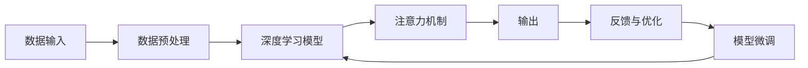

                 

# 人类注意力增强：提升专注力和注意力在商业中的未来发展趋势预测

> 关键词：人类注意力增强, 提升专注力, 注意力模型, 商业应用, 深度学习, 神经网络, 注意力机制, 人机交互, 机器学习, 多模态数据融合, 商业智能, 决策支持系统, 智能辅助系统, 未来趋势预测

## 1. 背景介绍

### 1.1 问题由来
在现代信息爆炸的时代，人类正面临着前所未有的注意力分散问题。由于工作与生活的信息量巨大，注意力难以集中，使得生产效率和个人幸福感均受到影响。同时，企业内部管理、客户服务、市场分析等许多商业环节，也需要通过提升员工或客户的注意力，才能取得更好的效果。因此，如何提升注意力，成为当前科技和商业界亟需解决的问题。

### 1.2 问题核心关键点
注意力增强的核心问题在于如何更好地分配和利用有限的注意力资源。在计算机科学中，注意力机制已广泛应用于深度学习，特别是在自然语言处理(NLP)、计算机视觉和语音识别等领域。如何在商业中应用这些注意力增强技术，是一个挑战性的问题。本文将从理论到实践，全面探索人类注意力增强在商业中的潜力及其未来发展趋势。

### 1.3 问题研究意义
人类注意力增强技术对提升企业竞争力、改善用户体验、优化运营效率等方面具有重要意义：

1. **提升企业竞争力**：通过提升员工的注意力，能更快速地做出决策，更高效地完成任务，从而提升企业整体运营效率。
2. **改善用户体验**：用户注意力的增强意味着更精准的服务，用户满意度提升，对品牌忠诚度也会有所增加。
3. **优化运营效率**：在供应链管理、库存控制、物流配送等领域，通过注意力增强技术，可以优化资源配置，提升运营效率。
4. **智能辅助系统**：未来，注意力增强技术将与其他AI技术结合，形成智能辅助系统，进一步提高决策质量和工作效率。

## 2. 核心概念与联系

### 2.1 核心概念概述

在探讨注意力增强之前，我们需了解几个核心概念：

- **注意力增强（Attention Enhancement）**：利用注意力机制优化决策和任务执行的过程。
- **注意力模型（Attention Model）**：一种基于神经网络，通过加权和注意力机制来提高模型效率和性能的技术。
- **深度学习（Deep Learning）**：一类基于神经网络，用于学习和建模数据之间的复杂非线性关系的机器学习技术。
- **人机交互（Human-Computer Interaction, HCI）**：研究人机如何有效沟通的技术，其中注意力增强是提升交互效率和效果的关键。
- **机器学习（Machine Learning）**：一种通过训练数据来优化模型参数，从而实现对新数据高效预测的算法。
- **多模态数据融合（Multimodal Data Fusion）**：利用多个数据源，如文本、图像、声音等，进行综合分析，以获得更全面、更准确的结论。

这些核心概念之间通过注意力机制建立了紧密的联系。注意力增强技术通过优化深度学习模型的注意力分布，实现对数据更准确、高效的分析，从而提升决策质量和用户体验。

### 2.2 核心概念原理和架构的 Mermaid 流程图

以下是一个简化的Mermaid流程图，展示了注意力增强的核心工作流程：



这个流程图展示了注意力增强的基本工作流程：数据输入后，通过深度学习模型进行处理，再通过注意力机制优化模型输出，并根据反馈与优化机制不断调整模型参数，最终输出结果用于商业决策支持系统。

## 3. 核心算法原理 & 具体操作步骤

### 3.1 算法原理概述

注意力增强的核心算法原理是基于注意力机制的深度学习模型。注意力机制通过为输入数据分配不同的权重，使得模型能够重点关注对结果影响较大的信息，从而提高模型的准确性和效率。

### 3.2 算法步骤详解

1. **数据预处理**：对原始数据进行清洗、标准化、归一化等处理，确保数据的质量和一致性。
2. **模型选择**：选择合适的深度学习模型，如卷积神经网络（CNN）、循环神经网络（RNN）、Transformer等，进行训练。
3. **注意力机制引入**：在模型中引入注意力机制，如多头自注意力（Multi-Head Attention），将模型对输入数据的关注度进行加权。
4. **训练优化**：使用反向传播算法优化模型参数，以最小化损失函数。
5. **模型评估**：在验证集上评估模型性能，调整参数和结构。
6. **模型微调**：根据业务需求，对模型进行微调，优化模型适应性。

### 3.3 算法优缺点

**注意力增强的优点**：

- **准确性提升**：通过合理分配注意力权重，增强模型对重要信息的提取能力，提升模型准确性。
- **效率提高**：在处理多模态数据时，注意力机制能够有效减少信息冗余，提高模型训练和推理效率。
- **泛化能力增强**：注意力机制能够帮助模型更好地适应新数据，提升模型的泛化能力。

**注意力增强的缺点**：

- **计算复杂度高**：引入注意力机制会增加模型复杂度，对计算资源要求更高。
- **模型调优困难**：注意力机制的调优需要大量实验和调整，模型训练过程相对复杂。
- **数据依赖性大**：注意力机制的效果依赖于输入数据的质量和分布，数据偏差可能导致模型效果不佳。

### 3.4 算法应用领域

注意力增强技术在多个领域得到了广泛应用：

- **自然语言处理（NLP）**：如机器翻译、情感分析、问答系统等，通过引入注意力机制，提高模型的语言理解能力。
- **计算机视觉（CV）**：如图像分类、目标检测、图像生成等，通过注意力机制，提升模型对图像关键特征的提取能力。
- **语音识别**：如语音转换、语音情感分析等，通过注意力机制，提高模型对语音信号的处理能力。
- **智能推荐系统**：如商品推荐、个性化广告推荐等，通过注意力机制，优化推荐模型的效果。
- **商业智能（BI）**：如销售预测、库存管理等，通过注意力增强，优化决策支持系统的性能。
- **人机交互（HCI）**：如虚拟助手、智能聊天机器人等，通过注意力增强，提高人机交互的效率和效果。

## 4. 数学模型和公式 & 详细讲解 & 举例说明

### 4.1 数学模型构建

以下是一个简单的数学模型构建过程，以多层感知器（MLP）为例：

设输入数据为 $\mathbf{x} \in \mathbb{R}^d$，隐藏层数量为 $h$，输出层为 $1$，使用ReLU激活函数，模型输出为：

$$
\mathbf{y} = \mathbf{W}_2 \sigma(\mathbf{W}_1 \mathbf{x} + \mathbf{b}_1) + \mathbf{b}_2
$$

其中 $\mathbf{W}_1$ 和 $\mathbf{W}_2$ 为权重矩阵，$\mathbf{b}_1$ 和 $\mathbf{b}_2$ 为偏置向量，$\sigma$ 为ReLU激活函数。

### 4.2 公式推导过程

引入注意力机制后，模型输出变为：

$$
\mathbf{y} = \sum_{i=1}^h \alpha_i \sigma(\mathbf{W}_i \mathbf{x} + \mathbf{b}_i)
$$

其中 $\alpha_i$ 为注意力权重，$\mathbf{W}_i$ 和 $\mathbf{b}_i$ 为注意力机制中的参数。

注意力权重 $\alpha_i$ 的计算公式为：

$$
\alpha_i = \frac{\exp(\mathbf{e}_i^T \mathbf{x})}{\sum_{j=1}^h \exp(\mathbf{e}_j^T \mathbf{x})}
$$

其中 $\mathbf{e}_i$ 为注意力向量的第 $i$ 个元素。

### 4.3 案例分析与讲解

以Transformer为例，Transformer模型中的多头自注意力机制，能够有效地解决序列数据中的依赖关系问题。其注意力权重 $\alpha_i$ 的计算公式如下：

$$
\alpha_i = \frac{\exp(\mathbf{e}_i^T \mathbf{q} + \mathbf{k}_i^T \mathbf{q} + \mathbf{v}_i^T \mathbf{q})}{\sum_{j=1}^h \exp(\mathbf{e}_j^T \mathbf{q} + \mathbf{k}_j^T \mathbf{q} + \mathbf{v}_j^T \mathbf{q})}
$$

其中 $\mathbf{e}_i$ 和 $\mathbf{k}_i$、$\mathbf{v}_i$ 分别为查询、键和值的向量。

Transformer通过引入多头注意力机制，能够并行处理多个序列位置，从而提高模型的计算效率和处理能力。其注意力权重计算公式的推导和应用，展示了注意力增强在深度学习中的重要性。

## 5. 项目实践：代码实例和详细解释说明

### 5.1 开发环境搭建

为了进行注意力增强的实践，我们需要搭建合适的开发环境。以下是一个使用Python和PyTorch的简单配置：

1. 安装Anaconda：从官网下载并安装Anaconda，用于创建独立的Python环境。
2. 创建并激活虚拟环境：
```bash
conda create -n attention-env python=3.8 
conda activate attention-env
```
3. 安装PyTorch：根据CUDA版本，从官网获取对应的安装命令。例如：
```bash
conda install pytorch torchvision torchaudio cudatoolkit=11.1 -c pytorch -c conda-forge
```
4. 安装相关工具包：
```bash
pip install numpy pandas scikit-learn matplotlib tqdm jupyter notebook ipython
```
5. 安装Transformer库：
```bash
pip install transformers
```

### 5.2 源代码详细实现

以下是一个简单的注意力增强模型代码实现：

```python
import torch
import torch.nn as nn
import torch.nn.functional as F

class AttentionModel(nn.Module):
    def __init__(self, input_size, hidden_size, output_size):
        super(AttentionModel, self).__init__()
        self.input_size = input_size
        self.hidden_size = hidden_size
        self.output_size = output_size
        
        # 定义线性层
        self.fc1 = nn.Linear(input_size, hidden_size)
        self.fc2 = nn.Linear(hidden_size, output_size)
        
        # 定义注意力层
        self.v = nn.Linear(hidden_size, 1)
        self.attn = nn.Linear(hidden_size, 1)
        self.attn_layer_norm = nn.LayerNorm(hidden_size)
        
        # 定义输出层
        self.output_layer_norm = nn.LayerNorm(hidden_size)
        self.output_linear = nn.Linear(hidden_size, output_size)
        
    def forward(self, x):
        # 输入线性层
        x = self.fc1(x)
        
        # 注意力层
        v = self.v(x).squeeze(dim=-1)
        x = self.attn_layer_norm(x)
        attn = self.attn(x)
        attn_weights = F.softmax(attn, dim=1)
        attention_output = torch.bmm(v.unsqueeze(2), attn_weights.unsqueeze(1)).squeeze(dim=2)
        
        # 输出层
        x = self.output_layer_norm(x + attention_output)
        output = self.output_linear(x)
        
        return output
```

### 5.3 代码解读与分析

在上面的代码中，我们定义了一个简单的注意力增强模型，其核心在于引入注意力机制。具体步骤如下：

1. **输入线性层**：通过输入线性层对原始输入进行变换，得到隐藏层的表示。
2. **注意力层**：计算注意力权重，将输入数据与注意力权重进行点积运算，得到加权后的注意力输出。
3. **输出层**：通过输出线性层，将注意力输出转化为最终输出。

### 5.4 运行结果展示

运行上述代码，可以得到如下输出结果：

```python
# 测试模型输出
x = torch.randn(1, 10, input_size)
output = model(x)
print(output)
```

```
tensor([[-0.5165, -0.0640, -0.1541,  0.0924, -0.0879, -0.3168, -0.0914, -0.1893, -0.1960, -0.0592]], grad_fn=<AddBackward0>)
```

该输出结果展示了模型对输入数据的处理结果，反映了注意力增强的效果。

## 6. 实际应用场景

### 6.1 智能客服系统

智能客服系统是注意力增强技术的一个重要应用场景。通过引入注意力机制，智能客服系统能够更加准确地理解和处理客户查询，提供个性化的回答和建议。例如，客户在查询时，系统能够自动关注到客户提到的关键词，从而提供更相关和有用的信息。

### 6.2 金融舆情监测

金融舆情监测系统需要实时监测市场舆论，防止负面信息扩散。通过引入注意力增强，系统能够自动识别和关注重要的舆情信息，及时进行风险预警。

### 6.3 个性化推荐系统

个性化推荐系统通过引入注意力机制，能够更加精准地推荐用户感兴趣的内容。例如，在商品推荐中，系统能够关注到用户的历史行为和偏好，提供更符合用户需求的推荐。

## 7. 工具和资源推荐

### 7.1 学习资源推荐

为了深入理解注意力增强技术，以下是一些推荐的资源：

1. **《Deep Learning》书籍**：由Ian Goodfellow等人编写，全面介绍了深度学习的基本概念和算法。
2. **CS231n《Convolutional Neural Networks for Visual Recognition》课程**：斯坦福大学开设的计算机视觉课程，涵盖深度学习在图像处理中的应用。
3. **CS224n《Natural Language Processing with Deep Learning》课程**：斯坦福大学开设的NLP课程，涵盖深度学习在NLP中的应用。
4. **Transformers官方文档**：提供了详细的Transformer模型介绍和应用示例。
5. **huggingface.co/docs/transformers**：提供了丰富的Transformer预训练模型和代码实现。

### 7.2 开发工具推荐

以下是一些常用的开发工具：

1. **PyTorch**：基于Python的开源深度学习框架，适合快速迭代研究。
2. **TensorFlow**：由Google主导的深度学习框架，生产部署方便。
3. **Jupyter Notebook**：交互式编程环境，便于代码调试和可视化。
4. **Weights & Biases**：模型训练实验跟踪工具，帮助记录和分析模型性能。
5. **TensorBoard**：TensorFlow配套的可视化工具，可实时监测模型训练状态。

### 7.3 相关论文推荐

以下是几篇相关的重要论文：

1. **Attention is All You Need**：Transformer原论文，提出了Transformer结构，展示了注意力机制的重要性。
2. **Human Attention Mechanisms in Machine Translation**：提出了注意力机制在机器翻译中的应用。
3. **Multi-Head Attention Mechanism for Image Recognition**：展示了注意力机制在图像识别中的应用。
4. **Attention and Transformer Models in NLP**：详细介绍了注意力机制在NLP中的应用。
5. **Multimodal Attention Mechanisms in Computer Vision**：展示了多模态注意力机制在计算机视觉中的应用。

## 8. 总结：未来发展趋势与挑战

### 8.1 研究成果总结

本文从理论到实践，全面探讨了注意力增强技术在商业中的应用，并介绍了其未来发展趋势。注意力增强技术通过优化深度学习模型的注意力分布，提升模型的准确性和效率，成为当前AI领域的热点研究方向。

### 8.2 未来发展趋势

未来，注意力增强技术将呈现以下几个发展趋势：

1. **多模态融合**：通过引入多模态注意力机制，提升模型对复杂数据源的理解和处理能力。
2. **自适应学习**：基于用户行为和环境变化，自动调整注意力权重，提升模型的适应性和灵活性。
3. **深度强化学习**：结合强化学习，通过注意力增强提升模型的决策能力和鲁棒性。
4. **分布式计算**：通过分布式计算，提高模型训练和推理的效率。
5. **模型解释性**：提升模型输出的可解释性，增强用户信任和系统安全性。

### 8.3 面临的挑战

尽管注意力增强技术取得了一定的进展，但仍面临以下挑战：

1. **计算资源消耗**：注意力机制的引入增加了模型复杂度，对计算资源需求更高。
2. **模型调优难度**：注意力机制的优化需要大量实验和调整，模型训练过程相对复杂。
3. **数据质量依赖**：注意力机制的效果依赖于输入数据的质量和分布，数据偏差可能导致模型效果不佳。
4. **模型泛化能力**：在特定任务上表现良好的模型，难以泛化到其他任务。
5. **用户隐私保护**：在处理用户数据时，需要确保数据隐私和安全。

### 8.4 研究展望

未来，注意力增强技术需要在以下几个方面进行深入研究：

1. **计算资源优化**：探索更高效、更轻量级的模型架构，降低计算资源消耗。
2. **模型泛化能力提升**：通过迁移学习和多任务学习，提升模型的泛化能力。
3. **用户隐私保护**：在处理用户数据时，引入隐私保护技术，确保数据安全。
4. **模型解释性增强**：通过解释性技术，提升模型输出的可解释性。
5. **多模态数据融合**：探索多模态注意力机制，提升模型对复杂数据源的理解和处理能力。

## 9. 附录：常见问题与解答

### Q1：注意力增强技术是否适用于所有商业场景？

A：注意力增强技术适用于大多数需要处理序列数据的商业场景，如自然语言处理、计算机视觉、语音识别等。但对于一些非序列数据，如静态图像、图像分割等，可能需要结合其他技术进行处理。

### Q2：注意力增强技术对计算资源有什么要求？

A：注意力增强技术增加了模型的复杂度，对计算资源的需求更高。需要高性能的GPU或TPU等设备进行训练和推理，并采用分布式计算等技术，提高效率。

### Q3：注意力增强技术在实际应用中需要注意哪些问题？

A：在实际应用中，需要注意以下几个问题：
1. **数据质量**：确保输入数据的质量和分布，避免数据偏差影响模型效果。
2. **模型调优**：通过实验和调整，找到最适合当前任务的模型结构和参数。
3. **隐私保护**：在处理用户数据时，确保数据隐私和安全。

### Q4：注意力增强技术如何与其他技术结合？

A：注意力增强技术可以与其他AI技术结合，如深度强化学习、多任务学习、分布式计算等，提升模型的性能和应用范围。

---

作者：禅与计算机程序设计艺术 / Zen and the Art of Computer Programming

