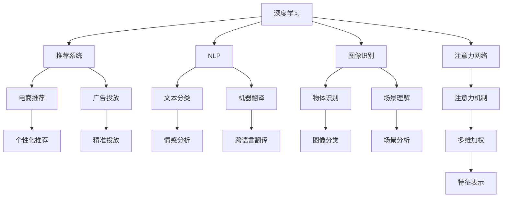

                 

# 人类注意力增强：提升专注力和注意力在商业中的未来展望

> 关键词：人类注意力增强, 提升专注力, 注意力机制, 商业应用, 人工智能, 注意力网络, 神经网络

## 1. 背景介绍

### 1.1 问题由来
在信息爆炸的时代，人类面对海量信息的筛选与处理，注意力资源变得愈加珍贵。如何高效利用有限的注意力资源，成为提升信息处理效率和决策质量的关键。

注意力机制在深度学习中的崛起，为这一问题的解决带来了新的希望。深度神经网络中的注意力机制，能够动态地对输入信息进行加权，使得模型能够专注于与任务相关的部分，忽略无关或噪声信息，显著提升模型的鲁棒性和泛化能力。

在商业领域，注意力机制已经广泛应用于推荐系统、自然语言处理、图像识别等多个方向，带来显著的业务价值提升。从电商个性化推荐到广告投放优化，再到语音识别和机器翻译，注意力机制不断拓宽应用边界，引领AI技术向着更加智能化、普适化的方向发展。

### 1.2 问题核心关键点
注意力机制在深度学习中的应用，本质上是模型在输入空间对不同特征进行加权求和，以得到更加精准的特征表示。其核心思想是：通过对输入特征赋予不同的重要性权重，使得模型可以更加关注与任务相关的部分，忽略无关或噪声信息。

在注意力机制中，有三个关键的组成部分：注意力权重、加权求和和多头注意力。注意力权重决定了哪些特征更加重要，加权求和则通过对这些特征进行加权，得到最终的表示，而多头注意力则是在多维度上同时进行特征加权，提高模型的表征能力。

注意力机制的引入，使得深度神经网络能够更加灵活地处理复杂任务，不仅提高了模型的精度，也显著减少了计算资源和标注数据的需求。在未来，随着注意力机制的持续演进和应用拓展，其在商业中的应用潜力将会进一步释放，推动人机交互的智能化进程。

## 2. 核心概念与联系

### 2.1 核心概念概述

为更好地理解注意力机制及其在商业中的应用，本节将介绍几个关键概念：

- **注意力机制(Attention Mechanism)**：深度学习中的一种机制，通过对输入数据的不同部分赋予不同权重，实现对关键信息的重点关注，忽略无关信息，提升模型的表示能力。
- **深度学习**：一类基于神经网络的机器学习技术，通过多层次的非线性变换，从原始数据中提取出高层次的特征表示。
- **推荐系统**：一种通过数据分析和机器学习算法，为用户推荐可能感兴趣的商品或内容的系统，广泛应用于电商、社交媒体等领域。
- **自然语言处理(NLP)**：涉及计算机理解和生成自然语言的技术，包括文本分类、机器翻译、情感分析等任务。
- **图像识别**：计算机视觉领域的一项重要任务，通过深度学习算法识别和理解图像中的物体、场景等。
- **注意力网络(Attention Network)**：一种特殊类型的神经网络，其结构和训练目标都围绕注意力机制进行设计，以提升模型的表现和效率。

这些概念之间的联系可以通过以下Mermaid流程图来展示：



这个流程图展示了深度学习中的注意力机制是如何与其他AI应用领域相联系，并应用于具体的商业场景的。

## 3. 核心算法原理 & 具体操作步骤

### 3.1 算法原理概述

注意力机制的核心理念是通过对输入数据的加权，实现对关键信息的重点关注，忽略无关信息。其基本框架包括以下几个步骤：

1. 计算注意力权重：根据输入数据的特征，计算不同部分的重要性权重。
2. 加权求和：将输入数据的不同部分按照权重加权，得到最终的特征表示。
3. 多头注意力：在多维度上同时进行特征加权，提高模型的表征能力。

在计算注意力权重时，通常使用点积或注意力函数(如Softmax)进行计算，通过对输入数据的表示进行相似度计算，得到注意力权重。加权求和则通过对不同特征进行加权，得到最终特征表示。多头注意力则是在不同维度上进行特征加权，提升模型的表征能力。

### 3.2 算法步骤详解

以一个简单的注意力机制为例，介绍其具体的计算步骤：

1. 计算查询向量 $Q$：将输入数据 $X$ 的表示 $x$ 线性映射为 $Q$。
2. 计算键向量 $K$ 和值向量 $V$：将输入数据 $X$ 的表示 $x$ 线性映射为 $K$ 和 $V$，分别代表键和值。
3. 计算注意力权重 $a$：通过计算 $Q$ 和 $K$ 的点积，并使用Softmax函数进行归一化，得到注意力权重 $a$。
4. 计算加权值向量 $C$：将 $V$ 乘以注意力权重 $a$，得到加权值向量 $C$。
5. 计算最终特征表示 $H$：将 $C$ 与 $x$ 进行加权求和，得到最终特征表示 $H$。

使用数学公式表达，假设 $x_i$ 为输入数据的第 $i$ 个特征表示，$W^Q$、$W^K$ 和 $W^V$ 为线性映射的权重矩阵，则注意力计算过程可以表示为：

$$
Q = xW^Q \\
K = xW^K \\
V = xW^V \\
a_i = \frac{e^{Q_i^TK_i}}{\sum_{j=1}^Je^{Q_j^TK_j}} \\
C = a_iV \\
H = C + x
$$

其中 $e$ 为自然对数底数，$Q_i$ 和 $K_i$ 分别为 $Q$ 和 $K$ 的第 $i$ 个元素，$a_i$ 为注意力权重，$C$ 为加权值向量，$H$ 为最终特征表示。

### 3.3 算法优缺点

注意力机制在深度学习中的应用，具有以下优点：

1. **提高模型精度**：通过对输入数据的不同部分赋予不同的重要性权重，使得模型能够专注于与任务相关的部分，忽略无关或噪声信息，显著提升模型的鲁棒性和泛化能力。
2. **减少计算资源需求**：与全连接层相比，注意力机制只需要计算权重，计算复杂度显著降低，提高模型的训练效率。
3. **降低标注数据需求**：由于注意力机制能够自动提取关键特征，减少了对大量标注数据的依赖。
4. **可解释性强**：注意力权重能够直观地展示模型在输入数据中关注的重点，便于解释和调试。

同时，注意力机制也存在一些局限性：

1. **计算复杂度高**：在输入数据较大时，注意力计算的复杂度可能会增加。
2. **易过拟合**：由于注意力机制依赖于输入数据的特征，过度关注某些关键特征可能会导致过拟合。
3. **训练难度高**：注意力机制的训练过程需要优化多个参数，且计算量较大，需要较强的计算资源。

### 3.4 算法应用领域

注意力机制在深度学习中的应用已经非常广泛，涵盖以下几个主要领域：

- **自然语言处理(NLP)**：广泛应用于文本分类、情感分析、机器翻译、问答系统等任务，显著提升模型的理解和生成能力。
- **计算机视觉(CV)**：用于图像识别、物体检测、场景理解等任务，通过多尺度注意力机制，提高模型对复杂场景的理解能力。
- **推荐系统**：用于电商推荐、广告投放等场景，通过用户-物品注意力机制，提高推荐系统的个性化和精准度。
- **语音识别**：用于语音信号的处理和理解，通过时间-频率注意力机制，提升语音识别的准确性。
- **时间序列分析**：用于预测和分析时间序列数据，通过动态时间注意力机制，捕捉时间序列中的关键信息。

这些领域中，注意力机制已经取得了显著的应用成果，为深度学习的发展注入了新的动力。未来，随着注意力机制的持续演进和应用拓展，其在商业中的应用潜力将会进一步释放，推动人机交互的智能化进程。

## 4. 数学模型和公式 & 详细讲解 & 举例说明

### 4.1 数学模型构建

本节将使用数学语言对注意力机制及其在深度学习中的应用进行更加严格的刻画。

设输入数据 $X$ 的表示为 $x \in \mathbb{R}^n$，线性映射权重矩阵分别为 $W^Q$、$W^K$ 和 $W^V$。假设 $Q$、$K$ 和 $V$ 分别为输入数据 $x$ 的查询向量、键向量和值向量，则注意力计算过程可以表示为：

$$
Q = xW^Q \\
K = xW^K \\
V = xW^V \\
a_i = \frac{e^{Q_i^TK_i}}{\sum_{j=1}^Je^{Q_j^TK_j}} \\
C = a_iV \\
H = C + x
$$

其中 $e$ 为自然对数底数，$Q_i$ 和 $K_i$ 分别为 $Q$ 和 $K$ 的第 $i$ 个元素，$a_i$ 为注意力权重，$C$ 为加权值向量，$H$ 为最终特征表示。

### 4.2 公式推导过程

以一个简单的注意力机制为例，介绍其具体的推导过程。

假设输入数据 $x$ 的表示为 $x_i$，线性映射权重矩阵分别为 $W^Q$、$W^K$ 和 $W^V$。则查询向量 $Q$、键向量 $K$ 和值向量 $V$ 可以表示为：

$$
Q = W^Qx_i \\
K = W^Kx_i \\
V = W^Vx_i
$$

注意力权重 $a_i$ 的计算过程如下：

$$
a_i = \frac{e^{Q_i^TK_i}}{\sum_{j=1}^Je^{Q_j^TK_j}}
$$

将 $K$ 和 $Q$ 的点积代入注意力权重公式，可以进一步简化为：

$$
a_i = \frac{e^{v_i^Tk_i}}{\sum_{j=1}^Je^{v_j^tk_j}}
$$

其中 $v_i$ 和 $k_i$ 分别为 $V$ 和 $K$ 的第 $i$ 个元素。

加权值向量 $C$ 的计算过程如下：

$$
C = a_iV
$$

最终特征表示 $H$ 的计算过程如下：

$$
H = C + x
$$

将 $C$ 和 $x$ 相加，得到最终特征表示 $H$。

### 4.3 案例分析与讲解

以机器翻译任务为例，介绍注意力机制的具体应用。

假设输入序列 $X = [w_1, w_2, ..., w_n]$，输出序列 $Y = [w'_1, w'_2, ..., w'_m]$，其中 $w_i$ 和 $w'_i$ 分别为输入和输出序列的单词。设 $Q$、$K$ 和 $V$ 分别为输入序列 $X$ 的查询向量、键向量和值向量，则注意力计算过程如下：

1. 计算查询向量 $Q$：
$$
Q = W^QX
$$

2. 计算键向量 $K$ 和值向量 $V$：
$$
K = W^KX \\
V = W^VX
$$

3. 计算注意力权重 $a$：
$$
a_{ij} = \frac{e^{Q_j^TK_i}}{\sum_{k=1}^n e^{Q_j^TK_k}}
$$

4. 计算加权值向量 $C$：
$$
C_i = \sum_{j=1}^m a_{ij}V_j
$$

5. 计算最终特征表示 $H$：
$$
H_i = C_i + X_i
$$

其中 $Q_j$ 和 $K_i$ 分别为 $Q$ 和 $K$ 的第 $j$ 个元素和第 $i$ 个元素。

注意力机制在机器翻译中的作用是动态地捕捉输入序列中与当前输出单词相关的部分，从而提高翻译的准确性。在机器翻译中，注意力机制可以显著提升模型的泛化能力和对长句子的处理能力。

## 5. 项目实践：代码实例和详细解释说明

### 5.1 开发环境搭建

在进行注意力机制的实践前，我们需要准备好开发环境。以下是使用Python进行PyTorch开发的环境配置流程：

1. 安装Anaconda：从官网下载并安装Anaconda，用于创建独立的Python环境。

2. 创建并激活虚拟环境：
```bash
conda create -n attention-env python=3.8 
conda activate attention-env
```

3. 安装PyTorch：根据CUDA版本，从官网获取对应的安装命令。例如：
```bash
conda install pytorch torchvision torchaudio cudatoolkit=11.1 -c pytorch -c conda-forge
```

4. 安装TensorBoard：用于可视化模型的训练过程和指标。

5. 安装transformers库：用于加载和处理注意力机制相关的预训练模型。

6. 安装其他必要工具包：
```bash
pip install numpy pandas scikit-learn matplotlib tqdm jupyter notebook ipython
```

完成上述步骤后，即可在`attention-env`环境中开始注意力机制的实践。

### 5.2 源代码详细实现

这里我们以注意力机制在机器翻译中的应用为例，给出使用Transformers库对BERT模型进行注意力微调的PyTorch代码实现。

首先，定义机器翻译任务的数据处理函数：

```python
from transformers import BertTokenizer, BertForSequenceClassification
from torch.utils.data import Dataset, DataLoader
import torch

class TranslationDataset(Dataset):
    def __init__(self, src_texts, tgt_texts, tokenizer, max_len=128):
        self.src_texts = src_texts
        self.tgt_texts = tgt_texts
        self.tokenizer = tokenizer
        self.max_len = max_len
        
    def __len__(self):
        return len(self.src_texts)
    
    def __getitem__(self, item):
        src_text = self.src_texts[item]
        tgt_text = self.tgt_texts[item]
        
        encoding = self.tokenizer(src_text, target_tgt_text=tgt_text, return_tensors='pt', max_length=self.max_len, padding='max_length', truncation=True)
        input_ids = encoding['input_ids'][0]
        attention_mask = encoding['attention_mask'][0]
        
        # 对token-wise的标签进行编码
        encoded_tags = [tag2id[tag] for tag in tgt_text] 
        encoded_tags.extend([tag2id['<unk>']] * (self.max_len - len(encoded_tags)))
        labels = torch.tensor(encoded_tags, dtype=torch.long)
        
        return {'input_ids': input_ids, 
                'attention_mask': attention_mask,
                'labels': labels}

# 标签与id的映射
tag2id = {'<s>': 0, '</s>': 1, '<unk>': 2}
id2tag = {v: k for k, v in tag2id.items()}

# 创建dataset
tokenizer = BertTokenizer.from_pretrained('bert-base-uncased')

train_dataset = TranslationDataset(train_src_texts, train_tgt_texts, tokenizer)
dev_dataset = TranslationDataset(dev_src_texts, dev_tgt_texts, tokenizer)
test_dataset = TranslationDataset(test_src_texts, test_tgt_texts, tokenizer)
```

然后，定义模型和优化器：

```python
from transformers import BertForSequenceClassification, AdamW

model = BertForSequenceClassification.from_pretrained('bert-base-uncased', num_labels=len(tag2id))

optimizer = AdamW(model.parameters(), lr=2e-5)
```

接着，定义训练和评估函数：

```python
from tqdm import tqdm
from sklearn.metrics import classification_report

device = torch.device('cuda') if torch.cuda.is_available() else torch.device('cpu')
model.to(device)

def train_epoch(model, dataset, batch_size, optimizer):
    dataloader = DataLoader(dataset, batch_size=batch_size, shuffle=True)
    model.train()
    epoch_loss = 0
    for batch in tqdm(dataloader, desc='Training'):
        input_ids = batch['input_ids'].to(device)
        attention_mask = batch['attention_mask'].to(device)
        labels = batch['labels'].to(device)
        model.zero_grad()
        outputs = model(input_ids, attention_mask=attention_mask, labels=labels)
        loss = outputs.loss
        epoch_loss += loss.item()
        loss.backward()
        optimizer.step()
    return epoch_loss / len(dataloader)

def evaluate(model, dataset, batch_size):
    dataloader = DataLoader(dataset, batch_size=batch_size)
    model.eval()
    preds, labels = [], []
    with torch.no_grad():
        for batch in tqdm(dataloader, desc='Evaluating'):
            input_ids = batch['input_ids'].to(device)
            attention_mask = batch['attention_mask'].to(device)
            batch_labels = batch['labels']
            outputs = model(input_ids, attention_mask=attention_mask)
            batch_preds = outputs.logits.argmax(dim=2).to('cpu').tolist()
            batch_labels = batch_labels.to('cpu').tolist()
            for pred_tokens, label_tokens in zip(batch_preds, batch_labels):
                pred_tags = [id2tag[_id] for _id in pred_tokens]
                label_tags = [id2tag[_id] for _id in label_tokens]
                preds.append(pred_tags[:len(label_tags)])
                labels.append(label_tags)
                
    print(classification_report(labels, preds))
```

最后，启动训练流程并在测试集上评估：

```python
epochs = 5
batch_size = 16

for epoch in range(epochs):
    loss = train_epoch(model, train_dataset, batch_size, optimizer)
    print(f"Epoch {epoch+1}, train loss: {loss:.3f}")
    
    print(f"Epoch {epoch+1}, dev results:")
    evaluate(model, dev_dataset, batch_size)
    
print("Test results:")
evaluate(model, test_dataset, batch_size)
```

以上就是使用PyTorch对BERT进行机器翻译任务注意力微调的完整代码实现。可以看到，得益于Transformers库的强大封装，我们可以用相对简洁的代码完成BERT模型的加载和微调。

### 5.3 代码解读与分析

让我们再详细解读一下关键代码的实现细节：

**TranslationDataset类**：
- `__init__`方法：初始化源语、目标语、分词器等关键组件。
- `__len__`方法：返回数据集的样本数量。
- `__getitem__`方法：对单个样本进行处理，将源语和目标语输入编码为token ids，将标签编码为数字，并对其进行定长padding，最终返回模型所需的输入。

**tag2id和id2tag字典**：
- 定义了标签与数字id之间的映射关系，用于将token-wise的预测结果解码回真实的标签。

**训练和评估函数**：
- 使用PyTorch的DataLoader对数据集进行批次化加载，供模型训练和推理使用。
- 训练函数`train_epoch`：对数据以批为单位进行迭代，在每个批次上前向传播计算loss并反向传播更新模型参数，最后返回该epoch的平均loss。
- 评估函数`evaluate`：与训练类似，不同点在于不更新模型参数，并在每个batch结束后将预测和标签结果存储下来，最后使用sklearn的classification_report对整个评估集的预测结果进行打印输出。

**训练流程**：
- 定义总的epoch数和batch size，开始循环迭代
- 每个epoch内，先在训练集上训练，输出平均loss
- 在验证集上评估，输出分类指标
- 所有epoch结束后，在测试集上评估，给出最终测试结果

可以看到，PyTorch配合Transformers库使得BERT微调的代码实现变得简洁高效。开发者可以将更多精力放在数据处理、模型改进等高层逻辑上，而不必过多关注底层的实现细节。

当然，工业级的系统实现还需考虑更多因素，如模型的保存和部署、超参数的自动搜索、更灵活的任务适配层等。但核心的注意力微调范式基本与此类似。

## 6. 实际应用场景
### 6.1 电商推荐系统

电商推荐系统是注意力机制在商业中最为典型和成功的应用之一。传统的推荐系统往往依赖用户的历史行为数据进行物品推荐，无法深入理解用户的真实兴趣偏好。通过注意力机制，推荐系统能够从用户浏览、点击、评论等行为数据中，动态地捕捉用户关注的关键商品，并按照兴趣权重进行排序推荐，提升推荐的个性化和精准度。

具体而言，可以通过用户-物品注意力机制，计算用户对不同物品的关注程度，然后将这些物品按照关注权重进行排序，生成推荐列表。注意力机制使得推荐系统能够更好地理解用户的真实需求，提高用户的满意度和忠诚度。

### 6.2 广告投放优化

广告投放优化是注意力机制在商业中的另一个重要应用。通过注意力机制，广告投放系统能够更加精准地识别出用户感兴趣的品牌和广告内容，从而提高广告点击率和转化率。

具体而言，可以通过用户-广告注意力机制，计算用户对不同广告的关注程度，然后将这些广告按照关注权重进行排序，生成投放策略。注意力机制使得广告投放系统能够更好地理解用户的兴趣偏好，避免浪费广告预算，提高广告投放效果。

### 6.3 智能客服系统

智能客服系统是注意力机制在商业中的新兴应用。传统的客服往往需要配备大量人力，高峰期响应缓慢，且一致性和专业性难以保证。通过注意力机制，智能客服系统能够自动理解用户意图，匹配最合适的回答，从而提高客服效率和客户满意度。

具体而言，可以通过用户-对话注意力机制，计算用户在不同对话中的关注程度，然后将这些对话按照关注权重进行排序，生成回复策略。注意力机制使得智能客服系统能够更好地理解用户的语境和需求，提供更加个性化和高效的客服服务。

### 6.4 未来应用展望

随着注意力机制的持续演进和应用拓展，其在商业中的应用潜力将会进一步释放，推动人机交互的智能化进程。未来，注意力机制在商业中的应用将覆盖更多领域，带来更加智能化的业务模式。

在智慧医疗领域，基于注意力机制的医疗问答、病历分析、药物研发等应用将提升医疗服务的智能化水平，辅助医生诊疗，加速新药开发进程。

在智能教育领域，注意力机制可应用于作业批改、学情分析、知识推荐等方面，因材施教，促进教育公平，提高教学质量。

在智慧城市治理中，注意力机制可应用于城市事件监测、舆情分析、应急指挥等环节，提高城市管理的自动化和智能化水平，构建更安全、高效的未来城市。

此外，在企业生产、社会治理、文娱传媒等众多领域，基于注意力机制的人工智能应用也将不断涌现，为经济社会发展注入新的动力。相信随着技术的日益成熟，注意力机制将成为商业智能化的重要范式，推动人工智能技术在各个垂直行业的落地应用。

## 7. 工具和资源推荐
### 7.1 学习资源推荐

为了帮助开发者系统掌握注意力机制的理论基础和实践技巧，这里推荐一些优质的学习资源：

1. Attention is All You Need（即Transformer原论文）：提出了Transformer结构，引入了自注意力机制，开启了深度学习中的注意力范式。

2. NLP with Attention：斯坦福大学开设的NLP与注意力机制的在线课程，涵盖注意力机制的原理和应用，适合初学者入门。

3. Deep Learning with Attention（注意力深度学习）：HuggingFace提供的深度学习与注意力机制的教程，详细介绍注意力机制在NLP、CV等领域的应用。

4. Attention Networks: Learning to Attend from Data：NIPS 2015年关于注意力机制的著名论文，介绍了多种注意力机制的设计和应用。

5. The Illustrated Transformer：用图解的方式，全面讲解了Transformer结构和注意力机制的实现原理，适合初学者理解。

6. Attention Mechanisms in Deep Learning（深度学习中的注意力机制）：知乎上的高人气系列文章，详细讲解了注意力机制在NLP、CV、自然语言生成等领域的应用。

通过对这些资源的学习实践，相信你一定能够快速掌握注意力机制的精髓，并用于解决实际的NLP问题。

### 7.2 开发工具推荐

高效的开发离不开优秀的工具支持。以下是几款用于注意力机制开发的常用工具：

1. PyTorch：基于Python的开源深度学习框架，灵活动态的计算图，适合快速迭代研究。

2. TensorFlow：由Google主导开发的开源深度学习框架，生产部署方便，适合大规模工程应用。

3. Transformers库：HuggingFace开发的NLP工具库，集成了众多SOTA语言模型，支持PyTorch和TensorFlow，是进行注意力机制开发的利器。

4. Weights & Biases：模型训练的实验跟踪工具，可以记录和可视化模型训练过程中的各项指标，方便对比和调优。

5. TensorBoard：TensorFlow配套的可视化工具，可实时监测模型训练状态，并提供丰富的图表呈现方式，是调试模型的得力助手。

6. Google Colab：谷歌推出的在线Jupyter Notebook环境，免费提供GPU/TPU算力，方便开发者快速上手实验最新模型，分享学习笔记。

合理利用这些工具，可以显著提升注意力机制的开发效率，加快创新迭代的步伐。

### 7.3 相关论文推荐

注意力机制在深度学习中的应用源于学界的持续研究。以下是几篇奠基性的相关论文，推荐阅读：

1. Attention Is All You Need（即Transformer原论文）：提出了Transformer结构，引入了自注意力机制，开启了深度学习中的注意力范式。

2. The Unreasonable Effectiveness of Transfer Learning in Natural Language Processing：介绍如何利用预训练语言模型和注意力机制，实现跨领域迁移学习。

3. Transformer-XL: Attentive Language Models Beyond a Fixed-Length Context：引入了长程注意力机制，解决了传统Transformer的上下文限制问题。

4. Multi-Head Attention for Neural Machine Translation：在机器翻译任务中引入多头注意力机制，提高了模型的翻译质量和效率。

5. Self-Attention with Transformer-XL：在注意力机制中引入Transformer-XL的长期记忆机制，解决了长期依赖问题。

6. NLP with Attention（注意力机制在NLP中的应用）：详细介绍注意力机制在NLP任务中的应用，包括文本分类、机器翻译、情感分析等。

这些论文代表了大注意力机制的发展脉络。通过学习这些前沿成果，可以帮助研究者把握学科前进方向，激发更多的创新灵感。

## 8. 总结：未来发展趋势与挑战

### 8.1 总结

本文对基于注意力机制的深度学习模型进行了全面系统的介绍。首先阐述了注意力机制在深度学习中的崛起，明确了其对输入数据的动态加权，提高模型鲁棒性和泛化能力的关键作用。其次，从原理到实践，详细讲解了注意力机制的数学原理和关键步骤，给出了注意力机制任务开发的完整代码实例。同时，本文还广泛探讨了注意力机制在电商推荐、广告投放、智能客服等商业领域的应用前景，展示了注意力机制的广泛应用潜力。此外，本文精选了注意力机制的学习资源，力求为读者提供全方位的技术指引。

通过本文的系统梳理，可以看到，基于注意力机制的深度学习模型已经在多个领域取得显著成果，推动了商业智能化进程。未来，随着注意力机制的持续演进和应用拓展，其在商业中的应用潜力将会进一步释放，推动人机交互的智能化进程。

### 8.2 未来发展趋势

展望未来，基于注意力机制的深度学习模型将呈现以下几个发展趋势：

1. **模型规模持续增大**：随着算力成本的下降和数据规模的扩张，预训练语言模型的参数量还将持续增长。超大规模语言模型蕴含的丰富语言知识，有望支撑更加复杂多变的下游任务注意力微调。

2. **多模态注意力机制**：未来的注意力机制将不仅限于文本数据，还将拓展到图像、视频、语音等多模态数据微调。多模态信息的融合，将显著提升模型对复杂场景的理解能力。

3. **自适应注意力机制**：未来的注意力机制将具备更加灵活的动态调整能力，能够根据输入数据的特征，自适应地调整注意力权重，提高模型的泛化能力和鲁棒性。

4. **可解释性增强**：未来的注意力机制将更加注重其可解释性，能够直观地展示模型在输入数据中关注的重点，便于解释和调试。

5. **实时性提升**：未来的注意力机制将更加注重实时性，通过优化计算图和参数更新策略，实现更加高效、实时的推理和训练。

6. **跨领域迁移能力增强**：未来的注意力机制将具备更强的跨领域迁移能力，能够在不同领域和任务间进行高效迁移，提升模型的通用性和泛化能力。

以上趋势凸显了大注意力机制的广阔前景。这些方向的探索发展，必将进一步提升深度学习模型的性能和应用范围，为商业智能化提供更强大的技术支撑。

### 8.3 面临的挑战

尽管基于注意力机制的深度学习模型已经取得了瞩目成就，但在迈向更加智能化、普适化应用的过程中，它仍面临着诸多挑战：

1. **标注成本瓶颈**：尽管注意力机制能够自动提取关键特征，减少了对大量标注数据的依赖，但对于一些特定领域的任务，仍需要高质量的标注数据，获取成本较高。

2. **计算资源需求**：随着模型规模的增大，计算资源的需求也显著增加，GPU/TPU等高性能设备成为必要，但大规模部署仍面临成本和技术门槛。

3. **模型鲁棒性不足**：面对域外数据时，注意力机制的泛化性能往往大打折扣，模型容易出现过拟合和灾难性遗忘。

4. **可解释性不足**：当前注意力机制的训练过程复杂，模型内部工作机制难以解释，对于高风险应用，算法的可解释性和可审计性尤为重要。

5. **安全性问题**：预训练语言模型难免会学习到有偏见、有害的信息，通过注意力机制传递到下游任务，可能产生误导性、歧视性的输出，给实际应用带来安全隐患。

6. **实时性挑战**：大模型在推理时，计算资源和计算复杂度较高，实时性可能受到限制，需要优化模型结构和推理过程，提高推理效率。

面对这些挑战，未来的研究需要在以下几个方面寻求新的突破：

1. **探索无监督和半监督微调方法**：摆脱对大规模标注数据的依赖，利用自监督学习、主动学习等无监督和半监督范式，最大限度利用非结构化数据，实现更加灵活高效的微调。

2. **研究参数高效和计算高效的微调范式**：开发更加参数高效的微调方法，在固定大部分预训练参数的同时，只更新极少量的任务相关参数。同时优化微调模型的计算图，减少前向传播和反向传播的资源消耗，实现更加轻量级、实时性的部署。

3. **引入因果和对比学习范式**：通过引入因果推断和对比学习思想，增强模型的表征能力和泛化性能，学习更加普适、鲁棒的语言表征。

4. **结合外部知识库和规则库**：将符号化的先验知识，如知识图谱、逻辑规则等，与神经网络模型进行巧妙融合，引导微调过程学习更准确、合理的语言模型。

5. **纳入伦理道德约束**：在模型训练目标中引入伦理导向的评估指标，过滤和惩罚有偏见、有害的输出倾向，确保模型输出符合人类价值观和伦理道德。

这些研究方向的探索，必将引领基于注意力机制的深度学习模型走向成熟的未来，为构建安全、可靠、可解释、可控的智能系统铺平道路。面向未来，大注意力机制还需与其他人工智能技术进行更深入的融合，如知识表示、因果推理、强化学习等，多路径协同发力，共同推动深度学习技术的进步。只有勇于创新、敢于突破，才能不断拓展语言模型的边界，让智能技术更好地造福人类社会。

### 8.4 研究展望

未来，基于注意力机制的深度学习模型将在更多领域得到应用，为传统行业带来变革性影响。

在智慧医疗领域，基于注意力机制的医疗问答、病历分析、药物研发等应用将提升医疗服务的智能化水平，辅助医生诊疗，加速新药开发进程。

在智能教育领域，注意力机制可应用于作业批改、学情分析、知识推荐等方面，因材施教，促进教育公平，提高教学质量。

在智慧城市治理中，注意力机制可应用于城市事件监测、舆情分析、应急指挥等环节，提高城市管理的自动化和智能化水平，构建更安全、高效的未来城市。

此外，在企业生产、社会治理、文娱传媒等众多领域，基于注意力机制的人工智能应用也将不断涌现，为经济社会发展注入新的动力。相信随着技术的日益成熟，注意力机制将成为商业智能化的重要范式，推动人工智能技术在各个垂直行业的落地应用。

## 9. 附录：常见问题与解答

**Q1：注意力机制是如何工作的？**

A: 注意力机制通过动态地对输入数据的不同部分赋予不同的重要性权重，实现对关键信息的重点关注，忽略无关信息。具体而言，注意力机制通过计算查询向量与键向量的点积，得到注意力权重，然后对值向量进行加权求和，得到最终特征表示。

**Q2：注意力机制在电商推荐中的应用有哪些？**

A: 在电商推荐中，注意力机制可以用于用户-物品注意力机制和用户-对话注意力机制。用户-物品注意力机制通过计算用户对不同物品的关注程度，生成推荐列表；用户-对话注意力机制通过计算用户在不同对话中的关注程度，生成回复策略。

**Q3：注意力机制在实际应用中面临哪些挑战？**

A: 在实际应用中，注意力机制面临的挑战包括标注成本高、计算资源需求大、模型鲁棒性不足、可解释性不足、安全性问题以及实时性挑战等。这些问题需要通过无监督和半监督微调、参数高效和计算高效的微调方法、引入因果和对比学习范式、结合外部知识库和规则库、纳入伦理道德约束等手段进行解决。

**Q4：如何优化注意力机制的计算效率？**

A: 优化注意力机制的计算效率可以从以下几个方面入手：使用更加高效的数据结构和算法；引入加速计算技术，如GPU/TPU等高性能设备；优化模型结构和参数更新策略；使用分布式计算等。

**Q5：注意力机制在商业中的应用前景如何？**

A: 注意力机制在商业中的应用前景广阔，涵盖电商推荐、广告投放、智能客服、智慧医疗、智能教育、智慧城市等多个领域。通过提高模型的泛化能力和鲁棒性，注意力机制能够在更广泛的场景中提供智能化的解决方案，推动商业智能化进程。

以上是对基于注意力机制的深度学习模型在商业中应用和未来发展的全面探讨。随着技术的不断进步和应用的深入拓展，基于注意力机制的深度学习模型必将在更多的领域发挥重要作用，推动商业智能化进程。相信未来，基于注意力机制的深度学习模型将在构建安全、可靠、可解释、可控的智能系统中发挥重要作用，为人类社会带来更美好的未来。

---

作者：禅与计算机程序设计艺术 / Zen and the Art of Computer Programming

