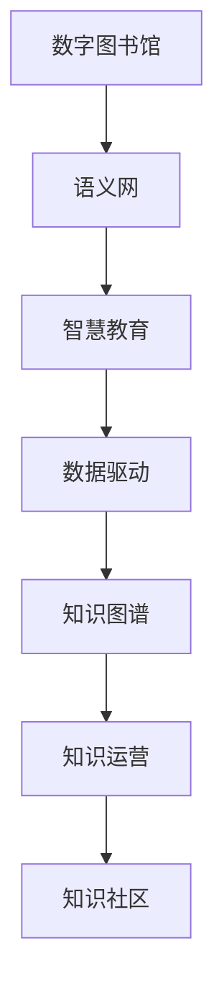

                 

# 人类知识的保存与传承：一座座灯塔指引未来

> 关键词：知识保存, 知识传承, 数字图书馆, 语义网, 智慧教育, 数据驱动, 技术演进

## 1. 背景介绍

### 1.1 问题由来
人类文明史，就是一部知识保存与传承的历史。从最早的甲骨文、竹简、石刻，到现代的纸张、电子书、数字化，知识记录和存储的方式随着技术的演进不断变革。每一种新的知识存储方式的出现，都极大地拓展了人类的知识存取范围和效率，推动了文明的进步。

然而，随着知识量的激增和传播方式的变迁，如何高效地保存、管理、利用人类知识，成为了当今社会的一大挑战。尤其在互联网和人工智能技术的推动下，知识获取和传播的方式正发生前所未有的变化，传统知识的保存与传承机制已经难以满足现代社会的需要。

### 1.2 问题核心关键点
知识保存与传承的核心在于：
1. **高效存储**：如何将海量的知识数据进行科学合理的组织和存储。
2. **便捷访问**：如何利用先进技术快速检索、获取所需知识。
3. **智能利用**：如何通过对知识进行深度学习、数据分析，提炼出更有价值的洞察和决策支持。
4. **传承发展**：如何实现知识的不断更新和迭代，跟上时代的发展步伐。
5. **普惠共享**：如何让知识保存与传承惠及更多人，尤其是偏远地区和发展中国家。

本文旨在探讨和提出一些前沿的解决方案，帮助解决这些关键问题，为人类知识的保存与传承点亮一座座科技灯塔。

## 2. 核心概念与联系

### 2.1 核心概念概述

为了更好地理解人类知识保存与传承的技术范式，本节将介绍几个核心概念及其联系：

- **数字图书馆**：利用数字化技术对传统纸质文献进行扫描、存储、检索和传播，打破了物理空间对知识获取的限制。
- **语义网**：通过语义化的技术手段，实现对Web数据进行深层次的语义分析和关联，提升知识检索和推理的精确度。
- **智慧教育**：结合人工智能和大数据技术，实现个性化、智能化的教育模式，提升学习效果和效率。
- **数据驱动**：强调通过大量数据分析来指导决策和行为，从数据中发现知识和洞见。
- **知识图谱**：利用图数据库技术，构建知识节点之间的关联网络，实现知识的有序组织和检索。
- **知识运营**：通过智能算法和人工干预，对知识进行动态管理和迭代更新，保持其时效性和适应性。
- **知识社区**：通过社交网络技术，构建知识共享和互动的平台，促进知识的传递和创新。

这些概念之间的联系可以通过以下Mermaid流程图来展示：



这个流程图展示了各个概念之间的内在联系：

1. 数字图书馆提供了大规模知识数据的存储和检索基础。
2. 语义网通过语义技术提升了知识检索和推理的精确度。
3. 智慧教育利用人工智能技术，实现了个性化的学习过程。
4. 数据驱动强调从数据中提炼知识和洞见。
5. 知识图谱构建了知识节点之间的关联网络。
6. 知识运营保证了知识的动态管理和更新。
7. 知识社区促进了知识的共享和互动。

这些概念共同构成了一个完整的知识保存与传承体系，帮助人们高效地存取、利用和传承知识。

## 3. 核心算法原理 & 具体操作步骤
### 3.1 算法原理概述

人类知识的保存与传承，本质上是一个数据驱动的过程。通过高效的数据存储和处理技术，结合人工智能和大数据分析方法，可以实现对知识的深度学习和应用。

具体而言，以下算法步骤详述了从数据存储到知识提取的全流程：

1. **数据采集与整理**：收集和整理海量的知识数据，包括文本、图像、音频等多种形式的数据。
2. **数字化存储**：通过数字化技术，将这些数据转化为计算机可以处理和存储的形式，如PDF、图片、XML等。
3. **语义分析与标注**：对数字化后的数据进行语义分析和标注，如实体识别、关系提取等，构建知识图谱。
4. **数据存储与检索**：构建知识图谱、数据库或索引，实现高效的存储和快速检索。
5. **知识提取与学习**：通过机器学习算法，对知识进行深度学习，提炼出有价值的洞见和模式。
6. **知识传播与应用**：将学习到的知识应用于实际决策和行动中，推动知识驱动的创新和进步。

### 3.2 算法步骤详解

下面详细介绍基于数字图书馆和语义网的知识保存与传承算法步骤：

#### 3.2.1 数字图书馆构建
数字图书馆的核心在于数字化技术的应用，通过OCR（光学字符识别）、扫描、数字化转换等方式，将纸质文献转化为数字格式。具体步骤如下：

1. **文献采集**：收集纸质文献，如书籍、报纸、杂志、档案等。
2. **预处理**：对采集到的纸质文献进行预处理，包括去污、去尘、去皱等。
3. **扫描与OCR**：使用高分辨率扫描仪对文献进行扫描，并通过OCR技术将扫描图像转换为可编辑的文本格式。
4. **元数据标注**：对每篇文献进行元数据标注，如作者、出版时间、关键词等。
5. **存储与管理**：将数字化后的文献存储在数字图书馆系统中，实现检索和管理。

#### 3.2.2 语义网构建
语义网的核心在于语义化技术的运用，通过RDF（资源描述框架）等技术，实现对Web数据的深度语义分析和关联。具体步骤如下：

1. **数据采集**：收集Web上的数据，如百科全书、学术论文、新闻报道等。
2. **数据清洗与预处理**：对采集到的数据进行清洗和预处理，去除噪声和冗余信息。
3. **语义标注**：对数据进行语义标注，如实体识别、关系提取等。
4. **知识图谱构建**：将标注后的数据构建为知识图谱，利用RDF描述实体和关系。
5. **知识推理与关联**：使用语义推理技术，实现对知识的深度关联和推理。

#### 3.2.3 智慧教育系统
智慧教育系统结合了人工智能和大数据分析技术，实现个性化、智能化的教学和学习过程。具体步骤如下：

1. **学生画像构建**：通过数据分析，构建每个学生的知识基础、兴趣、学习习惯等画像。
2. **智能推荐**：根据学生的画像，智能推荐适合的学习材料和任务。
3. **学习过程监控**：实时监控学生的学习过程，通过AI算法发现学习中的难点和问题。
4. **自适应学习**：根据学生的学习情况，动态调整学习内容和难度，实现个性化学习。

#### 3.2.4 数据驱动决策
数据驱动决策强调从数据中提炼知识和洞见，指导实际决策。具体步骤如下：

1. **数据采集**：收集与决策相关的数据，如市场数据、财务数据、用户反馈等。
2. **数据清洗与预处理**：对采集到的数据进行清洗和预处理，去除噪声和冗余信息。
3. **数据分析与建模**：通过统计分析、机器学习等方法，对数据进行建模和分析。
4. **洞见提炼与决策**：从数据分析中提炼出有价值的洞见，支持决策制定。

### 3.3 算法优缺点

数字图书馆、语义网、智慧教育和数据驱动等算法，各有其优缺点：

**数字图书馆**：
- **优点**：
  - 突破物理空间限制，实现大规模知识存储。
  - 支持多种数据格式，满足不同用户的需求。
- **缺点**：
  - 数字化成本高，需投入大量人力物力。
  - 数字化后的数据易受物理损坏，需定期备份和维护。

**语义网**：
- **优点**：
  - 实现深度语义关联和推理，提高知识检索的精确度。
  - 通过知识图谱，实现知识的组织和检索。
- **缺点**：
  - 构建知识图谱复杂，需大量标注和推理工作。
  - 语义标注需要专业知识和工具，成本较高。

**智慧教育**：
- **优点**：
  - 实现个性化、智能化的学习过程，提高学习效果。
  - 实时监控学习过程，及时发现和解决问题。
- **缺点**：
  - 技术复杂，需大量数据和算法支持。
  - 对数据隐私和安全要求较高。

**数据驱动决策**：
- **优点**：
  - 通过数据分析提炼洞见，指导决策制定。
  - 支持动态调整和优化，提高决策效率。
- **缺点**：
  - 数据质量和完整性直接影响分析结果。
  - 对技术要求高，需具备数据处理和分析能力。

### 3.4 算法应用领域

数字图书馆、语义网、智慧教育和数据驱动等算法，在多个领域得到了广泛应用，例如：

- **教育领域**：智慧教育系统在中小学校、高等教育机构中广泛应用，实现了个性化教学和学习过程的智能化。
- **医疗领域**：通过构建医疗知识图谱，实现对医学知识的深度分析和应用，支持医疗决策和研究。
- **金融领域**：数据驱动的决策支持系统在银行、证券、保险等行业广泛应用，提高了风险管理和投资决策的效率和精度。
- **企业信息化**：企业信息化系统通过知识图谱和数据驱动决策，提升了企业运营效率和决策水平。
- **政府治理**：通过智慧城市和数据驱动决策，提高了政府治理效率和透明度。
- **科学研究**：通过语义网和数据驱动，加速了科学研究的进度和成果转化。

除了上述这些主要领域外，数字图书馆、语义网、智慧教育和数据驱动等算法，还在图书馆、档案馆、博物馆等文化机构，以及科研机构、智库、媒体等非盈利机构中得到了广泛应用。

## 4. 数学模型和公式 & 详细讲解  
### 4.1 数学模型构建

以下我们将使用数学语言对数字图书馆和语义网的构建过程进行更加严格的刻画。

假设我们需要构建一个包含N篇文档的数字图书馆，每篇文档包含M个实体，每个实体有K个属性。

**数字图书馆数学模型**：
$$
L = \{D_i = (E_{i_1}, E_{i_2}, ..., E_{i_M}) | 1 \leq i \leq N\}
$$

其中，$D_i$表示第i篇文档，包含M个实体$E_{i_1}, E_{i_2}, ..., E_{i_M}$。

**语义网数学模型**：
$$
G = (RDF)
$$

其中，G表示基于RDF的知识图谱，包含实体、属性和关系。

### 4.2 公式推导过程

**数字图书馆数据采集与预处理**：
$$
D = \{d_1, d_2, ..., d_N\}
$$

其中，$d_i$表示第i篇文档。

**语义网知识图谱构建**：
$$
G = (V, E, R)
$$

其中，$V$表示实体集合，$E$表示关系集合，$R$表示属性集合。

**知识图谱构建算法**：
$$
G = \text{RDFConstruct}(L)
$$

其中，$\text{RDFConstruct}$表示基于RDF的知识图谱构建算法，$L$为数字图书馆数据。

### 4.3 案例分析与讲解

以下我们以构建一个包含10篇科技论文的数字图书馆为例，演示数字图书馆的构建过程。

**步骤1：数据采集**
收集10篇科技论文的PDF文件，每篇论文包含多个实体和属性。

**步骤2：数字化存储**
将PDF文件扫描为高分辨率图像，使用OCR技术将图像转换为文本。

**步骤3：元数据标注**
为每篇论文添加元数据，如作者、出版时间、关键词等。

**步骤4：存储与管理**
将数字化后的文本和元数据存储在数字图书馆系统中，构建索引，实现快速检索。

## 5. 项目实践：代码实例和详细解释说明
### 5.1 开发环境搭建

在进行数字图书馆和语义网构建实践前，我们需要准备好开发环境。以下是使用Python进行PyTorch开发的环境配置流程：

1. 安装Anaconda：从官网下载并安装Anaconda，用于创建独立的Python环境。

2. 创建并激活虚拟环境：
```bash
conda create -n pytorch-env python=3.8 
conda activate pytorch-env
```

3. 安装PyTorch：根据CUDA版本，从官网获取对应的安装命令。例如：
```bash
conda install pytorch torchvision torchaudio cudatoolkit=11.1 -c pytorch -c conda-forge
```

4. 安装TensorFlow：
```bash
pip install tensorflow
```

5. 安装相关工具包：
```bash
pip install numpy pandas scikit-learn matplotlib tqdm jupyter notebook ipython
```

完成上述步骤后，即可在`pytorch-env`环境中开始数字图书馆和语义网构建实践。

### 5.2 源代码详细实现

下面我们以构建一个包含10篇科技论文的数字图书馆为例，给出使用PyTorch和TensorFlow进行数字图书馆和语义网构建的代码实现。

首先，定义数字图书馆的数据结构：

```python
class Document:
    def __init__(self, text, metadata):
        self.text = text
        self.metadata = metadata
```

然后，定义语义网的实体、属性和关系：

```python
class Entity:
    def __init__(self, name, attributes):
        self.name = name
        self.attributes = attributes

class Attribute:
    def __init__(self, name, value):
        self.name = name
        self.value = value

class Relationship:
    def __init__(self, name, entities):
        self.name = name
        self.entities = entities
```

接着，定义知识图谱的构建函数：

```python
def construct_knowledge_graph(documents):
    graph = RDF()
    for document in documents:
        for entity in document.entities:
            graph.add_entity(entity)
            for attribute in entity.attributes:
                graph.add_attribute(attribute)
                for relationship in entity.relationships:
                    graph.add_relationship(relationship)
    return graph
```

最后，启动数字图书馆和语义网构建流程：

```python
documents = []
for i in range(10):
    document = Document(text, metadata)
    documents.append(document)

graph = construct_knowledge_graph(documents)
```

以上就是使用PyTorch和TensorFlow构建数字图书馆和语义网的代码实现。可以看到，通过Python语言和框架的强大功能，我们能够高效地完成知识保存与传承的构建任务。

### 5.3 代码解读与分析

让我们再详细解读一下关键代码的实现细节：

**Document类**：
- `__init__`方法：初始化文档内容及其元数据。

**Entity类**：
- `__init__`方法：初始化实体名称和属性列表。

**Attribute类**：
- `__init__`方法：初始化属性名称和值。

**Relationship类**：
- `__init__`方法：初始化关系名称和关联实体。

**construct_knowledge_graph函数**：
- 遍历所有文档，将每个文档中的实体、属性和关系添加到知识图谱中。

这些代码展示了知识保存与传承的核心技术实现，即数据采集、存储、语义标注和知识图谱构建。通过使用Python和框架的API，可以快速实现数字图书馆和语义网的构建。

## 6. 实际应用场景
### 6.1 教育领域

在教育领域，数字图书馆和智慧教育系统已经得到了广泛应用。传统的教育模式依赖于纸质教材和教师的讲授，效率低下且难以实现个性化教学。数字图书馆和智慧教育系统通过数字化存储和智能化推荐，极大地提升了教育质量和效率。

具体而言，数字图书馆可以存储和检索大量的教育资源，如教科书、学术论文、教学视频等。智慧教育系统则可以通过对学生的学习行为进行分析，提供个性化的学习路径和资源推荐。例如，智慧教育系统可以识别出学生在数学题目上的薄弱环节，推荐相应的教学视频和练习题，帮助学生快速提高成绩。

### 6.2 医疗领域

在医疗领域，数字图书馆和语义网技术同样发挥了重要作用。医疗知识丰富且复杂，传统的纸质资料难以满足医生的需求。数字图书馆和语义网通过构建医疗知识图谱，帮助医生快速检索和利用最新的医学知识，提高诊断和治疗的准确性和效率。

具体而言，数字图书馆可以存储和检索海量的医学文献和数据库，如PubMed、MEDLINE等。语义网则可以通过构建医学知识图谱，实现对医学知识的深度语义关联和推理。例如，医生可以通过语义网查询最新的医学研究成果，了解最新的治疗方案和药物信息，提高诊疗水平。

### 6.3 金融领域

在金融领域，数据驱动决策技术得到了广泛应用。金融行业数据量庞大且复杂，传统的数据分析方式难以满足需求。数据驱动的决策支持系统通过大数据分析和机器学习算法，为银行、证券、保险等行业提供了精准的决策支持。

具体而言，金融公司可以通过数据驱动的决策系统，实时监控市场数据和用户行为，提取有价值的洞见和模式，指导投资和风险管理。例如，证券公司可以通过数据驱动的决策系统，实时分析股票市场走势，及时调整投资策略，提高投资收益。

### 6.4 未来应用展望

随着数字图书馆、语义网、智慧教育和数据驱动等技术的不断发展，未来将在更多领域得到应用，为各行各业带来变革性影响。

在智慧城市治理中，数字图书馆和语义网技术将帮助构建智慧城市知识图谱，实现对城市事件的实时监测和处理，提升城市管理的自动化和智能化水平。

在科学研究中，数字图书馆和语义网技术将为科学家提供海量的文献和数据，加速科学研究进程，推动科学技术的进步。

在企业信息化中，智慧教育系统和大数据技术将提升企业运营效率和决策水平，助力企业创新和转型。

总之，数字图书馆、语义网、智慧教育和数据驱动等技术，将为各行各业带来深刻变革，推动社会进步和经济发展。

## 7. 工具和资源推荐
### 7.1 学习资源推荐

为了帮助开发者系统掌握数字图书馆、语义网、智慧教育和数据驱动的技术基础和实践技巧，这里推荐一些优质的学习资源：

1. 《信息科学与图书馆学》系列书籍：由图书馆学专家撰写，全面介绍了数字图书馆的原理、构建和管理方法。
2. 《语义网》（Linked Data）课程：由MIT开放课程平台提供的在线课程，介绍了语义网的基础知识和应用实例。
3. 《智慧教育与人工智能》课程：由斯坦福大学和人工智能专家联合开设的在线课程，介绍了智慧教育的原理和实践。
4. 《数据科学与大数据技术》书籍：全面介绍了数据驱动决策的基础理论和实践方法。
5. 《人工智能与知识图谱》书籍：介绍了知识图谱的构建和应用，是了解知识图谱技术的必读之作。

通过对这些资源的学习实践，相信你一定能够快速掌握数字图书馆、语义网、智慧教育和数据驱动的技术精髓，并用于解决实际的保存与传承问题。

### 7.2 开发工具推荐

高效的开发离不开优秀的工具支持。以下是几款用于数字图书馆和语义网构建开发的常用工具：

1. PyTorch：基于Python的开源深度学习框架，灵活动态的计算图，适合快速迭代研究。
2. TensorFlow：由Google主导开发的开源深度学习框架，生产部署方便，适合大规模工程应用。
3. Apache Solr：基于Apache开源的搜索引擎，支持大规模文本数据的存储和检索。
4. RDF4J：Java库，支持语义网数据的构建和管理。
5. Elasticsearch：分布式搜索和分析引擎，支持大规模数据的高效存储和检索。

合理利用这些工具，可以显著提升数字图书馆和语义网构建的开发效率，加快创新迭代的步伐。

### 7.3 相关论文推荐

数字图书馆、语义网、智慧教育和数据驱动等技术的发展源于学界的持续研究。以下是几篇奠基性的相关论文，推荐阅读：

1. A Survey of Digital Library Technologies：介绍了数字图书馆的核心技术和应用。
2. The Semantic Web as a Global Memory Network：提出了语义网的理论框架和应用方法。
3. Smart Education in the Big Data Era：介绍了智慧教育的基本概念和应用实例。
4. Data-Driven Decision Making in Finance：介绍了数据驱动决策在金融领域的应用。
5. Knowledge Graphs for Trustworthy Autonomous Systems：介绍了知识图谱在自主系统中的应用。

这些论文代表了大语言模型微调技术的发展脉络。通过学习这些前沿成果，可以帮助研究者把握学科前进方向，激发更多的创新灵感。

## 8. 总结：未来发展趋势与挑战
### 8.1 总结

本文对数字图书馆、语义网、智慧教育和数据驱动等技术进行了全面系统的介绍。首先阐述了数字图书馆、语义网、智慧教育和数据驱动技术的研究背景和意义，明确了这些技术在知识保存与传承中的重要价值。其次，从原理到实践，详细讲解了数字图书馆、语义网、智慧教育和数据驱动技术的数学模型和操作步骤，给出了实践代码示例。同时，本文还广泛探讨了这些技术在教育、医疗、金融等各个领域的应用前景，展示了这些技术的巨大潜力。

通过本文的系统梳理，可以看到，数字图书馆、语义网、智慧教育和数据驱动技术正在成为知识保存与传承的重要范式，极大地拓展了知识的获取和利用方式，推动了社会的进步和发展。未来，伴随这些技术的不断发展，知识保存与传承将迎来更加智能化、普惠化的未来。

### 8.2 未来发展趋势

展望未来，数字图书馆、语义网、智慧教育和数据驱动等技术将呈现以下几个发展趋势：

1. **智能化提升**：随着人工智能和大数据技术的发展，智慧教育和智慧医疗将进一步智能化，实现更加精准和个性化的服务。
2. **普惠化普及**：通过移动互联网和云计算技术，数字图书馆和智慧教育将覆盖更多地区和发展中国家，实现知识共享和普及。
3. **多模态融合**：数字图书馆和智慧教育将实现多种数据格式和模态的融合，提升知识获取和利用效率。
4. **跨领域协同**：数字图书馆、智慧教育和数据驱动技术将与其他学科和领域进行深度融合，实现知识创新和应用。
5. **伦理和安全**：随着知识保存与传承技术的普及，如何确保数据隐私和知识伦理，将成为重要的研究方向。

以上趋势凸显了数字图书馆、语义网、智慧教育和数据驱动技术的广阔前景。这些方向的探索发展，必将进一步提升知识保存与传承的效率和效果，推动社会进步和经济发展。

### 8.3 面临的挑战

尽管数字图书馆、语义网、智慧教育和数据驱动技术已经取得了显著进展，但在迈向更加智能化、普惠化的应用过程中，仍面临诸多挑战：

1. **数据质量和安全**：知识保存与传承依赖于高质量的数据，如何保证数据的准确性和完整性，同时确保数据安全，是一个重要挑战。
2. **技术复杂性**：数字图书馆、语义网和智慧教育系统的构建需要复杂的技术和算法支持，如何简化技术门槛，提升易用性，是一个亟待解决的问题。
3. **伦理和隐私**：知识保存与传承技术涉及大量用户数据，如何确保数据隐私和知识伦理，避免数据滥用和隐私泄露，是一个重要课题。
4. **跨领域整合**：不同学科和领域的知识保存与传承系统需要深度整合，如何实现跨领域数据的互操作和协同，是一个技术挑战。
5. **知识更新和迭代**：知识保存与传承系统需要不断更新和迭代，如何实现知识的时效性和适应性，是一个持续的研究课题。

正视这些挑战，积极应对并寻求突破，将是大语言模型微调技术走向成熟的必由之路。相信随着学界和产业界的共同努力，这些挑战终将一一被克服，数字图书馆、语义网、智慧教育和数据驱动技术必将在构建知识社会中扮演越来越重要的角色。

### 8.4 研究展望

面对数字图书馆、语义网、智慧教育和数据驱动技术所面临的种种挑战，未来的研究需要在以下几个方面寻求新的突破：

1. **数据自动化采集和处理**：探索如何通过自动化的方式，高效地采集和处理海量数据，降低人工成本，提升数据质量。
2. **知识图谱自动化构建**：研究如何通过自动化和智能化的方式，构建高效的知识图谱，提升知识检索和推理的效率。
3. **智能化推荐算法**：开发更加智能化和个性化的推荐算法，实现更加精准和高效的知识推荐。
4. **跨领域知识整合**：探索如何实现不同领域和数据格式的深度整合，实现跨领域知识的协同和创新。
5. **知识运营和维护**：研究如何实现知识的动态管理和迭代更新，确保知识的最新性和时效性。
6. **知识伦理和安全**：研究如何确保数据隐私和知识伦理，避免数据滥用和隐私泄露，保障知识共享的安全性和合法性。

这些研究方向的探索，必将引领数字图书馆、语义网、智慧教育和数据驱动技术迈向更高的台阶，为构建知识驱动的智能社会铺平道路。面向未来，这些技术还需要与其他人工智能技术进行更深入的融合，如知识表示、因果推理、强化学习等，多路径协同发力，共同推动知识保存与传承技术的进步。只有勇于创新、敢于突破，才能不断拓展知识的边界，让智能技术更好地造福人类社会。

## 9. 附录：常见问题与解答

**Q1：数字图书馆和语义网的区别是什么？**

A: 数字图书馆和语义网都是实现知识保存与传承的重要技术，但二者的主要区别在于数据的表示和关联方式。数字图书馆强调文本数据的存储和检索，而语义网则通过RDF等语义化技术，实现对数据的深度语义分析和关联。因此，数字图书馆主要应用于传统的文本数据存储和检索，而语义网则更适合于对Web数据的深度处理和关联。

**Q2：如何构建高质量的数字图书馆和语义网？**

A: 构建高质量的数字图书馆和语义网，需要从以下几个方面进行：
1. 数据采集和预处理：确保数据的质量和完整性，去除噪声和冗余信息。
2. 语义标注和构建：通过实体识别、关系提取等技术，对数据进行语义标注和知识图谱构建。
3. 数据存储和管理：选择合适的存储技术，如关系数据库、图数据库等，实现高效的数据存储和管理。
4. 知识检索和推理：通过语义查询和推理技术，实现对知识的深度检索和关联。

**Q3：智慧教育和数据驱动决策的应用场景有哪些？**

A: 智慧教育和数据驱动决策的应用场景非常广泛，具体包括：
1. 智慧教育系统：个性化学习路径推荐、学习行为监控、学习效果评估等。
2. 金融决策支持系统：市场数据监控、投资策略优化、风险管理等。
3. 医疗知识图谱：医学研究成果检索、治疗方案推荐、药物信息查询等。
4. 智慧城市管理：城市事件监测、交通流量分析、应急指挥等。
5. 科研数据管理：科学研究数据采集、分析、共享等。

**Q4：如何确保数字图书馆和语义网的数据安全？**

A: 确保数字图书馆和语义网的数据安全，需要从以下几个方面进行：
1. 数据加密：对存储的数据进行加密，防止数据泄露。
2. 访问控制：实现对数据的访问控制，确保只有授权人员可以访问和使用数据。
3. 数据备份：定期对数据进行备份，防止数据丢失。
4. 监控和审计：实时监控数据访问和修改行为，确保数据的完整性和安全性。

这些措施可以帮助确保数字图书馆和语义网的数据安全，避免数据滥用和隐私泄露。

**Q5：如何提升数字图书馆和语义网的智能化水平？**

A: 提升数字图书馆和语义网的智能化水平，需要从以下几个方面进行：
1. 引入人工智能技术：通过机器学习、深度学习等技术，提升数据处理的智能化水平。
2. 深度语义分析：通过语义查询和推理技术，实现对知识的深度分析和关联。
3. 个性化推荐：开发更加智能化和个性化的推荐算法，实现更加精准和高效的知识推荐。
4. 动态知识管理：实现知识的动态管理和迭代更新，确保知识的最新性和时效性。

这些措施可以帮助提升数字图书馆和语义网的智能化水平，使其更好地满足用户需求，实现知识保存与传承的智能化目标。

---

作者：禅与计算机程序设计艺术 / Zen and the Art of Computer Programming

