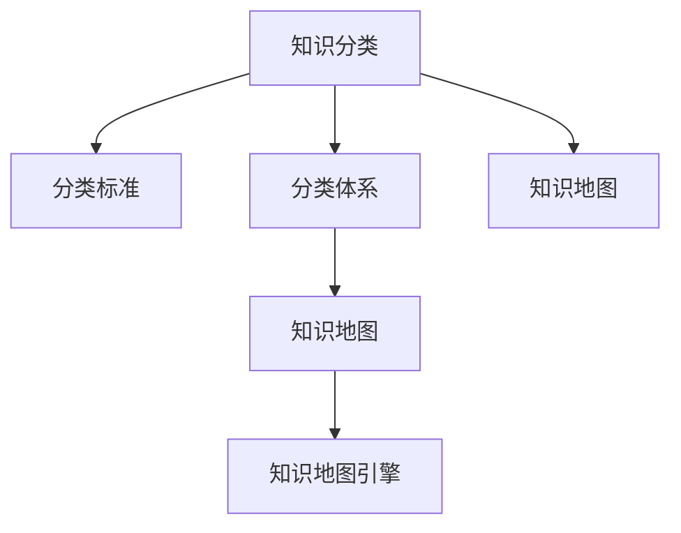

                 

# 人类知识的分类体系：秩序之美

## 1. 背景介绍

在人类文明的发展历程中，知识的分类体系始终是一个重要的主题。随着技术的进步和知识的积累，人们对于知识的分类、组织和检索的需求也在不断增长。本文旨在探讨人类知识的分类体系，分析其结构和特性，并探讨其在信息时代的应用前景。

### 1.1 问题的由来

现代知识分类体系的形成，源于信息爆炸和知识累积的现实需求。在农业社会，人类获取知识的主要方式是口耳相传和手工记录，知识的规模和种类相对有限。然而，随着工业革命和信息技术的到来，知识的生产、传播和存储方式发生了根本性变化，知识量急剧膨胀，迫切需要一种系统化的分类方法来组织和利用这些知识。

### 1.2 问题核心关键点

1. **知识分类体系的构建**：如何构建一种系统化的知识分类体系，以准确、全面地描述和组织人类知识。
2. **知识分类的标准**：不同领域的知识分类标准和方法有哪些？如何选择一个合适的分类标准？
3. **知识分类的应用**：知识分类体系在信息检索、知识管理、教育培训等方面的应用价值。

### 1.3 问题研究意义

研究人类知识的分类体系，对于知识的组织、检索、管理和应用具有重要意义：

- **知识的系统化管理**：通过分类体系，可以将庞杂的知识系统化、结构化，便于存储和检索。
- **知识的高效利用**：分类体系帮助人们快速定位所需知识，提高知识利用的效率。
- **知识的传承与创新**：通过系统的知识分类，可以促进知识的传承和创新，推动社会进步。

## 2. 核心概念与联系

### 2.1 核心概念概述

人类知识的分类体系是一种系统化的分类标准和方法，旨在准确、全面地描述和组织人类知识。其主要涉及以下几个核心概念：

- **知识分类**：根据知识的内容、性质、来源等特征，将知识划分为不同的类别。
- **分类标准**：用于指导分类决策的原则和方法，如主题、学科、应用领域等。
- **分类体系**：由分类标准和分类单位构成的结构体系，如分类目录、树形结构等。
- **知识地图**：反映知识分类体系的关系和层次的可视化工具。
- **知识地图引擎**：支持知识分类体系的应用，如知识检索、推荐系统等。

这些核心概念之间的逻辑关系可以通过以下Mermaid流程图来展示：



这个流程图展示了几类核心概念之间的关系：

1. 知识分类依赖于分类标准。
2. 分类体系由分类标准和分类单位组成。
3. 知识地图展示了分类体系的关系和层次。
4. 知识地图引擎提供了知识地图的应用功能。

### 2.2 核心概念原理和架构的 Mermaid 流程图

以下是一个简化版的知识分类体系架构图，展示了分类标准、分类体系和知识地图的关系：


该图展示了知识分类体系从分类标准到分类体系，再到知识地图和知识应用的逻辑流程。

## 3. 核心算法原理 & 具体操作步骤

### 3.1 算法原理概述

人类知识的分类体系构建算法，主要是基于分类标准的建立和分类单位的选择。算法的核心目标是构建一个结构化、系统化的知识分类体系，以便更好地组织、检索和利用知识。

形式化地，假设已知一个知识集合 $K$，分类标准集 $C$，目标构建一个分类体系 $B$，使得 $B$ 能准确描述 $K$ 中的知识。则问题可以表述为：

$$
\mathop{\arg\min}_{B} \mathcal{L}(K, B)
$$

其中 $\mathcal{L}$ 为损失函数，用于衡量分类体系 $B$ 对知识集合 $K$ 的描述精度。

### 3.2 算法步骤详解

基于分类标准的构建，知识分类体系构建算法一般包括以下几个关键步骤：

**Step 1: 选择分类标准**

- 根据知识领域的特点，选择合适的分类标准，如学科、主题、功能等。
- 确定分类标准后，根据标准的可操作性，选择相应的分类单位，如科目、主题词等。

**Step 2: 构建分类体系**

- 根据分类标准和单位，构建分类体系的树形结构。
- 将知识集合 $K$ 中的每个知识点按照分类标准分配到对应的分类单位。
- 对分类体系进行层次划分，确定根节点、父节点、子节点等关系。

**Step 3: 优化分类体系**

- 根据知识集合的变化，定期调整和优化分类体系。
- 使用聚类算法、知识关联分析等方法，优化分类体系的层次结构和分类单位。

**Step 4: 实现知识地图**

- 将分类体系转换为知识地图的形式，如树形图、概念图等。
- 使用可视化工具和算法，增强知识地图的互动性和易用性。
- 开发知识地图引擎，支持知识检索、推荐等功能。

**Step 5: 应用知识地图**

- 将知识地图嵌入到应用系统，如知识管理系统、知识图谱等。
- 开发知识检索、推荐、学习路径规划等系统功能，提升知识应用效率。

### 3.3 算法优缺点

知识分类体系的构建算法具有以下优点：

1. **系统化管理**：通过分类体系，可以系统化地管理知识，提高知识利用效率。
2. **一致性保障**：分类体系提供了一套标准化的分类规则，确保知识描述的一致性和准确性。
3. **可扩展性**：分类体系可以根据知识的变化进行动态调整，适应知识的增长。

同时，该算法也存在一些缺点：

1. **分类标准多样性**：分类标准的选取需要根据领域特点和应用场景进行调整，具有一定的复杂性。
2. **人工依赖**：分类体系的构建和优化需要人工参与，劳动量较大。
3. **动态性不足**：分类体系一旦构建完成，不易于动态更新和调整。

### 3.4 算法应用领域

知识分类体系在信息时代的应用非常广泛，主要体现在以下几个领域：

1. **图书馆知识管理**：通过分类体系，对图书、期刊、论文等文献进行分类管理，提供高效的知识检索和推荐服务。
2. **企业知识管理**：对企业内部文档、专利、标准等知识进行分类，支持知识共享和利用。
3. **教育培训**：对教育资源进行分类，建立教育知识地图，辅助教学和培训。
4. **科学研究**：对研究成果进行分类，建立知识图谱，促进科学研究合作和创新。
5. **政府信息管理**：对政策文件、法规、案例等政府信息进行分类，提供高效的信息检索和政策支持。

## 4. 数学模型和公式 & 详细讲解 & 举例说明

### 4.1 数学模型构建

在知识分类体系构建中，数学模型主要用于描述分类标准和分类单位之间的关系。假设知识集合 $K$ 中的每个知识点可以表示为 $k_i$，分类标准为 $c_j$，分类单位为 $b_{ij}$。则分类体系可以表示为：

$$
\mathcal{B} = \{(c_j, b_{ij})\}_{j=1}^m
$$

其中 $m$ 为分类标准数量，$n_j$ 为第 $j$ 个分类标准的分类单位数量。

### 4.2 公式推导过程

在分类体系构建中，一个关键的数学工具是信息检索中的倒排索引（Inverted Index）。倒排索引将文档与关键词之间的映射关系反转为关键词与文档之间的关系，可以用于高效的文档检索。类似地，知识分类体系中的分类标准和分类单位之间的关系，可以表示为倒排索引的形式：

$$
I(c_j) = \{k_i \mid b_{ij} \in \mathcal{B}, k_i \in K\}
$$

其中 $I(c_j)$ 表示第 $j$ 个分类标准对应的分类单位集合。

### 4.3 案例分析与讲解

以图书分类为例，假设图书馆拥有大量书籍，每本书有一个唯一标识符，如 ISBN 号，同时每个书还有一个分类标准，如学科、出版年份、作者等。图书馆可以将每本书按照这些分类标准进行分类，形成分类体系。

假设书籍集合 $K$ 中有 $N$ 本书，学科分类标准有 $m=5$ 个，分别为：数学、物理、化学、生物、医学。每本书可能属于多个学科，假设一个书籍的分类单位表示为 $b_{ij}$，其中 $i=1,\ldots,N$，$j=1,\ldots,m$。

根据倒排索引的思想，可以构建如下的分类体系：

$$
\begin{aligned}
I_{\text{学科}} &= \{1,2,3,4,5\} \\
I_{\text{出版年份}} &= \{1990, 2000, 2010, 2020\} \\
I_{\text{作者}} &= \{\text{John Smith}, \text{Jane Doe}, \text{Bob Lee}\}
\end{aligned}
$$

这样，每本书的分类单位可以通过查询这些倒排索引得到。

## 5. 项目实践：代码实例和详细解释说明

### 5.1 开发环境搭建

在进行知识分类体系构建的项目实践前，我们需要准备好开发环境。以下是使用Python进行知识管理系统的环境配置流程：

1. 安装Python：确保Python环境稳定，推荐安装3.8及以上版本。
2. 安装必要的包：如Pandas、Numpy、Scikit-learn、NLTK等。
3. 安装知识管理库：如Stanford CoreNLP、spaCy等。
4. 安装可视化工具：如Matplotlib、Seaborn、Plotly等。
5. 搭建开发环境：如Jupyter Notebook、PyCharm等。

### 5.2 源代码详细实现

以下是一个简单的知识分类体系构建项目的代码实现，展示了如何使用Python和NLTK库对图书馆图书进行分类：

```python
from nltk.corpus import stopwords
from nltk.tokenize import word_tokenize
from nltk.stem import PorterStemmer

# 初始化分词器和词干提取器
stop_words = set(stopwords.words('english'))
ps = PorterStemmer()

# 定义图书分类函数
def classify_book(book, categories):
    # 将书籍文本分词并去除停用词
    words = [ps.stem(w) for w in word_tokenize(book) if w not in stop_words]
    # 根据分词结果计算每个类别的得分
    scores = {c: sum([1 if w in words else 0 for w in words]) for c in categories}
    # 返回得分最高的类别
    return max(scores, key=scores.get)

# 测试分类函数
books = [
    "The Hitchhiker's Guide to the Galaxy by Douglas Adams",
    "Sapiens: A Brief History of Humankind by Yuval Noah Harari",
    "The War of Art by Steven Pressfield",
    "Becoming by Michelle Obama"
]

categories = ["science", "biology", "philosophy", "politics", "biography"]
for book in books:
    print(f"Book: {book} - Category: {classify_book(book, categories)}")
```

### 5.3 代码解读与分析

代码实现了简单的基于文本内容的图书分类函数。具体步骤如下：

1. 分词：使用NLTK库对书籍文本进行分词，去除停用词。
2. 词干提取：使用Porter词干提取器对分词结果进行词干提取，减少噪音。
3. 分类：根据提取后的文本特征，计算每个类别的得分，选择得分最高的类别作为分类结果。

## 6. 实际应用场景

### 6.1 图书管理系统

在图书馆管理系统中，分类体系可以用于高效地管理和检索图书。通过构建分类体系，图书馆可以：

1. 快速定位书籍：根据分类标准和分类单位，用户可以快速找到所需的书籍。
2. 推荐相关书籍：根据用户的阅读历史和兴趣，推荐类似主题的书籍。
3. 优化库存管理：根据分类体系，图书馆可以合理分配不同类别的书籍库存，避免库存积压。

### 6.2 企业知识管理

在企业知识管理中，分类体系可以用于系统化地管理和利用企业内部文档、专利、标准等知识。通过构建分类体系，企业可以：

1. 快速检索知识：根据分类标准和分类单位，员工可以快速找到所需文档和资料。
2. 促进知识共享：通过分类体系，员工可以更好地共享和利用知识，提升团队协作效率。
3. 知识驱动决策：分类体系中的知识可以用于支持企业决策，提高决策的科学性和准确性。

### 6.3 教育培训

在教育培训中，分类体系可以用于系统化地管理和利用教育资源。通过构建分类体系，教育机构可以：

1. 组织教学资源：根据学科、主题等分类标准，组织和管理教学资源，确保教学资源的系统化和结构化。
2. 推荐学习资源：根据学生的学习历史和兴趣，推荐适合的学习资源，提高学习效果。
3. 支持个性化学习：分类体系中的知识可以用于支持个性化学习路径的规划和推荐。

### 6.4 科学研究

在科学研究中，分类体系可以用于系统化地管理和利用研究成果。通过构建分类体系，研究机构可以：

1. 管理研究项目：根据学科、研究领域等分类标准，管理研究项目，确保研究的系统化和结构化。
2. 促进合作创新：分类体系中的知识可以用于支持科研合作和创新，提高研究效率和成果质量。
3. 共享研究成果：根据分类体系，研究机构可以更好地共享和利用研究成果，促进学术交流。

### 6.5 政府信息管理

在政府信息管理中，分类体系可以用于系统化地管理和利用政府信息。通过构建分类体系，政府可以：

1. 管理政策文件：根据政策领域、主题等分类标准，管理政策文件，确保政策的系统化和结构化。
2. 支持决策支持：分类体系中的知识可以用于支持政策制定和决策，提高决策的科学性和准确性。
3. 提供信息服务：根据分类体系，政府可以提供高效的信息检索和查询服务，提升信息服务水平。

## 7. 工具和资源推荐

### 7.1 学习资源推荐

为了帮助开发者系统掌握知识分类体系的理论基础和实践技巧，这里推荐一些优质的学习资源：

1. 《信息检索理论与实践》：介绍信息检索的基本概念、技术和算法，是信息管理领域的基础读物。
2. 《知识图谱》：由知识图谱领域的权威专家撰写，涵盖知识图谱的基本概念、建模技术和应用案例。
3. 《信息管理与信息系统》：详细介绍信息管理的理论和方法，包括信息组织、分类、检索等环节。
4. 《计算机科学导论》：全面介绍计算机科学的基本概念和知识结构，包括数据结构、算法、信息管理等。
5. 《知识工程》：介绍知识工程的基本概念和应用技术，涵盖知识表示、知识推理、知识管理等。

通过对这些资源的学习实践，相信你一定能够快速掌握知识分类体系的精髓，并用于解决实际的图书馆、企业、教育、科研等领域的问题。

### 7.2 开发工具推荐

高效的开发离不开优秀的工具支持。以下是几款用于知识分类体系构建开发的常用工具：

1. SQL数据库：如MySQL、PostgreSQL等，用于存储和管理知识分类体系的数据。
2. NoSQL数据库：如MongoDB、Cassandra等，适用于大规模、高并发数据的存储和管理。
3. 知识管理平台：如Confluence、SharePoint等，支持知识分类、检索、共享等功能。
4. 文本处理工具：如NLTK、spaCy等，用于文本处理和分析。
5. 可视化工具：如Tableau、Power BI等，用于数据可视化展示。

合理利用这些工具，可以显著提升知识分类体系的开发效率，加快创新迭代的步伐。

### 7.3 相关论文推荐

知识分类体系的研究涉及多个领域，以下是几篇奠基性的相关论文，推荐阅读：

1. "Categorization of Linguistic Categories: A Study in Computational Linguistics" by W. S. Burrough：介绍了语言分类和分词的原理和方法。
2. "Information Retrieval: Introduction to Advanced Techniques" by B. SRivastava：介绍了信息检索的基本概念和先进技术。
3. "Knowledge Engineering for Decision Support" by P. A. Anderson：介绍了知识工程在决策支持中的应用。
4. "A Conceptual Model for Knowledge Classification" by R. Selmar：介绍了知识分类的概念模型和分类标准。
5. "The Semantic Web: Languages for Knowledge Representation and Semantic Web Applications" by J. G. Billock：介绍了语义网的基本概念和应用。

这些论文代表了大语言模型微调技术的发展脉络。通过学习这些前沿成果，可以帮助研究者把握学科前进方向，激发更多的创新灵感。

## 8. 总结：未来发展趋势与挑战

### 8.1 研究成果总结

本文对人类知识的分类体系进行了全面系统的介绍，主要内容包括：

1. 分类体系的基本概念和构建算法。
2. 分类体系的应用场景和实践案例。
3. 分类体系的工具和资源推荐。

通过本文的系统梳理，可以看到，知识分类体系在信息时代的应用价值和系统化管理的重要性。未来，随着人工智能和大数据技术的不断发展，知识分类体系将更加复杂和精细，更好地服务于知识管理和应用。

### 8.2 未来发展趋势

展望未来，知识分类体系的发展趋势如下：

1. **自动化构建**：随着自然语言处理和机器学习技术的进步，知识分类体系的自动化构建将成为可能，减少人工干预。
2. **跨领域融合**：知识分类体系将与自然语言处理、人工智能等技术深度融合，形成更加智能化的知识管理工具。
3. **多模态融合**：知识分类体系将融合文本、图像、语音等多模态信息，支持更加全面和深入的知识表示和检索。
4. **语义关联分析**：知识分类体系将结合语义分析技术，增强知识之间的关联和理解，提升知识检索的准确性。
5. **智能推荐系统**：知识分类体系将与推荐系统结合，实现个性化的知识推荐和发现。

### 8.3 面临的挑战

尽管知识分类体系在信息时代的应用前景广阔，但在迈向更加智能化、普适化应用的过程中，仍面临诸多挑战：

1. **领域差异性**：不同领域的知识分类标准和方法有所不同，需要根据领域特点制定分类体系。
2. **数据稀缺性**：部分领域的知识数据稀缺，难以构建有效的分类体系。
3. **动态更新**：知识分类体系需要根据知识的变化进行动态更新，保持其时效性。
4. **复杂性**：分类体系的构建和优化具有复杂性，需要大量人工参与和经验积累。
5. **多语言支持**：分类体系需要支持多语言分类，提高其跨领域和跨文化的适用性。

### 8.4 研究展望

面对知识分类体系面临的挑战，未来的研究需要在以下几个方面寻求新的突破：

1. **自动化构建方法**：探索自动化构建知识分类体系的方法，如基于机器学习的分类算法、语义分析技术等。
2. **动态更新机制**：研究动态更新知识分类体系的方法，确保分类体系的及时性和准确性。
3. **多语言支持技术**：开发支持多语言分类的技术，提高分类体系的跨文化适用性。
4. **跨领域融合**：研究知识分类体系与其他领域的深度融合，提升其综合应用能力。
5. **智能推荐系统**：开发基于知识分类体系的智能推荐系统，提升知识发现和应用的效率。

这些研究方向的探索，必将引领知识分类体系技术迈向更高的台阶，为知识管理和应用带来新的突破。

## 9. 附录：常见问题与解答

**Q1: 如何选择合适的分类标准？**

A: 选择合适的分类标准需要考虑以下几个因素：
1. 领域特点：根据领域的特点，选择合适的分类标准，如学科、主题、功能等。
2. 应用场景：根据应用场景，选择合适的分类标准，如检索、推荐、管理等。
3. 数据可得性：根据数据的可获得性，选择合适的分类标准，确保数据覆盖面广。

**Q2: 如何评估分类体系的效果？**

A: 评估分类体系的效果主要从以下几个方面进行：
1. 准确性：分类体系对知识的描述精度，即正确分类知识的比率。
2. 完整性：分类体系对知识的全覆盖程度，即是否涵盖了所有相关知识。
3. 简洁性：分类体系的层级结构是否合理，是否易于理解和应用。

**Q3: 知识分类体系和知识图谱有什么区别？**

A: 知识分类体系和知识图谱都是用于组织和管理知识的工具，但有以下区别：
1. 结构不同：知识分类体系采用树形结构，知识图谱采用图结构。
2. 关系表示不同：知识分类体系主要描述分类标准和分类单位，知识图谱描述实体和关系。
3. 应用场景不同：知识分类体系适用于静态知识的管理和检索，知识图谱适用于动态知识的管理和推理。

**Q4: 如何构建跨领域的知识分类体系？**

A: 构建跨领域的知识分类体系需要考虑以下几个步骤：
1. 选择通用的分类标准：如学科、主题、功能等，适用于多个领域。
2. 调整分类标准的应用：根据不同领域的特点，调整分类标准的定义和应用方式。
3. 融合多领域的知识：通过融合多领域的知识，构建更加全面和深入的分类体系。

**Q5: 知识分类体系和语义网有何关系？**

A: 知识分类体系和语义网有密切的关系：
1. 语义网的知识表示需要借助分类体系，确保知识的一致性和准确性。
2. 知识分类体系为语义网提供了知识组织和管理的基础。
3. 语义网技术可以用于增强知识分类体系的功能，如知识推理、知识查询等。

通过这些问题的解答，相信读者能更好地理解知识分类体系的理论和实践，为构建和应用知识分类体系提供指导和参考。

---

作者：禅与计算机程序设计艺术 / Zen and the Art of Computer Programming

