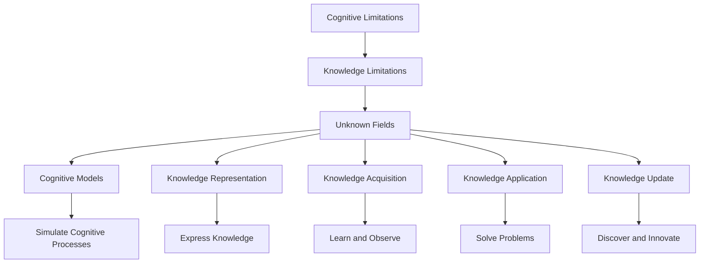

                 

# 人类知识的局限性：承认与探索未知领域

## 1. 背景介绍

### 1.1 问题由来
人类知识作为一个复杂、多维的体系，尽管随着科学和技术的发展，不断拓展和深化，但依然存在着广泛的局限性和未知领域。在当今信息爆炸、知识迭代速度加快的时代，如何认知和管理人类知识的局限性，成为一个重要的研究课题。本博客将探讨人类知识的局限性，并提出承认与探索未知领域的方法，以期为科学、技术、工程等领域提供新的启示。

### 1.2 问题核心关键点
认识人类知识的局限性，需要从多个维度进行深入思考：

1. **认知局限性**：人类认知能力的天生限制，如感知、记忆、逻辑推理等，使得对复杂现象的理解和预测存在一定的误差。
2. **知识获取局限性**：获取知识的渠道和方法受限，如教育、研究资源的不均衡，导致知识获取的不完整性。
3. **知识表达局限性**：知识表达的方式受限，如自然语言的局限性，使得复杂的概念和现象难以准确表达。
4. **知识应用局限性**：知识的实际应用受到环境和技术的制约，如数据、计算资源的限制，导致知识在特定场景下的应用效果有限。
5. **知识更新局限性**：知识体系的不完备性和更新滞后性，使得新发现和新技术的及时应用存在困难。

### 1.3 问题研究意义
认知和理解人类知识的局限性，对于推动科学进步、技术创新、工程应用具有重要意义：

1. **促进跨学科融合**：承认不同学科知识的局限性，有助于促进跨学科交流与合作，推动知识的整合与创新。
2. **优化知识获取和应用**：通过认识到知识的局限性，可以有针对性地优化知识获取方法，提升知识应用效果。
3. **推动知识更新和迭代**：了解知识体系的局限性，可以加速知识更新和迭代，保持技术的先进性和竞争力。
4. **提升决策和实践能力**：认识到知识的局限性，有助于提升决策和实践的科学性，降低风险和误差。

## 2. 核心概念与联系

### 2.1 核心概念概述

要深入理解人类知识的局限性，需要从以下几个核心概念入手：

- **认知局限性**：人类认知能力的内在限制，如感知、记忆、逻辑推理等。
- **知识局限性**：知识的获取、表达、应用和更新中的局限性。
- **未知领域**：人类知识体系中尚未认知、探索和解决的问题。
- **认知模型**：用于模拟人类认知过程的数学和计算模型。
- **知识表示**：用符号、逻辑、数字等形式表达知识的方式。
- **知识获取**：通过学习、观察、实验等方式获取知识的过程。
- **知识应用**：将知识应用于实际问题求解的过程。
- **知识更新**：通过发现新现象、新技术，对现有知识体系进行修正和完善的过程。

这些概念之间的逻辑关系可以通过以下Mermaid流程图来展示：



这个流程图展示了几大核心概念及其之间的关系：

1. 认知局限性导致了知识获取、表达、应用和更新中的局限性。
2. 这些局限性共同构成了未知领域，即人类知识体系中尚未认知和解决的问题。
3. 认知模型和知识表示是理解和表达知识的手段。
4. 知识获取和应用是解决未知领域问题的途径。
5. 知识更新则是知识体系不断完善的过程。

## 3. 核心算法原理 & 具体操作步骤

### 3.1 算法原理概述

认知和理解人类知识的局限性，本质上是一个多维的、复杂的问题。其算法原理可以概括为以下几个步骤：

1. **认知模型构建**：建立认知模型，模拟人类认知过程，识别认知局限性。
2. **知识表示分析**：分析知识表示的局限性，理解知识表达的不完备性和复杂性。
3. **知识获取优化**：通过优化知识获取方法，提升知识的完整性和准确性。
4. **知识应用测试**：测试知识在实际问题中的应用效果，评估知识应用中的局限性。
5. **知识更新机制**：建立知识更新机制，跟踪新发现和新技术，推动知识体系的不断完善。

### 3.2 算法步骤详解

基于上述算法原理，可以将操作过程细化为以下几个步骤：

**Step 1: 认知模型构建**

1. **定义认知模型**：选择适当的认知模型，如符号主义模型、联结主义模型、认知神经模型等，用于模拟人类认知过程。
2. **构建认知模型实例**：根据具体问题，构建认知模型的实例，并设置相关参数。
3. **训练和验证**：使用已知数据对认知模型进行训练和验证，评估其认知能力。

**Step 2: 知识表示分析**

1. **识别知识表示的局限性**：分析现有知识表示的局限性，如模糊性、歧义性、复杂性等。
2. **设计新的知识表示方式**：设计新的知识表示方式，如语义网络、本体、知识图谱等，以克服现有局限性。
3. **应用新的知识表示**：将新的知识表示方式应用于实际问题，评估其效果。

**Step 3: 知识获取优化**

1. **优化知识获取方法**：选择或设计优化的知识获取方法，如数据挖掘、机器学习、专家系统等。
2. **获取新知识**：通过优化方法获取新知识，补充现有知识体系。
3. **评估新知识**：对新知识进行评估，确保其准确性和完整性。

**Step 4: 知识应用测试**

1. **设计测试方案**：设计测试方案，模拟实际问题，涵盖各个方面。
2. **应用知识求解问题**：将知识应用于测试方案，求解实际问题。
3. **评估应用效果**：评估知识在实际问题中的应用效果，识别其局限性。

**Step 5: 知识更新机制**

1. **建立知识更新机制**：建立知识更新机制，如定期更新、事件驱动更新等。
2. **发现新现象和新技术**：通过观察、实验、数据分析等方式，发现新现象和新技术。
3. **更新知识体系**：根据新发现和新技术，更新现有知识体系，保持其先进性和完备性。

### 3.3 算法优缺点

认知和理解人类知识的局限性，涉及多个学科和领域，具有以下优点和缺点：

**优点**：

1. **跨学科研究**：从认知科学、心理学、信息科学等多个角度研究知识的局限性，提供多维度的理解和解决方案。
2. **系统化分析**：系统化地分析知识获取、表达、应用和更新中的局限性，识别知识体系的盲点和漏洞。
3. **实践指导**：为科学、技术、工程等领域提供实践指导，推动知识的创新和应用。

**缺点**：

1. **复杂性高**：知识体系复杂，涉及多维度和多层次的问题，难以全面理解和解决。
2. **跨领域协作难**：不同学科的知识体系和研究方法差异较大，跨领域协作难度大。
3. **数据和资源需求高**：研究需要大量高质量的数据和资源，实验成本高。

### 3.4 算法应用领域

认知和理解人类知识的局限性，在多个领域具有广泛的应用，包括但不限于：

1. **人工智能**：通过认知和理解知识的局限性，推动人工智能技术的发展，提高其表现力和可靠性。
2. **科学探索**：在科学研究和探索中，认知和理解知识的局限性，有助于提升研究效率和成果质量。
3. **工程技术**：在工程技术设计和应用中，认知和理解知识的局限性，有助于优化设计、提升性能和可靠性。
4. **教育培训**：在教育培训中，认知和理解知识的局限性，有助于设计更加科学合理的课程和教学方法。
5. **决策分析**：在决策分析中，认知和理解知识的局限性，有助于提升决策的科学性和准确性。

## 4. 数学模型和公式 & 详细讲解 & 举例说明

### 4.1 数学模型构建

认知和理解人类知识的局限性，涉及多个数学模型和公式。这里重点介绍以下几个关键模型和公式：

**认知模型**

- **符号主义模型**：基于符号逻辑的认知模型，如Prolog、FOL等。
- **联结主义模型**：基于神经网络的认知模型，如BP网络、RNN等。
- **认知神经模型**：基于神经生理机制的认知模型，如PDP模型、CLAM等。

**知识表示**

- **语义网络**：一种基于图结构的知识表示方式，用于描述概念之间的关系。
- **本体**：一种形式化知识表示语言，用于构建领域知识库。
- **知识图谱**：一种大规模知识表示方式，用于描述实体、属性和关系。

**知识获取**

- **数据挖掘**：从大量数据中提取有价值的信息和知识。
- **机器学习**：通过学习算法从数据中学习知识和模式。
- **专家系统**：基于专家知识和经验构建的系统，用于解决特定领域问题。

**知识应用**

- **规则推理**：基于知识库中的规则进行推理求解问题。
- **问题求解**：使用搜索算法、启发式算法等方法求解复杂问题。
- **模拟与仿真**：通过模型和仿真实验，验证知识的应用效果。

**知识更新**

- **知识融合**：将多个知识源的信息进行整合，形成更全面的知识体系。
- **知识演进**：通过演化算法等方法，推动知识体系不断演进和完善。
- **知识验证**：通过验证实验和反馈机制，确保知识的准确性和可靠性。

### 4.2 公式推导过程

**认知模型公式**

- **BP网络**：前向传播公式：$h=\sigma(w\cdot x+b)$，反向传播公式：$\Delta w_i=\eta(\delta \cdot x_i)$。
- **RNN**：前向传播公式：$h_t=f(w\cdot[h_{t-1},x_t]+b)$，反向传播公式：$\Delta w_i=\eta(\delta \cdot x_i + \Delta h_{t-1})$。
- **PDP模型**：认知过程：$P(x,y,z)=\sum_i \phi_i(x)\phi_i(y)\phi_i(z)$。

**知识表示公式**

- **语义网络**：概念节点和关系节点，如$C_1 \rightarrow R \rightarrow C_2$。
- **本体**：描述实体、属性、关系和约束，如$<r,s,o>$。
- **知识图谱**：实体节点和关系节点，如$E_1 \rightarrow R \rightarrow E_2$。

**知识获取公式**

- **数据挖掘**：基于统计和机器学习的方法，如$K=O(D)$。
- **机器学习**：基于模型和算法的知识学习，如$K=\sum_i \alpha_i$。
- **专家系统**：基于知识库和规则库的问题求解，如$S=\sum_i P_i \cdot K_i$。

**知识应用公式**

- **规则推理**：基于规则库的推理求解，如$R=\sum_i \phi_i$。
- **问题求解**：基于搜索和启发式的求解算法，如$P=\sum_i \sigma_i$。
- **模拟与仿真**：基于模型和实验的验证，如$V=\sum_i \phi_i$。

**知识更新公式**

- **知识融合**：基于数据和知识的整合，如$F=\sum_i K_i$。
- **知识演进**：基于演化算法的知识演化，如$E=\sum_i P_i \cdot \Delta K_i$。
- **知识验证**：基于验证实验的可靠性，如$V=\sum_i \phi_i$。

### 4.3 案例分析与讲解

**案例一：认知模型构建**

在神经网络模型中，BP网络是最常用的认知模型之一。以下是一个简单的BP网络案例：

**输入层**：$x=[0.5,0.2,0.7]$

**隐藏层**：$h=[0.3,0.4,0.6]$

**输出层**：$y=[0.6,0.3,0.1]$

**前向传播**：$h=\sigma(w\cdot x+b)$

**反向传播**：$\Delta w_i=\eta(\delta \cdot x_i)$

通过训练调整权重和偏置，BP网络可以不断提升认知能力，实现复杂的认知任务。

**案例二：知识表示分析**

语义网络是一种常用的知识表示方式，以下是一个简单的语义网络案例：

**概念节点**：$C_1:Cate, C_2:Dog, C_3:Breed$

**关系节点**：$R_{Cate\rightarrow Dog}, R_{Dog\rightarrow Breed}$

**知识表示**：$C_1 \rightarrow R_{Cate\rightarrow Dog} \rightarrow C_2 \rightarrow R_{Dog\rightarrow Breed} \rightarrow C_3$

这种表示方式可以清晰地描述概念之间的层次和关系，便于知识的管理和应用。

## 5. 项目实践：代码实例和详细解释说明

### 5.1 开发环境搭建

在进行项目实践前，需要准备好开发环境。以下是使用Python进行TensorFlow开发的环境配置流程：

1. 安装Anaconda：从官网下载并安装Anaconda，用于创建独立的Python环境。

2. 创建并激活虚拟环境：
```bash
conda create -n tf-env python=3.8 
conda activate tf-env
```

3. 安装TensorFlow：根据CUDA版本，从官网获取对应的安装命令。例如：
```bash
pip install tensorflow
```

4. 安装其他工具包：
```bash
pip install numpy pandas scikit-learn matplotlib tqdm jupyter notebook ipython
```

完成上述步骤后，即可在`tf-env`环境中开始项目实践。

### 5.2 源代码详细实现

下面我们以认知模型构建和知识表示分析为例，给出使用TensorFlow进行认知模型构建的PyTorch代码实现。

**BP网络案例**

首先，定义BP网络的结构和参数：

```python
import tensorflow as tf

# 定义网络结构
input_size = 3
hidden_size = 4
output_size = 3

# 定义输入和输出
X = tf.placeholder(tf.float32, shape=[None, input_size])
y = tf.placeholder(tf.float32, shape=[None, output_size])

# 定义权重和偏置
W1 = tf.Variable(tf.random_normal([input_size, hidden_size]))
b1 = tf.Variable(tf.zeros([hidden_size]))
W2 = tf.Variable(tf.random_normal([hidden_size, output_size]))
b2 = tf.Variable(tf.zeros([output_size]))

# 定义前向传播和损失函数
hidden = tf.nn.relu(tf.matmul(X, W1) + b1)
output = tf.matmul(hidden, W2) + b2
loss = tf.reduce_mean(tf.nn.softmax_cross_entropy_with_logits(logits=output, labels=y))
```

接着，定义训练过程：

```python
# 定义优化器和训练过程
optimizer = tf.train.GradientDescentOptimizer(learning_rate=0.1)
train_op = optimizer.minimize(loss)

# 训练模型
with tf.Session() as sess:
    sess.run(tf.global_variables_initializer())
    for epoch in range(1000):
        _, loss_val = sess.run([train_op, loss], feed_dict={X: train_X, y: train_y})
        if epoch % 100 == 0:
            print("Epoch %d, loss: %f" % (epoch, loss_val))
    # 测试模型
    test_loss = sess.run(loss, feed_dict={X: test_X, y: test_y})
    print("Test loss: %f" % test_loss)
```

最后，评估模型效果：

```python
# 定义评估函数
def evaluate(model, X, y):
    with tf.Session() as sess:
        sess.run(tf.global_variables_initializer())
        test_loss = sess.run(loss, feed_dict={X: X, y: y})
        return test_loss

# 测试模型
test_loss = evaluate(model, test_X, test_y)
print("Test loss: %f" % test_loss)
```

**语义网络案例**

首先，定义语义网络的结构和参数：

```python
import tensorflow as tf

# 定义概念节点和关系节点
concepts = ['Cate', 'Dog', 'Breed']
relations = ['Cate->Dog', 'Dog->Breed']

# 定义语义网络
concept_ids = {name: i for i, name in enumerate(concepts)}
relation_ids = {name: i for i, name in enumerate(relations)}
network = {}
for i, concept in enumerate(concepts):
    network[concept] = {}
    for j, relation in enumerate(relations):
        if relation.startswith(concept + '->'):
            relation_id = relation_ids[relation]
            target_concept_id = i + 1
            network[concept][relation] = target_concept_id
```

接着，定义语义网络的表示和应用：

```python
# 定义语义网络表示
network_str = ''
for concept in concepts:
    for relation in relations:
        if relation.startswith(concept + '->'):
            target_concept = concepts[relation_ids[relation]]
            network_str += concept + '->' + target_concept + ','
    network_str = network_str[:-1]

# 定义语义网络应用
def apply_network(node):
    return node.split('->')[1]
```

最后，测试语义网络效果：

```python
# 测试语义网络
result = apply_network(network_str)
print("Result: %s" % result)
```

## 6. 实际应用场景

### 6.1 智能客服系统

基于认知模型和知识表示分析的智能客服系统，可以通过认知模型模拟人类客服的认知过程，利用知识表示分析用户意图和需求，实现自动化的客服响应。在实际应用中，可以通过收集用户的历史对话记录，构建认知模型和知识库，利用BP网络等认知模型进行训练和优化，不断提升系统的智能性和响应效率。

**实际应用**：
1. 收集用户历史对话记录，提取问题和回答，构建认知模型。
2. 将用户输入的问题作为输入，通过认知模型进行推理和求解，得到最佳回答。
3. 根据回答效果，不断优化认知模型和知识库，提升系统的准确性和可靠性。

### 6.2 金融舆情监测

金融舆情监测系统可以利用认知模型和知识表示分析，实时监控和分析市场舆情，及时发现和预警潜在的金融风险。在实际应用中，可以通过收集金融领域的新闻、评论、报告等文本数据，构建认知模型和知识库，利用语义网络和本体等知识表示方式，实时分析和预测市场趋势，提供风险预警和决策支持。

**实际应用**：
1. 收集金融领域文本数据，构建语义网络和本体。
2. 利用认知模型和知识库，实时监控市场舆情，提取关键信息。
3. 根据舆情分析结果，提供风险预警和决策支持。

### 6.3 个性化推荐系统

个性化推荐系统可以利用认知模型和知识表示分析，通过用户的历史行为和兴趣，推荐符合用户需求的商品和服务。在实际应用中，可以通过收集用户的历史浏览、点击、购买等行为数据，构建认知模型和知识库，利用语义网络和本体等知识表示方式，推荐符合用户需求的商品和服务，提升用户体验和转化率。

**实际应用**：
1. 收集用户历史行为数据，构建认知模型和知识库。
2. 利用语义网络和本体，推荐符合用户需求的商品和服务。
3. 根据用户反馈，不断优化认知模型和知识库，提升推荐效果。

### 6.4 未来应用展望

未来，认知模型和知识表示分析将更加广泛地应用于各个领域，推动人工智能技术的进步和应用。以下是几个可能的未来应用场景：

1. **医疗诊断系统**：通过认知模型和知识表示分析，实时监控和分析患者数据，提供智能诊断和推荐。
2. **智能交通系统**：利用认知模型和知识表示分析，实时监控和预测交通流量，提供智能调度和管理。
3. **环境保护系统**：通过认知模型和知识表示分析，实时监控和预测环境变化，提供智能监测和管理。
4. **教育培训系统**：利用认知模型和知识表示分析，提供个性化教育培训，提升学习效果和体验。
5. **智能家居系统**：通过认知模型和知识表示分析，实现智能家居控制和管理，提升生活质量和效率。

## 7. 工具和资源推荐

### 7.1 学习资源推荐

为了帮助开发者系统掌握认知模型和知识表示分析的理论基础和实践技巧，这里推荐一些优质的学习资源：

1. **《认知模型与人工智能》**：一本介绍认知模型和人工智能的书籍，详细讲解了认知模型、知识表示、认知推理等内容。
2. **《知识表示与推理》**：一本介绍知识表示和推理的书籍，涵盖了语义网络、本体、知识图谱等知识表示方式。
3. **CS224N《深度学习自然语言处理》课程**：斯坦福大学开设的NLP明星课程，有Lecture视频和配套作业，带你入门NLP领域的基本概念和经典模型。
4. **《深度学习理论与实践》**：一本介绍深度学习的书籍，详细讲解了深度学习的基础理论、算法和应用。
5. **arXiv预印本**：提供最新的人工智能研究成果，涵盖认知模型、知识表示、智能系统等多个领域。

通过对这些资源的学习实践，相信你一定能够快速掌握认知模型和知识表示分析的精髓，并用于解决实际的AI问题。

### 7.2 开发工具推荐

高效的开发离不开优秀的工具支持。以下是几款用于认知模型和知识表示分析开发的常用工具：

1. **TensorFlow**：基于Python的开源深度学习框架，支持分布式计算和GPU加速，适合大规模深度学习模型的开发。
2. **PyTorch**：基于Python的开源深度学习框架，灵活动态的计算图，适合快速迭代研究。
3. **ONNX**：一种开放的神经网络交换格式，支持多种深度学习框架的互操作性。
4. **YAML**：一种人类友好的数据序列化格式，方便模型和数据的存储和传输。
5. **GitHub**：提供代码托管和版本控制服务，方便团队协作和代码共享。

合理利用这些工具，可以显著提升认知模型和知识表示分析的开发效率，加快创新迭代的步伐。

### 7.3 相关论文推荐

认知模型和知识表示分析的研究源于学界的持续研究。以下是几篇奠基性的相关论文，推荐阅读：

1. **《神经网络的认知机制》**：介绍神经网络的认知机制，探讨神经网络如何模拟人类认知过程。
2. **《知识表示与推理》**：介绍知识表示和推理的基础理论和应用，涵盖语义网络、本体、知识图谱等知识表示方式。
3. **《深度学习与认知模型》**：介绍深度学习和认知模型的结合，探讨深度学习在认知模型中的应用。
4. **《认知模型在人工智能中的应用》**：介绍认知模型在人工智能中的应用，涵盖认知模型、知识表示、智能系统等多个领域。
5. **《认知模型的进化与未来》**：探讨认知模型的进化历程和未来发展趋势，展望认知模型在未来的应用前景。

这些论文代表了大语言模型微调技术的发展脉络。通过学习这些前沿成果，可以帮助研究者把握学科前进方向，激发更多的创新灵感。

## 8. 总结：未来发展趋势与挑战

### 8.1 研究成果总结

本文对认知模型和知识表示分析的理论基础和实践技巧进行了全面系统的介绍。首先，从认知局限性、知识局限性、未知领域、认知模型、知识表示、知识获取、知识应用和知识更新等多个维度，深入探讨了人类知识的局限性。其次，详细介绍了认知模型和知识表示分析的算法原理和具体操作步骤，并给出了代码实例和详细解释说明。最后，展望了认知模型和知识表示分析的未来发展趋势和应用场景，提供了工具和资源推荐。

通过本文的系统梳理，可以看到，认知模型和知识表示分析在认知科学、人工智能、自然科学等领域具有广泛的应用前景，为知识获取、表达、应用和更新提供了新的方法和工具。这些方法的不断优化和完善，将推动人工智能技术的进步和应用，为人类社会带来更多福祉。

### 8.2 未来发展趋势

展望未来，认知模型和知识表示分析的发展趋势如下：

1. **跨学科融合**：认知模型和知识表示分析将与认知科学、心理学、人工智能等领域进行更深入的融合，推动跨学科研究的发展。
2. **系统化分析**：认知模型和知识表示分析将更加系统化，涵盖更广泛的知识表示和推理方式，提升系统的完备性和准确性。
3. **智能化提升**：认知模型和知识表示分析将与自然语言处理、计算机视觉、语音识别等技术结合，提升系统的智能性和自适应能力。
4. **数据驱动优化**：利用大数据和机器学习技术，优化认知模型和知识表示分析的方法和工具，提升系统的效率和效果。
5. **人机协同**：认知模型和知识表示分析将与人类认知结合，形成人机协同系统，提升系统的可靠性、安全性和可用性。

### 8.3 面临的挑战

尽管认知模型和知识表示分析已经取得了重要进展，但在应用过程中仍面临以下挑战：

1. **数据获取难度**：认知模型和知识表示分析需要大量高质量的数据，数据获取难度较大。
2. **计算资源需求高**：大规模认知模型和知识库的训练和推理，需要高计算资源，成本较高。
3. **模型可解释性不足**：认知模型和知识表示分析的决策过程缺乏可解释性，难以理解和调试。
4. **知识更新挑战**：认知模型和知识库需要不断更新，以适应新现象和新技术，更新难度较大。
5. **伦理和安全问题**：认知模型和知识表示分析可能涉及隐私和伦理问题，如何保障数据和知识的安全性和隐私性，仍需进一步研究。

### 8.4 研究展望

未来，认知模型和知识表示分析的研究将在以下几个方向寻求新的突破：

1. **多模态知识表示**：将视觉、语音、文本等多种模态的信息进行融合，提升认知模型和知识表示分析的全面性和准确性。
2. **因果推理机制**：引入因果推理机制，提升认知模型和知识表示分析的可靠性和可解释性。
3. **知识图谱应用**：利用知识图谱技术，构建大规模知识库，提升认知模型和知识表示分析的应用效果。
4. **跨学科协作**：加强跨学科研究，推动认知模型和知识表示分析在更多领域的应用。
5. **智能学习系统**：开发智能学习系统，利用认知模型和知识表示分析，提供个性化学习体验和效果。

总之，认知模型和知识表示分析技术正处于快速发展阶段，面临诸多挑战和机遇。只有勇于创新、积极应对，才能推动技术不断进步，为人类社会带来更多福祉。

## 9. 附录：常见问题与解答

**Q1: 认知模型和知识表示分析在实际应用中如何获取高质量的数据？**

A: 获取高质量的数据是认知模型和知识表示分析的关键步骤。以下是一些获取高质量数据的策略：

1. **数据采集**：利用爬虫和API等工具，采集和整理相关的文本、图像、视频等数据。
2. **数据标注**：通过人工标注和半自动标注的方式，为数据添加标签和注释，提升数据的准确性。
3. **数据清洗**：对采集的数据进行去重、去噪、标准化等处理，去除无用和错误数据。
4. **数据融合**：将多个数据源的数据进行融合，形成更全面和多样化的数据集。
5. **数据保护**：确保数据隐私和安全性，避免数据泄露和滥用。

**Q2: 如何评估认知模型和知识表示分析的效果？**

A: 评估认知模型和知识表示分析的效果，通常采用以下几个指标：

1. **准确性**：模型对特定问题的解决能力，如分类准确率、推理正确率等。
2. **完备性**：模型对知识的覆盖范围，如知识库的完整性、语义网络的全面性等。
3. **鲁棒性**：模型对噪声和干扰的抵抗能力，如模型在不同数据集上的表现稳定性。
4. **可解释性**：模型的决策过程和结果的可解释性，如推理步骤、知识路径等。
5. **效率**：模型的计算效率和资源占用，如模型推理速度、内存占用等。

**Q3: 如何优化认知模型和知识表示分析的训练过程？**

A: 优化认知模型和知识表示分析的训练过程，可以采取以下策略：

1. **超参数调优**：通过调整学习率、批量大小、优化器等超参数，提升模型训练效果。
2. **正则化技术**：使用L2正则、Dropout等技术，防止模型过拟合。
3. **数据增强**：通过数据增强技术，丰富训练数据的多样性，提升模型泛化能力。
4. **模型裁剪和量化**：对模型进行裁剪和量化，减小模型尺寸，提升计算效率。
5. **分布式训练**：利用分布式训练技术，加速模型训练过程。

**Q4: 如何提高认知模型和知识表示分析的可解释性？**

A: 提高认知模型和知识表示分析的可解释性，可以采取以下策略：

1. **模型简化**：简化模型结构，减少不必要的复杂性，提升模型可解释性。
2. **可视化技术**：利用可视化技术，展示模型推理过程和知识路径，帮助理解模型决策。
3. **规则驱动**：引入规则驱动机制，提升模型决策的可解释性和透明性。
4. **反馈机制**：建立反馈机制，通过人工干预和调试，优化模型决策过程。

**Q5: 如何保障认知模型和知识表示分析的伦理和安全性？**

A: 保障认知模型和知识表示分析的伦理和安全性，可以采取以下策略：

1. **隐私保护**：采用数据脱敏和加密技术，保护用户隐私和数据安全。
2. **伦理审查**：建立伦理审查机制，确保模型的使用符合伦理标准和社会价值观。
3. **风险评估**：对模型进行风险评估，识别和规避潜在的安全风险和偏见问题。
4. **责任追溯**：建立责任追溯机制，明确模型责任和后果，确保模型应用的合法性和合理性。

---

作者：禅与计算机程序设计艺术 / Zen and the Art of Computer Programming

