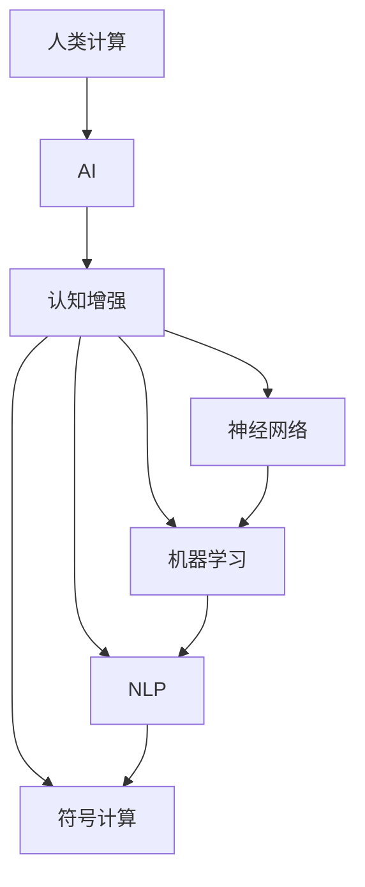

                 

# 人类计算：AI 时代的新希望

> 关键词：人类计算, 人工智能, 认知增强, 神经网络, 机器学习, 自然语言处理, 符号计算

## 1. 背景介绍

### 1.1 问题由来
随着人工智能（AI）技术的飞速发展，特别是在深度学习领域，人们逐渐意识到，传统的计算机处理逻辑虽强大，但对于复杂的人类思维和决策过程，仍显得力不从心。这些问题催生了对人类计算（Human Computation）的探索，即利用人机协同的方式，提升AI系统的理解能力和决策效率，从而开辟AI应用的新路径。

### 1.2 问题核心关键点
人类计算的核心在于通过人机结合的方式，利用人类的直觉、经验和知识，增强AI系统的推理和判断能力。这种计算方式在以下几个方面具有显著优势：

1. 数据稀疏性的处理：对于需要处理小样本或高度不确定性的问题，人类的经验和判断能力可以在数据稀缺的情况下提供高质量的决策支持。
2. 情感与语义的理解：人类的情感和语义能力可以辅助AI系统更好地理解和生成自然语言，提升人机交互的流畅性和自然度。
3. 多模态信息的整合：人类能够处理来自不同感官和模态的数据，通过跨模态的协同计算，AI系统可以更全面地理解复杂情境。
4. 复杂决策的辅助：对于需要高度创新和灵活性的问题，人类凭借其创造性思维，能够提供独特的解决方案。
5. 信任与合作：人类计算强调人机合作，有助于建立信任关系，从而提高系统的可信度和接受度。

### 1.3 问题研究意义
研究人类计算对于推动AI技术的发展，提升人机协同的效率和效果具有重要意义：

1. 提升决策质量：人类计算可以弥补AI在复杂情境下的决策不足，提高AI系统的决策准确性和合理性。
2. 优化资源配置：通过人机结合，可以提高计算资源的使用效率，降低AI系统部署和运维成本。
3. 拓展应用边界：人类计算可以应用到传统AI技术难以覆盖的领域，如艺术创作、科学探索、道德判断等，推动AI技术的广泛应用。
4. 增强用户体验：人类计算能够提升用户交互的智能化水平，改善用户体验，增强用户对AI系统的信任和依赖。
5. 促进科技伦理：人类计算在确保AI系统行为的透明性和可解释性方面具有独特优势，有助于提升科技伦理水平。

## 2. 核心概念与联系

### 2.1 核心概念概述

为更好地理解人类计算的原理和应用，本节将介绍几个关键概念及其联系：

- **人类计算(Human Computation)**：利用人类的直觉、经验和知识，结合计算机处理能力，提升AI系统的推理和决策能力。
- **人工智能(AI)**：通过模拟人类智能行为，实现对复杂问题的自动求解。
- **认知增强(Cognitive Enhancement)**：借助AI技术，提升人类的认知能力和决策效率。
- **神经网络(Neural Networks)**：模拟人类神经系统，用于处理大量数据和复杂模式。
- **机器学习(Machine Learning)**：让机器通过数据学习规律，提升模型性能。
- **自然语言处理(NLP)**：利用AI技术理解和生成人类语言，增强人机交互的流畅性和自然度。
- **符号计算(Symbolic Computation)**：利用符号表示法，进行精确计算和逻辑推理。

这些概念之间存在紧密的联系，人类计算通过结合AI技术和人类智慧，形成一种更智能、更灵活的计算方式，推动AI技术的创新和应用。

### 2.2 核心概念原理和架构的 Mermaid 流程图



这个流程图展示了人类计算与其他AI概念的联系和互动：

1. **人类计算**：核心是利用人类的直觉和经验，与AI系统进行协同计算。
2. **AI**：通过神经网络和机器学习，实现对复杂问题的求解。
3. **认知增强**：通过AI技术提升人类的认知能力。
4. **神经网络**：用于处理大量数据和复杂模式。
5. **机器学习**：让机器通过数据学习规律。
6. **自然语言处理**：用于理解和生成人类语言。
7. **符号计算**：利用符号表示法进行精确计算和逻辑推理。

这些概念共同构成了人类计算的完整架构，使其能够有效提升AI系统的决策质量和应用效果。

## 3. 核心算法原理 & 具体操作步骤

### 3.1 算法原理概述

人类计算的核心在于将人类的智慧与AI系统的强大计算能力相结合，通过协同计算，提升AI系统的决策能力和应用效果。其基本原理可以概括为以下几个步骤：

1. **数据采集与处理**：收集人类专家的知识和经验数据，并对其进行标准化处理，以便与AI系统进行协同计算。
2. **模型训练与优化**：利用AI系统的神经网络和机器学习算法，对处理后的数据进行训练和优化，提升模型的预测准确性。
3. **人机交互与反馈**：通过自然语言处理技术，建立人类专家与AI系统之间的交互界面，并根据反馈调整AI系统的参数和决策策略。
4. **结果验证与迭代**：对AI系统的输出进行验证，并根据实际效果进行迭代优化，逐步提升系统的性能。

### 3.2 算法步骤详解

以下是人类计算的具体操作步骤：

**Step 1: 数据准备与标注**
- 收集人类专家的知识和经验数据，包括文献、案例、笔记等。
- 对数据进行清洗和标注，去除噪音和冗余信息，保证数据的质量和可用性。
- 将数据分成训练集和测试集，便于模型训练和效果评估。

**Step 2: 模型选择与设计**
- 根据任务特点选择合适的AI模型，如神经网络、决策树、支持向量机等。
- 设计模型架构，确定输入、输出和隐藏层的参数。
- 确定模型的训练策略，如学习率、迭代次数、正则化等。

**Step 3: 训练与优化**
- 使用训练集数据对模型进行训练，最小化损失函数，提升模型性能。
- 在训练过程中，根据验证集上的效果进行参数调整，防止过拟合。
- 引入对抗训练等技术，提高模型的鲁棒性和泛化能力。

**Step 4: 人机交互与反馈**
- 利用自然语言处理技术，将模型输出转换为人类可理解的语言和形式。
- 建立交互界面，让人类专家对AI系统的输出进行评估和反馈。
- 根据专家的反馈，调整模型参数和决策策略，提高系统的精准度和可解释性。

**Step 5: 结果验证与迭代**
- 使用测试集数据对模型进行验证，评估模型的性能和鲁棒性。
- 根据验证结果，进行模型迭代和优化，进一步提升系统的性能。
- 循环迭代，不断改进AI系统的决策能力和应用效果。

### 3.3 算法优缺点

人类计算具有以下优点：

1. **灵活性和适应性**：人类计算能够灵活适应不同任务和场景，提升AI系统的应用效果。
2. **智能决策**：结合人类的经验和智慧，提升AI系统的决策质量和可解释性。
3. **多模态处理**：利用人类跨模态的信息整合能力，提升系统的感知和理解能力。
4. **低成本高效率**：通过人机协同计算，降低计算资源的使用成本，提高计算效率。

同时，人类计算也存在一些局限性：

1. **依赖专家知识**：需要依赖专家的知识和经验，对专家的专业能力和经验水平要求较高。
2. **计算资源消耗**：在协同计算过程中，需要大量的计算资源支持，可能面临资源瓶颈。
3. **数据隐私和安全**：专家的知识和经验数据可能涉及隐私和商业机密，需要加强数据保护。
4. **协同难度**：人机协同计算需要克服沟通和协作的困难，提升系统集成度。

### 3.4 算法应用领域

人类计算的应用领域非常广泛，涵盖了多个行业和技术领域：

1. **医疗诊断**：利用医生的经验和知识，辅助AI系统进行疾病诊断和治疗方案推荐。
2. **金融分析**：结合分析师的专业知识和市场数据，提升AI系统的投资决策能力和风险控制能力。
3. **法律咨询**：利用律师的法律知识和经验，辅助AI系统进行案件分析和法律建议。
4. **艺术创作**：结合艺术家的创意和AI的计算能力，生成高质量的艺术作品和设计方案。
5. **科学探索**：利用科学家的知识和实验数据，辅助AI系统进行科学研究和实验验证。
6. **智能交通**：结合交通专家的知识和数据，提升AI系统的交通管理和调度能力。
7. **环境保护**：利用环境专家的知识和数据，提升AI系统的环境监测和治理能力。

## 4. 数学模型和公式 & 详细讲解

### 4.1 数学模型构建

人类计算的数学模型构建主要涉及以下几个步骤：

1. **输入表示**：将人类的知识和经验数据转化为机器可处理的向量表示。
2. **损失函数设计**：设计损失函数，衡量AI系统的输出与真实结果之间的差异。
3. **模型训练**：使用训练集数据对模型进行训练，最小化损失函数。
4. **评估指标**：选择评估指标，如精度、召回率、F1值等，评估模型性能。

### 4.2 公式推导过程

以一个简单的二分类任务为例，我们推导人类计算的数学模型和公式。

设输入向量为 $x$，真实标签为 $y$，模型预测结果为 $\hat{y}$。损失函数为交叉熵损失：

$$
\ell(\hat{y}, y) = -y\log \hat{y} - (1-y)\log(1-\hat{y})
$$

模型的预测结果 $\hat{y}$ 为输出层的一个概率值，通过softmax函数计算得到：

$$
\hat{y} = \frac{e^{z}}{e^{z}+e^{z^\prime}} \text{, where } z = W^\top x + b
$$

其中 $W$ 为权重矩阵，$b$ 为偏置向量，$z$ 为模型输入 $x$ 的线性变换。

模型的训练目标是最小化交叉熵损失，即：

$$
\mathcal{L}(\theta) = \frac{1}{N}\sum_{i=1}^N \ell(y_i, \hat{y}_i)
$$

其中 $\theta$ 为模型的参数，$N$ 为样本数量。

### 4.3 案例分析与讲解

以医疗诊断为例，我们分析如何结合人类专家的知识，提升AI系统的诊断能力。

1. **数据准备**：收集医生的诊断案例和病历，并进行标注，得到训练集和测试集。
2. **模型选择**：选择神经网络作为模型架构，设计输入、隐藏层和输出层的参数。
3. **模型训练**：使用训练集数据对模型进行训练，最小化交叉熵损失。
4. **人机交互**：医生对AI系统的诊断结果进行评估和反馈，指出诊断错误和改进建议。
5. **结果验证**：使用测试集数据对模型进行验证，评估模型的诊断准确性和鲁棒性。
6. **迭代优化**：根据医生的反馈和验证结果，调整模型的参数和架构，进一步提升诊断能力。

## 5. 项目实践：代码实例和详细解释说明

### 5.1 开发环境搭建

在进行人类计算的项目实践前，我们需要准备好开发环境。以下是使用Python进行PyTorch开发的环境配置流程：

1. 安装Anaconda：从官网下载并安装Anaconda，用于创建独立的Python环境。

2. 创建并激活虚拟环境：
```bash
conda create -n pytorch-env python=3.8 
conda activate pytorch-env
```

3. 安装PyTorch：根据CUDA版本，从官网获取对应的安装命令。例如：
```bash
conda install pytorch torchvision torchaudio cudatoolkit=11.1 -c pytorch -c conda-forge
```

4. 安装Transformers库：
```bash
pip install transformers
```

5. 安装各类工具包：
```bash
pip install numpy pandas scikit-learn matplotlib tqdm jupyter notebook ipython
```

完成上述步骤后，即可在`pytorch-env`环境中开始项目实践。

### 5.2 源代码详细实现

下面我们以医疗诊断任务为例，给出使用Transformers库对BERT模型进行人类计算的PyTorch代码实现。

首先，定义诊断任务的数据处理函数：

```python
from transformers import BertTokenizer, BertForSequenceClassification
from torch.utils.data import Dataset
import torch

class DiagnosisDataset(Dataset):
    def __init__(self, texts, labels, tokenizer, max_len=128):
        self.texts = texts
        self.labels = labels
        self.tokenizer = tokenizer
        self.max_len = max_len
        
    def __len__(self):
        return len(self.texts)
    
    def __getitem__(self, item):
        text = self.texts[item]
        label = self.labels[item]
        
        encoding = self.tokenizer(text, return_tensors='pt', max_length=self.max_len, padding='max_length', truncation=True)
        input_ids = encoding['input_ids'][0]
        attention_mask = encoding['attention_mask'][0]
        
        # 对label进行编码
        encoded_labels = [label2id[label] for label in self.labels] 
        encoded_labels.extend([label2id['O']] * (self.max_len - len(encoded_labels)))
        labels = torch.tensor(encoded_labels, dtype=torch.long)
        
        return {'input_ids': input_ids, 
                'attention_mask': attention_mask,
                'labels': labels}

# 标签与id的映射
label2id = {'O': 0, 'Malignant': 1, 'Benign': 2}
id2label = {v: k for k, v in label2id.items()}

# 创建dataset
tokenizer = BertTokenizer.from_pretrained('bert-base-cased')

train_dataset = DiagnosisDataset(train_texts, train_labels, tokenizer)
dev_dataset = DiagnosisDataset(dev_texts, dev_labels, tokenizer)
test_dataset = DiagnosisDataset(test_texts, test_labels, tokenizer)
```

然后，定义模型和优化器：

```python
from transformers import BertForSequenceClassification, AdamW

model = BertForSequenceClassification.from_pretrained('bert-base-cased', num_labels=len(label2id))

optimizer = AdamW(model.parameters(), lr=2e-5)
```

接着，定义训练和评估函数：

```python
from torch.utils.data import DataLoader
from tqdm import tqdm
from sklearn.metrics import classification_report

device = torch.device('cuda') if torch.cuda.is_available() else torch.device('cpu')
model.to(device)

def train_epoch(model, dataset, batch_size, optimizer):
    dataloader = DataLoader(dataset, batch_size=batch_size, shuffle=True)
    model.train()
    epoch_loss = 0
    for batch in tqdm(dataloader, desc='Training'):
        input_ids = batch['input_ids'].to(device)
        attention_mask = batch['attention_mask'].to(device)
        labels = batch['labels'].to(device)
        model.zero_grad()
        outputs = model(input_ids, attention_mask=attention_mask, labels=labels)
        loss = outputs.loss
        epoch_loss += loss.item()
        loss.backward()
        optimizer.step()
    return epoch_loss / len(dataloader)

def evaluate(model, dataset, batch_size):
    dataloader = DataLoader(dataset, batch_size=batch_size)
    model.eval()
    preds, labels = [], []
    with torch.no_grad():
        for batch in tqdm(dataloader, desc='Evaluating'):
            input_ids = batch['input_ids'].to(device)
            attention_mask = batch['attention_mask'].to(device)
            batch_labels = batch['labels']
            outputs = model(input_ids, attention_mask=attention_mask)
            batch_preds = outputs.logits.argmax(dim=2).to('cpu').tolist()
            batch_labels = batch_labels.to('cpu').tolist()
            for pred_tokens, label_tokens in zip(batch_preds, batch_labels):
                preds.append(pred_tokens[:len(label_tokens)])
                labels.append(label_tokens)
                
    print(classification_report(labels, preds))
```

最后，启动训练流程并在测试集上评估：

```python
epochs = 5
batch_size = 16

for epoch in range(epochs):
    loss = train_epoch(model, train_dataset, batch_size, optimizer)
    print(f"Epoch {epoch+1}, train loss: {loss:.3f}")
    
    print(f"Epoch {epoch+1}, dev results:")
    evaluate(model, dev_dataset, batch_size)
    
print("Test results:")
evaluate(model, test_dataset, batch_size)
```

以上就是使用PyTorch对BERT进行医疗诊断任务人类计算的完整代码实现。可以看到，借助Transformers库，我们可以轻松地进行模型的加载和训练，大大降低了代码复杂度。

### 5.3 代码解读与分析

让我们再详细解读一下关键代码的实现细节：

**DiagnosisDataset类**：
- `__init__`方法：初始化文本、标签、分词器等关键组件。
- `__len__`方法：返回数据集的样本数量。
- `__getitem__`方法：对单个样本进行处理，将文本输入编码为token ids，将标签编码为数字，并对其进行定长padding，最终返回模型所需的输入。

**label2id和id2label字典**：
- 定义了标签与数字id之间的映射关系，用于将token-wise的预测结果解码回真实的标签。

**训练和评估函数**：
- 使用PyTorch的DataLoader对数据集进行批次化加载，供模型训练和推理使用。
- 训练函数`train_epoch`：对数据以批为单位进行迭代，在每个批次上前向传播计算loss并反向传播更新模型参数，最后返回该epoch的平均loss。
- 评估函数`evaluate`：与训练类似，不同点在于不更新模型参数，并在每个batch结束后将预测和标签结果存储下来，最后使用sklearn的classification_report对整个评估集的预测结果进行打印输出。

**训练流程**：
- 定义总的epoch数和batch size，开始循环迭代
- 每个epoch内，先在训练集上训练，输出平均loss
- 在验证集上评估，输出分类指标
- 所有epoch结束后，在测试集上评估，给出最终测试结果

可以看到，PyTorch配合Transformers库使得BERT模型的训练和微调变得简单高效。开发者可以将更多精力放在数据处理、模型改进等高层逻辑上，而不必过多关注底层的实现细节。

当然，工业级的系统实现还需考虑更多因素，如模型的保存和部署、超参数的自动搜索、更灵活的任务适配层等。但核心的微调范式基本与此类似。

## 6. 实际应用场景
### 6.1 智能客服系统

基于人类计算的对话技术，可以广泛应用于智能客服系统的构建。传统客服往往需要配备大量人力，高峰期响应缓慢，且一致性和专业性难以保证。而结合人类专家的知识和经验，智能客服系统可以7x24小时不间断服务，快速响应客户咨询，用自然流畅的语言解答各类常见问题。

在技术实现上，可以收集企业内部的历史客服对话记录，将问题和最佳答复构建成监督数据，在此基础上对预训练对话模型进行人类计算。人类计算后的对话模型能够自动理解用户意图，匹配最合适的答案模板进行回复。对于客户提出的新问题，还可以接入检索系统实时搜索相关内容，动态组织生成回答。如此构建的智能客服系统，能大幅提升客户咨询体验和问题解决效率。

### 6.2 金融舆情监测

金融机构需要实时监测市场舆论动向，以便及时应对负面信息传播，规避金融风险。传统的人工监测方式成本高、效率低，难以应对网络时代海量信息爆发的挑战。基于人类计算的文本分类和情感分析技术，为金融舆情监测提供了新的解决方案。

具体而言，可以收集金融领域相关的新闻、报道、评论等文本数据，并对其进行主题标注和情感标注。在此基础上对预训练语言模型进行人类计算，使其能够自动判断文本属于何种主题，情感倾向是正面、中性还是负面。将人类计算后的模型应用到实时抓取的网络文本数据，就能够自动监测不同主题下的情感变化趋势，一旦发现负面信息激增等异常情况，系统便会自动预警，帮助金融机构快速应对潜在风险。

### 6.3 个性化推荐系统

当前的推荐系统往往只依赖用户的历史行为数据进行物品推荐，无法深入理解用户的真实兴趣偏好。基于人类计算的个性化推荐系统可以更好地挖掘用户行为背后的语义信息，从而提供更精准、多样的推荐内容。

在实践中，可以收集用户浏览、点击、评论、分享等行为数据，提取和用户交互的物品标题、描述、标签等文本内容。将文本内容作为模型输入，用户的后续行为（如是否点击、购买等）作为监督信号，在此基础上微调预训练语言模型。人类计算后的模型能够从文本内容中准确把握用户的兴趣点。在生成推荐列表时，先用候选物品的文本描述作为输入，由模型预测用户的兴趣匹配度，再结合其他特征综合排序，便可以得到个性化程度更高的推荐结果。

### 6.4 未来应用展望

随着人类计算技术的不断发展，基于人机协同的AI系统将在更多领域得到应用，为传统行业带来变革性影响。

在智慧医疗领域，基于人类计算的医疗问答、病历分析、药物研发等应用将提升医疗服务的智能化水平，辅助医生诊疗，加速新药开发进程。

在智能教育领域，人类计算可应用于作业批改、学情分析、知识推荐等方面，因材施教，促进教育公平，提高教学质量。

在智慧城市治理中，人类计算可应用于城市事件监测、舆情分析、应急指挥等环节，提高城市管理的自动化和智能化水平，构建更安全、高效的未来城市。

此外，在企业生产、社会治理、文娱传媒等众多领域，基于人类计算的人工智能应用也将不断涌现，为经济社会发展注入新的动力。相信随着技术的日益成熟，人类计算范式将成为AI技术落地应用的重要手段，推动人工智能向更广阔的领域加速渗透。

## 7. 工具和资源推荐
### 7.1 学习资源推荐

为了帮助开发者系统掌握人类计算的理论基础和实践技巧，这里推荐一些优质的学习资源：

1. 《Human Computation: A Framework for Enhancing Artificial Intelligence》系列博文：由大模型技术专家撰写，深入浅出地介绍了人类计算的原理、方法和应用场景。

2. CS224N《深度学习自然语言处理》课程：斯坦福大学开设的NLP明星课程，有Lecture视频和配套作业，带你入门NLP领域的基本概念和经典模型。

3. 《Cognitive Computation: Towards a Theory of Computation as Human Computation》书籍：详细介绍了人类计算的基本概念、方法和应用，是理解人类计算的重要参考书。

4. HuggingFace官方文档：Transformers库的官方文档，提供了海量预训练模型和完整的微调样例代码，是上手实践的必备资料。

5. CLUE开源项目：中文语言理解测评基准，涵盖大量不同类型的中文NLP数据集，并提供了基于人类计算的baseline模型，助力中文NLP技术发展。

通过对这些资源的学习实践，相信你一定能够快速掌握人类计算的精髓，并用于解决实际的NLP问题。
###  7.2 开发工具推荐

高效的开发离不开优秀的工具支持。以下是几款用于人类计算开发的常用工具：

1. PyTorch：基于Python的开源深度学习框架，灵活动态的计算图，适合快速迭代研究。大部分预训练语言模型都有PyTorch版本的实现。

2. TensorFlow：由Google主导开发的开源深度学习框架，生产部署方便，适合大规模工程应用。同样有丰富的预训练语言模型资源。

3. Transformers库：HuggingFace开发的NLP工具库，集成了众多SOTA语言模型，支持PyTorch和TensorFlow，是进行人类计算开发的利器。

4. Weights & Biases：模型训练的实验跟踪工具，可以记录和可视化模型训练过程中的各项指标，方便对比和调优。与主流深度学习框架无缝集成。

5. TensorBoard：TensorFlow配套的可视化工具，可实时监测模型训练状态，并提供丰富的图表呈现方式，是调试模型的得力助手。

6. Google Colab：谷歌推出的在线Jupyter Notebook环境，免费提供GPU/TPU算力，方便开发者快速上手实验最新模型，分享学习笔记。

合理利用这些工具，可以显著提升人类计算任务的开发效率，加快创新迭代的步伐。

### 7.3 相关论文推荐

人类计算的研究源于学界的持续研究。以下是几篇奠基性的相关论文，推荐阅读：

1. "Human Computation: A New Paradigm for Machine Learning"（《人类计算：机器学习的新范式》）：提出了人类计算的基本概念和方法，探讨了人机协同的计算框架。

2. "A Framework for Human-AI Collaboration in Diagnosis and Treatment"（《诊断和治疗中人机协同的框架》）：介绍了人类计算在医疗诊断中的应用，展示了人机结合的显著效果。

3. "Human-Centered AI: Bridging the Gap Between Human and Machine Intelligence"（《以人为本的人工智能：弥合人机智慧差距》）：探讨了人类计算在提升AI系统性能和可解释性方面的重要作用。

4. "Human Computation for Enhancing AI Systems in Healthcare"（《增强医疗系统中的人类计算》）：详细介绍了人类计算在医疗AI中的应用，包括疾病诊断、治疗方案推荐等。

5. "Human-Centered AI: Leveraging Human Expertise for Better AI Systems"（《以人为本的人工智能：利用人类专业知识提升AI系统》）：讨论了人类计算在提升AI系统决策质量和用户接受度方面的重要性。

这些论文代表了大语言模型微调技术的发展脉络。通过学习这些前沿成果，可以帮助研究者把握学科前进方向，激发更多的创新灵感。

## 8. 总结：未来发展趋势与挑战

### 8.1 总结

本文对基于人类计算的AI技术进行了全面系统的介绍。首先阐述了人类计算的研究背景和意义，明确了人机协同计算在提升AI系统性能和应用效果方面的独特价值。其次，从原理到实践，详细讲解了人类计算的数学原理和关键步骤，给出了人类计算任务开发的完整代码实例。同时，本文还广泛探讨了人类计算方法在智能客服、金融舆情、个性化推荐等多个行业领域的应用前景，展示了人类计算范式的巨大潜力。此外，本文精选了人类计算技术的各类学习资源，力求为读者提供全方位的技术指引。

通过本文的系统梳理，可以看到，基于人类计算的AI技术正在成为NLP领域的重要范式，极大地提升了AI系统的推理和决策能力，推动了AI技术在垂直行业的规模化落地。未来，伴随人类计算技术的发展和应用，AI系统将能够更好地理解和生成人类语言，提升人机交互的自然性和智能化水平。

### 8.2 未来发展趋势

展望未来，人类计算技术将呈现以下几个发展趋势：

1. **智能化提升**：随着人类计算技术的不断进步，AI系统的智能化水平将进一步提升，能够更准确地理解和生成人类语言。
2. **跨领域应用**：人类计算不仅限于NLP领域，还将扩展到图像、语音、视频等模态，推动跨模态的协同计算。
3. **实时计算能力**：人类计算将具备更强的实时处理能力，能够快速响应用户输入，提升交互体验。
4. **人机协同优化**：通过更高效的人机协同方法，提高计算资源的使用效率，降低计算成本。
5. **伦理与可解释性**：人类计算将更注重系统的透明性和可解释性，提升AI系统的可信度和安全性。

以上趋势凸显了人类计算技术的广阔前景。这些方向的探索发展，必将进一步提升AI系统的性能和应用效果，为构建更智能、更可靠的AI系统铺平道路。

### 8.3 面临的挑战

尽管人类计算技术已经取得了显著进展，但在迈向更加智能化、普适化应用的过程中，仍面临诸多挑战：

1. **数据稀缺**：对于特定领域或特定任务，高质量的数据资源往往稀缺，限制了人类计算的效果。
2. **人机协同难度**：人机协同计算需要克服沟通和协作的困难，提升系统集成度。
3. **计算资源消耗**：在协同计算过程中，需要大量的计算资源支持，可能面临资源瓶颈。
4. **系统复杂性**：人类计算系统往往涉及多模态数据和复杂逻辑，设计和实现难度较大。
5. **技术集成**：人类计算需要融合多种技术和方法，如自然语言处理、符号计算等，技术集成复杂。
6. **伦理与法律**：人类计算可能涉及数据隐私和法律问题，需要加强数据保护和法律合规。

### 8.4 研究展望

面对人类计算所面临的挑战，未来的研究需要在以下几个方面寻求新的突破：

1. **数据增强与数据生成**：开发更多数据增强和数据生成方法，缓解数据稀缺问题，提升训练数据的规模和多样性。
2. **跨模态融合**：研究更高效的多模态融合方法，提升系统的跨模态感知和理解能力。
3. **协同计算优化**：优化人机协同的计算框架和方法，提高系统集成度和计算效率。
4. **实时计算技术**：研究更高效的实时计算技术，提升系统响应速度和交互体验。
5. **伦理与可解释性**：加强AI系统的透明性和可解释性，确保系统的可信度和安全性。
6. **多领域应用**：将人类计算技术推广到更多领域，推动AI技术的广泛应用。

这些研究方向的探索，必将引领人类计算技术的不断进步，为构建安全、可靠、智能化的AI系统铺平道路。总之，人类计算需要开发者不断探索和创新，从数据、算法、工程、业务等多个维度协同发力，才能真正实现人机协同计算的潜力，推动人工智能技术的创新和应用。

## 9. 附录：常见问题与解答

**Q1：人类计算是否适用于所有NLP任务？**

A: 人类计算在大多数NLP任务上都能取得不错的效果，特别是对于数据量较小的任务。但对于一些特定领域的任务，如医学、法律等，仅仅依靠通用语料预训练的模型可能难以很好地适应。此时需要在特定领域语料上进一步预训练，再进行人类计算。此外，对于一些需要时效性、个性化很强的任务，如对话、推荐等，人类计算方法也需要针对性的改进优化。

**Q2：人类计算是否需要依赖专家知识？**

A: 人类计算需要依赖专家的知识和经验，对专家的专业能力和经验水平要求较高。专家的知识和经验数据可以显著提升模型的决策质量和可解释性。但人类计算不仅仅依赖专家知识，还通过机器学习和计算能力，进一步优化模型性能。

**Q3：人类计算是否需要大量计算资源？**

A: 人类计算需要大量的计算资源支持，尤其是在协同计算过程中。但通过优化计算框架和方法，可以显著降低计算资源的消耗，提升计算效率。例如，引入对抗训练、梯度累积、混合精度训练等技术，可以大幅提升模型训练和推理的效率。

**Q4：人类计算是否容易过拟合？**

A: 人类计算通过结合专家知识和机器学习算法，可以显著降低过拟合风险。特别是在数据稀缺的情况下，人类计算可以充分利用专家的经验和直觉，提升模型的泛化能力。但需要根据具体任务和数据特点，合理设计模型架构和训练策略，防止过拟合。

**Q5：人类计算是否容易被篡改？**

A: 人类计算模型可以通过对抗训练等技术，提升模型的鲁棒性和抗干扰能力。对抗训练方法可以生成对抗样本，训练模型对抗攻击的能力，从而提高系统的安全性和稳定性。但需要谨慎处理对抗样本，防止误导模型做出错误决策。

**Q6：人类计算是否容易被误导？**

A: 人类计算模型需要结合专家知识和机器学习算法，提升模型的决策质量和可解释性。通过对抗训练等技术，可以提高模型的鲁棒性和抗干扰能力，减少误导风险。但需要加强对模型输入的数据进行筛选和预处理，避免输入数据质量低劣导致的误导。

通过本文的系统梳理，可以看到，人类计算作为一种新兴的AI技术范式，具有广阔的发展前景和应用潜力。未来，随着技术的不断进步和应用的不断深入，人类计算将成为AI技术的重要组成部分，推动人工智能技术在更多领域落地应用。相信随着学界和产业界的共同努力，人类计算技术必将取得更大的突破，为构建更智能、更可靠的AI系统铺平道路。

