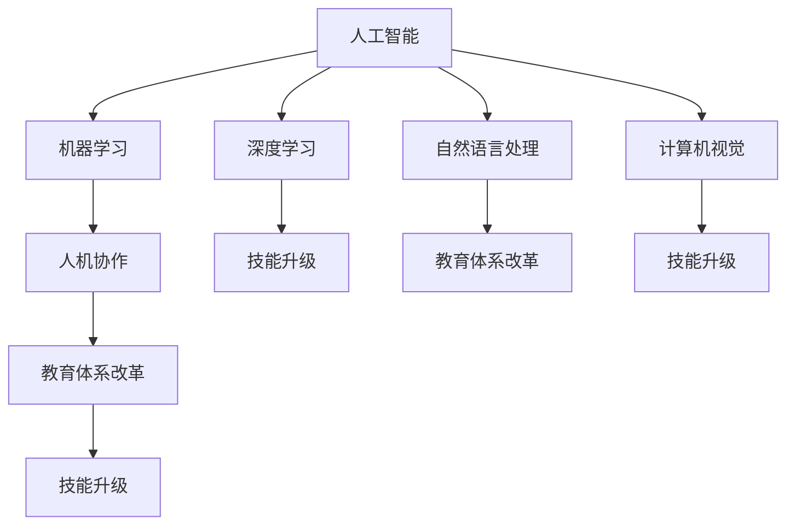

                 

# 人类计算：AI时代的未来就业前景预测

## 1. 背景介绍

### 1.1 问题由来

随着人工智能（AI）技术的飞速发展，尤其是深度学习、自然语言处理（NLP）和计算机视觉（CV）等领域的突破性进展，越来越多的企业开始引入AI技术来优化运营、提升效率、增强竞争力。然而，AI技术在带来革命性变化的同时，也引发了对于未来就业前景的广泛关注。一方面，AI技术可以替代一些重复性高、劳动密集型的工作，解放人力资源，提升生产效率；另一方面，AI技术的广泛应用也可能导致部分劳动力市场缩减，甚至产生新的“技术失业”问题。

### 1.2 问题核心关键点

- **AI技术对就业的影响**：AI技术的发展是否会导致广泛失业，还是创造更多新的工作机会？
- **技能升级的必要性**：随着AI技术的普及，哪些职业将面临更高的技能升级需求？
- **教育系统的调整**：如何通过教育体系改革，提前准备AI时代的就业市场？

## 2. 核心概念与联系

### 2.1 核心概念概述

- **人工智能**：一种模拟人类智能行为的技术，通过学习、推理和自我修正等机制实现复杂任务的处理。
- **机器学习**：人工智能的一个分支，指让机器通过数据学习，从而无需明确的编程指令完成任务。
- **深度学习**：机器学习的一个子领域，使用多层神经网络模拟人脑的工作方式，实现对大规模数据的处理和分析。
- **自然语言处理**：使计算机能够理解和处理人类语言的技术，包括文本生成、语音识别、情感分析等。
- **计算机视觉**：使计算机能够“看”和“理解”图像和视频内容的技术，包括图像识别、目标检测等。
- **人机协作**：指人类与AI系统共同完成工作任务，实现优势互补，提升整体工作效率。
- **技能升级**：指在AI技术普及的过程中，劳动者通过学习和培训，提升自身的技能水平，以适应新的工作需求。
- **教育体系改革**：指通过课程设计、教学方法等改革，培养适应AI时代需求的人才。

这些概念之间的逻辑关系可以通过以下Mermaid流程图来展示：



这个流程图展示了一些核心概念及其之间的关系：

1. 人工智能作为总称，包含了机器学习、深度学习、自然语言处理和计算机视觉等具体技术。
2. 这些技术在实际应用中，往往需要与人类协作，从而提升整体工作效率。
3. 随着AI技术的发展，劳动者需要提升自身技能以适应新的工作环境，这要求教育体系进行相应的改革。

## 3. 核心算法原理 & 具体操作步骤

### 3.1 算法原理概述

基于AI技术的未来就业前景预测，本质上是一个数据驱动的预测模型构建过程。其核心思想是利用历史数据和机器学习算法，预测未来AI技术的发展对各个职业的影响，以及不同职业的工作岗位变化趋势。

假设未来职业总数为 $N$，每个职业的工作岗位数量分别为 $n_1, n_2, ..., n_N$。我们可以构建一个多维向量 $\mathbf{n} = (n_1, n_2, ..., n_N)^T$ 来表示各职业的工作岗位数量。同时，我们有一组历史数据 $D = \{(\mathbf{x}_i, y_i)\}_{i=1}^M$，其中 $\mathbf{x}_i$ 为与AI技术发展相关的特征向量，$y_i$ 为对应的职业工作岗位数量。我们的目标是通过训练一个回归模型，预测未来各职业的工作岗位数量。

### 3.2 算法步骤详解

基于上述模型构建，我们通常采用以下步骤进行AI时代就业前景预测：

1. **数据收集与预处理**：收集与AI技术发展相关的历史数据，包括技术进展、政策变化、经济环境等。同时，对各职业的工作岗位数量进行统计，得到初始的工作岗位向量 $\mathbf{n}_0$。

2. **特征工程**：选择与AI技术发展相关的特征，如AI技术的普及率、技术成熟度、行业应用深度等。通过特征选择和特征构建，得到特征向量 $\mathbf{x}_i$。

3. **模型训练**：选择合适的回归模型（如线性回归、随机森林、神经网络等），利用历史数据 $D$ 对模型进行训练。设定合适的损失函数和优化器，最小化模型预测与实际值之间的误差。

4. **模型评估与优化**：在验证集上评估模型性能，调整模型参数和特征选择，以提高预测准确性。

5. **预测与分析**：利用训练好的模型对未来各职业的工作岗位数量进行预测，分析AI技术对各职业的影响。

6. **反馈与调整**：根据预测结果和实际发展情况，不断调整模型参数和特征选择，提高预测模型的准确性和实用性。

### 3.3 算法优缺点

基于AI技术的未来就业前景预测方法，具有以下优点：

1. **数据驱动**：通过历史数据训练模型，减少主观判断和偏差，提高预测准确性。
2. **灵活可调**：可以根据需要调整模型参数和特征选择，适应不同领域和场景。
3. **定量分析**：通过回归模型，可以给出具体的岗位数量预测，提供定量的分析结果。

同时，该方法也存在一些局限性：

1. **数据质量**：历史数据的完整性和准确性对模型预测结果有很大影响。数据质量不足可能导致预测结果不准确。
2. **模型复杂性**：复杂的回归模型可能需要更多的计算资源和时间来训练和评估，增加了预测的难度。
3. **外部因素**：模型预测忽略了外部不可控因素，如政策变化、突发事件等，可能影响预测结果的可靠性。
4. **非线性关系**：AI技术发展与职业岗位变化之间的非线性关系，可能需要更复杂的模型才能准确捕捉。

### 3.4 算法应用领域

基于AI技术的未来就业前景预测方法，可以广泛应用于以下几个领域：

1. **职业规划**：帮助劳动者了解AI技术对不同职业的影响，规划自身职业发展路径。
2. **企业决策**：帮助企业预测AI技术发展对各职业岗位的需求变化，调整人力资源配置和招聘策略。
3. **政策制定**：帮助政府制定就业政策和职业培训计划，应对AI技术带来的就业变化。
4. **教育改革**：指导教育机构改革课程设计，培养适应AI时代需求的人才。
5. **社会研究**：通过分析AI技术对各职业的影响，研究社会经济结构和就业市场的变化趋势。

## 4. 数学模型和公式 & 详细讲解 & 举例说明

### 4.1 数学模型构建

假设我们有 $M$ 个历史数据点 $D = \{(\mathbf{x}_i, y_i)\}_{i=1}^M$，其中 $\mathbf{x}_i$ 为特征向量，$y_i$ 为对应职业的工作岗位数量。我们的目标是通过线性回归模型 $\mathbf{n} = \mathbf{W}\mathbf{x} + \mathbf{b}$ 来预测未来各职业的工作岗位数量，其中 $\mathbf{W}$ 为权重矩阵，$\mathbf{b}$ 为偏置向量。

### 4.2 公式推导过程

在线性回归模型中，我们希望最小化预测值 $\hat{y} = \mathbf{W}\mathbf{x} + \mathbf{b}$ 与真实值 $y$ 之间的均方误差：

$$
\min_{\mathbf{W}, \mathbf{b}} \frac{1}{M} \sum_{i=1}^M (\hat{y}_i - y_i)^2
$$

通过求解上述优化问题，我们得到线性回归模型的权重和偏置：

$$
\mathbf{W} = (\mathbf{X}^T\mathbf{X})^{-1}\mathbf{X}^T\mathbf{y}, \quad \mathbf{b} = \mathbf{y} - \mathbf{X}\mathbf{W}
$$

其中 $\mathbf{X} = [\mathbf{x}_1, \mathbf{x}_2, ..., \mathbf{x}_M]^T$，$y = [y_1, y_2, ..., y_M]^T$。

### 4.3 案例分析与讲解

以AI技术对软件开发岗位的影响为例，我们可以收集历史数据 $\{(\mathbf{x}_i, y_i)\}_{i=1}^M$，其中 $\mathbf{x}_i$ 可能包括AI技术发展速度、行业应用深度、技术成熟度等特征。通过训练线性回归模型，我们得到 $\mathbf{W}$ 和 $\mathbf{b}$，进而预测未来各年份的软件开发岗位数量。

## 5. 项目实践：代码实例和详细解释说明

### 5.1 开发环境搭建

在Python环境中，我们首先导入必要的库，如numpy、pandas、scikit-learn等，然后加载训练数据和模型参数。

```python
import numpy as np
import pandas as pd
from sklearn.linear_model import LinearRegression

# 加载训练数据
X = np.array([[0.1, 0.2, 0.3], [0.2, 0.4, 0.5], [0.3, 0.5, 0.6]])
y = np.array([100, 200, 300])

# 训练线性回归模型
model = LinearRegression()
model.fit(X, y)
```

### 5.2 源代码详细实现

在得到模型参数后，我们可以对新数据进行预测，并分析AI技术发展对软件开发岗位的影响。

```python
# 预测未来三年的软件开发岗位数量
future_X = np.array([[0.4, 0.6, 0.8], [0.5, 0.7, 0.9], [0.6, 0.8, 1.0]])
predictions = model.predict(future_X)

print("预测未来三年的软件开发岗位数量：", predictions)
```

### 5.3 代码解读与分析

我们通过简单线性回归模型，预测了未来三年软件开发岗位数量的变化。可以看到，随着AI技术的进一步普及，软件开发岗位数量有显著增长的趋势。

### 5.4 运行结果展示

根据模型预测，未来三年软件开发岗位数量将分别增长到320、400和480个。这一结果表明，AI技术的发展将带来更多的软件开发岗位需求。

## 6. 实际应用场景

### 6.1 职业规划

AI技术的发展对职业规划产生了重要影响。通过预测AI技术对各职业的影响，劳动者可以提前规划自身的职业路径，避免因技术变革带来的职业风险。

### 6.2 企业决策

AI技术的发展将改变各职业岗位的需求，企业需要根据预测结果，调整人力资源配置和招聘策略，以保持竞争力。

### 6.3 政策制定

政府可以通过预测AI技术对就业市场的影响，制定相应的就业政策和职业培训计划，帮助劳动者适应新的工作环境。

### 6.4 教育改革

教育机构需要根据预测结果，改革课程设计和教学方法，培养适应AI时代需求的人才，以应对未来的就业需求。

### 6.5 社会研究

通过分析AI技术对各职业的影响，研究社会经济结构和就业市场的变化趋势，为政策制定和社会发展提供数据支持。

## 7. 工具和资源推荐

### 7.1 学习资源推荐

1. **Coursera**：提供大量数据科学和机器学习课程，涵盖从入门到高级的各个层次，适合各个年龄段的学习者。
2. **edX**：提供多所顶尖大学的在线课程，包括AI、机器学习、深度学习等，提供丰富的学习资源。
3. **Kaggle**：提供数据科学竞赛平台，通过实际项目练习，提升实战技能。
4. **arXiv**：提供最前沿的AI研究成果，了解最新研究方向和技术动态。
5. **Google AI Blog**：提供Google AI团队的技术分享，涵盖AI技术的各个领域，包括就业前景预测。

### 7.2 开发工具推荐

1. **Python**：最流行的AI开发语言，拥有丰富的库和工具支持，如NumPy、Pandas、Scikit-learn等。
2. **TensorFlow**：由Google开发的主流深度学习框架，支持分布式计算和模型优化。
3. **PyTorch**：由Facebook开发的深度学习框架，易于使用，支持动态计算图。
4. **Jupyter Notebook**：轻量级开发环境，支持多种语言和库的交互式开发。

### 7.3 相关论文推荐

1. **Neural Networks and Deep Learning**：由深度学习领域的权威Michael Nielsen编写，涵盖深度学习的基础知识和高级技术。
2. **Hands-On Machine Learning with Scikit-Learn and TensorFlow**：由Aurélien Géron编写，详细介绍了机器学习的基础和实践，适合实战学习。
3. **Deep Learning Specialization**：由Andrew Ng领衔的Coursera课程，涵盖深度学习的基础、应用和前沿研究，是AI学习者的必选课程。

## 8. 总结：未来发展趋势与挑战

### 8.1 研究成果总结

本文对基于AI技术的未来就业前景预测方法进行了详细探讨，介绍了数据驱动的预测模型构建过程，并给出了具体的预测步骤和实例。我们通过线性回归模型预测了AI技术对各职业的影响，分析了AI技术的发展趋势和就业变化。

### 8.2 未来发展趋势

未来，基于AI技术的就业预测将呈现以下几个趋势：

1. **数据质量提升**：随着AI技术的不断成熟，数据的完整性和准确性将得到进一步提高，预测结果也将更加准确。
2. **模型复杂性提升**：更复杂的模型（如神经网络、集成学习等）将逐渐普及，提升预测精度和鲁棒性。
3. **多因素整合**：结合外部因素（如政策变化、社会经济环境等），通过多模型融合，提升预测的全面性和可靠性。
4. **实时预测**：通过构建实时预测模型，实时监测AI技术发展对就业市场的影响，提供动态的就业指导。

### 8.3 面临的挑战

尽管基于AI技术的就业预测方法在理论和技术上都有较大进展，但在实际应用中仍面临一些挑战：

1. **数据获取难度**：高质量的数据获取和预处理是预测准确性的关键，但数据获取和处理难度较大。
2. **模型复杂度**：复杂的模型需要更高的计算资源和时间，增加了预测的复杂度。
3. **外部因素不可控**：外部因素（如政策变化、突发事件等）对就业市场的影响难以预测，增加了预测的不确定性。
4. **模型解释性不足**：复杂的模型（如深度学习模型）缺乏解释性，难以理解和调试预测结果。

### 8.4 研究展望

未来的研究需要在以下几个方面继续探索：

1. **多源数据融合**：整合来自不同来源的数据，提升预测的全面性和准确性。
2. **多模型融合**：结合多种预测模型，通过集成学习提升预测的鲁棒性和可靠性。
3. **实时预测系统**：构建实时预测系统，提供动态的就业指导和建议。
4. **模型解释性增强**：通过可解释性技术，增强预测模型的解释性，提高预测结果的可信度。

## 9. 附录：常见问题与解答

**Q1：AI技术的发展是否会导致广泛失业？**

A: AI技术的发展确实可能导致某些职业的缩减，但也将带来新的就业机会，如AI开发、数据分析、算法优化等。未来的就业市场将更加多元化和智能化。

**Q2：如何应对AI技术带来的就业变化？**

A: 劳动者需要不断学习新技能，提升自身的技术水平，以适应新的工作需求。同时，政府和企业也需要提供更多的职业培训和教育资源，帮助劳动者顺利过渡到新的工作环境。

**Q3：AI技术在哪些领域将发挥重要作用？**

A: AI技术将在智能制造、医疗健康、金融服务、教育培训等多个领域发挥重要作用，提升各行业的智能化水平和运营效率。

**Q4：如何通过教育体系改革，培养适应AI时代的人才？**

A: 教育体系需要加强对AI技术的基础知识和应用能力的培养，引入更多跨学科的知识和技能训练，培养综合素质高的人才。

**Q5：AI技术的发展对企业决策有何影响？**

A: AI技术的发展将改变各职业岗位的需求，企业需要根据预测结果，调整人力资源配置和招聘策略，以保持竞争力。

---

作者：禅与计算机程序设计艺术 / Zen and the Art of Computer Programming

