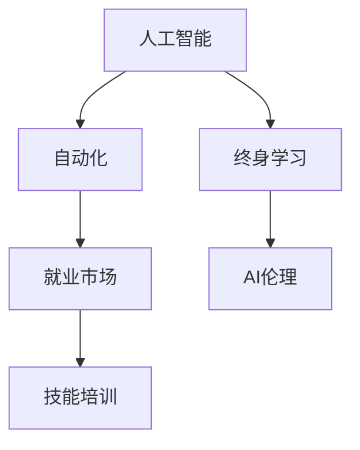

                 

# 人类计算：AI时代的未来就业市场与技能培训发展分析

> 关键词：人工智能，自动化，就业市场，技能培训，未来工作，AI教育

## 1. 背景介绍

在人工智能(AI)浪潮席卷全球的今天，我们见证了无数行业和职业的深刻变革。从制造业到金融业，从医疗健康到教育服务，AI正在重新定义工作的内容、形式和未来。但与此同时，它也带来了新的挑战和机遇。如何适应这一变化，是每个从业者和政策制定者都在思考的问题。

### 1.1 问题的由来

随着AI技术的快速发展，许多传统职业开始面临被自动化取代的风险。一方面，AI可以在许多重复性和数据分析类工作中实现高效替代，显著提高工作效率。另一方面，AI在处理复杂决策、创造性任务和人际互动等方面仍存在局限。

然而，新的AI应用也催生了大量的新职业。如数据科学家、机器学习工程师、AI伦理专家等，为职场提供了新的发展空间。如何有效转变劳动市场，培养适应AI时代的新型人才，成为当前社会的一大挑战。

### 1.2 问题核心关键点

AI时代的就业市场变化主要体现在以下几个方面：
- **职业替代与创造**：AI自动化取代了一些低技能、重复性高的工作，同时创造了一些新的高技能、高附加值的工作。
- **技能要求变化**：新职业对人才的技能要求发生了变化，特别是对AI、数据分析和编程技能的需求大幅上升。
- **教育培训需求**：终身学习成为常态，教育培训机构需要不断更新课程内容，以适应市场需求。
- **工作环境与伦理**：AI带来的自动化和智能化改变了工作环境和劳动方式，对工作伦理和安全性提出了更高要求。
- **国际竞争**：全球范围内的人才竞争加剧，各国需制定相关政策以吸引和培养高素质人才。

这些关键点共同构成了AI时代就业市场与技能培训的主要挑战和机遇。

## 2. 核心概念与联系

### 2.1 核心概念概述

为更好地理解AI时代的就业市场与技能培训，本节将介绍几个核心概念：

- **人工智能(AI)**：广义上指通过计算机模拟人脑的智能行为，包括机器学习、深度学习、自然语言处理等。
- **自动化(Automation)**：指使用AI、机器人等技术代替人工执行任务的过程。
- **就业市场**：劳动力供需关系的集合体，受经济发展、技术进步、政策变化等因素影响。
- **技能培训**：旨在提升劳动者技能水平，使其适应新的就业环境的教育活动。
- **终身学习**：终身持续学习的理念，提倡在不同阶段获取新的知识和技能。
- **AI伦理**：涉及AI应用中道德、法律、社会等方面问题的研究。

这些概念之间的逻辑关系可以通过以下Mermaid流程图来展示：



这个流程图展示了AI、自动化与就业市场、技能培训之间的联系。自动化通过AI技术实现，进而改变了就业市场对人才的需求，技能培训则需要适应这种变化。终身学习与AI伦理则是应对这一变化的重要策略。

## 3. 核心算法原理 & 具体操作步骤
### 3.1 算法原理概述

AI时代就业市场与技能培训的核心问题在于如何通过算法优化实现劳动力市场的平稳过渡和人才的精准培养。这通常包括以下几个步骤：

1. **市场调研**：通过大数据分析，评估AI对各行业就业结构的影响，识别出高风险和低风险职业。
2. **技能映射**：建立AI技能与传统职业技能之间的映射关系，确定需要新增或减少哪些技能。
3. **模型构建**：基于机器学习算法构建技能培训推荐模型，预测不同技能培训的就业前景。
4. **策略制定**：根据模型预测结果，制定技能培训策略，优化教育资源配置。
5. **实施监督**：通过评估和反馈机制，实时监控技能培训效果，并调整优化策略。

### 3.2 算法步骤详解

基于AI的就业市场与技能培训优化算法步骤如下：

**Step 1: 市场调研**
- 收集就业数据，包括岗位需求、工资水平、岗位稳定性等指标。
- 使用机器学习模型预测AI对各岗位的影响，识别出高风险和低风险职业。

**Step 2: 技能映射**
- 分析高风险职业的技能要求，将其映射为AI技能。
- 通过专家评审和行业调研，确定哪些传统技能需要保留，哪些需要替换为AI技能。

**Step 3: 模型构建**
- 基于历史就业数据和技能映射结果，构建技能培训推荐模型。
- 使用监督学习算法，如随机森林、梯度提升树等，预测不同技能培训的就业前景。

**Step 4: 策略制定**
- 根据模型预测结果，制定技能培训策略，包括培训课程、培训时间、培训对象等。
- 结合市场需求，调整培训计划，确保资源合理配置。

**Step 5: 实施监督**
- 通过跟踪就业数据，评估技能培训效果。
- 根据反馈结果，调整培训内容，优化培训策略。

### 3.3 算法优缺点

基于AI的就业市场与技能培训优化算法具有以下优点：
1. **数据驱动决策**：通过大量数据驱动的算法预测，提高了决策的科学性和准确性。
2. **动态调整**：能够实时跟踪市场变化，动态调整培训策略，适应快速变化的市场需求。
3. **优化资源**：优化教育资源配置，提高培训效率，降低培训成本。
4. **精准定位**：基于技能映射，精准识别出需要新增和减少的技能，避免培训资源的浪费。

同时，该算法也存在一些局限性：
1. **数据依赖性高**：算法的预测效果依赖于高质量、高完整性的数据。数据获取和处理难度较大。
2. **算法复杂度高**：构建和训练算法模型需要高水平的数学和编程技能，对数据科学家的要求较高。
3. **模型解释性差**：复杂的算法模型难以解释其决策过程，用户难以理解模型输出的原因。
4. **伦理问题**：模型预测和策略制定可能涉及隐私、就业歧视等伦理问题。

尽管存在这些局限，但基于AI的技能培训优化算法在就业市场预测和优化方面展示了显著的优势。

### 3.4 算法应用领域

该算法主要应用于以下几个领域：

- **劳动力市场预测**：预测AI对各行业就业结构的影响，识别高风险和低风险职业。
- **技能培训设计**：制定精准的技能培训策略，确保培训内容与市场需求一致。
- **教育资源优化**：合理配置教育资源，提升培训效果和资源利用率。
- **终身学习支持**：根据市场需求，推荐终身学习路径，提升劳动者适应性。
- **AI伦理保障**：通过算法评估，确保AI技能培训不涉及歧视和偏见。

在以上应用场景中，基于AI的技能培训优化算法已展现出显著的效果，帮助各国和机构有效应对AI时代的就业挑战，提升人才培养的质量和效率。

## 4. 数学模型和公式 & 详细讲解 & 举例说明

### 4.1 数学模型构建

基于AI的就业市场与技能培训优化算法主要依赖于以下几个数学模型：

1. **就业市场预测模型**：用于评估AI对各行业就业结构的影响，模型输入为行业特征和AI技能映射数据，输出为各岗位的高风险概率。
2. **技能培训推荐模型**：预测不同技能培训的就业前景，模型输入为技能映射数据和历史就业数据，输出为各技能培训的就业提升率。
3. **教育资源优化模型**：评估不同培训策略的效果，模型输入为培训策略和历史就业数据，输出为培训策略的优化建议。

### 4.2 公式推导过程

以下我们以就业市场预测模型为例，推导模型公式：

设行业特征为 $\mathbf{x}$，AI技能映射为 $\mathbf{y}$，市场预测模型为 $f(\mathbf{x}, \mathbf{y})$。假设模型为线性回归模型，则预测公式为：

$$
f(\mathbf{x}, \mathbf{y}) = \mathbf{W} \cdot \mathbf{x} + \mathbf{b}
$$

其中，$\mathbf{W}$ 为权重矩阵，$\mathbf{b}$ 为偏置向量。通过对历史数据进行训练，可以得到最优的 $\mathbf{W}$ 和 $\mathbf{b}$，进而预测任意行业特征和AI技能映射下的高风险概率。

### 4.3 案例分析与讲解

假设某国政府准备推出一项技能培训政策，用于帮助工人适应AI带来的就业变化。使用就业市场预测模型，政府首先需要对各行业进行风险评估。

设某行业的特征向量为 $\mathbf{x} = (x_1, x_2, ..., x_n)$，其中 $x_i$ 为行业第 $i$ 个特征。根据历史数据，模型预测出该行业的技能映射向量 $\mathbf{y} = (y_1, y_2, ..., y_m)$，其中 $y_i$ 表示该行业对第 $i$ 项AI技能的需求程度。

将 $\mathbf{x}$ 和 $\mathbf{y}$ 输入预测模型 $f(\mathbf{x}, \mathbf{y})$，可以得到该行业的高风险概率 $P_{\text{risk}}$。根据 $P_{\text{risk}}$，政府可以识别出高风险行业，制定相应的技能培训策略。

## 5. 项目实践：代码实例和详细解释说明

### 5.1 开发环境搭建

在进行就业市场与技能培训优化算法的实践前，我们需要准备好开发环境。以下是使用Python进行机器学习开发的环境配置流程：

1. 安装Anaconda：从官网下载并安装Anaconda，用于创建独立的Python环境。

2. 创建并激活虚拟环境：
```bash
conda create -n ai-env python=3.8 
conda activate ai-env
```

3. 安装相关库：
```bash
conda install numpy pandas scikit-learn statsmodels joblib
pip install pytorch torchvision torchaudio cudatoolkit=11.1 -c pytorch -c conda-forge
```

4. 安装Transformers库：
```bash
pip install transformers
```

完成上述步骤后，即可在`ai-env`环境中开始就业市场与技能培训优化算法的开发实践。

### 5.2 源代码详细实现

这里我们以就业市场预测模型为例，给出基于Python和Scikit-learn的机器学习代码实现。

```python
import numpy as np
import pandas as pd
from sklearn.model_selection import train_test_split
from sklearn.linear_model import LinearRegression
from sklearn.metrics import mean_squared_error

# 加载数据
df = pd.read_csv('就业数据.csv')

# 数据预处理
X = df.drop(['高风险概率'], axis=1).values
y = df['高风险概率'].values

# 划分训练集和测试集
X_train, X_test, y_train, y_test = train_test_split(X, y, test_size=0.2, random_state=42)

# 训练模型
model = LinearRegression()
model.fit(X_train, y_train)

# 预测
y_pred = model.predict(X_test)

# 评估
mse = mean_squared_error(y_test, y_pred)
print(f"Mean Squared Error: {mse:.2f}")
```

上述代码实现了基于线性回归模型的就业市场预测。可以看到，利用Scikit-learn库，只需几行代码即可实现模型的构建和训练。

### 5.3 代码解读与分析

让我们再详细解读一下关键代码的实现细节：

**数据加载**：
- `pd.read_csv()`：用于加载CSV格式的数据文件，转换为Pandas DataFrame格式。
- `df.drop()`：用于删除不需要的列，如"高风险概率"。

**数据预处理**：
- `X = df.drop(['高风险概率'], axis=1).values`：将数据转换为特征矩阵X，去除标签列。
- `y = df['高风险概率'].values`：将标签列转换为标签向量y。

**模型训练**：
- `model = LinearRegression()`：创建线性回归模型。
- `model.fit(X_train, y_train)`：使用训练集训练模型。

**预测与评估**：
- `y_pred = model.predict(X_test)`：使用测试集进行预测。
- `mean_squared_error(y_test, y_pred)`：计算预测误差，用于评估模型性能。

通过上述代码的实现，我们可以看到，利用Python和Scikit-learn库，可以轻松构建和训练基于机器学习的就业市场预测模型。

## 6. 实际应用场景

### 6.1 智慧就业服务系统

基于AI的技能培训优化算法可以应用于构建智慧就业服务系统，帮助政府和机构更高效地进行劳动力市场预测和技能培训。

在技术实现上，可以构建一个包含市场预测、技能推荐、培训评估等功能模块的系统。系统接收来自劳动市场的实时数据，通过算法预测高风险职业，并根据市场需求推荐相应的技能培训课程。同时，系统还应具备动态调整能力，根据培训效果实时优化培训策略。

### 6.2 企业人力资源管理

企业也可以利用该算法优化人力资源管理，确保人才培训策略与市场需求一致。通过构建企业内部的技能映射和就业风险评估模型，企业可以识别出潜在的高风险岗位，并根据实际情况制定相应的培训计划。

### 6.3 职业发展指导

教育机构和职业培训机构可以利用该算法为学生和从业者提供个性化的职业发展指导。通过对市场趋势和技能需求进行预测，机构可以推荐最适合的学习路径和技能培训课程，帮助学员提高就业竞争力。

### 6.4 未来应用展望

随着AI技术的不断进步，基于AI的技能培训优化算法将在更多领域得到应用，为劳动市场和人才培养提供更精准的指导和支持。

在智慧医疗领域，AI可以辅助医生进行职业规划，根据市场需求推荐相关的医学技能培训，提高医生的职业发展速度和质量。

在智能制造领域，AI可以帮助工厂工人识别高风险职业，推荐相关的技能培训课程，提升生产效率和工人技能水平。

在教育领域，AI可以个性化推荐学习资源，根据市场需求调整教育课程，培养适应未来工作的技能。

此外，在政府治理、环境保护、文化创意等领域，基于AI的技能培训优化算法也将发挥重要作用，推动各行各业的数字化转型。

## 7. 工具和资源推荐

### 7.1 学习资源推荐

为了帮助开发者系统掌握基于AI的就业市场与技能培训理论基础和实践技巧，这里推荐一些优质的学习资源：

1. **《机器学习实战》系列博文**：由数据科学家撰写，涵盖机器学习、深度学习、自然语言处理等前沿话题，适合入门学习。
2. **Coursera《机器学习》课程**：斯坦福大学开设的机器学习经典课程，有视频讲解和配套作业，适合系统学习机器学习理论。
3. **《Python数据科学手册》书籍**：涵盖Python在数据科学中的应用，包括机器学习、数据处理等，适合进阶学习。
4. **Kaggle数据竞赛平台**：参与数据竞赛，实战练习，积累经验，提升技能。
5. **GitHub开源项目**：查找和参与开源项目，学习代码实现和最佳实践。

通过对这些资源的学习实践，相信你一定能够快速掌握基于AI的就业市场与技能培训的精髓，并用于解决实际的就业问题。

### 7.2 开发工具推荐

高效的开发离不开优秀的工具支持。以下是几款用于基于AI的就业市场与技能培训开发的常用工具：

1. Python：基于Python的生态系统，包含丰富的第三方库和框架，适合数据处理和模型构建。
2. Jupyter Notebook：交互式编程环境，支持代码实时展示和调试，适合学习和实验。
3. Scikit-learn：基于Python的机器学习库，提供了丰富的算法和工具，适合快速迭代和实验。
4. TensorFlow和PyTorch：深度学习框架，支持构建和训练复杂的神经网络模型，适合处理高维数据和大规模训练。
5. Keras：基于TensorFlow和PyTorch的高级深度学习库，提供了简单易用的接口，适合快速原型开发。

合理利用这些工具，可以显著提升基于AI的就业市场与技能培训任务的开发效率，加快创新迭代的步伐。

### 7.3 相关论文推荐

基于AI的就业市场与技能培训的发展源于学界的持续研究。以下是几篇奠基性的相关论文，推荐阅读：

1. **《机器学习实战》**：由机器学习专家撰写，全面介绍了机器学习算法和实践，适合初学者学习。
2. **《深度学习》**：DeepMind的深度学习专家撰写，涵盖深度学习理论和算法，适合进阶学习。
3. **《自然语言处理综述》**：涵盖自然语言处理的基础知识和技术，适合了解NLP应用的开发者。
4. **《智能系统设计》**：介绍了智能系统的设计方法和应用，适合跨领域的从业者学习。
5. **《机器学习系统》**：全面介绍机器学习系统的设计、实现和优化，适合开发者和系统架构师。

这些论文代表了大规模AI就业市场与技能培训技术的发展脉络。通过学习这些前沿成果，可以帮助研究者把握学科前进方向，激发更多的创新灵感。

## 8. 总结：未来发展趋势与挑战

### 8.1 总结

本文对基于AI的就业市场与技能培训进行了全面系统的介绍。首先阐述了AI时代就业市场变化的现状和主要挑战，明确了技能培训在适应新环境中的重要性。其次，从原理到实践，详细讲解了基于AI的技能培训优化算法的构建和操作步骤，给出了就业市场预测的代码实现。同时，本文还广泛探讨了该算法在智慧就业服务系统、企业人力资源管理、职业发展指导等多个领域的应用前景，展示了其广泛的应用价值。最后，本文精选了算法开发所需的各类学习资源，力求为读者提供全方位的技术指引。

通过本文的系统梳理，可以看到，基于AI的技能培训优化算法正在成为就业市场和人才培养的重要工具，极大地提升了市场预测和技能培训的效率和精度。未来，伴随AI技术的不断演进和深入应用，基于AI的就业市场与技能培训必将在更多行业和领域发挥关键作用，助力实现更加公平、高效和智能的劳动市场。

### 8.2 未来发展趋势

展望未来，基于AI的就业市场与技能培训技术将呈现以下几个发展趋势：

1. **数据驱动决策**：利用大数据和机器学习算法，实时预测市场变化和技能需求，为决策提供科学依据。
2. **动态调整能力**：根据市场反馈实时调整培训策略，确保培训内容与市场需求一致。
3. **个性化指导**：通过分析个体需求和市场趋势，提供个性化的职业发展指导，提升就业竞争力。
4. **跨领域融合**：将AI技术与其他领域（如医疗、教育、制造等）相结合，推动跨领域的就业市场优化。
5. **全球化协作**：基于AI的技能培训优化算法将成为全球化协作的重要工具，促进全球人才流动和资源共享。
6. **伦理与安全**：在算法设计中纳入伦理和安全因素，确保AI技能培训的公平性和安全性。

以上趋势凸显了基于AI的就业市场与技能培训技术的广阔前景。这些方向的探索发展，必将进一步提升就业市场的优化水平，为全球人才培养和职业发展提供更有力的支持。

### 8.3 面临的挑战

尽管基于AI的就业市场与技能培训技术已取得显著进展，但在迈向更加智能化、普适化应用的过程中，仍面临诸多挑战：

1. **数据质量问题**：AI算法的预测效果依赖于高质量、完整性的数据。如何获取和处理海量数据，提升数据质量，仍是重要挑战。
2. **算法复杂性**：构建和训练复杂的AI算法模型需要高水平的数学和编程技能，对数据科学家的要求较高。
3. **模型解释性**：复杂的算法模型难以解释其决策过程，用户难以理解模型输出的原因。
4. **伦理问题**：AI技能培训可能涉及隐私、就业歧视等伦理问题，如何在算法设计中纳入伦理考量，仍需进一步研究。
5. **全球协作**：各国和地区的数据、文化和经济背景差异较大，如何在全球范围内协同开发和应用基于AI的技能培训技术，仍需加强国际合作。

这些挑战需要学界和产业界共同努力，通过多学科合作和政策支持，推动基于AI的就业市场与技能培训技术的成熟和应用。

### 8.4 研究展望

面向未来，基于AI的就业市场与技能培训技术需要在以下几个方面寻求新的突破：

1. **数据获取与处理**：研究高效、自动化的数据采集和处理技术，提升数据质量和可用性。
2. **模型简化与优化**：开发更简单、更易解释的模型，提高算法的可操作性和用户接受度。
3. **跨领域融合**：探索将AI技术与医疗、教育、制造等领域的深度融合，推动跨领域的人才培养和就业市场优化。
4. **伦理与安全**：制定相关政策和技术措施，确保AI技能培训的公平性和安全性。
5. **全球协作**：加强国际合作，推动基于AI的技能培训技术在全球范围内的应用与普及。

这些研究方向将进一步提升基于AI的就业市场与技能培训技术的成熟度和应用范围，推动全球人才市场的优化和发展。总之，通过不断探索和优化，基于AI的技能培训技术必将在未来发挥更大的作用，为全球劳动市场的稳定与繁荣贡献力量。

## 9. 附录：常见问题与解答

**Q1: 为什么AI技术会带来就业市场变化？**

A: AI技术通过自动化和智能化替代了许多低技能、重复性高的工作，同时也创造了新的高技能、高附加值的工作。这种变化导致就业市场对人才的技能要求发生了变化，促使劳动者需要不断提升自身技能以适应新的工作环境。

**Q2: 在AI时代，企业如何培养高素质人才？**

A: 企业可以通过技能培训、终身学习和个性化指导等多种方式，帮助员工提升技能水平。同时，企业还可以引入AI技术，通过数据分析和预测，识别出高风险职业，制定相应的培训计划。

**Q3: 如何确保AI技能培训的公平性和安全性？**

A: 在算法设计中纳入伦理和安全因素，确保算法不涉及隐私、就业歧视等伦理问题。同时，建立监管机制，对AI技能培训进行审查和审计，确保其公平性和安全性。

**Q4: 如何提升AI技能培训的效率和效果？**

A: 通过优化算法和模型，提高数据处理和训练效率。同时，结合实际情况，动态调整培训策略，确保培训内容与市场需求一致，提升培训效果。

**Q5: 未来AI技能培训将面临哪些挑战？**

A: 数据获取和处理、算法复杂性、模型解释性、伦理问题、全球协作等将是未来AI技能培训面临的主要挑战。解决这些挑战需要学界和产业界共同努力，推动AI技能培训技术的成熟和应用。

总之，基于AI的就业市场与技能培训技术正在成为未来就业市场和人才培养的重要工具。通过不断优化和探索，相信该技术必将在全球范围内发挥更大的作用，推动劳动市场和人才培养的进步。

