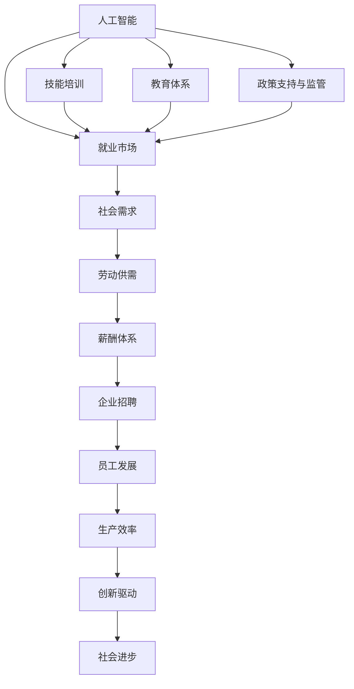

                 

# 人类计算：AI时代的未来就业市场与技能培训发展趋势分析机遇挑战机遇趋势

## 1. 背景介绍

### 1.1 问题由来
随着人工智能(AI)技术的迅猛发展，AI时代悄然来临，带来深刻而广泛的社会影响。AI技术已经在医疗、金融、教育、制造等多个领域大放异彩，极大地提升了生产效率和决策质量。然而，AI技术的发展也带来了新的挑战，尤其是对就业市场和技能培训的深远影响。

### 1.2 问题核心关键点
- **就业市场变化**：AI技术可能替代部分传统岗位，同时创造新的就业机会。关键在于理解AI对就业的实际影响。
- **技能培训需求**：AI技术要求员工掌握新的技术工具，更新知识体系。需要明确技能培训的重要性和方向。
- **教育体系适应**：当前教育体系如何适应AI时代的技能要求，将直接影响未来人才培养的质量和数量。
- **政策支持与监管**：政府、企业和社会组织应如何协同，为AI时代下的就业市场和技能培训提供支持。

### 1.3 问题研究意义
AI时代的就业市场和技能培训发展趋势，对整个社会的稳定和进步至关重要。研究这一问题，有助于：
1. **预测就业市场变化**：为政策制定和企业决策提供依据，提前做好就业调整。
2. **提升教育质量**：确保教育体系培养的人才符合市场和技术发展的需要。
3. **促进公平就业**：通过政策支持，缩小AI技术带来的社会不平等。
4. **推动创新发展**：培养具有AI思维的创新型人才，推动产业升级和创新驱动发展。

## 2. 核心概念与联系

### 2.1 核心概念概述

1. **人工智能**：利用计算机模拟人类的智能行为，通过算法和数据处理，实现自动感知、学习、推理和决策。
2. **就业市场**：与劳动力供需相关的市场环境，包括职位类型、工作性质、薪资水平等。
3. **技能培训**：为了适应技术发展和社会变化，对员工进行有针对性的技能提升和知识更新。
4. **教育体系**：包括学校教育、职业培训、在线学习等多种形式，旨在培养社会所需的人才。
5. **政策支持与监管**：政府制定的相关政策、法规和监管措施，以保障公平就业和技能培训的顺利进行。

### 2.2 核心概念原理和架构的 Mermaid 流程图



这个流程图展示了AI、就业市场、技能培训、教育体系、政策支持与监管之间的联系和互动。AI技术的发展直接影响就业市场和技能培训，而这些又与企业招聘、员工发展、生产效率和社会进步密切相关。

## 3. 核心算法原理 & 具体操作步骤

### 3.1 算法原理概述

AI技术对就业市场和技能培训的影响，可以通过以下几个关键原理来理解：

1. **自动化与替代效应**：AI技术可以自动化完成一些重复性和规律性工作，替代人类劳动力，导致部分岗位消失。
2. **增强与扩展效应**：AI技术可以增强人类的工作能力，扩展工作场景，创造新的职业机会。
3. **技能升级需求**：AI技术要求员工掌握新的工具和方法，提升综合素质，以适应新的工作要求。
4. **教育体系改革**：AI技术的发展推动了教育体系的改革，要求培养具有创新能力和适应能力的人才。

### 3.2 算法步骤详解

1. **数据收集与分析**：收集AI技术在各行业的应用案例，分析其对就业市场的影响。
2. **需求预测模型建立**：利用机器学习模型，预测AI技术对不同岗位的影响，评估技能需求变化。
3. **技能缺口分析**：对比当前岗位需求与员工技能，找出技能缺口，设计针对性的培训课程。
4. **教育体系调整**：根据技能缺口分析结果，调整教育内容和方法，培养符合市场要求的人才。
5. **政策制定与实施**：结合市场需求和教育体系调整，制定相关政策，推动技能培训和就业市场健康发展。

### 3.3 算法优缺点

**优点**：
1. **数据驱动决策**：通过大数据分析和机器学习模型，为政策制定和企业决策提供科学依据。
2. **及时动态调整**：可以实时监测AI技术的发展趋势，及时调整教育内容和就业策略。
3. **广泛适用性**：模型和方法适用于不同行业和岗位，具有普适性。

**缺点**：
1. **数据质量问题**：模型依赖的数据质量直接影响预测结果。不完整或不准确的数据可能导致误判。
2. **模型偏见**：模型可能继承数据中的偏见，产生不公平的预测和决策。
3. **调整难度大**：教育体系和政策调整需要时间，难以快速适应市场需求。

### 3.4 算法应用领域

1. **就业市场预测**：适用于政府、企业和社会组织，为制定就业政策提供依据。
2. **技能培训规划**：适用于职业培训机构、学校和在线教育平台，设计针对性培训课程。
3. **教育体系改革**：适用于教育部门和学校，调整课程设置和教学方法。

## 4. 数学模型和公式 & 详细讲解 & 举例说明

### 4.1 数学模型构建

构建AI技术对就业市场影响预测模型，可以使用以下数学模型：

1. **时间序列模型**：如ARIMA、LSTM等，用于预测就业市场变化趋势。
2. **回归模型**：如线性回归、决策树回归等，用于评估技能需求变化。
3. **分类模型**：如逻辑回归、随机森林等，用于分析不同岗位的AI替代风险。

### 4.2 公式推导过程

以线性回归模型为例，假设输入特征为 $x_i$，目标变量为 $y_i$，模型参数为 $\theta$，损失函数为均方误差，优化目标为最小化损失函数：

$$
\min_{\theta} \sum_{i=1}^n (y_i - \theta^T x_i)^2
$$

求解上述优化问题，得到参数 $\theta$ 的解：

$$
\theta = (\sum_{i=1}^n x_i x_i^T)^{-1} \sum_{i=1}^n x_i y_i
$$

### 4.3 案例分析与讲解

假设我们收集了某行业的历史就业数据，使用LSTM模型预测未来五年内的就业变化。模型输入为时间序列数据，输出为每年的就业人数。模型训练过程如下：

1. 数据预处理：将原始数据进行归一化处理，提取特征。
2. 模型训练：将历史数据分为训练集和验证集，使用均方误差作为损失函数，Adam优化器进行优化。
3. 模型评估：使用测试集评估模型性能，得到未来五年的就业预测值。
4. 结果分析：将预测值与实际数据进行对比，分析预测误差和改进方向。

## 5. 项目实践：代码实例和详细解释说明

### 5.1 开发环境搭建

1. **安装Python环境**：使用Anaconda创建Python虚拟环境，安装必要的依赖包。
2. **数据准备**：收集历史就业数据，进行清洗和预处理。
3. **模型实现**：使用TensorFlow或PyTorch等深度学习框架实现LSTM模型。
4. **训练与评估**：使用历史数据进行模型训练，在验证集上进行性能评估。
5. **结果分析**：分析模型预测结果，提出改进措施。

### 5.2 源代码详细实现

以下是使用TensorFlow实现LSTM模型的代码示例：

```python
import tensorflow as tf
import numpy as np
import pandas as pd

# 数据准备
data = pd.read_csv('employment_data.csv')
X = np.array(data[['year', 'age', 'education']])
y = np.array(data['employment'])

# 数据归一化
X = (X - X.mean()) / X.std()

# 模型实现
model = tf.keras.Sequential([
    tf.keras.layers.LSTM(32, return_sequences=True, input_shape=(X.shape[1], X.shape[2])),
    tf.keras.layers.LSTM(32),
    tf.keras.layers.Dense(1)
])

# 模型编译
model.compile(optimizer='adam', loss='mse')

# 模型训练
model.fit(X, y, epochs=100, batch_size=32, validation_split=0.2)

# 模型评估
test_data = np.array([...])  # 测试集数据
test_loss = model.evaluate(test_data, y)
print('Test loss:', test_loss)
```

### 5.3 代码解读与分析

1. **数据准备**：使用Pandas读取就业数据，并进行清洗和预处理。
2. **数据归一化**：使用均值归一化方法对数据进行标准化处理。
3. **模型实现**：构建包含两个LSTM层的神经网络模型，输出层为线性层。
4. **模型编译**：使用Adam优化器，均方误差作为损失函数。
5. **模型训练**：使用历史数据进行模型训练，设置训练轮数和批次大小。
6. **模型评估**：使用测试集评估模型性能，输出均方误差。

## 6. 实际应用场景

### 6.1 智能制造

AI技术在智能制造中的应用，大幅提升了生产效率和产品质量。例如，通过自动化生产线、智能质检系统等，实现了从原材料到成品的全流程自动化。同时，AI技术也推动了新岗位的创造，如智能维护工程师、数据分析师等。

### 6.2 医疗健康

AI技术在医疗健康领域的应用，带来了医疗服务的智能化和个性化。例如，AI辅助诊断系统、个性化治疗方案等，提升了医疗服务的质量和效率。同时，AI技术也催生了新的就业机会，如数据科学家、AI研究员等。

### 6.3 教育培训

AI技术在教育培训领域的应用，实现了个性化学习、智能辅导等。例如，基于AI的个性化推荐系统、智能学习分析平台等，提升了教育质量和效率。同时，AI技术也推动了教育行业的人才需求变化，需要更多具有AI思维的教育工作者。

### 6.4 未来应用展望

未来，AI技术将继续深入各行各业，带来更广泛的应用场景和就业机会。预计未来五年内，AI技术将进一步推动以下领域的发展：

1. **智能交通**：通过智能交通管理系统、自动驾驶等，提升城市交通效率和安全性。
2. **智能农业**：通过智能监控、自动化设备等，提升农业生产效率和质量。
3. **智慧城市**：通过智能传感器、大数据分析等，提升城市治理和公共服务水平。

## 7. 工具和资源推荐

### 7.1 学习资源推荐

1. **Coursera《AI for Everyone》课程**：由Andrew Ng教授开设，介绍AI基础知识和应用场景。
2. **edX《Deep Learning Specialization》课程**：由Coursera联合MIT等知名大学，系统学习深度学习理论和实践。
3. **Udacity《AI Nanodegree》课程**：通过实际项目，学习AI技术在各个行业的应用。
4. **Kaggle竞赛平台**：参加AI相关的数据竞赛，提升解决实际问题的能力。
5. **Google AI教育资源**：提供AI相关的免费课程、资源和工具，适合各层次学习者。

### 7.2 开发工具推荐

1. **TensorFlow**：由Google开发，支持深度学习和分布式计算。
2. **PyTorch**：由Facebook开发，支持动态图和静态图计算。
3. **Keras**：高层次API，简化深度学习模型的构建和训练。
4. **Jupyter Notebook**：交互式编程环境，支持Python和多种数据处理库。
5. **Anaconda**：Python环境管理工具，提供虚拟环境和依赖管理。

### 7.3 相关论文推荐

1. **《就业市场对人工智能替代的适应性》**：探讨AI技术对不同行业的就业替代效应，提出适应性策略。
2. **《技能培训需求与AI技术发展趋势》**：分析AI技术对技能培训的影响，提出针对性建议。
3. **《AI时代的教育体系改革》**：讨论AI技术对教育体系的影响，提出改革方向。
4. **《政策支持与AI时代就业市场的关系》**：分析政策支持对AI时代就业市场的影响，提出政策建议。

## 8. 总结：未来发展趋势与挑战

### 8.1 研究成果总结

本文通过分析AI技术对就业市场和技能培训的影响，得出以下主要结论：

1. **就业市场动态变化**：AI技术在替代部分岗位的同时，创造新的职业机会。
2. **技能培训需求升级**：AI技术推动技能培训内容和方式的变革。
3. **教育体系调整必要**：教育体系需要适应AI时代的要求，培养具有AI思维的人才。
4. **政策支持与监管至关重要**：政府和企业的协同合作，为AI时代下的就业和技能培训提供保障。

### 8.2 未来发展趋势

1. **技能需求多样化**：AI技术的发展将推动技能需求多样化，需要跨学科和跨领域的复合型人才。
2. **教育内容创新**：教育内容将更加注重实践和应用，培养学生的创新能力和解决问题的能力。
3. **终身学习普及**：终身学习将成为常态，学习者需要不断更新知识和技能，以适应技术发展。
4. **社会公平提升**：AI技术的普及将有助于缩小社会不平等，促进公平就业和高质量发展。

### 8.3 面临的挑战

1. **数据质量问题**：数据的不完整和不准确将影响模型的预测效果。
2. **模型偏见**：模型可能继承数据中的偏见，产生不公平的预测和决策。
3. **教育资源不均衡**：教育资源分配不均，可能导致地区间人才差距拉大。
4. **就业市场变化快**：AI技术发展迅速，就业市场变化快，需要快速调整教育和培训策略。

### 8.4 研究展望

未来的研究可以从以下几个方面进行深入探索：

1. **跨领域技能培训**：开发跨领域技能培训项目，培养具备多技能的人才。
2. **AI伦理教育**：将AI伦理教育纳入教育体系，提升AI技术的社会责任意识。
3. **社会包容性设计**：设计包容性强的AI应用，减少技术带来的社会不平等。
4. **AI与人类协作**：探索AI与人类协作的新模式，提升工作效率和质量。

## 9. 附录：常见问题与解答

**Q1：AI技术如何影响就业市场？**

A: AI技术对就业市场的影响是多方面的：
1. **替代效应**：自动化和智能化系统可以替代部分重复性和规律性工作，导致这些岗位减少。
2. **增强效应**：AI技术可以增强人类工作能力，扩展工作场景，创造新的职业机会。
3. **技能需求变化**：AI技术要求员工掌握新的技能和知识，提升综合素质。

**Q2：当前教育体系如何适应AI时代？**

A: 当前教育体系需要从以下几个方面进行适应：
1. **课程内容更新**：增加AI相关的课程内容，培养学生的AI思维和实践能力。
2. **教学方法改革**：采用混合式学习、项目导向等新型教学方法，提升学习效果。
3. **教育资源整合**：整合线上线下教育资源，提供高质量的AI学习平台。
4. **学生素质提升**：注重学生的创新能力和解决问题的能力培养，适应AI时代的需求。

**Q3：政府和企业应如何协同支持AI时代的就业和技能培训？**

A: 政府和企业的协同支持可以从以下几个方面进行：
1. **政策支持**：政府制定相关政策，支持AI技术在就业市场的应用，提供资金和资源支持。
2. **企业参与**：企业参与技能培训，与教育机构合作，提供实际工作场景和案例分析。
3. **人才培养**：政府和企业共同投入，培养具有AI思维的人才，满足市场需求。
4. **市场监管**：政府和企业共同制定标准和规范，保障AI技术的公平使用和应用安全。

**Q4：技能培训应如何满足AI时代的需求？**

A: 技能培训应从以下几个方面满足AI时代的需求：
1. **个性化培训**：根据学习者的需求和背景，设计个性化的培训方案。
2. **跨学科学习**：培养具有跨学科知识和技能的复合型人才，适应多领域的工作需求。
3. **实战演练**：通过实战项目和案例分析，提升学习者的实践能力和应用能力。
4. **持续学习**：倡导终身学习，定期更新知识和技能，适应AI技术的发展。

**Q5：AI技术的普及如何影响社会公平？**

A: AI技术的普及对社会公平的影响主要体现在以下几个方面：
1. **就业机会增加**：AI技术可以创造新的就业机会，减少失业率，提升社会公平。
2. **技能提升机会**：AI技术推动技能培训，提升劳动者的技能水平，增强竞争力。
3. **教育资源均衡**：AI技术可以打破地域和资源限制，提供高质量的教育资源，促进教育公平。
4. **社会福利改善**：AI技术在医疗、养老等社会福利领域的应用，改善社会服务质量，提升社会公平。

---

作者：禅与计算机程序设计艺术 / Zen and the Art of Computer Programming

