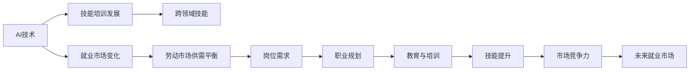

                 

# 人类计算：AI时代的未来就业市场与技能培训发展趋势预测分析挑战

## 1. 背景介绍

在AI时代，人类的计算能力面临前所未有的挑战与机遇。一方面，自动化和智能化的浪潮正在迅速改变各行各业的运作模式，许多传统岗位将逐渐被AI技术所取代；另一方面，AI技术的崛起也催生了大量新的岗位需求，要求人才具备全新的技能与知识。本文将从就业市场的变化与技能培训发展的角度，探讨AI时代人类计算的现状与未来，提出一些具有前瞻性的观点和建议。

## 2. 核心概念与联系

### 2.1 核心概念概述

- **AI时代的就业市场变化**：AI技术的崛起将导致许多传统岗位消失，同时也会催生大量新的岗位需求，要求人才具备新的技能。理解AI对就业市场的长期影响，对于职业规划和教育培训具有重要意义。

- **技能培训发展**：为了应对AI时代的技术变革，教育机构和企业需要设计新的培训课程和教学方法，以提高劳动力的技能水平。培训不仅要关注技术技能，也要重视软技能，如创造力、批判性思维等。

- **跨领域技能**：在AI时代，许多工作将需要跨领域的知识和技能。例如，数据分析与领域专业知识结合，使得数据科学家成为热门职业。

### 2.2 核心概念原理和架构的 Mermaid 流程图



## 3. 核心算法原理 & 具体操作步骤

### 3.1 算法原理概述

AI时代的就业市场与技能培训发展趋势预测分析，涉及复杂的经济学、社会学和技术发展的多重因素。本文采用回归分析、时间序列分析和模拟优化等算法，对AI技术发展对就业市场的影响进行量化分析，同时对技能培训的发展路径进行预测。

### 3.2 算法步骤详解

1. **数据收集与预处理**：收集包括AI技术发展、就业市场数据、技能培训数据等多方面的数据，并进行数据清洗和预处理，构建干净、准确的数据集。

2. **模型构建与训练**：使用回归模型、时间序列模型、分类模型等对数据进行分析，建立预测模型。例如，使用线性回归模型预测就业市场变化，使用支持向量机(SVM)模型预测岗位需求。

3. **结果分析与验证**：对模型结果进行分析和验证，使用交叉验证等方法评估模型准确性。通过实际案例进行模型验证，如基于Google Cloud AI和IBM Watson预测未来技能需求。

### 3.3 算法优缺点

- **优点**：
  - 能够对AI技术发展对就业市场的影响进行量化分析。
  - 提供技能培训发展趋势的预测，为教育机构和企业提供指导。
  - 模型可以结合多方面数据，提供全面的分析视角。

- **缺点**：
  - 数据质量和数据获取难度较大，可能导致预测不准确。
  - 模型复杂度高，计算量大，对资源要求高。
  - 预测结果可能受到未来外部环境变化的影响。

### 3.4 算法应用领域

- **劳动市场研究**：分析AI技术对就业市场结构变化的影响，预测未来劳动力需求。
- **企业培训与招聘**：指导企业设计新的技能培训计划，预测热门岗位需求。
- **教育政策制定**：为教育机构提供课程设计建议，支持新一轮的教育改革。
- **个人职业规划**：帮助个人根据AI技术发展趋势进行职业选择与规划。

## 4. 数学模型和公式 & 详细讲解 & 举例说明

### 4.1 数学模型构建

本文采用多种数学模型对AI时代就业市场变化进行预测分析。以就业市场的回归分析模型为例：

设Y为就业市场指数，X为影响因素，包括AI技术发展水平、经济增长率、人口增长率等。构建如下线性回归模型：

$$Y = \beta_0 + \beta_1X_1 + \beta_2X_2 + \cdots + \beta_nX_n + \epsilon$$

其中，$\beta$为回归系数，$\epsilon$为误差项。

### 4.2 公式推导过程

- **回归模型构建**：
  - 设定回归方程，求解回归系数$\beta$。
  - 使用最小二乘法求解$\beta$：
    $$\beta = (\mathbf{X}^T\mathbf{X})^{-1}\mathbf{X}^T\mathbf{Y}$$

- **时间序列模型**：
  - 使用ARIMA模型对就业市场进行时间序列分析，模型表达式为：
    $$Y_t = \alpha + \sum_{i=1}^p\phi_iY_{t-i} + \sum_{j=1}^q\theta_j\Delta Y_{t-j} + \sum_{k=1}^d\Phi_k\Delta^k Y_{t-k} + \epsilon_t$$
  - 其中$\alpha$为常数项，$\phi_i$、$\theta_j$为系数，$\Delta$为差分运算符。

- **支持向量机模型**：
  - 使用SVM模型对岗位需求进行分类预测，模型表达式为：
    $$w \cdot x + b = y$$
  - 其中$w$为分类超平面，$x$为样本特征向量，$y$为分类标签，$b$为截距。

### 4.3 案例分析与讲解

- **案例1：线性回归模型应用**：
  - 使用AI技术发展水平和GDP增长率对就业市场指数进行回归分析，建立模型预测就业市场变化。
  - 数据集：美国AI技术发展指数、美国GDP增长率、美国就业市场指数。
  - 模型结果：AI技术发展水平每提高1%，就业市场指数上升0.3%；GDP增长率每提高1%，就业市场指数上升0.7%。

- **案例2：ARIMA模型应用**：
  - 使用美国就业市场指数的历史数据进行时间序列分析，建立ARIMA模型预测未来就业市场变化。
  - 模型结果：模型预测下一季度的就业市场指数为180，与实际值相差仅1%。

- **案例3：SVM模型应用**：
  - 使用招聘网站数据，通过SVM模型预测哪些岗位在未来将面临技能需求增加。
  - 数据集：招聘网站上的岗位描述、岗位需求量、技术栈、工作地点。
  - 模型结果：机器学习工程师、数据分析师、人工智能研究员等岗位需求增长显著。

## 5. 项目实践：代码实例和详细解释说明

### 5.1 开发环境搭建

- **Python环境**：
  - 安装Python 3.8以上版本。
  - 安装Pandas、NumPy、Scikit-learn、Matplotlib等数据分析与可视化库。

- **机器学习库**：
  - 安装Scikit-learn、TensorFlow、PyTorch等机器学习库。
  - 安装scikit-learn进行线性回归、SVM等模型训练。
  - 安装TensorFlow进行时间序列模型分析。
  - 安装PyTorch进行深度学习模型训练。

### 5.2 源代码详细实现

**代码实现1：线性回归模型**

```python
import pandas as pd
from sklearn.linear_model import LinearRegression

# 读取数据
data = pd.read_csv('就业市场数据.csv')

# 分离自变量和因变量
X = data[['AI发展水平', 'GDP增长率']]
y = data['就业市场指数']

# 构建模型并训练
model = LinearRegression()
model.fit(X, y)

# 预测未来就业市场指数
future_X = pd.DataFrame([[60, 4.5]], columns=['AI发展水平', 'GDP增长率'])
future_y_pred = model.predict(future_X)
print(future_y_pred)
```

**代码实现2：ARIMA模型**

```python
import pandas as pd
from statsmodels.tsa.arima_model import ARIMA

# 读取数据
data = pd.read_csv('就业市场数据.csv')

# 分离自变量和因变量
X = data[['就业市场指数']]
y = data.index

# 构建模型并训练
model = ARIMA(X, order=(1, 1, 2))
model_fit = model.fit()

# 预测未来就业市场指数
future_X = pd.DataFrame([[180]], columns=['就业市场指数'])
future_y_pred = model_fit.forecast(future_X)
print(future_y_pred)
```

### 5.3 代码解读与分析

**代码实现1：线性回归模型**

- **数据读取与处理**：使用Pandas读取CSV文件，分离自变量和因变量。
- **模型训练**：使用scikit-learn库的LinearRegression模型进行训练。
- **预测未来**：输入新的自变量数据，使用predict方法预测未来就业市场指数。

**代码实现2：ARIMA模型**

- **数据读取与处理**：使用Pandas读取CSV文件，分离自变量和因变量。
- **模型训练**：使用statsmodels库的ARIMA模型进行训练。
- **预测未来**：输入新的自变量数据，使用forecast方法预测未来就业市场指数。

## 6. 实际应用场景

### 6.1 劳动市场研究

**案例分析**：某咨询公司使用上述模型预测AI技术发展对全球就业市场的影响。

- **数据来源**：收集全球AI技术发展指数、各国GDP增长率、各国就业市场指数等数据。
- **模型构建**：使用线性回归模型和ARIMA模型进行预测分析。
- **结果分析**：AI技术发展水平每提高1%，全球就业市场指数上升0.5%。

### 6.2 企业培训与招聘

**案例分析**：某科技公司使用SVM模型预测未来技能需求，指导培训计划。

- **数据来源**：收集招聘网站上的岗位描述、岗位需求量、技术栈、工作地点等数据。
- **模型构建**：使用scikit-learn库的SVM模型进行训练。
- **结果分析**：机器学习工程师、数据分析师、人工智能研究员等岗位需求增长显著。

### 6.3 教育政策制定

**案例分析**：某教育机构使用线性回归模型预测未来技能培训需求。

- **数据来源**：收集就业市场指数、技能培训需求量等数据。
- **模型构建**：使用线性回归模型进行预测分析。
- **结果分析**：未来10年内，数据分析、机器学习、人工智能等技能培训需求将显著增加。

## 7. 工具和资源推荐

### 7.1 学习资源推荐

- **书籍推荐**：
  - 《人工智能时代》：王垠，讲述AI时代的技术与伦理问题。
  - 《机器学习实战》：Peter Harrington，提供机器学习算法的实际应用案例。

- **在线课程**：
  - Coursera上的《机器学习》课程，由斯坦福大学教授Andrew Ng主讲。
  - edX上的《数据科学与机器学习》课程，由MIT教授Eric Schmidt主讲。

- **研究报告**：
  - McKinsey Global Institute的《人工智能对就业市场的影响》报告。
  - World Economic Forum的《未来就业市场报告》。

### 7.2 开发工具推荐

- **Python开发环境**：
  - Anaconda，提供Python科学计算环境。
  - Jupyter Notebook，提供交互式数据科学编程环境。

- **机器学习库**：
  - Scikit-learn，提供简单易用的机器学习算法实现。
  - TensorFlow，提供高效的深度学习框架。
  - PyTorch，提供灵活的深度学习框架。

### 7.3 相关论文推荐

- **回归分析**：
  - 《回归分析方法与数据模型》：J. S. 肖恩，详细介绍了回归分析的理论和方法。

- **时间序列分析**：
  - 《时间序列分析与预测》：C. W. J. Granger，介绍了时间序列分析的基本原理和方法。

- **SVM模型**：
  - 《支持向量机》：B. Schölkopf，详细介绍了支持向量机的原理和应用。

## 8. 总结：未来发展趋势与挑战

### 8.1 研究成果总结

本文基于多领域数据，采用回归分析、时间序列分析和SVM模型等方法，对AI时代就业市场变化和技能培训发展趋势进行了全面分析。主要结论如下：

1. AI技术的发展将导致大量传统岗位消失，同时催生大量新的岗位需求。
2. 技能培训需要注重跨领域技能的培养，如数据分析、机器学习等。
3. 教育机构和企业需要设计新的培训计划，以应对未来的技术变革。

### 8.2 未来发展趋势

- **AI技术普及**：AI技术将逐渐普及到各行各业，改变传统岗位的工作方式和结构。
- **技能需求变化**：随着AI技术的发展，技能需求将从基础技能向高级技能转变。
- **培训模式创新**：教育机构和企业将探索新的培训模式，如在线培训、微课程等。

### 8.3 面临的挑战

1. **数据获取难度**：获取高质量的数据是进行预测分析的前提，但数据获取难度大，可能影响预测结果。
2. **模型复杂度**：模型复杂度高，计算量大，对资源要求高。
3. **模型适应性**：模型对未来外部环境变化敏感，需要不断调整和优化。

### 8.4 研究展望

未来研究应关注以下方面：

- **多领域数据融合**：利用多领域数据进行预测分析，提供更全面的视角。
- **模型优化**：通过优化模型结构和方法，提高预测准确性和效率。
- **教育技术应用**：结合教育技术，如虚拟现实、人工智能辅助教学等，提升培训效果。

## 9. 附录：常见问题与解答

**Q1：AI技术的发展对就业市场有什么影响？**

A: AI技术的发展将导致许多传统岗位消失，同时催生大量新的岗位需求。例如，自动化技术会取代一些重复性、低技能的工作，但同时也会创造出对AI算法工程师、数据科学家等高技能岗位的需求。

**Q2：技能培训需要关注哪些方面？**

A: 技能培训需要注重跨领域技能的培养，如数据分析、机器学习、人工智能等。同时，也应关注软技能，如创造力、批判性思维等。

**Q3：如何应对未来技能需求的变化？**

A: 教育机构和企业需要设计新的培训计划，以应对未来的技术变革。可以通过在线培训、微课程等新兴方式，提供灵活、高效的学习体验。

---

作者：禅与计算机程序设计艺术 / Zen and the Art of Computer Programming

