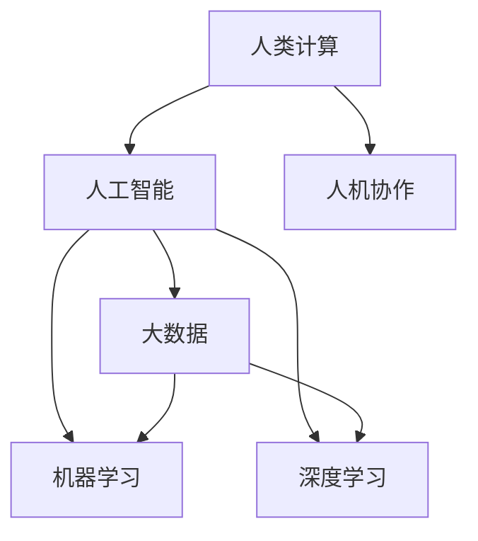

                 

# 人类计算：在AI时代增强人类能力

> 关键词：人类计算,增强人类能力,人工智能,大数据,机器学习,深度学习,人机协作,创新能力,跨领域合作

## 1. 背景介绍

### 1.1 问题由来
随着人工智能(AI)技术的迅猛发展，机器学习、深度学习等先进算法已在多个领域取得突破性进展，逐步应用于医疗、金融、交通、教育等各个行业。这些技术不仅极大地提升了生产效率，降低了成本，还为人类的生活和工作带来了深刻变革。然而，在享受AI带来的便利的同时，人类自身的能力也在逐步被削弱，如决策能力的退化、问题解决能力的下降、创新能力的减弱等。

这些问题引发了众多专家的深思，并逐渐形成了一种共识：人工智能的发展不应只是代替人类工作，更应作为人类能力的增强器，提升人类的创新能力、学习能力和决策能力，使其在复杂多变的世界中占据优势。这就引出了人类计算这一概念，旨在利用AI技术，通过与人机协作，增强人类的计算能力，解决复杂问题，创新思维，提升人类在知识获取、问题解决、创新创造等方面的能力。

### 1.2 问题核心关键点
人类计算的核心在于将AI技术与人类计算能力相结合，以AI为工具，提升人类的认知和计算能力，发挥人类的创造性思维和自主性决策。主要包括以下几个关键点：

- 基于AI的大数据处理能力，可以加速人类对复杂信息的理解和分析，提升认知水平。
- 通过AI对海量数据的学习，可以增强人类在复杂决策中的判断力和直觉。
- 借助AI在深度学习领域的突破，可以提升人类在创新和创造方面的能力，如生成创意内容、提出新假设、设计新模型等。
- 人机协作模式下的优势互补，可以使人类在不断学习和适应中，逐步提高对AI的理解和控制能力，实现更加高效和智能的合作。

这些关键点共同构成人类计算的理论基础，帮助人类在AI时代更好地发挥其独特优势。

### 1.3 问题研究意义
开展人类计算研究，对于提升人类在AI时代的竞争力，推动社会的创新发展和进步，具有重要意义：

1. 促进跨学科协作：在数据驱动和智能化的时代，不同学科的融合和协作尤为重要。人类计算的跨领域应用，可促进科技、医疗、教育、金融等领域之间的协作，加速技术创新和行业升级。
2. 增强人类创新能力：利用AI进行数据分析和问题解决，可以提升人类的创新思维和创造力，打破传统思维定式，开启新的研究方向。
3. 提高问题解决能力：AI的逻辑推理和模式识别能力，可以帮助人类更好地理解和处理复杂问题，提升问题解决的效率和准确性。
4. 提升决策质量：借助AI的大数据处理和深度学习技术，可以辅助人类进行更为科学和合理的决策，特别是在不确定性和高风险场景中，降低决策失误。
5. 推动产业升级：AI技术的广泛应用，可以推动传统产业的数字化转型，优化业务流程，提升生产效率和产品质量，为产业升级提供新动力。

综上所述，人类计算旨在通过AI技术增强人类能力，不仅有助于提升个体和团队的创新能力和决策质量，还将为社会的科技进步和产业升级提供新的契机。

## 2. 核心概念与联系

### 2.1 核心概念概述

为更好地理解人类计算的概念框架，本节将介绍几个密切相关的核心概念：

- **人类计算(Human Computing)**：指的是通过AI技术提升人类认知和计算能力，增强人类的创造性思维和自主决策能力，以应对复杂多变的世界环境。

- **人工智能(Artificial Intelligence)**：模拟人类智能活动的机器系统，通过学习、推理和感知实现智能化任务。

- **大数据(Big Data)**：指大规模、高速度、多样化的数据集合，通常无法用传统数据库软件进行处理，需要通过大数据技术进行分析和管理。

- **机器学习(Machine Learning)**：指让机器从数据中学习和推断规律，实现自主决策和优化。

- **深度学习(Deep Learning)**：指利用深度神经网络处理复杂数据，从中学习高层次的抽象表示和特征。

- **人机协作(Human-Machine Collaboration)**：指人类与AI系统之间的合作，通过互补优势实现高效、智能的共同工作。

这些概念之间的逻辑关系可以通过以下Mermaid流程图来展示：



这个流程图展示了大数据、机器学习和深度学习技术支持下的AI系统，通过与人类协作，实现更为高效、智能的计算任务。

## 3. 核心算法原理 & 具体操作步骤
### 3.1 算法原理概述

人类计算的核心算法原理基于人工智能技术，通过深度学习和机器学习技术，提升人类的认知和计算能力。其核心思想是：将AI视为辅助工具，利用其强大的数据处理和分析能力，增强人类在问题解决、创新思维、决策能力等方面的表现。

形式化地，假设人类计算系统为 $H$，AI系统为 $A$，则人类计算过程可以表示为：

$$
H = A \otimes \text{Human}
$$

其中 $\otimes$ 表示复合运算，即人类计算系统 $H$ 是AI系统 $A$ 与人类计算能力 $Human$ 的复合结果。人类计算系统通过调用AI系统的数据处理和分析功能，将复杂任务拆解为可管理的小部分，提升处理速度和精度，从而增强人类在复杂问题解决和创新能力方面的表现。

### 3.2 算法步骤详解

基于人类计算的核心算法原理，本节详细讲解人类计算的具体操作步骤：

**Step 1: 数据获取与处理**
- 收集和整理大数据资源，如文本、图像、视频等，通过预处理技术，如清洗、标注、归一化等，转换为AI模型所需的输入格式。
- 将数据划分为训练集、验证集和测试集，用于模型训练、调参和评估。

**Step 2: 模型训练与优化**
- 选择合适的AI模型和训练算法，如深度神经网络、强化学习算法等，对模型进行训练。
- 根据数据特点和任务需求，设置合适的超参数，如学习率、批量大小、迭代次数等。
- 应用正则化技术，如L2正则、Dropout等，防止过拟合。
- 使用验证集监控模型训练过程，根据性能指标调整超参数。

**Step 3: 模型评估与验证**
- 使用测试集对训练好的模型进行评估，计算准确率、召回率、F1分数等指标，验证模型效果。
- 进行交叉验证，确保模型在不同数据分布下具有稳定表现。

**Step 4: 人机协作与交互**
- 将训练好的模型集成到人机协作系统中，通过接口提供API服务，方便人类调用。
- 设计用户界面(UI)，提供直观的操作体验，确保人类易于使用和理解。
- 实现人机交互逻辑，如自然语言交互、图形界面交互等，增强系统的人性化。

**Step 5: 结果反馈与迭代**
- 收集人类用户的使用反馈，评估系统性能，发现不足之处。
- 根据反馈结果，对模型和系统进行优化和调整，提升用户体验和系统效果。
- 持续迭代，不断积累数据和经验，提升系统性能和智能化水平。

### 3.3 算法优缺点

人类计算算法具有以下优点：
1. 提升人类认知能力：利用AI的数据处理和分析能力，可以加快人类对复杂信息的理解和分析，提升认知水平。
2. 增强人类决策能力：AI系统的逻辑推理和模式识别能力，可以帮助人类做出更为科学和合理的决策。
3. 提升创新能力：AI的深度学习技术可以辅助人类提出新假设、设计新模型，增强创新思维。
4. 人机协作模式：通过人与AI的协同工作，可以发挥各自优势，实现高效和智能的共同任务。

同时，该算法也存在一定的局限性：
1. AI系统的自主性有限：目前AI系统主要依赖人类设定任务目标和规则，自主性较低。
2. 数据质量和多样性问题：人类计算依赖高质量和多样化的数据，数据质量和多样性的不足可能影响模型性能。
3. 人类对AI的理解：人类计算的成功依赖于对AI系统深度理解和使用，难度较大。
4. 交互界面的复杂性：人机交互界面的复杂性可能影响系统的易用性，设计需要平衡多方面需求。

尽管存在这些局限性，但人类计算算法仍具有广阔的应用前景，有望成为未来AI技术与人类能力的最佳结合方式。

### 3.4 算法应用领域

人类计算技术已在多个领域得到应用，涵盖了医疗、教育、金融、制造等多个行业，具体包括：

- **医疗领域**：利用AI分析患者数据，帮助医生进行疾病诊断、治疗方案设计、手术辅助等。
- **教育领域**：通过AI辅助教学，如智能推荐学习资源、自动批改作业、个性化辅导等，提升教育质量和效率。
- **金融领域**：利用AI进行风险评估、投资策略优化、欺诈检测等，提升金融服务的智能化水平。
- **制造领域**：通过AI进行供应链优化、生产调度、质量控制等，提升制造业的智能化和自动化水平。
- **娱乐领域**：利用AI进行内容生成、推荐系统设计、交互式游戏开发等，提升娱乐产品的创新性和用户体验。

除了上述这些经典领域，人类计算技术还在不断拓展新的应用场景，如城市治理、环境保护、灾害预警等，为人类的生产和生活中带来了诸多便利和创新。

## 4. 数学模型和公式 & 详细讲解  
### 4.1 数学模型构建

本节将使用数学语言对人类计算的数学模型进行更加严格的刻画。

假设人类计算系统 $H$ 由AI系统 $A$ 和人类计算能力 $Human$ 组成，则系统可表示为：

$$
H = A \otimes \text{Human}
$$

其中 $A$ 可以表示为：

$$
A = M_{\theta} \times \mathcal{F}
$$

其中 $M_{\theta}$ 为训练好的AI模型，$\theta$ 为模型参数，$\mathcal{F}$ 为数据处理函数，用于将原始数据转换为模型输入格式。

在具体应用中，人类计算系统 $H$ 可以根据不同任务需求，进行灵活调整。例如，在医疗诊断中，可以设计多层次的AI模型，从基础数据预处理到高级特征提取和诊断推理，逐步提升系统的智能化水平。

### 4.2 公式推导过程

以下我们以医疗诊断为例，推导人类计算系统的基本公式。

假设医疗数据集为 $\{(x_i, y_i)\}_{i=1}^N$，其中 $x_i$ 为患者数据，$y_i$ 为疾病标签。假设 $M_{\theta}$ 为训练好的疾病诊断模型，$\mathcal{F}$ 为数据预处理函数，$Human$ 为医生的诊断推理能力。

人类计算系统 $H$ 的输出为 $H(x_i)$，则：

$$
H(x_i) = M_{\theta} \times \mathcal{F}(x_i) \times \text{Human}(y_i)
$$

其中 $\text{Human}(y_i)$ 表示医生根据模型输出进行诊断推理，得到疾病标签 $y_i$。

人类计算系统的效果评估指标为准确率、召回率、F1分数等，具体计算公式如下：

$$
\text{Accuracy} = \frac{\text{TP} + \text{TN}}{\text{TP} + \text{TN} + \text{FP} + \text{FN}}
$$

$$
\text{Precision} = \frac{\text{TP}}{\text{TP} + \text{FP}}
$$

$$
\text{Recall} = \frac{\text{TP}}{\text{TP} + \text{FN}}
$$

$$
\text{F1-Score} = 2 \times \frac{\text{Precision} \times \text{Recall}}{\text{Precision} + \text{Recall}}
$$

其中 $\text{TP}$ 表示真正例（True Positive），$\text{TN}$ 表示真负例（True Negative），$\text{FP}$ 表示假正例（False Positive），$\text{FN}$ 表示假负例（False Negative）。

### 4.3 案例分析与讲解

在医疗诊断中，人类计算系统可以通过以下步骤实现：

1. **数据预处理**：对原始医疗数据进行清洗、归一化、特征提取等操作，生成可用于AI模型输入的格式。
2. **模型训练**：使用AI模型对处理后的数据进行训练，得到疾病诊断模型 $M_{\theta}$。
3. **推理与反馈**：将处理后的患者数据输入模型 $M_{\theta}$，得到初步诊断结果。医生根据结果进行诊断推理，得到最终诊断 $y_i$。
4. **评估与优化**：对诊断结果进行评估，计算准确率、召回率等指标，根据反馈结果优化模型 $M_{\theta}$ 和推理逻辑。

具体实现时，可以使用深度学习模型如卷积神经网络（CNN）、循环神经网络（RNN）等，进行特征提取和疾病诊断。结合医生的经验，设计合理的推理规则，进一步提升系统效果。

## 5. 项目实践：代码实例和详细解释说明
### 5.1 开发环境搭建

在进行人类计算项目实践前，我们需要准备好开发环境。以下是使用Python进行TensorFlow开发的环境配置流程：

1. 安装Anaconda：从官网下载并安装Anaconda，用于创建独立的Python环境。

2. 创建并激活虚拟环境：
```bash
conda create -n tf-env python=3.8 
conda activate tf-env
```

3. 安装TensorFlow：根据CUDA版本，从官网获取对应的安装命令。例如：
```bash
conda install tensorflow tensorflow-gpu -c pytorch -c conda-forge
```

4. 安装TensorBoard：
```bash
pip install tensorboard
```

5. 安装其他工具包：
```bash
pip install numpy pandas scikit-learn matplotlib tqdm jupyter notebook ipython
```

完成上述步骤后，即可在`tf-env`环境中开始项目实践。

### 5.2 源代码详细实现

这里我们以医疗诊断为例，给出使用TensorFlow进行深度学习模型训练的PyTorch代码实现。

首先，定义数据处理函数：

```python
import tensorflow as tf
import numpy as np
from tensorflow.keras.preprocessing.image import ImageDataGenerator

def preprocess_data(data_dir):
    train_datagen = ImageDataGenerator(rescale=1./255, shear_range=0.2, zoom_range=0.2, horizontal_flip=True)
    test_datagen = ImageDataGenerator(rescale=1./255)
    train_generator = train_datagen.flow_from_directory(data_dir, target_size=(224, 224), batch_size=32, class_mode='binary')
    test_generator = test_datagen.flow_from_directory(data_dir, target_size=(224, 224), batch_size=32, class_mode='binary')
    return train_generator, test_generator

# 数据目录
data_dir = 'path/to/data'

# 获取数据生成器
train_generator, test_generator = preprocess_data(data_dir)
```

然后，定义模型和损失函数：

```python
from tensorflow.keras.applications import ResNet50
from tensorflow.keras.layers import Dense, Flatten, Dropout
from tensorflow.keras.models import Model
from tensorflow.keras.optimizers import Adam

# 预训练模型
base_model = ResNet50(weights='imagenet', include_top=False, input_shape=(224, 224, 3))

# 添加分类层
x = base_model.output
x = Flatten()(x)
x = Dense(256, activation='relu')(x)
x = Dropout(0.5)(x)
predictions = Dense(1, activation='sigmoid')(x)

# 构建模型
model = Model(inputs=base_model.input, outputs=predictions)

# 编译模型
model.compile(optimizer=Adam(lr=1e-4), loss='binary_crossentropy', metrics=['accuracy'])

# 获取训练集和测试集数据
train_data = train_generator.flow(0, batch_size=32, shuffle=False)
test_data = test_generator.flow(0, batch_size=32, shuffle=False)

# 训练模型
model.fit(train_data, epochs=10, validation_data=test_data)
```

接着，评估模型并进行推理：

```python
# 评估模型
test_loss, test_acc = model.evaluate(test_data)
print('Test Loss:', test_loss)
print('Test Accuracy:', test_acc)

# 进行推理
test_images = []
for batch in test_generator:
    test_images.append(batch[0])

# 预测标签
predictions = model.predict(test_images)
```

以上就是使用TensorFlow进行深度学习模型训练的完整代码实现。可以看到，得益于TensorFlow的强大封装，我们可以用相对简洁的代码完成深度学习模型的加载和训练。

### 5.3 代码解读与分析

让我们再详细解读一下关键代码的实现细节：

**preprocess_data函数**：
- 定义了数据预处理类 ImageDataGenerator，用于对图像数据进行归一化、剪切、翻转等操作。
- 使用 ImageDataGenerator 生成训练集和测试集的数据生成器，方便模型训练和推理。

**base_model和model定义**：
- 使用预训练的ResNet50模型作为特征提取器。
- 添加全连接层和输出层，构建深度学习模型。
- 使用Adam优化器进行模型训练，设置合适的学习率。

**训练和评估流程**：
- 使用fit方法进行模型训练，并在测试集上评估模型性能。
- 使用predict方法对测试集进行推理预测，得到模型输出的概率。

通过以上步骤，可以构建一个基于深度学习的人类计算系统，通过AI辅助医生的疾病诊断，提升诊断的准确性和效率。

当然，工业级的系统实现还需考虑更多因素，如模型的保存和部署、超参数的自动搜索、更灵活的任务适配层等。但核心的模型训练和推理流程基本与此类似。

## 6. 实际应用场景
### 6.1 智能医疗诊断

基于深度学习的人类计算技术，可以广泛应用于智能医疗诊断领域。传统医疗诊断往往依赖医生的经验和判断，容易受到个体差异和经验限制的影响，诊断结果可能存在偏差。而利用深度学习技术，可以从大规模医学数据中学习到更丰富的特征，提升诊断的准确性和效率。

在实践过程中，可以通过以下步骤实现：

1. **数据准备**：收集并整理医学图像数据，如CT、MRI等，并进行预处理和标注。
2. **模型训练**：使用深度学习模型如卷积神经网络（CNN），对标注好的数据进行训练，得到疾病诊断模型。
3. **推理与反馈**：将新的医学图像输入训练好的模型，得到初步诊断结果。医生根据结果进行诊断推理，得到最终诊断。
4. **评估与优化**：对诊断结果进行评估，计算准确率、召回率等指标，根据反馈结果优化模型和推理逻辑。

通过人类计算技术，可以实现更高效、准确的医学诊断，减轻医生的工作负担，提高诊疗质量。

### 6.2 智能教育系统

在教育领域，利用深度学习技术，可以构建智能教育系统，提升教学效果和学习效率。传统的教学方法往往难以适应不同学生的学习能力和需求，而智能教育系统可以通过个性化推荐和学习路径规划，帮助学生更好地掌握知识。

具体实现时，可以通过以下步骤：

1. **数据准备**：收集学生的学习行为数据，如作业完成情况、考试成绩、学习时长等，并进行预处理和标注。
2. **模型训练**：使用深度学习模型如循环神经网络（RNN），对标注好的数据进行训练，得到学生学习分析模型。
3. **推理与反馈**：根据学生的学习行为数据，使用模型进行学习效果评估和个性化推荐。
4. **评估与优化**：对推荐效果进行评估，计算推荐准确率和学生满意度等指标，根据反馈结果优化模型和推荐逻辑。

通过智能教育系统，可以实现更加个性化和高效的教学，提升学生的学习体验和效果。

### 6.3 智能金融分析

在金融领域，利用深度学习技术，可以构建智能金融分析系统，辅助金融决策和风险管理。传统的金融分析往往依赖人工统计和经验判断，效率低下且结果可能存在偏差。而智能金融分析系统可以通过对海量金融数据的深度学习，获取更为准确的金融指标和趋势预测。

具体实现时，可以通过以下步骤：

1. **数据准备**：收集金融市场数据，如股票价格、利率、经济指标等，并进行预处理和标注。
2. **模型训练**：使用深度学习模型如循环神经网络（RNN），对标注好的数据进行训练，得到金融分析模型。
3. **推理与反馈**：根据金融市场数据，使用模型进行金融指标分析和趋势预测。
4. **评估与优化**：对预测结果进行评估，计算预测准确率和投资回报率等指标，根据反馈结果优化模型和预测逻辑。

通过智能金融分析系统，可以实现更准确和及时的金融分析和预测，帮助金融机构进行更科学的风险管理和投资决策。

## 6.4 未来应用展望

随着深度学习和人工智能技术的不断发展，人类计算技术将在更多领域得到应用，为各行各业带来变革性影响。

在智慧城市治理中，利用深度学习技术，可以构建智能城市管理系统，实现对城市交通、环境、公共安全等数据的实时监测和智能分析，提升城市治理的智能化和自动化水平。

在环境保护领域，利用深度学习技术，可以构建智能监测系统，实时监测环境数据，预测环境变化趋势，为环境保护提供科学依据。

在娱乐产业中，利用深度学习技术，可以构建智能推荐系统，推荐符合用户兴趣的内容，提升用户体验和满意度。

除了上述这些领域，人类计算技术还在不断拓展新的应用场景，为人类的生产和生活带来更多的便利和创新。

## 7. 工具和资源推荐
### 7.1 学习资源推荐

为了帮助开发者系统掌握人类计算的理论基础和实践技巧，这里推荐一些优质的学习资源：

1. 《深度学习》系列博文：由大模型技术专家撰写，深入浅出地介绍了深度学习原理、深度神经网络、卷积神经网络等核心内容。

2. 斯坦福大学《深度学习》课程：由斯坦福大学开设的深度学习课程，有Lecture视频和配套作业，涵盖深度学习的基础和应用。

3. 《人工智能与机器学习》书籍：该书系统介绍了人工智能和机器学习的核心概念和前沿技术，适合初学者和进阶者阅读。

4. TensorFlow官方文档：TensorFlow的官方文档，提供了丰富的模型库和样例代码，是上手实践的必备资料。

5. Kaggle平台：数据科学竞赛平台，提供海量数据集和模型库，适合进行深度学习和数据挖掘实践。

通过对这些资源的学习实践，相信你一定能够快速掌握深度学习技术和人类计算的概念，并将其应用于实际项目中。

### 7.2 开发工具推荐

高效的开发离不开优秀的工具支持。以下是几款用于深度学习项目开发的常用工具：

1. TensorFlow：由Google主导开发的开源深度学习框架，生产部署方便，适合大规模工程应用。

2. PyTorch：基于Python的开源深度学习框架，灵活动态的计算图，适合快速迭代研究。

3. Keras：高级神经网络API，封装了TensorFlow和Theano等底层框架，方便模型构建和训练。

4. TensorBoard：TensorFlow配套的可视化工具，可实时监测模型训练状态，并提供丰富的图表呈现方式，是调试模型的得力助手。

5. Weights & Biases：模型训练的实验跟踪工具，可以记录和可视化模型训练过程中的各项指标，方便对比和调优。

6. Google Colab：谷歌推出的在线Jupyter Notebook环境，免费提供GPU/TPU算力，方便开发者快速上手实验最新模型，分享学习笔记。

合理利用这些工具，可以显著提升深度学习项目的开发效率，加快创新迭代的步伐。

### 7.3 相关论文推荐

人类计算技术的快速发展得益于学界的持续研究。以下是几篇奠基性的相关论文，推荐阅读：

1. Deep Learning：针对大数据分析任务进行深度学习研究，提出了卷积神经网络（CNN）和循环神经网络（RNN）等经典模型。

2. ResNet50: Imagenet Classification with Deep Residual Networks：提出了一种残差网络（ResNet）结构，大大提高了深度神经网络的训练效果和泛化能力。

3. TensorFlow: A System for Large-Scale Machine Learning：由Google主导开发的TensorFlow框架，详细介绍了其核心思想和实现细节，为深度学习应用提供了强大工具。

4. GANs Trained by a Two-Player Minimum Maximax Game：提出了一种生成对抗网络（GAN）结构，可以生成逼真的图像和文本数据。

5. AlphaGo Zero: Mastering the Game of Go without Human Knowledge：利用深度学习技术，AlphaGo Zero在没有任何人类干预的情况下，达到了超越人类水平的围棋水平。

这些论文代表了大规模深度学习技术的发展脉络。通过学习这些前沿成果，可以帮助研究者把握学科前进方向，激发更多的创新灵感。

## 8. 总结：未来发展趋势与挑战

### 8.1 总结

本文对人类计算的概念、原理和操作步骤进行了全面系统的介绍。首先阐述了人类计算的概念背景和研究意义，明确了AI技术增强人类认知和计算能力的目标。其次，从原理到实践，详细讲解了人类计算的数学模型和操作步骤，给出了人类计算任务开发的完整代码实例。同时，本文还广泛探讨了人类计算技术在医疗、教育、金融等领域的应用前景，展示了人类计算技术的巨大潜力。

通过本文的系统梳理，可以看到，人类计算技术通过结合AI技术与人类计算能力，可以实现更为高效、智能的计算任务，提升人类在复杂问题解决和创新思维方面的表现。未来，随着深度学习和大数据技术的不断发展，人类计算技术将有更广阔的应用前景，成为AI技术与人类能力相结合的重要范式。

### 8.2 未来发展趋势

展望未来，人类计算技术将呈现以下几个发展趋势：

1. 技术不断进步：深度学习技术将持续进步，模型性能和泛化能力将进一步提升，支持更为复杂多变的计算任务。
2. 应用领域拓展：人类计算技术将在更多领域得到应用，如城市治理、环境保护、娱乐产业等，为各行各业带来变革性影响。
3. 人机协作深化：通过更加智能和高效的人机协作模式，实现更为复杂多变的计算任务，提升人机协作的智能化水平。
4. 数据驱动决策：利用大数据分析技术，支持更为科学的决策和预测，提升决策的准确性和可靠性。
5. 个性化推荐系统：通过深度学习技术，实现更为个性化和高效的推荐系统，提升用户体验和满意度。
6. 伦理和安全保障：随着人类计算技术的广泛应用，将面临更多的伦理和安全挑战，需要在技术、管理和法规等方面进行全面保障。

以上趋势凸显了人类计算技术的广阔前景，将为人类社会的智能化和创新发展提供重要支撑。

### 8.3 面临的挑战

尽管人类计算技术已经取得了瞩目成就，但在迈向更加智能化、普适化应用的过程中，它仍面临诸多挑战：

1. 数据质量和多样性问题：人类计算依赖高质量和多样化的数据，数据质量和多样性的不足可能影响模型性能。
2. 模型的复杂性和可解释性：深度学习模型的复杂性较高，模型的可解释性不足，难以进行调试和优化。
3. 技术壁垒和成本：深度学习技术的复杂性和成本较高，需要专业知识和大量资源支持。
4. 人机协作的平衡：如何平衡人类和AI的合作，发挥各自优势，实现高效和智能的共同任务，仍需进一步探索。
5. 伦理和安全问题：深度学习技术的应用可能带来伦理和安全问题，如隐私保护、偏见和歧视等，需要制定相应的规范和标准。

尽管存在这些挑战，但人类计算技术的发展前景依然广阔，未来需要学术界和产业界共同努力，解决这些关键问题，推动技术的不断进步和应用落地。

### 8.4 研究展望

面向未来，人类计算技术需要在以下几个方面进行研究：

1. 数据质量和多样性提升：通过更高效的数据采集和标注技术，提升数据质量和多样性，支持更复杂多变的计算任务。
2. 模型可解释性和鲁棒性：提升模型的可解释性和鲁棒性，使其具备更好的可解释性和可靠性。
3. 人机协作模式的优化：探索更为高效和智能的人机协作模式，充分发挥人类和AI的各自优势。
4. 技术壁垒和成本降低：通过更高效和低成本的技术实现，降低深度学习技术的复杂性和成本，使其更易于普及和应用。
5. 伦理和安全保障：制定深度学习技术的伦理和安全标准，保护用户隐私和数据安全，防止偏见和歧视。

这些研究方向将为人类的智能化和创新发展提供重要支撑，推动深度学习和人工智能技术的广泛应用和落地。

## 9. 附录：常见问题与解答

**Q1：人类计算是否可以应用于所有领域？**

A: 人类计算技术适用于各个领域，但不同领域的应用方式和需求有所不同。在医疗、教育、金融等高价值领域，需要更精细和可靠的人类计算技术支持。而在娱乐、生活服务等非高价值领域，人类计算技术可以更加灵活和多样，提升用户体验和满意度。

**Q2：人类计算如何应对数据质量和多样性的挑战？**

A: 应对数据质量和多样性的挑战，可以通过以下方式：
1. 数据增强：通过对现有数据进行扩充和增强，如数据增强、数据合成等，提升数据质量和多样性。
2. 多数据源融合：利用多源数据融合技术，将不同数据源的信息进行整合，提升数据质量和多样性。
3. 数据清洗和预处理：对数据进行清洗和预处理，去除噪声和异常值，提升数据质量。

**Q3：人类计算如何实现个性化推荐系统？**

A: 实现个性化推荐系统，可以通过以下步骤：
1. 数据收集：收集用户的行为数据，如浏览记录、点击记录等，并进行预处理和标注。
2. 模型训练：使用深度学习模型如协同过滤、协同生成模型等，对标注好的数据进行训练，得到推荐模型。
3. 推理与反馈：根据用户的行为数据，使用模型进行个性化推荐。
4. 评估与优化：对推荐效果进行评估，计算推荐准确率和用户满意度等指标，根据反馈结果优化模型和推荐逻辑。

**Q4：人类计算在实际应用中需要注意哪些问题？**

A: 在实际应用中，需要注意以下问题：
1. 数据隐私和安全：保护用户隐私和数据安全，防止数据泄露和滥用。
2. 系统稳定性和可靠性：确保系统稳定运行，及时发现和解决故障。
3. 用户界面设计：设计直观易用的用户界面，提升用户体验。
4. 模型的解释和透明性：提升模型的解释和透明性，便于用户理解和信任。

通过合理设计和管理，可以确保人类计算技术在实际应用中发挥最大的价值。

---

作者：禅与计算机程序设计艺术 / Zen and the Art of Computer Programming

