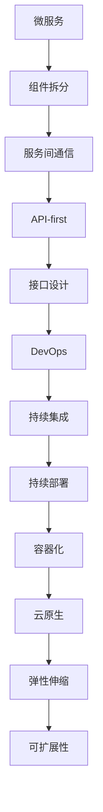

                 

# 从全栈开发到技术架构师的进阶

## 1. 背景介绍

### 1.1 问题由来

在当今快速变化的IT行业中，技术栈和业务需求的变化日新月异。全栈开发人员需要处理从前端、后端到数据库的全面开发工作，但随着系统规模的扩大和复杂性的增加，许多全栈开发人员发现自己难以兼顾全局视角和细节实现。技术架构师的角色应运而生，他们能够以全局视角规划和设计系统的整体架构，确保技术栈的合理性和系统的高效性。本文将深入探讨从全栈开发到技术架构师的进阶过程，帮助开发者理解技术架构的重要性，掌握必要的技能和方法。

### 1.2 问题核心关键点

技术架构师与全栈开发人员的核心区别在于全局视角与细节实现之间的平衡。技术架构师不仅需要具备全面的技术知识，更需要理解系统的整体架构、组件间的关系以及技术选型的决策依据。以下是几个关键点：

- **技术栈理解**：理解各种技术栈的优缺点，如前端的前端框架、后端的技术栈选择、数据库的选择和设计等。
- **系统设计**：理解系统的架构模式，如微服务、单体应用、API-first等。
- **组件交互**：理解组件间的数据流和调用关系，以及如何设计接口。
- **性能优化**：理解如何通过优化架构和组件设计提升系统性能。
- **可扩展性**：理解如何设计系统以支持未来的扩展和变更。

### 1.3 问题研究意义

掌握技术架构师的思维方式和技能，能够帮助全栈开发人员更好地规划和设计系统架构，提高开发效率和系统质量。技术架构师的进阶过程不仅是一个技术提升的过程，更是一个思维方式的转变和提升。

## 2. 核心概念与联系

### 2.1 核心概念概述

技术架构师需要掌握的核心概念包括以下几个方面：

- **微服务**：将系统拆分为多个小服务，每个服务负责独立的业务逻辑，增强系统的可扩展性和可维护性。
- **API-first**：设计API优先于实现，通过明确的API定义指导系统设计和开发。
- **DevOps**：结合开发和运维，实现持续集成和持续部署，提升开发效率和系统稳定性。
- **容器化**：通过Docker等技术将应用程序和依赖打包为容器，提升系统的部署和扩展效率。
- **云原生**：利用云计算平台提供的服务和资源，构建灵活、弹性的系统架构。

这些概念之间相互联系，形成一个完整的技术架构体系。

### 2.2 核心概念原理和架构的 Mermaid 流程图



这个流程图展示了微服务架构从组件拆分、服务间通信到API优先、接口设计，再到DevOps、容器化、云原生，最终实现系统可扩展性的全过程。

## 3. 核心算法原理 & 具体操作步骤

### 3.1 算法原理概述

技术架构师在设计系统架构时，通常采用如下几个核心算法原理：

- **组件拆分**：将系统划分为多个独立的组件，每个组件负责独立的业务逻辑。
- **服务间通信**：设计组件间的通信方式，如RESTful API、gRPC等。
- **API-first设计**：在设计API时，先定义接口，再根据接口实现具体的业务逻辑。
- **性能优化**：通过组件设计、缓存策略、负载均衡等手段提升系统性能。
- **可扩展性设计**：设计系统时考虑未来的扩展需求，如水平扩展、垂直扩展等。

### 3.2 算法步骤详解

技术架构师的进阶需要从以下几个方面进行系统学习和实践：

1. **组件拆分**：
   - 理解系统的整体业务逻辑，将其拆分为多个独立的业务组件。
   - 确定组件间的依赖关系，确保组件的可独立开发和部署。

2. **服务间通信**：
   - 设计组件间的通信协议，如RESTful API、gRPC等。
   - 确保通信协议的稳定性和可扩展性。

3. **API-first设计**：
   - 先定义API接口，包括请求和响应的格式、参数、返回值等。
   - 根据API定义，逐步实现具体的业务逻辑。

4. **性能优化**：
   - 设计高效的组件交互和缓存策略，减少重复计算。
   - 采用负载均衡和分布式架构，提升系统的并发处理能力。

5. **可扩展性设计**：
   - 设计系统的扩展点，确保未来能够方便地增加新的功能或组件。
   - 采用弹性伸缩和微服务架构，支持动态扩展。

### 3.3 算法优缺点

**优点**：

- **可扩展性**：微服务架构和API-first设计使得系统能够方便地扩展和升级。
- **可维护性**：组件间的独立部署和通信协议的设计，提高了系统的可维护性。
- **性能优化**：通过合理的组件设计和性能优化，提升了系统性能。

**缺点**：

- **复杂度增加**：组件间的通信和依赖关系增加了系统的复杂度。
- **开发成本提高**：组件拆分和API-first设计需要更多的时间和资源。
- **学习曲线陡峭**：新技术和架构的引入，需要开发者具备更高的技术水平。

### 3.4 算法应用领域

技术架构师的技能和方法广泛应用于以下领域：

- **企业级系统架构设计**：设计和规划大型企业系统的架构，如电商平台、金融系统等。
- **移动应用架构设计**：设计和规划移动应用的架构，如iOS、Android等。
- **云计算架构设计**：设计和规划基于云计算平台的应用架构，如AWS、Azure等。
- **大数据架构设计**：设计和规划处理大规模数据的应用架构，如Hadoop、Spark等。
- **微服务架构设计**：设计和规划基于微服务的架构，如Spring Cloud、Docker等。

## 4. 数学模型和公式 & 详细讲解

### 4.1 数学模型构建

技术架构师在设计系统时，通常需要构建以下数学模型：

- **组件间通信模型**：定义组件间的数据流和调用关系。
- **负载均衡模型**：设计如何均衡分配请求到各个组件。
- **缓存模型**：设计如何通过缓存减少重复计算。

### 4.2 公式推导过程

以缓存模型为例，常用的缓存策略包括：

- **缓存命中率**：$\text{Hit Rate} = \frac{\text{Cache Hits}}{\text{Cache Hits} + \text{Cache Misses}}$
- **缓存替换策略**：常见的替换策略有LRU（Least Recently Used）、LFU（Least Frequently Used）等。

以LRU为例，替换策略的公式如下：

$$
\text{LRU Replacement} = \frac{\text{Cache Hits} - \text{Cache Misses}}{\text{Cache Hits} + \text{Cache Misses}}
$$

### 4.3 案例分析与讲解

以微服务架构为例，假设有一个电商平台的订单系统，可以按照以下步骤设计：

1. **组件拆分**：订单系统、支付系统、库存系统等。
2. **服务间通信**：RESTful API接口。
3. **API-first设计**：定义订单的API接口，包括创建订单、查询订单等。
4. **性能优化**：通过缓存策略减少数据库访问，采用负载均衡提升系统性能。
5. **可扩展性设计**：设计扩展点，支持新增支付渠道、库存系统等。

## 5. 项目实践：代码实例和详细解释说明

### 5.1 开发环境搭建

技术架构师需要掌握多种开发工具和环境，以下以Docker为例，介绍开发环境搭建：

1. 安装Docker：
   ```bash
   sudo apt-get update
   sudo apt-get install docker.io
   ```

2. 拉取镜像：
   ```bash
   docker pull nginx
   ```

3. 运行容器：
   ```bash
   docker run -d -p 80:80 nginx
   ```

4. 创建Docker Compose文件：
   ```yaml
   version: '3'
   services:
     nginx:
       image: nginx
       ports:
         - "80:80"
       depends_on:
         - app
   app:
     build: .
     command: bash -c "nginx -g 'daemon off;'"
   ```

### 5.2 源代码详细实现

以下是一个简单的Docker Compose文件示例，展示了如何将应用和依赖打包为容器：

```yaml
version: '3'
services:
  app:
    build: .
    command: bash -c "nginx -g 'daemon off;'"
  nginx:
    image: nginx
    ports:
      - "80:80"
    depends_on:
      - app
```

### 5.3 代码解读与分析

Docker Compose文件通过定义服务、依赖关系和端口映射，将应用和依赖打包为容器，实现了快速部署和扩展。

## 6. 实际应用场景

### 6.1 企业级系统架构设计

企业级系统架构设计需要考虑以下因素：

- **系统可靠性**：设计冗余和故障转移机制。
- **数据一致性**：设计数据一致性和同步机制。
- **安全性和隐私**：设计数据加密和安全认证机制。

### 6.2 移动应用架构设计

移动应用架构设计需要考虑以下因素：

- **平台兼容性**：设计跨平台的应用架构。
- **性能优化**：设计高效的UI组件和网络请求策略。
- **用户体验**：设计直观和易用的用户界面。

### 6.3 云计算架构设计

云计算架构设计需要考虑以下因素：

- **云服务选择**：选择适合的云服务和工具。
- **扩展性和弹性**：设计灵活的云资源管理策略。
- **安全性和合规性**：设计安全防护和合规性策略。

### 6.4 未来应用展望

未来技术架构师将面临以下挑战和机遇：

- **云计算的普及**：云计算平台的普及将为技术架构师提供更强大的资源和工具。
- **大数据和人工智能**：大数据和人工智能的应用将为技术架构师带来新的设计思路。
- **微服务架构的演进**：微服务架构的演进将带来更灵活、更高效的系统设计。
- **DevOps的普及**：DevOps的普及将提升开发效率和系统稳定性。

## 7. 工具和资源推荐

### 7.1 学习资源推荐

1. **《系统架构设计》（System Architecture Design）**：提供系统架构设计的理论基础和实践技巧。
2. **《DevOps实践指南》（DevOps Handbook）**：介绍DevOps的最佳实践和工具。
3. **《微服务架构》（Microservices Architecture）**：深入讲解微服务架构的设计和实现。
4. **《云计算基础》（Cloud Computing Fundamentals）**：介绍云计算平台的基础知识和设计思路。
5. **《大数据技术与应用》（Big Data Technology and Application）**：介绍大数据技术的基础知识和应用场景。

### 7.2 开发工具推荐

1. **Docker**：用于容器化应用和依赖，实现快速部署和扩展。
2. **Kubernetes**：用于容器编排，实现大规模应用的自动化管理。
3. **Ansible**：用于自动化运维，实现自动化部署和配置。
4. **Jenkins**：用于持续集成和持续部署，提升开发效率。
5. **Grafana**：用于监控和可视化，实现系统状态的实时监控和分析。

### 7.3 相关论文推荐

1. **《微服务架构》（Microservices Architecture）**：介绍微服务架构的设计和实现。
2. **《API-first设计》（API-first Design）**：介绍API-first设计的原则和方法。
3. **《云计算平台》（Cloud Platform）**：介绍云计算平台的基础知识和设计思路。
4. **《大数据技术》（Big Data Technology）**：介绍大数据技术的基础知识和应用场景。
5. **《DevOps实践》（DevOps Practice）**：介绍DevOps的最佳实践和工具。

## 8. 总结：未来发展趋势与挑战

### 8.1 研究成果总结

技术架构师作为系统设计和构建的重要角色，其技能和方法将直接影响系统的性能、可维护性和可扩展性。技术架构师的进阶不仅需要技术积累，更需要思维方式的转变和提升。

### 8.2 未来发展趋势

未来技术架构师将面临以下发展趋势：

- **云计算的普及**：云计算平台的普及将为技术架构师提供更强大的资源和工具。
- **大数据和人工智能**：大数据和人工智能的应用将为技术架构师带来新的设计思路。
- **微服务架构的演进**：微服务架构的演进将带来更灵活、更高效的系统设计。
- **DevOps的普及**：DevOps的普及将提升开发效率和系统稳定性。

### 8.3 面临的挑战

技术架构师在进阶过程中，将面临以下挑战：

- **技术栈变化**：新技术和架构的引入，需要开发者具备更高的技术水平。
- **系统复杂度增加**：系统规模的扩大和复杂性的增加，增加了架构设计和管理的难度。
- **性能优化**：设计高效的架构和组件，提升系统性能和可扩展性。

### 8.4 研究展望

技术架构师的未来研究将集中在以下几个方面：

- **新技术和新架构的探索**：探索新的技术和架构，提升系统的性能和可维护性。
- **跨领域知识的应用**：将其他领域的知识和经验应用到技术架构设计中，如经济学、心理学等。
- **架构设计的自动化**：通过工具和自动化手段，提升架构设计和管理的效率。

## 9. 附录：常见问题与解答

**Q1：如何理解技术架构的重要性？**

A: 技术架构是系统设计和构建的基础，决定了系统的性能、可维护性和可扩展性。一个良好的技术架构能够提升系统的可靠性和用户体验，降低维护成本，支持未来的扩展和变更。

**Q2：如何从全栈开发到技术架构师的进阶？**

A: 从全栈开发到技术架构师的进阶需要系统学习和实践，掌握以下技能和方法：

- **理解系统整体架构**：从全局视角理解系统的架构和组件设计。
- **设计API-first架构**：先定义API接口，再逐步实现具体的业务逻辑。
- **掌握DevOps工具和实践**：实现持续集成和持续部署，提升开发效率和系统稳定性。
- **使用容器化技术**：将应用和依赖打包为容器，实现快速部署和扩展。

**Q3：技术架构师需要掌握哪些关键技能？**

A: 技术架构师需要掌握以下关键技能：

- **系统设计和规划**：理解和设计系统的整体架构。
- **组件拆分和设计**：将系统拆分为独立的组件，设计组件间的通信和依赖关系。
- **性能优化**：通过缓存策略、负载均衡等手段提升系统性能。
- **可扩展性设计**：设计系统以支持未来的扩展和变更。
- **DevOps实践**：实现持续集成和持续部署，提升开发效率和系统稳定性。

---

作者：禅与计算机程序设计艺术 / Zen and the Art of Computer Programming

