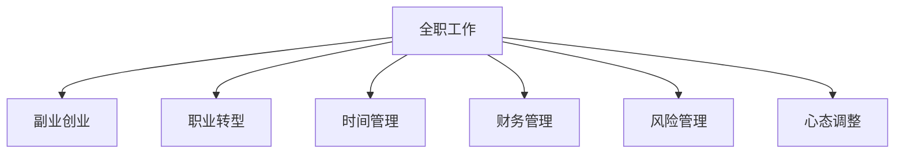

                 

## 1. 背景介绍

### 1.1 问题由来
在当今快速变化的商业环境中，许多人都在考虑将全职工作与副业创业相结合，以实现职业和生活平衡，同时追求财务自由。然而，从全职工作顺利过渡到副业创业并非易事，其中涉及众多挑战和决策。本文旨在帮助有志于此道的人士，系统地了解这一转变过程中所需掌握的各项技能和策略，从而实现职业上的转型和提升。

### 1.2 问题核心关键点
成功实现全职工作到副业创业的过渡，关键在于：
- **目标明确**：清晰定义创业目标，包括期望的收入、市场定位、产品或服务类型等。
- **资源规划**：评估并合理分配时间、资金、人力等资源，确保副业项目有持续发展的动力。
- **技能提升**：掌握创业所需的关键技能，如市场营销、财务管理、产品开发等。
- **风险管理**：识别并评估潜在风险，制定有效的风险缓解策略。
- **时间管理**：平衡全职工作与副业项目，避免二者之间的冲突。
- **心态调整**：培养创业心态，应对失败和挫折。

## 2. 核心概念与联系

### 2.1 核心概念概述

为更好地理解从全职工作到副业创业的过渡，本节将介绍几个密切相关的核心概念：

- **全职工作**：指个人在某一公司或组织中，通过全职方式进行的持续性工作，通常有固定的工作时间和职位职责。
- **副业创业**：指个人在主要工作之外，利用业余时间或其他资源进行的小规模创业活动，旨在创造额外的收入来源。
- **职业转型**：指个人从现有工作岗位转向新职业或行业，涉及职业生涯规划和技能提升的综合性过程。
- **时间管理**：指对个人时间的规划和安排，以高效利用时间，实现工作和生活平衡。
- **财务管理**：指对个人或企业的财务状况进行管理，包括预算制定、资金规划、成本控制等。
- **风险管理**：指识别、评估、应对可能对项目或企业造成不利影响的风险。
- **心态调整**：指个人在面对新挑战时，调整心理状态，保持积极向上，具备应对挑战的心理素质。

这些核心概念之间的逻辑关系可以通过以下Mermaid流程图来展示：



这个流程图展示了一些关键概念及其之间的关系：

1. **全职工作**与**副业创业**、**职业转型**、**时间管理**、**财务管理**、**风险管理**、**心态调整**之间的关系，显示了这些概念在职业转型过程中的相互依赖性。
2. **职业转型**是实现从全职工作到副业创业过渡的起点，涉及明确目标、评估资源和技能提升等过程。
3. **时间管理**、**财务管理**、**风险管理**、**心态调整**是顺利过渡的关键支撑点，有助于创业项目的成功运作。

## 3. 核心算法原理 & 具体操作步骤
### 3.1 算法原理概述

从全职工作到副业创业的过渡，本质上是一个项目管理的优化过程。其核心思想是：通过合理规划和资源配置，最大化利用个人和团队优势，高效地实现职业和收入的双重增长。

形式化地，假设目标为从全职工作$W$过渡到副业创业$S$，目标函数为：

$$
\maximize_{W \rightarrow S} \text{财务收益} + \text{职业成长}
$$

其中，财务收益表示副业项目带来的额外收入，职业成长表示副业项目对个人职业能力的提升。约束条件包括：
- 时间约束：全职工作与副业项目的时间分配不能超过个人可用时间。
- 资源约束：副业项目所需的人力、资金等资源不能超出个人或家庭的承受范围。
- 风险约束：副业项目应具备适当的风险管理策略，以应对潜在的市场或技术风险。
- 心态约束：个人应具备创业所需的心理素质，如坚韧不拔、积极进取等。

### 3.2 算法步骤详解

从全职工作到副业创业的过渡，一般包括以下几个关键步骤：

**Step 1: 自我评估**
- 定义创业目标：明确期望的收入、市场定位、产品或服务类型等。
- 评估资源：包括个人时间、财务状况、人力支持等。
- 识别技能：列出所需的核心技能，如产品开发、市场营销、财务管理等。

**Step 2: 市场调研**
- 分析目标市场：研究市场需求、竞争对手、客户群体等。
- 识别商机：找到潜在的市场空白点或用户需求。
- 制定计划：基于调研结果，制定创业计划和执行策略。

**Step 3: 资源分配**
- 分配时间：制定全职工作与副业项目的日常时间表，确保副业项目有充足的时间投入。
- 管理财务：合理分配预算，确保资金的可持续性。
- 获取资源：寻找必要的合作伙伴、顾问、技术支持等。

**Step 4: 项目启动**
- 确定产品或服务：根据市场需求，选择合适的产品或服务。
- 开发原型：快速迭代，推出初步产品原型。
- 验证市场：通过最小可行性产品(MVP)进行市场验证。

**Step 5: 持续优化**
- 收集反馈：定期收集用户和市场反馈，持续优化产品。
- 迭代升级：基于反馈和数据，不断迭代升级产品。
- 扩展市场：寻找新的市场机会，扩大业务规模。

### 3.3 算法优缺点

从全职工作到副业创业的过渡方法具有以下优点：
1. **收入多样化**：副业项目可以带来额外的收入来源，增加财务安全性。
2. **职业成长**：通过实际操作和项目经验，个人职业能力得到提升。
3. **风险分散**：副业项目可以在主业风险较高时，提供稳定的收入保障。

同时，该方法也存在一定的局限性：
1. **时间管理复杂**：全职工作和副业项目的时间协调需要仔细规划。
2. **财务压力**：创业初期资金需求较大，需合理分配财务资源。
3. **心理负担**：创业过程中可能面临压力和挑战，需要调整心态。

尽管存在这些局限性，但就目前而言，该方法仍是大多数人实现职业转型和经济增长的有效途径。

### 3.4 算法应用领域

从全职工作到副业创业的过渡方法，在多个领域得到了广泛应用，包括但不限于：

- **技术创业**：利用技术开发新产品或服务，如软件开发、人工智能解决方案等。
- **自由职业**：提供各种专业服务，如设计、写作、咨询等。
- **电商创业**：开设在线商店，销售自有产品或品牌商品。
- **教育培训**：提供线上或线下课程，传授特定知识或技能。
- **内容创作**：通过博客、视频、音频等多媒体形式，吸引流量并变现。
- **健康与健身**：开发健康和健身产品或服务，如健身应用、营养咨询等。

## 4. 数学模型和公式 & 详细讲解
### 4.1 数学模型构建

本节将使用数学语言对从全职工作到副业创业的过渡过程进行更加严格的刻画。

假设全职工作带来的固定收入为 $W$，副业项目带来的额外收入为 $S$，总财务收益 $B$ 可以表示为：

$$
B = W + S
$$

在创业初期，由于项目规模小、运营成本高，额外收入 $S$ 可能为负，即 $S < 0$。此时，总财务收益 $B$ 取决于全职工作的收入 $W$ 和副业项目的亏损 $|S|$。

定义 $C$ 为副业项目所需的时间和资源投入，总资源投入 $R$ 可以表示为：

$$
R = W + C
$$

其中 $W$ 表示全职工作的时间投入，$C$ 表示副业项目的时间投入。

### 4.2 公式推导过程

以技术创业为例，假设创业项目需要 $t_1$ 个月进行产品开发，$n_1$ 个月进行市场验证，$n_2$ 个月进行市场推广，其中 $n_1 + n_2$ 为产品进入市场后持续运营的时间。

副业项目的总资源投入 $R$ 可以表示为：

$$
R = t_1 + n_1 + n_2
$$

假设创业项目每月固定成本为 $F$，每月额外收入为 $I$，则副业项目的总财务收益 $S$ 可以表示为：

$$
S = \sum_{i=1}^{n_1 + n_2} I_i - \sum_{i=1}^{t_1 + n_1 + n_2} F_i
$$

其中 $I_i$ 为第 $i$ 个月额外收入，$F_i$ 为第 $i$ 个月固定成本。

结合以上公式，总财务收益 $B$ 可以表示为：

$$
B = W + \sum_{i=1}^{n_1 + n_2} I_i - \sum_{i=1}^{t_1 + n_1 + n_2} F_i
$$

在创业初期，总财务收益 $B$ 可能为负，即 $B < 0$。此时，需要评估副业项目的投资回报率(ROI)，以确定是否继续推进。

### 4.3 案例分析与讲解

假设一名技术专家决定利用业余时间开发一款移动应用，期望每月增加额外收入 1000 美元。项目开发需要 3 个月，市场验证需要 2 个月，市场推广需要 1 个月，市场推广后的每月额外收入为 2000 美元，每月固定成本为 500 美元。

副业项目的总资源投入 $R$ 为：

$$
R = 3 + 2 + 1 = 6 \text{个月}
$$

副业项目的总财务收益 $S$ 为：

$$
S = (2000 \times 1) - (500 \times 6) = 2000 - 3000 = -1000 \text{美元}
$$

总财务收益 $B$ 为：

$$
B = W + (-1000) = 10000 + (-1000) = 9000 \text{美元}
$$

可见，副业项目在初期会亏损 1000 美元，但在市场推广后的三个月内，每月收入为 2000 美元，累计收入为 6000 美元，总收益为 9000 美元。

## 5. 项目实践：代码实例和详细解释说明
### 5.1 开发环境搭建

在进行副业创业的计算过程中，我们需要准备好开发环境。以下是使用Python进行数学建模和计算的环境配置流程：

1. 安装Anaconda：从官网下载并安装Anaconda，用于创建独立的Python环境。

2. 创建并激活虚拟环境：
```bash
conda create -n business-env python=3.8 
conda activate business-env
```

3. 安装Python关键库：
```bash
pip install numpy scipy sympy matplotlib
```

4. 安装数据处理和可视化工具：
```bash
pip install pandas seaborn
```

5. 安装Jupyter Notebook：
```bash
pip install jupyter notebook
```

完成上述步骤后，即可在`business-env`环境中开始创业计算。

### 5.2 源代码详细实现

以下是一个简单的Python代码示例，用于计算创业项目的财务收益和资源投入：

```python
import numpy as np

# 定义创业项目的各阶段时间和收入
months = np.array([3, 2, 1, 12])
incomes = np.array([0, 0, 2000, 2000])
costs = np.array([500, 500, 500, 500])

# 计算总资源投入和总财务收益
total_cost = np.sum(months * costs)
total_income = np.sum(months * incomes)

# 打印计算结果
print(f"Total Cost: {total_cost}")
print(f"Total Income: {total_income}")
print(f"Net Profit: {total_income - total_cost}")
```

在这个代码示例中，我们首先定义了创业项目的各阶段时间（以月为单位）和对应的收入、成本。然后，通过计算总资源投入和总财务收益，得出创业项目的净收益。

### 5.3 代码解读与分析

让我们再详细解读一下关键代码的实现细节：

**创业项目的各阶段时间和收入**：
- `months`数组表示项目各阶段的月数。
- `incomes`数组表示项目各阶段的额外收入。
- `costs`数组表示项目各阶段的固定成本。

**总资源投入和总财务收益**：
- `total_cost`计算创业项目的总成本，即各阶段时间乘以固定成本之和。
- `total_income`计算创业项目的总收入，即各阶段时间乘以额外收入之和。
- `net_profit`计算创业项目的净收益，即总收入减去总成本。

在实际创业计算中，还需要考虑其他因素，如市场预测、技术难度、资金需求等。通过合理建模和分析，可以更准确地评估创业项目的潜在收益和风险。

## 6. 实际应用场景
### 6.1 案例分析与讲解

在实际应用中，从全职工作到副业创业的过渡方法已经被广泛应用于多个行业。以下是几个典型案例：

**案例1：技术创业**
一位软件工程师利用业余时间开发了一款网络安全工具，通过Kaggle竞赛获得高额奖金。该工具在市场上得到了广泛应用，最终被一家知名企业收购。

**案例2：自由职业**
一名平面设计师在全职工作中积累了许多设计经验，利用在线平台接到了大量客户，成为自由职业者。通过持续优化设计服务，客户量不断增加，收入稳步提升。

**案例3：电商创业**
一位电商运营人员在电商平台工作多年，积累了丰富的运营经验。利用业余时间开设了自己的在线商店，通过优惠活动和营销推广，实现了销售额的快速增长。

**案例4：内容创作**
一名自媒体从业者通过写博客、拍视频、开课程等方式吸引了大量粉丝和订阅者，通过广告、会员费、商品销售等方式实现了多元化的收入来源。

### 6.2 未来应用展望

随着副业创业领域的不断发展和技术的进步，以下趋势值得关注：

**1. 数字化转型**
越来越多的企业开始重视数字化转型，利用技术手段提升运营效率和业务增长。副业创业者可以抓住这一趋势，通过开发数字化工具和解决方案，拓展业务范围。

**2. 人工智能**
人工智能技术的不断进步为副业创业带来了新的机遇。通过AI技术，可以实现自动化生产、智能推荐、情感分析等，提升创业项目的效率和质量。

**3. 社交媒体**
社交媒体平台的兴起为副业创业者提供了新的渠道，通过内容营销、用户互动等方式，可以快速积累粉丝和用户。

**4. 区块链**
区块链技术的成熟为副业创业者提供了新的商业模式，如去中心化应用(DApp)、代币经济等，开辟了新的收入来源。

**5. 生态系统**
构建生态系统，与其他创业者和企业进行合作，可以共享资源，拓展市场，加速业务发展。

这些趋势预示着副业创业的未来前景广阔，机遇与挑战并存。创业者需要紧跟技术发展趋势，不断学习和创新，才能在激烈的市场竞争中立于不败之地。

## 7. 工具和资源推荐
### 7.1 学习资源推荐

为了帮助副业创业者掌握创业所需的关键技能，这里推荐一些优质的学习资源：

1. **Coursera**：提供各类创业相关的课程，涵盖市场调研、产品开发、财务管理等多个方面。
2. **Udemy**：提供实用的创业技能培训，包括技术创业、自由职业、电商创业等。
3. **Harvard Business Review**：提供丰富的商业和管理知识，帮助创业者提升领导力和战略思维。
4. **LinkedIn Learning**：提供职业发展和管理技能课程，帮助创业者提升专业能力和人脉网络。
5. **Google for Startups**：提供创业相关的资源和支持，包括资金、技术、指导等。

通过对这些资源的学习，相信你能够系统掌握创业所需的关键技能，为从全职工作到副业创业的过渡提供有力支持。

### 7.2 开发工具推荐

高效的创业计算离不开优秀的工具支持。以下是几款用于创业计算和项目管理的关键工具：

1. **Trello**：项目管理工具，帮助创业者规划和跟踪任务进展。
2. **Asana**：团队协作工具，支持任务分配、进度跟踪和沟通协作。
3. **Notion**：知识管理工具，帮助创业者整理和分享资源、知识库、工作记录等。
4. **JIRA**：项目管理工具，支持敏捷开发和团队协作。
5. **Google Calendar**：时间管理工具，帮助创业者安排和优化时间。
6. **Excel**：数据分析工具，支持财务预算和资源分配的计算。

合理利用这些工具，可以显著提升创业计算和项目管理的效率，帮助创业者更好地规划和执行创业计划。

### 7.3 相关论文推荐

副业创业领域的研究主要集中在创业心理、商业模式、资源配置等方面。以下是几篇有代表性的相关论文，推荐阅读：

1. **The Entrepreneur's Mindset**：探讨创业者的心理特质和行为模式，帮助创业者建立积极的心态。
2. **The Business Model Canvas**：提出商业模式画布工具，帮助创业者设计和管理商业模式。
3. **The Lean Startup**：介绍精益创业方法论，强调小步快跑、快速迭代的重要性。
4. **Lean Product Management**：提供产品管理方法论，帮助创业者快速验证产品假设，减少风险。
5. **Customer Personas**：介绍用户画像工具，帮助创业者更好地理解用户需求和行为。

这些论文代表了副业创业领域的研究进展，为创业者提供了宝贵的理论和实践指导。

## 8. 总结：未来发展趋势与挑战
### 8.1 总结

本文对从全职工作到副业创业的过渡过程进行了全面系统的介绍。首先，明确了创业目标、资源评估、技能提升、风险管理、时间管理、心态调整等核心概念，并阐述了它们之间的联系。其次，从理论到实践，详细讲解了创业计算的数学模型和公式推导，给出了创业项目的详细计算示例。同时，通过几个典型案例，展示了创业方法在实际应用中的成功经验。最后，推荐了学习资源、开发工具和相关论文，为创业者提供了全方位的支持和指导。

通过本文的系统梳理，可以看到，从全职工作到副业创业的过渡是一个系统工程，涉及多个领域的知识和技能。只有通过全面的规划和实践，才能实现职业和经济的双重增长。

### 8.2 未来发展趋势

展望未来，副业创业领域将呈现以下几个发展趋势：

**1. 多元化发展**
副业创业将更加注重多元化发展，涉及技术、艺术、金融等多个领域，创造更加丰富的职业和生活体验。

**2. 技术驱动**
随着技术的发展，副业创业将更加依赖于技术手段，如人工智能、区块链、大数据等，提升创业项目的效率和竞争力。

**3. 全球化**
全球化进程为副业创业者提供了新的市场机会，跨国业务和跨境合作将成为新的增长点。

**4. 可持续发展**
可持续发展成为企业和社会的重要议题，副业创业者可以通过绿色创业、环保项目等方式，实现经济效益和环境效益的双重提升。

**5. 社会价值**
副业创业者不仅追求经济效益，也越来越注重社会价值，通过公益项目、社会企业等方式，实现商业与社会责任的平衡。

这些趋势预示着副业创业的未来前景广阔，机遇与挑战并存。创业者需要紧跟技术发展趋势，不断学习和创新，才能在激烈的竞争中脱颖而出。

### 8.3 面临的挑战

尽管副业创业领域充满机遇，但也面临诸多挑战：

**1. 时间管理**
全职工作和副业项目的时间协调需要仔细规划，时间管理不当可能导致效率低下。

**2. 财务压力**
创业初期资金需求较大，需合理分配财务资源，避免资金链断裂。

**3. 市场风险**
市场竞争激烈，需求变化快，需快速响应和调整策略。

**4. 技术难题**
技术开发和产品推广需要专业知识，需不断学习和更新技能。

**5. 风险管理**
需识别和评估潜在风险，制定有效的风险缓解策略，避免重大损失。

**6. 心理压力**
创业过程中可能面临压力和挑战，需调整心态，保持积极向上。

这些挑战需要创业者具备较强的心理素质和应对能力，通过科学规划和持续努力，才能实现职业和经济的双重增长。

### 8.4 研究展望

面对副业创业领域面临的挑战，未来的研究需要在以下几个方面寻求新的突破：

**1. 时间管理优化**
研究更加高效的时间管理方法，如番茄工作法、时间块管理等，帮助创业者更好地平衡工作和生活。

**2. 财务优化**
研究更加科学的财务规划方法，如预算管理、现金流优化等，帮助创业者实现财务可持续性。

**3. 风险管理**
研究更加有效的风险管理方法，如保险、分散投资等，帮助创业者降低风险。

**4. 技术优化**
研究更加高效的技术开发方法，如敏捷开发、精益创业等，帮助创业者快速迭代产品。

**5. 心理优化**
研究更加有效的心理调适方法，如心理辅导、情绪管理等，帮助创业者应对压力和挑战。

这些研究方向的探索，必将引领副业创业领域迈向更高的台阶，为创业者提供更多创新的解决方案和支持。总之，副业创业需要全面考虑各方面因素，通过科学规划和持续努力，才能实现职业和经济的双重增长。

## 9. 附录：常见问题与解答

**Q1：从全职工作到副业创业的过渡是否适合所有人？**

A: 从全职工作到副业创业的过渡并非适合所有人。需要评估个人的兴趣、技能、财务状况、时间安排等因素，确保副业项目能够持续稳定发展。

**Q2：副业项目应该如何选择？**

A: 副业项目的选择应考虑市场需求、自身兴趣、技能优势等因素。可以先进行市场调研，了解目标市场的需求和竞争情况，选择有潜力的项目进行开发。

**Q3：如何平衡全职工作与副业项目？**

A: 制定详细的时间管理计划，合理安排全职工作和副业项目的时间，避免冲突。可以使用时间管理工具如Trello、Asana等，帮助规划和跟踪任务进展。

**Q4：创业初期如何获取资金？**

A: 创业初期可以通过自筹资金、亲友投资、众筹平台、天使投资等方式获取资金。需要制定详细的资金使用计划，合理分配财务资源。

**Q5：创业过程中如何应对市场风险？**

A: 需要定期进行市场调研，及时调整策略。可以采用多渠道营销、产品迭代等方式，降低市场风险。同时，需制定应急预案，应对突发事件。

**Q6：如何提高副业项目的收入？**

A: 可以通过提高产品或服务的质量、扩大市场范围、引入合作伙伴等方式，提升副业项目的收入。需要不断进行市场调研和用户反馈，持续优化产品和服务。

通过本文的系统梳理，可以看到，从全职工作到副业创业的过渡是一个复杂的过程，涉及多个方面的考虑和决策。只要通过科学规划和持续努力，相信每个人都能实现职业和经济的双重增长。未来，副业创业领域将迎来更加广阔的发展空间，创业者应紧跟时代步伐，不断学习和创新，才能在激烈的市场竞争中立于不败之地。

---

作者：禅与计算机程序设计艺术 / Zen and the Art of Computer Programming

