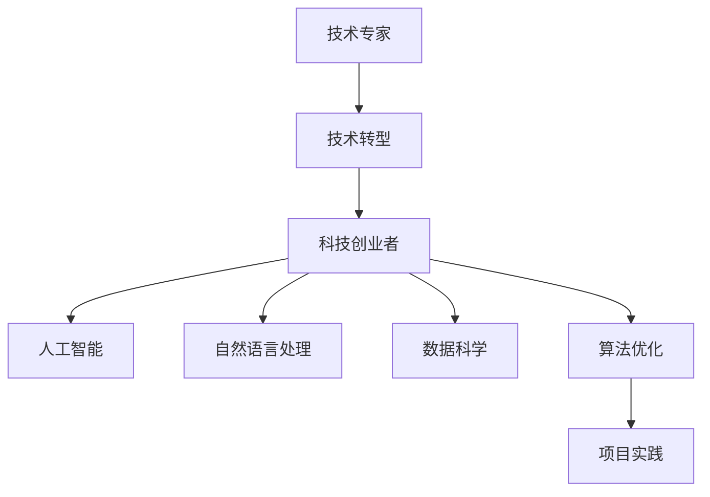

                 

# 从技术专家到科技创业者的转型之路

> 关键词：技术转型,创业,人工智能,自然语言处理,数据科学,算法优化

## 1. 背景介绍

### 1.1 问题由来
在人工智能(AI)领域深耕多年的你，是否在思考：如何将多年积累的技术知识和经验，转化为有实际价值的产品？是否希望在AI领域开创属于自己的事业？越来越多的技术专家、学者甚至程序员，踏上了从技术岗位转型为科技创业者的道路。这一转变不仅是技术应用的拓展，更是一段全新的职业征程。

### 1.2 问题核心关键点
科技创业者需要具备的技术技能、行业洞察力和商业思维，在转型过程中，如何高效地进行知识迁移、资源整合与团队构建？本文将系统梳理科技创业者转型所需的核心知识和技能，并结合真实案例，为你提供全方位的指导。

### 1.3 问题研究意义
对于技术专家而言，转型为科技创业者，意味着跨越从技术到业务的桥梁，开启全新的事业旅程。这一转变不仅是对个人职业生涯的挑战，更是对AI领域前沿技术的一次深度实践与探索。通过了解转型过程中所需的知识和技能，可以帮助技术专家更好地把握机会，快速迈向成功的科技创业者之路。

## 2. 核心概念与联系

### 2.1 核心概念概述

- **技术转型(Transition from Technical Expert to Entrepreneur)**：从技术岗位转向创业角色的过程。涉及知识迁移、技能提升、业务理解等多方面的能力转变。
- **科技创业者(Startup Founder)**：具备技术背景，有志于创立或管理AI企业的企业家。
- **人工智能(Artificial Intelligence)**：利用算法、数据、计算能力构建的模拟人类智能的技术体系。
- **自然语言处理(Natural Language Processing, NLP)**：AI中专注于理解、生成人类语言的技术领域。
- **数据科学(Data Science)**：涉及数据收集、清洗、分析、建模与解释的学科。
- **算法优化(Algorithm Optimization)**：通过算法改进提高模型性能、效率和鲁棒性的过程。

这些概念间的联系可以通过以下Mermaid流程图来展示：



这个流程图展示了从技术专家到科技创业者的核心能力路径，包括对人工智能、自然语言处理、数据科学、算法优化的深入理解和应用。通过掌握这些核心概念，能够更好地进行项目实践，实现转型。

## 3. 核心算法原理 & 具体操作步骤
### 3.1 算法原理概述

技术专家转型为科技创业者的核心在于将技术能力转化为商业应用。这一过程涉及以下几个关键步骤：

1. **技术知识迁移**：将多年的技术积累，如算法原理、模型优化、系统架构等，转化为实际产品或服务。
2. **行业洞察力提升**：深入理解目标行业的需求、痛点、竞争态势等，找到技术应用的切入点。
3. **商业思维培养**：学习产品策略、市场推广、客户管理等创业所需的核心能力。

### 3.2 算法步骤详解

#### 3.2.1 技术知识迁移

技术知识迁移是转型的基础。这需要技术专家梳理并提炼出自身最核心的技术能力，并将其转化为具体的技术方案或产品模块。

1. **识别关键技术点**：
   - 算法原理：如机器学习、深度学习、NLP、数据科学等领域的核心算法。
   - 技术框架：如TensorFlow、PyTorch、Transformers等常用的AI技术框架。
   - 开发工具：如Jupyter Notebook、Git、Docker等开发环境。

2. **知识模块化**：将技术知识分解为可独立应用的技术模块。例如，图像识别模块、文本处理模块、数据分析模块等。

3. **技术方案设计与优化**：
   - 根据行业需求，设计具体技术方案。如使用卷积神经网络(CNN)进行图像识别，或利用Transformer模型进行NLP任务。
   - 对技术方案进行优化，提升模型精度、效率和鲁棒性。

#### 3.2.2 行业洞察力提升

行业洞察力是转型的关键。这需要技术专家深入研究目标行业的业务模式、客户需求、竞争态势等，找到技术应用的切入点。

1. **行业调研**：
   - 收集行业报告、市场分析、竞争对手信息等。
   - 参与行业会议、展会，了解最新动态和趋势。

2. **客户需求分析**：
   - 通过访谈、问卷等方式，收集目标客户的需求和痛点。
   - 分析客户反馈，识别最紧迫的需求。

3. **市场策略制定**：
   - 根据行业调研和客户需求，制定市场策略。如差异化定位、竞争策略、定价模型等。
   - 预测市场规模和增长趋势，规划产品路线图。

#### 3.2.3 商业思维培养

商业思维是转型的保障。这需要技术专家学习创业所需的核心能力，如产品管理、市场营销、财务管理等。

1. **产品规划与设计**：
   - 制定产品路线图，确定产品功能、性能指标和迭代计划。
   - 设计产品原型，进行用户测试和反馈收集。

2. **市场营销策略**：
   - 制定品牌策略，包括品牌定位、品牌口号、品牌视觉等。
   - 制定市场推广策略，如SEO、社交媒体营销、广告投放等。

3. **财务与运营管理**：
   - 学习财务基础，包括预算管理、成本控制、收益分析等。
   - 掌握运营管理，包括团队建设、项目管理、客户关系管理等。

### 3.3 算法优缺点

技术转型过程中，需要注意以下几点：

**优点**：
1. **技术优势明显**：技术专家具备深厚的技术背景，能够快速开发和优化产品。
2. **创新能力强**：凭借丰富的算法和模型经验，可以持续推出创新产品。
3. **市场信任度高**：技术背景有助于树立品牌信任，快速获得客户认可。

**缺点**：
1. **业务知识欠缺**：技术专家往往对市场、销售等业务知识缺乏深入理解。
2. **产品落地难度大**：从技术到产品的转化，需要跨部门协作，协调复杂。
3. **风险控制不足**：创业过程中面临的技术和市场双重风险，需要综合应对。

### 3.4 算法应用领域

技术转型过程中，常见应用领域包括：

1. **智能客服系统**：利用NLP技术，开发智能客服解决方案，提高客户体验和响应效率。
2. **医疗数据分析**：通过机器学习和大数据技术，分析医疗数据，辅助疾病诊断和个性化治疗。
3. **金融风控系统**：利用算法优化金融风险评估，提高信贷审批和风险预警的准确性。
4. **电子商务推荐系统**：基于推荐算法，开发个性化推荐服务，提升用户体验和转化率。
5. **智能制造与自动化**：通过AI技术优化生产流程，提高生产效率和产品质量。

## 4. 数学模型和公式 & 详细讲解 & 举例说明

### 4.1 数学模型构建

在技术转型过程中，需要构建适合业务需求的数学模型。以推荐系统为例，基本流程如下：

1. **用户行为数据采集**：收集用户浏览、购买等行为数据。
2. **特征提取**：将用户和物品特征转化为模型输入。
3. **模型训练与评估**：基于用户行为数据，训练推荐模型，评估模型效果。

### 4.2 公式推导过程

以协同过滤算法为例，推导用户物品评分预测模型：

1. **用户-物品评分矩阵**：
   - 用户-物品评分矩阵 $R_{ij}$，其中 $i$ 为物品，$j$ 为用户。
   - 评分矩阵可以表示为用户-物品评分，$R_{ij} = r_{ij}$。

2. **预测评分模型**：
   - 使用用户和物品的特征向量 $u_i$ 和 $v_j$ 来预测用户 $i$ 对物品 $j$ 的评分 $r_{ij}$。
   - 预测模型 $f(u_i,v_j)$ 可以通过多种算法，如矩阵分解、协同过滤、深度学习等。

3. **评分预测公式**：
   - 根据预测模型，得到用户 $i$ 对物品 $j$ 的预测评分 $r_{ij}^{\prime}$。
   - 预测评分公式：$r_{ij}^{\prime} = f(u_i,v_j)$。

### 4.3 案例分析与讲解

以智能客服系统为例，展示从技术到产品的构建过程：

1. **需求分析**：
   - 收集企业内部客服对话记录，分析常见问题。
   - 定义问题-回答对，作为微调数据。

2. **技术选择**：
   - 选择BERT、GPT等预训练语言模型。
   - 设计任务适配层，使用线性分类器和交叉熵损失函数。

3. **模型微调**：
   - 准备标注数据集，划分为训练集、验证集和测试集。
   - 使用AdamW优化器，设置合适的学习率，执行梯度训练。

4. **评估与部署**：
   - 在测试集上评估模型性能，对比微调前后结果。
   - 集成到实际应用系统中，进行实时对话。

5. **持续优化**：
   - 定期收集新对话记录，进行模型微调。
   - 动态调整模型参数，保持模型时效性。

## 5. 项目实践：代码实例和详细解释说明

### 5.1 开发环境搭建

技术转型过程中，开发环境的选择至关重要。以下是推荐的开发环境配置：

1. **Python环境**：
   - 使用Anaconda或Miniconda创建虚拟环境。
   - 安装必要的Python包，如TensorFlow、PyTorch、Transformers等。

2. **Git版本控制**：
   - 使用Git进行代码版本控制，确保代码的协同开发和版本管理。
   - 使用GitHub或GitLab等平台，进行代码托管和团队协作。

3. **Docker容器化**：
   - 使用Docker进行应用容器化，确保部署环境的可移植性。
   - 通过Docker Compose管理多容器应用，简化开发和部署流程。

### 5.2 源代码详细实现

以下是一个简单的智能客服系统代码实现示例：

```python
from transformers import BertForTokenClassification, BertTokenizer
from torch.utils.data import Dataset
import torch
import torch.nn as nn

class NERDataset(Dataset):
    def __init__(self, texts, tags, tokenizer):
        self.texts = texts
        self.tags = tags
        self.tokenizer = tokenizer
        self.max_len = 128
        
    def __len__(self):
        return len(self.texts)
    
    def __getitem__(self, item):
        text = self.texts[item]
        tags = self.tags[item]
        
        encoding = self.tokenizer(text, return_tensors='pt', max_length=self.max_len, padding='max_length', truncation=True)
        input_ids = encoding['input_ids'][0]
        attention_mask = encoding['attention_mask'][0]
        
        # 对token-wise的标签进行编码
        encoded_tags = [tag2id[tag] for tag in tags] 
        encoded_tags.extend([tag2id['O']] * (self.max_len - len(encoded_tags)))
        labels = torch.tensor(encoded_tags, dtype=torch.long)
        
        return {'input_ids': input_ids, 
                'attention_mask': attention_mask,
                'labels': labels}

# 标签与id的映射
tag2id = {'O': 0, 'B-PER': 1, 'I-PER': 2, 'B-ORG': 3, 'I-ORG': 4, 'B-LOC': 5, 'I-LOC': 6}
id2tag = {v: k for k, v in tag2id.items()}

# 创建dataset
tokenizer = BertTokenizer.from_pretrained('bert-base-cased')

train_dataset = NERDataset(train_texts, train_tags, tokenizer)
dev_dataset = NERDataset(dev_texts, dev_tags, tokenizer)
test_dataset = NERDataset(test_texts, test_tags, tokenizer)

# 定义模型
model = BertForTokenClassification.from_pretrained('bert-base-cased', num_labels=len(tag2id))

# 定义优化器
optimizer = AdamW(model.parameters(), lr=2e-5)

# 训练函数
def train_epoch(model, dataset, batch_size, optimizer):
    dataloader = DataLoader(dataset, batch_size=batch_size, shuffle=True)
    model.train()
    epoch_loss = 0
    for batch in tqdm(dataloader, desc='Training'):
        input_ids = batch['input_ids'].to(device)
        attention_mask = batch['attention_mask'].to(device)
        labels = batch['labels'].to(device)
        model.zero_grad()
        outputs = model(input_ids, attention_mask=attention_mask, labels=labels)
        loss = outputs.loss
        epoch_loss += loss.item()
        loss.backward()
        optimizer.step()
    return epoch_loss / len(dataloader)

# 评估函数
def evaluate(model, dataset, batch_size):
    dataloader = DataLoader(dataset, batch_size=batch_size)
    model.eval()
    preds, labels = [], []
    with torch.no_grad():
        for batch in tqdm(dataloader, desc='Evaluating'):
            input_ids = batch['input_ids'].to(device)
            attention_mask = batch['attention_mask'].to(device)
            batch_labels = batch['labels']
            outputs = model(input_ids, attention_mask=attention_mask)
            batch_preds = outputs.logits.argmax(dim=2).to('cpu').tolist()
            batch_labels = batch_labels.to('cpu').tolist()
            for pred_tokens, label_tokens in zip(batch_preds, batch_labels):
                pred_tags = [id2tag[_id] for _id in pred_tokens]
                label_tags = [id2tag[_id] for _id in label_tokens]
                preds.append(pred_tags[:len(label_tags)])
                labels.append(label_tags)
    
    print(classification_report(labels, preds))

# 训练和评估
epochs = 5
batch_size = 16

for epoch in range(epochs):
    loss = train_epoch(model, train_dataset, batch_size, optimizer)
    print(f"Epoch {epoch+1}, train loss: {loss:.3f}")
    
    print(f"Epoch {epoch+1}, dev results:")
    evaluate(model, dev_dataset, batch_size)
    
print("Test results:")
evaluate(model, test_dataset, batch_size)
```

### 5.3 代码解读与分析

**NERDataset类**：
- `__init__`方法：初始化文本、标签、分词器等关键组件。
- `__len__`方法：返回数据集的样本数量。
- `__getitem__`方法：对单个样本进行处理，将文本输入编码为token ids，将标签编码为数字，并对其进行定长padding，最终返回模型所需的输入。

**tag2id和id2tag字典**：
- 定义了标签与数字id之间的映射关系，用于将token-wise的预测结果解码回真实的标签。

**训练和评估函数**：
- 使用PyTorch的DataLoader对数据集进行批次化加载，供模型训练和推理使用。
- 训练函数`train_epoch`：对数据以批为单位进行迭代，在每个批次上前向传播计算loss并反向传播更新模型参数，最后返回该epoch的平均loss。
- 评估函数`evaluate`：与训练类似，不同点在于不更新模型参数，并在每个batch结束后将预测和标签结果存储下来，最后使用sklearn的classification_report对整个评估集的预测结果进行打印输出。

**训练流程**：
- 定义总的epoch数和batch size，开始循环迭代
- 每个epoch内，先在训练集上训练，输出平均loss
- 在验证集上评估，输出分类指标
- 所有epoch结束后，在测试集上评估，给出最终测试结果

## 6. 实际应用场景

### 6.1 智能客服系统

基于大语言模型微调的对话技术，可以广泛应用于智能客服系统的构建。传统客服往往需要配备大量人力，高峰期响应缓慢，且一致性和专业性难以保证。而使用微调后的对话模型，可以7x24小时不间断服务，快速响应客户咨询，用自然流畅的语言解答各类常见问题。

在技术实现上，可以收集企业内部的历史客服对话记录，将问题和最佳答复构建成监督数据，在此基础上对预训练对话模型进行微调。微调后的对话模型能够自动理解用户意图，匹配最合适的答案模板进行回复。对于客户提出的新问题，还可以接入检索系统实时搜索相关内容，动态组织生成回答。如此构建的智能客服系统，能大幅提升客户咨询体验和问题解决效率。

### 6.2 金融舆情监测

金融机构需要实时监测市场舆论动向，以便及时应对负面信息传播，规避金融风险。传统的人工监测方式成本高、效率低，难以应对网络时代海量信息爆发的挑战。基于大语言模型微调的文本分类和情感分析技术，为金融舆情监测提供了新的解决方案。

具体而言，可以收集金融领域相关的新闻、报道、评论等文本数据，并对其进行主题标注和情感标注。在此基础上对预训练语言模型进行微调，使其能够自动判断文本属于何种主题，情感倾向是正面、中性还是负面。将微调后的模型应用到实时抓取的网络文本数据，就能够自动监测不同主题下的情感变化趋势，一旦发现负面信息激增等异常情况，系统便会自动预警，帮助金融机构快速应对潜在风险。

### 6.3 个性化推荐系统

当前的推荐系统往往只依赖用户的历史行为数据进行物品推荐，无法深入理解用户的真实兴趣偏好。基于大语言模型微调技术，个性化推荐系统可以更好地挖掘用户行为背后的语义信息，从而提供更精准、多样的推荐内容。

在实践中，可以收集用户浏览、点击、评论、分享等行为数据，提取和用户交互的物品标题、描述、标签等文本内容。将文本内容作为模型输入，用户的后续行为（如是否点击、购买等）作为监督信号，在此基础上微调预训练语言模型。微调后的模型能够从文本内容中准确把握用户的兴趣点。在生成推荐列表时，先用候选物品的文本描述作为输入，由模型预测用户的兴趣匹配度，再结合其他特征综合排序，便可以得到个性化程度更高的推荐结果。

### 6.4 未来应用展望

随着大语言模型和微调方法的不断发展，基于微调范式将在更多领域得到应用，为传统行业带来变革性影响。

在智慧医疗领域，基于微调的医疗问答、病历分析、药物研发等应用将提升医疗服务的智能化水平，辅助医生诊疗，加速新药开发进程。

在智能教育领域，微调技术可应用于作业批改、学情分析、知识推荐等方面，因材施教，促进教育公平，提高教学质量。

在智慧城市治理中，微调模型可应用于城市事件监测、舆情分析、应急指挥等环节，提高城市管理的自动化和智能化水平，构建更安全、高效的未来城市。

此外，在企业生产、社会治理、文娱传媒等众多领域，基于大模型微调的人工智能应用也将不断涌现，为NLP技术带来了全新的突破。相信随着预训练语言模型和微调方法的持续演进，NLP技术必将在更广阔的应用领域大放异彩。

## 7. 工具和资源推荐

### 7.1 学习资源推荐

为了帮助开发者系统掌握大语言模型微调的理论基础和实践技巧，这里推荐一些优质的学习资源：

1. 《Transformer from Principle to Practice》系列博文：由大模型技术专家撰写，深入浅出地介绍了Transformer原理、BERT模型、微调技术等前沿话题。

2. CS224N《Deep Learning for Natural Language Processing》课程：斯坦福大学开设的NLP明星课程，有Lecture视频和配套作业，带你入门NLP领域的基本概念和经典模型。

3. 《Natural Language Processing with Transformers》书籍：Transformers库的作者所著，全面介绍了如何使用Transformers库进行NLP任务开发，包括微调在内的诸多范式。

4. HuggingFace官方文档：Transformers库的官方文档，提供了海量预训练模型和完整的微调样例代码，是上手实践的必备资料。

5. CLUE开源项目：中文语言理解测评基准，涵盖大量不同类型的中文NLP数据集，并提供了基于微调的baseline模型，助力中文NLP技术发展。

通过对这些资源的学习实践，相信你一定能够快速掌握大语言模型微调的精髓，并用于解决实际的NLP问题。

### 7.2 开发工具推荐

高效的开发离不开优秀的工具支持。以下是几款用于大语言模型微调开发的常用工具：

1. PyTorch：基于Python的开源深度学习框架，灵活动态的计算图，适合快速迭代研究。大部分预训练语言模型都有PyTorch版本的实现。

2. TensorFlow：由Google主导开发的开源深度学习框架，生产部署方便，适合大规模工程应用。同样有丰富的预训练语言模型资源。

3. Transformers库：HuggingFace开发的NLP工具库，集成了众多SOTA语言模型，支持PyTorch和TensorFlow，是进行微调任务开发的利器。

4. Weights & Biases：模型训练的实验跟踪工具，可以记录和可视化模型训练过程中的各项指标，方便对比和调优。与主流深度学习框架无缝集成。

5. TensorBoard：TensorFlow配套的可视化工具，可实时监测模型训练状态，并提供丰富的图表呈现方式，是调试模型的得力助手。

6. Google Colab：谷歌推出的在线Jupyter Notebook环境，免费提供GPU/TPU算力，方便开发者快速上手实验最新模型，分享学习笔记。

合理利用这些工具，可以显著提升大语言模型微调任务的开发效率，加快创新迭代的步伐。

### 7.3 相关论文推荐

大语言模型和微调技术的发展源于学界的持续研究。以下是几篇奠基性的相关论文，推荐阅读：

1. Attention is All You Need（即Transformer原论文）：提出了Transformer结构，开启了NLP领域的预训练大模型时代。

2. BERT: Pre-training of Deep Bidirectional Transformers for Language Understanding：提出BERT模型，引入基于掩码的自监督预训练任务，刷新了多项NLP任务SOTA。

3. Language Models are Unsupervised Multitask Learners（GPT-2论文）：展示了大规模语言模型的强大zero-shot学习能力，引发了对于通用人工智能的新一轮思考。

4. Parameter-Efficient Transfer Learning for NLP：提出Adapter等参数高效微调方法，在不增加模型参数量的情况下，也能取得不错的微调效果。

5. Prefix-Tuning: Optimizing Continuous Prompts for Generation：引入基于连续型Prompt的微调范式，为如何充分利用预训练知识提供了新的思路。

6. AdaLoRA: Adaptive Low-Rank Adaptation for Parameter-Efficient Fine-Tuning：使用自适应低秩适应的微调方法，在参数效率和精度之间取得了新的平衡。

这些论文代表了大语言模型微调技术的发展脉络。通过学习这些前沿成果，可以帮助研究者把握学科前进方向，激发更多的创新灵感。

## 8. 总结：未来发展趋势与挑战

### 8.1 总结

本文对技术专家转型为科技创业者所需的核心知识和技能进行了全面系统的介绍。首先，通过分析技术转型面临的关键问题，明确了科技创业者所需的技术、业务和商业思维。其次，从算法原理、操作步骤到项目实践，详细讲解了从技术到产品的构建过程。最后，结合实际应用场景和未来发展趋势，提供了全方位的指导和展望。

通过本文的系统梳理，可以看到，技术转型过程中，既需要对技术深度理解和应用，也需要对业务洞察力和商业思维的提升。只有在技术、业务、商业等多方面协同发力，才能顺利迈向科技创业者的道路，实现职业上的突破和转型。

### 8.2 未来发展趋势

展望未来，科技创业者和AI领域将面临以下几个发展趋势：

1. **跨领域融合**：AI技术将与更多领域（如医疗、教育、金融等）进行深度融合，催生更多创新应用。
2. **个性化定制**：基于用户数据和语义分析，提供高度个性化的智能服务。
3. **智能协同**：利用自然语言理解和生成技术，构建人机协同的智能系统。
4. **隐私保护**：随着数据隐私意识的增强，隐私保护技术将逐渐普及。
5. **自动化运维**：利用AI技术优化系统运维，提高生产效率和稳定性。

这些趋势表明，AI技术的不断发展将带来更多的商业机会和应用场景。对于科技创业者而言，紧跟技术前沿，不断创新，方能在这个充满机遇的时代中脱颖而出。

### 8.3 面临的挑战

尽管大语言模型和微调技术的发展前景广阔，但在实际应用中，仍面临以下挑战：

1. **数据质量问题**：高质量的数据获取和处理是技术转型的基础，但数据标注和清洗工作量大，成本高。
2. **算法复杂度**：AI模型复杂度高，需要大量的计算资源和专业知识，技术门槛较高。
3. **市场竞争激烈**：AI领域竞争激烈，需要不断创新和突破，才能保持市场竞争力。
4. **法规和伦理**：AI应用需要遵守相关法规和伦理规范，避免数据滥用和算法偏见。
5. **技术转化难度**：从技术专家到科技创业者，需要跨越技术到业务的多重障碍，转换难度大。

### 8.4 研究展望

面对这些挑战，未来的研究需要在以下几个方面寻求新的突破：

1. **数据增强与生成**：利用数据生成技术，如数据增强、对抗生成网络等，提升数据质量和多样性。
2. **模型压缩与优化**：通过模型压缩、量化等技术，降低模型复杂度，提高推理效率。
3. **多模态融合**：将视觉、语音等多模态信息与文本信息融合，构建更全面、丰富的智能系统。
4. **隐私保护技术**：研究差分隐私、联邦学习等隐私保护技术，保障用户数据安全。
5. **自动化运维工具**：开发自动化运维工具，提高系统运维效率，降低人工成本。

这些研究方向的探索，将进一步推动AI技术的普及和应用，为科技创业者提供更强大的技术支撑和工具支持。

## 9. 附录：常见问题与解答

**Q1：技术专家如何选择合适的转型方向？**

A: 技术专家应结合自身技术优势和兴趣，选择合适的转型方向。例如，擅长机器学习可以转型到医疗数据分析领域，擅长自然语言处理可以转型到智能客服系统开发。

**Q2：技术转型过程中需要注意哪些关键点？**

A: 技术转型过程中，需要注意以下几点：
1. **技术知识迁移**：梳理并提炼自身技术优势，将其转化为具体的技术方案或产品模块。
2. **行业洞察力提升**：深入研究目标行业的需求、痛点、竞争态势等，找到技术应用的切入点。
3. **商业思维培养**：学习创业所需的核心能力，如产品策略、市场营销、财务管理等。

**Q3：技术专家如何提高市场竞争力？**

A: 技术专家可以通过以下几个方面提高市场竞争力：
1. **持续学习**：保持对最新技术和市场动态的关注，不断学习新知识和技能。
2. **团队建设**：组建高效、多元化的团队，提升产品开发和市场推广的效率。
3. **产品迭代**：通过用户反馈和市场调研，不断优化和迭代产品，满足用户需求。
4. **品牌建设**：建立强大的品牌，提升产品知名度和用户信任度。

**Q4：技术转型过程中如何应对风险？**

A: 技术转型过程中，需要全面考虑技术、市场和运营等多个层面的风险，采取以下措施：
1. **小步快跑**：采用迭代开发方式，逐步验证和优化产品。
2. **风险评估**：进行详细的市场调研和风险评估，制定应对策略。
3. **多元化投资**：采用多元化投资策略，降低单一项目的风险。
4. **专业咨询**：寻求专业咨询和顾问，获取行业洞察和指导。

---

作者：禅与计算机程序设计艺术 / Zen and the Art of Computer Programming

