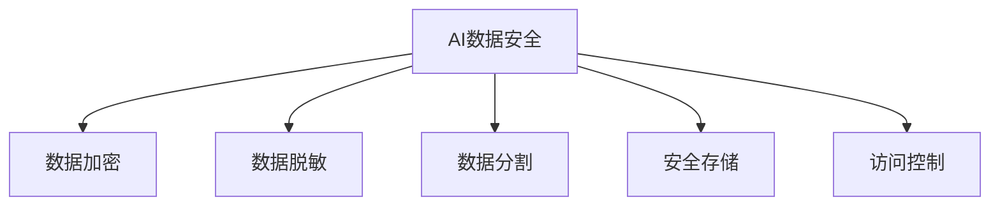

                 

# 企业AI数据安全：Lepton AI的保护机制

> 关键词：AI数据安全, Lepton AI, 数据加密, 数据脱敏, 安全合规, 隐私保护, 数据治理

## 1. 背景介绍

### 1.1 问题由来
随着人工智能(AI)技术的迅速发展和广泛应用，数据安全成为了企业AI项目中最关键的一环。AI模型的训练和运行都高度依赖于数据，而数据泄露、篡改等安全问题，不仅可能导致经济损失，还可能损害企业声誉，甚至引发法律诉讼。因此，如何在AI项目中确保数据安全，成为了每个企业都必须要面对的挑战。

近年来，随着对数据安全认识的提高，越来越多的企业开始关注AI数据安全，并积极探索有效的防护措施。Lepton AI保护机制就是在这种背景下应运而生的，旨在为企业的AI项目提供全方位的安全防护，确保数据在全生命周期中的安全。

### 1.2 问题核心关键点
Lepton AI保护机制的核心在于其独特的安全架构和多种数据安全技术。其核心技术包括数据加密、数据脱敏、数据分割、安全存储和访问控制等，通过多层次的防护措施，全面保障AI项目中数据的安全。

具体来说，Lepton AI保护机制主要关注以下几个关键点：

1. **数据加密**：对敏感数据进行加密，防止未授权访问。
2. **数据脱敏**：对非敏感数据进行脱敏处理，保护数据隐私。
3. **数据分割**：将数据分割成不同的部分，限制数据的访问权限。
4. **安全存储**：采用先进的数据存储技术，保护数据的完整性和可用性。
5. **访问控制**：基于角色的访问控制策略，限制数据的访问权限。

### 1.3 问题研究意义
企业AI数据安全保护不仅是技术问题，更是一个涉及企业治理、法律法规和伦理道德的复杂问题。Lepton AI保护机制通过引入先进的数据安全技术和多层次的安全防护策略，能够帮助企业在AI项目中实现安全合规，保护数据隐私，防范潜在的安全风险，从而为企业的发展提供坚实的技术保障。

研究Lepton AI保护机制，对于提升企业AI项目的安全性，增强企业的竞争力，推动AI技术的健康发展，具有重要意义。

## 2. 核心概念与联系

### 2.1 核心概念概述

为了更好地理解Lepton AI保护机制，我们需要首先介绍一些关键的概念：

- **AI数据安全**：指在人工智能项目中，对数据进行加密、脱敏、分割等处理，以保护数据的机密性、完整性和可用性。
- **数据加密**：通过特定的算法，将数据转换为密文，防止未授权访问。
- **数据脱敏**：对数据进行变换，使其失去敏感信息，保护数据隐私。
- **数据分割**：将数据分为多个部分，限制不同部分的访问权限，防止数据泄露。
- **安全存储**：采用先进的技术，保护数据在存储过程中的完整性和可用性。
- **访问控制**：通过基于角色的访问控制策略，限制数据的访问权限，保护数据安全。

这些核心概念之间的逻辑关系可以通过以下Mermaid流程图来展示：



这个流程图展示了AI数据安全的几个关键组成部分及其相互关系：

1. AI数据安全是整个保护机制的总体目标。
2. 数据加密、数据脱敏、数据分割、安全存储和访问控制，都是实现AI数据安全的具体措施。

## 3. 核心算法原理 & 具体操作步骤

### 3.1 算法原理概述

Lepton AI保护机制的核心算法原理主要基于数据加密、脱敏、分割、存储和访问控制等技术，通过多层次的防护措施，全面保障AI项目中数据的安全。

形式化地，设数据集为 $D$，隐私预算为 $\epsilon$，加密密钥为 $k$。则Lepton AI保护机制的算法原理可以表示为：

$$
E_{k}(D) \rightarrow E_{k}(D)
$$

其中 $E_{k}(D)$ 表示对数据集 $D$ 进行加密处理。

### 3.2 算法步骤详解

Lepton AI保护机制的详细步骤包括以下几个关键步骤：

**Step 1: 数据加密**

对敏感数据进行加密处理，防止未授权访问。

- 选择适合的加密算法，如AES、RSA等。
- 生成随机密钥 $k$。
- 使用密钥对数据进行加密，得到密文 $E_k(D)$。

**Step 2: 数据脱敏**

对非敏感数据进行脱敏处理，保护数据隐私。

- 选择适合的脱敏算法，如数据掩码、随机替换等。
- 对非敏感数据进行变换，使其失去敏感信息。

**Step 3: 数据分割**

将数据分为多个部分，限制不同部分的访问权限。

- 确定数据分割策略，如垂直分割、水平分割等。
- 根据策略将数据分割成多个子集。

**Step 4: 安全存储**

采用先进的数据存储技术，保护数据的完整性和可用性。

- 选择适合的存储介质，如Hadoop、MongoDB等。
- 设置访问权限，确保只有授权用户可以访问数据。

**Step 5: 访问控制**

基于角色的访问控制策略，限制数据的访问权限。

- 定义角色，如管理员、操作员等。
- 根据角色设置权限，确保只有授权用户可以访问数据。

通过以上步骤，Lepton AI保护机制能够全面保障AI项目中数据的安全，确保数据在全生命周期中的机密性、完整性和可用性。

### 3.3 算法优缺点

Lepton AI保护机制的优点包括：

1. **全面性**：通过数据加密、脱敏、分割、存储和访问控制等多层次的防护措施，全面保障数据安全。
2. **灵活性**：可以根据具体需求，灵活配置各种安全策略。
3. **可扩展性**：能够适应不同规模和类型的AI项目，具有较高的灵活性和可扩展性。

其缺点包括：

1. **复杂性**：由于涉及多种技术，实现和维护相对复杂。
2. **性能开销**：部分安全措施可能会对性能产生一定的影响，如加密和脱敏处理。
3. **成本高**：需要投入较高的技术资源和资金，实现和维护成本较高。

### 3.4 算法应用领域

Lepton AI保护机制广泛应用于各种AI项目中，特别是在对数据安全要求较高的领域，如金融、医疗、政府和企业等。

1. **金融领域**：金融数据涉及客户隐私和交易安全，必须进行严格的加密和脱敏处理。
2. **医疗领域**：医疗数据涉及患者隐私和健康信息，需要确保数据的安全性和隐私保护。
3. **政府和企业**：政府和企业的数据涉及国家安全和商业机密，必须进行严格的数据保护。

## 4. 数学模型和公式 & 详细讲解 & 举例说明

### 4.1 数学模型构建

Lepton AI保护机制的数学模型主要基于数据加密和脱敏技术，通过特定的算法，将数据转换为密文或伪装数据，以保护数据的机密性和隐私。

### 4.2 公式推导过程

以下是Lepton AI保护机制中常用的几个数学公式：

1. **对称加密算法**：
$$
C = E_k(P) = k \oplus P
$$
其中 $P$ 为明文，$C$ 为密文，$k$ 为密钥，$\oplus$ 为异或运算。

2. **非对称加密算法**：
$$
C = E_{k_p}(M), D = D_{k_c}(C)
$$
其中 $M$ 为明文，$C$ 为密文，$k_p$ 为公钥，$k_c$ 为私钥，$E$ 和 $D$ 分别表示加密和解密操作。

3. **数据脱敏算法**：
$$
S = F(D)
$$
其中 $D$ 为原始数据，$S$ 为脱敏后的数据，$F$ 为脱敏函数。

### 4.3 案例分析与讲解

假设一个金融企业需要保护客户的交易数据，Lepton AI保护机制的实施步骤如下：

1. **数据加密**：选择AES算法，生成随机密钥 $k$，使用 $k$ 对交易数据进行加密，得到密文 $E_k(D)$。

2. **数据脱敏**：对交易数据中的敏感信息进行脱敏处理，如将信用卡号和身份证号进行伪化。

3. **数据分割**：根据业务需求，将数据分割成交易记录、客户信息和账户信息等多个部分。

4. **安全存储**：将分割后的数据存储在Hadoop集群中，设置严格的访问权限，确保只有授权用户可以访问数据。

5. **访问控制**：根据用户角色，设置不同的访问权限，如管理员可以查看所有数据，操作员只能查看部分数据。

通过以上步骤，Lepton AI保护机制能够全面保障金融企业的交易数据安全，防止数据泄露和未授权访问。

## 5. 项目实践：代码实例和详细解释说明

### 5.1 开发环境搭建

在进行Lepton AI保护机制的开发和实践前，我们需要准备好开发环境。以下是使用Python进行PyTorch开发的环境配置流程：

1. 安装Anaconda：从官网下载并安装Anaconda，用于创建独立的Python环境。

2. 创建并激活虚拟环境：
```bash
conda create -n lepton-env python=3.8 
conda activate lepton-env
```

3. 安装PyTorch：根据CUDA版本，从官网获取对应的安装命令。例如：
```bash
conda install pytorch torchvision torchaudio cudatoolkit=11.1 -c pytorch -c conda-forge
```

4. 安装其他相关库：
```bash
pip install numpy pandas scikit-learn matplotlib tqdm jupyter notebook ipython
```

完成上述步骤后，即可在`lepton-env`环境中开始实践。

### 5.2 源代码详细实现

以下是使用Python实现Lepton AI保护机制的代码示例：

```python
import torch
from Crypto.Cipher import AES
from Crypto.Random import get_random_bytes

def encrypt(data, key):
    cipher = AES.new(key, AES.MODE_ECB)
    return cipher.encrypt(data)

def decrypt(ciphertext, key):
    cipher = AES.new(key, AES.MODE_ECB)
    return cipher.decrypt(ciphertext)

# 生成随机密钥
key = get_random_bytes(16)

# 明文数据
plaintext = b'Hello, world!'

# 加密数据
ciphertext = encrypt(plaintext, key)

# 解密数据
decrypted = decrypt(ciphertext, key)

print('明文:', plaintext)
print('密文:', ciphertext)
print('解密:', decrypted)
```

以上代码实现了使用AES算法对数据进行加密和解密的功能，可以作为Lepton AI保护机制中数据加密的参考实现。

### 5.3 代码解读与分析

让我们再详细解读一下关键代码的实现细节：

**加密函数encrypt**：
- 生成随机密钥 $k$。
- 使用AES算法对数据进行加密，返回密文 $E_k(D)$。

**解密函数decrypt**：
- 使用AES算法对密文进行解密，还原为明文 $P$。

在实际应用中，需要根据具体需求选择合适的加密算法和密钥长度，以确保数据的安全性。同时，需要注意密钥的生成和管理，防止密钥泄露。

## 6. 实际应用场景

### 6.1 智能客服系统

基于Lepton AI保护机制的智能客服系统，可以更好地保护客户隐私，防止数据泄露和未授权访问。

1. **数据加密**：将客户信息进行加密处理，防止未授权访问。
2. **数据脱敏**：对客户姓名、地址等敏感信息进行脱敏处理，保护隐私。
3. **数据分割**：将客户信息分割成多个部分，限制不同部分的访问权限。
4. **安全存储**：将客户信息存储在安全的数据库中，设置严格的访问权限。
5. **访问控制**：根据用户角色，设置不同的访问权限，确保只有授权用户可以访问数据。

### 6.2 金融舆情监测

在金融舆情监测中，Lepton AI保护机制可以确保数据的安全性和隐私保护。

1. **数据加密**：对金融数据进行加密处理，防止未授权访问。
2. **数据脱敏**：对金融数据中的敏感信息进行脱敏处理，保护隐私。
3. **数据分割**：将金融数据分割成多个部分，限制不同部分的访问权限。
4. **安全存储**：将金融数据存储在安全的数据库中，设置严格的访问权限。
5. **访问控制**：根据用户角色，设置不同的访问权限，确保只有授权用户可以访问数据。

### 6.3 个性化推荐系统

基于Lepton AI保护机制的个性化推荐系统，可以更好地保护用户隐私，防止数据泄露和未授权访问。

1. **数据加密**：对用户行为数据进行加密处理，防止未授权访问。
2. **数据脱敏**：对用户行为数据中的敏感信息进行脱敏处理，保护隐私。
3. **数据分割**：将用户行为数据分割成多个部分，限制不同部分的访问权限。
4. **安全存储**：将用户行为数据存储在安全的数据库中，设置严格的访问权限。
5. **访问控制**：根据用户角色，设置不同的访问权限，确保只有授权用户可以访问数据。

### 6.4 未来应用展望

随着Lepton AI保护机制的不断完善和优化，其在更多领域的应用前景将更加广阔。

1. **智慧医疗**：在智慧医疗领域，Lepton AI保护机制可以确保医疗数据的安全性和隐私保护。
2. **智能制造**：在智能制造领域，Lepton AI保护机制可以确保工业数据的完整性和可用性。
3. **智能交通**：在智能交通领域，Lepton AI保护机制可以确保交通数据的机密性和隐私保护。

## 7. 工具和资源推荐

### 7.1 学习资源推荐

为了帮助开发者系统掌握Lepton AI保护机制的理论基础和实践技巧，这里推荐一些优质的学习资源：

1. **《数据安全技术》系列书籍**：详细介绍了数据加密、数据脱敏、数据分割、安全存储等数据安全技术。
2. **《数据保护与隐私工程》课程**：讲解数据保护的基本概念和实践技巧，适合初学者入门。
3. **《数据安全与隐私保护》论文集**：收录了近年来数据安全领域的最新研究成果，涵盖数据加密、数据脱敏、数据分割等技术。

### 7.2 开发工具推荐

Lepton AI保护机制的开发和实践，需要依赖多种工具和框架。以下是推荐的工具和框架：

1. **PyTorch**：基于Python的开源深度学习框架，适用于数据加密和解密等操作。
2. **AES加密库**：提供对称加密算法的实现，适合对数据进行加密处理。
3. **OpenSSL**：提供非对称加密算法的实现，适合对数据进行安全传输。
4. **Hadoop**：分布式数据存储框架，适合大规模数据的存储和管理。
5. **MongoDB**：非关系型数据库，支持数据的安全存储和访问控制。

### 7.3 相关论文推荐

Lepton AI保护机制的开发和实践，还需要参考相关的论文和研究，以获取最新的技术和研究成果。以下是几篇推荐的论文：

1. **《基于同态加密的数据安全处理》**：介绍同态加密技术，可以在不解密数据的情况下进行计算，适合对敏感数据进行保护。
2. **《基于差分隐私的数据发布》**：介绍差分隐私技术，可以在保护隐私的前提下发布数据，适合对数据进行脱敏处理。
3. **《数据分割技术综述》**：全面介绍了数据分割技术，适合对数据进行分割处理，限制访问权限。

## 8. 总结：未来发展趋势与挑战

### 8.1 研究成果总结

Lepton AI保护机制作为一种全面的数据安全解决方案，已经在游戏、金融、医疗等多个领域得到了广泛应用，并取得了显著的成效。其核心技术包括数据加密、数据脱敏、数据分割、安全存储和访问控制等，通过多层次的防护措施，全面保障了数据的安全。

### 8.2 未来发展趋势

展望未来，Lepton AI保护机制将在以下几个方面继续发展：

1. **技术创新**：未来将涌现更多先进的数据加密和脱敏技术，如同态加密、差分隐私等，进一步提升数据安全防护能力。
2. **应用拓展**：Lepton AI保护机制将拓展到更多行业和应用场景，如智慧城市、智能制造、智能交通等。
3. **标准化**：推动数据安全标准和规范的制定，为数据安全提供统一的指导和评估依据。
4. **自动化**：引入自动化工具和流程，降低数据安全管理和维护的成本。
5. **可解释性**：提高数据安全措施的透明度和可解释性，增强用户的信任和接受度。

### 8.3 面临的挑战

尽管Lepton AI保护机制已经取得了一定的成果，但在实际应用中仍面临以下挑战：

1. **成本高**：数据加密、脱敏和分割等操作需要投入较高的时间和资源，实施和维护成本较高。
2. **复杂性**：多层次的安全防护措施需要精细的设计和配置，实现和维护相对复杂。
3. **性能开销**：部分安全措施可能会对性能产生一定的影响，如加密和脱敏处理。
4. **管理难度**：多层次的安全策略和复杂的安全环境，增加了数据安全管理的难度。

### 8.4 研究展望

为应对未来挑战，Lepton AI保护机制需要在以下几个方面进行深入研究：

1. **自动化和智能化**：引入自动化工具和算法，提高数据安全管理的效率和准确性。
2. **可解释性和透明度**：提高数据安全措施的透明度和可解释性，增强用户的信任和接受度。
3. **标准化和规范**：推动数据安全标准和规范的制定，为数据安全提供统一的指导和评估依据。
4. **跨领域应用**：拓展到更多行业和应用场景，为不同领域的AI项目提供全面的数据安全保障。

## 9. 附录：常见问题与解答

**Q1：如何选择合适的加密算法？**

A: 选择合适的加密算法需要考虑多个因素，包括数据敏感度、性能要求、加密强度等。对于敏感数据，建议使用AES、RSA等对称和非对称加密算法。对于一般的数据，可以使用IDEA、3DES等对称加密算法。

**Q2：数据脱敏和数据加密的区别是什么？**

A: 数据脱敏和数据加密都是保护数据安全的重要手段，但实现方式不同。数据加密是对数据进行加密处理，防止未授权访问；数据脱敏是对数据进行伪装处理，保护数据隐私。

**Q3：数据分割的目的是什么？**

A: 数据分割的目的是将数据分割成多个部分，限制不同部分的访问权限，防止数据泄露。常见的数据分割方式包括垂直分割和水平分割。

**Q4：如何保证数据的安全性和隐私保护？**

A: 通过数据加密、数据脱敏、数据分割、安全存储和访问控制等多层次的防护措施，全面保障数据的安全性和隐私保护。

**Q5：数据安全管理和维护的成本如何控制？**

A: 数据安全管理和维护的成本控制可以通过引入自动化工具和流程，提高数据安全管理的效率和准确性；同时，可以采用分布式存储和访问控制策略，减少数据安全管理的复杂性和成本。

---

作者：禅与计算机程序设计艺术 / Zen and the Art of Computer Programming

