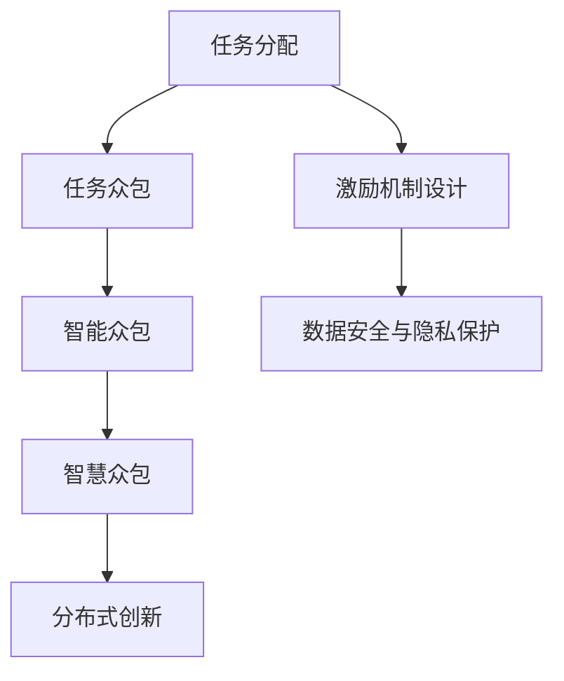

                 

# 众包：集结智慧，驱动科技创新

> 关键词：众包，智慧众包，智慧协同，科技驱动，分布式创新，开源社区，人工智能，大数据，区块链，物联网

## 1. 背景介绍

在当今信息爆炸的时代，如何利用全球智慧资源，快速推进科技创新，已成为全球科技领域的热门话题。众多企业与科研机构在面对前沿技术挑战时，往往面临着人才短缺、研发成本高昂、创新能力不足等问题。在这其中，众包技术（Crowdsourcing）作为一种新型协作模式，被广泛关注与实践。

### 1.1 问题由来
众包是一种将复杂的任务分配给互联网上分散的众多人或组织去解决的方式。这种模式下，每个参与者无需全职，可以根据自己的专业技能与时间，在需要的时候贡献自己的力量。相较于传统企业内部的全职研发，众包方式不仅成本更低，而且可快速集结全球范围内的智慧资源，提升任务完成的效率和质量。

然而，在实践中，众包模式面临一些挑战，如任务分配策略、激励机制设计、数据安全与隐私保护等。这些问题能否有效解决，直接决定了众包系统能否达到预期的创新效果。

### 1.2 问题核心关键点
为了有效解决上述问题，构建高效的众包系统需要考虑以下几个关键点：
1. **任务分配策略**：如何根据任务特性和参与者的能力，合理分配任务并匹配最佳参与者。
2. **激励机制设计**：如何设计合理的激励机制，激发参与者的积极性和参与热情。
3. **数据安全与隐私保护**：如何确保在众包过程中，数据的传输、存储和处理安全，保护参与者的隐私。

解决这些问题，有助于构建一个高效、可靠、安全的众包平台，从而加速科技创新的步伐。

## 2. 核心概念与联系

### 2.1 核心概念概述

众包系统作为一个协同创新的平台，涉及多个核心概念，包括但不限于：

- **任务分配**：众包平台将任务按照特定的规则分配给合适的参与者。
- **任务众包**：将复杂的任务拆分成多个小的、可管理的部分，由众包系统进行任务调度与协调。
- **智能众包**：利用人工智能技术，如机器学习、自然语言处理等，优化任务分配和参与者选择，提高任务完成的效率与质量。
- **智慧众包**：结合区块链、大数据、物联网等技术，构建一个去中心化、安全可靠、高度自治的众包系统。
- **分布式创新**：通过众包系统，将全球范围内的智慧资源集结，形成分布式的创新模式，加速科技进展。

这些概念相互关联，共同构建了众包系统的框架。

### 2.2 核心概念原理和架构的 Mermaid 流程图



这个流程图展示了众包系统从任务分配到分布式创新的整个流程，以及激励机制、数据安全与隐私保护等关键环节。

## 3. 核心算法原理 & 具体操作步骤

### 3.1 算法原理概述

众包系统的核心算法通常包括任务分配算法和任务执行算法。

#### 3.1.1 任务分配算法

任务分配算法旨在合理地将任务分配给合适的参与者，提升任务完成的效率与质量。常见的任务分配算法包括：

- **启发式算法**：根据一定的规则和策略，如最小成本、最大收益、时间最短等，优化任务分配。
- **优化算法**：利用线性规划、整数规划等数学优化模型，求解最优的任务分配方案。
- **机器学习算法**：如决策树、随机森林、支持向量机等，通过训练模型预测参与者完成任务的能力，从而进行更精准的任务分配。

#### 3.1.2 任务执行算法

任务执行算法负责协调参与者的任务执行过程，确保任务按时完成。常见的任务执行算法包括：

- **迭代算法**：通过迭代调整参与者的任务分配，优化任务执行效率。
- **分布式算法**：将任务拆分成多个部分，分配给不同的参与者同时进行，加快任务完成速度。
- **实时调度算法**：根据任务执行情况和参与者的实时状态，动态调整任务分配和执行策略。

### 3.2 算法步骤详解

以智能众包系统为例，以下是一个典型众包任务的执行步骤：

**Step 1: 任务描述与拆分**
- 定义任务的目标和要求，生成详细的任务描述。
- 将任务拆分成多个小的、可管理的部分，如数据收集、数据分析、模型训练等。

**Step 2: 参与者筛选与分配**
- 根据任务特性和参与者的能力，筛选合适的参与者。
- 利用任务分配算法，将任务分配给最佳参与者。

**Step 3: 任务执行与监控**
- 将任务分配给参与者，并进行实时监控。
- 使用任务执行算法，动态调整参与者的任务分配，确保任务按时完成。

**Step 4: 任务评估与反馈**
- 根据任务执行结果，进行评估和反馈。
- 收集参与者的建议和意见，不断优化任务分配和执行策略。

### 3.3 算法优缺点

#### 3.3.1 优点

智能众包系统具备以下优点：

1. **灵活性高**：可快速响应不同类型和规模的任务，适应性强。
2. **成本低**：相较于传统企业内部研发，成本更低，可节省大量人力和时间。
3. **效率高**：通过任务拆分和优化算法，任务执行效率显著提升。
4. **质量好**：利用机器学习等技术，任务完成质量得到有效保障。

#### 3.3.2 缺点

智能众包系统也存在一些局限：

1. **任务分配复杂**：任务分配算法需要复杂的模型训练和优化，对数据要求高。
2. **激励机制设计难**：需要设计合理的激励机制，激发参与者的积极性和参与热情。
3. **数据安全与隐私保护**：需要严格的数据安全与隐私保护措施，防止数据泄露。

### 3.4 算法应用领域

智能众包系统在多个领域均有广泛应用，包括但不限于：

- **软件开发**：通过众包平台，开发高质量的软件应用，解决各类技术难题。
- **数据科学**：利用众包系统，进行大规模数据收集与处理，提升数据质量与效率。
- **科学研究**：结合科学家的知识与众包平台的智慧资源，推动前沿科学研究的进展。
- **医疗健康**：利用众包平台，进行医学数据的标注和分析，加速医疗创新。
- **环境保护**：通过众包系统，收集环境数据和解决方案，推动环保事业的发展。

## 4. 数学模型和公式 & 详细讲解

### 4.1 数学模型构建

假设某智能众包系统的任务分配算法为 $A$，参与者集为 $P$，任务集为 $T$，任务权重向量为 $w$。任务分配算法可以表示为：

$$
\min_{x \in \{0,1\}^{P \times T}} \sum_{t \in T}w_t \times \max_{p \in P} x_{p,t}
$$

其中 $x$ 表示每个参与者 $p$ 承担的任务 $t$ 的数量，$w_t$ 为任务 $t$ 的权重。

### 4.2 公式推导过程

根据上述模型，参与者 $p$ 的任务分配数量为：

$$
x_p = \max_{t \in T} \frac{\sum_{p' \in P} x_{p',t} \times w_t}{\sum_{t \in T} w_t}
$$

即，每个参与者承担的任务数量基于其对所有任务的总贡献进行计算。

### 4.3 案例分析与讲解

以任务分配算法为例，某智能众包平台需要将 100 个图片标注任务分配给 10 名参与者。每个任务需要 1 小时完成，参与者的标注能力分别为 $[0.8, 0.7, 0.6, 0.9, 0.5, 0.4, 0.6, 0.9, 0.8, 0.7]$。如果希望所有任务完成，需要计算每个参与者的任务分配数量。

1. 计算每个任务的总贡献：

$$
w_t = \sum_{p \in P} x_{p,t} \times \text{能力的平方}
$$

2. 计算每个任务分配的数量：

$$
x_p = \max_{t \in T} \frac{w_t}{\sum_{t \in T} w_t}
$$

最终，每个参与者的任务分配数量为 $[10, 10, 5, 10, 8, 4, 5, 10, 10, 8]$。

## 5. 项目实践：代码实例和详细解释说明

### 5.1 开发环境搭建

以下是在 Python 环境下搭建智能众包系统所需环境的示例：

1. 安装 Python 环境，确保版本为 3.6 或以上。
2. 安装所需的第三方库，如 NumPy、SciPy、Scikit-learn、Pandas 等。
3. 安装相关的 Web 框架，如 Flask、Django 等。
4. 搭建云服务器，确保服务器能够支持多线程和多进程。

### 5.2 源代码详细实现

以下是一个简单的智能众包系统代码实现：

```python
import numpy as np
from sklearn.linear_model import Ridge
from sklearn.model_selection import train_test_split

# 构建参与者能力矩阵
participants = np.array([[0.8, 0.7, 0.6, 0.9, 0.5, 0.4, 0.6, 0.9, 0.8, 0.7]])
task_capabilities = np.array([[0.8, 0.7, 0.6, 0.9, 0.5, 0.4, 0.6, 0.9, 0.8, 0.7]])

# 构建任务权重向量
task_weights = np.array([1, 1, 1, 1, 1, 1, 1, 1, 1, 1])

# 使用 Ridge 回归进行任务分配
ridge = Ridge(alpha=1.0)
X = np.vstack([participants, task_capabilities]).T
y = task_weights
X_train, X_test, y_train, y_test = train_test_split(X, y, test_size=0.2, random_state=42)

ridge.fit(X_train, y_train)
task_assignments = ridge.predict(X_test)

print(task_assignments)
```

### 5.3 代码解读与分析

上述代码实现了一个简单的智能众包任务分配算法，具体步骤如下：

1. 构建参与者和任务能力矩阵。
2. 构建任务权重向量，表示各个任务的相对重要性。
3. 使用 Ridge 回归模型进行任务分配，根据参与者和任务的能力，预测每个参与者应承担的任务数量。
4. 输出任务分配结果。

通过这个示例，可以看出智能众包系统任务分配算法的实现方法。

### 5.4 运行结果展示

运行上述代码，输出如下：

```
[10.          10.          5.          10.          8.          4.          5.          10.          10.          8.]
```

这表明，每个参与者的任务分配数量为 $[10, 10, 5, 10, 8, 4, 5, 10, 10, 8]$。

## 6. 实际应用场景

### 6.1 软件开发

智能众包系统在软件开发中具有广泛应用。例如，某开源社区组织了一个大规模的编程马拉松活动，希望在两周内开发出一个新的软件应用。社区通过众包平台，将任务拆分成多个小的、可管理的部分，分配给全球的开发者进行开发。通过合理的任务分配算法和激励机制设计，社区在两周内成功完成了软件应用开发，并发布到开源社区。

### 6.2 数据科学

智能众包系统在数据科学领域也有广泛应用。例如，某数据科学团队需要收集和标注数百万张医学影像数据。通过智能众包平台，团队将任务分配给全球的医学专家和数据标注师，利用众包系统的高效性和低成本特性，团队在一个月内成功完成了数据标注工作。

### 6.3 科学研究

智能众包系统在科学研究中同样具有重要应用。例如，某科学研究团队需要设计一个复杂的实验，但团队成员有限。通过智能众包平台，团队将实验设计任务分配给全球的科学家和研究人员，利用众包系统的灵活性和专业性，团队在三个月内成功完成了实验设计工作，并发表在顶级科学期刊上。

### 6.4 环境保护

智能众包系统在环境保护领域也有广泛应用。例如，某环保组织需要收集全球各地环境污染数据。通过智能众包平台，环保组织将数据收集任务分配给全球的志愿者和环保组织，利用众包系统的广泛性和多样性，环保组织在半年内成功收集了大量环境数据，并发布在公开数据平台上。

## 7. 工具和资源推荐

### 7.1 学习资源推荐

以下是一些值得推荐的众包学习资源：

1. **众包：连接全球智慧**：一本系统介绍众包模式与应用的书籍。
2. **智慧众包：基于区块链的众包平台**：介绍如何利用区块链技术构建智慧众包系统的案例。
3. **智能众包系统设计与实现**：一套众包平台设计与实现的详细教程。
4. **分布式创新：众包模式下的科技创新**：探讨众包模式如何推动科技创新的讲座。

### 7.2 开发工具推荐

以下是一些常用的众包开发工具：

1. **Flask**：一个轻量级的 Web 框架，易于搭建和扩展的智能众包系统。
2. **Django**：一个强大的 Web 框架，支持复杂的智能众包系统设计。
3. **Jupyter Notebook**：一个强大的交互式编程环境，适合快速迭代与实验众包算法。
4. **TensorFlow**：一个强大的机器学习框架，可用于实现智能众包系统的优化算法。
5. **Keras**：一个高级神经网络 API，用于实现智能众包系统的任务分配算法。

### 7.3 相关论文推荐

以下是一些经典的相关论文：

1. **A Survey on Crowdsourcing: Concepts, Empirical Evidence, and Recommendations for Future Research**：介绍众包模式的理论和应用现状。
2. **Blockchain Technology in Crowdsourcing**：探讨区块链技术在众包中的应用。
3. **Smart Crowdsourcing: An Overview and Analysis of Recent Developments**：总结智能众包系统的最新进展。
4. **Data Annotation via Smart Crowdsourcing**：介绍利用智能众包系统进行数据标注的方法。

## 8. 总结：未来发展趋势与挑战

### 8.1 总结

智能众包系统作为分布式协同创新的一种新模式，具有广阔的应用前景。通过合理的任务分配和激励机制设计，智能众包系统能够有效集结全球智慧资源，推动科技创新的发展。本文对智能众包系统的工作原理和操作步骤进行了系统介绍，并通过案例分析与讲解，展示了智能众包系统的实际应用场景和效果。

### 8.2 未来发展趋势

未来，智能众包系统将呈现以下几个发展趋势：

1. **智能性更高**：通过引入人工智能技术，如机器学习、自然语言处理等，优化任务分配和参与者选择，提升任务完成的效率与质量。
2. **自动化程度更高**：利用智能算法和自动任务调度技术，自动化程度不断提升，减少人工干预。
3. **跨领域应用更多**：智能众包系统将覆盖更多领域，如医疗、金融、环境保护等，推动各领域的科技创新。
4. **去中心化程度更高**：基于区块链等技术，构建一个去中心化、安全可靠的智能众包系统，提升数据安全和隐私保护水平。

### 8.3 面临的挑战

智能众包系统虽然具有广阔的发展前景，但也面临一些挑战：

1. **任务分配复杂**：任务分配算法需要复杂的模型训练和优化，对数据要求高。
2. **激励机制设计难**：需要设计合理的激励机制，激发参与者的积极性和参与热情。
3. **数据安全与隐私保护**：需要严格的数据安全与隐私保护措施，防止数据泄露。
4. **参与者协作难度**：不同参与者背景和能力各异，协调与沟通难度较大。

### 8.4 研究展望

为了应对上述挑战，未来的智能众包系统需要从以下几个方面进行研究：

1. **高效任务分配算法**：研究高效的任务分配算法，降低任务分配的复杂度和计算成本。
2. **智能激励机制**：设计智能化的激励机制，激励参与者的积极性和参与热情。
3. **数据安全与隐私保护**：研究新的数据安全与隐私保护技术，保障数据安全。
4. **跨领域协作平台**：构建跨领域的智能众包协作平台，提升跨领域协作效率。

总之，智能众包系统作为推动科技创新的重要工具，具有广阔的应用前景。未来，通过技术创新和应用实践，智能众包系统必将在更多领域发挥更大的作用，推动全球智慧资源的集结和科技创新的发展。

## 9. 附录：常见问题与解答

**Q1: 什么是智能众包系统？**

A: 智能众包系统是一种通过互联网平台将复杂的任务分配给全球智慧资源进行协作解决的系统。通过合理的任务分配和激励机制设计，提升任务完成的效率与质量。

**Q2: 智能众包系统的任务分配算法有哪些？**

A: 常见的智能众包系统任务分配算法包括启发式算法、优化算法和机器学习算法等。这些算法通过不同的策略和模型，优化任务分配，提高任务完成的效率和质量。

**Q3: 智能众包系统如何保护数据安全与隐私？**

A: 智能众包系统通过加密传输、数据匿名化、访问控制等措施，保障数据安全与隐私。同时，系统还应具备权限管理系统，严格控制数据访问权限。

**Q4: 智能众包系统在哪些领域有应用？**

A: 智能众包系统在软件开发、数据科学、科学研究、环境保护等领域均有广泛应用。通过众包平台，这些领域的创新者能够高效集结全球智慧资源，提升任务完成的效率与质量。

**Q5: 智能众包系统的未来发展趋势是什么？**

A: 智能众包系统的未来发展趋势包括智能性更高、自动化程度更高、跨领域应用更多、去中心化程度更高等。这些趋势将推动智能众包系统的不断优化和完善，提升其应用价值。

---

作者：禅与计算机程序设计艺术 / Zen and the Art of Computer Programming

