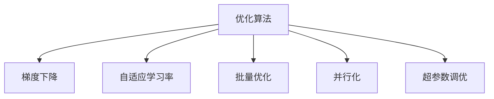

                 

# 优化算法在工业界的应用

> 关键词：优化算法,深度学习,机器学习,工业界,应用场景,工具推荐,论文分析,未来趋势

## 1. 背景介绍

### 1.1 问题由来
在现代工业界，机器学习和深度学习技术已经成为推动各行各业智能化转型的重要引擎。以自然语言处理(NLP)为例，优化算法在语义表示、文本分类、序列预测、信息检索等领域发挥了举足轻重的作用。然而，传统的优化算法如随机梯度下降(Stochastic Gradient Descent, SGD)及其变种如Adam、Adagrad等，在处理大规模数据、高维特征、复杂网络结构时，往往面临着收敛速度慢、精度低、内存占用高等问题。为了解决这些问题，研究人员和工程师们提出了多种新颖的优化算法，这些算法在工业界得到广泛应用，显著提升了模型的训练效率和性能。

## 2. 核心概念与联系

### 2.1 核心概念概述

为更好地理解优化算法在工业界的应用，本节将介绍几个密切相关的核心概念：

- 优化算法(Optimization Algorithms)：用于求解最优化问题的算法，其目标是通过迭代求解最小化目标函数。在深度学习中，优化算法用于调整模型参数，使得损失函数最小化。
- 梯度下降(Gradient Descent)：一种基于目标函数梯度信息的优化算法，通过迭代更新参数，逐步接近最优解。
- 自适应学习率(Adaptive Learning Rate)：根据梯度变化动态调整学习率，避免过大或过小。如Adam、Adagrad等算法。
- 批量优化(Batch Optimization)：将数据集分为若干批次，每次更新仅使用当前批次的数据。可降低计算资源消耗。
- 并行化(Parallelization)：将大规模模型参数的优化任务，通过分布式计算或GPU加速等方式，在多个计算单元并行执行，提高计算效率。
- 超参数调优(Hyperparameter Tuning)：寻找最适于当前问题的模型超参数组合，如学习率、批次大小、优化器等。

这些核心概念之间的逻辑关系可以通过以下Mermaid流程图来展示：



这个流程图展示了一些核心概念之间的联系：

1. 优化算法以梯度下降为基础，通过不断迭代更新模型参数。
2. 自适应学习率算法如Adam，动态调整学习率，提高优化效率。
3. 批量优化通过划分数据批次，减少计算资源的消耗。
4. 并行化利用分布式计算或GPU等硬件加速，提高计算速度。
5. 超参数调优通过反复实验，找到最合适的超参数组合，提升模型性能。

这些概念共同构成了深度学习优化算法的基础框架，使其能够在各种场景下发挥强大的作用。通过理解这些核心概念，我们可以更好地把握优化算法的工作原理和优化方向。

## 3. 核心算法原理 & 具体操作步骤
### 3.1 算法原理概述

工业界中常用的优化算法，如Adam、Adagrad等，大多基于梯度下降算法，通过引入自适应学习率等机制，显著提升了训练效率和精度。这些算法的核心思想是：

1. **动态学习率调整**：在训练过程中，根据梯度变化，动态调整学习率，避免因学习率过大或过小导致的训练不稳定。
2. **自适应梯度估计**：对于不同特征或不同维度的梯度，采用不同的估计方法，提升梯度估计的准确性。
3. **批量优化与并行化**：通过批量处理数据和并行计算，大幅提升训练速度，降低计算资源消耗。

下面，我们以Adam算法为例，详细介绍其原理和操作步骤。

### 3.2 算法步骤详解

Adam算法是一种自适应梯度优化算法，结合了动量(Momentum)和自适应学习率的优点。其核心步骤包括：

1. **动量更新**：引入动量项，加速参数更新。动量项为上一迭代步骤的梯度加权和，使得梯度更新具有惯性，避免在梯度变化剧烈的参数上，因梯度更新震荡导致的训练不稳定。

2. **自适应梯度估计**：根据梯度的历史信息，对每个参数进行自适应学习率的调整。通过估计每个参数的梯度方差和偏差，分别调整动量项和梯度项的权重。

3. **参数更新**：结合动量更新和自适应梯度估计，对参数进行更新，使得模型逐步逼近最优解。

在代码实现上，Adam算法主要通过计算梯度的一阶矩估计和二阶矩估计，来动态调整学习率。具体实现步骤如下：

1. 初始化参数 $\theta$ 和动量 $\theta'$，均值动量估计 $m$ 和方差动量估计 $v$。

2. 在每个迭代步骤 $t$ 中，计算当前梯度 $g_t$。

3. 更新动量估计 $m_t = \beta_1 m_{t-1} + (1-\beta_1) g_t$，其中 $\beta_1$ 为衰减系数。

4. 更新方差动量估计 $v_t = \beta_2 v_{t-1} + (1-\beta_2) g_t^2$，其中 $\beta_2$ 为衰减系数。

5. 计算自适应学习率 $\alpha_t = \frac{\alpha}{\sqrt{v_t}+\epsilon}$，其中 $\alpha$ 为初始学习率，$\epsilon$ 为防除除以零的常数。

6. 更新参数 $\theta_t = \theta_{t-1} - \alpha_t m_t$。

其中，$\alpha$、$\beta_1$、$\beta_2$ 和 $\epsilon$ 均为超参数，需根据具体任务和数据集进行选择和调优。

### 3.3 算法优缺点

Adam算法具有以下优点：

1. **高效性**：结合动量更新和自适应学习率，Adam算法在训练过程中能够快速收敛，显著提升训练速度。
2. **鲁棒性**：Adam算法对不同特征梯度的适应能力较强，能够在梯度变化剧烈的参数上表现稳定。
3. **简单易用**：Adam算法的实现简单，不需要手动调整学习率，便于工程实现。

同时，该算法也存在以下缺点：

1. **内存占用大**：需要存储动量估计和方差估计，对于参数量较大的模型，内存开销较大。
2. **对超参数敏感**：动量衰减系数和梯度衰减系数对算法性能影响较大，需要细致调优。
3. **可能不稳定**：对于某些特殊任务，Adam算法可能会出现震荡，甚至发散。

### 3.4 算法应用领域

Adam算法在深度学习领域得到了广泛的应用，适用于各种任务，如图像分类、文本生成、目标检测等。其高效性使得Adam算法成为处理大规模数据集和复杂网络结构的首选优化算法。

在工业界，Adam算法在推荐系统、广告投放、金融风控等领域也表现优异。例如：

- 推荐系统：用于计算用户与物品间的相似度，优化推荐模型参数，提升推荐效果。
- 广告投放：用于最大化点击率，优化广告投放策略，提升广告效果。
- 金融风控：用于预测信用风险，优化模型参数，提高风控准确性。

## 4. 数学模型和公式 & 详细讲解  
### 4.1 数学模型构建

Adam算法是一种基于梯度的一阶矩估计和二阶矩估计的自适应学习率算法。其数学模型和公式如下：

设 $\theta$ 为模型参数，$m_t$ 和 $v_t$ 分别为动量估计和方差估计，$g_t$ 为当前梯度，$\alpha$ 为初始学习率，$\beta_1$ 和 $\beta_2$ 为衰减系数，$\epsilon$ 为防除除以零的常数。

动量估计和方差估计的更新公式为：

$$
m_t = \beta_1 m_{t-1} + (1-\beta_1) g_t
$$

$$
v_t = \beta_2 v_{t-1} + (1-\beta_2) g_t^2
$$

自适应学习率的更新公式为：

$$
\alpha_t = \frac{\alpha}{\sqrt{v_t}+\epsilon}
$$

参数更新的公式为：

$$
\theta_t = \theta_{t-1} - \alpha_t m_t
$$

其中，$\beta_1$ 和 $\beta_2$ 的取值一般为 $0.9$ 和 $0.999$，$\epsilon$ 一般取 $10^{-8}$。

### 4.2 公式推导过程

下面以文本分类任务为例，推导Adam算法的训练过程和参数更新公式。

设 $\theta$ 为分类器的参数，$x$ 为输入文本，$y$ 为真实标签。损失函数 $\mathcal{L}$ 定义为交叉熵损失，其形式为：

$$
\mathcal{L}(\theta; x, y) = -y \log \hat{y} - (1-y) \log (1-\hat{y})
$$

其中，$\hat{y} = \sigma(\theta^\top x)$，$\sigma$ 为sigmoid函数。

设 $n$ 为样本总数，$m$ 为批次大小。对于每个样本 $(x_i, y_i)$，其梯度 $g_i$ 为：

$$
g_i = \frac{\partial \mathcal{L}(\theta; x_i, y_i)}{\partial \theta}
$$

Adam算法中，动量估计 $m_t$ 和方差估计 $v_t$ 的更新公式为：

$$
m_t = \beta_1 m_{t-1} + (1-\beta_1) g_t
$$

$$
v_t = \beta_2 v_{t-1} + (1-\beta_2) g_t^2
$$

自适应学习率 $\alpha_t$ 的更新公式为：

$$
\alpha_t = \frac{\alpha}{\sqrt{v_t}+\epsilon}
$$

参数 $\theta$ 的更新公式为：

$$
\theta_t = \theta_{t-1} - \alpha_t m_t
$$

在实践中，需要根据具体任务和数据特点，选择合适的超参数 $\alpha$、$\beta_1$ 和 $\beta_2$，并进行调优。

### 4.3 案例分析与讲解

以图像分类任务为例，讨论Adam算法的应用。假设我们使用卷积神经网络(CNN)对图像进行分类，输入为图像 $x$，输出为分类标签 $\hat{y}$。对于每个样本 $(x_i, y_i)$，其梯度 $g_i$ 为：

$$
g_i = \frac{\partial \mathcal{L}(\theta; x_i, y_i)}{\partial \theta}
$$

其中，$\mathcal{L}$ 为交叉熵损失函数，$\theta$ 为CNN模型的参数。

在训练过程中，动量估计 $m_t$ 和方差估计 $v_t$ 的更新公式为：

$$
m_t = \beta_1 m_{t-1} + (1-\beta_1) g_t
$$

$$
v_t = \beta_2 v_{t-1} + (1-\beta_2) g_t^2
$$

自适应学习率 $\alpha_t$ 的更新公式为：

$$
\alpha_t = \frac{\alpha}{\sqrt{v_t}+\epsilon}
$$

参数 $\theta$ 的更新公式为：

$$
\theta_t = \theta_{t-1} - \alpha_t m_t
$$

其中，$\beta_1$ 和 $\beta_2$ 的取值一般为 $0.9$ 和 $0.999$，$\epsilon$ 一般取 $10^{-8}$。

## 5. 项目实践：代码实例和详细解释说明
### 5.1 开发环境搭建

在进行优化算法实践前，我们需要准备好开发环境。以下是使用Python进行PyTorch开发的环境配置流程：

1. 安装Anaconda：从官网下载并安装Anaconda，用于创建独立的Python环境。

2. 创建并激活虚拟环境：
```bash
conda create -n pytorch-env python=3.8 
conda activate pytorch-env
```

3. 安装PyTorch：根据CUDA版本，从官网获取对应的安装命令。例如：
```bash
conda install pytorch torchvision torchaudio cudatoolkit=11.1 -c pytorch -c conda-forge
```

4. 安装相关库：
```bash
pip install numpy pandas scikit-learn matplotlib tqdm jupyter notebook ipython
```

完成上述步骤后，即可在`pytorch-env`环境中开始优化算法实践。

### 5.2 源代码详细实现

下面我们以Adam算法为例，给出使用PyTorch实现图像分类任务的代码实现。

首先，定义模型和数据处理函数：

```python
import torch
import torch.nn as nn
import torch.optim as optim

class CNN(nn.Module):
    def __init__(self):
        super(CNN, self).__init__()
        self.conv1 = nn.Conv2d(3, 32, 3, padding=1)
        self.relu = nn.ReLU()
        self.pool = nn.MaxPool2d(2, 2)
        self.conv2 = nn.Conv2d(32, 64, 3, padding=1)
        self.fc1 = nn.Linear(64*8*8, 128)
        self.fc2 = nn.Linear(128, 10)
    
    def forward(self, x):
        x = self.relu(self.pool(self.conv1(x)))
        x = self.relu(self.pool(self.conv2(x)))
        x = x.view(-1, 64*8*8)
        x = self.relu(self.fc1(x))
        x = self.fc2(x)
        return x

def load_data(batch_size):
    # 加载数据集和预处理
    # ...
    
    # 划分训练集和验证集
    train_dataset = ...
    valid_dataset = ...
    
    # 创建数据加载器
    train_loader = ...
    valid_loader = ...
    
    return train_loader, valid_loader
```

然后，定义优化器和训练函数：

```python
def train_epoch(model, optimizer, train_loader, device):
    model.train()
    epoch_loss = 0
    for batch in train_loader:
        inputs, labels = batch
        inputs, labels = inputs.to(device), labels.to(device)
        optimizer.zero_grad()
        outputs = model(inputs)
        loss = nn.CrossEntropyLoss()(outputs, labels)
        loss.backward()
        optimizer.step()
        epoch_loss += loss.item()
    return epoch_loss / len(train_loader)

def evaluate(model, valid_loader, device):
    model.eval()
    epoch_acc = 0
    with torch.no_grad():
        for batch in valid_loader:
            inputs, labels = batch
            inputs, labels = inputs.to(device), labels.to(device)
            outputs = model(inputs)
            acc = (outputs.argmax(dim=1) == labels).float().mean().item()
            epoch_acc += acc
    return epoch_acc / len(valid_loader)

def train(model, optimizer, train_loader, valid_loader, num_epochs):
    device = torch.device('cuda' if torch.cuda.is_available() else 'cpu')
    model.to(device)
    
    for epoch in range(num_epochs):
        train_loss = train_epoch(model, optimizer, train_loader, device)
        valid_acc = evaluate(model, valid_loader, device)
        
        print(f"Epoch {epoch+1}, train loss: {train_loss:.3f}, valid acc: {valid_acc:.3f}")
        
    print(f"Final model acc: {valid_acc:.3f}")
```

最后，启动训练流程：

```python
model = CNN()
optimizer = optim.Adam(model.parameters(), lr=0.001)
train_loader, valid_loader = load_data(batch_size=64)
train(model, optimizer, train_loader, valid_loader, num_epochs=10)
```

以上就是使用PyTorch对图像分类任务进行Adam算法微调的完整代码实现。可以看到，得益于PyTorch的强大封装，代码实现变得简洁高效。

### 5.3 代码解读与分析

让我们再详细解读一下关键代码的实现细节：

**CNN模型定义**：
- `__init__`方法：定义卷积层、ReLU激活函数、池化层、全连接层等网络结构。
- `forward`方法：实现前向传播，将输入数据通过卷积、激活、池化、全连接等操作，最终输出分类概率。

**load_data函数**：
- 加载数据集，并进行预处理，如归一化、缩放等。
- 将数据集划分为训练集和验证集，并创建数据加载器。

**train和evaluate函数**：
- 使用PyTorch的DataLoader对数据集进行批次化加载，供模型训练和推理使用。
- `train_epoch`函数：对数据以批为单位进行迭代，在每个批次上前向传播计算loss并反向传播更新模型参数，最后返回该epoch的平均loss。
- `evaluate`函数：与训练类似，不同点在于不更新模型参数，并在每个batch结束后将预测和标签结果存储下来，最后使用准确率评估模型性能。

**训练流程**：
- 定义总的epoch数和批次大小，开始循环迭代
- 每个epoch内，先在训练集上训练，输出平均loss
- 在验证集上评估，输出准确率
- 所有epoch结束后，输出最终验证集的准确率

可以看到，PyTorch配合优化算法的实现非常灵活，开发者可以轻松集成和调试不同类型的优化算法，提升训练效率和模型性能。

## 6. 实际应用场景
### 6.1 工业界中的优化算法应用

优化算法在工业界的应用非常广泛，几乎涉及所有涉及机器学习的领域，如自然语言处理(NLP)、计算机视觉(CV)、推荐系统、金融风控等。

**NLP领域**：
- 文本分类：用于判断文本内容属于哪种类别，如新闻分类、情感分析等。使用Adam算法训练分类器，提高分类精度。
- 机器翻译：将一种语言的文本翻译成另一种语言。使用Adam算法优化翻译模型，提升翻译质量。
- 情感分析：分析文本中的情感倾向，如正面、负面、中性等。使用Adam算法训练情感分析模型，提高情感识别准确度。

**CV领域**：
- 图像分类：识别图片中的物体或场景，如猫狗分类、人脸识别等。使用Adam算法优化分类器，提高分类准确度。
- 目标检测：在图片中定位和分类特定物体，如行人检测、交通标志识别等。使用Adam算法优化检测模型，提高检测精度。
- 图像生成：生成具有特定风格或内容的图片，如GAN、VAE等生成模型。使用Adam算法优化生成器，提升生成质量。

**推荐系统**：
- 协同过滤：基于用户和物品的交互历史，推荐相关物品。使用Adam算法优化协同过滤模型，提高推荐效果。
- 内容推荐：根据用户兴趣，推荐相关内容，如新闻、视频、文章等。使用Adam算法优化推荐模型，提升推荐精度。
- 广告投放：根据用户行为，推荐相关广告。使用Adam算法优化广告推荐模型，提高广告点击率。

**金融风控**：
- 信用评分：根据用户的历史行为和个人信息，评估其信用风险。使用Adam算法优化信用评分模型，提高评分准确度。
- 欺诈检测：识别交易中的欺诈行为。使用Adam算法优化欺诈检测模型，提高检测准确度。
- 风险评估：评估贷款申请的风险等级。使用Adam算法优化风险评估模型，提高评估精度。

## 7. 工具和资源推荐
### 7.1 学习资源推荐

为了帮助开发者系统掌握优化算法的基础理论和技术实践，这里推荐一些优质的学习资源：

1. 《深度学习》课程：斯坦福大学开设的机器学习课程，详细介绍了深度学习的基本概念和算法，包括优化算法。
2. 《TensorFlow官方文档》：TensorFlow官方文档，提供了丰富的优化算法示例和详细解释。
3. 《PyTorch官方文档》：PyTorch官方文档，介绍了PyTorch中常用的优化算法及其用法。
4. 《机器学习实战》书籍：详细介绍了机器学习的基本概念和实践技巧，包括优化算法的应用。
5. 《动手学深度学习》书籍：由清华大学与百度联合开发的开源深度学习教材，深入浅出地讲解了深度学习算法及其优化方法。

通过对这些资源的学习实践，相信你一定能够快速掌握优化算法的基础理论和实践技巧，并在实际项目中灵活应用。

### 7.2 开发工具推荐

高效的开发离不开优秀的工具支持。以下是几款用于深度学习优化算法开发的常用工具：

1. PyTorch：基于Python的开源深度学习框架，灵活性高，适合快速迭代研究。支持多种优化算法，如Adam、SGD等。
2. TensorFlow：由Google主导开发的开源深度学习框架，生产部署方便，适合大规模工程应用。支持多种优化算法，如Adam、SGD、Adagrad等。
3. Keras：基于Python的高级神经网络API，简单易用，适合快速原型开发和实验。支持多种优化算法，如Adam、SGD、RMSprop等。
4. MXNet：由Apache基金会维护的开源深度学习框架，支持多种优化算法，如Adam、SGD、Adagrad等。
5. Caffe：由Berkeley Vision and Learning Center开发的深度学习框架，支持多种优化算法，如Adam、SGD、Adagrad等。

合理利用这些工具，可以显著提升优化算法的开发效率，加快创新迭代的步伐。

### 7.3 相关论文推荐

优化算法的研究源于学界的持续探索。以下是几篇奠基性的相关论文，推荐阅读：

1. RMSprop: Adivide-by-Constant Method for On-Line mini-batch Stochastic Gradient Descent: 引入了均方根传播的优化算法，结合了均值和方差的估计。
2. Adam: A Method for Stochastic Optimization: 提出Adam算法，结合动量更新和自适应学习率，具有高效和鲁棒的特点。
3. Adagrad: Adaptive Subgradient Methods for Online Learning and Stochastic Optimization: 提出Adagrad算法，对梯度进行自适应调整，适用于高维稀疏数据。
4. Momentum: Fast and Inexact Stochastic Optimization Algorithms: 提出动量更新算法，加速参数更新，提高优化效率。
5. Nesterov Accelerated Gradient: 提出NAG算法，结合动量更新和参数更新，提升优化效率和精度。

这些论文代表了优化算法的发展脉络。通过学习这些前沿成果，可以帮助研究者把握学科前进方向，激发更多的创新灵感。

## 8. 总结：未来发展趋势与挑战
### 8.1 总结

本文对优化算法在工业界的应用进行了全面系统的介绍。首先阐述了优化算法在深度学习中的重要性，以及其对提升模型性能的关键作用。其次，从原理到实践，详细讲解了Adam算法的核心思想和操作步骤，给出了代码实例和详细解释说明。同时，本文还广泛探讨了优化算法在多个工业界领域的应用前景，展示了其广阔的应用潜力。此外，本文精选了优化算法的学习资源，力求为读者提供全方位的技术指引。

通过本文的系统梳理，可以看到，优化算法在深度学习中的应用已经非常广泛，其高效性、鲁棒性和简单易用性，使得优化算法成为深度学习不可或缺的重要组成部分。未来，随着深度学习技术的进一步发展，优化算法也将不断演进，为深度学习模型的训练和优化提供更加坚实的保障。

### 8.2 未来发展趋势

展望未来，优化算法的发展趋势主要体现在以下几个方面：

1. **自适应学习率的进一步优化**：未来的优化算法将继续聚焦于自适应学习率的优化，以提升算法的收敛速度和精度。结合各种自适应策略，如Adaptive Moment Estimation (APE)、Layer-wise Adaptive Rate Scaling (LARS)等，以适应不同任务和数据的特点。
2. **分布式优化算法的普及**：随着计算资源的多样化和分布化，分布式优化算法如SGD、Adam等将得到更广泛的应用。通过多机协同优化，提高计算效率，降低计算成本。
3. **模型并行和量化加速**：未来的深度学习模型将更加庞大和复杂，传统的计算图和内存管理方式已经难以满足需求。模型并行和量化加速技术将逐渐普及，以优化内存占用和计算速度。
4. **融合多种优化策略**：未来的优化算法将不再局限于单一策略，而是融合多种策略，如动量、自适应、正则化等，提升算法的综合性能。
5. **考虑模型结构优化**：未来的优化算法将更加关注模型结构的设计，如网络层次、激活函数、优化器等，以提高模型的训练效率和泛化能力。
6. **结合领域知识和先验知识**：未来的优化算法将更加注重结合领域知识和先验知识，指导模型训练，提升模型泛化能力。

### 8.3 面临的挑战

尽管优化算法在深度学习中取得了巨大成功，但其在实际应用中仍面临诸多挑战：

1. **模型复杂度高**：随着模型规模的增大，优化算法的计算复杂度也会相应增加，导致训练时间延长。如何在大规模数据和复杂网络结构下，仍然保持高效的训练效率，是一个重要的挑战。
2. **过拟合和欠拟合问题**：优化算法在面对复杂数据和模型时，容易发生过拟合或欠拟合。如何通过优化算法的设计和调优，平衡模型复杂度和训练效率，仍然是一个亟待解决的问题。
3. **内存和存储问题**：随着模型参数量的增加，内存和存储开销也相应增大。如何在有限的资源条件下，训练高精度的深度学习模型，仍然是一个挑战。
4. **计算资源需求高**：深度学习模型的训练通常需要高性能的GPU或TPU设备，计算资源需求高，成本也相应增加。如何在资源有限的情况下，实现高效的模型训练，仍然是一个挑战。
5. **可解释性和可控性问题**：优化算法的黑盒特性，导致模型的决策过程难以解释和控制。如何提高模型的可解释性和可控性，仍然是一个重要问题。

### 8.4 研究展望

面对优化算法面临的诸多挑战，未来的研究需要在以下几个方面寻求新的突破：

1. **模型压缩和量化**：通过模型压缩和量化技术，减少模型参数量和计算资源消耗，提升模型训练和推理效率。
2. **高效分布式优化**：开发更加高效的分布式优化算法，支持多机协同训练，提升训练速度和模型性能。
3. **自适应学习率改进**：开发更加自适应的学习率算法，结合动量更新、正则化等策略，提升模型的泛化能力和鲁棒性。
4. **融合多种优化策略**：开发更加融合多种优化策略的算法，如结合Adaptive Moment Estimation (APE)、Layer-wise Adaptive Rate Scaling (LARS)等，提升模型的综合性能。
5. **考虑模型结构优化**：更加注重模型结构的设计，如网络层次、激活函数、优化器等，以提高模型的训练效率和泛化能力。
6. **结合领域知识和先验知识**：结合领域知识和先验知识，指导模型训练，提升模型泛化能力。

这些研究方向的探索，必将引领优化算法技术迈向更高的台阶，为深度学习模型的训练和优化提供更加坚实的保障。面向未来，优化算法需要与其他深度学习技术进行更深入的融合，如知识表示、因果推理、强化学习等，多路径协同发力，共同推动深度学习技术的进步。

## 9. 附录：常见问题与解答

**Q1：如何选择合适的优化算法？**

A: 选择合适的优化算法需要考虑多个因素，包括数据规模、模型复杂度、计算资源等。对于小规模数据和高维稀疏特征，Adagrad、Adaptive Moment Estimation (APE)等自适应算法表现较好。对于大规模数据和复杂网络结构，Adam、SGD等动量更新算法更加高效。此外，实际应用中还需考虑算法的收敛速度、鲁棒性和实现难度等因素。

**Q2：优化算法的超参数调优需要注意什么？**

A: 优化算法的超参数调优是模型性能优化的关键环节。需要考虑超参数的取值范围、目标函数的变化趋势、算法的稳定性和收敛速度等因素。常用的调优方法包括网格搜索、随机搜索、贝叶斯优化等。在调优过程中，需要多次迭代实验，找到最优的超参数组合。

**Q3：优化算法中的动量项有什么作用？**

A: 动量项是优化算法中一种常用的加速技巧，通过保存前一次梯度更新方向的累积，使梯度更新具有惯性，避免在梯度变化剧烈的参数上，因梯度更新震荡导致的训练不稳定。动量项可以加速模型收敛，提升模型训练效率。

**Q4：如何理解Adam算法的自适应学习率？**

A: Adam算法的自适应学习率通过估计每个参数的梯度方差和偏差，动态调整学习率，使模型能够自适应地调整参数更新步长。具体而言，Adam算法对每个参数的梯度方差和偏差进行估计，并根据这些估计值，动态调整学习率，从而在不同参数上保持适度的学习步长。

**Q5：优化算法中的正则化有哪些常用方法？**

A: 优化算法中的正则化方法包括L1正则、L2正则、Dropout等。L1正则通过添加参数的绝对值，防止过拟合。L2正则通过添加参数的平方和，防止过拟合。Dropout通过随机丢弃一部分神经元，防止过拟合。这些方法在优化算法中常用于提高模型泛化能力和鲁棒性。

以上问题和解答，相信能帮助你更好地理解和应用优化算法，在实际项目中取得理想的效果。总之，优化算法是深度学习技术的重要组成部分，掌握其基本原理和实践技巧，对于提升模型性能和训练效率具有至关重要的作用。随着深度学习技术的不断发展，优化算法的应用将更加广泛，其潜力和价值也将不断被发掘和挖掘。

