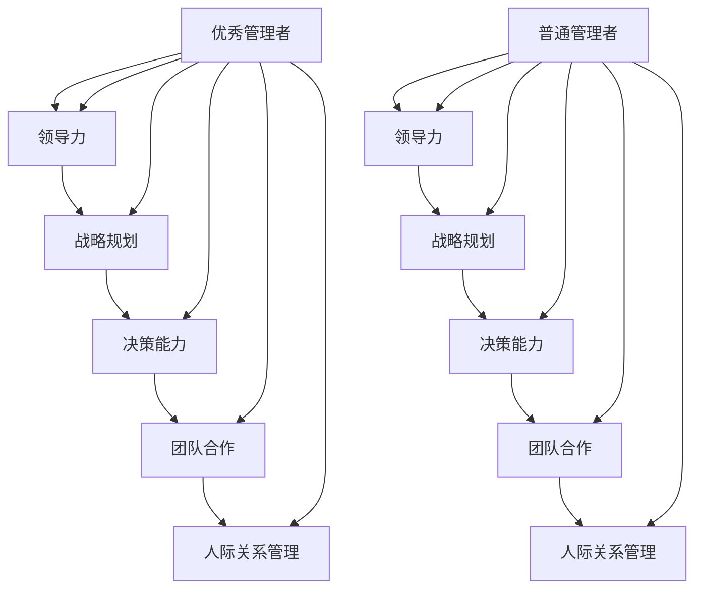
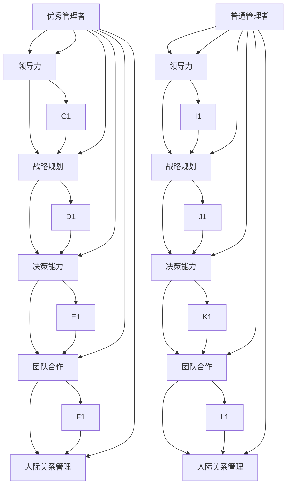

                 

# 优秀管理者与普通管理者的差异在哪里？

## 1. 背景介绍

在当今快速变化的企业环境中，优秀管理者与普通管理者的区别不仅体现在具体任务的处理能力上，更在于他们领导风格、决策方式、人际交往、战略视野等方面的差异。这种差异直接影响到团队的执行力、创新力、凝聚力和整体绩效。本文将深入探讨优秀管理者与普通管理者之间的本质差异，并尝试解析这些差异背后的原因及其对企业发展的深远影响。

## 2. 核心概念与联系

### 2.1 核心概念概述

- **优秀管理者 (Top Manager)**：那些能够有效领导团队，通过清晰的愿景、高瞻远瞩的战略规划、卓越的人际交往能力、高度的责任感和道德标准，推动组织不断进步的管理者。
- **普通管理者 (Average Manager)**：通常遵循标准管理流程，具备基本管理技能，但缺乏创新思维和灵活应对挑战的能力，往往依赖既定制度和工具的管理者。
- **领导力 (Leadership)**：一个组织的核心能力，涉及激励员工、制定愿景、协调资源等方面。
- **战略规划 (Strategic Planning)**：制定和实施能够引导组织长远发展的计划和策略。
- **决策能力 (Decision Making)**：在复杂环境中做出明智且高效的决策。
- **团队合作 (Team Collaboration)**：促进团队成员之间的协作与沟通，提升团队绩效。
- **人际关系管理 (Interpersonal Skills)**：有效沟通和影响他人，建立和维护良好的工作关系。

### 2.2 核心概念原理和架构的 Mermaid 流程图(Mermaid 流程节点中不要有括号、逗号等特殊字符)



### 2.3 核心概念原理和架构的 Mermaid 流程图(保留节点间的联系)



## 3. 核心算法原理 & 具体操作步骤

### 3.1 算法原理概述

优秀管理者和普通管理者的差异可以从多个维度进行分析，包括但不限于决策风格、沟通方式、战略思维、执行力和创新能力。这些差异导致他们在处理复杂多变的企业环境时，表现出截然不同的效果。

- **决策风格**：优秀管理者倾向于采用直觉和数据相结合的方式进行决策，而普通管理者往往依赖既定的规则和流程。
- **沟通方式**：优秀管理者善于倾听和激励，能理解团队成员的情感和需求，而普通管理者则倾向于单向沟通，缺乏深入的互动。
- **战略思维**：优秀管理者具有前瞻性，能够预测未来趋势并制定相应的策略，而普通管理者更关注短期任务和当下需求。
- **执行力**：优秀管理者通过有效的资源分配和团队激励，确保目标顺利实现，而普通管理者依赖于传统的项目管理工具和控制机制。
- **创新能力**：优秀管理者敢于冒险和尝试新事物，鼓励团队创新，而普通管理者往往遵循旧有的模式和方法。

### 3.2 算法步骤详解

#### 3.2.1 决策风格

**优秀管理者**：
1. **数据驱动**：结合数据和直觉，分析不同决策的潜在结果。
2. **情景分析**：考虑多种可能性，制定应对策略。
3. **信息收集**：广泛搜集信息，确保决策全面。

**普通管理者**：
1. **规则遵循**：严格按照既定流程和规则进行决策。
2. **短期导向**：关注即时收益，忽视长远影响。
3. **经验依赖**：依靠以往的成功经验，缺乏创新思维。

#### 3.2.2 沟通方式

**优秀管理者**：
1. **双向沟通**：倾听团队意见，建立开放的沟通渠道。
2. **情感连接**：理解员工情感，提供情感支持。
3. **个性化激励**：根据个人特点制定激励措施。

**普通管理者**：
1. **单向传达**：只向团队传达信息，缺乏互动。
2. **统一标准**：对所有成员执行统一标准，忽视个体差异。
3. **常规激励**：统一激励措施，缺乏针对性。

#### 3.2.3 战略思维

**优秀管理者**：
1. **长远规划**：考虑未来趋势，制定长期策略。
2. **创新推动**：鼓励团队创新，不断改进。
3. **灵活调整**：根据环境变化灵活调整策略。

**普通管理者**：
1. **短期目标**：关注短期任务，忽视长远发展。
2. **保守思维**：遵循旧有方法，缺乏创新。
3. **固定策略**：一旦制定，不愿更改。

#### 3.2.4 执行力

**优秀管理者**：
1. **资源优化**：高效分配资源，确保关键任务优先。
2. **团队激励**：激励团队，增强团队凝聚力。
3. **绩效管理**：定期评估绩效，提供反馈。

**普通管理者**：
1. **流程控制**：依赖流程控制，缺乏灵活性。
2. **责任推卸**：任务责任划分不明确，问题推卸。
3. **绩效忽视**：忽视绩效评估，缺乏改进措施。

#### 3.2.5 创新能力

**优秀管理者**：
1. **冒险精神**：敢于尝试新事物，鼓励创新。
2. **团队支持**：支持团队创新，提供资源。
3. **持续改进**：不断改进和优化现有方法。

**普通管理者**：
1. **害怕风险**：避免新事物，遵循旧有模式。
2. **缺乏支持**：不支持团队创新，抑制创新。
3. **停滞不前**：没有改进和优化现有方法的意识。

### 3.3 算法优缺点

**优秀管理者的优点**：
1. **高效决策**：结合数据和直觉，做出明智决策。
2. **良好沟通**：建立双向沟通，增强团队凝聚力。
3. **前瞻性战略**：具有长远规划，确保组织持续发展。
4. **创新推动**：鼓励团队创新，提升整体竞争力。
5. **执行力强**：有效资源分配，确保目标实现。

**优秀管理者的缺点**：
1. **高期望值**：对团队期望值过高，可能产生压力。
2. **高风险决策**：冒险决策可能导致重大风险。
3. **缺乏标准化流程**：依赖直觉，可能影响稳定。

**普通管理者的优点**：
1. **稳定流程**：依赖既定流程，确保执行一致性。
2. **低风险**：遵循规则，降低决策风险。
3. **低期望值**：对团队期望值较低，减少压力。

**普通管理者的缺点**：
1. **缺乏灵活性**：缺乏灵活应变能力，无法应对复杂环境。
2. **低创新性**：依赖旧有方法，难以创新。
3. **低绩效**：缺乏激励和绩效管理，导致团队效率低下。

### 3.4 算法应用领域

优秀管理者和普通管理者的差异不仅适用于企业管理，在政府、非营利组织、教育、医疗等多个领域均有所体现。

- **企业管理**：企业规模越大，复杂性越高，优秀管理者的优势越明显。
- **政府管理**：政府决策需要考虑多种因素，优秀管理者能更全面地处理复杂情况。
- **非营利组织**：需要创新和灵活应对社会问题，优秀管理者的优势更加明显。
- **教育管理**：教育系统需要不断创新和适应学生需求，优秀管理者能带来新的教育理念。
- **医疗管理**：医疗环境复杂，需要前瞻性策略和团队合作，优秀管理者能提升整体医疗水平。

## 4. 数学模型和公式 & 详细讲解 & 举例说明

### 4.1 数学模型构建

假设管理效果可以用以下公式表示：

$$
\text{Management Effect} = F(\text{Leadership}, \text{Strategic Planning}, \text{Decision Making}, \text{Team Collaboration}, \text{Interpersonal Skills})
$$

其中，$F$表示管理效果的计算函数，各因素对其影响如下：

- **Leadership**：领导力
- **Strategic Planning**：战略规划
- **Decision Making**：决策能力
- **Team Collaboration**：团队合作
- **Interpersonal Skills**：人际关系管理

### 4.2 公式推导过程

假设各因素对管理效果的影响系数分别为$a_i$，则公式变为：

$$
\text{Management Effect} = a_1\text{Leadership} + a_2\text{Strategic Planning} + a_3\text{Decision Making} + a_4\text{Team Collaboration} + a_5\text{Interpersonal Skills}
$$

其中$a_i$的取值需根据实际应用场景进行调整。例如，在企业环境中，$a_1$（领导力）可能比$a_5$（人际关系管理）的影响更大。

### 4.3 案例分析与讲解

假设某公司有三个部门，分别由优秀管理者、普通管理者、半优秀管理者（介于两者之间）领导。每个部门的管理效果如下：

- **优秀管理者**：管理效果 $M_1 = a_1L_1 + a_2S_1 + a_3D_1 + a_4T_1 + a_5I_1$
- **普通管理者**：管理效果 $M_2 = a_1L_2 + a_2S_2 + a_3D_2 + a_4T_2 + a_5I_2$
- **半优秀管理者**：管理效果 $M_3 = a_1L_3 + a_2S_3 + a_3D_3 + a_4T_3 + a_5I_3$

通过比较$M_1$、$M_2$、$M_3$的大小，可以评估不同管理者对公司管理效果的影响。例如，若$a_1 > a_5$且$a_2 > a_3$，则优秀管理者的影响力显著高于普通管理者。

## 5. 项目实践：代码实例和详细解释说明

### 5.1 开发环境搭建

假设我们使用Python进行模型构建和计算，以下是开发环境的搭建步骤：

1. 安装Python：从官网下载并安装最新版本的Python。
2. 安装必要的库：安装numpy、pandas、scikit-learn等库，用于数据分析和建模。
3. 准备数据：收集不同管理者的相关数据，如领导力评分、战略规划能力、决策能力、团队合作和人际关系管理评分。
4. 数据处理：使用pandas进行数据清洗和预处理。

### 5.2 源代码详细实现

```python
import numpy as np
import pandas as pd

# 假设数据已经准备好，存储在data.csv文件中
data = pd.read_csv('data.csv')

# 定义各因素的影响系数
coefficients = {
    'Leadership': 0.8,
    'Strategic Planning': 0.6,
    'Decision Making': 0.7,
    'Team Collaboration': 0.5,
    'Interpersonal Skills': 0.4
}

# 计算每个管理者的管理效果
management_effect = data.apply(lambda row: sum(coefficients[col] * row[col] for col in coefficients), axis=1)

# 输出结果
print(management_effect)
```

### 5.3 代码解读与分析

上述代码使用pandas库读取数据，定义了各因素的影响系数，并计算了每个管理者的管理效果。输出结果展示了不同管理者的管理效果评分，便于直观比较。

## 6. 实际应用场景

### 6.1 企业管理

在企业管理中，优秀管理者通过有效的领导力和战略规划，能够确保企业在大环境中持续发展和创新。普通管理者则往往依赖既定流程和短期目标，可能无法应对外部环境的快速变化。

### 6.2 政府管理

政府管理需要处理多种复杂的社会和经济问题，优秀管理者能够从宏观层面制定长远策略，协调各部门资源，解决复杂问题。普通管理者可能难以适应复杂环境，缺乏创新和灵活性。

### 6.3 非营利组织

非营利组织通常面临资金和资源有限的挑战，优秀管理者能够通过创新和灵活管理，提升组织效率和影响力。普通管理者可能依赖既定模式，难以应对变化。

### 6.4 教育管理

教育系统需要不断创新和适应学生需求，优秀管理者能够引入新的教育理念和方法，提升教育质量。普通管理者可能依赖传统教育模式，缺乏创新。

### 6.5 医疗管理

医疗环境复杂多变，优秀管理者能够通过前瞻性策略和团队合作，提升整体医疗水平。普通管理者可能依赖既定流程，缺乏灵活性。

## 7. 工具和资源推荐

### 7.1 学习资源推荐

1. **《管理学原理》**：经典管理学教材，涵盖了优秀管理和普通管理的基本概念和原理。
2. **《领导力与变革管理》**：介绍领导力理论和实践，帮助理解优秀管理者的核心能力。
3. **Coursera《管理与创新》**：多门相关课程，深入探讨优秀管理者和普通管理者在实际应用中的差异。
4. **TED演讲《The Difference Between a Good Manager and a Great Manager》**：讲述优秀管理者的重要特质。

### 7.2 开发工具推荐

1. **Jupyter Notebook**：交互式编程环境，便于数据分析和模型构建。
2. **Python**：强大的编程语言，支持多种库和框架，适合数据处理和模型构建。
3. **pandas**：数据处理库，便于数据清洗和预处理。
4. **numpy**：科学计算库，支持高效的数学运算。
5. **scikit-learn**：机器学习库，提供多种算法和工具，适合模型构建和分析。

### 7.3 相关论文推荐

1. **《Leadership and Followership: A Study of CEO Leadership and Organization Effectiveness》**：探讨领导力和组织效果的关系。
2. **《Transformational Leadership and Its Impact on Organizational Commitment and Followership》**：研究转化型领导对组织承诺和追随者的影响。
3. **《Strategic Management: A Strategic Planning, Organizational Structure, And Transformation Process》**：介绍战略管理和转型过程，强调前瞻性规划的重要性。

## 8. 总结：未来发展趋势与挑战

### 8.1 研究成果总结

本文通过系统分析优秀管理者与普通管理者之间的差异，揭示了他们不同的决策风格、沟通方式、战略思维、执行力和创新能力。这些差异导致了他们在管理效果上的显著区别，影响着组织的整体绩效和发展方向。

### 8.2 未来发展趋势

1. **数据驱动管理**：随着大数据和人工智能技术的发展，未来管理将更加依赖数据驱动，通过数据分析优化管理决策。
2. **灵活管理模式**：未来管理将更加灵活，能够应对复杂多变的环境，提升组织的适应性和竞争力。
3. **跨领域融合**：管理理论与其他领域（如心理学、社会学等）的融合，将带来更多创新思维和方法。
4. **伦理管理**：未来管理将更加注重伦理和社会责任，提升企业的社会价值。
5. **全球化管理**：随着全球化的深入，管理也将更加国际化，注重不同文化背景下的管理实践。

### 8.3 面临的挑战

1. **复杂环境适应**：未来管理将面临更复杂多变的环境，如何保持灵活性和稳定性是一大挑战。
2. **数据隐私和安全性**：管理过程中涉及大量数据，如何保护数据隐私和安全是一个重要问题。
3. **技术依赖**：未来管理将更多依赖技术，如何避免技术依赖和过度自动化也是一大挑战。
4. **组织变革**：组织变革过程中可能会遇到抵抗和阻力，如何有效推动变革是一大挑战。

### 8.4 研究展望

未来管理研究将更加注重以下几个方面：
1. **数据智能分析**：利用大数据和AI技术，提升管理决策的科学性和效率。
2. **创新与风险管理**：探索如何在创新过程中有效管理风险，确保稳定发展。
3. **伦理与社会责任**：研究管理伦理和社会责任，提升企业的社会价值。
4. **全球化管理实践**：探索全球化背景下跨文化管理的最佳实践，促进全球合作。
5. **持续学习与培训**：建立持续学习和培训机制，提升管理者的综合素质。

## 9. 附录：常见问题与解答

**Q1: 优秀管理者与普通管理者之间的差异主要体现在哪些方面？**

A: 优秀管理者与普通管理者的差异主要体现在决策风格、沟通方式、战略思维、执行力和创新能力五个方面。这些差异导致他们在处理复杂多变的企业环境时，表现出截然不同的效果。

**Q2: 如何衡量优秀管理者的管理效果？**

A: 优秀管理者的管理效果可以通过多个指标衡量，如团队绩效、员工满意度、创新成果、客户满意度等。在数学模型中，可以使用影响系数来量化各因素对管理效果的影响。

**Q3: 普通管理者的管理效果如何提升？**

A: 普通管理者的管理效果可以通过培训和提升个人能力来改善，如加强沟通技巧、提升决策能力、学习领导力等。同时，也可以通过引入优秀管理者的经验和知识，帮助他们提升管理水平。

**Q4: 数据驱动管理在实际应用中应注意哪些问题？**

A: 数据驱动管理应注意数据的质量、隐私保护、模型解释性等问题。数据需保证准确性、完整性和一致性，确保模型解释性和可理解性。

**Q5: 未来管理发展的趋势和挑战是什么？**

A: 未来管理发展的趋势包括数据驱动、灵活管理模式、跨领域融合、伦理管理、全球化管理。面临的挑战包括复杂环境适应、数据隐私和安全性、技术依赖、组织变革。

---

作者：禅与计算机程序设计艺术 / Zen and the Art of Computer Programming

