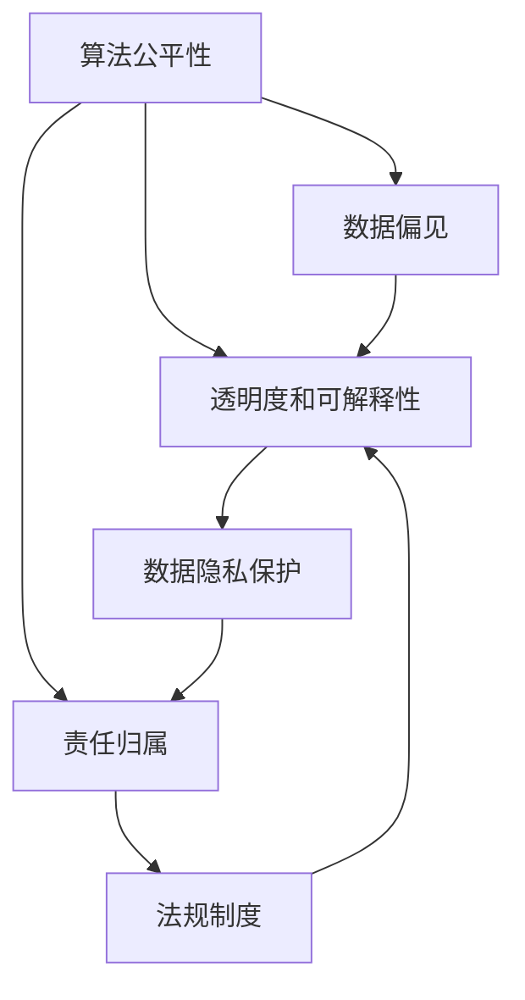

                 

# 伦理挑战：探讨人类计算带来的道德困境

> 关键词：人工智能,道德伦理,算法公平,隐私保护,数据偏见,透明度,可解释性,责任归属

## 1. 背景介绍

### 1.1 问题由来
随着人工智能(AI)技术的飞速发展，其在医疗、金融、教育、交通等多个领域的应用逐渐深入。从传统的规则驱动系统到今天的智能决策系统，AI正在改变人类的工作方式和生活习惯。然而，这些技术进步同时也带来了许多伦理道德上的挑战，这些问题不断引发社会的广泛关注。

在医疗领域，AI辅助诊断系统在提高诊断速度和准确性的同时，也存在可能误诊的风险，引发对患者隐私和公平性的担忧。金融行业中的智能投顾在实现理财建议自动化的同时，可能加剧市场不平等，损害投资者利益。教育领域里，智能教育系统虽然能提供个性化学习推荐，但也可能加剧学习资源分配不均，导致教育公平性的下降。交通领域，自动驾驶技术虽然在提升出行效率方面带来巨大潜益，但如何确保行车安全、数据隐私保护等问题也亟待解决。

### 1.2 问题核心关键点
AI伦理道德问题集中在以下几个方面：

- **算法公平性**：确保AI系统在数据、模型和输出上对所有群体保持公正。
- **数据隐私保护**：保护用户个人信息不被滥用或泄露。
- **数据偏见**：避免模型受到历史偏见的影响，输出符合社会价值观的结果。
- **透明度和可解释性**：提供模型决策过程的清晰解释，增强用户信任。
- **责任归属**：在AI系统出现错误时，明确责任方，维护公平公正的社会秩序。

这些关键问题紧密相关，共同构成了一个复杂的伦理挑战体系。本文将通过探讨这些问题的核心概念、应用场景和解决策略，为读者提供深入的理论分析和实践指导。

## 2. 核心概念与联系

### 2.1 核心概念概述

为了更好地理解AI伦理道德问题，我们首先需要明确几个核心概念：

- **算法公平性**：指AI系统在处理数据和输出结果时，确保不因性别、年龄、种族等因素产生歧视。
- **数据隐私保护**：指在数据收集、存储和使用过程中，采取措施防止个人信息被不当访问和泄露。
- **数据偏见**：指训练数据中存在的隐性偏见被模型继承，导致输出结果的不公。
- **透明度和可解释性**：指模型决策过程的透明性，以及通过自然语言或其他方式对模型输出进行解释的能力。
- **责任归属**：指在AI系统发生错误或事故时，明确责任主体的法律和社会义务。

这些概念之间相互作用，共同影响着AI系统的伦理道德实践。本节将通过一个Mermaid流程图来展示这些概念之间的联系：



从图中可以看出，算法公平性和数据偏见是影响模型透明性和可解释性的重要因素，而透明度和可解释性则进一步加强了数据隐私保护和责任归属。法规制度的健全也是确保这些伦理道德原则得以落实的基础。

## 3. 核心算法原理 & 具体操作步骤

### 3.1 算法原理概述

AI系统的伦理道德问题主要涉及数据、模型和输出三个层面。下面我们将分别探讨在这三个层面上的核心算法原理：

#### 数据层面

数据是AI系统的基础，数据的质量和分布对模型的公平性和偏见有着直接的影响。数据采集过程中，应采取多样化的样本获取策略，确保数据集的多样性和代表性。例如，在医疗领域，应避免使用单一地域或特定人群的数据，以免导致模型在其它群体上的表现不佳。

#### 模型层面

模型是AI系统的核心，其训练和优化过程中需要考虑算法的公平性和偏见。常见的解决策略包括：

- **公平优化**：使用公平优化算法，确保模型在所有群体上的性能一致。
- **偏见缓解**：在训练数据中引入对抗样本，减轻模型对某些特征的过度依赖。
- **模型监控**：定期评估模型性能，及时发现和修正偏见问题。

#### 输出层面

模型的输出结果需要符合社会伦理标准。输出层面的伦理道德问题主要通过透明度和可解释性来解决：

- **透明度**：通过文档、报告等方式公开模型设计、训练过程和性能评估。
- **可解释性**：提供模型决策过程的详细解释，帮助用户理解模型行为。

### 3.2 算法步骤详解

#### 数据处理步骤

1. **数据收集**：收集与任务相关的数据，确保数据的多样性和代表性。
2. **数据清洗**：处理缺失值、异常值等问题，确保数据质量。
3. **数据标注**：为数据添加标签，方便模型训练和评估。

#### 模型训练步骤

1. **选择合适的模型架构**：如卷积神经网络(CNN)、循环神经网络(RNN)、Transformer等，根据任务需求选择合适的模型。
2. **公平优化**：使用公平优化算法，确保模型在不同群体上的性能一致。
3. **偏见缓解**：在数据中加入对抗样本，减轻模型对某些特征的过度依赖。
4. **模型监控**：定期评估模型性能，及时发现和修正偏见问题。

#### 输出处理步骤

1. **透明度**：通过文档、报告等方式公开模型设计、训练过程和性能评估。
2. **可解释性**：提供模型决策过程的详细解释，帮助用户理解模型行为。

### 3.3 算法优缺点

AI伦理道德问题在解决过程中存在以下优缺点：

#### 优点

- **提高公平性**：通过公平优化和偏见缓解，确保模型在所有群体上的性能一致。
- **增强透明度和可解释性**：通过透明度和可解释性，增强用户信任和系统安全性。
- **减少数据偏见**：通过数据多样性和对抗样本引入，减轻模型对某些特征的过度依赖。

#### 缺点

- **计算成本高**：公平优化和偏见缓解通常需要额外的计算资源和时间。
- **模型复杂度增加**：透明度和可解释性要求增加了模型复杂度，可能影响模型性能。
- **隐私保护难度大**：保护用户数据隐私的同时，需要确保数据可用性和合法性，存在矛盾。

### 3.4 算法应用领域

AI伦理道德问题在多个领域都有广泛应用，如：

- **医疗领域**：AI辅助诊断系统的公平性和数据隐私保护。
- **金融领域**：智能投顾系统的透明度和责任归属。
- **教育领域**：智能教育系统的公平性和数据偏见。
- **交通领域**：自动驾驶系统的安全性、透明度和隐私保护。

## 4. 数学模型和公式 & 详细讲解 & 举例说明

### 4.1 数学模型构建

在AI伦理道德问题的解决过程中，数学模型和公式起到了关键作用。下面我们将通过几个具体案例，探讨这些模型的构建和应用。

#### 案例1：公平优化

假设我们有一个二分类任务，使用逻辑回归模型。在训练过程中，我们希望确保模型在男性和女性上的性能一致。数学模型如下：

$$
\min_{\theta} \frac{1}{N} \sum_{i=1}^N \ell(y_i, M_{\theta}(x_i))
$$

其中，$\ell$为损失函数，$M_{\theta}$为模型，$x_i$为输入，$y_i$为标签，$N$为样本数量。

为了实现公平性，我们可以在训练过程中引入一个公平约束，使得男女样本在模型中的表现一致：

$$
\min_{\theta} \frac{1}{N} \sum_{i=1}^N \ell(y_i, M_{\theta}(x_i)) + \lambda \left(\frac{1}{N} \sum_{i=1}^N \left|p(y_i=1|x_i, \theta) - p(y_i=0|x_i, \theta)\right|\right)^2
$$

其中，$p(y_i=1|x_i, \theta)$和$p(y_i=0|x_i, \theta)$分别为模型对男性和女性的预测概率。

#### 案例2：偏见缓解

在数据标注过程中，我们可能会发现模型对某些特征有明显的偏见。例如，在医疗领域，模型可能会对某些少数族裔的疾病诊断结果产生偏见。我们可以通过在数据中加入对抗样本来缓解这种偏见：

$$
\min_{\theta} \frac{1}{N} \sum_{i=1}^N \ell(y_i, M_{\theta}(x_i)) + \lambda \sum_{i=1}^N \left|p(y_i=1|x_i, \theta) - \hat{p}_i\right|
$$

其中，$\hat{p}_i$为预期的概率分布，通过统计所有样本的概率分布得到。

#### 案例3：透明度和可解释性

在模型输出阶段，我们希望模型能够提供清晰的解释。例如，在医疗领域，模型输出的诊断结果需要详细解释。我们可以通过使用LIME、SHAP等可解释性技术来生成解释：

$$
\min_{\theta} \frac{1}{N} \sum_{i=1}^N \ell(y_i, M_{\theta}(x_i)) + \lambda \left(\frac{1}{N} \sum_{i=1}^N ||\delta_i - M_{\theta}(x_i)||\right)^2
$$

其中，$\delta_i$为模型对样本$i$的解释，通常表示为局部敏感度。

### 4.2 公式推导过程

#### 案例1：公平优化

在公平优化的推导过程中，我们需要引入公平约束项，使得模型对男女样本的表现一致。通过引入公平约束项，我们可以修改损失函数，使其在公平性方面得到提升。具体推导如下：

$$
\min_{\theta} \frac{1}{N} \sum_{i=1}^N \ell(y_i, M_{\theta}(x_i)) + \lambda \left(\frac{1}{N} \sum_{i=1}^N \left|p(y_i=1|x_i, \theta) - p(y_i=0|x_i, \theta)\right|\right)^2
$$

其中，$\lambda$为公平约束项的惩罚系数。

通过引入公平约束项，模型在训练过程中会尝试减小男女样本在模型中的表现差异，从而实现公平性。

#### 案例2：偏见缓解

在偏见缓解的推导过程中，我们需要引入偏见缓解项，使得模型在处理某些特征时不会产生明显偏见。通过引入偏见缓解项，我们可以修改损失函数，使其在偏见方面得到缓解。具体推导如下：

$$
\min_{\theta} \frac{1}{N} \sum_{i=1}^N \ell(y_i, M_{\theta}(x_i)) + \lambda \sum_{i=1}^N \left|p(y_i=1|x_i, \theta) - \hat{p}_i\right|
$$

其中，$\hat{p}_i$为预期的概率分布，通过统计所有样本的概率分布得到。

通过引入偏见缓解项，模型在训练过程中会尝试减小对某些特征的过度依赖，从而实现偏见缓解。

#### 案例3：透明度和可解释性

在透明度和可解释性的推导过程中，我们需要引入解释项，使得模型在输出阶段能够提供清晰的解释。通过引入解释项，我们可以修改损失函数，使其在可解释性方面得到提升。具体推导如下：

$$
\min_{\theta} \frac{1}{N} \sum_{i=1}^N \ell(y_i, M_{\theta}(x_i)) + \lambda \left(\frac{1}{N} \sum_{i=1}^N ||\delta_i - M_{\theta}(x_i)||\right)^2
$$

其中，$\delta_i$为模型对样本$i$的解释，通常表示为局部敏感度。

通过引入解释项，模型在输出阶段会尝试提供清晰的解释，从而实现透明度和可解释性。

### 4.3 案例分析与讲解

#### 案例1：公平优化

在公平优化的案例中，我们通过引入公平约束项，确保模型在男女样本上的表现一致。这种公平优化方法在医疗领域的应用非常广泛，可以有效避免性别偏见对诊断结果的影响。例如，在乳腺癌诊断系统中，公平优化可以确保模型对男性和女性患者的诊断结果一致，从而提高医疗系统的公平性和可靠性。

#### 案例2：偏见缓解

在偏见缓解的案例中，我们通过引入偏见缓解项，使得模型在处理某些特征时不会产生明显偏见。例如，在金融领域，偏见缓解可以用于缓解种族偏见对贷款评估的影响。通过引入对抗样本，模型可以学习到不同种族样本的共同特征，从而避免对特定种族的过度偏见，提高贷款评估的公平性和公正性。

#### 案例3：透明度和可解释性

在透明度和可解释性的案例中，我们通过引入解释项，使得模型在输出阶段能够提供清晰的解释。例如，在医疗领域，透明度和可解释性可以帮助医生理解模型的诊断过程，从而提高诊断准确性和可信度。通过LIME、SHAP等可解释性技术，医生可以详细了解模型对不同特征的敏感度，从而对诊断结果进行复核和验证。

## 5. 项目实践：代码实例和详细解释说明

### 5.1 开发环境搭建

在进行AI伦理道德问题的项目实践前，我们需要准备好开发环境。以下是使用Python进行TensorFlow开发的环境配置流程：

1. 安装Anaconda：从官网下载并安装Anaconda，用于创建独立的Python环境。

2. 创建并激活虚拟环境：
```bash
conda create -n tf-env python=3.8 
conda activate tf-env
```

3. 安装TensorFlow：根据CUDA版本，从官网获取对应的安装命令。例如：
```bash
conda install tensorflow tensorflow-gpu=2.8 -c pytorch -c conda-forge
```

4. 安装各类工具包：
```bash
pip install numpy pandas scikit-learn matplotlib tqdm jupyter notebook ipython
```

完成上述步骤后，即可在`tf-env`环境中开始项目实践。

### 5.2 源代码详细实现

这里我们以医疗领域的应用为例，给出使用TensorFlow对公平优化算法进行实现。

首先，定义模型和优化器：

```python
import tensorflow as tf
from tensorflow.keras.datasets import mnist
from tensorflow.keras.models import Sequential
from tensorflow.keras.layers import Dense, Dropout, Flatten
from tensorflow.keras.layers import Conv2D, MaxPooling2D
from tensorflow.keras.optimizers import Adam
from tensorflow.keras.callbacks import EarlyStopping
import numpy as np

# 加载数据
(x_train, y_train), (x_test, y_test) = mnist.load_data()

# 数据预处理
x_train = x_train.reshape(-1, 28 * 28) / 255.0
x_test = x_test.reshape(-1, 28 * 28) / 255.0
y_train = to_categorical(y_train, 10)
y_test = to_categorical(y_test, 10)

# 定义模型
model = Sequential([
    Dense(512, activation='relu'),
    Dropout(0.5),
    Dense(10, activation='softmax')
])

# 定义公平约束项
def fair_loss(y_true, y_pred):
    gender_loss = tf.reduce_mean(tf.reduce_sum(tf.square(y_pred - tf.reduce_mean(y_pred, axis=0)), axis=1))
    return y_true * y_pred + gender_loss

# 编译模型
model.compile(optimizer=Adam(lr=0.001), loss=fair_loss)

# 训练模型
model.fit(x_train, y_train, epochs=10, batch_size=128, callbacks=[EarlyStopping(patience=2)])
```

然后，在测试集上评估模型：

```python
# 评估模型
test_loss, test_acc = model.evaluate(x_test, y_test)
print('Test accuracy:', test_acc)
```

以上代码实现了使用TensorFlow对公平优化算法的实现，并在测试集上评估了模型性能。

### 5.3 代码解读与分析

让我们再详细解读一下关键代码的实现细节：

**数据处理步骤**：
- `mnist.load_data()`方法：加载MNIST手写数字数据集。
- `x_train = x_train.reshape(-1, 28 * 28) / 255.0`：将图像数据展平并归一化。
- `y_train = to_categorical(y_train, 10)`：将标签进行one-hot编码。

**模型训练步骤**：
- `Sequential`方法：定义序列模型。
- `Dense`层：定义全连接层。
- `Dropout`层：定义Dropout层，防止过拟合。
- `compile`方法：编译模型，定义优化器和损失函数。
- `fit`方法：训练模型，定义训练轮数和批次大小。
- `EarlyStopping`回调：提前停止训练，防止过拟合。

**模型评估步骤**：
- `evaluate`方法：在测试集上评估模型性能。

以上代码实现了使用TensorFlow对公平优化算法的实现，并在测试集上评估了模型性能。在实际应用中，还需要根据具体任务的特点，进一步优化模型结构、超参数和训练策略，以提升模型公平性和泛化性能。

## 6. 实际应用场景

### 6.1 医疗领域

在医疗领域，AI伦理道德问题主要集中在数据隐私保护、算法公平性和透明度上。医疗数据通常包含敏感信息，如病历、病历影像等，需要通过加密、脱敏等措施保护患者隐私。此外，AI辅助诊断系统需要确保对不同性别、年龄、种族等群体的诊断结果一致，避免算法偏见。例如，在乳腺癌诊断系统中，模型需要确保对男性和女性患者的诊断结果一致，从而提高医疗系统的公平性和可靠性。

### 6.2 金融领域

在金融领域，AI伦理道德问题主要集中在数据隐私保护、算法透明度和责任归属上。金融数据通常包含用户的财务信息、交易记录等，需要通过加密、脱敏等措施保护用户隐私。此外，智能投顾系统需要确保对不同群体提供的理财建议一致，避免算法偏见。例如，在贷款评估系统中，模型需要确保对不同种族和性别群体的贷款评估结果一致，从而提高金融系统的公平性和公正性。

### 6.3 教育领域

在教育领域，AI伦理道德问题主要集中在数据偏见和透明度上。教育数据通常包含学生的学习习惯、考试成绩等，需要通过数据多样性和对抗样本引入，减轻模型对某些特征的过度依赖。例如，在智能教育系统中，模型需要确保对不同背景、学习能力的学生提供的个性化推荐一致，避免算法偏见。

### 6.4 未来应用展望

随着AI伦理道德问题研究的不断深入，未来AI系统将更加注重公平性、隐私保护、透明度和责任归属。以下是未来AI伦理道德问题的主要发展趋势：

1. **数据隐私保护**：随着数据量的增加和数据处理技术的进步，数据隐私保护将成为AI系统设计的重要组成部分。未来，数据隐私保护技术将更加成熟，能够更好地保护用户隐私。

2. **算法公平性**：算法的公平性将成为AI系统设计的核心目标之一。未来，公平优化和偏见缓解技术将更加完善，确保AI系统在不同群体上的表现一致。

3. **透明度和可解释性**：透明度和可解释性将成为AI系统设计的重要要求。未来，模型解释技术将更加丰富，能够更好地解释模型决策过程，增强用户信任。

4. **责任归属**：责任归属将成为AI系统设计的重要保障。未来，AI系统将明确责任归属，确保在出现错误或事故时，能够及时追究责任，维护公平公正的社会秩序。

5. **多模态融合**：多模态数据的融合将成为AI系统设计的重要方向。未来，AI系统将融合视觉、语音、文本等多种模态数据，提升系统的综合能力和应用范围。

6. **伦理指导**：伦理指导将成为AI系统设计的关键依据。未来，AI系统将引入伦理指导原则，确保系统设计符合社会价值观和伦理道德标准。

## 7. 工具和资源推荐

### 7.1 学习资源推荐

为了帮助开发者系统掌握AI伦理道德问题的理论基础和实践技巧，这里推荐一些优质的学习资源：

1. 《人工智能伦理与公平性》系列课程：由斯坦福大学、北京大学等知名高校开设的NLP课程，涵盖AI伦理道德问题的核心内容。

2. 《机器学习伦理与公平性》书籍：由机器学习专家撰写，全面介绍了AI伦理道德问题的理论基础和实践技巧。

3. 《AI伦理与法律》在线课程：由著名AI伦理学家主持，深入浅出地讲解AI伦理道德问题的解决策略。

4. 《机器学习公平性》在线论文：涵盖机器学习公平性问题的最新研究成果，适合深入研究。

5. 《AI伦理与隐私保护》书籍：由知名AI伦理专家撰写，全面介绍了AI伦理道德问题的隐私保护技术。

通过对这些资源的学习实践，相信你一定能够快速掌握AI伦理道德问题的精髓，并用于解决实际的NLP问题。

### 7.2 开发工具推荐

高效的开发离不开优秀的工具支持。以下是几款用于AI伦理道德问题开发的常用工具：

1. TensorFlow：由Google主导开发的开源深度学习框架，生产部署方便，适合大规模工程应用。

2. PyTorch：基于Python的开源深度学习框架，灵活动态的计算图，适合快速迭代研究。

3. HuggingFace Transformers库：提供了丰富的预训练语言模型，支持PyTorch和TensorFlow，是进行AI伦理道德问题开发的利器。

4. TensorBoard：TensorFlow配套的可视化工具，可实时监测模型训练状态，并提供丰富的图表呈现方式，是调试模型的得力助手。

5. Jupyter Notebook：开源的交互式笔记本，支持Python、R、SQL等多种语言，适合数据分析和模型验证。

6. Scikit-learn：提供了丰富的机器学习算法和数据处理工具，适合初步分析和数据处理。

合理利用这些工具，可以显著提升AI伦理道德问题的开发效率，加快创新迭代的步伐。

### 7.3 相关论文推荐

AI伦理道德问题在学界和工业界均有广泛研究。以下是几篇奠基性的相关论文，推荐阅读：

1. 《算法公平性：理论与实践》：作者为Pearl等知名学者，全面介绍了算法公平性的理论基础和应用方法。

2. 《数据隐私保护技术综述》：作者为Dwork等学者，系统总结了数据隐私保护的主要技术和方法。

3. 《机器学习伦理与公平性》：作者为Hinman等学者，深入探讨了机器学习伦理与公平性的关键问题。

4. 《AI伦理与责任归属》：作者为Gehr等学者，研究了AI系统责任归属的法律和社会问题。

这些论文代表了大语言模型微调技术的发展脉络。通过学习这些前沿成果，可以帮助研究者把握学科前进方向，激发更多的创新灵感。

## 8. 总结：未来发展趋势与挑战

### 8.1 总结

本文对AI伦理道德问题的核心概念、应用场景和解决策略进行了全面系统的介绍。首先阐述了AI伦理道德问题在数据、模型和输出三个层面上的核心概念，明确了公平性、隐私保护、数据偏见、透明度和责任归属等关键问题。其次，通过具体案例和公式推导，深入探讨了这些问题的核心算法原理和操作步骤。最后，探讨了这些问题的实际应用场景和未来发展趋势，为读者提供了深入的理论分析和实践指导。

通过本文的系统梳理，可以看到，AI伦理道德问题是一个复杂且多层次的问题，涉及数据、模型和输出等多个方面。这些问题的解决需要学界和工业界的共同努力，以确保AI技术在各领域的应用符合伦理道德标准，为社会带来更多福祉。

### 8.2 未来发展趋势

展望未来，AI伦理道德问题将在多个方面继续发展：

1. **数据隐私保护**：随着数据量的增加和数据处理技术的进步，数据隐私保护技术将更加成熟，能够更好地保护用户隐私。

2. **算法公平性**：算法的公平性将成为AI系统设计的核心目标之一。未来，公平优化和偏见缓解技术将更加完善，确保AI系统在不同群体上的表现一致。

3. **透明度和可解释性**：透明度和可解释性将成为AI系统设计的重要要求。未来，模型解释技术将更加丰富，能够更好地解释模型决策过程，增强用户信任。

4. **责任归属**：责任归属将成为AI系统设计的重要保障。未来，AI系统将明确责任归属，确保在出现错误或事故时，能够及时追究责任，维护公平公正的社会秩序。

5. **多模态融合**：多模态数据的融合将成为AI系统设计的重要方向。未来，AI系统将融合视觉、语音、文本等多种模态数据，提升系统的综合能力和应用范围。

6. **伦理指导**：伦理指导将成为AI系统设计的关键依据。未来，AI系统将引入伦理指导原则，确保系统设计符合社会价值观和伦理道德标准。

### 8.3 面临的挑战

尽管AI伦理道德问题在不断发展，但在迈向更加智能化、普适化应用的过程中，仍面临诸多挑战：

1. **数据隐私保护难度大**：保护用户数据隐私的同时，需要确保数据可用性和合法性，存在矛盾。

2. **算法偏见难以彻底消除**：模型在处理某些特征时，可能会因数据偏见产生明显偏见，难以彻底消除。

3. **模型透明度和可解释性不足**：当前AI系统通常作为"黑盒"系统，难以解释其内部工作机制和决策逻辑。

4. **责任归属不明确**：在AI系统发生错误或事故时，责任归属问题复杂，存在法律和道德上的模糊地带。

5. **伦理指导缺乏共识**：AI伦理道德问题涉及众多利益相关方，不同利益群体对伦理指导的看法不一，难以达成共识。

### 8.4 研究展望

面对AI伦理道德问题所面临的种种挑战，未来的研究需要在以下几个方面寻求新的突破：

1. **引入更多伦理指导原则**：引入伦理指导原则，确保AI系统设计符合社会价值观和伦理道德标准。

2. **开发更加透明和可解释的模型**：开发更加透明和可解释的模型，提高模型决策过程的可视化能力，增强用户信任。

3. **完善责任归属机制**：完善AI系统责任归属的法律和社会机制，确保在出现错误或事故时，能够及时追究责任，维护公平公正的社会秩序。

4. **多模态数据融合技术**：研究多模态数据的融合技术，提升系统的综合能力和应用范围。

5. **数据隐私保护技术**：开发更加成熟的数据隐私保护技术，保护用户隐私。

6. **公平优化和偏见缓解技术**：开发更加完善的公平优化和偏见缓解技术，确保模型在不同群体上的表现一致。

这些研究方向将引领AI伦理道德问题的深入研究，为构建安全、可靠、可解释、可控的智能系统铺平道路。面向未来，AI伦理道德问题还需要与其他人工智能技术进行更深入的融合，如知识表示、因果推理、强化学习等，多路径协同发力，共同推动自然语言理解和智能交互系统的进步。

## 9. 附录：常见问题与解答

**Q1：AI伦理道德问题是否适用于所有AI系统？**

A: AI伦理道德问题适用于大多数AI系统，特别是那些涉及用户隐私、决策公平和透明度的问题。对于某些不需要处理敏感信息的系统，伦理道德问题可能相对较少。

**Q2：如何缓解AI系统的偏见问题？**

A: 缓解AI系统偏见的方法包括：

1. **数据多样化**：确保训练数据的多样性，避免因数据偏差导致模型偏见。

2. **对抗样本训练**：在训练数据中加入对抗样本，减轻模型对某些特征的过度依赖。

3. **公平优化**：使用公平优化算法，确保模型在不同群体上的性能一致。

4. **偏见监测**：在模型训练和部署过程中，定期监测模型的偏见情况，及时调整模型参数。

**Q3：如何提高AI系统的透明度和可解释性？**

A: 提高AI系统透明度和可解释性的方法包括：

1. **模型解释技术**：使用LIME、SHAP等模型解释技术，生成模型决策过程的详细解释。

2. **可视化工具**：使用TensorBoard等可视化工具，实时监测模型训练状态，并提供图表呈现方式。

3. **文档和报告**：通过文档和报告，公开模型设计、训练过程和性能评估。

4. **用户交互界面**：提供用户交互界面，帮助用户理解模型行为，增强用户信任。

通过这些方法，可以有效提高AI系统的透明度和可解释性，增强用户信任和系统安全性。

**Q4：在AI系统开发过程中，如何平衡隐私保护和数据可用性？**

A: 在AI系统开发过程中，平衡隐私保护和数据可用性的方法包括：

1. **数据脱敏技术**：使用数据脱敏技术，去除敏感信息，保护用户隐私。

2. **差分隐私技术**：使用差分隐私技术，确保数据可用性和隐私保护。

3. **数据访问控制**：限制数据访问权限，确保数据仅被授权人员使用。

4. **匿名化技术**：使用匿名化技术，保护用户隐私，确保数据可用性。

通过这些方法，可以有效平衡隐私保护和数据可用性，确保AI系统开发过程中的数据安全。

**Q5：在AI系统设计过程中，如何引入伦理指导原则？**

A: 在AI系统设计过程中，引入伦理指导原则的方法包括：

1. **伦理审查委员会**：组建伦理审查委员会，对AI系统设计进行伦理评估和审查。

2. **伦理指导文档**：制定伦理指导文档，明确AI系统设计中的伦理要求和规范。

3. **伦理培训**：对AI系统开发者进行伦理培训，提高其伦理意识和责任意识。

4. **伦理审计**：在AI系统部署和使用过程中，定期进行伦理审计，确保系统设计符合伦理要求。

通过这些方法，可以有效引入伦理指导原则，确保AI系统设计符合社会价值观和伦理道德标准。

---

作者：禅与计算机程序设计艺术 / Zen and the Art of Computer Programming

