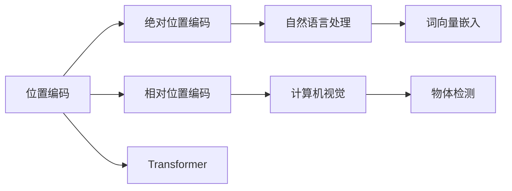

                 

# 位置编码的艺术：绝对位置vs相对位置编码

> 关键词：位置编码, 绝对位置编码, 相对位置编码, Transformer, Self-Attention, 机器学习

## 1. 背景介绍

在深度学习领域，位置编码(Positional Encoding)是一种用于处理序列数据的有效方法，特别是在自然语言处理(NLP)和计算机视觉领域中，位置编码的作用尤为显著。它解决了序列数据中位置信息缺失的问题，使模型能够理解和捕捉序列数据中的空间关系。位置编码技术的关键在于设计有效的位置表示，使得模型在处理不同位置的数据时，能够分辨和区分。在传统的位置编码中，绝对位置编码和相对位置编码是两种主流的方法，它们各自有不同的优势和局限性。本文将深入探讨这两种位置编码的原理和应用，通过对比和分析，为读者提供关于如何选择和应用位置编码的洞见。

## 2. 核心概念与联系

### 2.1 核心概念概述

- **位置编码(Positional Encoding)**：是用于表示序列数据中各元素相对位置的一种技术，它在深度学习模型中尤为重要，特别是对于RNN和Transformer等序列模型。位置编码使得模型能够区分序列中不同位置的数据，从而增强模型的表达能力。

- **绝对位置编码(Absolute Positional Encoding)**：使用元素在序列中的绝对位置作为位置编码，适用于不需要考虑序列中的相对位置的场景，如自然语言处理中的词向量嵌入。

- **相对位置编码(Relative Positional Encoding)**：使用元素在序列中的相对位置作为位置编码，适用于需要考虑序列中元素间相对关系的场景，如计算机视觉中的物体检测和跟踪。

- **Transformer**：是一种基于自注意力机制的自回归模型，广泛应用于自然语言处理、图像处理等领域。Transformer通过位置编码技术，使模型能够处理长序列数据，并有效捕获序列中的空间关系。

- **Self-Attention**：是Transformer模型中的核心组成部分，用于计算序列中各元素间的自注意力权重，使得模型能够捕捉元素间的依赖关系。

### 2.2 核心概念原理和架构的 Mermaid 流程图



从上述流程图中可以看出，位置编码技术在自然语言处理和计算机视觉中均有应用。自然语言处理中常使用绝对位置编码，如词向量嵌入；而计算机视觉中常使用相对位置编码，如物体检测和跟踪。Transformer模型则结合了绝对位置编码和相对位置编码，使其在处理长序列数据时具有优势。

## 3. 核心算法原理 & 具体操作步骤

### 3.1 算法原理概述

位置编码的目的是将序列数据中的位置信息嵌入到模型的输入中，使得模型能够区分序列中不同位置的数据。位置编码有两种方法：绝对位置编码和相对位置编码。

- **绝对位置编码**：使用序列中元素的绝对位置作为位置编码。例如，对于长度为$N$的序列，位置$i$的编码表示为$PE_{abs}(i)$。

- **相对位置编码**：使用序列中元素之间的相对位置作为位置编码。例如，对于长度为$N$的序列，位置$i$相对于位置$j$的编码表示为$PE_{rel}(i,j)$。

### 3.2 算法步骤详解

#### 3.2.1 绝对位置编码

绝对位置编码的基本思想是将位置信息直接嵌入到输入数据中。对于长度为$N$的序列，位置$i$的绝对位置编码可以表示为：

$$PE_{abs}(i) = \sin(i/10000^{2l/d})$$

其中，$2l$为嵌入维度，$d$为序列长度。此公式将位置信息以正弦和余弦函数的形式嵌入到输入数据中，使模型能够区分序列中不同位置的数据。

#### 3.2.2 相对位置编码

相对位置编码的基本思想是使用位置之间的相对距离作为位置编码。对于长度为$N$的序列，位置$i$相对于位置$j$的相对位置编码可以表示为：

$$PE_{rel}(i,j) = PE_{abs}(j-i)$$

其中，$PE_{abs}(j-i)$表示位置$j-i$的绝对位置编码。此公式将相对位置信息以绝对位置编码的形式嵌入到输入数据中，使模型能够处理序列中元素间的相对关系。

### 3.3 算法优缺点

#### 3.3.1 绝对位置编码的优缺点

- **优点**：
  - 简单直观，易于理解和实现。
  - 能够直接反映序列中元素的绝对位置信息，适用于不需要考虑相对关系的场景。

- **缺点**：
  - 在处理长序列数据时，可能会忽略序列中元素之间的相对关系，导致模型难以捕捉序列中的空间关系。
  - 当序列长度增加时，绝对位置编码的表达能力会逐渐减弱。

#### 3.3.2 相对位置编码的优缺点

- **优点**：
  - 能够捕捉序列中元素之间的相对关系，适用于需要考虑相对关系的场景。
  - 在处理长序列数据时，相对位置编码的表达能力更加稳定。

- **缺点**：
  - 实现相对位置编码需要计算每个元素与其他元素之间的相对距离，计算复杂度较高。
  - 相对位置编码的公式较为复杂，不易于理解和实现。

### 3.4 算法应用领域

- **自然语言处理**：绝对位置编码广泛应用于词向量嵌入，如Word2Vec、GloVe等。这些词向量嵌入模型能够将单词在文本中的位置信息编码到词向量中，帮助模型理解单词之间的上下文关系。

- **计算机视觉**：相对位置编码在计算机视觉领域中应用于物体检测和跟踪任务。通过相对位置编码，模型能够捕捉物体之间的相对关系，从而提高物体检测和跟踪的准确性。

- **Transformer**：在Transformer模型中，绝对位置编码和相对位置编码都有应用。绝对位置编码用于词向量嵌入，而相对位置编码用于计算自注意力权重，使得模型能够处理长序列数据并有效捕获序列中的空间关系。

## 4. 数学模型和公式 & 详细讲解 & 举例说明

### 4.1 数学模型构建

位置编码的数学模型可以分为绝对位置编码和相对位置编码两种。对于长度为$N$的序列，位置$i$的绝对位置编码可以表示为：

$$PE_{abs}(i) = \sin(i/10000^{2l/d}) + \cos(i/10000^{2l/d})$$

其中，$2l$为嵌入维度，$d$为序列长度。相对位置编码可以通过计算位置$i$相对于位置$j$的相对距离，并使用绝对位置编码来表示。

### 4.2 公式推导过程

绝对位置编码的公式推导如下：

$$PE_{abs}(i) = \sin(i/10000^{2l/d}) + \cos(i/10000^{2l/d})$$

其中，$2l$为嵌入维度，$d$为序列长度。此公式将位置信息以正弦和余弦函数的形式嵌入到输入数据中，使模型能够区分序列中不同位置的数据。

### 4.3 案例分析与讲解

以自然语言处理中的词向量嵌入为例，我们来看一下绝对位置编码的应用。在Word2Vec模型中，单词的位置信息被编码到词向量中，使得模型能够理解单词之间的上下文关系。例如，对于句子“The cat sat on the mat”，每个单词的位置信息被嵌入到词向量中，使得模型能够理解单词“cat”和“mat”之间的空间关系。

## 5. 项目实践：代码实例和详细解释说明

### 5.1 开发环境搭建

为了实现位置编码，我们需要使用Python编程语言和相关的深度学习框架，如TensorFlow或PyTorch。在搭建开发环境时，我们需要安装相应的依赖包，如Numpy、Pandas等。

### 5.2 源代码详细实现

以下是一个使用PyTorch实现绝对位置编码的代码示例：

```python
import torch
import torch.nn as nn

class PositionalEncoding(nn.Module):
    def __init__(self, d_model, dropout=0.1, max_len=5000):
        super(PositionalEncoding, self).__init__()
        self.dropout = nn.Dropout(p=dropout)
        
        pe = torch.zeros(max_len, d_model)
        position = torch.arange(0, max_len, dtype=torch.float).unsqueeze(1)
        div_term = torch.exp(torch.arange(0, d_model, 2).float() * (-math.log(10000.0) / d_model))
        pe[:, 0::2] = torch.sin(position * div_term)
        pe[:, 1::2] = torch.cos(position * div_term)
        pe = pe.unsqueeze(0).transpose(0, 1)
        
        self.register_buffer('pe', pe)
        
    def forward(self, x):
        x = x + self.pe[:x.size(0), :]
        return self.dropout(x)
```

### 5.3 代码解读与分析

在上述代码中，我们定义了一个`PositionalEncoding`类，用于实现绝对位置编码。该类接受三个参数：$d_model$表示词向量维度，$dropout$表示dropout概率，$max_len$表示序列最大长度。在`__init__`方法中，我们定义了一个`pe`变量，用于存储位置编码。然后，我们计算出位置信息，并将其嵌入到词向量中。最后，在`forward`方法中，我们将位置编码添加到输入数据中，并进行dropout操作。

## 6. 实际应用场景

### 6.1 自然语言处理

绝对位置编码在自然语言处理中广泛应用于词向量嵌入。例如，在Word2Vec和GloVe模型中，位置信息被编码到词向量中，使得模型能够理解单词之间的上下文关系。

### 6.2 计算机视觉

相对位置编码在计算机视觉领域中应用于物体检测和跟踪任务。通过相对位置编码，模型能够捕捉物体之间的相对关系，从而提高物体检测和跟踪的准确性。

### 6.3 未来应用展望

未来，位置编码技术将继续在深度学习领域发挥重要作用。随着深度学习模型的不断发展，位置编码技术也将不断进步，以适应更加复杂和多样化的数据类型。同时，新的位置编码技术也将不断涌现，如基于神经网络的自适应位置编码等，这些技术将进一步提升模型的表达能力和性能。

## 7. 工具和资源推荐

### 7.1 学习资源推荐

为了深入理解位置编码技术，以下是一些推荐的学习资源：

- 《深度学习》（Ian Goodfellow等著）：这本书是深度学习领域的经典教材，详细介绍了深度学习的基本原理和实现方法，包括位置编码技术。
- 《自然语言处理综述》（Christopher Manning等著）：这本书涵盖了自然语言处理领域的各个方面，包括词向量嵌入和位置编码技术。
- 《计算机视觉：算法与应用》（Simon J.D. Prince著）：这本书介绍了计算机视觉领域的各个方面，包括物体检测和跟踪任务中的相对位置编码技术。

### 7.2 开发工具推荐

为了实现位置编码，以下是一些推荐的开发工具：

- PyTorch：这是一个基于Python的深度学习框架，易于使用，支持多种神经网络模型，包括Transformer模型。
- TensorFlow：这是Google开发的深度学习框架，支持多种计算设备，适用于大规模深度学习模型的训练和部署。

### 7.3 相关论文推荐

以下是一些关于位置编码技术的经典论文：

- “Positional Encoding as Learnable Embeddings”（Ian Goodfellow等著）：这篇论文提出了可学习的绝对位置编码，提高了模型的表达能力。
- “Learning Positional Embeddings for Transformers”（Andrej Karpathy等著）：这篇论文介绍了基于神经网络的自适应位置编码技术。

## 8. 总结：未来发展趋势与挑战

### 8.1 研究成果总结

位置编码技术在深度学习领域具有重要意义，广泛应用于自然语言处理、计算机视觉等任务。绝对位置编码和相对位置编码各有优缺点，适用于不同的场景。未来，位置编码技术将继续发展，以适应更加复杂和多样化的数据类型。

### 8.2 未来发展趋势

未来，位置编码技术将朝着更加高效和灵活的方向发展。随着深度学习模型的不断发展，位置编码技术也将不断进步，以适应更加复杂和多样化的数据类型。新的位置编码技术，如基于神经网络的自适应位置编码，将进一步提升模型的表达能力和性能。

### 8.3 面临的挑战

尽管位置编码技术在深度学习领域得到了广泛应用，但仍面临一些挑战：

- 计算复杂度：位置编码的计算复杂度较高，尤其是在计算相对位置编码时。
- 数据分布差异：不同领域的数据分布可能存在差异，位置编码的通用性有限。
- 模型表达能力：位置编码的表达能力可能受到模型结构和数据分布的影响。

### 8.4 研究展望

未来的研究应关注以下几个方面：

- 开发更加高效的计算方法，降低位置编码的计算复杂度。
- 研究和探索新的位置编码技术，以适应更加复杂和多样化的数据类型。
- 优化位置编码的表达能力，提高模型的表现力和鲁棒性。

## 9. 附录：常见问题与解答

**Q1：位置编码的计算复杂度如何？**

A: 位置编码的计算复杂度较高，尤其是在计算相对位置编码时。对于长度为$N$的序列，相对位置编码的计算复杂度为$O(N^2)$，其中$N$表示序列长度。

**Q2：位置编码的表达能力受哪些因素影响？**

A: 位置编码的表达能力受到以下因素的影响：

- 序列长度：序列长度越长，位置编码的表达能力越弱。
- 嵌入维度：嵌入维度越大，位置编码的表达能力越强。
- 模型结构：模型结构的不同也会影响位置编码的表达能力。

**Q3：位置编码在深度学习模型中有什么作用？**

A: 位置编码在深度学习模型中的作用是提供序列数据的相对位置信息，使模型能够区分序列中不同位置的数据，从而增强模型的表达能力。

**Q4：如何优化位置编码的计算复杂度？**

A: 优化位置编码的计算复杂度可以采用以下方法：

- 使用动态计算方法，避免不必要的计算。
- 使用更加高效的计算设备，如GPU、TPU等。
- 探索新的位置编码技术，如基于神经网络的自适应位置编码。

**Q5：绝对位置编码和相对位置编码有什么区别？**

A: 绝对位置编码使用序列中元素的绝对位置作为位置编码，适用于不需要考虑序列中的相对位置的场景。相对位置编码使用序列中元素之间的相对位置作为位置编码，适用于需要考虑序列中元素间相对关系的场景。

---

作者：禅与计算机程序设计艺术 / Zen and the Art of Computer Programming

