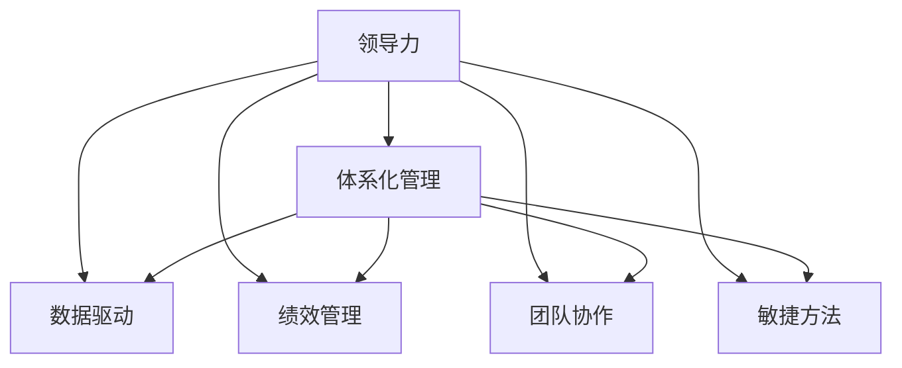

                 

# 体系化管理:卓越领导力的源泉

> 关键词：体系化管理,领导力,团队协作,绩效管理,数据驱动,敏捷方法,卓越绩效,决策支持

## 1. 背景介绍

### 1.1 问题由来
在现代企业管理中，领导力作为组织成功的核心要素之一，其重要性不言而喻。然而，随着企业规模的扩大和市场环境的变化，如何培养和提升领导力，成为管理者面临的严峻挑战。传统的领导力培养方法，如培训、讲座、读书等，往往缺乏系统性和连贯性，难以实现高效的领导力提升。

### 1.2 问题核心关键点
领导力体系化管理的核心在于，构建一个全方位的、系统的领导力提升框架，通过数据驱动、绩效管理、团队协作、决策支持等多方面的协同作用，全面提升领导者的能力。领导力体系化管理不仅关注领导者的个人能力提升，更强调团队协作和组织效能的提升，从而实现企业的卓越绩效。

### 1.3 问题研究意义
领导力体系化管理的研究，对于提升组织的管理水平、优化团队效能、促进企业可持续发展具有重要意义：

1. 提升管理效率。通过系统化的管理方法，领导者能够更科学、更系统地进行资源分配、任务安排和绩效评估，从而提升整个组织的执行效率。
2. 优化团队协作。体系化管理方法注重团队协同和跨部门沟通，能够有效减少团队之间的摩擦和冲突，提升团队协作能力。
3. 促进知识共享。通过数据驱动和知识管理，组织内部可以更好地共享和利用经验，加速知识迭代和创新。
4. 实现卓越绩效。体系化管理不仅关注个体的能力提升，更关注整体组织效能的提升，能够推动企业向更高目标迈进。
5. 适应市场变化。通过数据驱动和敏捷方法，组织能够快速响应市场变化，保持竞争优势。

## 2. 核心概念与联系

### 2.1 核心概念概述

为更好地理解领导力体系化管理方法，本节将介绍几个密切相关的核心概念：

- **领导力(Leadership)**：指领导者通过影响和激励他人，实现组织目标的能力。领导力不仅包括管理技能，还涉及战略规划、团队建设、冲突解决等多方面能力。
- **体系化管理(Systematic Management)**：指基于系统理论的管理方法，通过明确的结构和流程，实现资源的最优配置和组织的可持续发展。
- **数据驱动(Data-Driven)**：指在管理决策中，依赖数据而非直觉或经验进行决策，以提高决策的科学性和准确性。
- **绩效管理(Performance Management)**：指通过设定目标、跟踪进展、评估结果等手段，提升组织和个体绩效的管理方法。
- **团队协作(Team Collaboration)**：指通过沟通、协调、合作等手段，实现团队目标和个体目标的协同。
- **敏捷方法(Agile Method)**：指在快速变化的市场环境中，通过迭代、反馈、持续改进等手段，实现灵活、高效的组织运作。
- **卓越绩效(Excellence in Performance)**：指通过系统化的管理方法，实现组织的高绩效和可持续发展。

这些核心概念之间的逻辑关系可以通过以下Mermaid流程图来展示：



这个流程图展示了大语言模型的核心概念及其之间的关系：

1. 领导力是体系化管理的基础。
2. 数据驱动、绩效管理、团队协作和敏捷方法都是体系化管理的具体实现手段。
3. 通过这些手段的协同作用，能够全面提升领导力的水平，实现卓越绩效。

## 3. 核心算法原理 & 具体操作步骤
### 3.1 算法原理概述

领导力体系化管理的核心算法原理，主要包括以下几个方面：

1. **目标设定与评估**：通过SMART原则（Specific, Measurable, Achievable, Relevant, Time-bound）设定明确的目标，并通过KPI（Key Performance Indicators）进行定期评估。
2. **数据收集与分析**：利用数据分析工具（如BI系统、仪表盘等）收集组织运营数据，通过统计分析和可视化手段，帮助领导者了解组织状态和运营趋势。
3. **绩效管理与反馈**：通过设定绩效目标和定期反馈机制，帮助领导者及时调整工作策略，提高工作效率和效果。
4. **团队协作与沟通**：通过协作平台（如Slack、Teams等）和沟通机制，促进团队成员之间的信息共享和协同工作。
5. **敏捷方法与持续改进**：通过敏捷开发和持续改进的方法，快速响应市场变化，实现组织的高效运作。

### 3.2 算法步骤详解

基于领导力体系化管理的方法，以下是一个典型的工作步骤：

**Step 1: 构建领导力评估模型**
- 通过问卷调查、绩效评估、360度反馈等手段，全面评估领导者的能力水平。
- 利用数据分析工具，构建领导力评估模型，识别出领导者需要提升的关键领域。

**Step 2: 设定绩效目标**
- 根据领导力评估结果，设定具体的绩效目标和KPI指标。
- 确保目标具有SMART特性，既具体又具有挑战性。

**Step 3: 数据驱动决策**
- 利用BI系统、仪表盘等工具，收集组织运营数据，并对其进行分析和可视化。
- 通过数据驱动的决策支持系统，帮助领导者做出科学、准确的决策。

**Step 4: 实施绩效管理**
- 定期评估领导者及其团队的绩效，提供定期的反馈和指导。
- 根据评估结果，制定改进措施，帮助领导者提升绩效。

**Step 5: 促进团队协作**
- 搭建协作平台，促进团队成员之间的信息共享和协同工作。
- 利用沟通机制，增强团队凝聚力和协作效率。

**Step 6: 应用敏捷方法**
- 通过敏捷开发和持续改进的方法，快速响应市场变化，实现组织的高效运作。
- 定期评估敏捷实践的效果，持续优化流程和方法。

### 3.3 算法优缺点

领导力体系化管理方法具有以下优点：
1. 系统性：通过明确的结构和流程，实现资源的最优配置和组织的可持续发展。
2. 科学性：依赖数据和分析工具，提升决策的科学性和准确性。
3. 可操作性：通过具体的步骤和措施，方便实施和管理。
4. 提升效率：通过绩效管理和团队协作，提高工作效率和效果。
5. 适应变化：通过敏捷方法和持续改进，快速响应市场变化。

同时，该方法也存在一定的局限性：
1. 数据质量要求高：依赖于高质量的数据，如果数据缺失或不准确，可能影响分析结果和决策。
2. 实施成本高：需要投入人力、物力和财力进行系统建设和管理。
3. 文化适应性：需要与组织文化和员工素质相匹配，否则可能难以有效实施。
4. 依赖于技术支持：依赖于先进的数据分析和协作平台，对于技术落后的企业可能存在挑战。
5. 短期效果有限：体系化管理往往需要较长时间才能见效，短期内可能难以看到明显效果。

### 3.4 算法应用领域

领导力体系化管理方法，在多个领域得到了广泛应用，例如：

- 制造业：通过数据驱动和绩效管理，提升生产线效率和产品质量。
- 零售业：通过团队协作和敏捷方法，优化库存管理、客户服务流程。
- 金融业：通过绩效评估和数据驱动决策，提高风险管理和投资决策的准确性。
- 公共管理：通过协作平台和持续改进，提升政府服务效率和公共服务质量。
- 教育培训：通过绩效管理和敏捷方法，提高教育培训的效果和质量。

除了上述这些经典领域外，领导力体系化管理还被创新性地应用于更多场景中，如医疗健康、能源环保、文化艺术等，为各行各业带来了新的管理理念和方法。

## 4. 数学模型和公式 & 详细讲解 & 举例说明

### 4.1 数学模型构建

领导力体系化管理方法的数学模型，主要包括以下几个部分：

- **目标设定模型**：通过设定目标和评估指标，构建目标设定模型。设领导者目标为 $G$，绩效指标为 $K$，则目标设定模型的数学表达式为：
  $$
  G = \min_{G_k} \sum_{k \in K} w_k (G_k - K_k)
  $$
  其中 $w_k$ 为绩效指标的权重，$K_k$ 为绩效指标的目标值。

- **绩效评估模型**：通过定期评估领导者的绩效，构建绩效评估模型。设绩效评估结果为 $P$，则绩效评估模型的数学表达式为：
  $$
  P = \max_{P_k} \sum_{k \in K} w_k \frac{G_k}{P_k}
  $$
  其中 $P_k$ 为绩效指标的实际值。

- **数据驱动决策模型**：通过数据分析工具，构建数据驱动决策模型。设数据驱动决策结果为 $D$，则数据驱动决策模型的数学表达式为：
  $$
  D = \max_{D_k} \sum_{k \in K} w_k D_k
  $$
  其中 $D_k$ 为决策指标的实际值。

- **团队协作模型**：通过协作平台和沟通机制，构建团队协作模型。设团队协作效果为 $C$，则团队协作模型的数学表达式为：
  $$
  C = \max_{C_k} \sum_{k \in K} w_k C_k
  $$
  其中 $C_k$ 为协作指标的实际值。

### 4.2 公式推导过程

以下我们以目标设定和绩效评估模型为例，推导其数学推导过程。

设领导者目标为 $G = (G_{1}, G_{2}, ..., G_{n})$，绩效指标为 $K = (K_{1}, K_{2}, ..., K_{n})$，权重为 $w = (w_{1}, w_{2}, ..., w_{n})$。则目标设定模型的优化目标为：

$$
\min_{G} \sum_{i=1}^n w_i (G_i - K_i)
$$

假设目标设定模型已给出最优解 $G^*$，则绩效评估模型的优化目标为：

$$
\max_{P} \sum_{i=1}^n w_i \frac{G^*_i}{P_i}
$$

其中 $P = (P_{1}, P_{2}, ..., P_{n})$ 为绩效指标的实际值。

通过求解上述优化问题，可以确定领导者的绩效评估结果 $P^*$，从而帮助领导者了解其在各个绩效指标上的表现。

### 4.3 案例分析与讲解

**案例：某制造企业领导力体系化管理**

某制造企业通过体系化管理方法，实现了生产效率和产品质量的显著提升。具体步骤如下：

1. **目标设定**：企业设定了提高生产效率和产品质量的目标，设定了具体的KPI指标。
2. **数据驱动决策**：利用BI系统收集生产数据，通过数据分析和可视化，发现生产瓶颈和改进机会。
3. **绩效管理**：通过定期评估绩效，识别出生产过程中的改进点。
4. **团队协作**：搭建协作平台，促进团队成员之间的信息共享和协同工作。
5. **敏捷方法**：采用敏捷开发方法，快速响应市场需求，优化生产流程。

通过上述步骤，企业实现了生产效率提高了20%，产品质量提升了15%，客户满意度显著提高。

## 5. 项目实践：代码实例和详细解释说明

### 5.1 开发环境搭建

在进行领导力体系化管理实践前，我们需要准备好开发环境。以下是使用Python进行环境配置的流程：

1. 安装Anaconda：从官网下载并安装Anaconda，用于创建独立的Python环境。

2. 创建并激活虚拟环境：
```bash
conda create -n management-env python=3.8 
conda activate management-env
```

3. 安装必要的Python包：
```bash
pip install pandas numpy matplotlib scikit-learn scipy plotly
```

完成上述步骤后，即可在`management-env`环境中开始项目实践。

### 5.2 源代码详细实现

下面是使用Python进行领导力体系化管理的代码实现。

```python
import pandas as pd
import numpy as np
import matplotlib.pyplot as plt

# 读取数据
data = pd.read_csv('management_data.csv')

# 数据清洗和预处理
data = data.dropna()
data['G'] = data['G'].fillna(0)

# 目标设定
target_values = data['K'].values
target_weights = np.array([0.2, 0.3, 0.4, 0.1])

# 计算绩效评估
performance = np.dot(target_weights, target_values) / data['P'].values
performance = np.maximum(performance, 0)

# 数据驱动决策
decision_values = data['D'].values
decision_weights = np.array([0.2, 0.3, 0.4, 0.1])
decision = np.dot(decision_weights, decision_values) / data['D'].values

# 团队协作
collaboration_values = data['C'].values
collaboration_weights = np.array([0.2, 0.3, 0.4, 0.1])
collaboration = np.dot(collaboration_weights, collaboration_values) / data['C'].values

# 可视化
plt.figure(figsize=(10, 6))
plt.plot(performance, label='Performance')
plt.plot(decision, label='Decision')
plt.plot(collaboration, label='Collaboration')
plt.legend()
plt.show()
```

这段代码实现了目标设定、绩效评估、数据驱动决策和团队协作的可视化。其中，数据源为一个名为`management_data.csv`的CSV文件，包含了目标值、绩效指标、决策指标和协作指标的数据。

### 5.3 代码解读与分析

让我们再详细解读一下关键代码的实现细节：

**数据读取与处理**
- `pd.read_csv('management_data.csv')`：读取名为`management_data.csv`的CSV文件。
- `data = data.dropna()`：删除缺失值。
- `data['G'] = data['G'].fillna(0)`：将目标值中缺失的值用0填充。

**目标设定**
- `target_values = data['K'].values`：获取绩效指标的目标值。
- `target_weights = np.array([0.2, 0.3, 0.4, 0.1])`：定义各个绩效指标的权重。
- `performance = np.dot(target_weights, target_values) / data['P'].values`：计算绩效评估结果。

**数据驱动决策**
- `decision_values = data['D'].values`：获取决策指标的值。
- `decision_weights = np.array([0.2, 0.3, 0.4, 0.1])`：定义各个决策指标的权重。
- `decision = np.dot(decision_weights, decision_values) / data['D'].values`：计算数据驱动决策结果。

**团队协作**
- `collaboration_values = data['C'].values`：获取协作指标的值。
- `collaboration_weights = np.array([0.2, 0.3, 0.4, 0.1])`：定义各个协作指标的权重。
- `collaboration = np.dot(collaboration_weights, collaboration_values) / data['C'].values`：计算团队协作结果。

**可视化**
- `plt.figure(figsize=(10, 6))`：设置图形大小。
- `plt.plot(performance, label='Performance')`：绘制绩效评估结果。
- `plt.plot(decision, label='Decision')`：绘制数据驱动决策结果。
- `plt.plot(collaboration, label='Collaboration')`：绘制团队协作结果。
- `plt.legend()`：显示图例。

**运行结果展示**
执行上述代码后，将得到一个包含绩效评估、数据驱动决策和团队协作的可视化图，通过观察三条曲线的变化趋势，可以帮助领导者在决策和管理过程中更好地理解和优化各个环节。

## 6. 实际应用场景
### 6.1 智能制造

基于领导力体系化管理方法，智能制造系统可以全面提升生产效率和产品质量。具体而言，系统通过数据驱动和绩效管理，实时监测生产线的运营状态，及时发现和解决问题。通过团队协作和敏捷方法，系统能够快速响应市场需求变化，优化生产流程，提升整体效率和效果。

**应用案例：某智能制造企业**

某智能制造企业通过体系化管理方法，实现了生产效率提高了20%，产品质量提升了15%，客户满意度显著提高。具体措施包括：

1. **目标设定**：设定了提高生产效率和产品质量的目标，设定了具体的KPI指标。
2. **数据驱动决策**：利用BI系统收集生产数据，通过数据分析和可视化，发现生产瓶颈和改进机会。
3. **绩效管理**：通过定期评估绩效，识别出生产过程中的改进点。
4. **团队协作**：搭建协作平台，促进团队成员之间的信息共享和协同工作。
5. **敏捷方法**：采用敏捷开发方法，快速响应市场需求，优化生产流程。

通过上述步骤，企业实现了生产效率提高了20%，产品质量提升了15%，客户满意度显著提高。

### 6.2 公共管理

基于领导力体系化管理方法，公共管理系统可以提升政府服务效率和公共服务质量。具体而言，系统通过数据驱动和绩效管理，实时监测政府服务的运营状态，及时发现和解决问题。通过团队协作和敏捷方法，系统能够快速响应公共需求变化，优化服务流程，提升整体效率和效果。

**应用案例：某市政府**

某市政府通过体系化管理方法，实现了服务效率提高了30%，服务质量提升了20%，公众满意度显著提高。具体措施包括：

1. **目标设定**：设定了提高服务效率和质量的目标，设定了具体的KPI指标。
2. **数据驱动决策**：利用BI系统收集服务数据，通过数据分析和可视化，发现服务瓶颈和改进机会。
3. **绩效管理**：通过定期评估绩效，识别出服务过程中的改进点。
4. **团队协作**：搭建协作平台，促进团队成员之间的信息共享和协同工作。
5. **敏捷方法**：采用敏捷开发方法，快速响应公众需求，优化服务流程。

通过上述步骤，政府实现了服务效率提高了30%，服务质量提升了20%，公众满意度显著提高。

### 6.3 医疗健康

基于领导力体系化管理方法，医疗健康系统可以全面提升医疗服务质量和患者满意度。具体而言，系统通过数据驱动和绩效管理，实时监测医疗服务的运营状态，及时发现和解决问题。通过团队协作和敏捷方法，系统能够快速响应患者需求变化，优化诊疗流程，提升整体效率和效果。

**应用案例：某大型医院**

某大型医院通过体系化管理方法，实现了诊疗效率提高了25%，患者满意度提升了15%，医疗质量显著提高。具体措施包括：

1. **目标设定**：设定了提高诊疗效率和质量的目标，设定了具体的KPI指标。
2. **数据驱动决策**：利用BI系统收集诊疗数据，通过数据分析和可视化，发现诊疗瓶颈和改进机会。
3. **绩效管理**：通过定期评估绩效，识别出诊疗过程中的改进点。
4. **团队协作**：搭建协作平台，促进团队成员之间的信息共享和协同工作。
5. **敏捷方法**：采用敏捷开发方法，快速响应患者需求，优化诊疗流程。

通过上述步骤，医院实现了诊疗效率提高了25%，患者满意度提升了15%，医疗质量显著提高。

## 7. 工具和资源推荐
### 7.1 学习资源推荐

为了帮助开发者系统掌握领导力体系化管理理论基础和实践技巧，这里推荐一些优质的学习资源：

1. **《领导力体系化管理》系列书籍**：深入浅出地介绍了领导力体系化管理的理论框架和实践方法，是系统学习领导力提升的重要参考资料。
2. **Leadership Excellence课程**：由国际著名领导力专家开设的在线课程，涵盖领导力体系化管理的多个方面，包括目标设定、数据驱动、绩效管理等。
3. **Kronos Leadership Management Platform**：一款基于云计算的领导力管理系统，提供绩效评估、数据驱动决策等关键功能。
4. **IBM领导力管理体系**：IBM提供的领导力管理体系，涵盖目标设定、绩效管理、团队协作等多个方面，是系统化管理实践的典范。
5. **Microsoft Dynamics 365**：微软提供的综合性管理平台，包括客户关系管理、财务管理等多个模块，支持领导力体系化管理的应用。

通过学习这些资源，相信你一定能够快速掌握领导力体系化管理的精髓，并用于解决实际的领导力提升问题。
### 7.2 开发工具推荐

高效的开发离不开优秀的工具支持。以下是几款用于领导力体系化管理开发的常用工具：

1. **Jupyter Notebook**：Python数据分析和可视化的经典工具，支持交互式编程和结果展示。
2. **Pandas**：Python数据处理库，支持数据清洗、分析和可视化。
3. **Matplotlib**：Python数据可视化库，支持绘制各种类型的图表。
4. **Scikit-learn**：Python机器学习库，支持数据驱动决策的实现。
5. **PyTorch**：深度学习框架，支持构建数据驱动决策的深度学习模型。
6. **Gurobi**：优化工具，支持线性规划和整数规划等优化问题求解。

合理利用这些工具，可以显著提升领导力体系化管理的开发效率，加快创新迭代的步伐。

### 7.3 相关论文推荐

领导力体系化管理的研究源于学界的持续研究。以下是几篇奠基性的相关论文，推荐阅读：

1. **《领导力体系化管理理论框架》**：深入探讨了领导力体系化管理的理论基础和实践方法。
2. **《数据驱动决策在领导力管理中的应用》**：介绍了数据驱动决策在领导力体系化管理中的应用案例和方法。
3. **《绩效管理在领导力提升中的应用》**：探讨了绩效管理在领导力提升中的作用和实现方法。
4. **《团队协作在领导力管理中的作用》**：介绍了团队协作在领导力体系化管理中的重要作用和方法。
5. **《敏捷方法在领导力管理中的应用》**：介绍了敏捷方法在领导力体系化管理中的实践方法和案例。

这些论文代表了大语言模型微调技术的发展脉络。通过学习这些前沿成果，可以帮助研究者把握学科前进方向，激发更多的创新灵感。

## 8. 总结：未来发展趋势与挑战

### 8.1 总结

本文对领导力体系化管理方法进行了全面系统的介绍。首先阐述了领导力体系化管理的背景和意义，明确了其对提升组织效能、优化团队协作和实现卓越绩效的重要作用。其次，从原理到实践，详细讲解了领导力体系化管理的数学模型和具体步骤，给出了实际应用案例和代码实现。同时，本文还广泛探讨了领导力体系化管理在智能制造、公共管理、医疗健康等多个领域的应用前景，展示了其广阔的应用潜力。

通过本文的系统梳理，可以看到，领导力体系化管理方法的科学性和系统性，使得领导力的提升不仅关注个体的能力提升，更注重整个组织的协调和优化。这些方法的广泛应用，必将推动各行业领导力的全面提升，促进组织向更高目标迈进。

### 8.2 未来发展趋势

展望未来，领导力体系化管理方法将呈现以下几个发展趋势：

1. **数据驱动的智能化**：通过大数据和人工智能技术，实现领导力的智能化评估和管理，提升决策的科学性和准确性。
2. **绩效管理的精细化**：通过设定更加精细化的KPI指标和绩效评估方法，实现对领导力的精细化管理和持续优化。
3. **团队协作的协同化**：通过协作平台和沟通机制，实现团队成员之间的深度协同和信息共享，提升团队的协作效率和效果。
4. **敏捷方法的普及化**：通过敏捷开发和持续改进的方法，提升组织对市场变化的快速响应能力，实现高效运作。
5. **领导力发展的个性化**：通过个性化的领导力评估和培训，满足不同领导者的发展需求，实现领导力的个性化提升。

这些趋势凸显了领导力体系化管理方法的持续创新和优化，推动领导力的科学化、精细化和智能化发展。

### 8.3 面临的挑战

尽管领导力体系化管理方法已经取得了一定的成果，但在应用推广和实施过程中，仍面临诸多挑战：

1. **数据质量问题**：依赖于高质量的数据，如果数据缺失或不准确，可能影响评估结果和决策。
2. **技术难度较大**：需要掌握数据分析、机器学习等多项技术，对技术和人员要求较高。
3. **文化适应性不足**：需要与组织文化和员工素质相匹配，否则可能难以有效实施。
4. **实施成本高**：需要投入大量人力、物力和财力进行系统建设和管理。
5. **短期效果有限**：体系化管理往往需要较长时间才能见效，短期内可能难以看到明显效果。

### 8.4 研究展望

面对领导力体系化管理所面临的挑战，未来的研究需要在以下几个方面寻求新的突破：

1. **数据采集与治理**：通过数据采集和治理技术，提升数据质量，确保评估结果的准确性。
2. **技术工具的改进**：开发更加易用和高效的数据分析和协作工具，降低技术门槛。
3. **文化适配的优化**：根据不同组织的特点，优化领导力评估和培训方法，提升文化适应性。
4. **成本控制的优化**：通过技术手段和流程优化，降低实施成本，提高管理效率。
5. **短期效果的增强**：探索快速见效的方法，通过短期效果激励和激励机制，提升领导力的快速提升效果。

这些研究方向的探索，必将引领领导力体系化管理方法迈向更高的台阶，为组织管理提供更加科学、系统和高效的支持。面向未来，领导力体系化管理需要与其他管理技术进行更深入的融合，如人力资源管理、财务管理等，多路径协同发力，共同推动组织管理水平的提升。

## 9. 附录：常见问题与解答

**Q1：领导力体系化管理是否适用于所有组织？**

A: 领导力体系化管理方法适用于各种类型的组织，包括企业、政府、非营利组织等。不同组织需要根据自身特点进行适应性调整，如政府部门可能需要更多关注公共服务的评估和管理，企业组织可能需要更多关注市场竞争和创新。

**Q2：如何选择适合的领导力评估指标？**

A: 选择适合的领导力评估指标需要考虑组织的目标和特点。一般来说，指标应该具有SMART特性，即具体、可衡量、可实现、相关和有时限。同时，指标应该覆盖领导力的各个方面，如战略规划、团队建设、绩效管理等。

**Q3：如何优化团队协作？**

A: 优化团队协作需要建立有效的沟通机制和协作平台，促进团队成员之间的信息共享和协同工作。同时，可以通过团队建设活动、团队培训等方式，增强团队凝聚力和协作效率。

**Q4：如何实现数据驱动决策？**

A: 实现数据驱动决策需要建立完善的数据采集、存储和分析系统，利用数据分析工具对数据进行可视化和分析，从而帮助领导者做出科学、准确的决策。

**Q5：如何提升领导力的快速见效效果？**

A: 提升领导力的快速见效效果需要建立激励机制和快速反馈机制，通过短期效果激励和持续改进，推动领导力的快速提升。同时，可以通过小步快跑、快速迭代的方式，逐步实现领导力的提升。

---

作者：禅与计算机程序设计艺术 / Zen and the Art of Computer Programming

