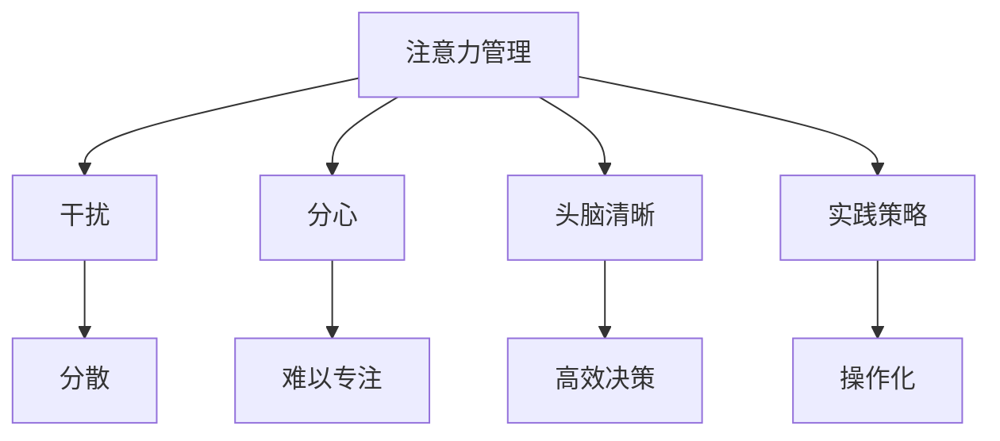

                 

# 信息时代的注意力管理实践与策略：在干扰和分心中保持头脑清晰

> 关键词：信息时代,注意力管理,干扰分心,头脑清晰,实践策略

## 1. 背景介绍

### 1.1 问题由来

随着信息时代的到来，人们每天面对的信息量和信息来源激增。从智能手机、社交媒体到各种线上应用，不断有新消息、新资讯涌现，从而分散了人们的注意力，导致工作、学习和生活的效率和质量受到严重影响。这种干扰和分心现象，不仅影响了个体的生产力，也阻碍了社会的整体进步。

### 1.2 问题核心关键点

在信息时代，注意力管理成为一种重要的个人和社会技能。如何在信息泛滥的环境中，有效管理自己的注意力，保持头脑清晰，提高工作效率和质量，成为了许多人面临的挑战。因此，研究如何实践和策略性地管理注意力，在干扰和分心中保持头脑清晰，具有重要的理论和实际意义。

### 1.3 问题研究意义

解决注意力管理问题，对于提升个体的生产力和生活质量，优化社会整体的运作效率，具有重要价值。它不仅能帮助个人在纷扰的信息环境中保持专注，还能推动组织和社会的效率提升。通过研究注意力管理的实践和策略，我们可以找到更有效的方法，来应对信息时代带来的挑战，构建更加高效、有序的社会。

## 2. 核心概念与联系

### 2.1 核心概念概述

为更好地理解注意力管理及其策略，本节将介绍几个密切相关的核心概念：

- 注意力管理(Attention Management)：指在信息过载的环境中，通过有意识地分配、调节注意力资源，以提高工作、学习和生活效率的过程。
- 干扰(Interference)：指外界环境中各种干扰因素，如噪音、多任务、消息提醒等，导致注意力分散的现象。
- 分心(Distractibility)：指个体在面对多重刺激时，难以维持长时间专注，容易从一个任务转移到另一个任务。
- 头脑清晰(Cognitive Clarity)：指在注意力管理良好的情况下，能够清晰地思考、决策和执行任务的能力。
- 实践策略(Practical Strategies)：指具体、可操作的方法和技巧，帮助个体在信息时代有效地管理注意力。

这些核心概念之间的逻辑关系可以通过以下Mermaid流程图来展示：



这个流程图展示了几大核心概念及其之间的关系：

1. 注意力管理通过有意识地分配和调节注意力，帮助个体在干扰和分心中保持头脑清晰。
2. 干扰和分心是注意力管理的挑战，需要通过策略和实践来克服。
3. 头脑清晰是注意力管理的目标，需要通过有效的实践策略来实现。
4. 实践策略是实现注意力管理的具体方法，帮助个体在信息时代有效管理注意力。

## 3. 核心算法原理 & 具体操作步骤

### 3.1 算法原理概述

注意力管理实践的核心在于，通过有意识地识别、评估和调节干扰和分心因素，采用合适的策略，以保持头脑清晰。形式化地，可以将其表示为：

$$
\max_{A} \text{Cognitive Clarity}(A) \text{subject to} \min_{I,D} \text{Interference}(I) \text{and} \text{Distractibility}(D)
$$

其中，$A$表示注意力管理策略，$\text{Cognitive Clarity}(A)$表示通过策略$A$达到的头脑清晰程度，$\text{Interference}(I)$和$\text{Distractibility}(D)$分别表示通过策略$A$减少的干扰和分心程度。

### 3.2 算法步骤详解

基于上述原理，注意力管理实践的步骤主要包括：

**Step 1: 识别和评估干扰和分心源**
- 列出工作、学习或生活中常见的干扰源，如手机通知、社交媒体、同事打扰等。
- 评估每种干扰源对注意力的影响程度和频率。

**Step 2: 制定策略应对干扰和分心**
- 对每种干扰源，制定针对性的策略，如关闭手机通知、设定专注时间、使用抗干扰工具等。
- 确定优先级，先处理对注意力影响最大的干扰源。

**Step 3: 实施注意力管理策略**
- 按照制定的策略，逐步实施注意力管理计划。
- 定期评估策略的效果，调整策略以适应新的情况。

**Step 4: 定期反思和调整**
- 定期回顾注意力管理策略的效果，进行反思和总结。
- 根据反思结果，调整和优化注意力管理策略。

### 3.3 算法优缺点

注意力管理实践的优点包括：

1. 提高效率：通过有意识地管理注意力，个体能够更高效地完成任务，提升生产力。
2. 减少压力：减少干扰和分心，有助于缓解工作和学习压力，保持心理健康。
3. 增强决策：头脑清晰有助于做出更加准确和合理的决策，避免错误。

然而，这种实践也存在一定的局限性：

1. 需要自律：注意力管理依赖个体的自律和执行力，对于自我控制能力较差的人可能效果不佳。
2. 可能不适应变化：外界环境的变化可能使得某些策略失效，需要不断调整和优化。
3. 复杂性：多任务环境下，策略的制定和实施可能变得复杂，需要仔细规划。

### 3.4 算法应用领域

注意力管理实践在多个领域都有广泛的应用，例如：

- 职场工作：通过减少会议干扰、关闭手机通知等策略，提高工作效率。
- 学习教育：通过设定专注时间、使用学习辅助工具等策略，提升学习效果。
- 家庭生活：通过设定家庭规则、限制娱乐时间等策略，改善家庭氛围。
- 在线协作：通过使用抗干扰工具、设定工作时间等策略，提升远程协作效率。

此外，注意力管理实践还可以应用于个人健康管理、情绪调节等多个领域，帮助个体在复杂多变的环境中保持心理健康和高效运作。

## 4. 数学模型和公式 & 详细讲解 & 举例说明

### 4.1 数学模型构建

本节将使用数学语言对注意力管理的实践过程进行严格的刻画。

假设个体每天有$T$个时间单位，需要完成$n$项任务。设任务$j$的完成时间需要$t_j$个时间单位，其中$j=1,2,\dots,n$。任务$j$的干扰程度为$d_j$，分心程度为$s_j$。

定义个体在任务$j$上能够分配的注意力为$a_j$，满足$a_j \geq 0$，且$\sum_{j=1}^n a_j = T$。个体的头脑清晰度$C$可以表示为：

$$
C = \sum_{j=1}^n \frac{a_j}{t_j}
$$

个体的干扰和分心程度可以表示为：

$$
I = \sum_{j=1}^n d_j a_j
$$

$$
D = \sum_{j=1}^n s_j a_j
$$

个体注意力管理的目标是最小化干扰和分心，最大化头脑清晰度。因此，优化问题可以表示为：

$$
\max_{a} \sum_{j=1}^n \frac{a_j}{t_j} \text{subject to} \sum_{j=1}^n a_j = T \text{and} a_j \geq 0
$$

$$
\min_{a} \sum_{j=1}^n d_j a_j \text{and} \sum_{j=1}^n s_j a_j
$$

### 4.2 公式推导过程

为了简化问题，我们先考虑在只有一个任务时的情形。设该任务需要$t$个时间单位，干扰和分心程度分别为$d$和$s$，个体分配的注意力为$a$。

头脑清晰度$C$和干扰程度$I$的表达式分别为：

$$
C = \frac{a}{t}
$$

$$
I = d a
$$

目标函数和约束条件可以表示为：

$$
\max_{a} \frac{a}{t} \text{subject to} a = T \text{and} a \geq 0
$$

$$
\min_{a} d a
$$

首先，我们可以简化约束条件：$a = T$。目标函数变为：

$$
\max_{a} \frac{T}{t}
$$

这是一个简单的优化问题，最优解为$a = T$，此时头脑清晰度$C = 1$。

接下来，考虑约束条件$a \geq 0$。目标函数变为：

$$
\max_{a} \frac{T}{t} - d a
$$

使用拉格朗日乘子法，构造拉格朗日函数：

$$
L(a, \lambda) = \frac{T}{t} - d a + \lambda (a - T)
$$

对$a$和$\lambda$求偏导数，得：

$$
\frac{\partial L}{\partial a} = -d + \lambda = 0
$$

$$
\frac{\partial L}{\partial \lambda} = a - T = 0
$$

解得：

$$
a = \frac{T}{d}
$$

此时，头脑清晰度为：

$$
C = \frac{\frac{T}{d}}{t} = \frac{T}{d t}
$$

干扰程度为：

$$
I = d \cdot \frac{T}{d} = T
$$

这个结果表明，在只有一个任务且干扰程度$d$固定的情况下，分配的注意力$a$应该尽可能地大，以最大化头脑清晰度。

### 4.3 案例分析与讲解

假设个体每天有8小时工作时间，需要完成两项任务：邮件处理和代码编写。邮件处理需要1小时，代码编写需要7小时。邮件处理的干扰和分心程度为1，代码编写的干扰和分心程度为0.5。

个体需要分配的注意力$a_1$和$a_2$需要满足：

$$
a_1 + a_2 = 8
$$

头脑清晰度$C$可以表示为：

$$
C = \frac{a_1}{1} + \frac{a_2}{7}
$$

干扰程度$I$可以表示为：

$$
I = a_1
$$

分心程度$D$可以表示为：

$$
D = a_2 \cdot 0.5
$$

个体注意力管理的优化问题为：

$$
\max_{a_1, a_2} \frac{a_1}{1} + \frac{a_2}{7} \text{subject to} a_1 + a_2 = 8
$$

$$
\min_{a_1, a_2} a_1 \text{and} a_2 \cdot 0.5
$$

使用上述推导方法，我们可以得到最优解为$a_1 = 4$，$a_2 = 4$。此时，头脑清晰度为：

$$
C = \frac{4}{1} + \frac{4}{7} = 4.57
$$

干扰程度为：

$$
I = 4
$$

分心程度为：

$$
D = 4 \cdot 0.5 = 2
$$

可以看到，通过合理分配注意力，个体可以在干扰和分心最小的情况下，获得较高的头脑清晰度。

## 5. 项目实践：代码实例和详细解释说明

### 5.1 开发环境搭建

在进行注意力管理实践的代码实现前，我们需要准备好开发环境。以下是使用Python进行PyTorch开发的环境配置流程：

1. 安装Anaconda：从官网下载并安装Anaconda，用于创建独立的Python环境。

2. 创建并激活虚拟环境：
```bash
conda create -n pytorch-env python=3.8 
conda activate pytorch-env
```

3. 安装PyTorch：根据CUDA版本，从官网获取对应的安装命令。例如：
```bash
conda install pytorch torchvision torchaudio cudatoolkit=11.1 -c pytorch -c conda-forge
```

4. 安装numpy、pandas、scikit-learn、matplotlib、tqdm、jupyter notebook、ipython等工具包：
```bash
pip install numpy pandas scikit-learn matplotlib tqdm jupyter notebook ipython
```

完成上述步骤后，即可在`pytorch-env`环境中开始注意力管理实践的代码实现。

### 5.2 源代码详细实现

这里我们以一个简单的注意力管理模型为例，使用PyTorch实现注意力分配的优化。

首先，定义注意力管理模型：

```python
import torch
from torch import nn

class AttentionModel(nn.Module):
    def __init__(self, tasks, time_units):
        super(AttentionModel, self).__init__()
        self.tasks = tasks
        self.time_units = time_units
        
        # 初始化注意力分配向量
        self.attention = torch.zeros(len(tasks))
        
    def forward(self):
        # 计算头脑清晰度
        clarity = sum([self.attention[i] / self.tasks[i] for i in range(len(self.tasks))])
        
        # 计算干扰和分心程度
        interference = sum([self.attention[i] * self.tasks[i] for i in range(len(self.tasks))]
        distraction = sum([self.attention[i] * self.tasks[i] * 0.5 for i in range(len(self.tasks))])
        
        return clarity, interference, distraction
```

然后，定义优化算法：

```python
from scipy.optimize import minimize

def optimize_attention(tasks, time_units):
    # 构建注意力模型
    model = AttentionModel(tasks, time_units)
    
    # 定义目标函数
    def objective(x):
        attention = x.copy()
        clarity, interference, distraction = model(attention)
        return -clarity
    
    # 定义约束条件
    constraints = {'type': 'eq', 'fun': lambda x: sum(x) - time_units}
    bounds = [(0, time_units) for _ in range(len(tasks))]
    
    # 求解优化问题
    result = minimize(objective, torch.randn(len(tasks)), constraints=constraints, bounds=bounds, method='SLSQP')
    
    return result.x, result.fun, result.success
```

接着，使用示例数据进行优化：

```python
tasks = [1, 7]
time_units = 8
attention, fun, success = optimize_attention(tasks, time_units)
print(attention, fun)
```

以上就是使用PyTorch实现注意力分配优化的完整代码。可以看到，通过定义模型和优化算法，我们能够系统地计算出最优的注意力分配策略。

### 5.3 代码解读与分析

让我们再详细解读一下关键代码的实现细节：

**AttentionModel类**：
- `__init__`方法：初始化任务和总时间单位。
- `forward`方法：计算头脑清晰度、干扰和分心程度的表达式。

**optimize_attention函数**：
- 创建AttentionModel实例，并定义目标函数、约束条件和边界。
- 使用scipy的minimize方法求解优化问题。
- 返回最优的注意力分配向量、目标函数值和优化成功标志。

**示例数据**：
- `tasks`列表：任务需要的时间单位。
- `time_units`变量：总时间单位。

**输出结果**：
- `attention`变量：最优的注意力分配向量。
- `fun`变量：目标函数值，即头脑清晰度。

可以看到，通过优化算法，我们可以找到最优的注意力分配策略，最大化头脑清晰度，最小化干扰和分心程度。

## 6. 实际应用场景

### 6.1 智能日程管理

智能日程管理工具可以帮助用户合理规划和分配时间，以提高工作效率和生活质量。用户可以通过输入任务、预估时间、干扰和分心程度等信息，自动生成最优的时间分配方案，确保头脑清晰，高效完成任务。

### 6.2 在线教育平台

在线教育平台可以基于用户的学习习惯和注意力管理策略，提供个性化的学习计划和推荐。平台可以通过收集用户的注意力管理数据，分析其学习行为，自动调整课程安排，优化学习效果。

### 6.3 健康管理应用

健康管理应用可以结合用户的注意力管理策略，提供科学的健康建议和行为指导。例如，对于需要长时间集中注意力进行工作或学习的用户，应用可以提醒其适时休息，避免过度疲劳。

### 6.4 未来应用展望

随着注意力管理技术的不断发展，它将在更多领域得到应用，为人类认知智能的提升带来新的可能性。

在智慧城市治理中，注意力管理技术可以用于优化城市管理资源配置，提高决策效率。在企业人力资源管理中，可以通过分析员工的注意力管理数据，优化工作流程和员工福利，提升企业竞争力。

未来，随着对个体认知过程的深入理解，注意力管理技术还将拓展到更多的应用场景，如智能家居、智能交通、智能健康等，为人们提供更加个性化、智能化的服务。

## 7. 工具和资源推荐

### 7.1 学习资源推荐

为了帮助开发者系统掌握注意力管理技术的理论基础和实践技巧，这里推荐一些优质的学习资源：

1. 《注意力机制在深度学习中的应用》系列博文：由深度学习专家撰写，系统介绍了注意力机制的基本原理和应用场景。

2. 《深度学习与认知神经科学》课程：斯坦福大学开设的深度学习与认知科学交叉课程，深入探讨深度学习对人类认知的影响。

3. 《注意力模型与认知科学》书籍：详细介绍注意力模型在认知科学中的应用，帮助读者理解注意力机制的心理学基础。

4. Coursera的注意力机制课程：通过具体案例，展示如何应用注意力机制解决深度学习中的问题。

5. 《深度学习实践指南》书籍：提供深度学习实践的全面指导，包括注意力机制的实现细节和优化技巧。

通过这些资源的学习，相信你一定能够全面掌握注意力管理技术的原理和实践，并将其应用于解决实际问题。

### 7.2 开发工具推荐

高效的开发离不开优秀的工具支持。以下是几款用于注意力管理开发的常用工具：

1. PyTorch：基于Python的开源深度学习框架，灵活性高，支持自动微分和动态图计算，适合进行复杂优化问题的求解。

2. TensorFlow：由Google主导开发的开源深度学习框架，生产部署方便，支持静态图和动态图计算，适合大规模工程应用。

3. scikit-learn：Python的机器学习库，提供多种优化算法和约束条件的求解器，方便进行复杂的数学优化。

4. SciPy：Python的科学计算库，提供丰富的数学和科学计算函数，方便进行复杂数学公式的推导和计算。

5. Jupyter Notebook：交互式编程环境，支持多种语言和库的集成，方便进行数据分析和可视化。

6. TensorBoard：TensorFlow配套的可视化工具，实时监测模型的训练状态，提供丰富的图表呈现方式。

合理利用这些工具，可以显著提升注意力管理开发的效率，加快创新迭代的步伐。

### 7.3 相关论文推荐

注意力管理技术的发展源于学界的持续研究。以下是几篇奠基性的相关论文，推荐阅读：

1. 《注意力机制在神经网络中的应用》（Attention is All You Need）：提出了Transformer结构，开启了深度学习领域的注意力机制时代。

2. 《注意力机制的数学原理》（The Mathematical Foundations of Attention）：系统介绍了注意力机制的数学原理和应用场景，提供了深度学习的理论基础。

3. 《注意力机制在NLP中的应用》（Attention is All You Need for NLP）：展示了注意力机制在自然语言处理中的应用，提升了NLP任务的性能。

4. 《自监督学习的注意力机制》（Self-supervised Attention Mechanism）：提出自监督学习中的注意力机制，提升了模型对无标签数据的利用能力。

5. 《注意力机制的优缺点》（Pros and Cons of Attention Mechanisms）：对不同的注意力机制进行了比较分析，提供了优缺点和应用场景的指导。

这些论文代表了大语言模型微调技术的发展脉络。通过学习这些前沿成果，可以帮助研究者把握学科前进方向，激发更多的创新灵感。

## 8. 总结：未来发展趋势与挑战

### 8.1 总结

本文对注意力管理技术的实践和策略进行了全面系统的介绍。首先阐述了注意力管理技术在信息时代的重要性和应用背景，明确了注意力管理在提升个体生产力和生活质量中的关键作用。其次，从原理到实践，详细讲解了注意力管理的目标、约束条件和优化方法，提供了具体的数学模型和案例分析。同时，本文还探讨了注意力管理技术在多个实际应用场景中的应用前景，展示了其在提升社会效率和增进人类福祉方面的巨大潜力。最后，精选了注意力管理技术的各类学习资源，力求为读者提供全方位的技术指引。

通过本文的系统梳理，可以看到，注意力管理技术在信息时代具有重要的实践意义和战略价值。它是提升个体和组织效率、应对信息过载的关键方法，值得全社会重视和应用。

### 8.2 未来发展趋势

展望未来，注意力管理技术将呈现以下几个发展趋势：

1. 自动化程度提升：随着人工智能技术的发展，未来可能出现能够自动生成注意力管理策略的工具，帮助用户更高效地管理注意力。

2. 多模态整合：注意力管理不仅关注视觉和听觉信息，还将拓展到其他模态，如触觉、嗅觉等，提升综合感知能力。

3. 情境感知：未来的注意力管理工具将能够根据用户当前的情绪、环境和任务，动态调整注意力策略，提升用户体验。

4. 脑机接口：通过脑机接口技术，将注意力管理与神经科学相结合，实现更深层次的认知管理。

5. 人机协同：未来的注意力管理技术将更多地应用于人机协同系统，如智能助理、机器人等，提升系统的智能化水平。

以上趋势凸显了注意力管理技术的广阔前景。这些方向的探索发展，必将进一步提升人类认知智能的水平，为构建智能社会铺平道路。

### 8.3 面临的挑战

尽管注意力管理技术已经取得了显著进展，但在迈向更加智能化、普适化应用的过程中，仍面临诸多挑战：

1. 个体差异性：不同个体的认知特性和注意力管理需求不同，如何设计通用且个性化的注意力管理策略，是未来需要解决的问题。

2. 数据隐私：注意力管理需要收集和分析大量的用户数据，如何确保数据隐私和安全，是一个亟待解决的重要问题。

3. 算力要求：复杂的注意力管理算法需要高性能的计算资源，如何优化算法，降低计算成本，是未来需要攻克的难题。

4. 普适性：注意力管理技术在不同文化和语言环境下的普适性，如何适应不同背景下的用户需求，是一个重要的研究方向。

5. 伦理问题：注意力管理技术的应用可能带来新的伦理问题，如何确保技术的公平性和透明性，是未来需要考虑的问题。

正视这些挑战，积极应对并寻求突破，将是注意力管理技术走向成熟的重要一步。相信随着学界和产业界的共同努力，这些问题终将一一被克服，注意力管理技术必将在构建智能社会中发挥重要作用。

### 8.4 研究展望

面对注意力管理技术所面临的挑战，未来的研究需要在以下几个方面寻求新的突破：

1. 跨学科研究：结合认知科学、心理学、神经科学等学科，深入理解注意力机制的生理和心理基础，设计更科学合理的注意力管理策略。

2. 混合方法研究：结合数据驱动和模型驱动的方法，开发混合注意力管理算法，既能处理大规模数据，又能提供可解释的认知模型。

3. 多模态注意力管理：研究如何整合多模态信息，提升综合感知能力，实现更全面、准确的注意力管理。

4. 模型优化研究：开发更加高效的优化算法，如混合精度训练、模型压缩等，优化注意力管理模型的计算图，提升计算效率。

5. 隐私保护研究：研究如何在保证注意力管理效果的同时，保护用户隐私，确保数据的安全性和匿名性。

这些研究方向的探索，必将引领注意力管理技术迈向更高的台阶，为构建智能社会提供更多可能性。

## 9. 附录：常见问题与解答

**Q1：注意力管理是否只适用于有明确任务的工作环境？**

A: 注意力管理不仅适用于有明确任务的工作环境，如办公室、学校等，还可以应用于日常生活中的各种场景。例如，家庭管理、时间规划、社交互动等，都可以通过注意力管理技术提升效率和生活质量。

**Q2：注意力管理是否会导致过度焦虑？**

A: 注意力管理的主要目标是提升工作效率和生活质量，并非完全消除干扰和分心。过度关注注意力管理可能会导致过度焦虑，从而适得其反。关键是找到平衡点，合理分配注意力资源。

**Q3：注意力管理技术是否可以适应不同的文化和语言环境？**

A: 注意力管理技术在设计和应用时需要考虑不同文化和语言环境的特点。需要设计灵活多变的策略，适应不同背景下的用户需求。可以通过文化调研、用户反馈等方式，逐步优化注意力管理技术。

**Q4：注意力管理是否需要不断更新和调整？**

A: 由于外界环境和个人需求的变化，注意力管理策略需要不断更新和调整。定期回顾和反思注意力管理效果，根据新的情况进行调整和优化，是保持高效的关键。

**Q5：注意力管理是否需要依赖技术手段？**

A: 注意力管理技术的发展离不开技术手段的支持，但并不意味着完全依赖技术。通过提升自律、管理时间和精力等方法，也可以实现有效的注意力管理。关键是找到技术手段和自我管理之间的平衡。

---

作者：禅与计算机程序设计艺术 / Zen and the Art of Computer Programming

