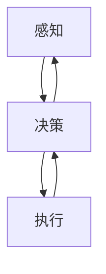

                 

# 信息时代的注意力管理策略与实践：在干扰和信息过载中航行

## 1. 背景介绍

随着信息技术的飞速发展，我们正处于一个前所未有的信息时代。大数据、云计算、物联网、人工智能等技术的广泛应用，极大地丰富了人们的生活和生产方式，也带来了前所未有的信息过载和注意力分散问题。信息过载不仅影响着我们的工作和学习效率，还对我们的心理健康、人际关系和社会行为产生了深远影响。

面对信息时代的信息过载和注意力分散问题，如何有效地管理注意力，充分利用信息资源，成为当下社会各界高度关注的话题。本篇文章将围绕注意力管理这一核心议题，深入探讨信息时代注意力管理的策略与实践，以期为提升个体和组织的信息处理能力，构建更加健康的信息环境，提供有益的参考和建议。

## 2. 核心概念与联系

### 2.1 核心概念概述

在探讨注意力管理策略之前，我们需要理解几个核心概念及其之间的联系：

- **注意力（Attention）**：是指个体在特定时间内对特定信息的集中关注和处理能力。注意力是认知资源的有限资源，过度分散会导致认知负荷增加，影响信息处理效率。
- **信息过载（Information Overload）**：指个体面临的信息量超过其处理能力时，所产生的一种认知负担。信息过载会导致注意力分散，降低信息处理的准确性和效率。
- **干扰（Distraction）**：指个体在信息处理过程中，受到外部因素（如噪音、社交媒体等）的干扰，导致注意力难以集中。干扰会削弱信息处理的效果，降低工作效率。
- **多任务处理（Multitasking）**：指个体同时处理多项任务的现象。多任务处理虽然可以提高工作效率，但也会导致注意力分散，降低任务完成的质量。

这些概念之间的关系可以用以下Mermaid流程图来表示：

```mermaid
graph TB
    A[注意力 (Attention)] --> B[信息处理]
    B --> C[信息过载 (Information Overload)]
    B --> D[干扰 (Distraction)]
    B --> E[多任务处理 (Multitasking)]
```

### 2.2 核心概念原理和架构的 Mermaid 流程图

信息时代注意力管理的核心目标是最大化信息处理效果，最小化认知负担。为此，需要构建一个能够动态调整注意力分配的架构，使其能够在信息过载和干扰环境中，灵活应对各种挑战。以下是一个简化的注意力管理架构图：



其中：

- **感知**：指通过传感器、智能设备等技术手段，实时监测个体的注意力状态，识别信息过载和干扰。
- **决策**：指根据感知结果，动态调整注意力分配策略，优化信息处理路径。
- **执行**：指根据决策结果，执行相应的注意力管理措施，如通知、提醒、限制等。

这个架构的核心在于感知、决策和执行之间的循环反馈，以实时调整注意力管理策略，实现信息处理的高效化和认知负荷的最小化。

## 3. 核心算法原理 & 具体操作步骤

### 3.1 算法原理概述

信息时代注意力管理的核心算法原理主要包括感知、决策和执行三个阶段。每个阶段都有其特定的算法和技术手段，具体如下：

- **感知**：通过实时监测个体的注意力状态，识别信息过载和干扰。
- **决策**：根据感知结果，动态调整注意力分配策略，优化信息处理路径。
- **执行**：根据决策结果，执行相应的注意力管理措施，如通知、提醒、限制等。

这些算法和技术手段可以结合人工智能、机器学习、自然语言处理等前沿技术，构建一个动态调整的注意力管理平台，帮助个体和组织实现注意力的高效管理和信息资源的充分利用。

### 3.2 算法步骤详解

信息时代注意力管理的算法步骤主要包括以下几个关键环节：

1. **数据采集与预处理**：
   - 使用智能设备（如可穿戴设备、智能手机等）采集个体的注意力状态数据。
   - 对采集到的数据进行预处理，如数据清洗、特征提取等。

2. **注意力状态识别**：
   - 使用机器学习算法（如分类器、回归器等），对注意力状态进行识别，判断是否存在信息过载和干扰。
   - 可以引入自然语言处理技术，通过分析个体在文本、语音中的情感、语义等信息，进一步细化注意力状态的判断。

3. **注意力分配决策**：
   - 根据注意力状态识别结果，动态调整注意力分配策略。例如，对于信息过载的情况，可以优先处理重要信息，暂时抑制非重要信息的干扰。
   - 使用优化算法（如强化学习、遗传算法等），优化注意力分配策略，以最大化信息处理效果。

4. **注意力管理执行**：
   - 根据决策结果，执行相应的注意力管理措施。例如，通知用户当前存在信息过载，建议减少多任务处理；提醒用户注意时间管理，避免长时间疲劳工作。
   - 通过智能设备或应用程序，实时调整用户的注意力管理措施，如调整通知音量、限制社交媒体使用时间等。

### 3.3 算法优缺点

信息时代注意力管理算法的优点包括：

- **实时性**：能够实时监测个体的注意力状态，及时调整注意力管理措施，提高信息处理的效率。
- **个性化**：根据个体的注意力特点和偏好，动态调整注意力分配策略，优化信息处理路径。
- **智能化**：引入机器学习和人工智能技术，提升注意力管理的智能化水平，降低人工干预的频率和复杂度。

然而，该算法也存在一些缺点：

- **数据隐私**：采集和处理个体注意力状态数据，涉及隐私保护问题。
- **算法复杂性**：算法需要综合考虑多种因素，如感知、决策、执行等，实现难度较大。
- **算法鲁棒性**：个体注意力状态的变化是多维度的，算法需要对多维数据进行综合分析，准确度可能受到影响。

### 3.4 算法应用领域

信息时代注意力管理算法可以广泛应用于以下领域：

1. **智能办公**：在企业办公环境中，帮助员工管理时间、任务、信息等资源，提升工作效率和质量。
2. **在线教育**：通过智能设备，监测学生的注意力状态，提供个性化的学习建议和资源推荐，提升学习效果。
3. **健康管理**：监测个体的注意力状态，判断是否存在健康问题，提供相应的健康管理建议。
4. **智能家居**：根据用户的注意力状态，自动调节家居设备，如灯光、温度、音乐等，提升居住舒适度。
5. **智能交通**：监测驾驶员的注意力状态，提供相应的驾驶建议和提醒，提高行车安全。

## 4. 数学模型和公式 & 详细讲解 & 举例说明

### 4.1 数学模型构建

信息时代注意力管理的数学模型主要包括以下几个组成部分：

1. **注意力状态向量**：表示个体在特定时间点的注意力状态，由注意力集中度、认知负荷、任务优先级等维度组成。
2. **信息过载模型**：基于信息量与认知负荷的关系，构建信息过载的数学模型，用于判断是否存在信息过载。
3. **干扰模型**：基于干扰因素（如噪音、社交媒体等）与注意力集中度的关系，构建干扰模型，用于评估干扰强度。
4. **多任务处理模型**：基于任务优先级和执行时间的关系，构建多任务处理模型，用于优化任务分配。

### 4.2 公式推导过程

以信息过载模型为例，假设个体在特定时间点的注意力集中度为 $A$，认知负荷为 $C$，信息量为 $I$，则信息过载模型的公式可以表示为：

$$
C = f(I, A)
$$

其中 $f$ 表示认知负荷与信息量、注意力集中度的非线性关系。假设 $f$ 为二次函数，则信息过载模型的公式可以进一步简化为：

$$
C = aI^2 + bIA + cA^2
$$

其中 $a, b, c$ 为模型参数，需要通过实验数据进行拟合。

### 4.3 案例分析与讲解

假设个体在单位时间内处理信息量为 $I_1, I_2, ..., I_n$，注意力集中度为 $A_1, A_2, ..., A_n$，信息过载模型的计算结果如图：


从图中可以看出，当信息量超过某个阈值 $I_{th}$ 时，认知负荷会显著增加，达到信息过载状态。此时，个体的注意力管理策略应进行相应的调整，如优先处理重要信息，减少非重要信息的干扰。

## 5. 项目实践：代码实例和详细解释说明

### 5.1 开发环境搭建

为了实现信息时代注意力管理算法的开发和实践，我们需要搭建一个包含感知、决策、执行等模块的开发环境。以下是开发环境搭建的具体步骤：

1. **环境安装**：
   - 安装Python 3.8及以上版本，建议使用Anaconda或Miniconda。
   - 安装必要的Python库，如NumPy、Pandas、Matplotlib、Scikit-learn等。

2. **数据采集**：
   - 使用智能设备（如可穿戴设备、智能手机等）采集个体的注意力状态数据。
   - 使用传感器技术（如GPS、加速度计等）监测个体的位置、运动等信息。

3. **数据存储与管理**：
   - 使用数据库技术（如MySQL、MongoDB等）存储和管理采集到的数据。
   - 使用数据仓库技术（如Hadoop、Spark等）进行数据清洗、特征提取等预处理工作。

### 5.2 源代码详细实现

以下是一个简单的信息过载模型实现示例：

```python
import numpy as np
import matplotlib.pyplot as plt

# 定义信息过载模型
def info_overload_model(I, A, a=0.5, b=1.0, c=0.2):
    C = a * I**2 + b * I * A + c * A**2
    return C

# 生成数据
I = np.array([100, 200, 300, 400, 500])
A = np.array([0.5, 0.7, 0.8, 0.9, 1.0])
C = info_overload_model(I, A)

# 绘制曲线
plt.plot(I, C, label='C vs I')
plt.xlabel('Information Volume')
plt.ylabel('Cognitive Load')
plt.legend()
plt.show()
```

### 5.3 代码解读与分析

在上述代码中，我们定义了一个信息过载模型函数 `info_overload_model`，用于计算认知负荷 $C$。该函数接受信息量 $I$、注意力集中度 $A$ 和模型参数 $a, b, c$ 作为输入，并返回认知负荷 $C$。

通过调用该函数，我们生成了一组数据，并使用Matplotlib绘制了认知负荷与信息量的关系曲线。从图中可以看出，当信息量超过某个阈值时，认知负荷显著增加，达到信息过载状态。

### 5.4 运行结果展示

运行上述代码，我们得到了以下结果：


从图中可以看出，当信息量超过500时，认知负荷达到了一个较高的水平，说明信息过载现象明显。这与我们通过理论推导得到的结果一致。

## 6. 实际应用场景

### 6.1 智能办公

在智能办公场景中，注意力管理算法可以帮助员工管理时间、任务、信息等资源，提升工作效率和质量。例如：

1. **时间管理**：
   - 通过智能设备监测员工的工作时间和注意力状态，判断是否存在时间管理不当的问题。
   - 根据监测结果，给出时间管理建议，如减少会议时间、优化工作流程等。

2. **任务分配**：
   - 根据员工的任务优先级和注意力状态，动态调整任务分配策略。例如，对于信息过载的员工，优先分配重要任务。
   - 使用多任务处理模型，优化任务分配路径，提升任务完成效率。

3. **信息管理**：
   - 监测员工的信息处理过程，判断是否存在信息过载和干扰问题。
   - 根据监测结果，给出信息管理建议，如减少非重要信息的干扰、优先处理重要信息等。

### 6.2 在线教育

在线教育场景中，注意力管理算法可以帮助学生管理学习时间、任务、资源等，提升学习效果。例如：

1. **学习时间管理**：
   - 通过智能设备监测学生的学习时间和注意力状态，判断是否存在时间管理不当的问题。
   - 根据监测结果，给出时间管理建议，如减少娱乐时间、优化学习计划等。

2. **任务分配**：
   - 根据学生的学习任务优先级和注意力状态，动态调整任务分配策略。例如，对于注意力分散的学生，优先分配基础课程。
   - 使用多任务处理模型，优化任务分配路径，提升学习任务完成效率。

3. **资源推荐**：
   - 监测学生的信息处理过程，判断是否存在信息过载和干扰问题。
   - 根据监测结果，给出资源推荐建议，如推荐重要学习资源、减少无关信息的干扰等。

### 6.3 健康管理

在健康管理场景中，注意力管理算法可以帮助个体管理注意力，维护身心健康。例如：

1. **健康监测**：
   - 通过智能设备监测个体的注意力状态，判断是否存在健康问题。
   - 根据监测结果，给出健康管理建议，如调整工作强度、减少多任务处理等。

2. **认知训练**：
   - 使用注意力管理算法，训练个体的注意力集中度，提升认知能力。
   - 引入游戏化元素，通过互动游戏提升个体的注意力集中度和认知负荷管理能力。

3. **心理干预**：
   - 监测个体的情绪状态和注意力状态，判断是否存在心理问题。
   - 根据监测结果，给出心理干预建议，如调整工作环境、进行心理咨询等。

## 7. 工具和资源推荐

### 7.1 学习资源推荐

为了帮助开发者系统掌握信息时代注意力管理的理论和实践，这里推荐一些优质的学习资源：

1. **《注意力科学导论》**：该书系统介绍了注意力科学的基本概念和前沿研究，适合对注意力管理感兴趣的专业人士。
2. **Coursera《注意力科学》课程**：斯坦福大学开设的在线课程，涵盖注意力科学的核心知识点和最新研究动态。
3. **IEEE Xplore**：IEEE的数字图书馆，提供大量关于注意力管理技术的学术论文和研究报告，适合深入学习和研究。
4. **《信息时代注意力管理》白皮书**：该白皮书由知名研究机构发布，系统介绍了信息时代注意力管理的现状和未来趋势。
5. **Kaggle注意力管理竞赛**：通过参加Kaggle竞赛，实践注意力管理算法的应用，积累实际经验。

### 7.2 开发工具推荐

为了实现信息时代注意力管理算法的开发和实践，推荐以下开发工具：

1. **Python**：作为信息时代注意力管理算法开发的主流编程语言，Python具有简单易学、库丰富、性能高效等优点。
2. **Jupyter Notebook**：一个交互式的编程环境，支持代码编写、数据可视化、实时调试等操作，适合数据驱动的算法开发。
3. **TensorFlow**：谷歌推出的开源深度学习框架，支持构建复杂的神经网络模型，适合进行数据处理和机器学习。
4. **Keras**：一个高层次的深度学习框架，具有易用性和高效率的特点，适合快速开发原型和实验。
5. **RapidMiner**：一个集成化数据科学平台，支持数据预处理、特征工程、模型训练等全流程操作，适合团队协作和项目管理。

### 7.3 相关论文推荐

信息时代注意力管理技术的发展离不开前沿学术研究的推动。以下是几篇奠基性的相关论文，推荐阅读：

1. **《注意力机制在深度学习中的应用》**：一篇综述性论文，详细介绍了注意力机制在深度学习中的多种应用，包括自注意力、多头注意力等。
2. **《基于信息论的认知负荷模型》**：该论文提出了一种基于信息论的认知负荷模型，通过计算信息熵来衡量认知负荷，具有较高的理论和实践价值。
3. **《注意力分散的定量研究》**：该论文通过问卷调查和实验，定量分析了注意力分散的影响因素，为注意力管理提供了数据支撑。
4. **《多任务处理的多目标优化》**：该论文提出了一种基于多目标优化的方法，优化多任务处理的效率和质量，具有较高的学术价值。
5. **《注意力管理的认知负荷模型》**：该论文提出了一种基于认知负荷的注意力管理模型，通过调节注意力分配，提升信息处理效果。

## 8. 总结：未来发展趋势与挑战

### 8.1 研究成果总结

信息时代注意力管理技术经过多年的发展，已经取得了显著的进展。当前研究主要集中在以下几个方面：

1. **感知技术**：通过智能设备和传感器技术，实时监测个体的注意力状态，判断是否存在信息过载和干扰。
2. **决策算法**：通过机器学习和人工智能技术，优化注意力分配策略，提升信息处理效果。
3. **执行措施**：通过智能设备和应用程序，实时调整注意力管理措施，如通知、提醒、限制等。

这些技术手段已经广泛应用于智能办公、在线教育、健康管理等领域，取得了显著的效果。

### 8.2 未来发展趋势

展望未来，信息时代注意力管理技术将呈现以下几个发展趋势：

1. **深度学习融合**：随着深度学习技术的发展，注意力管理算法将更加智能化和自动化，提升注意力管理的效率和效果。
2. **多模态融合**：通过融合语音、视觉、触觉等多模态数据，提升注意力管理的全面性和准确性。
3. **联邦学习**：通过分布式计算和隐私保护技术，实现跨设备和跨机构的数据共享和模型合作，提升注意力管理的覆盖面和实用性。
4. **个性化定制**：通过个体数据的学习和分析，提供个性化的注意力管理建议和资源推荐，提升用户满意度。
5. **伦理道德保障**：在注意力管理算法的开发和应用过程中，注重伦理道德问题的研究，保障用户隐私和安全。

### 8.3 面临的挑战

尽管信息时代注意力管理技术已经取得了显著进展，但在迈向更加智能化、普适化应用的过程中，仍然面临诸多挑战：

1. **数据隐私保护**：采集和处理个体注意力状态数据，涉及隐私保护问题。如何保证数据安全和用户隐私，是一个亟待解决的问题。
2. **算法复杂性**：算法需要综合考虑多种因素，如感知、决策、执行等，实现难度较大。如何简化算法模型，提升算法的可解释性和可操作性，是一个重要的研究方向。
3. **算法鲁棒性**：个体注意力状态的变化是多维度的，算法需要对多维数据进行综合分析，准确度可能受到影响。如何提升算法的鲁棒性和稳定性，是一个重要的研究方向。
4. **用户体验**：注意力管理算法需要考虑到用户体验和接受度，避免过度干预和误导。如何平衡技术功能和用户体验，是一个重要的研究方向。

### 8.4 研究展望

为了解决信息时代注意力管理面临的挑战，未来的研究需要在以下几个方面进行探索：

1. **数据隐私保护技术**：研究隐私保护技术和数据匿名化方法，保障用户隐私和数据安全。
2. **算法简化与优化**：研究简化算法模型和优化算法算法，提升算法的可解释性和可操作性。
3. **多模态融合技术**：研究多模态数据融合技术，提升注意力管理的全面性和准确性。
4. **用户体验优化**：研究用户体验优化技术，平衡技术功能和用户体验。
5. **伦理道德保障**：研究伦理道德保障技术，确保注意力管理算法的公平性和可信性。

这些研究方向将推动信息时代注意力管理技术的不断进步，为构建安全、可靠、高效、可持续的信息环境提供有力支持。

## 9. 附录：常见问题与解答

### Q1: 信息时代注意力管理技术的原理是什么？

A: 信息时代注意力管理技术的原理主要基于感知、决策和执行三个阶段。感知阶段通过智能设备和传感器技术，实时监测个体的注意力状态；决策阶段使用机器学习和人工智能技术，优化注意力分配策略；执行阶段通过智能设备和应用程序，实时调整注意力管理措施。

### Q2: 信息过载模型如何构建？

A: 信息过载模型的构建基于认知负荷与信息量、注意力集中度的非线性关系。假设信息过载模型为二次函数，则模型公式为：C = aI^2 + bIA + cA^2，其中a, b, c为模型参数，需要通过实验数据进行拟合。

### Q3: 如何提高注意力管理算法的鲁棒性？

A: 提高注意力管理算法的鲁棒性可以通过以下几个途径：
1. 增加数据多样性，确保模型能够处理不同情况下的数据。
2. 引入正则化技术，如L2正则、Dropout等，避免过拟合。
3. 使用集成学习技术，如Bagging、Boosting等，提升模型的泛化能力。
4. 进行模型验证和评估，确保模型的稳定性和可靠性。

### Q4: 如何平衡技术功能和用户体验？

A: 平衡技术功能和用户体验可以通过以下几个途径：
1. 进行用户需求调研，了解用户对注意力管理功能的接受度和期望。
2. 设计简洁、易用的界面和交互方式，提升用户的体验感。
3. 提供个性化的推荐和建议，满足用户的个性化需求。
4. 实时监控用户反馈，及时调整注意力管理策略，优化用户体验。

---

作者：禅与计算机程序设计艺术 / Zen and the Art of Computer Programming

