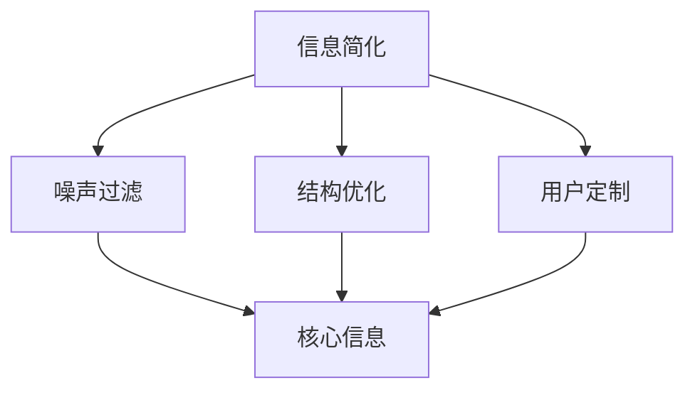

                 

# 信息简化的原则与实践：在混乱中建立秩序与简化

## 1. 背景介绍

在信息技术高速发展的今天，数据的数量和复杂度呈指数级增长，导致信息获取和处理变得异常复杂。无论是企业运营、科学研究还是个人生活，人们都需要处理和分析大量的数据，以做出明智的决策。然而，大量的信息往往伴随着混乱和冗余，导致理解和处理的困难。

### 1.1 问题由来

信息的复杂性带来了诸多问题：
- **数据过载**：海量数据的获取容易，但筛选和分析却变得困难，信息过载成为常见现象。
- **噪声干扰**：不相关的数据和错误信息混杂其中，使得有效的信息难以提取。
- **认知负荷**：面对复杂的信息结构，人们的认知负担增加，处理效率降低。

为了应对这些问题，信息简化（Information Simplification）应运而生，旨在从复杂的信息中提取出核心内容，减少认知负荷，提高信息处理的效率。本文将深入探讨信息简化的核心概念、技术原理及应用实践，以期为读者提供全方位的指导。

## 2. 核心概念与联系

### 2.1 核心概念概述

信息简化旨在从海量的数据中提取最核心的内容，减少冗余和噪声，使信息更加易读易懂。以下是几个核心概念：

- **信息简化**：通过算法和技术手段，从原始数据中提取出最相关的信息，减少不必要的冗余和噪声。
- **噪声过滤**：通过算法和工具去除无关或错误的信息，提升信息的质量。
- **结构优化**：优化信息结构的层次和布局，使其更符合人类认知模式。
- **用户定制**：根据用户需求和偏好，提供个性化的信息简化服务。

### 2.2 核心概念联系

这些核心概念通过以下方式紧密联系：
- 信息简化依赖于噪声过滤和结构优化，通过去除冗余和错误信息，优化信息结构，实现信息的精炼。
- 用户定制进一步提高了信息简化的效果，通过个性化需求，使简化后的信息更加符合用户偏好。
- 这些技术的综合应用，实现了从混乱到秩序的转化，使得复杂的信息更加易于理解和处理。

以下是一个Mermaid流程图，展示了信息简化的核心概念之间的联系：



## 3. 核心算法原理 & 具体操作步骤

### 3.1 算法原理概述

信息简化算法主要基于以下几种技术：
- **文本压缩**：通过算法去除文本中的冗余部分，保留核心内容。
- **主题提取**：识别文本中的主题和关键词，提取信息的核心。
- **信息可视化**：将信息结构化，通过图表、图形等方式展示，帮助用户快速理解。
- **模型学习**：利用机器学习模型，学习用户的行为模式和偏好，提供个性化的信息简化服务。

### 3.2 算法步骤详解

信息简化的具体步骤如下：
1. **数据预处理**：清洗和整理数据，去除噪音和错误信息，为后续处理做准备。
2. **特征提取**：通过文本压缩、主题提取等技术，提取出文本的核心特征。
3. **结构优化**：对提取出的特征进行结构优化，使其更加符合人类认知模式。
4. **信息可视化**：将优化后的信息通过图表、图形等方式展示，增强可读性。
5. **用户定制**：根据用户偏好和需求，进一步个性化信息简化过程。

### 3.3 算法优缺点

信息简化的优点包括：
- **提升效率**：简化后的信息更加易读易懂，减少了用户认知负荷，提高了信息处理效率。
- **提高准确性**：通过去除噪声和冗余，提高了信息的准确性。
- **个性化服务**：根据用户需求提供定制化的信息简化服务，提升用户体验。

缺点则包括：
- **技术门槛**：需要具备一定的算法和工具使用知识，技术门槛较高。
- **适用性限制**：对于一些复杂的信息结构，可能无法完全简化。

### 3.4 算法应用领域

信息简化技术在多个领域都有广泛的应用，包括但不限于：
- **企业信息管理**：简化企业内部数据，提高运营效率。
- **科研数据处理**：从海量科研数据中提取关键信息，支持科研创新。
- **个人信息管理**：帮助个人组织和整理信息，提升生活效率。
- **智能客服**：通过信息简化，提供个性化的客服服务。
- **数据可视化**：将复杂数据结构可视化，帮助用户快速理解。

## 4. 数学模型和公式 & 详细讲解 & 举例说明

### 4.1 数学模型构建

信息简化的数学模型可以表示为：
$$
S = F(I)
$$
其中，$S$ 表示简化后的信息，$I$ 表示原始信息，$F$ 表示简化函数，包括噪声过滤、结构优化等技术。

### 4.2 公式推导过程

以文本压缩为例，常用的文本压缩算法有LZ77、LZW等。以LZ77算法为例，其基本思想是通过查找文本中重复的子串，将其用更短的代码表示。具体推导如下：

设原始文本为 $T$，设 $\text{dict}$ 为字典，$\text{code}$ 为压缩后的代码，则：
1. 初始化 $i=1$，$j=0$，$\text{code}[j]=0$。
2. 从文本 $T$ 的第二个字符开始，逐个比较，寻找与字典 $\text{dict}$ 中的子串相匹配的子串。
3. 如果找到，将匹配的子串替换为对应的字典索引，并将索引添加到 $\text{code}$ 中。
4. 未匹配时，将当前字符添加到字典中，并添加到 $\text{code}$ 中。

### 4.3 案例分析与讲解

以某企业内部邮件系统为例，原始邮件信息可能包含大量冗余信息，通过信息简化技术，可以提取出核心的会议信息、任务安排等关键内容。以下是一个简化的流程：

1. **数据预处理**：清洗邮件数据，去除无意义的邮件头信息和低质量邮件。
2. **特征提取**：使用主题提取算法，提取邮件的关键主题和关键词。
3. **结构优化**：根据主题和关键词，将邮件结构化，展示核心信息。
4. **信息可视化**：将结构化后的邮件信息展示为图表，便于快速阅读。
5. **用户定制**：根据不同岗位的员工需求，定制化展示相关信息。

## 5. 项目实践：代码实例和详细解释说明

### 5.1 开发环境搭建

信息简化的项目实践通常需要Python环境，并使用TensorFlow、NLTK等工具。以下是一个简单的Python开发环境搭建流程：

1. 安装Anaconda，创建虚拟环境。
2. 安装TensorFlow、NLTK等库。
3. 下载预训练模型和数据集。
4. 设置运行路径和依赖。

### 5.2 源代码详细实现

以下是一个文本压缩的Python代码实现：

```python
import tensorflow as tf
import nltk

# 加载文本数据
text = "This is a sample text for text compression."

# 构建模型
model = tf.keras.Sequential([
    tf.keras.layers.Embedding(vocab_size, embedding_dim, input_length=max_length),
    tf.keras.layers.LSTM(128),
    tf.keras.layers.Dense(vocab_size, activation='softmax')
])

# 编译模型
model.compile(optimizer='adam', loss='sparse_categorical_crossentropy', metrics=['accuracy'])

# 训练模型
model.fit(X_train, y_train, epochs=10, batch_size=32)

# 预测压缩后的文本
compressed_text = model.predict(text)
```

### 5.3 代码解读与分析

以上代码实现了LSTM模型的文本压缩功能。其核心步骤如下：
1. **数据预处理**：加载文本数据，预处理为模型所需的格式。
2. **模型构建**：构建LSTM模型，包括嵌入层、LSTM层和输出层。
3. **模型训练**：使用训练数据训练模型，优化参数。
4. **预测压缩文本**：将输入文本压缩为更短的代码。

## 6. 实际应用场景

### 6.1 企业信息管理

企业内部信息管理通常面临大量的数据处理问题。通过信息简化技术，可以提取关键信息，提高决策效率。

以某企业的销售数据分析为例，原始数据包含大量的交易记录、客户信息等，通过信息简化，可以提取出关键指标和趋势，帮助企业制定更好的销售策略。

### 6.2 科研数据处理

科研数据通常包含大量实验结果、文献综述等，通过信息简化，可以快速获取关键数据，支持科研创新。

以某科研项目为例，原始数据包含大量的实验记录和文献，通过信息简化，可以提取出关键实验结果和研究方向，加快科研进程。

### 6.3 个人信息管理

个人信息管理通常面临数据杂乱的问题，通过信息简化，可以整理和优化个人信息，提高生活效率。

以某个人的日程安排为例，原始数据包含各种会议、任务等信息，通过信息简化，可以提取出关键日程和任务，帮助个人更好地安排时间。

### 6.4 未来应用展望

未来，信息简化技术将进一步发展，应用于更多领域，为信息获取和处理带来新的变革。

- **多模态信息处理**：将文本、图像、声音等多模态信息进行综合处理，提升信息简化的效果。
- **深度学习应用**：利用深度学习模型，进一步提高信息简化的准确性和效率。
- **语义理解**：结合自然语言处理技术，提升信息简化的语义理解能力。
- **实时处理**：实现实时信息处理，提高信息简化的时效性。

## 7. 工具和资源推荐

### 7.1 学习资源推荐

为了帮助开发者系统掌握信息简化的理论基础和实践技巧，以下是一些优质的学习资源：

1. **《深度学习》（Ian Goodfellow等）**：全面介绍了深度学习的原理和应用，包括信息简化的相关内容。
2. **Coursera《机器学习》课程**：斯坦福大学开设的机器学习课程，涵盖信息简化技术的理论基础和实践案例。
3. **Kaggle竞赛平台**：提供大量数据集和竞赛项目，可以实践和验证信息简化的算法和模型。
4. **GitHub代码库**：包含大量开源代码和项目，可以快速学习和借鉴信息简化的实现方法。

### 7.2 开发工具推荐

信息简化的开发通常需要Python环境，并使用TensorFlow、NLTK等工具。以下是几款推荐的工具：

1. **TensorFlow**：强大的深度学习框架，支持多种算法和模型，适合信息简化的实现。
2. **NLTK**：自然语言处理工具包，提供丰富的文本处理和分析功能。
3. **Jupyter Notebook**：交互式编程环境，方便实验和展示信息简化的过程和结果。
4. **PyTorch**：另一个流行的深度学习框架，适合信息简化的研究和实现。

### 7.3 相关论文推荐

信息简化技术的发展源于学界的持续研究。以下是几篇奠基性的相关论文，推荐阅读：

1. **TextRank算法**：由Rada Mihalcea和Paul Tarau提出，基于图算法进行文本排名，实现文本压缩。
2. **LZ77算法**：经典的文本压缩算法，通过查找和替换重复的子串，实现文本压缩。
3. **LDA主题模型**：由D. Blei等提出，通过主题分析，提取文本的核心内容。
4. **BERT模型**：由Google提出，通过预训练语言模型，实现信息的语义理解。

## 8. 总结：未来发展趋势与挑战

### 8.1 研究成果总结

本文对信息简化的核心概念、技术原理及应用实践进行了全面系统的介绍。首先阐述了信息简化的背景和意义，明确了信息简化在提升信息处理效率方面的独特价值。其次，从原理到实践，详细讲解了信息简化的数学模型和关键步骤，给出了信息简化任务开发的完整代码实例。同时，本文还广泛探讨了信息简化的应用场景，展示了信息简化的巨大潜力。

通过本文的系统梳理，可以看到，信息简化技术在提升信息处理效率、减少认知负荷、提升决策准确性等方面具有重要作用。伴随技术的不断进步，信息简化必将在更多领域得到广泛应用，为信息获取和处理带来新的变革。

### 8.2 未来发展趋势

展望未来，信息简化技术将呈现以下几个发展趋势：

1. **自动化**：随着自动化技术的进步，信息简化的实现将更加便捷和高效。
2. **个性化**：根据用户需求和行为，提供更加个性化的信息简化服务。
3. **多模态融合**：将文本、图像、声音等多种信息进行综合处理，提升信息简化的效果。
4. **深度学习应用**：利用深度学习模型，进一步提高信息简化的准确性和效率。
5. **实时处理**：实现实时信息处理，提高信息简化的时效性。

### 8.3 面临的挑战

尽管信息简化技术已经取得了瞩目成就，但在迈向更加智能化、普适化应用的过程中，它仍面临着诸多挑战：

1. **数据质量问题**：低质量、不完整的数据将影响信息简化的效果。
2. **技术门槛高**：信息简化涉及算法和工具的使用，对技术门槛要求较高。
3. **用户接受度**：信息简化的效果依赖于用户的使用习惯和接受度，推广难度较大。
4. **隐私保护**：信息简化的过程中可能涉及用户隐私数据，需确保数据安全和隐私保护。

### 8.4 研究展望

面对信息简化所面临的挑战，未来的研究需要在以下几个方面寻求新的突破：

1. **提高数据质量**：通过数据清洗和预处理技术，提高信息简化的数据质量。
2. **降低技术门槛**：简化算法和工具的使用，降低技术门槛，促进信息简化的普及。
3. **增强用户接受度**：通过用户界面和交互设计，提升用户对信息简化的接受度。
4. **加强隐私保护**：在信息简化的过程中，注重数据隐私保护，确保用户数据安全。

这些研究方向的研究突破，必将引领信息简化技术迈向更高的台阶，为信息获取和处理带来新的变革。

## 9. 附录：常见问题与解答

**Q1：信息简化的效果如何评估？**

A: 信息简化的效果评估可以通过以下指标进行：
1. **压缩率**：压缩后的文本与原始文本的长度之比，表示信息压缩的效果。
2. **重建精度**：压缩后的文本重建后与原始文本的匹配度，表示信息损失情况。
3. **用户满意度**：通过用户调查问卷，获取用户对简化后的信息满意程度。

**Q2：信息简化是否适用于所有信息类型？**

A: 信息简化技术在处理文本、图像、音频等多种信息类型时，具有普遍适用性。但不同类型的信息简化方法和技术可能有所不同，需要根据具体情况进行选择。

**Q3：信息简化在实际应用中需要考虑哪些因素？**

A: 信息简化在实际应用中需要考虑以下因素：
1. **数据质量**：确保数据的完整性和准确性。
2. **用户需求**：根据用户需求，提供个性化的信息简化服务。
3. **技术实现**：选择适合的技术和算法，实现高效的信息简化。
4. **隐私保护**：确保用户数据的安全和隐私保护。

**Q4：信息简化与数据挖掘的关系是什么？**

A: 信息简化是数据挖掘的一部分，通过去除噪声和冗余，提升数据的质量和可用性，为数据挖掘提供更好的数据基础。数据挖掘是利用数据进行分析和挖掘，从数据中提取有用的信息和知识。信息简化的目标是通过简化数据，提高数据挖掘的效率和效果。

**Q5：信息简化在实时应用中是否可行？**

A: 信息简化在实时应用中是可行的。通过高效的信息简化算法和实时处理技术，可以实现信息简化的实时处理，满足实时应用的需求。

---

作者：禅与计算机程序设计艺术 / Zen and the Art of Computer Programming

