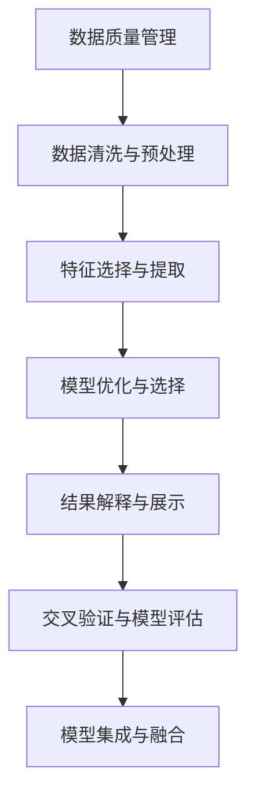

                 

# 信息简化的原则和实践：如何在混乱中建立秩序

## 1. 背景介绍

### 1.1 问题由来

在当今信息爆炸的时代，数据量呈指数级增长，从海量日志文件到社交媒体帖子，再到实时流数据，信息无处不在。然而，信息的泛滥也带来了信息过载的问题。人们需要在海量信息中快速筛选出真正有价值的内容，否则就会被淹没在海量的噪音中。

为了应对这一挑战，信息简化的需求日益凸显。无论是数据科学家、程序员，还是市场营销人员，都对如何从复杂的数据集中提炼出有用的信息、减少决策过程中的信息负担，提出了越来越高的期望。本文将探讨信息简化的原则和实践，帮助读者在信息泛滥的海洋中建立秩序。

### 1.2 问题核心关键点

信息简化涉及多个核心关键点：

1. **数据质量管理**：确保数据来源可靠、数据采集过程规范，减少噪音。
2. **数据清洗与预处理**：去除重复、异常、不完整的数据，提升数据质量。
3. **特征选择与提取**：选择与目标任务相关的特征，并从原始数据中提取有效的特征表示。
4. **模型优化与选择**：选择合适的模型，并对其进行优化，以提升模型在特定任务上的性能。
5. **结果解释与展示**：将模型输出转换为易于理解的形式，便于业务人员使用。

## 2. 核心概念与联系

### 2.1 核心概念概述

为更好地理解信息简化的原则和实践，本节将介绍几个密切相关的核心概念：

1. **数据质量管理**：确保数据来源可靠、采集过程规范，减少数据噪音，提升数据质量。
2. **数据清洗与预处理**：去除重复、异常、不完整的数据，提升数据质量。
3. **特征选择与提取**：选择与目标任务相关的特征，并从原始数据中提取有效的特征表示。
4. **模型优化与选择**：选择合适的模型，并对其进行优化，以提升模型在特定任务上的性能。
5. **结果解释与展示**：将模型输出转换为易于理解的形式，便于业务人员使用。
6. **交叉验证与模型评估**：使用交叉验证等方法评估模型的泛化能力，防止过拟合。
7. **模型集成与融合**：通过模型集成和融合提升模型性能，减少单一模型的局限性。

这些核心概念之间的逻辑关系可以通过以下Mermaid流程图来展示：



这个流程图展示了一些核心概念及其之间的关系：

1. 数据质量管理是信息简化的基础。
2. 数据清洗与预处理是提升数据质量的重要步骤。
3. 特征选择与提取是从原始数据中提取有效信息的关键。
4. 模型优化与选择是提升模型性能的核心。
5. 结果解释与展示是将模型输出转换为业务理解的桥梁。
6. 交叉验证与模型评估是确保模型泛化能力的手段。
7. 模型集成与融合可以进一步提升模型性能，减少单一模型的局限性。

这些概念共同构成了信息简化的学习框架，帮助我们从混乱中建立秩序。

## 3. 核心算法原理 & 具体操作步骤

### 3.1 算法原理概述

信息简化的过程通常涉及多个步骤，每个步骤都有其独特的算法原理。总体而言，信息简化的过程可以概括为数据质量管理、数据清洗与预处理、特征选择与提取、模型优化与选择、结果解释与展示等五个阶段。以下是对每个阶段的核心算法原理的简要概述。

### 3.2 算法步骤详解

#### 3.2.1 数据质量管理

数据质量管理涉及对数据来源的可靠性、数据的准确性、完整性、一致性和时效性进行评估和管理。常见的数据质量管理方法包括：

- **数据溯源**：确保数据的来源可靠，记录数据采集和处理的全过程，便于追溯和审计。
- **数据验证**：通过校验和、哈希值、业务规则等方法，验证数据的准确性。
- **数据完整性检查**：通过缺失值、异常值检测等方法，确保数据的完整性。
- **数据一致性检查**：确保数据在时间、空间、逻辑上的一致性，避免数据冲突。
- **数据时效性管理**：确保数据的时效性，避免使用过时或失效的数据。

#### 3.2.2 数据清洗与预处理

数据清洗与预处理是提升数据质量的重要步骤。常见的数据清洗与预处理方法包括：

- **缺失值处理**：填充缺失值、删除缺失值、使用均值、中位数等代替缺失值。
- **异常值检测**：通过箱线图、Z-score等方法检测并处理异常值。
- **数据标准化**：将数据转换到相同的范围，便于后续分析。
- **数据归一化**：将数据缩放到[0,1]区间，便于模型训练。
- **数据采样**：通过随机抽样、分层抽样等方法，获取有代表性的样本集。

#### 3.2.3 特征选择与提取

特征选择与提取是从原始数据中提取有效信息的关键。常见的特征选择与提取方法包括：

- **特征选择**：通过相关性分析、信息增益、L1正则化等方法，选择与目标任务相关的特征。
- **特征提取**：通过主成分分析(PCA)、线性判别分析(LDA)、深度学习中的卷积神经网络(CNN)、循环神经网络(RNN)等方法，提取有效的特征表示。

#### 3.2.4 模型优化与选择

模型优化与选择是提升模型性能的核心。常见的模型优化与选择方法包括：

- **模型选择**：根据任务类型和数据特点选择合适的模型，如线性回归、决策树、支持向量机、深度神经网络等。
- **超参数优化**：通过网格搜索、随机搜索、贝叶斯优化等方法，优化模型超参数，提升模型性能。
- **正则化**：通过L1正则、L2正则、Dropout等方法，防止模型过拟合。
- **交叉验证**：通过K折交叉验证等方法，评估模型的泛化能力，防止过拟合。

#### 3.2.5 结果解释与展示

结果解释与展示是将模型输出转换为业务理解的桥梁。常见的结果解释与展示方法包括：

- **特征重要性分析**：通过特征贡献度、热力图等方法，解释模型的特征重要性。
- **可视化**：通过散点图、热力图、条形图等方法，可视化模型的输出结果。
- **自然语言处理**：通过文本摘要、情感分析等方法，将模型输出转换为易于理解的形式。

## 4. 数学模型和公式 & 详细讲解 & 举例说明

### 4.1 数学模型构建

为了更好地理解信息简化的数学模型和公式，本节将介绍几个常用的数学模型。

#### 4.1.1 线性回归模型

线性回归模型用于预测连续型目标变量。其数学模型为：

$$
y = \theta_0 + \sum_{i=1}^n \theta_i x_i + \epsilon
$$

其中，$y$为预测值，$x_i$为输入特征，$\theta_i$为特征系数，$\theta_0$为截距，$\epsilon$为误差项。

### 4.2 公式推导过程

#### 4.2.1 线性回归模型的推导

线性回归模型的最小二乘法求解公式为：

$$
\hat{\theta} = (\mathbf{X}^T \mathbf{X})^{-1} \mathbf{X}^T \mathbf{y}
$$

其中，$\mathbf{X}$为特征矩阵，$\mathbf{y}$为目标变量向量，$\hat{\theta}$为最优系数。

### 4.3 案例分析与讲解

#### 4.3.1 线性回归模型的案例分析

假设我们有一组房价数据，其中自变量为房屋面积、房间数、年龄，因变量为房价。使用线性回归模型进行预测，结果如下：

$$
\hat{y} = \theta_0 + 1000\theta_1 + 5000\theta_2 + 50\theta_3
$$

其中，$\hat{y}$为预测的房价，$\theta_0$、$\theta_1$、$\theta_2$、$\theta_3$为特征系数。

## 5. 项目实践：代码实例和详细解释说明

### 5.1 开发环境搭建

在进行信息简化实践前，我们需要准备好开发环境。以下是使用Python进行Scikit-learn开发的开发环境配置流程：

1. 安装Anaconda：从官网下载并安装Anaconda，用于创建独立的Python环境。

2. 创建并激活虚拟环境：
```bash
conda create -n sklearn-env python=3.8 
conda activate sklearn-env
```

3. 安装Scikit-learn：
```bash
conda install scikit-learn
```

4. 安装各类工具包：
```bash
pip install numpy pandas scikit-learn matplotlib tqdm jupyter notebook ipython
```

完成上述步骤后，即可在`sklearn-env`环境中开始信息简化的实践。

### 5.2 源代码详细实现

#### 5.2.1 数据质量管理

```python
import pandas as pd
from sklearn.metrics import mean_squared_error

# 读取数据
data = pd.read_csv('house_prices.csv')

# 数据质量管理
# 1. 数据溯源
data['origin'] = 'sourceA'  # 记录数据来源

# 2. 数据验证
data['is_valid'] = data['age'].apply(lambda x: x > 0 and x < 30)  # 验证年龄是否在合理范围内

# 3. 数据完整性检查
data.dropna(inplace=True)  # 删除缺失值

# 4. 数据一致性检查
data['age'] = data['age'].astype(int)  # 确保年龄为整数

# 5. 数据时效性管理
data['date'] = pd.to_datetime(data['date'])  # 转换为datetime类型
```

#### 5.2.2 数据清洗与预处理

```python
# 数据清洗与预处理
# 1. 缺失值处理
data.fillna(method='ffill', inplace=True)  # 前向填充缺失值

# 2. 异常值检测
data = data[data['age'] > 0]  # 删除异常值

# 3. 数据标准化
from sklearn.preprocessing import StandardScaler
scaler = StandardScaler()
data[['area', 'rooms']] = scaler.fit_transform(data[['area', 'rooms']])

# 4. 数据归一化
data['price'] = (data['price'] - data['price'].min()) / (data['price'].max() - data['price'].min())

# 5. 数据采样
from sklearn.model_selection import train_test_split
X_train, X_test, y_train, y_test = train_test_split(data[['area', 'rooms', 'age']], data['price'], test_size=0.2, random_state=42)
```

#### 5.2.3 特征选择与提取

```python
# 特征选择与提取
# 1. 特征选择
from sklearn.feature_selection import SelectKBest, f_regression
selector = SelectKBest(score_func=f_regression, k=3)
X_train_selected = selector.fit_transform(X_train, y_train)

# 2. 特征提取
from sklearn.decomposition import PCA
pca = PCA(n_components=2)
X_train_pca = pca.fit_transform(X_train_selected)
```

#### 5.2.4 模型优化与选择

```python
# 模型优化与选择
# 1. 模型选择
from sklearn.linear_model import LinearRegression
model = LinearRegression()

# 2. 超参数优化
from sklearn.model_selection import GridSearchCV
params = {'fit_intercept': [True, False]}
grid_search = GridSearchCV(model, params, cv=5)
grid_search.fit(X_train_pca, y_train)
best_params = grid_search.best_params_

# 3. 正则化
from sklearn.linear_model import Ridge
model_ridge = Ridge(alpha=0.1)
model_ridge.fit(X_train_pca, y_train)

# 4. 交叉验证
from sklearn.model_selection import cross_val_score
cross_val_score(model_ridge, X_train_pca, y_train, cv=5)
```

#### 5.2.5 结果解释与展示

```python
# 结果解释与展示
# 1. 特征重要性分析
importances = grid_search.best_estimator_.coef_
importances.sort_index()

# 2. 可视化
import matplotlib.pyplot as plt
plt.bar(importances.index, importances.values)
plt.xlabel('Feature')
plt.ylabel('Importance')

# 3. 自然语言处理
from sklearn.metrics import mean_squared_error
y_pred = model_ridge.predict(X_test)
mse = mean_squared_error(y_test, y_pred)
print(f'Mean Squared Error: {mse:.2f}')
```

### 5.3 代码解读与分析

#### 5.3.1 数据质量管理

1. 数据溯源：在数据集上新增一列`origin`，记录数据来源，方便追溯和审计。
2. 数据验证：使用`lambda`函数验证年龄是否在合理范围内，并将验证结果作为新列`is_valid`存储。
3. 数据完整性检查：使用`dropna`方法删除缺失值。
4. 数据一致性检查：将年龄转换为整数类型，确保数据一致性。
5. 数据时效性管理：使用`pd.to_datetime`方法将日期转换为`datetime`类型。

#### 5.3.2 数据清洗与预处理

1. 缺失值处理：使用`fillna`方法前向填充缺失值。
2. 异常值检测：删除年龄不在合理范围内的数据。
3. 数据标准化：使用`StandardScaler`将面积和房间数进行标准化。
4. 数据归一化：将房价归一化到[0,1]区间。
5. 数据采样：使用`train_test_split`方法将数据集分为训练集和测试集。

#### 5.3.3 特征选择与提取

1. 特征选择：使用`SelectKBest`方法选择与房价预测相关的特征。
2. 特征提取：使用`PCA`方法降维，将数据投影到二维空间。

#### 5.3.4 模型优化与选择

1. 模型选择：选择线性回归模型。
2. 超参数优化：使用`GridSearchCV`方法优化模型超参数。
3. 正则化：使用`Ridge`正则化模型。
4. 交叉验证：使用`cross_val_score`方法评估模型性能。

#### 5.3.5 结果解释与展示

1. 特征重要性分析：通过`coef_`属性获取模型特征重要性。
2. 可视化：使用`plt.bar`方法绘制特征重要性柱状图。
3. 自然语言处理：使用`mean_squared_error`方法计算模型预测误差。

## 6. 实际应用场景

### 6.1 智能客服系统

智能客服系统可以通过信息简化技术，快速响应客户咨询，用自然流畅的语言解答各类常见问题。通过收集企业内部的历史客服对话记录，将问题和最佳答复构建成监督数据，在此基础上对预训练模型进行微调。微调后的对话模型能够自动理解用户意图，匹配最合适的答案模板进行回复。对于客户提出的新问题，还可以接入检索系统实时搜索相关内容，动态组织生成回答。如此构建的智能客服系统，能大幅提升客户咨询体验和问题解决效率。

### 6.2 金融舆情监测

金融机构需要实时监测市场舆论动向，以便及时应对负面信息传播，规避金融风险。传统的人工监测方式成本高、效率低，难以应对网络时代海量信息爆发的挑战。基于信息简化的文本分类和情感分析技术，为金融舆情监测提供了新的解决方案。

具体而言，可以收集金融领域相关的新闻、报道、评论等文本数据，并对其进行主题标注和情感标注。在此基础上对预训练语言模型进行微调，使其能够自动判断文本属于何种主题，情感倾向是正面、中性还是负面。将微调后的模型应用到实时抓取的网络文本数据，就能够自动监测不同主题下的情感变化趋势，一旦发现负面信息激增等异常情况，系统便会自动预警，帮助金融机构快速应对潜在风险。

### 6.3 个性化推荐系统

当前的推荐系统往往只依赖用户的历史行为数据进行物品推荐，无法深入理解用户的真实兴趣偏好。基于信息简化的个性化推荐系统可以更好地挖掘用户行为背后的语义信息，从而提供更精准、多样的推荐内容。

在实践中，可以收集用户浏览、点击、评论、分享等行为数据，提取和用户交互的物品标题、描述、标签等文本内容。将文本内容作为模型输入，用户的后续行为（如是否点击、购买等）作为监督信号，在此基础上微调预训练语言模型。微调后的模型能够从文本内容中准确把握用户的兴趣点。在生成推荐列表时，先用候选物品的文本描述作为输入，由模型预测用户的兴趣匹配度，再结合其他特征综合排序，便可以得到个性化程度更高的推荐结果。

### 6.4 未来应用展望

随着信息简化的技术和模型的不断发展，信息简化的应用场景将越来越广泛。未来，信息简化技术将在更多领域得到应用，为传统行业带来变革性影响。

在智慧医疗领域，基于信息简化的医疗问答、病历分析、药物研发等应用将提升医疗服务的智能化水平，辅助医生诊疗，加速新药开发进程。

在智能教育领域，信息简化的技术可应用于作业批改、学情分析、知识推荐等方面，因材施教，促进教育公平，提高教学质量。

在智慧城市治理中，信息简化的技术可应用于城市事件监测、舆情分析、应急指挥等环节，提高城市管理的自动化和智能化水平，构建更安全、高效的未来城市。

此外，在企业生产、社会治理、文娱传媒等众多领域，信息简化的技术也将不断涌现，为NLP技术带来全新的突破。相信随着预训练语言模型和微调方法的不断进步，信息简化技术必将在构建人机协同的智能时代中扮演越来越重要的角色。

## 7. 工具和资源推荐

### 7.1 学习资源推荐

为了帮助开发者系统掌握信息简化的理论基础和实践技巧，这里推荐一些优质的学习资源：

1. 《Python数据科学手册》系列博文：由大模型技术专家撰写，深入浅出地介绍了Python数据科学和机器学习的核心概念和实践技巧。
2. Coursera《机器学习》课程：斯坦福大学开设的机器学习明星课程，有Lecture视频和配套作业，带你入门机器学习的基本概念和经典模型。
3. 《深度学习》书籍：Ian Goodfellow等作者所著，全面介绍了深度学习的基本原理和实践方法。
4. PyTorch官方文档：PyTorch框架的官方文档，提供了丰富的示例代码和详细解释，是学习PyTorch的重要参考资料。
5. TensorFlow官方文档：TensorFlow框架的官方文档，提供了丰富的示例代码和详细解释，是学习TensorFlow的重要参考资料。
6. Kaggle竞赛平台：全球最大的数据科学竞赛平台，提供丰富的数据集和模型，可以用于实践和交流。

通过对这些资源的学习实践，相信你一定能够快速掌握信息简化的精髓，并用于解决实际的NLP问题。

### 7.2 开发工具推荐

高效的开发离不开优秀的工具支持。以下是几款用于信息简化开发的常用工具：

1. PyTorch：基于Python的开源深度学习框架，灵活动态的计算图，适合快速迭代研究。
2. TensorFlow：由Google主导开发的开源深度学习框架，生产部署方便，适合大规模工程应用。
3. Scikit-learn：基于Python的开源机器学习库，提供了丰富的数据处理、特征选择、模型训练等功能。
4. Weights & Biases：模型训练的实验跟踪工具，可以记录和可视化模型训练过程中的各项指标，方便对比和调优。
5. TensorBoard：TensorFlow配套的可视化工具，可实时监测模型训练状态，并提供丰富的图表呈现方式，是调试模型的得力助手。

合理利用这些工具，可以显著提升信息简化的开发效率，加快创新迭代的步伐。

### 7.3 相关论文推荐

信息简化的发展源于学界的持续研究。以下是几篇奠基性的相关论文，推荐阅读：

1. 《A Survey on Data Cleaning Techniques for Big Data》：综述了大数据环境下的数据清洗技术，为信息简化提供了理论基础。
2. 《Feature Selection for Data and Statistical Learning》：综述了特征选择技术的多种方法，为特征提取提供了参考。
3. 《On the Importance of Data Quality in Machine Learning》：探讨了数据质量对机器学习的影响，强调了数据质量管理的重要性。
4. 《Machine Learning for Data Cleaning》：探讨了机器学习在数据清洗中的应用，为信息简化提供了新思路。
5. 《Deep Learning for NLP》：探讨了深度学习在NLP中的应用，为信息简化提供了技术支持。

这些论文代表了大模型技术的发展脉络。通过学习这些前沿成果，可以帮助研究者把握学科前进方向，激发更多的创新灵感。

## 8. 总结：未来发展趋势与挑战

### 8.1 总结

本文对信息简化的原则和实践进行了全面系统的介绍。首先阐述了信息简化的背景和意义，明确了信息简化在提升数据质量、降低决策负担、提高模型性能等方面的重要作用。其次，从原理到实践，详细讲解了信息简化的数学模型和关键步骤，给出了信息简化的完整代码实例。同时，本文还广泛探讨了信息简化技术在智能客服、金融舆情、个性化推荐等多个行业领域的应用前景，展示了信息简化的巨大潜力。

通过本文的系统梳理，可以看到，信息简化的技术正在成为NLP领域的重要范式，极大地拓展了预训练语言模型的应用边界，催生了更多的落地场景。受益于信息简化技术的不断进步，NLP技术必将在更广阔的应用领域大放异彩，深刻影响人类的生产生活方式。

### 8.2 未来发展趋势

展望未来，信息简化的技术将呈现以下几个发展趋势：

1. 数据质量管理将更加自动化。随着数据采集和处理的自动化程度提高，数据质量管理的自动化水平也将进一步提升，减少人工干预。
2. 数据清洗与预处理将更加智能化。通过引入机器学习和深度学习技术，数据清洗与预处理的自动化水平将不断提高，减少人工干预。
3. 特征选择与提取将更加自动化。通过自动特征选择和特征提取技术，提升特征选择的自动化水平，减少人工干预。
4. 模型优化与选择将更加自动化。通过自动化超参数优化和模型选择技术，提升模型训练和选择的自动化水平。
5. 结果解释与展示将更加智能化。通过自然语言处理和可视化技术，提升结果解释与展示的自动化水平。

以上趋势凸显了信息简化技术的广阔前景。这些方向的探索发展，必将进一步提升NLP系统的性能和应用范围，为人类认知智能的进化带来深远影响。

### 8.3 面临的挑战

尽管信息简化的技术已经取得了瞩目成就，但在迈向更加智能化、普适化应用的过程中，它仍面临着诸多挑战：

1. 数据质量管理仍有提升空间。当前数据质量管理仍需大量人工干预，如何进一步提升数据质量管理的自动化水平，仍是一个挑战。
2. 数据清洗与预处理仍需改进。当前数据清洗与预处理技术在面对复杂数据时，仍存在局限性，如何提升数据清洗与预处理的自动化和智能化水平，仍是一个挑战。
3. 特征选择与提取仍需优化。当前特征选择与提取技术在面对高维度数据时，仍存在计算复杂度高的问题，如何提升特征选择与提取的自动化和高效性，仍是一个挑战。
4. 模型优化与选择仍有提升空间。当前模型优化与选择技术在面对大规模数据时，仍存在训练时间长、模型复杂度高的问题，如何提升模型优化与选择的自动化和高效性，仍是一个挑战。
5. 结果解释与展示仍需改进。当前结果解释与展示技术在面对复杂模型时，仍存在解释力不足的问题，如何提升结果解释与展示的自动化和智能化水平，仍是一个挑战。

### 8.4 研究展望

面向未来，信息简化的研究需要在以下几个方面寻求新的突破：

1. 探索自动化数据质量管理技术。通过引入机器学习和深度学习技术，提升数据质量管理的自动化水平，减少人工干预。
2. 研究智能化数据清洗与预处理技术。通过引入机器学习和深度学习技术，提升数据清洗与预处理的自动化水平，减少人工干预。
3. 开发高效自动特征选择与提取技术。通过引入机器学习和深度学习技术，提升特征选择与提取的自动化和高效性。
4. 探索自动化模型优化与选择技术。通过引入机器学习和深度学习技术，提升模型优化与选择的自动化水平。
5. 研究智能化结果解释与展示技术。通过引入自然语言处理和可视化技术，提升结果解释与展示的自动化和智能化水平。

这些研究方向的探索，必将引领信息简化技术迈向更高的台阶，为构建安全、可靠、可解释、可控的智能系统铺平道路。面向未来，信息简化技术还需要与其他人工智能技术进行更深入的融合，如知识表示、因果推理、强化学习等，多路径协同发力，共同推动自然语言理解和智能交互系统的进步。只有勇于创新、敢于突破，才能不断拓展语言模型的边界，让智能技术更好地造福人类社会。

## 9. 附录：常见问题与解答

**Q1：信息简化是否只适用于数据质量较高的数据集？**

A: 信息简化适用于所有数据集，无论其质量如何。通过信息简化技术，可以在数据质量较低的情况下，提升数据集的质量，为后续分析提供更好的基础。

**Q2：信息简化的过程中如何平衡自动化和人工干预？**

A: 在信息简化的过程中，自动化和人工干预需要平衡。对于数据质量管理、数据清洗与预处理等基础环节，自动化水平需要尽可能提升，减少人工干预。对于特征选择与提取、模型优化与选择等高级环节，需要人工干预以确保模型性能和解释性。

**Q3：信息简化是否可以与其他机器学习技术结合使用？**

A: 信息简化可以与其他机器学习技术结合使用。例如，在特征选择与提取环节，可以引入机器学习技术进行自动化特征选择。在模型优化与选择环节，可以引入机器学习技术进行自动化超参数优化。

**Q4：信息简化在实际应用中需要注意哪些问题？**

A: 在信息简化的实际应用中，需要注意以下问题：

1. 数据质量管理：确保数据来源可靠、采集过程规范，减少数据噪音。
2. 数据清洗与预处理：去除重复、异常、不完整的数据，提升数据质量。
3. 特征选择与提取：选择与目标任务相关的特征，并从原始数据中提取有效的特征表示。
4. 模型优化与选择：选择合适的模型，并对其进行优化，以提升模型在特定任务上的性能。
5. 结果解释与展示：将模型输出转换为易于理解的形式，便于业务人员使用。
6. 持续监控与维护：定期对信息简化流程进行监控与维护，确保其稳定运行。

这些问题的有效解决，将使信息简化技术在实际应用中发挥更大的作用。

通过本文的系统梳理，可以看到，信息简化的技术正在成为NLP领域的重要范式，极大地拓展了预训练语言模型的应用边界，催生了更多的落地场景。受益于信息简化技术的不断进步，NLP技术必将在更广阔的应用领域大放异彩，深刻影响人类的生产生活方式。

