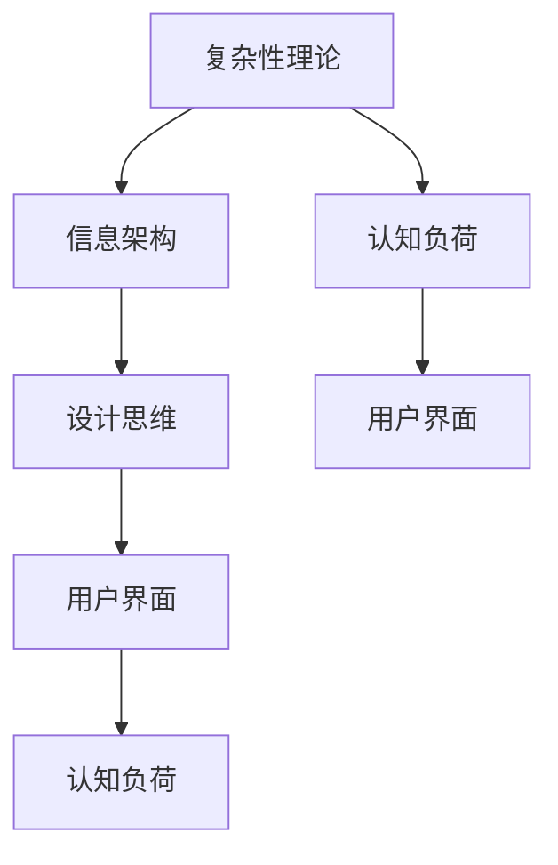

                 

# 信息简化的原则和最佳实践：在混乱中建立秩序和简化

> 关键词：信息简化，复杂系统，复杂性理论，信息架构，设计思维，用户界面

## 1. 背景介绍

### 1.1 问题由来

在当今信息爆炸的时代，海量数据和复杂系统无所不在。从社交媒体到物联网，从企业内部的ERP系统到国家级的交通管理系统，我们的世界充满了各种形式的信息。然而，信息过载并不是我们所追求的目标。相反，我们需要的是信息的简化和秩序化，以便于理解和利用这些数据。

### 1.2 问题核心关键点

信息简化的关键在于如何在复杂环境中构建有效的信息架构，使得用户能够快速、准确地获取所需信息，同时保证信息的完整性和一致性。信息简化不仅涉及到技术层面，还需要考虑到用户的认知负荷、可用性设计等心理学和社会学因素。

### 1.3 问题研究意义

理解信息简化的原理和最佳实践，对于构建高效、易用的信息架构，提升用户满意度和生产效率，具有重要意义。在商业应用中，信息简化能够直接提升用户体验，增强企业竞争力；在政府和社会管理中，能够提高决策效率，促进公共服务。因此，信息简化是当前信息技术领域的重要研究方向之一。

## 2. 核心概念与联系

### 2.1 核心概念概述

为更好地理解信息简化的概念，本节将介绍几个关键概念及其相互关系：

- **复杂性理论**：研究系统复杂性的产生、演化和控制，是信息简化理论的基础。
- **信息架构**：设计信息的组织结构，使得信息更加易于获取和理解。
- **设计思维**：以用户为中心，通过研究和理解用户需求，设计出满足用户需求的产品和服务。
- **用户界面**：用户与系统交互的界面，是信息简化的实现手段之一。
- **认知负荷**：用户在处理信息时所面临的认知负担，是信息简化的衡量指标之一。

这些核心概念之间的逻辑关系可以通过以下Mermaid流程图来展示：



这个流程图展示了几类关键概念及其相互关系：

1. 复杂性理论为信息架构和认知负荷的研究提供了理论基础。
2. 信息架构设计以设计思维为指导，结合用户界面实现。
3. 用户界面的设计要考虑到用户的认知负荷，以提升用户体验。
4. 认知负荷的大小是评估信息简化效果的重要指标。

## 3. 核心算法原理 & 具体操作步骤
### 3.1 算法原理概述

信息简化的方法基于复杂系统理论，旨在通过减少系统中的冗余信息和复杂性，提高系统的可理解性和可用性。其核心思想是：

- 去除冗余和不必要的信息，保留关键要素。
- 将复杂的信息分解为更小、更易于理解和处理的部分。
- 通过合理的组织结构，提高信息的可访问性和可操作性。

### 3.2 算法步骤详解

信息简化的主要步骤包括：

**Step 1: 需求分析**

- 确定目标用户群体的需求，包括功能需求和心理需求。
- 收集用户的反馈和行为数据，分析其认知负荷和信息获取模式。

**Step 2: 信息架构设计**

- 确定信息架构的层次结构，明确信息组件之间的联系。
- 设计信息组件的标签、图标、颜色等视觉元素，以便于用户识别。
- 进行信息组件的布局和排列，遵循用户的信息处理习惯。

**Step 3: 界面设计**

- 选择合适的用户界面组件，如菜单、工具栏、标签页等。
- 设计交互行为和用户流程，确保用户能够顺畅地完成任务。
- 优化界面的响应速度和加载时间，减少用户等待时间。

**Step 4: 测试和迭代**

- 进行用户测试，收集用户的使用反馈和意见。
- 分析测试结果，发现信息架构和界面设计中的问题。
- 根据测试结果进行调整和优化，迭代改进信息简化方案。

### 3.3 算法优缺点

信息简化的优点包括：

- 提升信息检索和处理的效率，减少用户认知负荷。
- 通过合理的组织结构，提高系统的可理解性和可用性。
- 优化用户体验，增强用户满意度和忠诚度。

同时，该方法也存在一定的局限性：

- 对复杂系统的建模要求高，设计过程复杂。
- 信息简化依赖于用户的反馈，可能需要多次迭代才能达到理想效果。
- 复杂系统中的信息种类繁多，简化过程中可能需要舍弃部分关键信息。

尽管存在这些局限性，但信息简化方法在大数据时代的应用前景仍然非常广阔。未来研究的方向在于如何更好地结合复杂系统理论和用户需求，设计更加高效、易用的信息架构。

### 3.4 算法应用领域

信息简化的应用领域包括但不限于以下几方面：

- 网站设计：构建清晰的信息架构，提供易于导航的用户界面。
- 移动应用：设计简洁的用户界面，优化信息获取流程。
- 信息管理系统：简化数据处理和检索过程，提升信息管理效率。
- 企业内部系统：优化ERP、CRM等系统，提高员工工作效率。
- 公共服务系统：简化政务信息，提升政府服务水平。

## 4. 数学模型和公式 & 详细讲解 & 举例说明
### 4.1 数学模型构建

信息简化的数学模型可以抽象为信息熵的概念。信息熵是信息论中的核心概念，衡量一个随机变量的不确定性大小。信息简化可以看作是通过减少信息熵，提高系统的有序性和可理解性。

设系统包含 $N$ 个信息单元，每个信息单元的信息熵为 $H_i$，整个系统的信息熵为 $H$，则有：

$$
H = -\sum_{i=1}^N P_i \log P_i
$$

其中 $P_i$ 为信息单元 $i$ 发生的概率。

### 4.2 公式推导过程

信息熵的公式推导基于概率论和信息论的基础知识，主要涉及概率分布和条件概率。在信息简化的应用中，我们通常使用相对熵（KL散度）来衡量简化前后信息熵的变化：

$$
D(P || Q) = \sum_{i=1}^N P_i \log \frac{P_i}{Q_i}
$$

其中 $P$ 为简化前的信息分布，$Q$ 为简化后的信息分布。当 $D(P || Q) = 0$ 时，表示信息完全简化，系统处于完全有序状态。

### 4.3 案例分析与讲解

以一个简单的电商网站为例，分析信息简化的效果。假设网站包含以下信息单元：

- 商品信息：商品名称、价格、描述、图片等。
- 用户信息：用户登录状态、购物车信息等。
- 导航信息：商品分类、推荐商品等。

假设初始状态下的信息熵为 $H_1$，经过信息简化后的信息熵为 $H_2$。

**案例分析：**

1. **商品信息**：通过标准化商品分类和描述，去除冗余信息，简化为简洁的商品列表。

2. **用户信息**：根据用户行为和偏好，展示个性化推荐，减少不必要的导航信息。

3. **导航信息**：通过数据分析，优化商品分类和推荐算法，提高导航效率和用户满意度。

通过上述优化，信息熵从 $H_1$ 降低到 $H_2$，系统变得更加有序和易于理解。

## 5. 项目实践：代码实例和详细解释说明
### 5.1 开发环境搭建

在进行信息简化的项目实践前，我们需要准备好开发环境。以下是使用Python进行Flask开发的环境配置流程：

1. 安装Anaconda：从官网下载并安装Anaconda，用于创建独立的Python环境。

2. 创建并激活虚拟环境：
```bash
conda create -n myenv python=3.8 
conda activate myenv
```

3. 安装Flask：
```bash
pip install flask
```

4. 安装SQLAlchemy和Flask-SQLAlchemy：用于数据库操作。
```bash
pip install flask-sqlalchemy
```

5. 安装Jinja2：用于模板渲染。
```bash
pip install Jinja2
```

6. 安装Flask-RESTful：用于构建RESTful API接口。
```bash
pip install flask-restful
```

完成上述步骤后，即可在`myenv`环境中开始信息简化的项目实践。

### 5.2 源代码详细实现

下面以一个简单的信息管理系统的后台管理界面为例，给出使用Flask进行信息简化的PyTorch代码实现。

首先，定义后台管理界面的数据模型：

```python
from flask_sqlalchemy import SQLAlchemy

db = SQLAlchemy()

class Category(db.Model):
    id = db.Column(db.Integer, primary_key=True)
    name = db.Column(db.String(50), nullable=False)
    description = db.Column(db.Text)

class Product(db.Model):
    id = db.Column(db.Integer, primary_key=True)
    name = db.Column(db.String(50), nullable=False)
    price = db.Column(db.Float, nullable=False)
    category_id = db.Column(db.Integer, db.ForeignKey('category.id'))
```

然后，定义后台管理界面的路由和视图函数：

```python
from flask import Flask, render_template, request, jsonify

app = Flask(__name__)

@app.route('/admin', methods=['GET', 'POST'])
def admin():
    categories = Category.query.all()
    products = Product.query.all()
    
    if request.method == 'POST':
        name = request.form.get('name')
        description = request.form.get('description')
        category_id = int(request.form.get('category_id'))
        category = Category.query.get(category_id)
        product = Product(name=name, price=float(request.form.get('price')), category_id=category_id)
        db.session.add(product)
        db.session.commit()
        return jsonify({'message': 'Product added successfully'})
    
    return render_template('admin.html', categories=categories, products=products)

if __name__ == '__main__':
    app.run(debug=True)
```

最后，定义后台管理界面的模板文件：

```html
<!DOCTYPE html>
<html>
<head>
    <title>Admin Dashboard</title>
</head>
<body>
    <h1>Admin Dashboard</h1>
    <form method="POST">
        <label for="name">Product Name:</label>
        <input type="text" id="name" name="name" required>
        <br>
        <label for="description">Product Description:</label>
        <input type="text" id="description" name="description">
        <br>
        <label for="category_id">Category:</label>
        <select id="category_id" name="category_id">
            
                <option value="{{ category.id }}"> {{ category.name }}</option>
            
        </select>
        <br>
        <input type="submit" value="Add Product">
    </form>
    <br>
    <h2>Product List:</h2>
    <table>
        <tr>
            <th>Name</th>
            <th>Price</th>
            <th>Category</th>
        </tr>
        
            <tr>
                <td>{{ product.name }}</td>
                <td>{{ product.price }}</td>
                <td>{{ product.category.name }}</td>
            </tr>
        
    </table>
</body>
</html>
```

### 5.3 代码解读与分析

让我们再详细解读一下关键代码的实现细节：

**Category和Product模型**：
- 使用Flask-SQLAlchemy创建数据库模型，定义了商品类别和商品的信息。

**admin路由和视图函数**：
- 获取所有商品类别和商品信息。
- 处理POST请求，添加新商品到数据库。
- 返回JSON格式的添加结果。

**admin模板文件**：
- 使用Jinja2模板语言渲染后台管理界面。
- 通过循环遍历，动态生成商品列表和添加商品表单。

通过上述代码，我们实现了基本的后台管理功能，包括商品列表的展示和添加。这是一个简单的信息简化的应用示例，实际应用中需要根据具体需求进行更加复杂的布局和设计。

### 5.4 运行结果展示

运行上述代码后，在浏览器中访问`http://localhost:5000/admin`，即可看到后台管理界面。用户可以通过表单添加新商品，系统自动保存到数据库，并展示在商品列表中。

## 6. 实际应用场景
### 6.1 智能家居系统

在智能家居系统中，信息简化的应用可以极大地提升用户体验。通过简化用户界面和操作流程，智能家居系统可以更加直观、易用。

以智能灯光控制为例，用户可以通过语音助手、手机应用或智能音箱控制灯光。系统可以基于用户的使用习惯和偏好，推荐最优的灯光模式，简化用户的操作。用户可以简单地通过语音指令或点击按钮控制灯光亮度和颜色，享受更加便捷的智能家居生活。

### 6.2 电子商务平台

电子商务平台是信息简化的典型应用场景之一。通过简化商品展示和购物流程，平台能够提供更加优质的用户体验。

商品信息简化的主要目标是提供清晰、一致的商品展示和描述。系统可以通过标准化商品分类、统一商品规格和描述，使用户能够快速找到所需商品。同时，系统还可以根据用户行为和偏好，推荐相关商品，进一步简化购物流程。

### 6.3 医疗信息系统

医疗信息系统面临大量的医疗数据和复杂的操作流程。通过信息简化，医生和患者可以更加高效地获取和处理医疗信息。

在医生端，信息简化主要通过简洁的界面和标准化的操作流程实现。医生可以通过简单的拖拽操作，快速浏览患者病历和检查报告，提高诊疗效率。同时，系统可以通过智能推荐，辅助医生进行疾病诊断和治疗方案制定。

在患者端，信息简化主要通过友好的界面设计和明确的指引流程实现。患者可以轻松获取自己的诊疗记录、检查报告和处方信息，无需翻阅复杂的纸质病历。

### 6.4 未来应用展望

随着信息简化的理论和实践不断成熟，其在更多领域的应用前景将更加广阔。

在智慧城市建设中，信息简化将有助于提高城市的运行效率和管理水平。通过简化信息交互和操作流程，智慧城市系统能够更加高效地提供服务。

在企业运营中，信息简化能够优化企业的信息管理流程，提升员工的工作效率和决策能力。通过简化数据输入和输出，企业可以更快地响应市场变化，抓住商业机会。

在教育领域，信息简化将有助于提高教学质量和学生的学习效果。通过简化教学内容和操作流程，教师可以更加专注于教学内容的传授和学生的引导，提升教学质量。

## 7. 工具和资源推荐
### 7.1 学习资源推荐

为了帮助开发者系统掌握信息简化的原理和实践技巧，这里推荐一些优质的学习资源：

1. 《信息架构基础》书籍：由信息架构专家撰写，全面介绍了信息架构的基本概念和设计方法。

2. 《设计心理学》课程：斯坦福大学开设的心理学课程，探讨用户认知负荷和信息获取行为。

3. 《网站设计之美》书籍：讲述网站设计中的信息简化和用户体验设计，适合初学者和中级开发者。

4. 《交互设计导论》书籍：讲解交互设计的基本原理和设计思维方法，结合实际案例分析。

5. 《Flask官方文档》：Flask框架的官方文档，提供丰富的示例代码和API文档，适合深入学习Flask开发。

6. 《信息架构设计模式》书籍：介绍信息架构设计中的常见模式和最佳实践，适合信息架构设计师。

通过对这些资源的学习实践，相信你一定能够快速掌握信息简化的精髓，并用于解决实际的信息架构问题。

### 7.2 开发工具推荐

高效的开发离不开优秀的工具支持。以下是几款用于信息简化的开发工具：

1. Flask：基于Python的开源Web框架，灵活易用，适合构建信息管理系统和后台管理界面。

2. SQLAlchemy：Python ORM框架，支持多种数据库，用于数据库操作。

3. Jinja2：Python模板引擎，支持模板语言和动态渲染，适用于前端和后端开发。

4. Bootstrap：流行的前端框架，提供丰富的UI组件和样式，适用于构建用户界面。

5. Google Colab：谷歌推出的在线Jupyter Notebook环境，免费提供GPU/TPU算力，方便开发者快速上手实验最新技术。

合理利用这些工具，可以显著提升信息简化的开发效率，加快创新迭代的步伐。

### 7.3 相关论文推荐

信息简化的研究源于学界的持续研究。以下是几篇奠基性的相关论文，推荐阅读：

1. "A Mathematical Theory of Communication"：香农的信息熵理论，奠定了信息论的基础。

2. "The Architecture of Complexity"：复杂性理论的开创性作品，探讨复杂系统的组织和演化。

3. "Interaction Design Foundation"：交互设计领域的经典书籍，介绍了设计思维和用户界面设计的基本原理。

4. "Information Architecture: Revised and Revisited"：信息架构领域的权威书籍，详细介绍了信息架构的设计方法和实践案例。

5. "Designing for People"：设计心理学领域的经典教材，探讨用户认知负荷和信息获取行为。

这些论文代表了大语言模型微调技术的发展脉络。通过学习这些前沿成果，可以帮助研究者把握学科前进方向，激发更多的创新灵感。

## 8. 总结：未来发展趋势与挑战
### 8.1 研究成果总结

本文对信息简化的原理和最佳实践进行了全面系统的介绍。首先阐述了信息简化的背景和核心概念，明确了信息简化在复杂系统中的应用价值。其次，从原理到实践，详细讲解了信息简化的数学模型和操作步骤，给出了信息简化的完整代码实现。同时，本文还广泛探讨了信息简化的应用场景和未来发展趋势，展示了信息简化的广阔前景。

通过本文的系统梳理，可以看到，信息简化方法在大数据时代的应用前景仍然非常广阔。未来信息简化的研究方向包括但不限于：

1. 结合机器学习技术，自动化信息简化的设计和优化。

2. 引入多模态信息，综合处理文本、图像、视频等不同类型的数据。

3. 结合自然语言处理技术，自动生成简化的信息架构。

4. 引入用户反馈机制，动态优化信息简化的效果。

5. 引入分布式计算技术，提高信息简化的计算效率。

### 8.2 未来发展趋势

展望未来，信息简化的发展趋势将更加智能化和自动化。信息简化的技术和方法将与人工智能、大数据等前沿技术深度融合，进一步提升系统的可用性和用户体验。

1. 自动化信息简化：通过机器学习模型，自动优化信息架构和用户界面，提升信息简化的效率和效果。

2. 多模态信息处理：综合处理文本、图像、视频等不同类型的数据，提供更加全面和直观的信息展示。

3. 自然语言处理技术：结合自然语言处理技术，自动生成简化的信息架构，提升信息简化的可扩展性。

4. 用户反馈机制：引入用户反馈机制，动态优化信息简化的效果，提升用户的满意度和体验。

5. 分布式计算技术：引入分布式计算技术，提高信息简化的计算效率，支持大规模系统的运行。

### 8.3 面临的挑战

尽管信息简化的技术已经取得了不少进展，但在迈向更加智能化和自动化的过程中，仍面临诸多挑战：

1. 技术融合难度大：信息简化技术与人工智能、大数据等前沿技术深度融合，需要克服技术栈不一致、数据格式不兼容等问题。

2. 用户行为难以预测：用户行为具有高度不确定性，自动化信息简化系统难以完全预测用户需求，可能导致信息过简或过繁。

3. 信息量和复杂度增加：随着系统规模和数据量的增大，信息简化和组织变得更加复杂，需要更多的技术手段和人力资源。

4. 数据安全和隐私问题：信息简化过程中涉及大量的用户数据，需要确保数据的安全和隐私保护。

5. 跨平台和跨设备的兼容性：信息简化系统需要在不同的平台和设备上保持一致性，这对设计和实现提出了更高要求。

尽管存在这些挑战，但随着技术的不断进步和市场需求的推动，信息简化的前景仍然非常广阔。未来，信息简化的研究需要在技术融合、用户需求预测、系统兼容性和数据安全等方面寻求新的突破。

### 8.4 研究展望

未来的信息简化研究需要在以下几个方向上进行探索：

1. 自动化信息简化系统：结合机器学习和人工智能技术，自动优化信息架构和用户界面。

2. 多模态信息处理系统：综合处理文本、图像、视频等不同类型的数据，提供更加全面和直观的信息展示。

3. 自然语言处理技术：结合自然语言处理技术，自动生成简化的信息架构，提升信息简化的可扩展性。

4. 用户反馈机制：引入用户反馈机制，动态优化信息简化的效果，提升用户的满意度和体验。

5. 分布式计算技术：引入分布式计算技术，提高信息简化的计算效率，支持大规模系统的运行。

通过这些研究方向的研究和实践，信息简化的技术必将进一步提升系统的可用性和用户体验，为构建高效、易用的信息架构提供有力支持。

## 9. 附录：常见问题与解答

**Q1：信息简化是否适用于所有系统？**

A: 信息简化适用于任何需要处理大量信息、提高用户体验的系统。无论是网站、移动应用、智能家居系统，还是大型企业系统，信息简化都能带来显著的改进。

**Q2：信息简化是否会影响系统的可用性？**

A: 信息简化旨在提高系统的可用性。通过减少不必要的信息，去除冗余和复杂性，系统变得更加直观和易于使用，提升用户满意度和操作效率。

**Q3：信息简化是否需要大量时间成本？**

A: 信息简化的初期设计阶段可能需要较多时间成本，但一旦设计完成，系统将具备更强的自我优化能力，减少后续维护的复杂性。

**Q4：信息简化如何处理数据量巨大的系统？**

A: 数据量巨大的系统可以使用分布式计算技术，将信息简化任务分配到多个节点上进行并行处理，提高处理效率和效果。

**Q5：信息简化是否适用于所有类型的数据？**

A: 信息简化适用于各种类型的数据，包括文本、图像、视频等。通过引入多模态信息处理技术，可以更全面地展示和分析数据。

通过回答这些问题，相信你对信息简化的应用有了更全面的理解。信息简化技术将在未来的信息系统中发挥越来越重要的作用，为构建高效、易用的系统提供有力支持。总之，信息简化需要开发者根据具体系统，不断迭代和优化设计方案，方能得到理想的效果。

