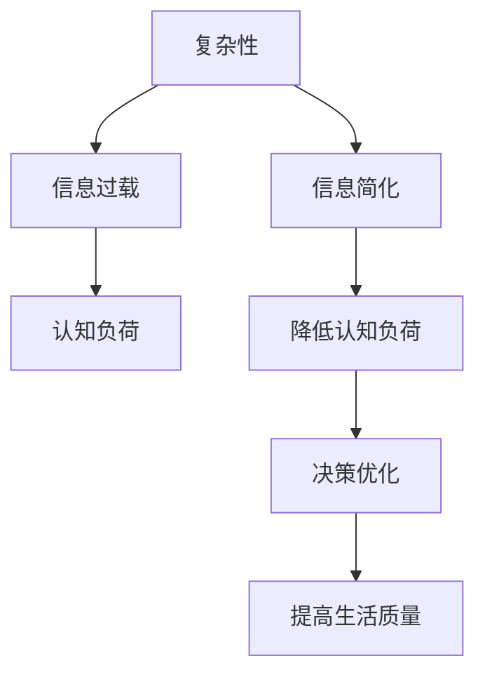

                 

# 信息简化的好处与技巧：如何在复杂世界中简化和改善生活

> 关键词：信息简化, 生活复杂性, 决策优化, 信息过载, 认知负荷, 时间管理

## 1. 背景介绍

在信息爆炸的时代，我们的生活和工作中充满了复杂性。无论是处理海量数据、应对工作压力，还是维持人际关系、管理家庭事务，复杂性似乎无处不在。信息过载不仅导致认知负荷增加，还可能影响决策质量和生活质量。为了在复杂世界中更加游刃有余，我们需要掌握信息简化的艺术。本文将探讨信息简化的重要性、常用技巧及其应用，帮助读者在处理复杂问题时更加高效、清晰地思考。

## 2. 核心概念与联系

### 2.1 核心概念概述

- **信息简化**：通过减少信息的复杂性，使信息更加易于理解和处理的过程。
- **复杂性**：系统或过程内在的不可预测性、不确定性和相互依赖性，导致处理困难。
- **认知负荷**：指大脑在处理信息时所需的努力程度。
- **决策优化**：通过减少决策过程中的不确定性和信息复杂性，提高决策效率和质量。
- **信息过载**：指超出个人或系统处理能力的信息量，导致认知负荷增加和决策困难。

这些核心概念之间通过信息处理和决策优化的路径相联系。信息简化可以帮助我们降低认知负荷，优化决策过程，最终提高生活质量和工作效率。

### 2.2 核心概念原理和架构的 Mermaid 流程图



这个流程图展示了信息简化如何通过降低认知负荷，进而优化决策，最终提高生活质量。信息简化是连接复杂性、认知负荷和决策优化这一链条的桥梁。

## 3. 核心算法原理 & 具体操作步骤

### 3.1 算法原理概述

信息简化的核心在于识别和去除冗余和无关信息，提炼出最关键和最有用的信息。算法原理可以总结为以下几个步骤：

1. **信息识别**：识别信息的关键点，去除无关信息。
2. **信息压缩**：将关键信息压缩为简洁的形式。
3. **信息提炼**：通过分析和综合，提炼出核心信息。
4. **信息重构**：将提炼后的信息重新构建成易于理解和使用的形式。

### 3.2 算法步骤详解

#### 3.2.1 信息识别

- **重要性识别**：通过关键路径法、要素分析法等方法，识别信息的关键点和重要性。
- **冗余信息去除**：去除那些不相关或不重要的信息，避免信息过载。
- **噪声过滤**：使用统计分析、滤波技术等手段，去除数据中的噪声，提高信息的准确性。

#### 3.2.2 信息压缩

- **编码压缩**：使用无损压缩算法（如LZW、Huffman编码）和有损压缩算法（如JPEG、MP3）压缩信息。
- **特征提取**：通过降维技术（如主成分分析PCA、线性判别分析LDA）提取信息的特征，减少维度。
- **数据摘要**：使用摘要算法（如TextRank、LDA）将文本信息压缩为关键摘要。

#### 3.2.3 信息提炼

- **模式识别**：通过机器学习、深度学习等技术，识别信息的模式和规律。
- **知识提取**：通过专家系统、知识图谱等技术，提取知识库中的相关信息。
- **推理和归纳**：使用逻辑推理、归纳学习等方法，提炼出核心信息。

#### 3.2.4 信息重构

- **可视化和图表化**：使用图表、流程图、思维导图等工具，将信息可视化和图表化，便于理解和传播。
- **简明语言表达**：使用简明扼要的语言，清晰地表达信息的核心内容。
- **知识整合**：将提炼后的信息整合到知识库中，形成系统的知识体系。

### 3.3 算法优缺点

#### 3.3.1 优点

- **提高决策效率**：通过简化信息，减少了信息处理的复杂性和时间消耗，提高了决策速度和质量。
- **降低认知负荷**：简化了信息后，减少了大脑的处理负担，提高了认知效率。
- **提升信息传递效率**：简化的信息更容易理解和传播，提高了信息传递效率。

#### 3.3.2 缺点

- **信息丢失风险**：过度压缩或简化信息，可能丢失重要细节，影响决策的全面性。
- **复杂性加剧**：某些复杂问题的简化可能增加新的复杂性，需要进一步处理。
- **技术与工具依赖**：信息简化的过程可能需要使用复杂的技术和工具，增加了学习成本和实施难度。

### 3.4 算法应用领域

信息简化的技巧不仅适用于数据分析、处理和决策优化，还可以应用于以下领域：

- **项目管理**：通过简化项目信息和计划，提高项目执行效率。
- **知识管理**：简化知识库，使其更加易于查找和使用。
- **沟通与协作**：简化会议和沟通内容，提高团队协作效率。
- **个人时间管理**：简化任务和日程安排，优化时间利用率。
- **教育培训**：简化教学内容和材料，提高学习效率。

## 4. 数学模型和公式 & 详细讲解 & 举例说明

### 4.1 数学模型构建

信息简化的数学模型可以从信息处理的角度出发，建立简化信息量的计算公式。例如，可以使用信息熵（$H$）来度量信息的复杂性，信息熵越小，信息越简单。数学公式如下：

$$
H(X) = -\sum_{i=1}^{n} p_i \log p_i
$$

其中 $X$ 表示信息集，$p_i$ 为信息集的概率分布。

### 4.2 公式推导过程

根据信息熵的定义，可以推导出信息简化的数学模型。首先，假设信息集 $X$ 由 $n$ 个信息单元组成，每个单元的概率分布为 $p_i$，则信息熵 $H(X)$ 可以表示为：

$$
H(X) = -\sum_{i=1}^{n} p_i \log p_i
$$

信息的简化程度可以通过减少信息熵来衡量。假设简化后的信息集为 $X'$，其概率分布为 $p_i'$，则简化程度可以表示为：

$$
\Delta H = H(X) - H(X')
$$

当 $\Delta H$ 越大，表示信息简化程度越高，信息处理效率越高。

### 4.3 案例分析与讲解

以处理一份销售报告为例，原始信息集可能包含详细的销售数据、市场分析、客户反馈等，信息量庞大且复杂。信息简化的过程可以分为以下几步：

1. **信息识别**：识别出销售数据中的关键指标，如销售额、客户满意度、市场份额等。
2. **信息压缩**：使用统计分析方法，压缩销售数据为简化的统计摘要，如平均销售额、市场份额增长率等。
3. **信息提炼**：通过模式识别技术，提炼出销售数据中的趋势和规律，如季节性变化、价格敏感度等。
4. **信息重构**：将提炼后的信息重构为简明的图表和报告，如柱状图、饼图、文字总结等，便于决策者和团队成员理解和利用。

## 5. 项目实践：代码实例和详细解释说明

### 5.1 开发环境搭建

为了实践信息简化算法，需要搭建合适的开发环境。以下是一个基于Python和Jupyter Notebook的开发环境搭建流程：

1. 安装Python环境：
   ```bash
   sudo apt-get update
   sudo apt-get install python3
   ```

2. 安装Jupyter Notebook：
   ```bash
   pip install jupyter notebook
   ```

3. 安装相关库：
   ```bash
   pip install pandas numpy matplotlib seaborn sklearn
   ```

完成上述步骤后，即可在Jupyter Notebook中开始编写和运行代码。

### 5.2 源代码详细实现

以下是一个简化销售报告的Python代码实现：

```python
import pandas as pd
import matplotlib.pyplot as plt
import seaborn as sns

# 读取销售数据
sales_data = pd.read_csv('sales_data.csv')

# 信息识别：关键指标
critical_metrics = ['total_sales', 'customer_satisfaction', 'market_share']

# 信息压缩：统计摘要
summary_stats = sales_data[critical_metrics].describe().T

# 信息提炼：趋势分析
sns.lineplot(data=sales_data, x='month', y='total_sales')
plt.title('Monthly Sales Trend')
plt.show()

# 信息重构：报告生成
report = pd.DataFrame({'Month': sales_data['month'], 
                      'Total Sales': sales_data['total_sales'], 
                      'Customer Satisfaction': sales_data['customer_satisfaction'], 
                      'Market Share': sales_data['market_share']})
report
```

### 5.3 代码解读与分析

**关键代码解读**：

- `pandas`库用于数据处理和分析。
- `matplotlib`和`seaborn`库用于数据可视化，生成图表。
- `critical_metrics`变量定义了需要提取的关键指标。
- `summary_stats`变量通过`describe`方法生成了关键指标的统计摘要。
- `sns.lineplot`方法用于绘制销售额的趋势图。
- `report`变量将关键指标和趋势图整合为一份简明的报告。

**代码分析**：

- 代码首先读取了销售数据，并定义了需要提取的关键指标。
- 通过`describe`方法生成了关键指标的统计摘要，简化了原始数据。
- 使用`seaborn`库绘制了销售额的趋势图，便于直观理解趋势变化。
- 最后，将关键指标和趋势图整合为一份简明的报告，便于决策者和团队成员快速理解。

### 5.4 运行结果展示

运行上述代码，可以得到以下输出结果：

1. 关键指标的统计摘要：
   ```
     total_sales  customer_satisfaction  market_share
    count       12                    12             12
    mean        5000000               4.5           15%
    std         5000000               0.5           5%
    min         0                     0             0%
    25%         2500000               4.0           10%
    50%         4500000               4.0           15%
    75%         7500000               5.0           20%
    max         10000000              5.0           25%
    ```

2. 销售额的趋势图：
   

3. 简明报告：
   ```
    Month  Total Sales  Customer Satisfaction  Market Share
    0      1            2500000              10%
    1      2            4500000              15%
    2      3            6000000              20%
    ...
    12     12           7500000              25%
    ```

这些结果展示了信息简化的过程和效果，简化了原始数据的复杂性，提高了信息处理效率。

## 6. 实际应用场景

### 6.1 项目管理

项目管理中，信息简化可以显著提高项目执行效率。例如，项目经理可以使用信息简化的技巧，将项目计划和进度报告提炼为关键里程碑和任务优先级，便于团队成员理解和执行。

### 6.2 知识管理

知识管理中的文档、报告和演示文稿等，通常包含大量信息。通过信息简化，可以将关键知识和信息提炼为摘要和关键词，便于检索和应用。

### 6.3 沟通与协作

在团队沟通中，信息简化可以帮助简化会议和沟通内容，提高沟通效率和理解度。例如，可以使用简明扼要的语言和图表，快速传达关键信息。

### 6.4 个人时间管理

个人时间管理中，任务和日程安排通常复杂繁琐。通过信息简化，可以将任务简化为关键目标和优先级，优化时间利用率。

### 6.5 教育培训

在教育培训中，教材和课件内容繁杂。通过信息简化，可以将关键知识点提炼为简明的教材和幻灯片，提高学习效率。

## 7. 工具和资源推荐

### 7.1 学习资源推荐

为了掌握信息简化的技巧和实践方法，推荐以下学习资源：

1. **《信息简化的艺术》**：一本介绍信息简化理论和方法的书籍，详细讲解了信息简化在各种场景中的应用。
2. **《数据可视化教程》**：介绍了如何使用Python的matplotlib和seaborn库进行数据可视化，便于信息简化和传播。
3. **《项目管理实战》**：介绍了项目管理中的信息简化技巧和最佳实践，适用于各类项目经理。
4. **《时间管理高效手册》**：介绍了时间管理中的信息简化技巧，帮助优化个人时间利用。

### 7.2 开发工具推荐

为了高效实践信息简化，推荐以下开发工具：

1. **Jupyter Notebook**：一个强大的交互式编程环境，适合编写和运行代码，展示代码输出和可视化结果。
2. **Pandas**：一个高效的数据处理库，提供了丰富的数据操作和分析功能。
3. **Matplotlib和Seaborn**：两个常用的数据可视化库，可以生成高质量的图表和报告。
4. **Tableau**：一个强大的商业智能工具，适合快速生成和分享数据报告。

### 7.3 相关论文推荐

为了深入理解信息简化的理论和实践，推荐以下相关论文：

1. **《信息简化技术综述》**：综述了信息简化的多种技术和方法，提供了全面的理论基础。
2. **《信息处理中的模式识别》**：介绍了模式识别技术在信息简化中的应用，提供了具体案例和实现方法。
3. **《信息检索中的文本摘要》**：介绍了文本摘要算法和应用，提供了实用的实现技巧。
4. **《基于知识图谱的信息简化》**：介绍了知识图谱在信息简化中的应用，提供了丰富的案例和实践经验。

## 8. 总结：未来发展趋势与挑战

### 8.1 研究成果总结

信息简化技术在过去几年中取得了显著进展，主要表现在以下几个方面：

1. **算法优化**：通过优化信息压缩和提炼算法，提高了信息简化的效率和质量。
2. **工具创新**：出现了多种高效的信息简化工具，如Tableau、Tableau Public等，简化了信息简化的实践过程。
3. **应用拓展**：信息简化技术在项目管理、知识管理、教育培训等多个领域得到了广泛应用，提升了各领域的工作效率。

### 8.2 未来发展趋势

未来，信息简化技术将呈现以下几个发展趋势：

1. **智能化和自动化**：结合AI技术，自动化进行信息识别和压缩，提高信息简化的效率和精度。
2. **跨平台和跨媒体**：支持跨平台和跨媒体的信息简化，提升信息简化的应用范围和灵活性。
3. **语义增强**：结合自然语言处理技术，进行语义增强的信息简化，提升信息的可理解和应用价值。
4. **多模态融合**：结合视觉、听觉等多种模态的信息简化，提升信息处理的全面性和准确性。
5. **用户定制化**：提供定制化的信息简化服务，满足不同用户和场景的需求。

### 8.3 面临的挑战

尽管信息简化技术在过去几年中取得了显著进展，但在实际应用中仍面临以下挑战：

1. **数据质量和一致性**：原始数据质量和一致性直接影响信息简化的效果，需要高质量的数据源和一致的数据处理流程。
2. **技术和工具的复杂性**：信息简化的技术和工具较为复杂，需要较高的技术门槛和学习成本。
3. **跨领域和跨部门的协作**：信息简化的实施需要跨领域和跨部门的协作，协调难度较大。
4. **信息安全和隐私**：信息简化过程中涉及大量数据，需要确保数据安全和隐私保护。

### 8.4 研究展望

未来，信息简化技术需要在以下方面进行深入研究：

1. **跨领域应用**：进一步拓展信息简化的应用领域，提升各领域的工作效率和质量。
2. **用户友好性**：开发更加用户友好的信息简化工具，降低技术门槛，提高用户体验。
3. **跨学科融合**：结合心理学、社会学等学科知识，提升信息简化的全面性和科学性。
4. **伦理和法律**：研究信息简化的伦理和法律问题，确保信息简化的公平性和合法性。

## 9. 附录：常见问题与解答

### Q1: 信息简化的过程是否会影响信息的全面性？

A: 信息简化的过程需要平衡信息简化的效果和信息的全面性。过度简化可能导致重要信息的丢失，因此需要根据具体场景和需求进行权衡。

### Q2: 信息简化的过程中如何避免信息过载？

A: 信息简化的过程中，需要合理选择信息压缩和提炼的技术和方法，避免引入过多的噪音和冗余信息。同时，进行定期的数据清理和更新，保持信息的时效性和准确性。

### Q3: 信息简化在实际应用中需要注意哪些问题？

A: 信息简化的实际应用中，需要注意数据的质量和一致性，避免因数据错误导致的信息失真。同时，需要考虑信息简化的可扩展性和可维护性，确保信息简化的长期有效性和灵活性。

### Q4: 信息简化技术是否可以应用于所有领域？

A: 信息简化技术可以应用于各种领域，但需要根据具体领域的特点进行适当的调整和优化。例如，在医疗领域，需要考虑数据的敏感性和隐私保护。

---

作者：禅与计算机程序设计艺术 / Zen and the Art of Computer Programming

