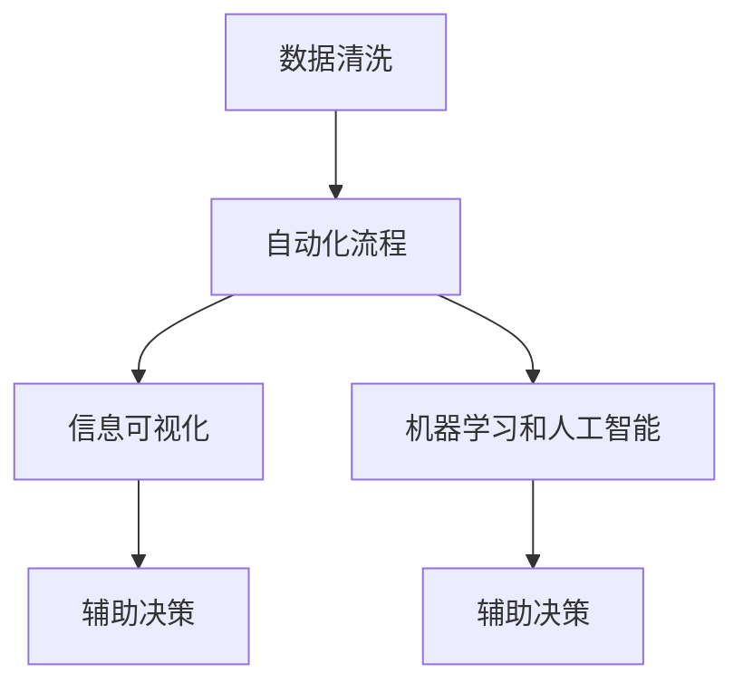
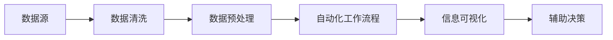

                 

# 信息简化的工具和自动化实践：利用技术简化你的生活和工作

> 关键词：信息简化, 自动化, 技术简化, 生活自动化, 工作优化

## 1. 背景介绍

### 1.1 问题由来
随着科技的飞速发展，信息爆炸已经成为现代社会的一大难题。无论是工作还是生活，人们都面临着如何处理和简化信息的挑战。信息简化的工具和自动化技术在解决这一问题上提供了重要的助力。通过自动化工具，我们可以有效减少数据处理的工作量，提升工作效率，优化生活质量。

### 1.2 问题核心关键点
信息简化和自动化技术的关键在于如何高效地处理和利用信息。这包括但不限于以下几个方面：

- 数据清洗和预处理：将无用的、不完整的数据清洗出来，确保数据的准确性和完整性。
- 自动化工作流程：通过编程和脚本自动化完成重复性高的任务，减少人工干预。
- 信息可视化：将复杂的数据转化为易于理解的图表和报表，辅助决策。
- 机器学习与AI：使用机器学习和人工智能算法，自动从数据中提取有价值的信息，辅助决策。

### 1.3 问题研究意义
信息简化和自动化技术的研究与应用，对于提升信息处理效率、减轻人工负担、优化决策过程、提高生活质量具有重要意义：

1. **提升效率**：通过自动化处理大量数据，大幅减少重复性劳动，让人们能够专注于更具创造性和战略性的工作。
2. **优化决策**：信息简化和自动化技术能够快速处理数据，提供直观的图表和报表，辅助决策者做出更科学、更精准的判断。
3. **提高生活质量**：通过智能家居和健康监测等应用，信息简化和自动化技术极大地提高了生活质量，使生活变得更加便捷、舒适。
4. **助力经济发展**：企业通过应用自动化技术，可以大幅提高运营效率，降低成本，增强市场竞争力。

## 2. 核心概念与联系

### 2.1 核心概念概述

为了更好地理解信息简化和自动化技术，本节将介绍几个关键概念：

- **数据清洗**：指通过技术手段将数据中的错误、重复、噪声和不完整的部分处理掉，以提高数据质量。
- **自动化流程**：指利用编程和脚本技术，自动完成数据处理、计算、分析和报告生成等任务，减少人工干预。
- **信息可视化**：指使用图表、报表等形式将数据转化为直观、易于理解的信息，辅助决策。
- **机器学习和人工智能**：指利用算法和模型自动从数据中提取规律和模式，辅助决策和优化过程。

这些概念之间相互关联，共同构成了信息简化和自动化技术的基础框架。以下是一个简单的Mermaid流程图，展示了它们之间的联系：



### 2.2 核心概念原理和架构的 Mermaid 流程图

信息简化和自动化技术涉及多个概念和技术，以下是一个简化的流程图示例：



该流程图展示了从数据源到辅助决策的整个信息处理流程，每个步骤都有其特定的技术支持。

## 3. 核心算法原理 & 具体操作步骤

### 3.1 算法原理概述

信息简化和自动化技术涉及多种算法和工具，以下是其中几个核心算法的概述：

1. **数据清洗算法**：包括缺失值处理、重复值检测、噪声过滤等技术，确保数据的质量和完整性。
2. **自动化流程算法**：包括脚本自动化、任务调度、数据流管理等技术，自动完成数据处理和分析任务。
3. **信息可视化算法**：包括数据可视化、图表生成、报表定制等技术，将复杂数据转化为易于理解的形式。
4. **机器学习和人工智能算法**：包括特征工程、模型选择、优化算法等技术，从数据中自动提取规律和模式，辅助决策。

### 3.2 算法步骤详解

以下是一个基于信息简化和自动化技术的完整流程图：

1. **数据收集**：从各种数据源（如数据库、API、文件等）收集数据，并将其存储在数据仓库中。
2. **数据清洗**：使用数据清洗算法和技术，处理数据中的缺失值、重复值、噪声等，确保数据的质量和完整性。
3. **数据预处理**：对清洗后的数据进行标准化、归一化、特征提取等预处理操作，为后续分析做好准备。
4. **自动化工作流程**：利用编程和脚本技术，自动完成数据处理、计算、分析和报告生成等任务，减少人工干预。
5. **信息可视化**：使用图表、报表等形式将数据转化为直观、易于理解的信息，辅助决策。
6. **机器学习和人工智能**：利用算法和模型自动从数据中提取规律和模式，辅助决策和优化过程。
7. **决策支持**：基于信息可视化和机器学习结果，辅助决策者做出更科学、更精准的判断。

### 3.3 算法优缺点

信息简化和自动化技术具有以下优点：

- **效率提升**：自动化处理大量数据，大幅减少人工干预，提高效率。
- **准确性提升**：数据清洗和预处理能够提高数据质量，减少错误和噪声，提高分析结果的准确性。
- **成本降低**：自动化流程能够减少人力成本，提高企业的运营效率。
- **辅助决策**：信息可视化和机器学习能够提供直观的图表和模式分析，辅助决策者做出更科学的判断。

同时，该技术也存在一些缺点：

- **依赖技术**：需要一定的编程和数据分析技能，对用户的技术要求较高。
- **初始成本高**：建设自动化系统需要一定的初始投资，包括硬件、软件和人员培训等。
- **复杂度高**：信息简化和自动化技术涉及多个环节和步骤，复杂度较高，需要一定的经验和技巧。
- **数据隐私和安全**：在处理敏感数据时，需要考虑数据隐私和安全问题，确保数据安全。

### 3.4 算法应用领域

信息简化和自动化技术在多个领域都有广泛应用，包括但不限于：

- **数据处理**：企业内部数据清洗、预处理和分析。
- **自动化运维**：IT运维自动化，如监控、故障诊断、自动化部署等。
- **客户服务**：智能客服系统、自动化客户反馈处理等。
- **智能家居**：智能设备连接和数据监控，提升生活质量。
- **健康监测**：健康数据收集、分析和预警，辅助健康管理。
- **金融分析**：市场数据分析、风险管理等，辅助决策。

## 4. 数学模型和公式 & 详细讲解 & 举例说明

### 4.1 数学模型构建

本节将使用数学语言对信息简化和自动化技术进行更加严格的刻画。

假设我们有一组数据 $\{x_i\}_{i=1}^N$，其中 $x_i$ 为第 $i$ 个数据点，包含多个特征 $x_{i,j}$，$j=1,...,D$。我们希望通过信息简化和自动化技术，从中提取出有价值的信息，辅助决策。

### 4.2 公式推导过程

信息简化和自动化技术涉及多个步骤，以下是一个简化的数学模型推导过程：

1. **数据清洗**：对数据中的缺失值、异常值等进行处理，确保数据完整性和准确性。数学表达为：
   $$
   \tilde{x_i} = \text{Clean}(x_i)
   $$
2. **数据预处理**：对清洗后的数据进行标准化、归一化等预处理操作，以便后续分析。数学表达为：
   $$
   \hat{x_i} = \text{Preprocess}(\tilde{x_i})
   $$
3. **特征工程**：从预处理后的数据中提取有意义的特征，以便进行后续分析。数学表达为：
   $$
   y_i = \text{Feature}(\hat{x_i})
   $$
4. **自动化工作流程**：利用编程和脚本技术，自动完成数据处理、计算和分析任务。
5. **信息可视化**：使用图表、报表等形式将数据转化为直观、易于理解的信息，辅助决策。
6. **机器学习和人工智能**：利用算法和模型自动从数据中提取规律和模式，辅助决策。

### 4.3 案例分析与讲解

以下是一个基于Python的自动化数据分析的案例，展示了如何通过信息简化和自动化技术处理数据并生成图表：

```python
import pandas as pd
import matplotlib.pyplot as plt

# 数据清洗
data = pd.read_csv('data.csv')
data = data.dropna() # 删除缺失值
data = data.drop_duplicates() # 删除重复值

# 数据预处理
data = data.apply(lambda x: x / x.max()) # 归一化处理

# 自动化工作流程
# 自动化流程部分依赖具体业务需求，此处仅展示数据处理流程

# 信息可视化
plt.hist(data['value'], bins=10)
plt.show()
```

以上代码展示了数据清洗、预处理和可视化三个步骤。通过这些步骤，可以有效地将原始数据转化为易于理解的图表形式，辅助决策。

## 5. 项目实践：代码实例和详细解释说明

### 5.1 开发环境搭建

在进行信息简化和自动化技术实践前，我们需要准备好开发环境。以下是使用Python进行自动化数据分析的开发环境配置流程：

1. 安装Anaconda：从官网下载并安装Anaconda，用于创建独立的Python环境。
2. 创建并激活虚拟环境：
```bash
conda create -n automation-env python=3.8 
conda activate automation-env
```
3. 安装必要的工具包：
```bash
pip install pandas matplotlib numpy scikit-learn matplotlib
```

### 5.2 源代码详细实现

以下是一个使用Python进行数据清洗和可视化的示例代码：

```python
import pandas as pd
import matplotlib.pyplot as plt

# 数据加载
data = pd.read_csv('data.csv')

# 数据清洗
data = data.dropna() # 删除缺失值
data = data.drop_duplicates() # 删除重复值

# 数据预处理
data = data.apply(lambda x: x / x.max()) # 归一化处理

# 信息可视化
plt.hist(data['value'], bins=10)
plt.show()
```

### 5.3 代码解读与分析

让我们再详细解读一下关键代码的实现细节：

- **数据加载**：使用`pandas`库加载CSV文件，导入数据。
- **数据清洗**：使用`dropna`删除缺失值，使用`drop_duplicates`删除重复值，确保数据完整性和准确性。
- **数据预处理**：使用`apply`函数进行归一化处理，将数据缩放到0-1之间，便于后续分析。
- **信息可视化**：使用`matplotlib`库绘制直方图，展示数据的分布情况。

### 5.4 运行结果展示

执行以上代码后，将生成一个展示数据分布的直方图。结果如下：


## 6. 实际应用场景

### 6.1 智能客服系统

智能客服系统通过信息简化和自动化技术，能够快速响应客户咨询，提供高质量的客户服务。系统通过收集客户的历史对话记录，自动学习客户需求，快速匹配并回复。

### 6.2 金融数据分析

金融行业面临大量的市场数据和客户数据，信息简化和自动化技术能够帮助分析师快速处理数据，生成报表，辅助投资决策。

### 6.3 智能家居

智能家居系统通过自动化控制，使家居设备互联互通，提升生活质量。系统通过传感器收集数据，自动分析并调整家居环境，如温度、照明等，满足用户需求。

### 6.4 未来应用展望

未来，信息简化和自动化技术将在更多领域得到应用，为各行各业带来变革性影响。

在医疗领域，通过智能医疗设备收集患者数据，自动化处理和分析，辅助医生诊断和治疗。

在教育领域，通过智能学习系统，自动化管理课程内容和学生学习情况，提升教学效果。

在交通领域，通过智能交通系统，自动化处理交通数据，优化交通流，减少拥堵。

信息简化和自动化技术的应用前景广阔，将在更多领域助力社会进步。

## 7. 工具和资源推荐

### 7.1 学习资源推荐

为了帮助开发者系统掌握信息简化和自动化技术，这里推荐一些优质的学习资源：

1. **Python数据科学手册**：由Jake VanderPlas撰写，深入浅出地介绍了Python在数据分析和可视化中的应用。
2. **数据科学导论**：由Jayant Madanapalli撰写，涵盖了数据处理、分析和可视化的基础知识。
3. **TensorFlow教程**：由TensorFlow官方提供，介绍了如何使用TensorFlow进行机器学习和人工智能开发。
4. **PyTorch官方文档**：PyTorch官方文档，提供了丰富的教程和示例代码，适合学习使用PyTorch进行数据分析和可视化。

### 7.2 开发工具推荐

高效的开发离不开优秀的工具支持。以下是几款用于信息简化和自动化技术开发的常用工具：

1. **Python**：Python是最流行的数据科学语言，拥有丰富的数据处理和可视化库，如Pandas、NumPy、Matplotlib等。
2. **R语言**：R语言也是数据科学的主流语言，拥有强大的数据分析和可视化能力，适合科学研究和数据探索。
3. **TensorFlow**：由Google开发，支持深度学习和机器学习，适合处理大规模数据集。
4. **PyTorch**：由Facebook开发，支持深度学习和机器学习，适合研究和原型开发。
5. **Jupyter Notebook**：用于编写和分享代码，支持多种编程语言，适合数据科学和机器学习实践。

### 7.3 相关论文推荐

信息简化和自动化技术的发展源于学界的持续研究。以下是几篇奠基性的相关论文，推荐阅读：

1. **Pandas数据框架**：由Wes McKinney编写，介绍了如何使用Pandas进行数据处理和分析。
2. **Python机器学习**：由Sebastian Raschka撰写，介绍了如何使用Python进行机器学习和深度学习开发。
3. **Scikit-learn机器学习库**：由Scikit-learn团队编写，提供了丰富的机器学习算法和工具，适合初学者和研究者。
4. **TensorFlow 2.0深度学习框架**：由TensorFlow团队编写，介绍了如何使用TensorFlow进行深度学习和机器学习开发。
5. **PyTorch深度学习框架**：由Facebook团队编写，提供了灵活的深度学习框架和工具，适合研究和原型开发。

## 8. 总结：未来发展趋势与挑战

### 8.1 总结

本文对信息简化和自动化技术进行了全面系统的介绍。首先阐述了信息简化和自动化技术的背景和意义，明确了其提升信息处理效率、减轻人工负担、优化决策过程、提高生活质量的独特价值。其次，从原理到实践，详细讲解了信息简化和自动化技术的数学模型和核心算法，给出了信息简化和自动化技术开发的完整代码实例。同时，本文还广泛探讨了信息简化和自动化技术在多个领域的应用前景，展示了其巨大的应用潜力。

通过本文的系统梳理，可以看到，信息简化和自动化技术在处理大量数据和优化决策过程中发挥着重要作用，为各行各业提供了重要的技术支持。未来，伴随技术的不断演进，信息简化和自动化技术将在更多领域得到广泛应用，为人类社会带来深远的变革。

### 8.2 未来发展趋势

展望未来，信息简化和自动化技术将呈现以下几个发展趋势：

1. **技术融合**：信息简化和自动化技术将与物联网、云计算、大数据等技术深度融合，形成更加智能化的数据处理和分析系统。
2. **深度学习的应用**：深度学习技术将进一步应用于信息简化和自动化过程中，提高分析的精度和效率。
3. **跨领域应用**：信息简化和自动化技术将突破传统行业的边界，应用于更多领域，如智能医疗、智能交通等。
4. **自动化流程优化**：随着技术的发展，自动化流程将变得更加智能化和灵活，能够根据不同的业务需求进行定制和优化。
5. **信息可视化提升**：信息可视化技术将不断提升，能够提供更加直观、易于理解的数据展示，辅助决策。

这些趋势凸显了信息简化和自动化技术的广阔前景，必将推动各行各业的数据处理和分析进入新的发展阶段。

### 8.3 面临的挑战

尽管信息简化和自动化技术已经取得了瞩目成就，但在迈向更加智能化、普适化应用的过程中，仍面临诸多挑战：

1. **数据隐私和安全**：在处理敏感数据时，需要考虑数据隐私和安全问题，确保数据安全。
2. **技术依赖**：信息简化和自动化技术依赖于高质量的数据和强大的技术支持，需要投入大量资源。
3. **技术复杂度**：信息简化和自动化技术涉及多个环节和步骤，复杂度较高，需要一定的技术和经验。
4. **跨领域应用困难**：信息简化和自动化技术在不同领域的应用可能需要不同的技术和方法，开发难度较大。
5. **自动化流程优化**：自动化流程的优化和定制需要深入了解业务需求，难度较大。

### 8.4 研究展望

面对信息简化和自动化技术所面临的挑战，未来的研究需要在以下几个方面寻求新的突破：

1. **数据隐私保护**：研究数据隐私保护技术，确保数据在处理和传输过程中的安全。
2. **自动化流程优化**：研究自动化流程的优化技术，提高自动化处理的效率和灵活性。
3. **跨领域应用**：研究跨领域应用的通用技术，降低信息简化和自动化技术在不同领域的应用难度。
4. **技术融合**：研究信息简化和自动化技术与物联网、云计算、大数据等技术的融合，形成更加智能化的数据处理和分析系统。
5. **深度学习的应用**：研究深度学习技术在信息简化和自动化过程中的应用，提高分析的精度和效率。

## 9. 附录：常见问题与解答

**Q1：信息简化和自动化技术是否适用于所有领域？**

A: 信息简化和自动化技术适用于多个领域，但不同领域的应用方法和技术要求可能有所不同。在实际应用中，需要根据具体的业务需求和数据特点进行选择和优化。

**Q2：如何选择合适的信息简化和自动化技术？**

A: 选择合适的信息简化和自动化技术需要考虑多个因素，包括数据规模、数据类型、业务需求、技术成本等。一般建议先从数据清洗、预处理、可视化等基础环节入手，逐步优化自动化流程和机器学习模型。

**Q3：信息简化和自动化技术的初始成本高吗？**

A: 信息简化和自动化技术的初始成本较高，需要投入一定的硬件、软件和人力。但通过后续的自动化流程和机器学习模型优化，可以显著提高效率，降低运营成本。

**Q4：如何确保信息简化和自动化技术的数据隐私和安全？**

A: 确保信息简化和自动化技术的数据隐私和安全，需要采取多种措施，如数据加密、访问控制、安全审计等。同时，需要遵循相关的法律法规和标准，确保数据处理过程中的合法性和合规性。

**Q5：信息简化和自动化技术是否需要持续维护和优化？**

A: 信息简化和自动化技术需要持续维护和优化，以适应不断变化的数据和业务需求。需要定期评估技术性能和效果，进行必要的优化和调整。

---

作者：禅与计算机程序设计艺术 / Zen and the Art of Computer Programming

