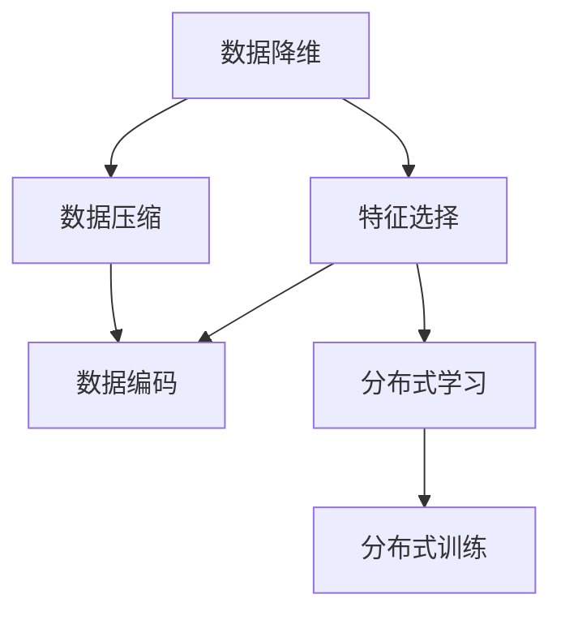

                 

# 信息简化的艺术与科学应用：在混乱和复杂中找到模式和简化

## 1. 背景介绍

### 1.1 问题由来

随着数据量的激增，以及业务场景的日益复杂，如何从庞杂的数据中提取出有价值的信息，成为了信息科学领域的一大难题。传统的处理方法，如线性回归、逻辑回归、决策树等，对于大规模高维数据已经显得力不从心。与此同时，新兴的深度学习技术，尤其是神经网络在图像、语音等领域已经展现出了巨大的潜力，但在处理结构化数据和文本信息时，仍然存在诸多挑战。

正是在这种背景下，信息简化技术应运而生。其核心思想是通过学习数据的潜在结构和模式，对原始数据进行降维、压缩，从而实现信息的高效提取和表示。其应用不仅局限于大数据分析，更广泛地渗透到了人工智能、自然语言处理、计算机视觉等领域，为解决复杂问题提供了新的思路。

### 1.2 问题核心关键点

信息简化技术的研究热点主要集中在以下几个方面：

- **降维技术**：通过减少数据的维度，去除冗余信息，提升数据处理效率和模型性能。
- **特征选择与提取**：自动筛选重要特征，去除无关信息，提升模型泛化能力和精度。
- **压缩与编码**：采用多种算法将高维数据压缩成低维表示，便于存储和处理。
- **分布式与分布式学习**：分布式算法可以更好地应对大规模数据的处理需求，提升计算效率。

本文将重点探讨信息简化的核心算法原理、具体操作步骤，并结合具体案例进行详细讲解。通过学习本文，读者将能够掌握信息简化的关键技术和实际应用方法，从而在实际工作中，更高效地处理和利用信息。

## 2. 核心概念与联系

### 2.1 核心概念概述

为更好地理解信息简化的原理和应用，本节将介绍几个核心概念及其相互联系：

- **数据降维**：通过线性变换或非线性变换，将高维数据映射到低维空间。常见的降维方法包括主成分分析(PCA)、奇异值分解(SVD)、t-SNE等。
- **特征选择与提取**：从原始数据中自动筛选出最具信息量的特征，常用于减少特征空间的维度，提升模型的泛化能力。特征选择方法包括基于模型的选择方法、基于树的特征选择方法、基于深度学习的方法等。
- **数据压缩与编码**：通过损失函数最小化，将高维数据压缩到低维空间。常见的方法包括自编码器、变分自编码器(VAE)、生成对抗网络(GAN)等。
- **分布式学习**：通过并行计算和通信，将大规模数据的处理任务分布在多台计算机上，提升计算效率。

这些概念之间的联系可以通过以下Mermaid流程图来展示：



该图展示了数据降维、特征选择、数据压缩与编码、分布式学习之间的逻辑关系：

1. 数据降维和特征选择都可以用于减少数据维度，提高计算效率。
2. 数据压缩与编码则是通过损失函数最小化，将数据映射到低维空间。
3. 分布式学习用于并行计算和通信，提升大规模数据处理的效率。

## 3. 核心算法原理 & 具体操作步骤
### 3.1 算法原理概述

信息简化技术的核心原理在于利用数据的内在结构和模式，通过学习数据分布，对数据进行降维、特征选择和编码，从而实现信息的压缩和表示。其核心思想是通过损失函数最小化，对数据进行映射，保留关键特征，去除冗余信息，实现信息的简化。

形式化地，假设原始数据集为 $X \in \mathbb{R}^{n \times d}$，其中 $n$ 为样本数量，$d$ 为特征维度。信息简化过程的目标是找到一个映射函数 $f$，将数据映射到一个低维空间 $Y \in \mathbb{R}^{n \times m}$，其中 $m$ 为低维空间维度。

常用的信息简化方法包括：

- **PCA（主成分分析）**：通过线性变换，将数据映射到一个新的坐标系，使得映射后的数据在新的坐标系下具有最大的方差。
- **SVD（奇异值分解）**：通过分解矩阵，将数据表示为几个关键向量的线性组合。
- **t-SNE（t分布随机邻域嵌入）**：通过非线性变换，将高维数据映射到低维空间，同时保留数据之间的局部结构。
- **自编码器（Autoencoder）**：通过编码-解码过程，学习数据的低维表示，同时保留数据的重构误差。

### 3.2 算法步骤详解

信息简化的具体操作过程包括以下几个关键步骤：

**Step 1: 准备原始数据**

- 收集并整理原始数据集 $X$。
- 对数据进行初步清洗和预处理，如去除异常值、处理缺失值等。

**Step 2: 选择合适的信息简化方法**

- 根据数据特点和需求，选择合适的信息简化方法。
- 常见的简化方法包括PCA、SVD、t-SNE、自编码器等。

**Step 3: 训练信息简化模型**

- 使用训练集对简化模型进行训练。
- 最小化损失函数，优化模型参数。
- 使用验证集对模型进行调优，确定最佳模型参数。

**Step 4: 应用简化模型**

- 使用简化模型对测试集数据进行降维或特征选择。
- 根据任务需求，进行后续处理和分析。

**Step 5: 评估和优化**

- 在测试集上评估简化后的模型性能。
- 根据评估结果，调整模型参数，优化简化效果。

### 3.3 算法优缺点

信息简化技术在提高数据处理效率和模型性能方面具有显著优势：

**优点：**

- **高效性**：通过降维和特征选择，大幅减少计算复杂度，提升数据处理速度。
- **泛化能力**：通过保留关键特征，提升模型泛化能力，避免过拟合。
- **可解释性**：简化后的数据和模型更易于理解和解释。

**缺点：**

- **维度灾难**：如果维度减少过度，可能会损失重要信息。
- **算法复杂度**：某些方法（如自编码器）训练复杂度较高，计算资源需求大。
- **适用性有限**：对非线性数据和复杂结构数据的处理效果有限。

尽管存在这些局限性，但信息简化技术仍然是大数据处理和深度学习模型的重要工具。未来研究将进一步改进算法，提高其应用范围和效率。

### 3.4 算法应用领域

信息简化技术在多个领域得到了广泛应用：

- **大数据分析**：通过降维和特征选择，提升数据处理效率。
- **计算机视觉**：通过特征选择和数据压缩，提升图像处理速度。
- **自然语言处理**：通过特征选择和编码，提升文本分类、情感分析等任务的性能。
- **推荐系统**：通过特征选择和降维，提升推荐算法的效果。
- **金融风控**：通过降维和特征选择，提高风险评估模型的准确性。
- **生物信息学**：通过特征选择和编码，处理基因序列和蛋白质结构等复杂数据。

## 4. 数学模型和公式 & 详细讲解 & 举例说明

### 4.1 数学模型构建

形式化地，假设原始数据集 $X \in \mathbb{R}^{n \times d}$，其中 $n$ 为样本数量，$d$ 为特征维度。信息简化的目标是通过映射函数 $f$，将数据映射到一个低维空间 $Y \in \mathbb{R}^{n \times m}$，其中 $m$ 为低维空间维度。

常用的信息简化方法包括：

- **PCA（主成分分析）**：
$$
Y = WX + b
$$
其中 $W \in \mathbb{R}^{d \times m}$ 为权重矩阵，$b \in \mathbb{R}^{m}$ 为偏置向量。
- **SVD（奇异值分解）**：
$$
X = U\Sigma V^T
$$
其中 $U \in \mathbb{R}^{n \times k}$ 为左奇异矩阵，$\Sigma \in \mathbb{R}^{k \times k}$ 为奇异值矩阵，$V \in \mathbb{R}^{d \times k}$ 为右奇异矩阵。
- **t-SNE（t分布随机邻域嵌入）**：
$$
Y = WX + b
$$
其中 $W \in \mathbb{R}^{d \times m}$ 为权重矩阵，$b \in \mathbb{R}^{m}$ 为偏置向量。

### 4.2 公式推导过程

以下以PCA方法为例，推导降维过程的公式。

假设原始数据集 $X \in \mathbb{R}^{n \times d}$，其中 $n$ 为样本数量，$d$ 为特征维度。PCA的目标是通过线性变换，将数据映射到一个新的坐标系，使得映射后的数据在新的坐标系下具有最大的方差。

令 $X = WZ + b$，其中 $Z$ 为 $n \times m$ 的矩阵，$W$ 为 $d \times m$ 的权重矩阵，$b$ 为 $m$ 维的偏置向量。则数据矩阵 $X$ 可以表示为：

$$
X = WZ + b
$$

其中 $W$ 和 $b$ 需要满足：

$$
W^TW = I, \quad b = 0
$$

假设新坐标系下数据 $Y = WX + b$，则数据矩阵 $Y$ 的协方差矩阵为：

$$
C = E[(X - \mu)(X - \mu)^T] = E[(WZ + b - \mu)(WZ + b - \mu)^T]
$$

其中 $\mu$ 为数据均值。

将 $X$ 的协方差矩阵 $C$ 进行特征分解，得到特征值和特征向量 $U, V, \Lambda$：

$$
C = UV^T\Lambda V^T
$$

其中 $U \in \mathbb{R}^{d \times d}$ 为左特征矩阵，$V \in \mathbb{R}^{d \times d}$ 为右特征矩阵，$\Lambda \in \mathbb{R}^{d \times d}$ 为特征值矩阵。

令 $W = U\sqrt{\Lambda}$，则数据矩阵 $Y$ 可以表示为：

$$
Y = WX + b = U\sqrt{\Lambda}Z + b
$$

其中 $Z \in \mathbb{R}^{n \times m}$ 为降维后的数据矩阵。

### 4.3 案例分析与讲解

以推荐系统为例，介绍信息简化的应用。

假设我们有一组用户和商品评分数据 $X \in \mathbb{R}^{n \times d}$，其中 $n$ 为用户数量，$d$ 为商品数量。我们的目标是通过降维和特征选择，提升推荐算法的精度。

首先，对原始数据进行归一化处理，得到归一化后的数据矩阵 $X' = \frac{X - \mu}{\sigma}$。

然后，使用PCA方法对数据进行降维，得到降维后的数据矩阵 $Y = WX' + b$，其中 $W \in \mathbb{R}^{d \times m}$ 为权重矩阵，$b \in \mathbb{R}^{m}$ 为偏置向量。

最后，使用降维后的数据 $Y$ 进行推荐算法训练，提升模型的精度和泛化能力。

## 5. 项目实践：代码实例和详细解释说明

### 5.1 开发环境搭建

在进行信息简化实践前，我们需要准备好开发环境。以下是使用Python进行Scikit-learn开发的环境配置流程：

1. 安装Anaconda：从官网下载并安装Anaconda，用于创建独立的Python环境。

2. 创建并激活虚拟环境：
```bash
conda create -n sklearn-env python=3.8 
conda activate sklearn-env
```

3. 安装Scikit-learn：
```bash
conda install scikit-learn
```

4. 安装各类工具包：
```bash
pip install numpy pandas scikit-learn matplotlib tqdm jupyter notebook ipython
```

完成上述步骤后，即可在`sklearn-env`环境中开始信息简化的实践。

### 5.2 源代码详细实现

下面我们以PCA降维为例，给出使用Scikit-learn库对数据进行PCA降维的Python代码实现。

首先，定义数据集和PCA模型：

```python
from sklearn.datasets import load_iris
from sklearn.decomposition import PCA
from sklearn.preprocessing import StandardScaler

# 加载鸢尾花数据集
iris = load_iris()
X = iris.data
y = iris.target

# 标准化数据
scaler = StandardScaler()
X_scaled = scaler.fit_transform(X)

# 定义PCA模型
pca = PCA(n_components=2)
```

然后，进行数据降维和可视化：

```python
# 降维
X_pca = pca.fit_transform(X_scaled)

# 可视化
import matplotlib.pyplot as plt
plt.scatter(X_pca[:, 0], X_pca[:, 1], c=y)
plt.show()
```

最后，评估降维效果：

```python
# 训练集与测试集划分
from sklearn.model_selection import train_test_split

X_train, X_test, y_train, y_test = train_test_split(X_scaled, y, test_size=0.3, random_state=42)

# 训练模型
from sklearn.linear_model import LogisticRegression

model = LogisticRegression()
model.fit(X_train, y_train)

# 评估模型
from sklearn.metrics import accuracy_score

y_pred = model.predict(X_test)
print("Accuracy:", accuracy_score(y_test, y_pred))
```

以上就是使用Scikit-learn对数据进行PCA降维的完整代码实现。可以看到，Scikit-learn提供了便捷的接口，使得降维过程变得非常简单。

### 5.3 代码解读与分析

让我们再详细解读一下关键代码的实现细节：

**StandardScaler类**：
- 用于对数据进行标准化处理，确保数据均值为0，方差为1，便于后续的PCA处理。

**PCA类**：
- `n_components=2`参数指定降维后的维度为2。
- 调用`fit_transform`方法，将原始数据矩阵进行降维，并返回降维后的数据矩阵。

**train_test_split函数**：
- 用于对数据进行训练集和测试集的划分，方便模型训练和评估。

**LogisticRegression模型**：
- 用于训练和测试分类模型。

**accuracy_score函数**：
- 用于评估模型的准确率。

通过上述代码实现，可以看出PCA降维过程的简洁高效。在实际应用中，还可以根据具体需求，进行参数调优和模型评估。

## 6. 实际应用场景

### 6.1 金融风险评估

在金融领域，风险评估是核心业务之一。通过收集用户的消费数据、借贷数据、社交数据等，可以构建高维度的用户画像，然而高维度的数据处理和分析，往往需要耗费大量的计算资源。信息简化技术可以通过降维和特征选择，大幅减少计算复杂度，提升风险评估的效率和准确性。

具体而言，可以基于用户的消费数据、借贷数据、社交数据等构建高维特征向量 $X \in \mathbb{R}^{n \times d}$，其中 $n$ 为样本数量，$d$ 为特征维度。使用PCA、LDA等方法对数据进行降维，得到低维特征向量 $Y \in \mathbb{R}^{n \times m}$，其中 $m$ 为低维空间维度。然后，基于降维后的数据，构建风险评估模型，进行用户风险的预测和评估。

### 6.2 医疗影像分析

医疗影像分析是医疗领域的重要任务之一。通过收集和分析大量的医疗影像数据，可以构建高维度的特征向量 $X \in \mathbb{R}^{n \times d}$，其中 $n$ 为影像数量，$d$ 为特征维度。然而，高维度的影像数据处理和分析，对计算资源的要求非常高。信息简化技术可以通过降维和特征选择，减少数据维度，提升影像分析的效率和准确性。

具体而言，可以使用PCA、t-SNE等方法对影像数据进行降维，得到低维特征向量 $Y \in \mathbb{R}^{n \times m}$，其中 $m$ 为低维空间维度。然后，基于降维后的数据，构建影像分类或检测模型，进行疾病的诊断和分析。

### 6.3 智能推荐系统

智能推荐系统是互联网领域的重要应用之一。通过收集和分析用户的浏览、点击、购买等行为数据，可以构建高维度的用户画像和商品画像。然而，高维度的数据处理和分析，往往需要耗费大量的计算资源。信息简化技术可以通过降维和特征选择，减少计算复杂度，提升推荐算法的效率和精度。

具体而言，可以使用PCA、SVD等方法对用户画像和商品画像进行降维，得到低维特征向量 $Y \in \mathbb{R}^{n \times m}$，其中 $m$ 为低维空间维度。然后，基于降维后的数据，构建推荐算法，进行商品的推荐和排序。

### 6.4 未来应用展望

随着信息简化技术的不断发展，其在更多领域的应用前景将更加广阔。

在智慧城市治理中，通过收集和分析各类传感器数据，可以构建高维度的城市数据。使用信息简化技术，对数据进行降维和特征选择，能够提升城市管理的自动化和智能化水平，构建更安全、高效的未来城市。

在智慧医疗领域，通过收集和分析各类医疗影像数据，可以构建高维度的医疗数据。使用信息简化技术，对数据进行降维和特征选择，能够提升医疗影像的诊断和分析能力，提高医疗服务的水平。

在智慧教育领域，通过收集和分析学生的学习数据，可以构建高维度的学生画像。使用信息简化技术，对数据进行降维和特征选择，能够提升个性化推荐和智能辅导的效果，提升教学质量。

## 7. 工具和资源推荐
### 7.1 学习资源推荐

为了帮助开发者系统掌握信息简化的理论基础和实践技巧，这里推荐一些优质的学习资源：

1. 《信息论与统计学习》系列博文：由信息科学领域的专家撰写，深入浅出地介绍了信息论和统计学习的核心思想和应用方法。

2. 《机器学习》课程：斯坦福大学开设的机器学习经典课程，涵盖了机器学习的各类基础理论和算法。

3. 《Deep Learning》书籍：深度学习领域的经典书籍，详细介绍了深度学习模型和算法，并应用到信息简化等领域。

4. Scikit-learn官方文档：Scikit-learn的官方文档，提供了全面的API接口和教程，是信息简化实践的必备资料。

5. Coursera《数据科学导论》课程：由Johns Hopkins University开设的数据科学入门课程，包含数据处理、统计分析、机器学习等内容，适合初学者学习。

通过对这些资源的学习实践，相信你一定能够快速掌握信息简化的精髓，并用于解决实际的NLP问题。

### 7.2 开发工具推荐

高效的开发离不开优秀的工具支持。以下是几款用于信息简化开发的常用工具：

1. Scikit-learn：Python的机器学习库，提供了丰富的机器学习算法和工具，适合信息简化的开发和应用。

2. TensorFlow：Google主导的深度学习框架，适合大规模数据的处理和深度学习模型的训练。

3. PyTorch：Facebook主导的深度学习框架，提供了灵活的动态计算图，适合研究和开发。

4. Weights & Biases：模型训练的实验跟踪工具，可以记录和可视化模型训练过程中的各项指标，方便对比和调优。

5. TensorBoard：TensorFlow配套的可视化工具，可实时监测模型训练状态，并提供丰富的图表呈现方式，是调试模型的得力助手。

6. Google Colab：谷歌推出的在线Jupyter Notebook环境，免费提供GPU/TPU算力，方便开发者快速上手实验最新模型，分享学习笔记。

合理利用这些工具，可以显著提升信息简化的开发效率，加快创新迭代的步伐。

### 7.3 相关论文推荐

信息简化技术的发展源于学界的持续研究。以下是几篇奠基性的相关论文，推荐阅读：

1. Principal Component Analysis（PCA）：由Hotelling于1933年提出，是信息简化的经典方法之一，用于数据降维和特征提取。

2. Linear Discriminant Analysis（LDA）：由Fisher于1936年提出，用于分类和降维，在信息简化中广泛应用。

3. T-distributed Stochastic Neighbor Embedding（t-SNE）：由LvdM van der Maaten和Hinton于2008年提出，用于非线性降维和特征可视化。

4. Autoencoder：由Goodfellow等于1986年提出，用于数据压缩和特征学习，是信息简化的重要工具之一。

5. Variational Autoencoder（VAE）：由Kingma等于2014年提出，用于数据压缩和生成，在信息简化中得到广泛应用。

6. Generative Adversarial Networks（GAN）：由Goodfellow等于2014年提出，用于生成和降维，是信息简化的前沿研究方向之一。

这些论文代表了大信息简化技术的发展脉络。通过学习这些前沿成果，可以帮助研究者把握学科前进方向，激发更多的创新灵感。

## 8. 总结：未来发展趋势与挑战

### 8.1 总结

本文对信息简化的核心算法原理、具体操作步骤进行了全面系统的介绍。首先，阐述了信息简化的研究背景和应用意义，明确了其在数据处理和模型训练中的独特价值。其次，从原理到实践，详细讲解了信息简化的数学原理和关键步骤，给出了信息简化的完整代码实例。同时，本文还探讨了信息简化方法在金融风险评估、医疗影像分析、智能推荐系统等多个行业领域的应用前景，展示了信息简化技术的广阔应用空间。最后，本文精选了信息简化的各类学习资源，力求为读者提供全方位的技术指引。

通过本文的系统梳理，可以看到，信息简化技术正在成为数据处理和深度学习模型的重要工具，极大地提升了数据处理效率和模型性能。信息简化方法不仅适用于大数据分析，还广泛渗透到了计算机视觉、自然语言处理、生物信息学等多个领域，为解决复杂问题提供了新的思路。未来，随着信息简化技术的不断进步，其在更多领域的应用将更加广泛，为各行各业带来新的变革。

### 8.2 未来发展趋势

展望未来，信息简化技术将呈现以下几个发展趋势：

1. **自动化程度提升**：未来的信息简化算法将更加自动化，能够自动选择最优的简化方法，并优化参数。
2. **多模态信息整合**：未来的信息简化方法将更加注重多模态数据的整合，实现视觉、语音、文本等多模态信息的协同建模。
3. **分布式计算优化**：随着计算资源的不断扩展，未来的信息简化方法将更加注重分布式计算的优化，提升计算效率。
4. **深度学习融合**：未来的信息简化方法将更加注重与深度学习模型的融合，提升模型性能和泛化能力。
5. **理论基础完善**：未来的信息简化方法将更加注重理论基础的研究，提供更加系统和完善的理论支持。

以上趋势凸显了信息简化技术的广阔前景。这些方向的探索发展，必将进一步提升信息简化的应用范围和效率，为大数据分析和深度学习模型带来新的突破。

### 8.3 面临的挑战

尽管信息简化技术已经取得了瞩目成就，但在迈向更加智能化、普适化应用的过程中，仍面临诸多挑战：

1. **数据质量问题**：高维数据中可能存在大量噪声和异常值，影响信息简化的效果。如何提高数据质量，是未来研究的重要方向。
2. **算法复杂度问题**：一些信息简化算法（如t-SNE、GAN）计算复杂度高，资源需求大，如何降低算法复杂度，提升计算效率，是未来研究的重要课题。
3. **可解释性问题**：信息简化算法的输出结果缺乏可解释性，难以理解其内部机制和逻辑。如何提高算法的可解释性，增强用户信任，是未来研究的重要方向。
4. **多模态数据整合问题**：多模态数据的整合和处理，是未来信息简化的重要研究方向。如何实现多模态数据的有效整合和协同建模，是未来研究的重要课题。
5. **分布式计算优化问题**：随着数据量的不断增大，分布式计算成为必然趋势。如何优化分布式计算，提升计算效率，是未来研究的重要方向。

### 8.4 研究展望

面对信息简化技术面临的挑战，未来的研究需要在以下几个方面寻求新的突破：

1. **自动化算法设计**：开发更加自动化、自适应的信息简化算法，能够在不同数据集和任务上自动选择最优简化方法。
2. **多模态数据融合**：开发能够整合多模态数据的简化方法，提升信息简化的效果和泛化能力。
3. **分布式计算优化**：开发高效的分布式计算算法，提升信息简化的计算效率和稳定性。
4. **深度学习融合**：开发更加高效的信息简化算法，与深度学习模型进行融合，提升模型的性能和泛化能力。
5. **可解释性增强**：开发具有可解释性的信息简化算法，提升算法的透明度和用户信任。

这些研究方向将推动信息简化技术迈向更高的台阶，为构建安全、可靠、可解释、可控的智能系统铺平道路。面向未来，信息简化技术还需要与其他人工智能技术进行更深入的融合，如知识表示、因果推理、强化学习等，多路径协同发力，共同推动人工智能技术的发展。只有勇于创新、敢于突破，才能不断拓展信息简化的边界，让智能技术更好地造福人类社会。

## 9. 附录：常见问题与解答

**Q1：什么是信息简化技术？**

A: 信息简化技术通过学习数据的潜在结构和模式，对原始数据进行降维、压缩，从而实现信息的高效提取和表示。其核心思想是通过学习数据分布，对数据进行映射，保留关键特征，去除冗余信息，实现信息的简化。

**Q2：信息简化技术有哪些应用场景？**

A: 信息简化技术在多个领域得到了广泛应用，包括：
- 大数据分析：通过降维和特征选择，提升数据处理效率。
- 计算机视觉：通过特征选择和数据压缩，提升图像处理速度。
- 自然语言处理：通过特征选择和编码，提升文本分类、情感分析等任务的性能。
- 推荐系统：通过特征选择和降维，提升推荐算法的效果。
- 金融风控：通过降维和特征选择，提高风险评估模型的准确性。
- 生物信息学：通过特征选择和编码，处理基因序列和蛋白质结构等复杂数据。

**Q3：信息简化技术的主要算法有哪些？**

A: 信息简化技术的主要算法包括：
- 主成分分析（PCA）
- 奇异值分解（SVD）
- 线性判别分析（LDA）
- 独立成分分析（ICA）
- 自编码器（Autoencoder）
- t分布随机邻域嵌入（t-SNE）
- 变分自编码器（VAE）
- 生成对抗网络（GAN）

**Q4：如何进行信息简化？**

A: 信息简化的具体操作过程包括以下几个关键步骤：
- 准备原始数据
- 选择合适的信息简化方法
- 训练信息简化模型
- 应用简化模型
- 评估和优化

具体而言，可以使用Python的Scikit-learn库进行信息简化的实践。以PCA方法为例，可以按照以下步骤进行：
1. 准备原始数据
2. 标准化数据
3. 定义PCA模型
4. 降维和可视化
5. 训练和评估模型

**Q5：信息简化的未来发展方向是什么？**

A: 信息简化的未来发展方向包括：
- 自动化算法设计
- 多模态数据融合
- 分布式计算优化
- 深度学习融合
- 可解释性增强

这些研究方向将推动信息简化技术迈向更高的台阶，为构建安全、可靠、可解释、可控的智能系统铺平道路。

