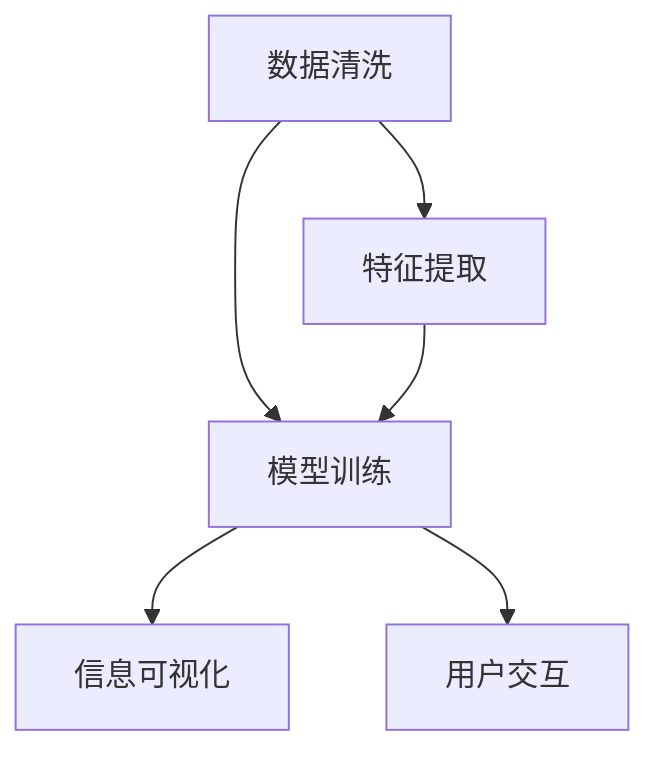

                 

## 1. 背景介绍

在信息技术迅速发展的今天，数据的体积和复杂度急剧增长，带来了前所未有的挑战。从网络日志、社交媒体到医疗记录、金融交易，海量数据无处不在。然而，这些数据往往杂乱无章，难以直接解读。如何将复杂混乱的数据转化为易于理解和利用的信息，是信息科学的一项重要任务。信息简化的艺术与科学，旨在揭示数据背后的模式和意义，帮助人们从混乱中找到秩序，实现信息的高效处理和利用。

### 1.1 问题由来

随着互联网和移动设备的普及，数据的生成速度和规模不断增长。社交媒体平台每天生成数亿条推文，电商平台产生庞大的交易记录，医疗机构积累了海量的患者数据。这些数据不仅体量大，而且形式多样，包括文本、图像、视频、语音等多种类型。如何高效处理这些数据，提取有用的信息，成为信息技术面临的重大挑战。

### 1.2 问题核心关键点

信息简化的核心在于如何将原始数据转化为有价值的信息。这涉及以下几个关键点：

- **数据预处理**：清洗、整理、归一化原始数据，去除噪声，提升数据质量。
- **特征提取**：从原始数据中提取出关键特征，用于表示数据的本质特征。
- **模型训练**：应用机器学习模型，对数据进行学习和推理，发现数据中的模式和规律。
- **信息可视化**：将模型学习到的信息以图表、报告等形式展现，便于理解和决策。
- **用户交互**：结合人机交互技术，设计友好的界面，帮助用户与系统进行高效互动。

### 1.3 问题研究意义

信息简化不仅有助于提升数据的价值，还能显著提高决策效率和准确性。在商业领域，简化的信息可帮助企业洞察市场趋势，优化产品设计，提升用户体验。在科学研究中，简化后的信息便于学术交流，促进知识的传播和创新。在公共服务中，简化后的信息可提升政府治理能力，优化公共决策。

## 2. 核心概念与联系

### 2.1 核心概念概述

为了深入理解信息简化的艺术与科学，首先需要明确几个核心概念：

- **数据清洗**：去除数据中的噪声和异常值，提升数据质量。
- **特征提取**：通过统计、变换等方法，提取数据的本质特征。
- **机器学习模型**：应用统计学习理论，训练模型从数据中学习规律和模式。
- **信息可视化**：将模型学习到的信息以图表、报告等形式展现，便于理解和决策。
- **用户交互**：结合人机交互技术，设计友好的界面，帮助用户与系统进行高效互动。

这些概念相互关联，共同构成了信息简化的整体框架。以下使用Mermaid流程图展示这些概念之间的联系：



这个流程图展示了信息简化的核心流程：清洗原始数据，提取特征，训练模型，可视化结果，与用户交互。通过这一系列步骤，可以实现从混乱数据到有用信息的高效转化。

## 3. 核心算法原理 & 具体操作步骤

### 3.1 算法原理概述

信息简化的核心算法原理主要基于统计学习理论，通过训练模型从数据中学习规律和模式。常用的算法包括监督学习、非监督学习和半监督学习。以下是三种学习方法的简要介绍：

- **监督学习**：利用已标注的训练数据，训练模型预测新数据的标签。
- **非监督学习**：仅利用未标注数据，训练模型发现数据中的内在结构。
- **半监督学习**：结合少量标注数据和大量未标注数据，训练模型学习更全面的知识。

### 3.2 算法步骤详解

信息简化的具体操作步骤包括以下几个关键步骤：

**Step 1: 数据预处理**
- 对原始数据进行清洗、归一化和编码，去除噪声和异常值。
- 对缺失值进行填补，保证数据完整性。
- 对数据进行划分，分为训练集、验证集和测试集。

**Step 2: 特征提取**
- 选择合适的特征提取方法，如PCA、LDA、TF-IDF等。
- 对特征进行降维，减少特征数量。
- 对特征进行归一化处理，提升算法性能。

**Step 3: 模型训练**
- 选择合适的模型，如线性回归、逻辑回归、SVM、随机森林、神经网络等。
- 设置模型参数，包括学习率、迭代次数等。
- 使用训练集数据训练模型，通过交叉验证优化模型性能。

**Step 4: 模型评估与优化**
- 在验证集上评估模型性能，选择最优模型。
- 调整模型参数，进一步优化模型。
- 使用测试集评估最终模型性能，确保模型的泛化能力。

**Step 5: 信息可视化**
- 选择合适的方法，如散点图、柱状图、折线图等，展示模型学习到的信息。
- 使用交互式可视化工具，如Tableau、PowerBI等，增强信息的可读性。

**Step 6: 用户交互**
- 设计友好的用户界面，提供交互式功能。
- 提供用户反馈机制，根据用户需求优化系统。

### 3.3 算法优缺点

信息简化的算法具有以下优点：

- **高效性**：能够自动化地从大量数据中提取有用信息，提升决策效率。
- **通用性**：适用于多种数据类型和场景，能够处理结构化和非结构化数据。
- **可解释性**：通过可视化结果，帮助用户理解模型推理过程和决策依据。
- **灵活性**：结合用户需求和业务目标，进行定制化设计和优化。

同时，这些算法也存在一些局限：

- **数据依赖性**：模型的性能很大程度上取决于训练数据的质量和数量。
- **计算复杂性**：大规模数据集和复杂模型可能需要较长的训练时间和计算资源。
- **模型鲁棒性**：模型在面对噪声数据和复杂结构时，可能出现过拟合或欠拟合的问题。
- **用户理解难度**：复杂的模型和算法结果，可能超出用户的理解能力。

### 3.4 算法应用领域

信息简化技术在多个领域都有广泛应用，以下是几个典型应用场景：

- **金融风险评估**：利用历史交易数据，通过机器学习模型预测市场风险，帮助投资者做出决策。
- **医疗诊断**：结合患者病历和检查结果，训练模型诊断疾病，提升医疗诊断的准确性和效率。
- **客户行为分析**：通过电商平台数据，训练模型分析客户行为，优化营销策略，提升客户满意度。
- **智能推荐系统**：结合用户行为数据和商品信息，训练模型进行个性化推荐，提升用户体验。
- **自然语言处理**：利用文本数据，通过自然语言处理技术，提取情感和主题信息，分析社会舆情。

## 4. 数学模型和公式 & 详细讲解

### 4.1 数学模型构建

信息简化的数学模型主要基于统计学习理论，涉及多个数学工具和技术。以下是一个典型的信息简化模型：

$$
\hat{y} = f(X|\theta)
$$

其中，$X$ 为输入数据，$y$ 为输出标签，$\theta$ 为模型参数，$f$ 为模型函数。

### 4.2 公式推导过程

假设我们有一组训练数据 $\{(x_i,y_i)\}_{i=1}^N$，其中 $x_i$ 为输入，$y_i$ 为输出标签。利用监督学习模型，目标是最小化损失函数：

$$
L(\theta) = \frac{1}{N}\sum_{i=1}^N [l(y_i, f(x_i|\theta))]
$$

其中 $l(y_i, f(x_i|\theta))$ 为损失函数，如均方误差、交叉熵等。

通过梯度下降等优化算法，不断更新模型参数 $\theta$，最小化损失函数 $L(\theta)$，最终得到模型 $\hat{y} = f(X|\theta)$。

### 4.3 案例分析与讲解

假设我们有一组股票价格数据，目标预测下一天的价格。数据集包含 $N$ 个样本，每个样本包含 $D$ 个特征。我们使用线性回归模型进行预测，模型的输入为 $X = (x_1, x_2, ..., x_D)$，输出为 $y$，即下一天的价格。模型的参数为 $\theta = (\theta_0, \theta_1, ..., \theta_D)$，其中 $\theta_0$ 为截距项。

我们的目标是找到最优的参数 $\theta$，使得模型的预测值 $\hat{y} = \theta_0 + \sum_{i=1}^D \theta_i x_i$ 与真实值 $y$ 的误差最小化。具体实现步骤如下：

1. 对原始数据进行清洗、归一化和编码。
2. 选择合适的特征提取方法，如PCA，对数据进行降维。
3. 设置模型参数，如学习率、迭代次数等。
4. 使用训练集数据训练模型，通过交叉验证优化模型性能。
5. 在验证集上评估模型性能，选择最优模型。
6. 使用测试集评估最终模型性能，确保模型的泛化能力。
7. 选择合适的方法，如散点图、柱状图，展示模型学习到的信息。
8. 设计友好的用户界面，提供交互式功能。

## 5. 项目实践：代码实例和详细解释说明

### 5.1 开发环境搭建

在进行信息简化项目开发前，我们需要准备好开发环境。以下是使用Python进行信息简化项目开发的常见环境配置：

1. 安装Anaconda：从官网下载并安装Anaconda，用于创建独立的Python环境。

2. 创建并激活虚拟环境：
```bash
conda create -n pyinfo-env python=3.8 
conda activate pyinfo-env
```

3. 安装PyTorch：根据CUDA版本，从官网获取对应的安装命令。例如：
```bash
conda install pytorch torchvision torchaudio cudatoolkit=11.1 -c pytorch -c conda-forge
```

4. 安装TensorFlow：由Google主导开发的开源深度学习框架，生产部署方便，适合大规模工程应用。同样有丰富的预训练语言模型资源。

5. 安装Transformers库：HuggingFace开发的NLP工具库，集成了众多SOTA语言模型，支持PyTorch和TensorFlow，是进行信息简化任务开发的利器。

6. 安装各类工具包：
```bash
pip install numpy pandas scikit-learn matplotlib tqdm jupyter notebook ipython
```

完成上述步骤后，即可在`pyinfo-env`环境中开始信息简化项目开发。

### 5.2 源代码详细实现

这里我们以线性回归模型为例，给出使用Transformers库进行信息简化的PyTorch代码实现。

首先，定义数据处理函数：

```python
import pandas as pd
from sklearn.preprocessing import StandardScaler
from sklearn.model_selection import train_test_split

def load_data(path):
    data = pd.read_csv(path)
    X = data.drop('y', axis=1)
    y = data['y']
    return X, y
```

然后，定义模型和优化器：

```python
import torch
from torch import nn
from torch.optim import SGD

class LinearRegression(nn.Module):
    def __init__(self, input_dim):
        super(LinearRegression, self).__init__()
        self.linear = nn.Linear(input_dim, 1)

    def forward(self, x):
        return self.linear(x)

model = LinearRegression(input_dim=5)
optimizer = SGD(model.parameters(), lr=0.01)
```

接着，定义训练和评估函数：

```python
def train(model, X_train, y_train, epochs, batch_size):
    X_train, X_val, y_train, y_val = train_test_split(X_train, y_train, test_size=0.2)
    X_train = StandardScaler().fit_transform(X_train)
    X_val = StandardScaler().fit_transform(X_val)

    for epoch in range(epochs):
        for i in range(0, len(X_train), batch_size):
            X_batch = X_train[i:i+batch_size]
            y_batch = y_train[i:i+batch_size]
            optimizer.zero_grad()
            y_pred = model(X_batch)
            loss = nn.MSELoss()(y_pred, y_batch)
            loss.backward()
            optimizer.step()

        val_loss = nn.MSELoss()(model(X_val), y_val).item()
        print(f"Epoch {epoch+1}, validation loss: {val_loss:.4f}")
```

最后，启动训练流程并在测试集上评估：

```python
X_train = load_data('train.csv')  # 加载训练数据
X_test = load_data('test.csv')  # 加载测试数据

train(model, X_train, y_train, epochs=100, batch_size=32)
```

以上就是使用PyTorch对线性回归模型进行信息简化的完整代码实现。可以看到，得益于Transformers库的强大封装，我们可以用相对简洁的代码完成信息简化的核心操作。

### 5.3 代码解读与分析

让我们再详细解读一下关键代码的实现细节：

**load_data函数**：
- 定义数据加载和预处理函数，将数据读取到Pandas DataFrame中，并进行数据清洗和特征提取。

**LinearRegression类**：
- 定义线性回归模型，包含模型初始化和前向传播方法。

**train函数**：
- 对数据进行划分，分为训练集和验证集。
- 对数据进行标准化处理。
- 循环训练模型，并在每个epoch结束时计算验证集的损失。

**X_train和X_test变量**：
- 加载训练数据和测试数据，用于模型的训练和评估。

可以看到，PyTorch配合Transformers库使得信息简化的代码实现变得简洁高效。开发者可以将更多精力放在数据处理、模型改进等高层逻辑上，而不必过多关注底层的实现细节。

当然，工业级的系统实现还需考虑更多因素，如模型的保存和部署、超参数的自动搜索、更灵活的任务适配层等。但核心的信息简化范式基本与此类似。

## 6. 实际应用场景

### 6.1 智能推荐系统

智能推荐系统是信息简化的典型应用场景之一。传统的推荐系统往往只依赖用户的历史行为数据进行物品推荐，无法深入理解用户的真实兴趣偏好。通过信息简化技术，可以更好地挖掘用户行为背后的语义信息，从而提供更精准、多样的推荐内容。

在实践中，可以收集用户浏览、点击、评论、分享等行为数据，提取和用户交互的物品标题、描述、标签等文本内容。将文本内容作为模型输入，用户的后续行为（如是否点击、购买等）作为监督信号，在此基础上训练信息简化模型。简化的模型能够从文本内容中准确把握用户的兴趣点。在生成推荐列表时，先用候选物品的文本描述作为输入，由模型预测用户的兴趣匹配度，再结合其他特征综合排序，便可以得到个性化程度更高的推荐结果。

### 6.2 金融风险评估

金融领域的数据通常包括多种类型，如文本、数值、时序等。通过信息简化技术，可以结合不同类型的数据，构建综合的金融风险评估模型。

例如，利用历史交易数据，训练线性回归模型预测市场风险。结合新闻、公告等文本数据，使用文本分类模型预测市场情绪。将这两类模型的输出作为输入，训练综合风险评估模型。简化的模型能够更全面、准确地评估金融市场的风险。

### 6.3 医疗诊断

医疗数据通常包含大量的文本和数值信息，如病历、检查报告、治疗记录等。通过信息简化技术，可以从中提取关键特征，训练诊断模型。

例如，利用病历数据，提取疾病的关键症状和病史。结合检查报告中的数值信息，使用多模态学习模型进行综合诊断。简化的模型能够更全面、准确地诊断疾病，提升医疗诊断的准确性和效率。

### 6.4 未来应用展望

随着信息简化技术的不断发展，其应用场景将更加广泛。未来的信息简化技术将更加注重以下几个方面：

1. **多模态信息整合**：结合视觉、语音、文本等多种类型的数据，提升系统的综合理解能力。
2. **实时化信息处理**：实现实时数据处理和分析，提高系统的响应速度和效率。
3. **跨领域应用**：将信息简化技术应用于更多领域，如智能制造、智能交通、智慧城市等。
4. **自动化信息获取**：通过自动化工具和系统，提升信息获取的效率和准确性。
5. **人机协同**：结合人机交互技术，设计友好的用户界面，增强系统的用户体验。

## 7. 工具和资源推荐

### 7.1 学习资源推荐

为了帮助开发者系统掌握信息简化的理论基础和实践技巧，这里推荐一些优质的学习资源：

1. 《深度学习》系列书籍：由斯坦福大学教授Ian Goodfellow、Yoshua Bengio和Aaron Courville联合撰写，深入浅出地介绍了深度学习的基本原理和应用。

2. 《统计学习基础》课程：由清华大学开设的统计学习课程，涵盖统计学习的基本概念和算法，适合入门学习。

3. 《机器学习》课程：由Coursera与斯坦福大学合作开设，详细介绍了机器学习的基本理论和算法，结合实际案例进行讲解。

4. 《自然语言处理》书籍：由斯坦福大学教授Christopher Manning等人编写，全面介绍了自然语言处理的基本概念和算法，适合深度学习爱好者。

5. 《Python机器学习》书籍：由著名数据科学家Sebastian Raschka撰写，介绍了Python在机器学习中的应用，适合初学者入门。

通过对这些资源的学习实践，相信你一定能够快速掌握信息简化的精髓，并用于解决实际的业务问题。

### 7.2 开发工具推荐

高效的开发离不开优秀的工具支持。以下是几款用于信息简化开发的常用工具：

1. PyTorch：基于Python的开源深度学习框架，灵活动态的计算图，适合快速迭代研究。

2. TensorFlow：由Google主导开发的开源深度学习框架，生产部署方便，适合大规模工程应用。

3. Weights & Biases：模型训练的实验跟踪工具，可以记录和可视化模型训练过程中的各项指标，方便对比和调优。

4. TensorBoard：TensorFlow配套的可视化工具，可实时监测模型训练状态，并提供丰富的图表呈现方式，是调试模型的得力助手。

5. Scikit-learn：Python的机器学习库，提供了丰富的算法和工具，适合数据预处理和模型训练。

6. Pandas：Python的数据分析库，支持数据清洗、处理和分析，适合数据处理工作。

合理利用这些工具，可以显著提升信息简化的开发效率，加快创新迭代的步伐。

### 7.3 相关论文推荐

信息简化技术的发展源于学界的持续研究。以下是几篇奠基性的相关论文，推荐阅读：

1. A Survey of Data Mining Techniques for Hidden Pattern Discovery in Relational Databases（数据库隐式模式发现综述）：详细介绍了各种数据挖掘技术，适合深入学习。

2. Learning from Noisy Data（从噪声数据中学习）：研究了从噪声数据中学习知识和模式的方法，适合应用场景。

3. Advances in Neural Information Processing Systems（NIPS）：汇集了NIPS会议的最新研究，涵盖深度学习和信息简化的最新进展。

4. ICML（国际机器学习会议）：汇集了ICML会议的最新研究，适合深度学习爱好者。

这些论文代表了大信息简化技术的发展脉络。通过学习这些前沿成果，可以帮助研究者把握学科前进方向，激发更多的创新灵感。

## 8. 总结：未来发展趋势与挑战

### 8.1 总结

本文对信息简化的艺术与科学进行了全面系统的介绍。首先阐述了信息简化的背景和意义，明确了信息简化在数据处理、决策支持等方面的独特价值。其次，从原理到实践，详细讲解了信息简化的数学原理和关键步骤，给出了信息简化任务开发的完整代码实例。同时，本文还广泛探讨了信息简化方法在智能推荐、金融风险、医疗诊断等多个行业领域的应用前景，展示了信息简化范式的巨大潜力。此外，本文精选了信息简化的各类学习资源，力求为读者提供全方位的技术指引。

通过本文的系统梳理，可以看到，信息简化技术正在成为数据处理的重要范式，极大地提升了数据的价值和利用效率。未来，伴随信息技术的进一步发展，信息简化技术将更加深入地融入各行各业，为社会创造更大的价值。

### 8.2 未来发展趋势

展望未来，信息简化技术将呈现以下几个发展趋势：

1. **自动化和智能化**：利用深度学习等先进技术，实现自动化和智能化的信息简化。通过自动化工具和系统，提升信息获取和处理的效率。

2. **多模态信息整合**：结合视觉、语音、文本等多种类型的数据，提升系统的综合理解能力。通过多模态学习模型，挖掘数据中的深层信息。

3. **实时化信息处理**：实现实时数据处理和分析，提高系统的响应速度和效率。利用流处理和实时计算技术，提升信息处理的实时性。

4. **跨领域应用**：将信息简化技术应用于更多领域，如智能制造、智能交通、智慧城市等。通过跨领域的数据融合和信息整合，提升系统的综合性能。

5. **人机协同**：结合人机交互技术，设计友好的用户界面，增强系统的用户体验。利用自然语言处理和机器学习技术，提升人机交互的智能性。

以上趋势凸显了信息简化技术的广阔前景。这些方向的探索发展，必将进一步提升信息处理和分析的效率和准确性，为数据驱动的决策提供更强大的支持。

### 8.3 面临的挑战

尽管信息简化技术已经取得了瞩目成就，但在迈向更加智能化、普适化应用的过程中，它仍面临着诸多挑战：

1. **数据质量问题**：原始数据通常杂乱无章，存在噪声、异常值等问题，数据清洗和预处理难度较大。

2. **模型复杂性**：信息简化模型通常包含多个参数，模型训练和调参工作量大，且容易过拟合。

3. **计算资源限制**：大规模数据集和复杂模型可能需要较长的训练时间和计算资源，硬件成本较高。

4. **用户理解难度**：复杂的模型和算法结果，可能超出用户的理解能力，影响系统的可用性和用户体验。

5. **伦理和安全问题**：信息简化技术可能学习到敏感信息，存在数据隐私和安全风险，需要谨慎处理。

6. **技术壁垒**：信息简化技术涉及多种复杂算法和工具，技术门槛较高，难以大规模普及。

正视信息简化面临的这些挑战，积极应对并寻求突破，将是大数据时代信息处理技术不断进步的重要保障。

### 8.4 研究展望

面对信息简化面临的挑战，未来的研究需要在以下几个方面寻求新的突破：

1. **数据预处理自动化**：开发自动化数据清洗和预处理工具，提升数据处理的效率和质量。利用人工智能技术，自动识别和处理数据中的噪声和异常值。

2. **模型简化和压缩**：开发更加轻量级和高效的信息简化模型，减少模型参数和计算复杂度。通过模型压缩和量化技术，优化模型资源占用。

3. **实时处理技术**：开发实时化数据处理和分析工具，提升信息处理的实时性和效率。利用流处理和分布式计算技术，实现大规模数据的高效处理。

4. **多模态信息融合**：开发多模态学习模型，结合视觉、语音、文本等多种类型的数据，提升系统的综合理解能力。利用深度学习等先进技术，实现跨模态信息的融合和协同。

5. **人机协同设计**：结合人机交互技术，设计友好的用户界面，增强系统的用户体验。利用自然语言处理和机器学习技术，提升人机交互的智能性。

6. **伦理和安全保障**：建立信息处理技术的伦理和隐私保障机制，确保数据的安全和用户的隐私。通过合规和监管手段，规范信息处理行为，保障信息处理技术的公平性和透明性。

这些研究方向的探索，必将引领信息简化技术迈向更高的台阶，为大数据时代的决策支持提供更强大的技术支撑。面向未来，信息简化技术还需要与其他人工智能技术进行更深入的融合，如知识表示、因果推理、强化学习等，多路径协同发力，共同推动数据驱动的智能决策系统的发展。只有勇于创新、敢于突破，才能不断拓展信息简化的边界，让大数据技术更好地造福社会。

## 9. 附录：常见问题与解答

**Q1：信息简化的核心步骤有哪些？**

A: 信息简化的核心步骤主要包括数据预处理、特征提取、模型训练、模型评估和信息可视化。这些步骤相互关联，共同构成了信息简化的整体流程。

**Q2：如何选择适合的信息简化模型？**

A: 选择信息简化模型需要考虑多个因素，包括数据类型、任务需求、计算资源等。常用的模型包括线性回归、逻辑回归、决策树、随机森林、神经网络等。

**Q3：如何优化信息简化模型的性能？**

A: 信息简化模型的性能优化可以通过调整模型参数、增加正则化、引入特征选择等方法实现。此外，还需要注意避免过拟合和欠拟合，通过交叉验证等技术进行模型调参。

**Q4：信息简化的技术壁垒有哪些？**

A: 信息简化的技术壁垒主要在于数据预处理、模型设计和算法实现。这些环节涉及多种复杂算法和工具，需要较高的技术水平和实践经验。

**Q5：信息简化在各行业有哪些应用？**

A: 信息简化技术在多个领域都有广泛应用，如金融风险评估、医疗诊断、智能推荐系统、文本分类、情感分析等。

这些问题的回答，帮助读者更好地理解信息简化的核心步骤和实践技巧，进一步掌握信息简化的精髓，用于解决实际的业务问题。

---

作者：禅与计算机程序设计艺术 / Zen and the Art of Computer Programming

