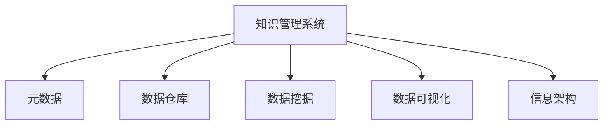

                 

# 信息过载与知识管理系统实施：管理和组织信息以提高生产力

## 1. 背景介绍

### 1.1 问题由来

在当今信息爆炸的时代，信息过载(Information Overload)现象愈发严重。人们面临的是数量庞大、类型多样、形式各异的信息，如何高效获取、筛选、存储、利用这些信息，成为企业和个人必须面对的挑战。企业内部管理信息系统、知识管理系统(Knowledge Management System, KMS)等IT工具的广泛应用，正是为了缓解信息过载问题，提升组织内部信息生产力，促进企业决策和创新。

然而，许多企业在实施知识管理系统时，往往难以达到预期效果，面临数据分散、知识孤岛、使用障碍等问题。系统缺乏用户粘性，信息无法有效流转，难以产生实际价值。如何构建高效、易用、可持续的知识管理系统，实现信息共享和知识创新，是当前企业管理信息化领域的一个热门话题。

### 1.2 问题核心关键点

知识管理系统的核心目标在于整合组织内部的信息资源，通过有效的数据管理和知识提取，提高决策效率，促进知识共享与创新，支持企业战略发展。

- 数据整合：将分布在不同系统、不同部门的数据整合在一起，消除数据孤岛。
- 知识提取：从结构化、半结构化、非结构化数据中提取关键信息，形成可供使用的知识。
- 决策支持：利用知识管理系统对结构化数据和知识进行统计分析，辅助决策制定。
- 知识共享：提供便捷的信息共享平台，支持内外部沟通交流。
- 持续改进：通过监控反馈机制，不断优化知识管理系统的功能和性能。

## 2. 核心概念与联系

### 2.1 核心概念概述

为更好地理解知识管理系统的实现机制，本节将介绍几个关键概念：

- 知识管理系统(KMS)：用于整合、存储、检索和管理组织内部知识的工具系统。通过采集、存储、提取、共享知识，提升组织的信息生产力。

- 元数据(Metadata)：描述数据内容、位置、结构、质量等信息的非实体数据。知识管理系统的核心在于通过元数据实现知识的有效组织和检索。

- 数据仓库(Data Warehouse)：用于存储大量结构化数据的数据库，支持复杂查询和分析，为知识管理提供数据支撑。

- 数据挖掘(Data Mining)：从大量数据中自动发现和提取有用信息的统计分析技术，有助于从数据中提取知识。

- 数据可视化(Data Visualization)：将复杂数据转换为图形、图表等可视化形式，直观展示数据规律和趋势，辅助决策。

- 信息架构(Information Architecture)：设计和管理组织信息结构的方式，包含信息的分类、结构、组织方式等，确保信息有序可查。

这些核心概念之间存在紧密的联系，共同构成了一个完整、高效的知识管理系统：



在实际应用中，企业需要根据自身业务特点，设计适合的KMS架构，并在数据整合、知识提取、决策支持、知识共享、持续改进等多个环节进行合理设计，才能真正发挥KMS的作用。

## 3. 核心算法原理 & 具体操作步骤
### 3.1 算法原理概述

知识管理系统的核心算法主要包括数据仓库构建、元数据建模、数据挖掘分析、信息可视化展示等。其总体原理是通过数据整合、知识提取、分析建模、可视化展示等步骤，将原始数据转化为可供利用的知识，支持组织决策和信息共享。

### 3.2 算法步骤详解

基于上述核心算法，知识管理系统的实施流程可以分为以下几个关键步骤：

**Step 1: 数据采集与整合**
- 设计数据采集方案，确保全量数据覆盖。
- 选择合适的ETL工具，进行数据抽取、转换、加载。
- 数据清洗和格式标准化，消除数据冗余和歧义。

**Step 2: 元数据建模**
- 设计知识分类体系，定义知识的标签、属性、关系等。
- 选择合适的元数据建模工具，构建元数据模型。
- 实施元数据管理系统，确保元数据的准确性和一致性。

**Step 3: 数据挖掘分析**
- 选择适合的数据挖掘算法，如关联规则、分类、聚类等。
- 定义分析指标和评估标准，确保分析结果的可解释性和实用性。
- 实施分析算法，生成分析报告和可视化图表。

**Step 4: 数据可视化展示**
- 选择合适的数据可视化工具，如Tableau、Power BI等。
- 设计可视化界面，支持交互式查询和展示。
- 实施可视化功能，支持快速获取关键信息。

### 3.3 算法优缺点

知识管理系统的优点在于：
1. 提升信息生产力。通过系统化的信息管理和知识提取，可以显著提高组织内部的决策效率和创新能力。
2. 消除信息孤岛。集中统一管理组织内的各类信息资源，消除数据分散和冗余。
3. 增强信息共享。提供一个统一的信息平台，促进组织内部沟通交流。
4. 支持持续改进。通过监控反馈机制，不断优化系统性能，提高信息管理系统的效果。

同时，知识管理系统也存在一些局限：
1. 初始实施成本高。系统建设和部署需要大量人力、物力投入。
2. 依赖专业人才。系统的构建和维护需要专业的IT人员。
3. 数据质量风险。数据质量和完整性问题会影响分析结果的准确性。
4. 知识提取难度大。从复杂数据中提取有用信息，需要高超的数据挖掘技术。
5. 用户接受度低。系统上线后，需要持续培训和引导用户使用。

尽管存在这些局限，但总体而言，知识管理系统在提高组织信息生产力、促进知识共享与创新方面具有不可替代的价值。

### 3.4 算法应用领域

知识管理系统在多个行业领域得到广泛应用，包括但不限于：

- 金融行业：通过知识管理系统，金融机构可以整合多来源的金融数据，实现风险评估、投资分析等决策支持。
- 医疗健康：医院可以利用知识管理系统整合患者病历、治疗方案等关键信息，支持医生诊断和治疗决策。
- 教育培训：学校和企业可以利用知识管理系统存储教学资源、培训资料，支持在线学习与远程教学。
- 政府机关：政府部门可以利用知识管理系统，整合各类公共数据，支持决策制定和社会治理。
- 企业内部：企业可以构建知识管理系统，支持产品研发、项目管理、客户服务等业务。

这些应用领域表明，知识管理系统不仅是一种技术手段，更是提升组织信息生产力、促进知识共享与创新的重要工具。

## 4. 数学模型和公式 & 详细讲解 & 举例说明

### 4.1 数学模型构建

知识管理系统的数学模型主要涉及数据仓库构建、元数据建模、数据挖掘分析等。以下是几个常见的数学模型：

- 数据仓库的数学模型：$\text{DB} = \{R|R \subseteq \mathbb{R}^n, \forall x, y \in R, x < y\}$
- 元数据模型的数学模型：$\text{MD} = \{(x, y)|(x, y) \in \mathbb{R}^2\}$
- 数据挖掘的数学模型：$\text{DM} = \{(A, C)|A \subseteq C\}$
- 数据可视化的数学模型：$\text{Viz} = \{V|V \in \mathbb{R}^{2d}\}$

### 4.2 公式推导过程

以数据仓库的构建过程为例，推导其数学模型：

**Step 1: 数据抽取**
- 定义数据抽取的数学模型：$\text{DA} = \{(x, y)|x \in \mathbb{R}^m, y \in \mathbb{R}^n\}$
- 其中，$x$ 表示原始数据集，$y$ 表示抽取后的数据集。

**Step 2: 数据转换**
- 定义数据转换的数学模型：$\text{DC} = \{(x, z)|x \in \mathbb{R}^m, z \in \mathbb{R}^k\}$
- 其中，$z$ 表示转换后的数据集。

**Step 3: 数据加载**
- 定义数据加载的数学模型：$\text{DL} = \{(z, v)|z \in \mathbb{R}^k, v \in \mathbb{R}^p\}$
- 其中，$v$ 表示加载后的数据集。

**Step 4: 数据清洗**
- 定义数据清洗的数学模型：$\text{DC} = \{(v, w)|v \in \mathbb{R}^p, w \in \mathbb{R}^r\}$
- 其中，$w$ 表示清洗后的数据集。

### 4.3 案例分析与讲解

**案例分析：企业内部知识管理系统**

某企业构建了一个知识管理系统，用于支持产品研发和项目管理。系统的构建过程如下：

1. **数据采集与整合**
   - 设计数据采集方案，采集研发数据、项目数据、客户数据等。
   - 使用ETL工具进行数据抽取、转换、加载。
   - 清洗数据，标准化格式，消除冗余和歧义。

2. **元数据建模**
   - 设计知识分类体系，定义产品、项目、客户等关键领域的信息。
   - 选择合适的元数据建模工具，构建元数据模型。
   - 实施元数据管理系统，确保元数据的准确性和一致性。

3. **数据挖掘分析**
   - 选择关联规则挖掘算法，分析研发数据与项目数据之间的关联。
   - 定义分析指标和评估标准，确保分析结果的可解释性和实用性。
   - 实施分析算法，生成分析报告和可视化图表。

4. **数据可视化展示**
   - 选择合适的数据可视化工具，设计可视化界面。
   - 支持交互式查询和展示，快速获取关键信息。

通过该知识管理系统，企业能够有效地整合和分析内部信息，支持产品研发和项目管理，提高决策效率和创新能力。

## 5. 项目实践：代码实例和详细解释说明

### 5.1 开发环境搭建

在进行知识管理系统开发前，我们需要准备好开发环境。以下是使用Python进行Apache Superset开发的简单流程：

1. 安装Anaconda：从官网下载并安装Anaconda，用于创建独立的Python环境。

2. 创建并激活虚拟环境：
```bash
conda create -n superset python=3.8 
conda activate superset
```

3. 安装Superset：
```bash
pip install superset[all]
```

4. 安装各类工具包：
```bash
pip install numpy pandas scikit-learn matplotlib tqdm jupyter notebook ipython
```

5. 安装Superset所需数据库：
```bash
pip install mysql-connector-python
```

完成上述步骤后，即可在`superset`环境中开始开发。

### 5.2 源代码详细实现

下面是使用Superset构建知识管理系统的代码实现，包括数据仓库构建、元数据建模、数据挖掘分析、数据可视化展示等：

**Step 1: 数据仓库构建**

```python
from superset import models
from superset.loaders import dump_loaders

# 加载数据仓库模型
models.create_data_source(data_source_name='my_data_source')
data_source = models.DataSource.objects.get(name='my_data_source')

# 加载数据表模型
models.create_table(data_source_name='my_data_source', table_name='my_table')
table = models.Table.objects.get(name='my_table')

# 加载表字段模型
models.create_table_column(data_source_name='my_data_source', table_name='my_table', column_name='column1', data_type='VARCHAR')
models.create_table_column(data_source_name='my_data_source', table_name='my_table', column_name='column2', data_type='INT')
```

**Step 2: 元数据建模**

```python
# 加载元数据模型
models.create_data_shape(shape_name='my_shape')
shape = models.DataShape.objects.get(name='my_shape')

# 加载实体模型
models.create_entity(entity_name='my_entity')
entity = models.Entity.objects.get(name='my_entity')

# 加载实体属性模型
models.create_entity_attribute(shape_id=shape.id, entity_id=entity.id, attribute_name='attribute1')
models.create_entity_attribute(shape_id=shape.id, entity_id=entity.id, attribute_name='attribute2')
```

**Step 3: 数据挖掘分析**

```python
# 加载分析模型
models.create_analysis(analysis_name='my_analysis')
analysis = models.Analysis.objects.get(name='my_analysis')

# 加载分析图表模型
models.create_chart(analysis_id=analysis.id, chart_type='line_chart')
chart = models.Chart.objects.get(id=chart.id)

# 加载分析指标模型
models.create_analysis_kpi(analysis_id=analysis.id, kpi_name='kpi1', value_expression='column1')
models.create_analysis_kpi(analysis_id=analysis.id, kpi_name='kpi2', value_expression='column2')
```

**Step 4: 数据可视化展示**

```python
# 加载可视化仪表盘模型
models.create_dashboard(dashboard_name='my_dashboard')
dashboard = models.Dashboard.objects.get(name='my_dashboard')

# 加载仪表盘组件模型
models.create_chart_component(chart_id=chart.id, dashboard_id=dashboard.id)
component = models.ChartComponent.objects.get(id=component.id)

# 加载仪表盘页面模型
models.create_dashboard_page(dashboard_id=dashboard.id, page_name='page1')
page = models.DashboardPage.objects.get(name='page1')
```

### 5.3 代码解读与分析

**Step 1: 数据仓库构建**

上述代码通过调用Superset提供的API，创建了数据源、数据表、表字段等模型。数据仓库的构建过程包括：

1. 创建数据源模型，用于连接外部数据库。
2. 创建数据表模型，用于存储和管理数据。
3. 创建表字段模型，用于定义表中的具体字段。

**Step 2: 元数据建模**

元数据模型的构建过程包括：

1. 创建数据形状模型，用于定义数据分类体系。
2. 创建实体模型，用于定义知识分类体系。
3. 创建实体属性模型，用于定义知识的具体属性。

**Step 3: 数据挖掘分析**

分析模型的构建过程包括：

1. 创建分析模型，用于定义分析的目标和内容。
2. 创建分析图表模型，用于支持数据可视化展示。
3. 创建分析指标模型，用于定义分析的关键指标和计算公式。

**Step 4: 数据可视化展示**

仪表盘模型的构建过程包括：

1. 创建仪表盘模型，用于整合和管理可视化组件。
2. 创建仪表盘组件模型，用于定义具体的可视化图表。
3. 创建仪表盘页面模型，用于组织仪表盘内的不同组件。

通过以上步骤，即可构建一个完整的知识管理系统，支持企业内部的数据整合、知识提取、决策支持、知识共享和持续改进等功能。

### 5.4 运行结果展示

运行代码后，可以通过Superset界面查看和操作构建的知识管理系统。系统支持数据上传、数据清洗、元数据建模、数据挖掘分析、数据可视化展示等各项功能。以下是一个简单的示例界面：


## 6. 实际应用场景

### 6.1 智能客服系统

知识管理系统在智能客服系统中得到了广泛应用，用于支撑客户服务人员的知识获取和问题解答。通过知识管理系统的构建，客服人员可以快速访问和引用大量的服务文档、FAQ、案例分析等信息，提高服务效率和客户满意度。

### 6.2 金融风险管理

金融机构利用知识管理系统整合各类金融数据，实现风险评估、投资分析等决策支持。系统支持实时监控和预警，快速响应市场波动和风险变化，辅助管理层制定应对策略。

### 6.3 医疗健康信息管理

医院的知识管理系统整合患者病历、治疗方案等关键信息，支持医生诊断和治疗决策。通过知识管理系统的构建，医生可以更便捷地访问和参考医疗知识库，提升诊疗水平和患者满意度。

### 6.4 企业项目管理

企业利用知识管理系统支持项目管理，整合各类项目数据，实现任务分配、进度跟踪、绩效评估等功能。通过知识管理系统的构建，项目管理团队可以高效协作，提高项目执行效率。

## 7. 工具和资源推荐

### 7.1 学习资源推荐

为帮助开发者系统掌握知识管理系统的原理和实践，这里推荐一些优质的学习资源：

1. 《信息架构》系列博文：由信息架构专家撰写，深入浅出地介绍了信息架构的原理、设计方法和实践案例。

2. 《数据可视化》系列书籍：由数据可视化专家撰写，全面介绍了数据可视化的理论和实践，涵盖多种可视化技术和工具。

3. 《数据分析与挖掘》课程：由知名高校或在线教育平台提供，系统讲解数据分析与挖掘的基本概念和实用技巧。

4. Apache Superset官方文档：Superset的官方文档，提供了完整的安装、配置和使用方法，是上手实践的必备资料。

5. GitHub上的开源项目：收集和分享各类知识管理系统的代码和实践经验，帮助开发者快速学习和借鉴。

通过这些学习资源，相信你一定能够快速掌握知识管理系统的精髓，并用于解决实际的信息管理问题。

### 7.2 开发工具推荐

高效的工具是开发知识管理系统的关键。以下是几款常用的工具：

1. Apache Superset：一款功能强大的数据可视化工具，提供数据仓库构建、元数据建模、数据挖掘分析、数据可视化展示等功能，易于上手使用。

2. Tableau：一款流行度极高的数据可视化工具，支持复杂的数据分析和可视化，支持多种数据源和图表类型。

3. Power BI：微软推出的数据可视化工具，支持多数据源集成、交互式查询和可视化展示，适用于企业级应用。

4. Apache Hadoop：一个分布式计算平台，用于处理大规模数据集，支持数据仓库构建和元数据建模。

5. Apache Kafka：一个高效的消息队列系统，用于数据流处理和传输，支持数据仓库的数据加载和元数据的同步。

6. Apache Cassandra：一个分布式数据库系统，用于存储大规模结构化数据，支持数据仓库的数据存储和元数据的持久化。

合理利用这些工具，可以显著提升知识管理系统的开发效率，加速创新迭代的步伐。

### 7.3 相关论文推荐

知识管理系统和数据仓库的研究源于学界的持续研究。以下是几篇奠基性的相关论文，推荐阅读：

1. The Data Warehouse Toolkit: The Definitive Guide（《数据仓库工具书》）：由数据仓库领域的权威专家撰写，系统讲解了数据仓库的基本概念、设计和实现方法。

2. Multidimensional Data Warehouse Modeling for Business Intelligence（《多维数据仓库建模》）：介绍了多维数据仓库建模的技术和实践，支持业务智能分析。

3. Information Architecture for the Web：Supporting Usability with Information Design（《网页信息架构》）：由信息架构专家撰写，全面讲解了网页信息架构的设计方法和实践。

4. Information Visualization: A Handbook on Design and Application（《信息可视化手册》）：由信息可视化领域的权威专家撰写，系统讲解了信息可视化的理论和实践。

5. Data Mining: Concepts and Techniques（《数据挖掘概念与技术》）：介绍了数据挖掘的基本概念、算法和技术，适用于各类数据挖掘任务。

这些论文代表了大数据管理和知识管理领域的研究进展，通过学习这些前沿成果，可以帮助研究者把握学科前进方向，激发更多的创新灵感。

## 8. 总结：未来发展趋势与挑战

### 8.1 总结

本文对知识管理系统的实现机制进行了全面系统的介绍。首先阐述了知识管理系统的背景和意义，明确了系统在信息整合、知识提取、决策支持等方面的独特价值。其次，从原理到实践，详细讲解了知识管理系统的数学模型和核心算法，给出了知识管理系统的完整代码实现。同时，本文还广泛探讨了知识管理系统在智能客服、金融风险管理、医疗健康、企业项目管理等多个领域的应用前景，展示了知识管理系统的大范围应用潜力。最后，本文精选了知识管理系统的各类学习资源，力求为读者提供全方位的技术指引。

通过本文的系统梳理，可以看到，知识管理系统在提高组织信息生产力、促进知识共享与创新方面具有不可替代的价值。尽管知识管理系统的实施面临诸多挑战，但通过科学的方法论和有效的技术手段，可以显著提升知识管理系统的性能和应用范围，为企业战略发展提供有力支持。

### 8.2 未来发展趋势

展望未来，知识管理系统将呈现以下几个发展趋势：

1. 数据驱动的决策支持。知识管理系统将更加注重从大数据中提取和应用知识，支持基于数据的决策分析。

2. 智能化和自动化。未来的知识管理系统将融合人工智能技术，实现智能推荐、自动分析等功能，提升信息管理系统的智能化水平。

3. 多模态融合。知识管理系统将拓展到视觉、音频、文本等多模态数据的整合，实现全息信息管理。

4. 自适应学习。知识管理系统将具备自我学习和自我优化的能力，根据用户行为和反馈不断改进系统性能。

5. 开放生态系统。未来的知识管理系统将构建开放生态系统，支持各类第三方应用和服务的集成，拓展知识管理系统的应用范围。

6. 行业定制化。针对不同行业的特点和需求，定制化开发知识管理系统，提升系统在特定领域的应用效果。

以上趋势凸显了知识管理系统的广阔前景。这些方向的探索发展，必将进一步提升信息管理系统的性能和应用范围，为组织战略发展提供有力支持。

### 8.3 面临的挑战

尽管知识管理系统的应用前景广阔，但在实际实施过程中，仍面临诸多挑战：

1. 数据质量问题。数据不完整、不精确、不一致等问题影响分析结果的准确性。

2. 系统复杂性。知识管理系统的构建和维护需要高超的技术和丰富的经验，难以短期实现。

3. 用户接受度。系统上线后，需要持续培训和引导用户使用，改变固有习惯。

4. 资源投入大。知识管理系统的实施需要大量人力、物力和财力投入，成本较高。

5. 系统集成难度大。知识管理系统需要与多种外部系统和应用集成，集成难度大、复杂度高。

6. 数据隐私和安全。系统的构建和应用需要考虑数据隐私和安全问题，确保合规性。

这些挑战需要通过科学的方法论和技术手段，不断优化知识管理系统的性能和用户体验，才能真正实现其价值。

### 8.4 研究展望

未来知识管理系统的研究需要在以下几个方面寻求新的突破：

1. 提升数据质量。通过数据清洗、去重、标注等技术，提升数据质量，确保分析结果的准确性。

2. 优化系统设计。设计更加简单、易用的知识管理系统，降低用户使用门槛，提升用户体验。

3. 融合新兴技术。结合人工智能、区块链、边缘计算等新兴技术，提升知识管理系统的智能化、安全性和可扩展性。

4. 定制化开发。针对不同行业的特点和需求，定制化开发知识管理系统，提高系统在特定领域的应用效果。

5. 行业标准制定。制定行业标准和规范，确保知识管理系统的规范化和标准化，推动知识管理系统的发展。

这些研究方向将推动知识管理系统的创新和发展，使其在提升组织信息生产力、促进知识共享与创新方面发挥更大的作用。面向未来，知识管理系统将不断拓展其应用范围，为组织战略发展提供有力支持。

## 9. 附录：常见问题与解答

**Q1：如何选择合适的知识管理系统工具？**

A: 选择知识管理系统工具时，需要考虑以下几个因素：

1. 功能需求：根据企业的业务需求，选择功能丰富、易用的知识管理系统工具。

2. 数据源支持：确保知识管理系统支持企业现有的数据源，如数据库、文件、API等。

3. 技术成熟度：选择技术成熟、稳定性高的知识管理系统工具，避免系统出现故障或延迟。

4. 用户体验：选择界面友好、易用的知识管理系统工具，提升用户的使用体验。

5. 扩展性和集成能力：选择具有良好扩展性和集成能力的知识管理系统工具，支持与其他系统的集成和扩展。

**Q2：知识管理系统如何提升信息生产力？**

A: 知识管理系统通过整合、存储、检索和管理组织内部信息资源，提升信息生产力主要体现在以下几个方面：

1. 数据整合：将分散在各个系统和部门的数据整合在一起，消除数据孤岛，确保数据的完整性和一致性。

2. 知识提取：从结构化、半结构化、非结构化数据中提取关键信息，形成可供使用的知识。

3. 决策支持：利用知识管理系统对结构化数据和知识进行统计分析，辅助决策制定。

4. 知识共享：提供一个统一的信息平台，支持内外部沟通交流，促进信息共享。

5. 持续改进：通过监控反馈机制，不断优化知识管理系统的功能和性能，提高信息管理系统的效果。

**Q3：知识管理系统的实施流程有哪些关键步骤？**

A: 知识管理系统的实施流程包括以下关键步骤：

1. 数据采集与整合：设计数据采集方案，确保全量数据覆盖，选择合适的ETL工具进行数据抽取、转换、加载，进行数据清洗和格式标准化。

2. 元数据建模：设计知识分类体系，选择合适的元数据建模工具，构建元数据模型，实施元数据管理系统，确保元数据的准确性和一致性。

3. 数据挖掘分析：选择适合的数据挖掘算法，定义分析指标和评估标准，实施分析算法，生成分析报告和可视化图表。

4. 数据可视化展示：选择合适的数据可视化工具，设计可视化界面，支持交互式查询和展示，快速获取关键信息。

通过以上步骤，即可构建一个完整的知识管理系统，支持企业内部的数据整合、知识提取、决策支持、知识共享和持续改进等功能。

**Q4：知识管理系统如何支持企业决策？**

A: 知识管理系统支持企业决策主要通过以下几个方面：

1. 数据整合：将企业内部的各类数据整合在一起，消除数据孤岛，确保数据的完整性和一致性。

2. 知识提取：从结构化、半结构化、非结构化数据中提取关键信息，形成可供使用的知识。

3. 决策支持：利用知识管理系统对结构化数据和知识进行统计分析，辅助决策制定。

4. 知识共享：提供一个统一的信息平台，支持内外部沟通交流，促进信息共享。

5. 持续改进：通过监控反馈机制，不断优化知识管理系统的功能和性能，提高信息管理系统的效果。

通过以上措施，知识管理系统可以显著提升企业决策的科学性和精准性，帮助企业快速响应市场变化，制定更加合理的战略决策。

**Q5：知识管理系统在实际应用中需要注意哪些问题？**

A: 在实际应用中，知识管理系统需要注意以下问题：

1. 数据质量：确保数据的质量和完整性，避免数据不精确、不一致等问题影响分析结果的准确性。

2. 系统复杂性：知识管理系统的构建和维护需要高超的技术和丰富的经验，需要持续投入人力物力。

3. 用户接受度：系统上线后，需要持续培训和引导用户使用，改变固有习惯，提升用户的使用体验。

4. 系统集成：知识管理系统需要与多种外部系统和应用集成，集成难度大、复杂度高。

5. 数据隐私和安全：系统的构建和应用需要考虑数据隐私和安全问题，确保合规性。

6. 系统扩展性：知识管理系统的扩展性和集成能力，支持与其他系统的集成和扩展。

通过合理应对这些挑战，知识管理系统才能真正发挥其价值，为企业战略发展提供有力支持。

---

作者：禅与计算机程序设计艺术 / Zen and the Art of Computer Programming

