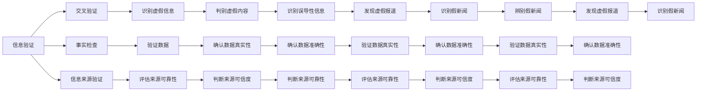

                 

# 信息验证和信息素养教育：为数字时代培养信息素养的学生

## 1. 背景介绍

在数字时代，信息如潮水般涌来，但并非所有信息都是可信的。互联网的普及和社交媒体的广泛使用，使虚假信息、假新闻和误导性内容充斥网络，对个人和社会都带来了严重威胁。因此，培养具有信息验证能力的学生，成为当前教育的重要课题。

### 1.1 信息泛滥问题

随着技术的进步，信息的获取变得前所未有的容易。社交媒体、新闻聚合器、搜索引擎等工具，让每个人都可以轻易获取到海量信息。但信息质量参差不齐，尤其是虚假信息、假新闻和误导性内容，对公众认知、社会稳定甚至国家安全带来了重大风险。

### 1.2 信息素养的重要性

信息素养是指在信息时代中获取、理解、评估和有效使用信息的能力。在信息时代，信息素养不仅是学术研究的基础，更是个人职业发展、社会参与不可或缺的技能。培养具有信息素养的学生，能够更好地辨别信息的真伪，避免被虚假信息误导，提升决策质量和批判性思维能力。

## 2. 核心概念与联系

### 2.1 核心概念概述

在信息验证和信息素养教育中，几个关键概念需要理解：

- **信息验证（Information Verification）**：指通过各种方法和技术，验证信息的真实性、准确性和可靠性。包括验证来源、交叉验证、事实检查等多种方法。
- **信息素养（Information Literacy）**：指在信息时代中获取、理解、评估和有效使用信息的能力。信息素养教育旨在培养学生的批判性思维和信息搜索能力。
- **数字素养（Digital Literacy）**：指在数字时代中有效使用计算机、网络和信息资源的能力。信息素养教育涵盖数字素养，但更强调对信息本身的理解和评估。
- **批判性思维（Critical Thinking）**：指在面对复杂问题时，能够独立思考、分析问题、评估证据，并基于证据做出判断的能力。

这些概念相互关联，共同构成了信息素养教育的核心。

### 2.2 核心概念原理和架构的 Mermaid 流程图



## 3. 核心算法原理 & 具体操作步骤

### 3.1 算法原理概述

信息验证和信息素养教育的核心算法原理，主要是基于事实检查、交叉验证和批判性思维。这些算法原理构成了信息素养教育的基础，帮助学生建立科学的信息获取和判断能力。

**事实检查**：通过验证信息的真实性和准确性，来判断其可靠性。通常使用的事实检查方法包括查找原始数据、核对多个来源、参考专家意见等。

**交叉验证**：通过多角度、多方法验证同一信息，来确认其真实性。交叉验证可以避免单一来源的信息偏差和错误。

**批判性思维**：培养学生独立思考、分析和评估信息的能力，鼓励质疑和验证信息，避免盲从。批判性思维是信息素养教育的核心。

### 3.2 算法步骤详解

**Step 1: 准备数据和工具**
- 收集包含信息验证任务的数据集，如新闻报道、社交媒体帖子、科学研究等。
- 准备事实检查工具，如FactCheck.org、Snopes等。
- 选择合适的编程环境，如Python、R等，安装相关库，如pandas、BeautifulSoup等。

**Step 2: 设计信息验证模型**
- 确定信息验证的任务类型，如假新闻、误导性内容、虚假数据等。
- 设计验证模型的架构，如基于规则的方法、基于深度学习的方法等。
- 选择适当的特征，如关键词、来源、发布日期等。

**Step 3: 训练和验证模型**
- 使用训练集训练模型，调整模型参数，如分类器、回归器、神经网络等。
- 在验证集上评估模型性能，选择最优模型。
- 对模型进行调优和优化，如增加特征、调整算法等。

**Step 4: 应用和反馈**
- 将训练好的模型应用于实际信息验证任务。
- 收集反馈，不断优化模型和算法。
- 发布模型和算法，供其他开发者使用。

### 3.3 算法优缺点

**优点**：
- 基于事实和证据，提供可靠的判断依据。
- 帮助学生建立科学的信息获取和评估能力。
- 可自动化和规模化应用，提升效率。

**缺点**：
- 对高质量数据依赖较高，数据获取成本高。
- 算法复杂度较高，需要专业知识和技能。
- 无法完全避免人工误判和错误。

### 3.4 算法应用领域

信息验证和信息素养教育在多个领域有广泛应用：

- **新闻业**：新闻机构使用信息验证技术，避免假新闻和误导性报道。
- **学术界**：研究人员使用事实检查方法，验证研究数据和结果的可靠性。
- **法律界**：律师使用信息验证技术，判断证据的真实性。
- **商业界**：企业使用信息素养教育，提升员工的信息判断能力和决策质量。
- **教育界**：学校使用信息素养教育，培养学生的批判性思维和信息评估能力。

## 4. 数学模型和公式 & 详细讲解 & 举例说明

### 4.1 数学模型构建

信息验证的数学模型主要基于分类和回归算法。以新闻报道的假新闻检测为例，模型目标是将新闻分为真实和虚假两类。

**公式推导**：

假设新闻报道的真实性为二分类变量 $y \in \{0,1\}$，模型输出为 $p(y=1|x)$，其中 $x$ 为新闻报道的特征向量。假设模型输出为逻辑回归模型：

$$
p(y=1|x) = \sigma(Wx + b)
$$

其中，$W$ 和 $b$ 为模型参数，$\sigma$ 为sigmoid函数。

### 4.2 公式推导过程

根据最大似然估计，模型参数的求解过程如下：

$$
\hat{W},\hat{b} = \arg\min_{W,b} -\frac{1}{N}\sum_{i=1}^N \left[y_i\log p(y=1|x_i) + (1-y_i)\log (1-p(y=1|x_i)) \right]
$$

通过优化上述目标函数，可以得到最优的模型参数 $\hat{W}$ 和 $\hat{b}$。

### 4.3 案例分析与讲解

**案例**：假新闻检测

**数据集**：假新闻检测数据集，如Kaggle上的"Fake News Challenge"数据集。

**模型选择**：逻辑回归、支持向量机、随机森林等。

**模型训练**：使用训练集训练模型，在验证集上评估性能，选择最优模型。

**模型应用**：将训练好的模型应用于新闻检测任务，输出新闻的真实性。

**结果分析**：分析模型性能，如准确率、召回率、F1分数等，不断优化模型。

## 5. 项目实践：代码实例和详细解释说明

### 5.1 开发环境搭建

**环境配置**：
- 安装Python 3.8及以上的版本。
- 安装pandas、numpy、scikit-learn、requests等库。
- 安装TensorFlow或PyTorch等深度学习框架。
- 安装Jupyter Notebook等开发工具。

### 5.2 源代码详细实现

```python
import pandas as pd
import numpy as np
import requests
from bs4 import BeautifulSoup
from sklearn.model_selection import train_test_split
from sklearn.feature_extraction.text import TfidfVectorizer
from sklearn.linear_model import LogisticRegression

# 读取数据集
data = pd.read_csv('news.csv')

# 提取特征
text = data['content']
label = data['label']

# 分割训练集和验证集
X_train, X_val, y_train, y_val = train_test_split(text, label, test_size=0.2)

# 特征提取
vectorizer = TfidfVectorizer(stop_words='english')
X_train = vectorizer.fit_transform(X_train)
X_val = vectorizer.transform(X_val)

# 模型训练
model = LogisticRegression()
model.fit(X_train, y_train)

# 模型评估
score = model.score(X_val, y_val)
print('验证集得分：', score)

# 模型应用
new_news = 'This is a news article about the election.'
vectorized_news = vectorizer.transform([new_news])
prediction = model.predict_proba(vectorized_news)
print('预测结果：', prediction)
```

### 5.3 代码解读与分析

**代码功能**：
- 读取数据集，提取新闻内容和标签。
- 分割训练集和验证集。
- 使用TF-IDF提取新闻特征。
- 训练逻辑回归模型。
- 在验证集上评估模型性能。
- 应用模型预测新新闻的真实性。

**代码逻辑**：
- 读取数据集，将新闻内容和标签转换为pandas DataFrame格式。
- 使用train_test_split函数分割训练集和验证集，比例为80%和20%。
- 使用TfidfVectorizer提取新闻的TF-IDF特征。
- 使用LogisticRegression训练逻辑回归模型。
- 在验证集上评估模型性能，输出验证集得分。
- 使用训练好的模型预测新新闻的真实性，输出预测结果。

## 6. 实际应用场景

### 6.1 新闻业

新闻机构广泛应用信息验证技术，避免发布假新闻和误导性内容。通过事实检查、交叉验证等方法，确保新闻的准确性和可靠性。

### 6.2 学术界

研究人员使用信息验证技术，验证研究数据和结果的真实性。避免误导性数据，确保研究的科学性和可靠性。

### 6.3 法律界

律师使用信息验证技术，判断证据的真实性。确保法庭上的证据可信，避免误判和错误。

### 6.4 商业界

企业使用信息素养教育，提升员工的信息判断能力和决策质量。确保公司运营信息的准确性和可靠性。

### 6.5 教育界

学校使用信息素养教育，培养学生的批判性思维和信息评估能力。确保学生具备科学的信息获取和判断能力。

## 7. 工具和资源推荐

### 7.1 学习资源推荐

- **Kaggle**：提供大量数据集和竞赛，学习信息验证和信息素养教育的实践。
- **Coursera**：提供信息素养教育的在线课程，涵盖信息验证、批判性思维等方面。
- **edX**：提供新闻业、法律界等应用信息验证的在线课程。

### 7.2 开发工具推荐

- **Jupyter Notebook**：提供交互式编程环境，方便调试和展示代码结果。
- **Python**：作为信息验证和信息素养教育的主要开发语言，易于学习和应用。
- **R**：提供丰富的统计分析和机器学习库，适用于信息验证的数据分析。

### 7.3 相关论文推荐

- **"Evaluating Misinformation: A Case Study of the Fake News Challenge Dataset"**：探讨假新闻检测数据集的构建和评估方法。
- **"Fact Checking and Media Literacy: Concepts and Strategies for Combating Misinformation"**：探讨信息验证在媒体素养教育中的重要性。
- **"Machine Learning in News Verification: A Survey"**：综述机器学习在新闻验证中的应用和挑战。

## 8. 总结：未来发展趋势与挑战

### 8.1 研究成果总结

信息验证和信息素养教育在信息时代具有重要意义。基于事实和证据的判断，能够避免虚假信息和误导性内容的传播，提升社会整体的信息素养水平。

### 8.2 未来发展趋势

**趋势1**：自动化信息验证。随着AI技术的发展，信息验证将更多采用自动化方法，提升验证效率和准确性。

**趋势2**：跨领域应用。信息验证和信息素养教育将应用于更多领域，如医疗、金融、教育等，提升这些领域的决策质量。

**趋势3**：全球化视野。信息验证和信息素养教育将面向全球，帮助各国提升信息素养水平，共同应对虚假信息挑战。

**趋势4**：多模态融合。信息验证将融合文字、图像、音频等多种模态信息，提升信息理解和评估能力。

### 8.3 面临的挑战

**挑战1**：高质量数据获取。信息验证依赖于高质量数据，数据获取成本高、难度大。

**挑战2**：算法复杂度。信息验证算法复杂，需要专业知识和技能，难以大规模推广。

**挑战3**：用户信任度。信息验证的效果依赖于用户信任度，如何建立用户信任，仍需努力。

### 8.4 研究展望

未来，信息验证和信息素养教育需要解决以下几个问题：
- **数据获取**：探索高效、低成本的数据获取方法。
- **算法优化**：提升算法的准确性和鲁棒性。
- **用户信任**：建立用户信任机制，提升信息验证效果。
- **跨领域应用**：将信息验证和信息素养教育应用于更多领域，提升社会整体信息素养水平。

## 9. 附录：常见问题与解答

**Q1: 什么是信息验证？**

A: 信息验证是通过多种方法和技术，验证信息的真实性、准确性和可靠性。包括查找原始数据、核对多个来源、参考专家意见等。

**Q2: 信息验证和信息素养教育有何区别？**

A: 信息验证是技术手段，用于验证信息的真伪；信息素养教育是教育过程，旨在培养学生的批判性思维和信息评估能力。

**Q3: 信息验证在实际应用中需要注意哪些问题？**

A: 信息验证需要注意数据质量、算法准确性、用户信任度等问题。高质量的数据是信息验证的基础，算法的准确性和鲁棒性需要持续优化，用户信任度需要通过教育和技术手段提升。

**Q4: 信息验证如何应用在新闻业？**

A: 新闻机构可以通过事实检查、交叉验证等方法，避免发布假新闻和误导性内容。通过逻辑回归、支持向量机等算法，验证新闻的准确性。

**Q5: 信息验证在教育界的应用前景如何？**

A: 学校可以通过信息验证教育，提升学生的批判性思维和信息评估能力。通过案例分析、模拟实验等方式，让学生掌握信息验证的基本方法和技巧。

