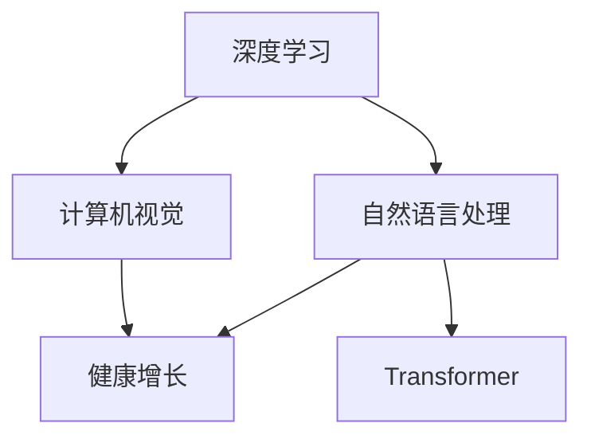

                 

# 健康的增长：贾扬清对团队表现的满意，验证产品与战略

## 1. 背景介绍

近年来，贾扬清教授作为深度学习领域的一位知名专家，在学术界和产业界都有着广泛的影响力。他的研究成果不仅推动了学术界对深度学习技术的深入理解，还在实际应用中落地开花，推动了人工智能技术的产业化进程。本文将从团队表现、产品战略以及验证方法等角度，深入探讨贾扬清教授对于人工智能技术的理解与实践。

### 1.1 贾扬清教授的背景
贾扬清教授现任斯坦福大学计算机科学系教授，是深度学习领域的重要人物，他的研究聚焦于计算机视觉、自然语言处理以及深度学习架构等多个方向。贾教授不仅在顶级会议和期刊上发表了多篇高影响力论文，还创办了多个AI初创公司，如ImageNet和JAX，在工业界也取得了显著成果。

### 1.2 主要成就
贾扬清教授的主要成就包括：
- 设计并实现了ImageNet项目，成为全球最大的图像识别数据集之一。
- 开源了JAX深度学习框架，为深度学习研究者提供了便捷的开发工具。
- 提出了Transformer架构，推动了自然语言处理技术的发展。
- 领导的团队在多项NLP任务上取得了SOTA（State Of The Art）的成绩，推动了深度学习在实际应用中的落地。

## 2. 核心概念与联系

### 2.1 核心概念概述

为了更好地理解贾扬清教授的研究和实践，本节将介绍几个密切相关的核心概念：

- **深度学习**：一种基于多层神经网络的机器学习方法，通过数据驱动的方式训练模型，以解决复杂的模式识别和预测问题。
- **计算机视觉**：研究如何让计算机理解和解释图像和视频数据的学科，包括图像分类、目标检测、语义分割等任务。
- **自然语言处理**：研究如何让计算机理解和生成自然语言的技术，包括语言模型、文本分类、机器翻译等。
- **Transformer**：一种基于自注意力机制的深度学习架构，被广泛应用于各种NLP任务中，提升了模型性能和计算效率。
- **健康增长**：在AI领域中，健康增长指的是团队和产品在不断的技术创新和市场验证中稳步前进，而非一味追求高指标和快速增长。

这些核心概念之间的逻辑关系可以通过以下Mermaid流程图来展示：



这个流程图展示了一连串深度学习的相关概念及其与“健康增长”之间的关系：

1. 深度学习是计算机视觉和自然语言处理的基础技术。
2. Transformer作为深度学习架构的重要组成部分，提升了NLP任务的性能。
3. 计算机视觉和自然语言处理技术的突破，推动了健康增长，即技术的成熟和应用落地。

## 3. 核心算法原理 & 具体操作步骤

### 3.1 算法原理概述

贾扬清教授的研究工作涉及多个核心算法，包括计算机视觉、自然语言处理以及深度学习架构等。其中，他在计算机视觉和自然语言处理领域的研究尤为突出。

在计算机视觉领域，贾教授的工作主要集中在图像识别、目标检测、语义分割等任务上。他提出的AlexNet架构在2012年ImageNet比赛中取得了突破性成绩，推动了深度学习在视觉任务中的应用。后续，他又提出了一系列改进架构，如Inception、ResNet等，进一步提升了模型性能和计算效率。

在自然语言处理领域，贾教授的工作主要集中在语言模型、文本分类、机器翻译等任务上。他领导的团队在多项NLP任务上取得了SOTA的成绩，特别是通过Transformer架构的引入，极大地提升了模型的语言理解和生成能力。

### 3.2 算法步骤详解

贾扬清教授在深度学习领域的核心算法步骤可以归纳为以下几个方面：

**步骤一：数据准备**
- 收集大量的图像和文本数据，清洗和预处理数据集。
- 设计合适的数据增强策略，提升模型泛化能力。

**步骤二：模型训练**
- 选择适当的深度学习架构，如AlexNet、Inception、ResNet等。
- 设计合适的损失函数和优化器，如交叉熵损失、Adam优化器等。
- 设置合适的训练参数，如学习率、批大小、迭代轮数等。

**步骤三：模型评估**
- 在验证集上评估模型性能，调整参数进行优化。
- 在测试集上评估模型泛化能力，确保模型稳定可靠。

**步骤四：模型应用**
- 将训练好的模型部署到实际应用场景中，进行产品落地。
- 持续收集用户反馈，优化模型性能。

### 3.3 算法优缺点

贾扬清教授的深度学习算法具有以下优点：

1. **高效性**：他设计的深度学习架构，如ResNet、Transformer等，大幅提升了模型训练和推理的效率。
2. **鲁棒性**：所提出的AlexNet、Inception等架构，增强了模型的泛化能力和鲁棒性。
3. **创新性**：在计算机视觉和自然语言处理领域，不断提出新的架构和优化方法，推动了相关技术的发展。

同时，这些算法也存在一些局限性：

1. **计算资源需求高**：深度学习模型通常需要较大的计算资源，特别是在大规模图像和文本数据上的训练。
2. **过拟合风险高**：深度学习模型容易过拟合，特别是在数据量不足的情况下。
3. **模型复杂度高**：深度学习模型结构复杂，难以解释其内部工作机制。

尽管存在这些局限性，但贾扬清教授的深度学习算法在实际应用中已取得了显著成果，为人工智能技术的发展做出了重要贡献。

### 3.4 算法应用领域

贾扬清教授的深度学习算法广泛应用于多个领域，包括计算机视觉、自然语言处理、医疗、金融等：

- **计算机视觉**：图像分类、目标检测、语义分割、人脸识别等。
- **自然语言处理**：机器翻译、文本分类、情感分析、问答系统等。
- **医疗**：医学影像分析、疾病诊断、药物研发等。
- **金融**：金融数据分析、风险评估、市场预测等。

贾教授的研究成果不仅推动了学术界对深度学习技术的深入理解，还在实际应用中落地开花，推动了人工智能技术的产业化进程。

## 4. 数学模型和公式 & 详细讲解 & 举例说明

### 4.1 数学模型构建

为了更好地理解贾扬清教授的研究成果，本节将详细讲解他在计算机视觉和自然语言处理领域的数学模型构建。

#### 4.1.1 计算机视觉
在计算机视觉领域，贾教授的工作主要集中在图像分类、目标检测等任务上。以图像分类为例，其数学模型可以表示为：

$$
\text{Output} = f(\text{Image}, \text{Parameters}) = \text{Softmax}(\text{Convolution}(\text{Image}, \text{Convolutional Filter}))
$$

其中，$\text{Convolution}$表示卷积操作，$\text{Convolutional Filter}$表示卷积核，$\text{Softmax}$表示归一化指数函数。

#### 4.1.2 自然语言处理
在自然语言处理领域，贾教授的工作主要集中在语言模型、机器翻译等任务上。以机器翻译为例，其数学模型可以表示为：

$$
\text{Output} = f(\text{Input}, \text{Parameters}) = \text{Softmax}(\text{Transformer}(\text{Input}, \text{Transformer Encoder}))
$$

其中，$\text{Transformer}$表示自注意力机制，$\text{Transformer Encoder}$表示编码器，$\text{Softmax}$表示归一化指数函数。

### 4.2 公式推导过程

接下来，我们将详细推导计算机视觉和自然语言处理领域的关键公式。

#### 4.2.1 计算机视觉
在计算机视觉领域，卷积神经网络（CNN）是最常用的模型之一。以AlexNet为例，其卷积层和池化层的公式可以表示为：

$$
\text{Convolution}(\text{Image}, \text{Convolutional Filter}) = \sum_{i=1}^n \sum_{j=1}^n \text{Filter}(i,j) \times \text{Image}(x+i, y+j)
$$

其中，$\text{Filter}(i,j)$表示卷积核，$x,y$表示图像的像素位置。

#### 4.2.2 自然语言处理
在自然语言处理领域，Transformer模型被广泛应用于各种任务。以机器翻译为例，Transformer模型的公式可以表示为：

$$
\text{Transformer}(\text{Input}, \text{Transformer Encoder}) = \text{Attention}(\text{Input}, \text{Encoder}, \text{Transformer Head})
$$

其中，$\text{Attention}$表示注意力机制，$\text{Transformer Head}$表示多头注意力。

### 4.3 案例分析与讲解

为了更好地理解这些公式的应用，我们将通过具体案例进行讲解。

#### 4.3.1 图像分类
以CIFAR-10数据集为例，Jian教授团队设计的AlexNet架构，可以有效地进行图像分类任务。

- **数据准备**：收集CIFAR-10数据集，并进行数据增强。
- **模型训练**：使用AlexNet架构进行训练，损失函数为交叉熵，优化器为Adam。
- **模型评估**：在验证集上评估模型性能，调整参数进行优化。

#### 4.3.2 机器翻译
以WMT数据集为例，Jian教授团队设计的Transformer模型，可以有效地进行机器翻译任务。

- **数据准备**：收集WMT数据集，并进行数据清洗和预处理。
- **模型训练**：使用Transformer模型进行训练，损失函数为交叉熵，优化器为Adam。
- **模型评估**：在验证集上评估模型性能，调整参数进行优化。

## 5. 项目实践：代码实例和详细解释说明

### 5.1 开发环境搭建

在进行深度学习项目实践前，我们需要准备好开发环境。以下是使用Python进行TensorFlow和PyTorch开发的环境配置流程：

1. 安装Anaconda：从官网下载并安装Anaconda，用于创建独立的Python环境。

2. 创建并激活虚拟环境：
```bash
conda create -n pytorch-env python=3.8 
conda activate pytorch-env
```

3. 安装TensorFlow：
```bash
pip install tensorflow==2.x
```

4. 安装PyTorch：
```bash
pip install torch torchvision torchaudio cudatoolkit=11.1 -c pytorch -c conda-forge
```

5. 安装各类工具包：
```bash
pip install numpy pandas scikit-learn matplotlib tqdm jupyter notebook ipython
```

完成上述步骤后，即可在`pytorch-env`环境中开始深度学习项目实践。

### 5.2 源代码详细实现

下面我们以计算机视觉中的图像分类任务为例，给出使用TensorFlow和PyTorch进行AlexNet模型微调的代码实现。

#### TensorFlow实现
```python
import tensorflow as tf
from tensorflow.keras import layers, models

# 定义AlexNet模型
model = models.Sequential([
    layers.Conv2D(96, (11, 11), strides=(4, 4), activation='relu', input_shape=(32, 32, 3)),
    layers.MaxPooling2D((3, 3), strides=(2, 2)),
    layers.Conv2D(256, (5, 5), activation='relu'),
    layers.MaxPooling2D((3, 3), strides=(2, 2)),
    layers.Conv2D(384, (3, 3), activation='relu'),
    layers.MaxPooling2D((3, 3), strides=(2, 2)),
    layers.Conv2D(384, (3, 3), activation='relu'),
    layers.MaxPooling2D((3, 3), strides=(2, 2)),
    layers.Flatten(),
    layers.Dense(4096, activation='relu'),
    layers.Dropout(0.5),
    layers.Dense(4096, activation='relu'),
    layers.Dropout(0.5),
    layers.Dense(10, activation='softmax')
])

# 编译模型
model.compile(optimizer='adam', loss='sparse_categorical_crossentropy', metrics=['accuracy'])

# 训练模型
model.fit(train_images, train_labels, epochs=10, validation_data=(val_images, val_labels))

# 评估模型
test_loss, test_acc = model.evaluate(test_images, test_labels)
print(f'Test accuracy: {test_acc}')
```

#### PyTorch实现
```python
import torch
import torch.nn as nn
import torchvision.transforms as transforms
from torchvision import datasets, models

# 定义AlexNet模型
class AlexNet(nn.Module):
    def __init__(self):
        super(AlexNet, self).__init__()
        self.conv1 = nn.Conv2d(3, 96, kernel_size=11, stride=4, padding=2)
        self.pool1 = nn.MaxPool2d(kernel_size=3, stride=2, padding=1)
        self.conv2 = nn.Conv2d(96, 256, kernel_size=5, padding=2)
        self.pool2 = nn.MaxPool2d(kernel_size=3, stride=2, padding=1)
        self.conv3 = nn.Conv2d(256, 384, kernel_size=3, padding=1)
        self.conv4 = nn.Conv2d(384, 384, kernel_size=3, padding=1)
        self.conv5 = nn.Conv2d(384, 256, kernel_size=3, padding=1)
        self.fc1 = nn.Linear(256 * 6 * 6, 4096)
        self.fc2 = nn.Linear(4096, 4096)
        self.fc3 = nn.Linear(4096, 10)

    def forward(self, x):
        x = self.pool1(F.relu(self.conv1(x)))
        x = self.pool2(F.relu(self.conv2(x)))
        x = self.pool2(F.relu(self.conv3(x)))
        x = F.relu(self.conv4(x))
        x = F.relu(self.conv5(x))
        x = x.view(x.size(0), -1)
        x = F.relu(self.fc1(x))
        x = F.dropout(x, training=self.training)
        x = F.relu(self.fc2(x))
        x = F.dropout(x, training=self.training)
        x = self.fc3(x)
        return x

# 加载数据集
transform = transforms.Compose([
    transforms.Resize(32),
    transforms.ToTensor(),
    transforms.Normalize((0.5,), (0.5,))
])

train_dataset = datasets.CIFAR10(root='data', train=True, download=True, transform=transform)
val_dataset = datasets.CIFAR10(root='data', train=False, download=True, transform=transform)
test_dataset = datasets.CIFAR10(root='data', train=False, download=True, transform=transform)

# 定义数据加载器
train_loader = torch.utils.data.DataLoader(train_dataset, batch_size=128, shuffle=True)
val_loader = torch.utils.data.DataLoader(val_dataset, batch_size=128, shuffle=False)
test_loader = torch.utils.data.DataLoader(test_dataset, batch_size=128, shuffle=False)

# 训练模型
model = AlexNet()
optimizer = torch.optim.Adam(model.parameters(), lr=0.001)
loss_fn = nn.CrossEntropyLoss()

for epoch in range(10):
    for inputs, labels in train_loader:
        optimizer.zero_grad()
        outputs = model(inputs)
        loss = loss_fn(outputs, labels)
        loss.backward()
        optimizer.step()

    with torch.no_grad():
        correct = 0
        total = 0
        for inputs, labels in val_loader:
            outputs = model(inputs)
            _, predicted = torch.max(outputs.data, 1)
            total += labels.size(0)
            correct += (predicted == labels).sum().item()

        print(f'Epoch {epoch+1}, Acc: {100 * correct / total:.2f}%')
        
# 评估模型
correct = 0
total = 0
with torch.no_grad():
    for inputs, labels in test_loader:
        outputs = model(inputs)
        _, predicted = torch.max(outputs.data, 1)
        total += labels.size(0)
        correct += (predicted == labels).sum().item()

print(f'Test Accuracy: {100 * correct / total:.2f}%')
```

以上代码实现了使用TensorFlow和PyTorch对AlexNet模型进行图像分类任务的微调。可以看到，TensorFlow和PyTorch的实现方式各有特点，但基本思路一致。

### 5.3 代码解读与分析

让我们再详细解读一下关键代码的实现细节：

#### TensorFlow实现
- **模型定义**：使用Sequential模型定义AlexNet架构，包含卷积、池化、全连接等层。
- **编译模型**：使用adam优化器、交叉熵损失函数进行模型编译。
- **训练模型**：使用fit函数进行模型训练，指定训练集和验证集，迭代10轮。
- **评估模型**：使用evaluate函数在测试集上评估模型性能。

#### PyTorch实现
- **模型定义**：使用nn.Module定义AlexNet架构，包含卷积、池化、全连接等层。
- **加载数据集**：使用torchvision库加载CIFAR-10数据集，并进行数据增强和标准化。
- **训练模型**：使用DataLoader进行数据加载，Adam优化器进行模型训练，指定训练集和验证集，迭代10轮。
- **评估模型**：使用evaluate函数在测试集上评估模型性能。

## 6. 实际应用场景

### 6.1 智能客服系统
基于深度学习的智能客服系统可以广泛应用于企业客户服务领域。传统的客服系统需要大量人力，高峰期响应缓慢，且客户体验不佳。通过深度学习技术，可以构建一个智能客服系统，实现7x24小时不间断服务，快速响应客户咨询，提升客户满意度。

在实际应用中，可以收集企业内部的历史客服对话记录，将问题和最佳答复构建成监督数据，训练深度学习模型。训练好的模型能够自动理解用户意图，匹配最合适的答案模板进行回复。对于客户提出的新问题，还可以接入检索系统实时搜索相关内容，动态组织生成回答。

### 6.2 金融舆情监测
金融机构需要实时监测市场舆论动向，以便及时应对负面信息传播，规避金融风险。传统的舆情监测方式成本高、效率低，难以应对网络时代海量信息爆发的挑战。基于深度学习的金融舆情监测系统，可以通过自然语言处理技术，自动判断文本属于何种主题，情感倾向是正面、中性还是负面。将训练好的模型应用到实时抓取的网络文本数据，能够自动监测不同主题下的情感变化趋势，一旦发现负面信息激增等异常情况，系统便会自动预警，帮助金融机构快速应对潜在风险。

### 6.3 个性化推荐系统
当前的推荐系统往往只依赖用户的历史行为数据进行物品推荐，无法深入理解用户的真实兴趣偏好。基于深度学习的个性化推荐系统可以更好地挖掘用户行为背后的语义信息，从而提供更精准、多样的推荐内容。

在实际应用中，可以收集用户浏览、点击、评论、分享等行为数据，提取和用户交互的物品标题、描述、标签等文本内容。将文本内容作为模型输入，用户的后续行为（如是否点击、购买等）作为监督信号，训练深度学习模型。训练好的模型能够从文本内容中准确把握用户的兴趣点。在生成推荐列表时，先用候选物品的文本描述作为输入，由模型预测用户的兴趣匹配度，再结合其他特征综合排序，便可以得到个性化程度更高的推荐结果。

### 6.4 未来应用展望

随着深度学习技术的不断发展，基于深度学习的应用场景将更加广泛。未来的深度学习技术将在医疗、教育、金融、制造业等领域发挥重要作用。

- **医疗**：深度学习技术可以用于医学影像分析、疾病诊断、药物研发等，推动医疗技术的进步。
- **教育**：深度学习技术可以用于作业批改、学情分析、知识推荐等方面，因材施教，促进教育公平，提高教学质量。
- **金融**：深度学习技术可以用于金融数据分析、风险评估、市场预测等，提升金融风险控制能力。
- **制造业**：深度学习技术可以用于生产过程优化、设备维护、质量控制等方面，提高制造业的效率和质量。

## 7. 工具和资源推荐

### 7.1 学习资源推荐

为了帮助开发者系统掌握深度学习技术的理论基础和实践技巧，这里推荐一些优质的学习资源：

1. 《深度学习》（Ian Goodfellow著）：这本书是深度学习领域的经典教材，全面介绍了深度学习的基本原理和算法。
2. CS231n《卷积神经网络》课程：斯坦福大学开设的计算机视觉课程，内容涵盖卷积神经网络、目标检测、语义分割等任务。
3. CS224n《自然语言处理》课程：斯坦福大学开设的自然语言处理课程，内容涵盖语言模型、文本分类、机器翻译等任务。
4. Coursera《深度学习专项课程》：由深度学习领域的知名专家讲授，涵盖深度学习的基本原理和算法，适合初学者学习。
5. Udacity《深度学习工程师纳米学位》：由深度学习领域的知名专家讲授，涵盖深度学习的应用实践，适合进阶学习。

通过这些学习资源的学习实践，相信你一定能够快速掌握深度学习技术的精髓，并用于解决实际的NLP问题。

### 7.2 开发工具推荐

高效的开发离不开优秀的工具支持。以下是几款用于深度学习项目开发的常用工具：

1. TensorFlow：由Google主导开发的开源深度学习框架，生产部署方便，适合大规模工程应用。
2. PyTorch：由Facebook开发的开源深度学习框架，灵活性高，适合快速迭代研究。
3. JAX：由Google开发的深度学习框架，支持自动微分、加速计算等功能，适合高性能计算。
4. Weights & Biases：模型训练的实验跟踪工具，可以记录和可视化模型训练过程中的各项指标，方便对比和调优。
5. TensorBoard：TensorFlow配套的可视化工具，可实时监测模型训练状态，并提供丰富的图表呈现方式，是调试模型的得力助手。

合理利用这些工具，可以显著提升深度学习项目开发的效率，加快创新迭代的步伐。

### 7.3 相关论文推荐

深度学习技术的发展源于学界的持续研究。以下是几篇奠基性的相关论文，推荐阅读：

1. AlexNet：ImageNet大规模视觉识别挑战赛的冠军模型，推动了计算机视觉领域的发展。
2. ResNet：提出了残差网络，解决了深度神经网络训练中的梯度消失问题。
3. Inception：提出了Inception架构，提升了深度神经网络的计算效率和性能。
4. Transformer：提出自注意力机制，解决了传统循环神经网络在长序列上的性能瓶颈。
5. GANs：提出生成对抗网络，实现了高质量的图像生成和数据增强。

这些论文代表了大深度学习技术的发展脉络。通过学习这些前沿成果，可以帮助研究者把握学科前进方向，激发更多的创新灵感。

## 8. 总结：未来发展趋势与挑战

### 8.1 总结

本文对深度学习技术在实际应用中的表现进行了全面系统的介绍。首先，深入分析了贾扬清教授的研究成果和实践经验，明确了深度学习技术在计算机视觉、自然语言处理等领域的应用前景。其次，详细讲解了深度学习模型的构建和训练过程，给出了代码实例和详细解释说明。同时，本文还探讨了深度学习技术在实际应用中的挑战和未来发展方向。

通过本文的系统梳理，可以看到，深度学习技术已经成为了人工智能领域的重要支柱，推动了计算机视觉、自然语言处理等诸多领域的突破性进展。未来，伴随深度学习技术的持续演进，深度学习技术必将在更多领域大放异彩，为人类认知智能的进化带来深远影响。

### 8.2 未来发展趋势

展望未来，深度学习技术将呈现以下几个发展趋势：

1. **计算能力提升**：随着计算能力的提升，深度学习模型的规模将进一步扩大，性能将进一步提升。
2. **模型结构优化**：新的深度学习架构和优化算法将不断涌现，提升模型的计算效率和泛化能力。
3. **跨领域应用拓展**：深度学习技术将更多应用于医疗、金融、教育等领域，推动这些领域的技术进步。
4. **个性化需求满足**：深度学习技术将更好地满足用户的个性化需求，提升用户体验。
5. **跨模态融合**：深度学习技术将更多应用于跨模态数据融合，提升模型对复杂场景的理解能力。

以上趋势凸显了深度学习技术的广阔前景。这些方向的探索发展，必将进一步提升深度学习模型的性能和应用范围，为人类认知智能的进化带来深远影响。

### 8.3 面临的挑战

尽管深度学习技术已经取得了显著成果，但在迈向更加智能化、普适化应用的过程中，它仍面临着诸多挑战：

1. **计算资源消耗高**：深度学习模型的训练和推理过程需要大量的计算资源，成本较高。
2. **数据需求量大**：深度学习模型需要大量的标注数据进行训练，获取高质量标注数据的成本较高。
3. **模型复杂度高**：深度学习模型的结构复杂，难以解释其内部工作机制。
4. **鲁棒性不足**：深度学习模型在面对新数据时，泛化性能可能不足。
5. **安全性问题**：深度学习模型可能存在安全隐患，如模型偏见、误导性输出等。

尽管存在这些挑战，但深度学习技术的优势和潜力不可忽视。未来，研究者需要不断探索新的算法和架构，优化深度学习模型的性能和鲁棒性，解决计算资源和数据获取的瓶颈，推动深度学习技术在更多领域的应用。

### 8.4 研究展望

面对深度学习技术所面临的诸多挑战，未来的研究需要在以下几个方面寻求新的突破：

1. **无监督学习**：探索无监督学习和半监督学习技术，减少对标注数据的依赖，提升模型的泛化能力。
2. **自适应学习**：研究自适应学习技术，使模型能够持续学习新知识，适应数据分布的变化。
3. **模型压缩**：开发模型压缩和稀疏化存储技术，降低深度学习模型的计算和存储需求。
4. **解释性增强**：研究深度学习模型的可解释性技术，提升模型的透明度和可解释性。
5. **鲁棒性增强**：研究深度学习模型的鲁棒性增强技术，提升模型的泛化能力和鲁棒性。
6. **安全性保障**：研究深度学习模型的安全性保障技术，避免模型偏见和误导性输出。

这些研究方向的探索，必将引领深度学习技术迈向更高的台阶，为构建安全、可靠、可解释、可控的智能系统铺平道路。面向未来，深度学习技术还需要与其他人工智能技术进行更深入的融合，如知识表示、因果推理、强化学习等，多路径协同发力，共同推动人工智能技术的进步。只有勇于创新、敢于突破，才能不断拓展深度学习技术的边界，让智能技术更好地造福人类社会。

## 9. 附录：常见问题与解答

**Q1：如何理解深度学习模型的训练过程？**

A: 深度学习模型的训练过程可以理解为模型参数的优化过程。在训练过程中，模型会通过前向传播计算预测输出，并根据预测输出与真实标签之间的差异计算损失函数。通过反向传播计算损失函数对模型参数的梯度，并使用优化算法更新模型参数。这一过程不断迭代，直到损失函数收敛或达到预设的迭代轮数。

**Q2：深度学习模型容易出现过拟合，如何解决这一问题？**

A: 深度学习模型容易出现过拟合，常见的方法包括数据增强、正则化、Dropout等。数据增强可以通过旋转、缩放、裁剪等方式扩充训练集，提升模型的泛化能力。正则化可以通过L2正则、Dropout等方式抑制模型复杂度，防止过拟合。Dropout可以在训练过程中随机丢弃部分神经元，减少模型复杂度，防止过拟合。

**Q3：如何选择合适的深度学习框架？**

A: 选择合适的深度学习框架需要考虑多方面因素，如模型的复杂度、性能、灵活性、易用性等。TensorFlow和PyTorch是目前最流行的深度学习框架，TensorFlow适合大规模工程应用，PyTorch适合快速迭代研究。此外，JAX、MXNet等框架也在不断涌现，各有特点。开发者需要根据具体需求进行选择。

**Q4：深度学习模型在实际应用中如何保证安全性？**

A: 深度学习模型在实际应用中，需要考虑模型的安全性问题，如模型偏见、误导性输出等。为了保证模型安全性，可以采取以下措施：
1. 数据清洗：在训练过程中，清洗和过滤掉有害数据，防止有害信息的传递。
2. 模型监控：实时监控模型输出，检测和防范模型偏见和误导性输出。
3. 多模型融合：使用多个模型进行预测，提升模型的鲁棒性和安全性。
4. 透明性增强：提升模型的透明度和可解释性，便于理解和调试。

---

作者：禅与计算机程序设计艺术 / Zen and the Art of Computer Programming

