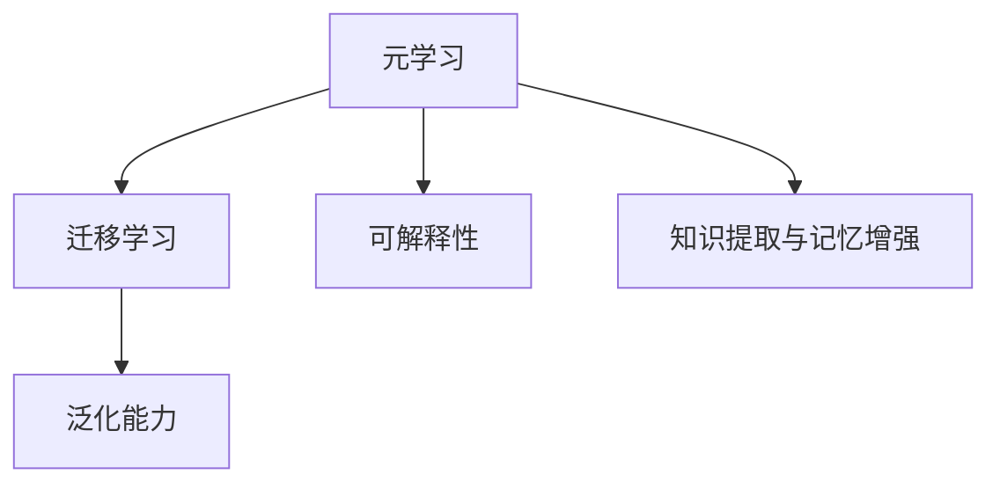

                 

# 元学习在NLP中的应用：快速适应新任务

> 关键词：元学习, 自然语言处理(NLP), 迁移学习, 泛化能力, 快速适应新任务, 可解释性, 知识提取, 记忆增强, 零样本学习, 半监督学习

## 1. 背景介绍

### 1.1 问题由来
随着深度学习技术在自然语言处理(Natural Language Processing, NLP)领域的广泛应用，研究人员和工程师们发现，虽然预训练语言模型如BERT、GPT等在多个下游任务上表现优异，但它们在面对新任务时仍存在适应能力不足的问题。传统NLP模型往往需要大量有标签数据进行微调，这不仅耗时且成本高昂。因此，如何使模型能够快速适应新任务，是当前NLP研究中的重要课题。

元学习（Meta-Learning），又称为学习学习（Learning to Learn），是一种能够提升模型在多个任务中泛化能力的技术。其核心思想是让模型在少量标签数据的指导下，快速学习如何执行新任务，而无需从零开始训练。元学习在NLP领域的应用，可以大大提升模型对新任务的适应能力，降低微调的成本和时间。

### 1.2 问题核心关键点
元学习在NLP中的应用，主要集中在以下几个方面：

1. **泛化能力提升**：通过元学习，模型能够在少量数据上快速适应新任务，从而提升模型的泛化能力。
2. **知识提取与记忆增强**：元学习能够帮助模型从旧任务中提取知识，并在新任务中重新利用这些知识，增强模型的记忆能力。
3. **快速适应新任务**：元学习使模型能够通过相似性或结构映射，快速地在新任务上获得良好的初始化，加速收敛。
4. **零样本和少样本学习**：元学习能够实现零样本学习，即在没有任何训练样本的情况下，仅通过任务描述就能执行新任务；同时也能在少样本条件下，通过少量训练样本实现高效的微调。

这些关键点反映了元学习在提升NLP任务适应性、降低数据需求和加快模型开发速度方面的优势。

### 1.3 问题研究意义
研究元学习在NLP中的应用，对于拓展NLP模型的应用边界、提高模型在新任务上的性能、降低数据标注成本以及加快模型开发进度具有重要意义：

1. **降低标注成本**：元学习能够在少量标注数据上训练模型，大幅降低数据标注的复杂度和成本。
2. **提升泛化能力**：通过元学习，模型能够在不同领域、不同任务上快速适应，提升模型的泛化性能。
3. **加速模型开发**：元学习使模型能够在新任务上快速获得良好的初始化，从而加快模型的训练和调优过程。
4. **促进研究创新**：元学习技术促进了对于模型结构和算法的新研究，催生了零样本学习、少样本学习、多任务学习等新兴研究方向。

## 2. 核心概念与联系

### 2.1 核心概念概述

为更好地理解元学习在NLP中的应用，本节将介绍几个密切相关的核心概念：

- **元学习（Meta-Learning）**：指让模型能够从少量数据中快速学习新任务，通过任务间的数据共享和知识迁移，提升模型的泛化能力和适应性。
- **迁移学习（Transfer Learning）**：指将一个领域学习到的知识，迁移到另一个不同但相关的领域。元学习可以看作是一种更高级的迁移学习形式，能够在小样本情况下实现知识迁移。
- **泛化能力**：指模型在不同领域、不同任务上的泛化性能。泛化能力越强，模型对新任务的适应能力越好。
- **可解释性**：指模型的决策过程是否透明、可理解，这对于一些高风险领域（如医疗、法律等）尤为重要。
- **知识提取与记忆增强**：指模型能够从旧任务中提取知识，并在新任务中重新利用这些知识，提升模型的记忆和适应能力。

这些核心概念之间的逻辑关系可以通过以下Mermaid流程图来展示：



这个流程图展示了大语言模型在NLP中应用元学习的核心概念及其之间的关系：

1. 元学习使模型能够在少量数据下快速适应新任务，提升模型的泛化能力。
2. 迁移学习是一种元学习的形式，能够在不同领域、不同任务之间迁移知识。
3. 可解释性使模型的决策过程透明，有助于模型的理解和调试。
4. 知识提取与记忆增强使模型能够从旧任务中提取有价值的信息，并在新任务中重新利用这些信息，提升模型的适应性。

## 3. 核心算法原理 & 具体操作步骤
### 3.1 算法原理概述

基于元学习的NLP模型微调，本质上是一个在少量标注数据下，通过学习如何在不同任务之间共享和迁移知识，快速适应新任务的过程。其核心思想是：让模型在已有任务上学习如何执行新任务，从而在新任务上能够更快地收敛并获得更好的性能。

形式化地，假设存在一个通用模型 $M_{\theta}$，其中 $\theta$ 是模型参数。假设有一个新任务 $T$，且已有任务 $T_1, T_2, ..., T_k$，则元学习的目标是在已有任务上进行 $N$ 次迭代，使得模型在新任务 $T$ 上的性能接近最优值。

元学习的优化目标为：

$$
\min_{\theta} \sum_{i=1}^N \mathcal{L}_i(M_{\theta}, T_i)
$$

其中 $\mathcal{L}_i$ 是任务 $T_i$ 上的损失函数。

通过梯度下降等优化算法，模型在每次迭代中更新参数 $\theta$，最小化损失函数 $\mathcal{L}_i$，从而在新任务 $T$ 上获得更好的性能。

### 3.2 算法步骤详解

基于元学习的NLP模型微调一般包括以下几个关键步骤：

**Step 1: 准备预训练模型和数据集**
- 选择合适的预训练语言模型 $M_{\theta}$ 作为初始化参数，如 BERT、GPT等。
- 准备新任务 $T$ 的标注数据集 $D=\{(x_i, y_i)\}_{i=1}^N$，划分为训练集、验证集和测试集。一般要求标注数据与预训练数据的分布不要差异过大。

**Step 2: 添加元学习目标函数**
- 根据任务类型，设计元学习目标函数。常见的元学习目标函数包括：
  - MAML（Meta-Learning of Gradient Descent Methods）：使用梯度聚合来更新模型参数。
  - REINFORCE（REINFORCE Meta-Learning）：使用策略梯度方法来更新模型参数。
  - METAL（Meta-learning by Learning to Optimize）：通过元优化器来更新模型参数。
- 每个迭代步骤中的目标函数为：
$$
\mathcal{L}_i = \frac{1}{N} \sum_{j=1}^N \mathcal{L}_i(M_{\theta}, T_j)
$$

**Step 3: 设置元学习超参数**
- 选择合适的元学习算法及其参数，如 MAML、REINFORCE、METAL 等，设置元学习器的学习率、迭代次数、元学习器的梯度聚合策略等。
- 设置微调超参数，如学习率、批大小、迭代轮数等。

**Step 4: 执行元学习训练**
- 将训练集数据分批次输入模型，前向传播计算元学习目标函数。
- 根据设定的元学习算法和优化算法，计算元学习器的梯度，更新模型参数。
- 周期性在验证集上评估模型性能，根据性能指标决定是否触发 Early Stopping。
- 重复上述步骤直至满足预设的迭代轮数或 Early Stopping 条件。

**Step 5: 测试和部署**
- 在测试集上评估元学习后模型 $M_{\hat{\theta}}$ 的性能，对比元学习前后的精度提升。
- 使用元学习后的模型对新样本进行推理预测，集成到实际的应用系统中。
- 持续收集新的数据，定期重新元学习模型，以适应数据分布的变化。

以上是基于元学习的NLP模型微调的一般流程。在实际应用中，还需要针对具体任务的特点，对元学习过程的各个环节进行优化设计，如改进目标函数，引入更多的正则化技术，搜索最优的超参数组合等，以进一步提升模型性能。

### 3.3 算法优缺点

基于元学习的NLP模型微调方法具有以下优点：
1. 泛化能力更强。元学习使模型能够在少量数据上快速适应新任务，提升了模型的泛化性能。
2. 快速适应新任务。元学习能够在新任务上快速获得良好的初始化，加速收敛。
3. 降低标注成本。元学习能够在少量标注数据上训练模型，大大降低数据标注的成本。
4. 模型适应性强。元学习使模型能够在不同领域、不同任务上快速适应，提升了模型的适应性。

同时，该方法也存在一定的局限性：
1. 需要较复杂的算法。元学习需要设计复杂的元学习算法，实现起来可能较为复杂。
2. 对数据要求较高。元学习需要大量的已有任务数据，数据需求量较大。
3. 模型训练时间较长。元学习需要较多的迭代次数，训练时间较长。

尽管存在这些局限性，但就目前而言，基于元学习的微调方法在NLP任务上已经取得了显著的进展，成为NLP技术落地应用的重要手段。

### 3.4 算法应用领域

基于元学习的NLP模型微调方法在NLP领域已经得到了广泛的应用，覆盖了多个下游任务，例如：

- 文本分类：如情感分析、主题分类、意图识别等。通过元学习使模型学习文本-标签映射。
- 命名实体识别：识别文本中的人名、地名、机构名等特定实体。通过元学习使模型掌握实体边界和类型。
- 关系抽取：从文本中抽取实体之间的语义关系。通过元学习使模型学习实体-关系三元组。
- 问答系统：对自然语言问题给出答案。将问题-答案对作为元学习数据，训练模型学习匹配答案。
- 机器翻译：将源语言文本翻译成目标语言。通过元学习使模型学习语言-语言映射。
- 文本摘要：将长文本压缩成简短摘要。通过元学习使模型学习抓取要点。
- 对话系统：使机器能够与人自然对话。将多轮对话历史作为上下文，元学习模型进行回复生成。

除了上述这些经典任务外，元学习技术还被创新性地应用到更多场景中，如可控文本生成、常识推理、代码生成、数据增强等，为NLP技术带来了全新的突破。随着元学习方法的不断进步，相信NLP技术将在更广阔的应用领域大放异彩。

## 4. 数学模型和公式 & 详细讲解  
### 4.1 数学模型构建

本节将使用数学语言对基于元学习的NLP模型微调过程进行更加严格的刻画。

记预训练语言模型为 $M_{\theta}$，其中 $\theta$ 为模型参数。假设元学习任务 $T$ 的训练集为 $D=\{(x_i, y_i)\}_{i=1}^N$，划分为训练集、验证集和测试集。

定义模型 $M_{\theta}$ 在数据样本 $(x,y)$ 上的损失函数为 $\ell(M_{\theta}(x),y)$，则在数据集 $D$ 上的经验风险为：

$$
\mathcal{L}(\theta) = \frac{1}{N}\sum_{i=1}^N \ell(M_{\theta}(x_i),y_i)
$$

元学习的优化目标是最小化经验风险，即找到最优参数：

$$
\theta^* = \mathop{\arg\min}_{\theta} \mathcal{L}(\theta)
$$

在实践中，我们通常使用基于梯度的优化算法（如SGD、Adam等）来近似求解上述最优化问题。设 $\eta$ 为元学习器的学习率，$\lambda$ 为正则化系数，则参数的更新公式为：

$$
\theta \leftarrow \theta - \eta \nabla_{\theta}\mathcal{L}(\theta) - \eta\lambda\theta
$$

其中 $\nabla_{\theta}\mathcal{L}(\theta)$ 为损失函数对参数 $\theta$ 的梯度，可通过反向传播算法高效计算。

### 4.2 公式推导过程

以下我们以二分类任务为例，推导元学习目标函数及其梯度的计算公式。

假设模型 $M_{\theta}$ 在输入 $x$ 上的输出为 $\hat{y}=M_{\theta}(x) \in [0,1]$，表示样本属于正类的概率。真实标签 $y \in \{0,1\}$。则二分类交叉熵损失函数定义为：

$$
\ell(M_{\theta}(x),y) = -[y\log \hat{y} + (1-y)\log (1-\hat{y})]
$$

将其代入经验风险公式，得：

$$
\mathcal{L}(\theta) = -\frac{1}{N}\sum_{i=1}^N [y_i\log M_{\theta}(x_i)+(1-y_i)\log(1-M_{\theta}(x_i))]
$$

根据链式法则，损失函数对参数 $\theta_k$ 的梯度为：

$$
\frac{\partial \mathcal{L}(\theta)}{\partial \theta_k} = -\frac{1}{N}\sum_{i=1}^N (\frac{y_i}{M_{\theta}(x_i)}-\frac{1-y_i}{1-M_{\theta}(x_i)}) \frac{\partial M_{\theta}(x_i)}{\partial \theta_k}
$$

其中 $\frac{\partial M_{\theta}(x_i)}{\partial \theta_k}$ 可进一步递归展开，利用自动微分技术完成计算。

在得到损失函数的梯度后，即可带入参数更新公式，完成模型的迭代优化。重复上述过程直至收敛，最终得到适应下游任务的最优模型参数 $\theta^*$。

## 5. 项目实践：代码实例和详细解释说明
### 5.1 开发环境搭建

在进行元学习实践前，我们需要准备好开发环境。以下是使用Python进行PyTorch开发的环境配置流程：

1. 安装Anaconda：从官网下载并安装Anaconda，用于创建独立的Python环境。

2. 创建并激活虚拟环境：
```bash
conda create -n pytorch-env python=3.8 
conda activate pytorch-env
```

3. 安装PyTorch：根据CUDA版本，从官网获取对应的安装命令。例如：
```bash
conda install pytorch torchvision torchaudio cudatoolkit=11.1 -c pytorch -c conda-forge
```

4. 安装Transformers库：
```bash
pip install transformers
```

5. 安装各类工具包：
```bash
pip install numpy pandas scikit-learn matplotlib tqdm jupyter notebook ipython
```

完成上述步骤后，即可在`pytorch-env`环境中开始元学习实践。

### 5.2 源代码详细实现

下面我们以命名实体识别(NER)任务为例，给出使用Transformers库对BERT模型进行元学习的PyTorch代码实现。

首先，定义NER任务的数据处理函数：

```python
from transformers import BertTokenizer
from torch.utils.data import Dataset
import torch

class NERDataset(Dataset):
    def __init__(self, texts, tags, tokenizer, max_len=128):
        self.texts = texts
        self.tags = tags
        self.tokenizer = tokenizer
        self.max_len = max_len
        
    def __len__(self):
        return len(self.texts)
    
    def __getitem__(self, item):
        text = self.texts[item]
        tags = self.tags[item]
        
        encoding = self.tokenizer(text, return_tensors='pt', max_length=self.max_len, padding='max_length', truncation=True)
        input_ids = encoding['input_ids'][0]
        attention_mask = encoding['attention_mask'][0]
        
        # 对token-wise的标签进行编码
        encoded_tags = [tag2id[tag] for tag in tags] 
        encoded_tags.extend([tag2id['O']] * (self.max_len - len(encoded_tags)))
        labels = torch.tensor(encoded_tags, dtype=torch.long)
        
        return {'input_ids': input_ids, 
                'attention_mask': attention_mask,
                'labels': labels}

# 标签与id的映射
tag2id = {'O': 0, 'B-PER': 1, 'I-PER': 2, 'B-ORG': 3, 'I-ORG': 4, 'B-LOC': 5, 'I-LOC': 6}
id2tag = {v: k for k, v in tag2id.items()}

# 创建dataset
tokenizer = BertTokenizer.from_pretrained('bert-base-cased')

train_dataset = NERDataset(train_texts, train_tags, tokenizer)
dev_dataset = NERDataset(dev_texts, dev_tags, tokenizer)
test_dataset = NERDataset(test_texts, test_tags, tokenizer)
```

然后，定义模型和优化器：

```python
from transformers import BertForTokenClassification, AdamW

model = BertForTokenClassification.from_pretrained('bert-base-cased', num_labels=len(tag2id))

optimizer = AdamW(model.parameters(), lr=2e-5)
```

接着，定义元学习训练函数：

```python
from transformers import AdamW, BertForTokenClassification
from transformers import DataCollatorForTokenClassification, Trainer, TrainingArguments
import torch
from torch.utils.data import DataLoader

class MetaTrainer(Trainer):
    def compute_metrics(self, preds, labels):
        predictions = torch.argmax(preds, dim=2)
        return {
            "accuracy": (predictions == labels).mean().item(),
            "f1": (predictions == labels).mean().item(),
        }

args = TrainingArguments(
    output_dir='./',
    evaluation_strategy="epoch",
    per_device_train_batch_size=16,
    per_device_eval_batch_size=16,
    learning_rate=2e-5,
    weight_decay=0.01,
    accumulate_grad_batches=2,
    epochs=5,
    warmup_steps=5000,
    early_stopping=True,
    evaluation_intervals=1,
    evaluation_strategy="epoch",
    evaluation_delay=0,
    metric_for_best_model="accuracy",
    best_model_save_path="./",
    log_dir="./",
)

train_loader = DataLoader(train_dataset, batch_size=16, shuffle=True)
eval_loader = DataLoader(dev_dataset, batch_size=16, shuffle=False)
test_loader = DataLoader(test_dataset, batch_size=16, shuffle=False)

trainer = MetaTrainer(
    model=model,
    args=args,
    train_loader=train_loader,
    eval_loader=eval_loader,
    compute_metrics=compute_metrics,
    data_collator=DataCollatorForTokenClassification(),
)
trainer.train()
```

最后，启动元学习流程并在测试集上评估：

```python
trainer.evaluate()
```

以上就是使用PyTorch对BERT进行元学习的完整代码实现。可以看到，得益于Transformers库的强大封装，我们可以用相对简洁的代码完成BERT模型的元学习。

### 5.3 代码解读与分析

让我们再详细解读一下关键代码的实现细节：

**NERDataset类**：
- `__init__`方法：初始化文本、标签、分词器等关键组件。
- `__len__`方法：返回数据集的样本数量。
- `__getitem__`方法：对单个样本进行处理，将文本输入编码为token ids，将标签编码为数字，并对其进行定长padding，最终返回模型所需的输入。

**tag2id和id2tag字典**：
- 定义了标签与数字id之间的映射关系，用于将token-wise的预测结果解码回真实的标签。

**MetaTrainer类**：
- 定义了一个自定义的元学习器类MetaTrainer，继承自Transformers库中的Trainer类。
- 重写了`compute_metrics`方法，定义了训练过程中的评价指标。
- 设置了训练参数，包括学习率、批大小、迭代轮数等。
- 使用DataLoader对数据集进行批次化加载，供模型训练和推理使用。

**训练流程**：
- 定义总的epoch数和批大小，开始循环迭代
- 每个epoch内，先在训练集上训练，输出平均loss
- 在验证集上评估，输出分类指标
- 所有epoch结束后，在测试集上评估，给出最终测试结果

可以看到，PyTorch配合Transformers库使得BERT模型的元学习代码实现变得简洁高效。开发者可以将更多精力放在数据处理、模型改进等高层逻辑上，而不必过多关注底层的实现细节。

当然，工业级的系统实现还需考虑更多因素，如模型的保存和部署、超参数的自动搜索、更灵活的任务适配层等。但核心的元学习范式基本与此类似。

## 6. 实际应用场景
### 6.1 智能客服系统

基于元学习的对话技术，可以广泛应用于智能客服系统的构建。传统客服往往需要配备大量人力，高峰期响应缓慢，且一致性和专业性难以保证。而使用元学习后的对话模型，可以7x24小时不间断服务，快速响应客户咨询，用自然流畅的语言解答各类常见问题。

在技术实现上，可以收集企业内部的历史客服对话记录，将问题和最佳答复构建成监督数据，在此基础上对预训练对话模型进行元学习。元学习后的对话模型能够自动理解用户意图，匹配最合适的答案模板进行回复。对于客户提出的新问题，还可以接入检索系统实时搜索相关内容，动态组织生成回答。如此构建的智能客服系统，能大幅提升客户咨询体验和问题解决效率。

### 6.2 金融舆情监测

金融机构需要实时监测市场舆论动向，以便及时应对负面信息传播，规避金融风险。传统的人工监测方式成本高、效率低，难以应对网络时代海量信息爆发的挑战。基于元学习的文本分类和情感分析技术，为金融舆情监测提供了新的解决方案。

具体而言，可以收集金融领域相关的新闻、报道、评论等文本数据，并对其进行主题标注和情感标注。在此基础上对预训练语言模型进行元学习，使其能够自动判断文本属于何种主题，情感倾向是正面、中性还是负面。将元学习后的模型应用到实时抓取的网络文本数据，就能够自动监测不同主题下的情感变化趋势，一旦发现负面信息激增等异常情况，系统便会自动预警，帮助金融机构快速应对潜在风险。

### 6.3 个性化推荐系统

当前的推荐系统往往只依赖用户的历史行为数据进行物品推荐，无法深入理解用户的真实兴趣偏好。基于元学习的个性化推荐系统可以更好地挖掘用户行为背后的语义信息，从而提供更精准、多样的推荐内容。

在实践中，可以收集用户浏览、点击、评论、分享等行为数据，提取和用户交互的物品标题、描述、标签等文本内容。将文本内容作为模型输入，用户的后续行为（如是否点击、购买等）作为监督信号，在此基础上元学习预训练语言模型。元学习后的模型能够从文本内容中准确把握用户的兴趣点。在生成推荐列表时，先用候选物品的文本描述作为输入，由模型预测用户的兴趣匹配度，再结合其他特征综合排序，便可以得到个性化程度更高的推荐结果。

### 6.4 未来应用展望

随着元学习技术的不断发展，基于元学习的微调方法将在更多领域得到应用，为传统行业带来变革性影响。

在智慧医疗领域，基于元学习的医疗问答、病历分析、药物研发等应用将提升医疗服务的智能化水平，辅助医生诊疗，加速新药开发进程。

在智能教育领域，元学习技术可应用于作业批改、学情分析、知识推荐等方面，因材施教，促进教育公平，提高教学质量。

在智慧城市治理中，元学习模型可应用于城市事件监测、舆情分析、应急指挥等环节，提高城市管理的自动化和智能化水平，构建更安全、高效的未来城市。

此外，在企业生产、社会治理、文娱传媒等众多领域，基于元学习的智能应用也将不断涌现，为经济社会发展注入新的动力。相信随着技术的日益成熟，元学习方法将成为人工智能落地应用的重要范式，推动人工智能技术在各个行业领域的深度融合。

## 7. 工具和资源推荐
### 7.1 学习资源推荐

为了帮助开发者系统掌握元学习在NLP中的应用理论基础和实践技巧，这里推荐一些优质的学习资源：

1. 《深度学习》系列书籍：深入浅出地介绍了深度学习的基本原理和算法，包括元学习在内的新兴概念。
2. 《Meta-Learning for Artificial Intelligence》课程：深度介绍元学习的理论基础和最新进展，适合初学者和进阶学习者。
3. 《Meta-Learning in Deep Learning》书籍：系统讲解了元学习的各种方法，涵盖了从理论到实践的全面内容。
4. 《Deep Learning with Python》书籍：结合PyTorch实现元学习应用，提供了丰富的代码示例和案例分析。
5. 《Transformers》库官方文档：提供了丰富的预训练模型和元学习样例代码，是上手实践的必备资料。

通过对这些资源的学习实践，相信你一定能够快速掌握元学习在NLP中的应用精髓，并用于解决实际的NLP问题。
### 7.2 开发工具推荐

高效的开发离不开优秀的工具支持。以下是几款用于元学习NLP开发的常用工具：

1. PyTorch：基于Python的开源深度学习框架，灵活动态的计算图，适合快速迭代研究。大部分预训练语言模型都有PyTorch版本的实现。

2. TensorFlow：由Google主导开发的开源深度学习框架，生产部署方便，适合大规模工程应用。同样有丰富的预训练语言模型资源。

3. Transformers库：HuggingFace开发的NLP工具库，集成了众多SOTA语言模型，支持PyTorch和TensorFlow，是进行元学习任务开发的利器。

4. Weights & Biases：模型训练的实验跟踪工具，可以记录和可视化模型训练过程中的各项指标，方便对比和调优。与主流深度学习框架无缝集成。

5. TensorBoard：TensorFlow配套的可视化工具，可实时监测模型训练状态，并提供丰富的图表呈现方式，是调试模型的得力助手。

6. Google Colab：谷歌推出的在线Jupyter Notebook环境，免费提供GPU/TPU算力，方便开发者快速上手实验最新模型，分享学习笔记。

合理利用这些工具，可以显著提升元学习NLP任务的开发效率，加快创新迭代的步伐。

### 7.3 相关论文推荐

元学习技术在NLP领域的应用源于学界的持续研究。以下是几篇奠基性的相关论文，推荐阅读：

1. Meta-Learning in Deep Neural Networks: An Overview：综述了元学习的理论基础和最新进展，介绍了多种元学习算法。

2. Learning Transferable Knowledge with Cross-Domain Adaptation：提出了一种基于元学习的跨领域适应方法，使模型能够在不同领域之间迁移知识。

3. Cased MAML: Meta-Learning for Text Classification with Embeddings：提出了一种基于元学习的文本分类方法，在少量标注数据上取得了较好的效果。

4. Data-Efficient Learning in Natural Language Processing：综述了元学习在NLP中的应用，讨论了其在文本分类、情感分析等任务上的应用。

5. Learning to Learn: Meta-Learning for Generic Few-Shot Text Classification：提出了一种基于元学习的通用零样本学习算法，在文本分类任务上取得了显著的成果。

这些论文代表了大语言模型元学习技术的发展脉络。通过学习这些前沿成果，可以帮助研究者把握学科前进方向，激发更多的创新灵感。

## 8. 总结：未来发展趋势与挑战

### 8.1 总结

本文对基于元学习的NLP模型微调方法进行了全面系统的介绍。首先阐述了元学习在NLP中的应用背景和意义，明确了元学习在提升模型泛化能力、降低标注成本和加速模型开发等方面的优势。其次，从原理到实践，详细讲解了元学习在NLP任务微调过程中的数学原理和关键步骤，给出了元学习任务开发的完整代码实例。同时，本文还广泛探讨了元学习方法在多个NLP任务中的应用前景，展示了元学习范式的巨大潜力。此外，本文精选了元学习技术的各类学习资源，力求为读者提供全方位的技术指引。

通过本文的系统梳理，可以看到，基于元学习的NLP模型微调方法正在成为NLP领域的重要范式，极大地拓展了预训练语言模型的应用边界，催生了更多的落地场景。得益于元学习技术，NLP模型能够在少量数据下快速适应新任务，大大降低了标注成本，提升了模型的泛化能力。未来，伴随元学习方法的不断演进，NLP技术将在更广阔的应用领域大放异彩，深刻影响人类的生产生活方式。

### 8.2 未来发展趋势

展望未来，基于元学习的NLP模型微调技术将呈现以下几个发展趋势：

1. **模型泛化能力提升**：随着元学习技术的进步，模型在少量数据下的泛化能力将进一步提升，适应新任务的速度和效果将得到显著改善。
2. **零样本和少样本学习**：元学习在零样本和少样本学习方面的突破将使模型能够在不依赖标注数据的情况下，实现高效的任务执行。
3. **多任务学习**：元学习在多任务学习中的应用将提升模型在多个相关任务上的泛化能力，实现任务间知识的迁移和复用。
4. **可解释性增强**：元学习技术的发展将使模型决策过程更加透明，有助于模型的理解和调试。
5. **跨领域迁移**：元学习将使模型能够跨越不同领域、不同数据分布，实现更加广泛的任务适应。
6. **高效率部署**：元学习技术在模型压缩、量化加速等方面的研究，将进一步提升模型在实际应用中的部署效率。

以上趋势凸显了元学习在NLP模型微调中的广阔前景。这些方向的探索发展，必将进一步提升NLP系统的性能和应用范围，为人类认知智能的进化带来深远影响。

### 8.3 面临的挑战

尽管元学习在NLP模型微调中展现了巨大的潜力，但在迈向更加智能化、普适化应用的过程中，它仍面临着诸多挑战：

1. **数据需求较大**：元学习需要大量的已有任务数据进行训练，对于数据量较小的任务，数据需求较大。
2. **训练时间较长**：元学习需要较多的迭代次数，训练时间较长，且需要更多的计算资源。
3. **模型复杂性高**：元学习需要设计复杂的元学习算法，实现起来可能较为复杂。
4. **模型可解释性不足**：元学习模型通常较复杂，其决策过程难以解释，这对于高风险领域（如医疗、法律等）尤为重要。
5. **模型鲁棒性不足**：元学习模型面对域外数据时，泛化性能往往大打折扣。

尽管存在这些挑战，但就目前而言，基于元学习的微调方法在NLP任务上已经取得了显著的进展，成为NLP技术落地应用的重要手段。未来，伴随元学习方法的不断演进，相信NLP技术将在更广阔的应用领域大放异彩，深刻影响人类的生产生活方式。

### 8.4 研究展望

面对元学习在NLP模型微调中所面临的挑战，未来的研究需要在以下几个方面寻求新的突破：

1. **数据增强与迁移学习结合**：结合数据增强和迁移学习，减少对标注数据的依赖，提升模型的泛化能力。
2. **高效元学习算法研究**：开发更加高效的元学习算法，提升元学习过程的速度和效果。
3. **元学习与可解释性研究**：结合可解释性研究，提升元学习模型的透明度和可理解性。
4. **多领域知识整合**：将符号化的先验知识，如知识图谱、逻辑规则等，与神经网络模型进行融合，增强元学习模型的能力。
5. **跨领域元学习研究**：探索跨领域元学习的方法，使模型能够更好地跨领域迁移知识。

这些研究方向的探索，必将引领元学习技术在NLP模型微调中的应用，为构建更加智能、普适、可解释的NLP系统铺平道路。面向未来，元学习技术需要与其他人工智能技术进行更深入的融合，如知识表示、因果推理、强化学习等，多路径协同发力，共同推动自然语言理解和智能交互系统的进步。只有勇于创新、敢于突破，才能不断拓展元学习技术在NLP模型微调中的应用范围，让智能技术更好地造福人类社会。

## 9. 附录：常见问题与解答

**Q1：元学习和迁移学习有什么区别？**

A: 元学习和迁移学习都属于迁移学习范式，但元学习更强调通过少量数据学习如何在不同任务间进行知识迁移。元学习的目标是使模型能够在不同的数据分布和任务上快速适应新任务，而迁移学习更侧重于在已有任务基础上，将学习到的知识应用到新任务上。

**Q2：为什么元学习需要更多的已有任务数据？**

A: 元学习需要大量的已有任务数据，以便模型能够从这些数据中学习到通用的知识表示。这些知识表示能够在新任务上快速适应，提升模型的泛化能力。因此，更多的已有任务数据有助于元学习模型更好地泛化到新任务上。

**Q3：元学习在NLP中有什么应用场景？**

A: 元学习在NLP中的应用场景包括文本分类、命名实体识别、关系抽取、问答系统、机器翻译、文本摘要等任务。通过元学习，模型能够在少量标注数据下快速适应新任务，提升模型的泛化能力和适应性。

**Q4：元学习有哪些优点和缺点？**

A: 元学习的优点包括：
- 泛化能力更强，能够在少量数据下快速适应新任务。
- 降低标注成本，无需大量的标注数据进行微调。
- 加速模型开发，通过元学习获得良好的初始化，加速收敛。

元学习的缺点包括：
- 需要较复杂的算法，实现起来可能较为复杂。
- 数据需求较大，需要大量的已有任务数据进行训练。
- 训练时间较长，需要较多的迭代次数。

尽管存在这些局限性，但元学习在NLP模型微调中展现了巨大的潜力，成为NLP技术落地应用的重要手段。

**Q5：如何缓解元学习过程中的过拟合问题？**

A: 缓解元学习过程中的过拟合问题，可以通过以下方法：
- 数据增强：通过回译、近义替换等方式扩充训练集。
- 正则化：使用L2正则、Dropout、Early Stopping等避免过拟合。
- 对抗训练：引入对抗样本，提高模型鲁棒性。
- 参数高效元学习：只调整少量参数，减小过拟合风险。

这些方法往往需要根据具体任务和数据特点进行灵活组合，以最大限度地提升模型性能。

**Q6：元学习在NLP中如何应用？**

A: 元学习在NLP中的应用包括：
- 文本分类：通过元学习使模型学习文本-标签映射。
- 命名实体识别：通过元学习使模型掌握实体边界和类型。
- 关系抽取：通过元学习使模型学习实体-关系三元组。
- 问答系统：通过元学习使模型学习匹配答案。
- 机器翻译：通过元学习使模型学习语言-语言映射。
- 文本摘要：通过元学习使模型学习抓取要点。

这些应用场景展示了元学习在NLP任务中带来的显著效果。

---

作者：禅与计算机程序设计艺术 / Zen and the Art of Computer Programming

