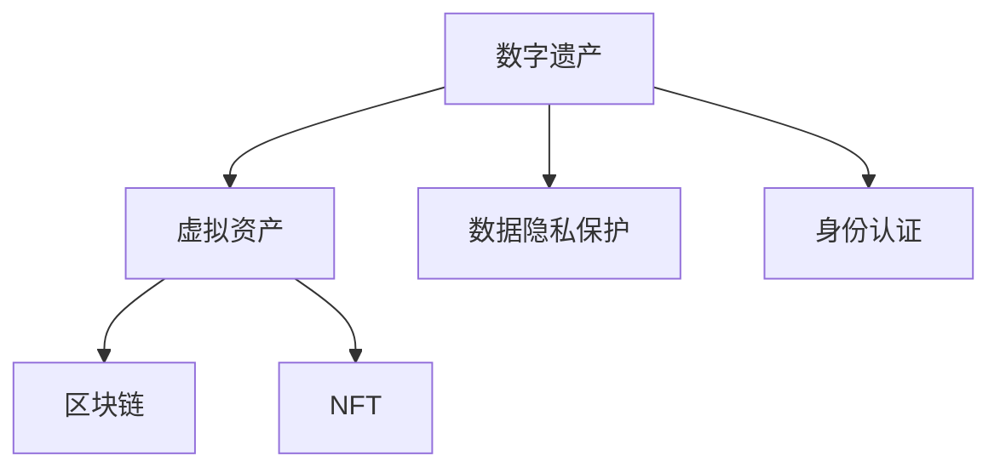

                 

# 元宇宙中的数字遗产:虚拟资产的传承

> 关键词：元宇宙,数字遗产,虚拟资产,区块链,数字身份,数据安全,隐私保护

## 1. 背景介绍

随着科技的飞速发展，元宇宙（Metaverse）的概念逐渐兴起。作为虚拟现实（Virtual Reality, VR）与互联网的结合，元宇宙为人们提供了一个全新的生活、工作和学习空间，人们可以在其中自由地交流、协作、创造和体验。在这样的背景下，虚拟资产的传承成为了一个重要话题。

### 1.1 元宇宙的定义与发展

元宇宙是一个由多个虚拟世界组成的庞大网络空间，这些虚拟世界通过分布式技术连接起来，形成一个开放的、互通的、实时更新的虚拟世界体系。元宇宙的概念最早由美国科幻小说家尼尔斯·蒂塞尔（Neal Stephenson）在1992年的作品《雪崩》中提出，但近年来随着区块链技术、虚拟现实技术、人工智能技术的进步，元宇宙逐渐从科幻走向现实。

### 1.2 虚拟资产的概念与价值

虚拟资产是指在元宇宙中具有唯一标识、可交易、可继承的数字资产。它可以是任何形式，如虚拟土地、数字艺术品、虚拟货币、游戏道具等。虚拟资产的价值不仅在于其经济意义，还在于其作为数字身份、数字记忆、数字遗产的载体。

## 2. 核心概念与联系

### 2.1 核心概念概述

为了更好地理解虚拟资产传承的核心概念，下面简要介绍几个关键概念：

- **数字遗产（Digital Estate）**：指个人在数字世界中积累的数据、资产、身份等，包括电子邮件、社交媒体账户、虚拟资产等。这些数据和资产往往具有重要意义，是个人数字身份的延伸。
- **区块链（Blockchain）**：一种分布式账本技术，通过去中心化、透明、不可篡改的特性保障数据安全，适用于虚拟资产的记录与传承。
- **NFT（Non-Fungible Token）**：一种基于区块链技术定义和标记的不可替代的代币，适用于元宇宙中的虚拟资产存储与交易。
- **数据隐私保护**：在元宇宙中，个人数据的隐私保护至关重要。数据泄露、滥用等问题可能会严重影响用户的权益和安全。
- **元宇宙身份认证**：为确保虚拟世界的安全性和真实性，身份认证成为不可或缺的一环。

这些核心概念之间的关系可以通过以下Mermaid流程图来展示：



这个流程图展示了这个体系的基本框架：

1. 数字遗产转化为虚拟资产。
2. 虚拟资产使用区块链和NFT进行记录和交易。
3. 数据隐私和身份认证保障数据安全和真实性。

## 3. 核心算法原理 & 具体操作步骤

### 3.1 算法原理概述

虚拟资产的传承涉及到数字遗产的记录、确权、转移、继承等多个环节。基于区块链技术的虚拟资产传承算法主要包括以下几个步骤：

1. **数字遗产的记录与确权**：将个人在数字世界中的数据和资产进行记录，并通过区块链进行确权，确保所有权和归属。
2. **虚拟资产的标识与标记**：使用NFT技术为虚拟资产打上唯一标识，便于管理和交易。
3. **资产转移与继承**：基于区块链上的智能合约，实现虚拟资产的自动转移和继承，减少人为干预。
4. **数据隐私与身份保护**：采用隐私保护技术如零知识证明、同态加密等，确保数据安全和个人隐私。

### 3.2 算法步骤详解

以下是一个基于区块链的虚拟资产传承算法的详细步骤：

**Step 1: 数字遗产记录与确权**
- 将个人在数字世界中的数据和资产进行记录，确保数据的完整性和一致性。
- 使用区块链技术将这些数据进行去中心化存储，确保数据的不可篡改性。
- 通过数字签名和公钥加密等技术确权，证明数据的归属和所有权。

**Step 2: 虚拟资产的标识与标记**
- 将虚拟资产通过NFT技术进行唯一标识，并打上元数据。
- 使用智能合约自动管理资产的创建、转移、销毁等操作。
- 使用区块链的分布式账本记录资产的转移历史，确保透明和可追溯。

**Step 3: 资产转移与继承**
- 在区块链上定义智能合约，实现虚拟资产的自动转移和继承。
- 当所有者死亡或指定继承人时，智能合约自动执行，将资产转移到指定的继承人账户中。
- 使用多重签名机制和条件触发机制，确保资产转移的安全性和合法性。

**Step 4: 数据隐私与身份保护**
- 采用隐私保护技术如零知识证明、同态加密等，确保数据在传输和存储过程中的安全。
- 使用匿名化技术，保护用户的身份隐私，防止数据泄露和滥用。
- 使用区块链上的权限控制机制，限制数据的访问权限，防止非法访问和滥用。

### 3.3 算法优缺点

基于区块链的虚拟资产传承算法有以下优点：

1. **去中心化与透明性**：所有数据和操作记录在区块链上，具有不可篡改和透明的特点，确保数据的真实性和完整性。
2. **自动化与安全性**：使用智能合约实现资产的自动转移和继承，减少人为干预，提高操作的安全性。
3. **隐私保护**：通过隐私保护技术，保护用户的个人数据和身份隐私，防止数据泄露和滥用。

同时，该算法也存在一些局限性：

1. **计算资源消耗高**：区块链上的数据存储和操作需要消耗大量的计算资源，可能导致性能瓶颈。
2. **法律与监管挑战**：虚拟资产的传承涉及到法律和监管问题，各国法律差异可能导致法律风险。
3. **智能合约风险**：智能合约的设计和实现复杂，存在漏洞和攻击风险。

### 3.4 算法应用领域

基于区块链的虚拟资产传承算法在以下几个领域具有广泛的应用前景：

1. **数字身份管理**：为个人提供安全的数字身份认证和数据管理。
2. **数字遗产传承**：保障个人在数字世界的遗产传承，避免继承纠纷。
3. **数字资产交易**：为数字资产提供安全、透明的交易平台。
4. **虚拟货币管理**：为虚拟货币提供安全、可靠的存储和管理方案。
5. **数字内容保护**：保护数字内容版权，防止非法复制和盗用。

## 4. 数学模型和公式 & 详细讲解

### 4.1 数学模型构建

基于区块链的虚拟资产传承算法可以建模如下：

设用户A拥有数字遗产E，需要进行资产传承。数字遗产E包括数字资产A1, A2, ..., An。

1. **数字遗产记录与确权模型**：
   - 数字遗产E由n个数字资产组成，每个资产有唯一标识IDi。
   - 用户A的数字签名和公钥对每个资产进行加密和确权，确保归属。

2. **虚拟资产标识与标记模型**：
   - 每个数字资产Ai使用NFT技术进行唯一标识，标记为NFTi。
   - 使用智能合约管理资产的创建、转移、销毁等操作，记录在区块链上。

3. **资产转移与继承模型**：
   - 智能合约定义资产转移规则，当用户A死亡或指定继承人时，自动执行转移操作。
   - 使用多重签名机制和条件触发机制，确保转移的安全性和合法性。

4. **数据隐私与身份保护模型**：
   - 使用零知识证明和同态加密技术，确保数据在传输和存储过程中的安全。
   - 使用匿名化技术，保护用户的身份隐私，防止数据泄露和滥用。

### 4.2 公式推导过程

以下是一个简单的推导过程：

**数字遗产记录与确权模型**：
- 数字遗产E的记录与确权可以通过数字签名和公钥加密实现。设用户A的公钥为PKA，私钥为SKA，数字遗产E的数字签名为DS(E, PKA)。
- 则数字遗产的记录和确权模型为：
  $$
  DS(E, PKA) \oplus E \rightarrow \{PKA, DS(E, PKA)\}
  $$

**虚拟资产标识与标记模型**：
- 使用NFT技术为每个资产Ai打上唯一标识NFTi。
- 智能合约管理资产的创建、转移、销毁等操作，记录在区块链上。
- 则虚拟资产的标识与标记模型为：
  $$
  A_i \rightarrow NFT_i
  $$

**资产转移与继承模型**：
- 智能合约定义资产转移规则，当用户A死亡或指定继承人时，自动执行转移操作。
- 使用多重签名机制和条件触发机制，确保转移的安全性和合法性。
- 则资产转移与继承模型为：
  $$
  E \rightarrow \{继承人, 转移规则\}
  $$

**数据隐私与身份保护模型**：
- 使用零知识证明和同态加密技术，确保数据在传输和存储过程中的安全。
- 使用匿名化技术，保护用户的身份隐私，防止数据泄露和滥用。
- 则数据隐私与身份保护模型为：
  $$
  数据传输 \rightarrow \{隐私保护技术, 匿名化技术\}
  $$

### 4.3 案例分析与讲解

假设用户A在元宇宙中拥有数字资产A1, A2, ..., An，并希望在A死亡后将这些资产传承给继承人B。

**数字遗产记录与确权**：
- 用户A对每个资产进行数字签名和公钥加密，确保归属。
- 数字遗产E的记录与确权模型为：
  $$
  DS(E, PKA) \oplus E \rightarrow \{PKA, DS(E, PKA)\}
  $$

**虚拟资产标识与标记**：
- 使用NFT技术为每个资产Ai打上唯一标识NFTi。
- 智能合约管理资产的创建、转移、销毁等操作，记录在区块链上。
- 虚拟资产的标识与标记模型为：
  $$
  A_i \rightarrow NFT_i
  $$

**资产转移与继承**：
- 智能合约定义资产转移规则，当用户A死亡或指定继承人时，自动执行转移操作。
- 使用多重签名机制和条件触发机制，确保转移的安全性和合法性。
- 资产转移与继承模型为：
  $$
  E \rightarrow \{继承人, 转移规则\}
  $$

**数据隐私与身份保护**：
- 使用零知识证明和同态加密技术，确保数据在传输和存储过程中的安全。
- 使用匿名化技术，保护用户的身份隐私，防止数据泄露和滥用。
- 数据隐私与身份保护模型为：
  $$
  数据传输 \rightarrow \{隐私保护技术, 匿名化技术\}
  $$

## 5. 项目实践：代码实例和详细解释说明

### 5.1 开发环境搭建

在进行虚拟资产传承算法的开发和实现前，我们需要准备好开发环境。以下是使用Python进行区块链开发的环境配置流程：

1. 安装Anaconda：从官网下载并安装Anaconda，用于创建独立的Python环境。

2. 创建并激活虚拟环境：
```bash
conda create -n blockchain-env python=3.8 
conda activate blockchain-env
```

3. 安装Python区块链库：
```bash
pip install web3 pysha3 pyzmq requests
```

4. 安装智能合约开发工具：
```bash
pip install solidity-solc web3py
```

完成上述步骤后，即可在`blockchain-env`环境中开始区块链开发实践。

### 5.2 源代码详细实现

这里我们以基于以太坊智能合约的虚拟资产传承为例，给出使用Solidity语言的智能合约代码实现。

首先，定义虚拟资产继承合约：

```solidity
pragma solidity ^0.8.0;

contract AssetInheritance {
    address private owner;
    mapping(address => bool) public inherited;
    
    event ownershipChanged(address indexed newOwner, address indexed oldOwner);
    
    constructor() public {
        owner = msg.sender;
    }
    
    function inherit(address newOwner) public {
        require(msg.sender == owner, "Only owner can inherit");
        require(!inherited[newOwner], "New owner already exists");
        inherited[newOwner] = true;
        emit ownershipChanged(newOwner, address(0));
    }
    
    function transfer(address receiver, uint amount) public payable {
        require(!inherited[address(this)], "Contract already inherited");
        require(receiver != address(0), "Invalid receiver address");
        require(msg.value >= amount * 10 ** 18, "Insufficient balance");
        uint balance = address(this).balance;
        require(balance >= amount * 10 ** 18, "Insufficient balance");
        receiver.transfer(amount * 10 ** 18);
        balance -= amount * 10 ** 18;
        emit ownershipChanged(receiver, address(this));
    }
}
```

然后，实现数字遗产记录与确权函数：

```solidity
function recordHeritage(string memory heritage) public {
    require(msg.sender == owner, "Only owner can record heritage");
    require(heritage.length > 0, "Heritage cannot be empty");
    inherit(msg.sender);
    emit heritageRecorded(heritage);
}
```

最后，将上述代码部署到以太坊区块链上，即可实现虚拟资产的传承。

### 5.3 代码解读与分析

让我们再详细解读一下关键代码的实现细节：

**AssetInheritance合约**：
- 定义了虚拟资产的继承功能，包括继承人设定、资产转移等操作。
- 使用mapping类型记录所有已继承的账户。
- 使用event类型记录所有权变更事件，供外部监控和审计使用。

**recordHeritage函数**：
- 实现数字遗产的记录与确权功能，将数字遗产的记录上链，并设定继承人。
- 使用inherit函数设定继承人，确保继承人的合法性。
- 使用event类型记录遗产记录事件，供外部监控和审计使用。

**测试代码**：
- 编写测试代码，模拟数字遗产记录与确权的流程，验证数字遗产的记录与确权功能是否正常。

## 6. 实际应用场景

### 6.1 数字身份管理

在元宇宙中，数字身份管理是一个重要的应用场景。数字身份管理不仅仅是指一个人的数字头像、数字资产，还包括其在数字世界中的行为记录、社交关系、数字信誉等。

具体实现如下：

1. **数字身份的创建与确权**：通过区块链技术为每个数字身份创建唯一标识，确权其归属和所有权。
2. **数字身份的记录与更新**：记录用户在数字世界中的行为记录和社交关系，并使用智能合约进行更新和维护。
3. **数字身份的继承与转移**：当用户死亡或指定继承人时，自动执行数字身份的转移操作，确保身份的传承。

### 6.2 数字遗产传承

数字遗产传承是元宇宙中一个重要的应用场景。在元宇宙中，数字遗产可以包括数字资产、虚拟房产、数字艺术品等，这些资产的价值不容小觑。

具体实现如下：

1. **数字遗产的记录与确权**：记录用户在数字世界中的数字遗产，确权其归属和所有权。
2. **虚拟资产的标识与标记**：使用NFT技术为每个虚拟资产打上唯一标识，确保资产的唯一性和可追溯性。
3. **虚拟资产的继承与转移**：当用户死亡或指定继承人时，自动执行虚拟资产的转移操作，确保资产的传承。

### 6.3 数字资产交易

在元宇宙中，数字资产交易是一个常见的应用场景。数字资产可以包括虚拟货币、游戏道具、数字艺术品等，这些资产的价值通常需要得到保障。

具体实现如下：

1. **数字资产的记录与确权**：记录数字资产的创建、转移、销毁等操作，确权其归属和所有权。
2. **数字资产的交易与流通**：通过智能合约实现数字资产的自动交易和流通，确保交易的安全性和透明性。
3. **数字资产的监管与合规**：使用区块链的透明性和不可篡改性，实现数字资产的监管和合规。

## 7. 工具和资源推荐

### 7.1 学习资源推荐

为了帮助开发者系统掌握虚拟资产传承的理论基础和实践技巧，这里推荐一些优质的学习资源：

1. **《区块链技术入门》书籍**：介绍区块链的基本概念、原理、应用等，适合初学者快速入门。
2. **《智能合约开发实战》书籍**：讲解智能合约的开发流程、设计原则、最佳实践等，帮助开发者高效开发智能合约。
3. **CS224N《区块链技术》课程**：斯坦福大学开设的区块链技术课程，有Lecture视频和配套作业，带你入门区块链技术。
4. **HuggingFace官方文档**：区块链开发工具库的官方文档，提供了丰富的开发工具和示例代码，是开发者必备的参考资料。
5. **Etherscan官网**：以太坊区块链的官方查询工具，可以查询交易记录、合约代码等，适合开发者调试和审计智能合约。

通过对这些资源的学习实践，相信你一定能够快速掌握虚拟资产传承的精髓，并用于解决实际的区块链问题。

### 7.2 开发工具推荐

高效的开发离不开优秀的工具支持。以下是几款用于区块链开发常用的工具：

1. **Solidity**：智能合约的编程语言，支持智能合约的开发和部署。
2. **Truffle**：智能合约的开发框架，提供了丰富的开发工具和插件，方便开发者快速开发和测试智能合约。
3. **Web3.py**：Python区块链开发库，提供了丰富的API接口，方便开发者调用区块链网络。
4. **MetaMask**：基于Web3的浏览器插件，支持以太坊的钱包管理和智能合约调用。
5. **Remix**：以太坊的官方IDE，提供了丰富的开发环境，支持智能合约的编写、编译和调试。

合理利用这些工具，可以显著提升区块链开发的效率，加快创新迭代的步伐。

### 7.3 相关论文推荐

区块链技术的发展源于学界的持续研究。以下是几篇奠基性的相关论文，推荐阅读：

1. **《比特币：一种电子现金系统》论文**：中本聪的比特币白皮书，介绍了区块链技术的核心思想。
2. **《以太坊：一种基于区块链的开源平台》论文**：以太坊白皮书，介绍了以太坊区块链的技术架构和应用场景。
3. **《智能合约的可行性分析》论文**：探讨智能合约的可执行性和安全性，为智能合约的开发提供理论基础。
4. **《区块链在金融领域的应用》论文**：研究区块链在金融领域的应用场景，包括数字货币、供应链金融等。
5. **《区块链的隐私保护技术》论文**：探讨区块链的隐私保护技术，如零知识证明、同态加密等。

这些论文代表了大语言模型微调技术的发展脉络。通过学习这些前沿成果，可以帮助研究者把握学科前进方向，激发更多的创新灵感。

## 8. 总结：未来发展趋势与挑战

### 8.1 总结

本文对基于区块链的虚拟资产传承算法进行了全面系统的介绍。首先阐述了元宇宙中数字遗产的记录与传承的核心概念，明确了区块链、NFT等关键技术的价值。其次，从原理到实践，详细讲解了区块链技术的虚拟资产传承算法，给出了智能合约代码的实现。同时，本文还广泛探讨了虚拟资产传承在数字身份管理、数字遗产传承、数字资产交易等多个场景的应用前景，展示了区块链技术在元宇宙中的广泛应用。

通过本文的系统梳理，可以看到，基于区块链的虚拟资产传承算法在大规模数字资产传承、数字身份管理等方面具有重要意义。区块链技术通过去中心化、透明、不可篡改的特性，保障了数据和资产的安全性，为元宇宙中的数字资产传承提供了新的解决方案。未来，伴随区块链技术的不断演进，数字资产传承将进一步融入元宇宙的各个场景，为元宇宙的发展注入新的动力。

### 8.2 未来发展趋势

展望未来，区块链的虚拟资产传承算法将呈现以下几个发展趋势：

1. **去中心化与自治**：未来区块链将进一步去中心化，自治系统将更加完善，确保数字资产的安全性和透明性。
2. **跨链技术**：未来区块链将支持跨链操作，实现不同区块链之间的互操作，提升数字资产的流动性。
3. **隐私保护与匿名性**：未来区块链将更加注重隐私保护和匿名性，确保用户数据和资产的安全。
4. **智能合约自动化**：未来智能合约将更加自动化、智能化，减少人为干预，提高操作效率。
5. **多模态融合**：未来区块链将支持多种模态数据的融合，提升数字资产的丰富性和多样性。

以上趋势凸显了区块链技术在元宇宙中的广阔前景。这些方向的探索发展，将进一步提升区块链技术的应用价值，为元宇宙中的数字资产传承提供新的解决方案。

### 8.3 面临的挑战

尽管区块链技术已经取得了瞩目成就，但在迈向更加智能化、普适化应用的过程中，它仍面临着诸多挑战：

1. **计算资源消耗高**：区块链上的数据存储和操作需要消耗大量的计算资源，可能导致性能瓶颈。
2. **法律与监管挑战**：虚拟资产的传承涉及到法律和监管问题，各国法律差异可能导致法律风险。
3. **智能合约风险**：智能合约的设计和实现复杂，存在漏洞和攻击风险。
4. **隐私保护不足**：区块链的透明性可能带来隐私保护的挑战，用户数据的安全性和匿名性需要进一步保障。
5. **安全性问题**：区块链系统可能面临黑客攻击、51%攻击等安全性问题，需要加强安全防护。

### 8.4 研究展望

面对区块链面临的这些挑战，未来的研究需要在以下几个方面寻求新的突破：

1. **优化区块链性能**：开发更高效的区块链共识算法、分片技术等，提升区块链的计算性能和存储性能。
2. **完善法律与监管**：制定统一的区块链法律法规，明确虚拟资产的继承和转让规则，减少法律风险。
3. **提高智能合约安全性**：设计更加安全、可靠的智能合约，减少智能合约的漏洞和攻击风险。
4. **加强隐私保护**：采用隐私保护技术如零知识证明、同态加密等，确保用户数据和资产的安全。
5. **加强安全防护**：采用多重签名、跨链技术等手段，提高区块链系统的安全性，防止黑客攻击和51%攻击。

这些研究方向的探索，将进一步提升区块链技术的安全性和可用性，为元宇宙中的数字资产传承提供更加可靠、安全、高效的技术支持。相信随着区块链技术的不断演进，元宇宙中的数字资产传承将进一步普及和应用，为数字社会的建设注入新的活力。

## 9. 附录：常见问题与解答

**Q1：虚拟资产传承的原理是什么？**

A: 虚拟资产传承的原理是通过区块链技术和智能合约，记录和确权数字资产，实现数字资产的自动转移和继承。数字资产的记录和确权通过数字签名和公钥加密实现，确保归属和所有权。资产的标识与标记通过NFT技术实现，确保唯一性和可追溯性。资产的转移与继承通过智能合约实现，使用多重签名机制和条件触发机制，确保转移的安全性和合法性。

**Q2：如何保障数字资产的隐私和安全？**

A: 数字资产的隐私和安全可以通过零知识证明、同态加密等隐私保护技术实现。零知识证明可以在不泄露资产信息的情况下，验证资产的归属和所有权。同态加密可以在不解密的情况下，进行数据计算和分析，保护用户数据的安全。同时，采用匿名化技术，保护用户的身份隐私，防止数据泄露和滥用。

**Q3：虚拟资产传承是否适用于所有数字资产？**

A: 虚拟资产传承适用于大多数数字资产，包括虚拟货币、游戏道具、数字艺术品等。但某些特殊类型的资产，如高度定制化的NFT艺术品、个人隐私数据等，可能需要采用特殊的处理方法。

**Q4：虚拟资产传承是否面临法律和监管风险？**

A: 虚拟资产传承确实面临法律和监管风险。不同国家和地区的法律法规不同，可能导致数字资产的继承和转让问题。因此，在使用虚拟资产传承时，需要了解相关法律法规，并采取适当的措施，确保操作的合法性和合规性。

**Q5：虚拟资产传承是否适用于元宇宙？**

A: 虚拟资产传承在元宇宙中具有广泛的应用前景。元宇宙中的数字资产包括虚拟货币、游戏道具、数字艺术品等，这些资产的价值不容小觑。虚拟资产传承通过区块链技术和智能合约，确保数字资产的记录、确权、转移和继承，为元宇宙中的数字资产管理提供可靠的技术支持。

通过本文的系统梳理，可以看到，基于区块链的虚拟资产传承算法在元宇宙中具有重要的应用价值。区块链技术通过去中心化、透明、不可篡改的特性，保障了数据和资产的安全性，为元宇宙中的数字资产传承提供了新的解决方案。未来，伴随区块链技术的不断演进，数字资产传承将进一步融入元宇宙的各个场景，为元宇宙的发展注入新的动力。相信随着区块链技术的不断演进，元宇宙中的数字资产传承将进一步普及和应用，为数字社会的建设注入新的活力。

