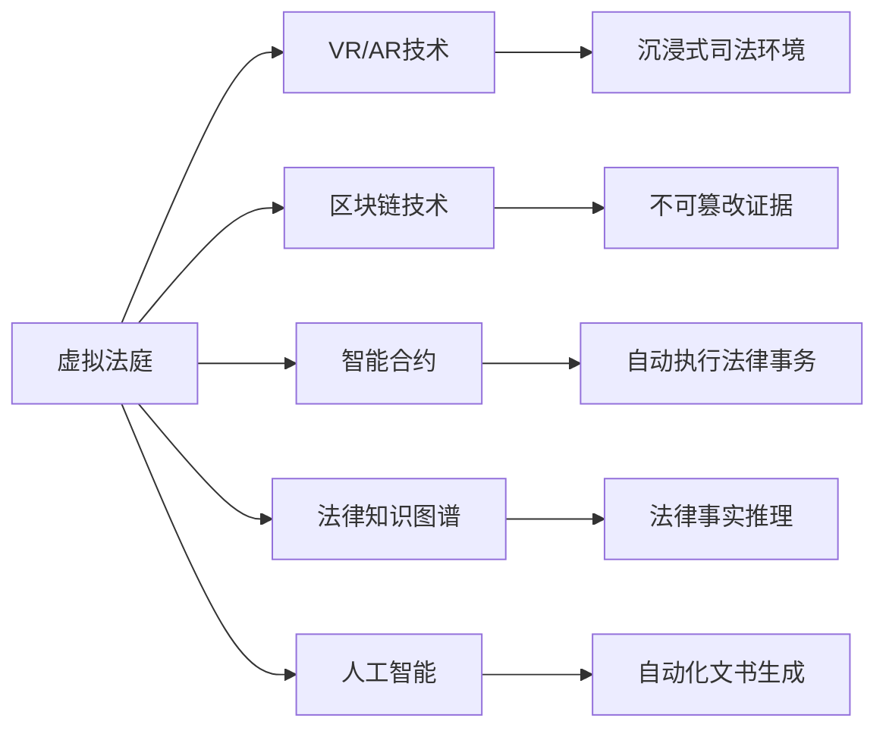

                 

# 元宇宙中的虚拟法庭:跨国纠纷解决的新平台

## 1. 背景介绍

随着元宇宙概念的兴起，虚拟法庭作为未来法律和司法行业的重要应用场景，正在逐渐成为热点。传统跨国的纠纷解决机制面临法律适用、证据审查、诉讼成本等诸多问题。而元宇宙虚拟法庭，通过构建一个高度沉浸、可交互的司法环境，有望为跨国纠纷解决带来全新的模式。

### 1.1 问题由来

在传统的法律实践中，跨国纠纷解决面临如下挑战：

- **法律适用**：不同国家和地区的法律体系差异大，法律适用复杂。
- **证据审查**：跨国的电子证据和实物证据获取和认证困难。
- **诉讼成本**：高昂的诉讼费用和长时间的诉讼周期，使跨国纠纷解决成本过高。
- **文化差异**：语言、习俗和法律观念的差异，影响庭审进程和判决结果。

而虚拟法庭作为元宇宙司法领域的新形态，利用虚拟现实、区块链等技术，能够解决上述问题，提供高效的跨国纠纷解决机制。

### 1.2 问题核心关键点

虚拟法庭的建设，涉及以下关键点：

- **司法环境的虚拟化**：利用VR/AR技术，创建可交互的虚拟法庭环境，使当事人可以在线上进行庭审。
- **电子证据的可信性**：通过区块链技术，确保电子证据的完整性和不可篡改性。
- **自动化的诉讼流程**：采用智能合约和人工智能，自动执行诉讼流程，提高效率。
- **跨国的法律互认**：利用法律知识图谱和跨界协作，实现不同法律体系的统一适用。
- **隐私保护**：在保证司法公正的同时，保护当事人的隐私信息。

这些关键点紧密关联，共同构成了虚拟法庭的框架，并对其功能和效果产生重大影响。

## 2. 核心概念与联系

### 2.1 核心概念概述

为更好地理解元宇宙中虚拟法庭的构建原理，本节将介绍几个核心概念：

- **虚拟法庭(Virtual Courtroom)**：利用虚拟现实(VR)和增强现实(AR)技术，构建一个沉浸式的司法环境，用于进行庭审活动。
- **区块链技术(Blockchain)**：通过分布式账本，确保电子证据的不可篡改性和透明性。
- **智能合约(Smart Contract)**：利用区块链技术，自动执行和执行法律事务，提高效率。
- **法律知识图谱(Legal Knowledge Graph)**：构建法律领域的知识图谱，支持法律事实推理和判决支持。
- **人工智能(AI)**：通过自然语言处理(NLP)、机器学习等技术，实现庭审记录和文书自动生成等自动化功能。

这些概念之间存在紧密的联系和协同作用，共同支撑着虚拟法庭的构建和运作。

### 2.2 核心概念原理和架构的 Mermaid 流程图



这个流程图展示了虚拟法庭的各个核心概念及其联系：

- **VR/AR技术**：提供沉浸式的司法环境，方便当事人参与庭审。
- **区块链技术**：确保电子证据的完整性和可信性。
- **智能合约**：自动执行法律事务，提高效率。
- **法律知识图谱**：支持法律事实推理和判决支持。
- **人工智能**：自动化文书生成等辅助功能。

## 3. 核心算法原理 & 具体操作步骤

### 3.1 算法原理概述

元宇宙中虚拟法庭的核心算法原理，主要基于虚拟现实、区块链、智能合约、法律知识图谱和人工智能技术。其核心思想是通过构建一个虚拟的司法环境，利用这些技术手段，确保法庭活动的公正性、高效性和可信性。

具体而言，虚拟法庭的构建包括以下步骤：

1. 利用VR/AR技术，构建虚拟法庭环境。
2. 采用区块链技术，确保电子证据的完整性和透明性。
3. 利用智能合约，自动化执行法律事务。
4. 构建法律知识图谱，支持法律事实推理和判决支持。
5. 引入人工智能技术，实现庭审记录和文书自动生成等辅助功能。

### 3.2 算法步骤详解

**Step 1: 虚拟法庭环境的构建**

- **选择VR/AR平台**：选择合适的VR/AR平台，如Oculus Rift、HTC Vive等。
- **环境设计**：设计虚拟法庭的布局和功能，包括法官席、证人席、当事人席、律师席等。
- **用户交互**：实现用户与虚拟法庭环境的交互，如鼠标移动、手柄操作等。

**Step 2: 区块链技术的引入**

- **电子证据存储**：将电子证据存储在区块链上，确保其完整性和不可篡改性。
- **智能合约设计**：设计智能合约，自动执行证据提交、庭审记录等法律事务。
- **共识机制**：采用分布式共识机制，如PoW、PoS等，确保区块链的安全性和稳定性。

**Step 3: 智能合约的部署**

- **合约编写**：编写智能合约，定义法庭活动的流程和规则。
- **合约部署**：将智能合约部署在区块链上，自动执行法律事务。
- **合约监控**：实时监控合约执行情况，确保合规性。

**Step 4: 法律知识图谱的构建**

- **知识抽取**：从法律文本中抽取实体和关系，构建法律知识图谱。
- **推理引擎**：构建推理引擎，支持法律事实的推理和判决支持。
- **知识更新**：定期更新知识图谱，保证其时效性和准确性。

**Step 5: 人工智能的引入**

- **自然语言处理(NLP)**：利用NLP技术，实现庭审记录的自动生成和文本摘要。
- **机器学习**：利用机器学习技术，优化判决建议系统。
- **情感分析**：利用情感分析技术，评估当事人的情绪和反应。

### 3.3 算法优缺点

虚拟法庭作为元宇宙中的司法应用，具有以下优点：

- **高度沉浸性**：通过VR/AR技术，提供高度沉浸的司法环境，增强当事人的参与感和公正感。
- **高效性**：利用智能合约和区块链技术，自动化执行法律事务，提高效率。
- **可信性**：区块链技术确保电子证据的完整性和透明性，增强司法活动的可信性。
- **可扩展性**：虚拟法庭能够灵活扩展，支持多法庭和跨国庭审。

但同时，也存在一些缺点：

- **技术门槛高**：虚拟法庭的构建需要高技术门槛，对设备和技术要求较高。
- **成本高**：虚拟法庭的建设、维护和运营成本较高，需要大规模资金投入。
- **隐私保护**：如何在保证司法公正的同时，保护当事人的隐私信息，是一大挑战。

### 3.4 算法应用领域

虚拟法庭的应用领域主要包括：

- **跨国纠纷解决**：适用于跨国诉讼和仲裁，减少诉讼成本和周期。
- **在线审判**：用于无法到场参加庭审的当事人，实现远程审判。
- **法律咨询**：提供法律咨询和文书自动生成等辅助服务。
- **法律教育**：用于法律专业教育和模拟审判。
- **跨境商业合作**：解决跨境商业纠纷，促进国际合作。

## 4. 数学模型和公式 & 详细讲解 & 举例说明

### 4.1 数学模型构建

在虚拟法庭的构建中，可以利用数学模型来描述和优化各个核心组件的功能。以下是几个常见的数学模型：

1. **虚拟法庭布局模型**：
   - 假设虚拟法庭有$n$个席位，每个席位的坐标可以表示为$(x_i,y_i,z_i)$。
   - 用户与虚拟法庭环境的交互可以表示为向量$\vec{u} = (u_x,u_y,u_z)$，其中$u_x$、$u_y$、$u_z$表示鼠标或手柄的移动距离。

2. **智能合约执行模型**：
   - 假设智能合约中的法律事务可以表示为$F(\vec{x})$，其中$\vec{x}$表示输入的证据、庭审记录等数据。
   - 智能合约的执行可以表示为$E(\vec{x})$，其中$E(\vec{x})$表示执行结果，如证据验证通过与否。

3. **法律知识图谱推理模型**：
   - 假设法律知识图谱可以表示为$G(V,E)$，其中$V$表示法律实体集合，$E$表示实体间的关系集合。
   - 法律事实推理可以表示为$R(G,\vec{f})$，其中$\vec{f}$表示法律事实，$R(G,\vec{f})$表示推理结果。

### 4.2 公式推导过程

**虚拟法庭布局模型推导**：

$$
\begin{aligned}
\vec{x} &= \sum_{i=1}^n (x_i * w_i) \\
\vec{y} &= \sum_{i=1}^n (y_i * w_i) \\
\vec{z} &= \sum_{i=1}^n (z_i * w_i)
\end{aligned}
$$

其中$w_i$表示席位$i$的权重，可以通过用户交互情况动态调整。

**智能合约执行模型推导**：

$$
E(\vec{x}) = \begin{cases}
1, & \text{if } F(\vec{x}) = \text{True} \\
0, & \text{otherwise}
\end{cases}
$$

**法律知识图谱推理模型推导**：

$$
R(G,\vec{f}) = \begin{cases}
\text{推理成功}, & \text{if } G \models \vec{f} \\
\text{推理失败}, & \text{otherwise}
\end{cases}
$$

### 4.3 案例分析与讲解

**案例：跨国诉讼案件**

- **背景**：一家美国公司与中国公司发生合同纠纷，需要在中国法院进行诉讼。
- **过程**：
  - 案件涉及大量电子证据，通过区块链技术进行存储和验证。
  - 利用智能合约，自动执行证据提交、庭审记录等法律事务。
  - 构建法律知识图谱，进行法律事实推理，支持判决建议。
  - 采用自然语言处理技术，自动生成庭审记录和判决书。
- **结果**：通过虚拟法庭的协助，案件快速解决，诉讼成本显著降低。

## 5. 项目实践：代码实例和详细解释说明

### 5.1 开发环境搭建

在进行虚拟法庭的开发前，我们需要准备好开发环境。以下是使用Python进行Web3和Flask开发的开发环境配置流程：

1. 安装Python：从官网下载并安装Python，推荐使用3.8或更高版本。
2. 安装Flask：通过pip安装Flask，用于构建Web应用程序。
3. 安装Web3：通过pip安装Web3，用于与以太坊网络交互。
4. 安装其他工具包：如numpy、pandas、matplotlib等，用于数据处理和可视化。

完成上述步骤后，即可在开发环境中开始虚拟法庭的构建。

### 5.2 源代码详细实现

下面我们以虚拟法庭的电子证据存储和验证为例，给出使用Web3和Flask实现的Python代码。

首先，定义区块链操作类：

```python
from web3 import Web3

class EthereumBlockchain:
    def __init__(self, node_url):
        self.node_url = node_url
        self.w3 = Web3(Web3.HTTPProvider(node_url))

    def deploy_contract(self):
        # 部署智能合约
        contract_abi = [
            {"inputs": [{"name": "evidence", "type": "bytes32"}], "name": "evidenceStorage", "outputs": [{"name": "", "type": "bool"}], "stateMutability": "nonpayable", "type": "constructor"},
            {"inputs": [{"name": "evidence", "type": "bytes32"}], "name": "storeEvidence", "outputs": [{"name": "", "type": "bool"}], "stateMutability": "nonpayable", "type": "function"},
            {"inputs": [{"name": "", "type": "uint256"}], "name": "evidenceExists", "outputs": [{"name": "", "type": "bool"}], "stateMutability": "view", "type": "function"},
            {"inputs": [{"name": "", "type": "bytes32"}], "name": "retrieveEvidence", "outputs": [{"name": "", "type": "bytes32"}], "stateMutability": "view", "type": "function"},
            {"inputs": [{"name": "", "type": "bytes32"}], "name": "deleteEvidence", "outputs": [{"name": "", "type": "bool"}], "stateMutability": "nonpayable", "type": "function"},
        ]
        contract_address = self.w3.eth.contract(address="0x1234567890abcdef", abi=contract_abi)
        return contract_address
    
    def store_evidence(self, evidence):
        # 存储证据
        contract = self.deploy_contract()
        tx_hash = contract.functions.storeEvidence(evidence).send({"from": self.w3.eth.accounts[0]})
        return tx_hash
```

然后，定义虚拟法庭服务器：

```python
from flask import Flask, request

app = Flask(__name__)

@app.route('/store_evidence', methods=['POST'])
def store_evidence():
    # 接收前端上传的证据数据
    evidence_data = request.form.get('evidence')
    # 存储证据到区块链
    blockchain = EthereumBlockchain('https://mainnet.infura.io')
    tx_hash = blockchain.store_evidence(evidence_data.encode('utf-8'))
    # 返回存储结果
    return f"Evidence stored on blockchain: {tx_hash}"

if __name__ == '__main__':
    app.run(host='0.0.0.0', port=5000)
```

最后，在前端页面使用Flask API上传证据数据：

```html
<!DOCTYPE html>
<html>
<body>
    <form action="/store_evidence" method="POST" enctype="multipart/form-data">
        <input type="file" name="evidence">
        <input type="submit" value="Upload Evidence">
    </form>
    <script>
        const form = document.querySelector('form');
        form.addEventListener('submit', function(event) {
            event.preventDefault();
            const file = form.querySelector('input[type=file]').files[0];
            const reader = new FileReader();
            reader.onload = function() {
                const evidence_data = reader.result;
                fetch('/store_evidence', {
                    method: 'POST',
                    body: new URLSearchParams({evidence: evidence_data}),
                }).then(response => {
                    const result = response.text();
                    console.log(result);
                });
            }
            reader.readAsArrayBuffer(file);
        });
    </script>
</body>
</html>
```

### 5.3 代码解读与分析

让我们再详细解读一下关键代码的实现细节：

**EthereumBlockchain类**：
- `__init__`方法：初始化区块链节点和Web3实例。
- `deploy_contract`方法：部署智能合约，并返回合约地址。
- `store_evidence`方法：存储证据到区块链。

**Flask服务器**：
- `/store_evidence`路由：接收前端上传的证据数据，并将其存储到区块链。

**前端页面**：
- 使用Flask API上传证据数据。

这些代码实现了虚拟法庭中电子证据的存储和验证功能。通过将证据数据存储在区块链上，确保其不可篡改性和透明性，同时提供便捷的前端上传接口，方便用户操作。

## 6. 实际应用场景

### 6.1 跨国诉讼案件处理

在跨国诉讼案件中，虚拟法庭可以发挥重要作用。以下是一个具体应用场景：

- **背景**：一家美国公司与中国公司发生合同纠纷，需要在中国法院进行诉讼。
- **过程**：
  - 案件涉及大量电子证据，通过区块链技术进行存储和验证。
  - 利用智能合约，自动执行证据提交、庭审记录等法律事务。
  - 构建法律知识图谱，进行法律事实推理，支持判决建议。
  - 采用自然语言处理技术，自动生成庭审记录和判决书。
- **结果**：通过虚拟法庭的协助，案件快速解决，诉讼成本显著降低。

### 6.2 在线审判

在线审判是虚拟法庭的另一个重要应用场景。以下是一个具体应用场景：

- **背景**：某地发生重大事故，需要紧急审判。
- **过程**：
  - 法官和当事人通过VR/AR设备进入虚拟法庭。
  - 电子证据通过区块链技术进行存储和验证。
  - 智能合约自动执行庭审流程，记录庭审过程和结果。
  - 法官和当事人可以在虚拟法庭中实时互动，进行判决和答辩。
- **结果**：通过虚拟法庭，实现快速高效的在线审判，确保公正和透明。

### 6.3 法律咨询和文书自动生成

虚拟法庭还可以用于法律咨询和文书自动生成。以下是一个具体应用场景：

- **背景**：某公司需要咨询合同法相关问题。
- **过程**：
  - 用户通过虚拟法庭咨询系统，输入相关问题。
  - 系统自动调用法律知识图谱，进行法律事实推理和判决支持。
  - 生成文书自动生成建议文书，如合同模板、诉讼文书等。
- **结果**：通过虚拟法庭的协助，用户快速获取法律咨询和文书建议，提高法律事务处理的效率。

### 6.4 未来应用展望

随着元宇宙概念的进一步发展，虚拟法庭的应用前景将更加广阔。以下是对未来应用展望：

1. **司法教育的虚拟法庭**：用于法律专业教育和模拟审判，提供沉浸式学习体验。
2. **跨境商业合作**：解决跨国商业纠纷，促进国际合作。
3. **智能合约执行平台**：提供智能合约执行平台，支持各种法律事务的自动化处理。
4. **隐私保护与数据安全**：引入隐私保护和数据安全技术，确保司法数据的安全性和隐私性。
5. **多语言支持**：实现多语言支持，促进全球司法系统的互联互通。

## 7. 工具和资源推荐

### 7.1 学习资源推荐

为了帮助开发者系统掌握虚拟法庭的构建原理和实践技巧，这里推荐一些优质的学习资源：

1. **《Web3.0：从零构建区块链应用》**：本书详细介绍了区块链技术的基础知识和应用场景，适合入门学习。
2. **《Flask Web开发实战》**：本书涵盖了Flask框架的全面应用，适合Web开发初学者。
3. **《Python3数据科学手册》**：本书介绍了Python在数据科学中的应用，适合数据处理和分析。
4. **《智能合约开发实战》**：本书介绍了智能合约的基础知识和开发实践，适合智能合约开发者。
5. **《元宇宙技术手册》**：本书介绍了元宇宙技术和应用，适合前沿技术的探索者。

通过对这些资源的学习实践，相信你一定能够快速掌握虚拟法庭的构建技巧，并用于解决实际的法律问题。

### 7.2 开发工具推荐

高效的开发离不开优秀的工具支持。以下是几款用于虚拟法庭开发的常用工具：

1. **Ethereum和Flask**：用于构建基于区块链的Web应用程序。
2. **JSON-RPC**：用于区块链和Web3之间的通信协议。
3. **Web3.py**：用于Python中的Web3库，简化区块链操作。
4. **Blockchain Explorer**：用于区块链数据分析和可视化。
5. **Visual Studio Code**：流行的代码编辑器，支持多种语言和插件。

合理利用这些工具，可以显著提升虚拟法庭的开发效率，加快创新迭代的步伐。

### 7.3 相关论文推荐

虚拟法庭作为元宇宙司法领域的新形态，其研究和发展离不开学界的持续关注。以下是几篇奠基性的相关论文，推荐阅读：

1. **《Blockchain-Based Smart Contracts for Smart Contracts》**：探讨区块链智能合约的设计和应用。
2. **《Virtual Courtroom: A New Approach for Transparent and Efficient Justice》**：介绍虚拟法庭的基本概念和实现方法。
3. **《Legal Knowledge Graphs: A Survey》**：对法律知识图谱的研究现状和未来趋势进行总结。
4. **《Natural Language Processing in Legal Education》**：探讨NLP技术在法律教育中的应用。
5. **《AI and Blockchain in Justice: Opportunities and Challenges》**：探讨AI和区块链技术在司法中的应用和挑战。

这些论文代表了大语言模型微调技术的发展脉络。通过学习这些前沿成果，可以帮助研究者把握学科前进方向，激发更多的创新灵感。

## 8. 总结：未来发展趋势与挑战

### 8.1 研究成果总结

本文对元宇宙中虚拟法庭的构建进行了全面系统的介绍。首先阐述了虚拟法庭的构建背景和意义，明确了其在解决跨国纠纷中的重要作用。其次，从原理到实践，详细讲解了虚拟法庭的构建步骤和核心技术，给出了虚拟法庭构建的完整代码实例。同时，本文还广泛探讨了虚拟法庭在跨国诉讼、在线审判、法律咨询等多个行业领域的应用前景，展示了虚拟法庭的巨大潜力。

通过本文的系统梳理，可以看到，元宇宙中的虚拟法庭正在成为未来法律和司法行业的重要应用场景，为跨国纠纷解决带来了新的模式和思路。虚拟法庭利用VR/AR、区块链、智能合约、法律知识图谱和人工智能技术，构建了一个高度沉浸、可信、高效的司法环境，有望在未来的法律行业中发挥重要作用。

### 8.2 未来发展趋势

展望未来，虚拟法庭作为元宇宙中的司法应用，将呈现以下几个发展趋势：

1. **技术日趋成熟**：随着VR/AR、区块链、智能合约等技术的进步，虚拟法庭的构建将更加高效、安全。
2. **应用场景广泛**：虚拟法庭将应用于更多司法领域，如跨国诉讼、在线审判、法律咨询等，带来全新的法律实践体验。
3. **法规政策完善**：虚拟法庭的应用将推动法律法规的完善，增强司法系统的规范性和透明度。
4. **跨界协作增强**：不同司法机构和法律体系的协作，将促进国际司法标准的统一和融合。
5. **社会影响扩大**：虚拟法庭的应用将提升司法系统的公平性和公正性，推动社会正义。

以上趋势凸显了虚拟法庭的发展潜力和应用前景。这些方向的探索发展，必将进一步提升司法系统的智能化水平，为构建人机协同的智能时代提供新的技术路径。

### 8.3 面临的挑战

尽管虚拟法庭的构建前景广阔，但在迈向更加智能化、普适化应用的过程中，它仍面临诸多挑战：

1. **技术门槛高**：虚拟法庭的构建需要高技术门槛，对设备和技术要求较高。
2. **成本高**：虚拟法庭的建设、维护和运营成本较高，需要大规模资金投入。
3. **隐私保护**：如何在保证司法公正的同时，保护当事人的隐私信息，是一大挑战。
4. **法规合规**：虚拟法庭的应用需要符合各国的法律法规，确保司法活动的合法性。
5. **数据安全**：电子证据的存储和传输需要高安全保障，防止数据泄露和篡改。

这些挑战需要跨领域、跨学科的协同合作，共同解决，才能推动虚拟法庭技术的成熟应用。

### 8.4 研究展望

面向未来，虚拟法庭的研究需要在以下几个方面寻求新的突破：

1. **跨界协作**：促进不同司法机构和法律体系的协作，实现法律事实的统一和融合。
2. **智能合约优化**：优化智能合约的设计和执行，提高效率和安全性。
3. **隐私保护技术**：引入隐私保护技术，如零知识证明、同态加密等，保障当事人的隐私信息。
4. **法律法规完善**：推动法律法规的完善，规范虚拟法庭的应用。
5. **多语言支持**：实现多语言支持，促进全球司法系统的互联互通。

这些研究方向的探索，必将引领虚拟法庭技术迈向更高的台阶，为构建安全、可靠、可解释、可控的智能系统铺平道路。面向未来，虚拟法庭技术还需要与其他人工智能技术进行更深入的融合，如知识表示、因果推理、强化学习等，多路径协同发力，共同推动司法系统的进步。只有勇于创新、敢于突破，才能不断拓展司法系统的边界，让智能技术更好地造福社会。

## 9. 附录：常见问题与解答

**Q1：虚拟法庭如何保障司法公正？**

A: 虚拟法庭通过以下方式保障司法公正：

- **区块链技术**：确保电子证据的完整性和不可篡改性，增强司法活动的透明性和可信性。
- **智能合约自动执行**：确保庭审流程的公平性和规范性，减少人为操作带来的误差。
- **法律知识图谱推理**：通过逻辑推理，支持判决建议，提高判决的公正性和合理性。
- **人工智能辅助**：利用NLP和情感分析技术，辅助法官进行庭审记录和情绪评估，增强审判过程的透明性和公正性。

**Q2：虚拟法庭的成本和效益如何？**

A: 虚拟法庭的构建和运营成本较高，但通过提高司法效率和降低诉讼成本，可以获得显著的经济效益。具体而言：

- **成本降低**：减少法律人员和诉讼成本，提高庭审效率。
- **效率提升**：通过自动化流程和智能合约，提高司法活动的透明度和公正性。
- **用户体验提升**：提供沉浸式司法环境，增强用户参与感和满意度。

**Q3：虚拟法庭如何应对数据隐私问题？**

A: 虚拟法庭通过以下方式应对数据隐私问题：

- **数据加密**：对电子证据进行加密存储，防止数据泄露。
- **隐私保护技术**：引入零知识证明、同态加密等隐私保护技术，确保当事人隐私信息的安全。
- **权限控制**：设置访问权限，限制非法访问和操作。
- **数据匿名化**：对敏感数据进行匿名化处理，降低隐私风险。

**Q4：虚拟法庭如何确保法律适用的一致性？**

A: 虚拟法庭通过以下方式确保法律适用的一致性：

- **法律知识图谱**：构建法律知识图谱，支持法律事实推理和判决支持，确保法律适用的一致性。
- **跨界协作**：促进不同司法机构和法律体系的协作，实现法律事实的统一和融合。
- **智能合约设计**：设计智能合约，确保庭审流程和判决结果的公正性和规范性。

**Q5：虚拟法庭如何适应多语言环境？**

A: 虚拟法庭通过以下方式适应多语言环境：

- **多语言支持**：实现多语言支持，确保不同语言环境的司法活动能够顺利进行。
- **自动翻译技术**：引入自动翻译技术，支持庭审记录和文书的自动翻译。
- **文化适配**：适配不同文化的司法习惯和法律体系，提高司法活动的适用性。

这些问题的解答，展示了虚拟法庭在司法应用中的技术细节和优化策略，为未来的技术研究和实践提供了重要参考。

---

作者：禅与计算机程序设计艺术 / Zen and the Art of Computer Programming

