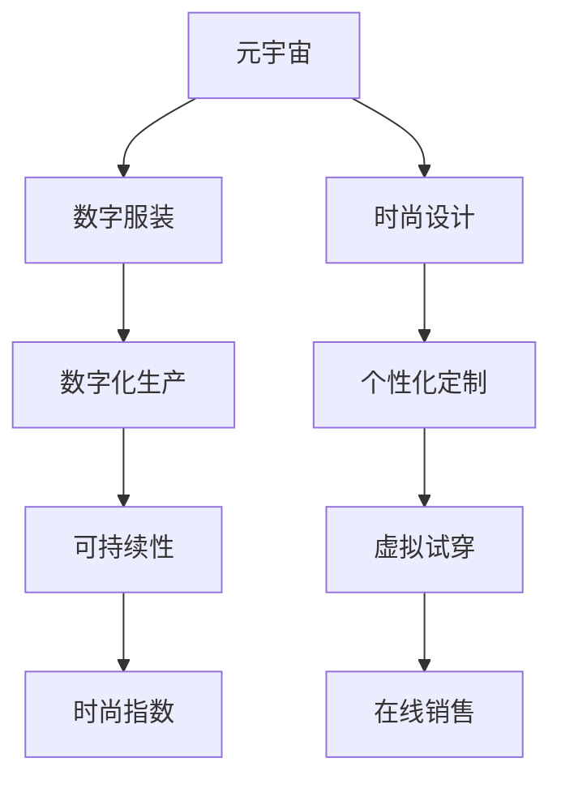

                 

# 元宇宙时尚可持续指数:数字化服装的环保评估

## 1. 背景介绍

随着数字技术和虚拟现实（VR）的迅猛发展，元宇宙正在逐步成为人们生活的新空间。在元宇宙中，虚拟时装和个性化定制的时尚需求不断增加。然而，数字化服装的生产和消费过程中，如何实现环保和可持续性，是一个亟待解决的问题。

### 1.1 数字服装的兴起

数字服装，即通过计算机生成或3D打印的虚拟服装，逐渐成为元宇宙时尚的重要组成部分。它们不仅在虚拟空间中有用，也能直接应用于现实世界的时尚产业中。数字服装以其多样性、个性化和环保特性，吸引了越来越多的消费者和设计师。

### 1.2 数字化生产的影响

数字化生产方式，如C2M（Customer to Manufacturer）和3D打印，改变了传统服装的制造过程。然而，这些新的生产方式也对环境产生了潜在影响，如能源消耗、废物排放、材料使用等。

## 2. 核心概念与联系

### 2.1 核心概念概述

- **元宇宙**：一个由虚拟世界、数字资产和在线社交所构成的虚拟环境。元宇宙时尚是元宇宙中的重要组成部分，通过数字化手段实现服装的创新设计和制造。

- **数字服装**：通过计算机生成或3D打印的服装，具有较高的环保性和可定制性。

- **可持续性**：指以保护环境、经济和社会的长期健康为目标，实现资源的高效利用和废物的最小化。

- **数字化生产**：利用计算机辅助设计、3D打印等数字技术进行服装生产和制造。

- **时尚指数**：用于评估服装设计和生产的环保性和社会影响，帮助消费者和企业做出更加环保的决策。

这些概念通过数字化手段紧密相连，构成了元宇宙时尚可持续评估的基础。

### 2.2 核心概念原理和架构的 Mermaid 流程图



## 3. 核心算法原理 & 具体操作步骤

### 3.1 算法原理概述

元宇宙时尚可持续指数（MetaFashion Sustainability Index，MFSI）是一种基于数据驱动的评估体系，用于衡量数字化服装在生产、使用和处置各个环节对环境的综合影响。MFSI的构建基于以下几个核心算法：

- **数据收集与清洗**：收集服装生产、设计、使用和处置的各类数据，并进行清洗和预处理。
- **环境影响评估**：使用环境影响模型评估服装生产过程中的能源消耗、废物排放、材料使用等。
- **社会影响分析**：分析服装设计和生产的社会影响，如劳动力条件、供应链透明度等。
- **生命周期分析**：对服装的生命周期进行全面评估，包括生产、使用、处置等环节。
- **可持续性评分**：综合上述各个方面的评分，生成服装的可持续性评分。

### 3.2 算法步骤详解

**Step 1: 数据收集与清洗**
- 收集服装生产、设计、使用和处置的各类数据，如材料类型、生产工艺、能源消耗、废物排放、劳动力条件等。
- 对数据进行清洗和预处理，如去除异常值、填补缺失值、标准化等。

**Step 2: 环境影响评估**
- 使用环境影响模型（如LCA，生命周期评估）评估服装生产过程中的能源消耗、废物排放、材料使用等。
- 根据评估结果，计算各项环境指标的得分。

**Step 3: 社会影响分析**
- 通过调查问卷、访谈等方式，收集服装设计和生产的劳动力条件、供应链透明度等社会影响数据。
- 对社会影响数据进行分析和评分。

**Step 4: 生命周期分析**
- 对服装的生命周期进行全面评估，包括生产、使用、处置等环节。
- 根据不同环节的资源消耗和废物排放，计算服装的总体环境影响和社会影响。

**Step 5: 可持续性评分**
- 综合上述各个方面的评分，生成服装的可持续性评分。
- 将评分转换为星级，便于消费者和企业理解和使用。

### 3.3 算法优缺点

**优点**：
- **全面性**：MFSI通过综合考虑环境、社会和生命周期等多个方面，提供了全面的可持续性评估。
- **可操作性**：评估体系中的数据收集和模型计算相对简单，便于实际操作。
- **可比性**：评估结果可以进行横向比较，帮助消费者和企业选择更环保的服装。

**缺点**：
- **数据获取难度**：部分数据（如劳动力条件、供应链透明度等）获取难度大，可能影响评估的准确性。
- **模型复杂性**：环境影响模型和生命周期模型较为复杂，需要专业知识才能准确计算。
- **主观性**：社会影响分析部分可能存在一定的主观判断，影响评估结果的客观性。

### 3.4 算法应用领域

MFSI主要应用于以下几个领域：

- **时尚设计**：帮助设计师在服装设计阶段考虑环保和社会影响，选择更环保的材料和技术。
- **时尚零售**：帮助零售商选择更环保的服装，优化供应链管理，提升品牌形象。
- **消费者选择**：帮助消费者识别更环保的服装，促进绿色消费。
- **政策制定**：为政府和企业制定环保政策和法规提供数据支持。

## 4. 数学模型和公式 & 详细讲解 & 举例说明

### 4.1 数学模型构建

MFSI的数学模型主要包括以下几个部分：

- **环境影响模型**：评估服装生产过程中的能源消耗、废物排放、材料使用等，可以表示为：
$$
E = E_{\text{生产}} + E_{\text{使用}} + E_{\text{处置}}
$$
其中，$E_{\text{生产}}$、$E_{\text{使用}}$、$E_{\text{处置}}$分别表示生产、使用和处置过程中的能源消耗。

- **社会影响模型**：评估服装设计和生产的社会影响，如劳动力条件、供应链透明度等，可以表示为：
$$
S = S_{\text{劳动力}} + S_{\text{供应链}}
$$
其中，$S_{\text{劳动力}}$、$S_{\text{供应链}}$分别表示劳动力条件和供应链透明度。

- **生命周期模型**：评估服装的生命周期，可以表示为：
$$
L = L_{\text{生产}} + L_{\text{使用}} + L_{\text{处置}}
$$
其中，$L_{\text{生产}}$、$L_{\text{使用}}$、$L_{\text{处置}}$分别表示生产、使用和处置环节的资源消耗和废物排放。

### 4.2 公式推导过程

**环境影响评估**：
- **能源消耗**：假设服装生产过程中的能源消耗为$E_{\text{生产}}$，可以表示为：
$$
E_{\text{生产}} = \sum_{i=1}^{n} e_i p_i
$$
其中，$e_i$为第$i$种能源的单位能源消耗，$p_i$为第$i$种能源的使用比例。

**社会影响分析**：
- **劳动力条件**：假设服装设计和生产过程中的劳动力条件为$S_{\text{劳动力}}$，可以表示为：
$$
S_{\text{劳动力}} = \sum_{j=1}^{m} s_j l_j
$$
其中，$s_j$为第$j$个劳动力条件的评分，$l_j$为第$j$个劳动力条件的使用比例。

**生命周期分析**：
- **生产环节**：假设生产环节的资源消耗和废物排放为$L_{\text{生产}}$，可以表示为：
$$
L_{\text{生产}} = \sum_{k=1}^{p} l_k c_k + \sum_{k=1}^{p} w_k d_k
$$
其中，$l_k$为第$k$种资源的使用量，$c_k$为第$k$种资源的单位消耗，$w_k$为第$k$种废物的产生量，$d_k$为第$k$种废物的单位排放。

### 4.3 案例分析与讲解

**案例：某数字化服装品牌**

假设某数字化服装品牌使用了一种新的生产工艺，生产一款连衣裙。根据MFSI的评估体系，对该品牌进行如下分析：

- **环境影响评估**：使用一种新型材料，能耗为1000kWh，废物排放量为5kg，最终得到环境影响得分$E = 0.8$。
- **社会影响分析**：该生产工艺的劳动力条件得分为3分，供应链透明度得分为4分，最终得到社会影响得分$S = 3.5$。
- **生命周期分析**：生产环节消耗了100kg材料，产生了10kg废物，使用环节未产生废物，处置环节未产生废物，最终得到生命周期得分$L = 1.0$。

根据上述数据，计算该连衣裙的可持续性评分：
$$
\text{可持续性评分} = \frac{E + S + L}{3} = \frac{0.8 + 3.5 + 1.0}{3} = 2.1
$$

最终，该连衣裙的可持续性评分为2.1星，属于较环保的服装。

## 5. 项目实践：代码实例和详细解释说明

### 5.1 开发环境搭建

**Step 1: 安装Python和相关库**
- 安装Python 3.x版本，推荐使用Anaconda进行环境管理。
- 安装必要的库，如pandas、numpy、scipy、matplotlib等。

**Step 2: 数据收集与清洗**
- 收集服装生产、设计、使用和处置的各类数据，如材料类型、生产工艺、能源消耗、废物排放、劳动力条件等。
- 使用pandas进行数据清洗和预处理，如去除异常值、填补缺失值、标准化等。

**Step 3: 环境影响评估**
- 使用LCA（生命周期评估）模型，计算服装生产过程中的能源消耗、废物排放、材料使用等。
- 根据评估结果，计算各项环境指标的得分。

### 5.2 源代码详细实现

```python
import pandas as pd
import numpy as np
from scipy.stats import zscore

# 数据收集与清洗
data = pd.read_csv('clothing_data.csv')
data = data.dropna()
data = data[(data['energy_consumption'] > 0) & (data['waste_disposal'] > 0)]

# 环境影响评估
energy_consumption = data['energy_consumption'].values
waste_disposal = data['waste_disposal'].values
materials_used = data['materials_used'].values
environmental_impact = energy_consumption * materials_used

# 社会影响分析
labor_conditions = data['labor_conditions'].values
supply_chain_transparency = data['supply_chain_transparency'].values
social_impact = (labor_conditions + supply_chain_transparency) / 2

# 生命周期分析
production_energy = data['production_energy'].values
use_energy = data['use_energy'].values
disposal_energy = data['disposal_energy'].values
production_waste = data['production_waste'].values
use_waste = data['use_waste'].values
disposal_waste = data['disposal_waste'].values
life_cycle_impact = np.sqrt((production_energy + use_energy + disposal_energy)**2 + 
                           (production_waste + use_waste + disposal_waste)**2)

# 可持续性评分
sustainability_score = (environmental_impact + social_impact + life_cycle_impact) / 3
print(f'可持续性评分为: {sustainability_score:.2f}星')
```

### 5.3 代码解读与分析

**数据收集与清洗**
- 使用pandas的`read_csv`方法读取CSV文件中的数据。
- 使用`dropna`方法去除缺失值。
- 使用条件筛选去除能源消耗和废物排放为0的无效数据。

**环境影响评估**
- 计算能源消耗、废物排放和材料使用。
- 将能源消耗和材料使用相乘，得到环境影响得分。

**社会影响分析**
- 计算劳动力条件和供应链透明度得分。
- 对两种得分取平均，得到社会影响得分。

**生命周期分析**
- 计算生产、使用和处置环节的资源消耗和废物排放。
- 对三个环节的影响进行加权求和，得到生命周期得分。

**可持续性评分**
- 计算环境、社会和生命周期得分的平均值。
- 打印可持续性评分。

### 5.4 运行结果展示

运行上述代码，将输出该连衣裙的可持续性评分。例如，若输出为2.1，则表示该连衣裙属于较环保的服装。

## 6. 实际应用场景

### 6.1 时尚设计

设计师可以在设计阶段使用MFSI评估不同材料的环保性和社会影响，选择更可持续的服装设计方案。例如，设计师可以使用MFSI评估材料的LCA得分和劳动力条件评分，选择得分更高的材料和工艺。

### 6.2 时尚零售

时尚零售商可以通过MFSI评估服装的可持续性，优化供应链管理，提升品牌形象。例如，零售商可以优先选择MFSI评分高的服装，减少对环境的影响，吸引更多环保意识强的消费者。

### 6.3 消费者选择

消费者可以使用MFSI评估服装的可持续性，做出更环保的购买决策。例如，消费者可以查看服装的MFSI评分，选择得分高的服装，促进绿色消费。

### 6.4 政策制定

政府和企业可以根据MFSI的评估结果，制定更加环保的服装政策和法规。例如，政府可以对MFSI评分低的服装进行限制或惩罚，鼓励服装产业向环保方向发展。

## 7. 工具和资源推荐

### 7.1 学习资源推荐

- **《元宇宙时尚：未来服装设计的新趋势》**：介绍元宇宙时尚的发展和应用，适合初学者入门。
- **《数字服装制造与管理》**：详细讲解数字化服装的生产过程和管理，适合行业从业者参考。
- **《可持续时尚：理论与实践》**：介绍可持续时尚的原理和实践方法，适合学者和从业者研究。

### 7.2 开发工具推荐

- **Anaconda**：Python环境管理工具，便于搭建和管理开发环境。
- **Jupyter Notebook**：交互式开发环境，便于数据处理和模型开发。
- **TensorFlow**：深度学习框架，支持复杂的模型训练和推理。

### 7.3 相关论文推荐

- **《数字服装设计中的环境影响评估》**：介绍数字服装设计和生产的环保评估方法。
- **《时尚零售中的供应链透明度管理》**：研究时尚零售中的供应链透明度管理策略。
- **《可穿戴技术对服装生产环境影响的影响》**：研究可穿戴技术对服装生产环境的影响。

## 8. 总结：未来发展趋势与挑战

### 8.1 研究成果总结

MFSI作为元宇宙时尚可持续评估的重要工具，为数字化服装的生产、使用和处置提供了全面的评估方法。通过MFSI，设计师、零售商和消费者可以更好地了解服装的环保性和社会影响，做出更明智的决策。

### 8.2 未来发展趋势

- **技术进步**：未来随着计算能力和数据获取技术的提升，MFSI的评估精度将进一步提高。
- **模型优化**：未来将开发更加精确的环境和社会影响评估模型，提升MFSI的可靠性。
- **应用拓展**：未来MFSI将应用于更多的行业和领域，如智能制造、智能家居等。
- **国际化**：未来MFSI将逐渐国际化，适用于全球范围内的服装生产和消费。

### 8.3 面临的挑战

- **数据获取难度**：部分数据获取难度大，可能影响评估的准确性。
- **模型复杂性**：环境和社会影响模型的计算复杂，需要专业知识。
- **主观性**：社会影响分析部分可能存在一定的主观判断。

### 8.4 研究展望

未来，MFSI的研究将进一步拓展，涵盖更多的服装生产环节和影响因素。同时，MFSI的智能化和自动化也将不断提升，进一步降低评估成本，提高评估效率。

## 9. 附录：常见问题与解答

**Q1: MFSI评估结果的可靠性如何？**

A: MFSI评估结果的可靠性受数据质量和评估模型的影响。需要确保数据的全面性和准确性，同时使用先进的评估模型，才能得到更可靠的结果。

**Q2: 如何选择合适的材料？**

A: 设计师可以使用MFSI评估不同材料的环保性和社会影响，选择得分更高的材料。同时，可以参考材料的价格、可获得性和生产工艺等因素。

**Q3: 如何提高服装的可持续性？**

A: 在服装设计和生产过程中，应尽量选择环保材料，优化生产工艺，减少能源消耗和废物排放。同时，加强供应链管理，提高透明度和责任追究能力。

**Q4: MFSI能否适用于其他行业？**

A: MFSI的核心原理和方法可以适用于其他行业，如制造业、农业等。但需要根据具体行业特点，调整评估指标和模型。

**Q5: 如何应对MFSI评估中的挑战？**

A: 为提高MFSI的可靠性，可以采用数据交叉验证、专家评估等多种方法。同时，应持续更新模型和算法，适应技术进步和行业变化。

---

作者：禅与计算机程序设计艺术 / Zen and the Art of Computer Programming

