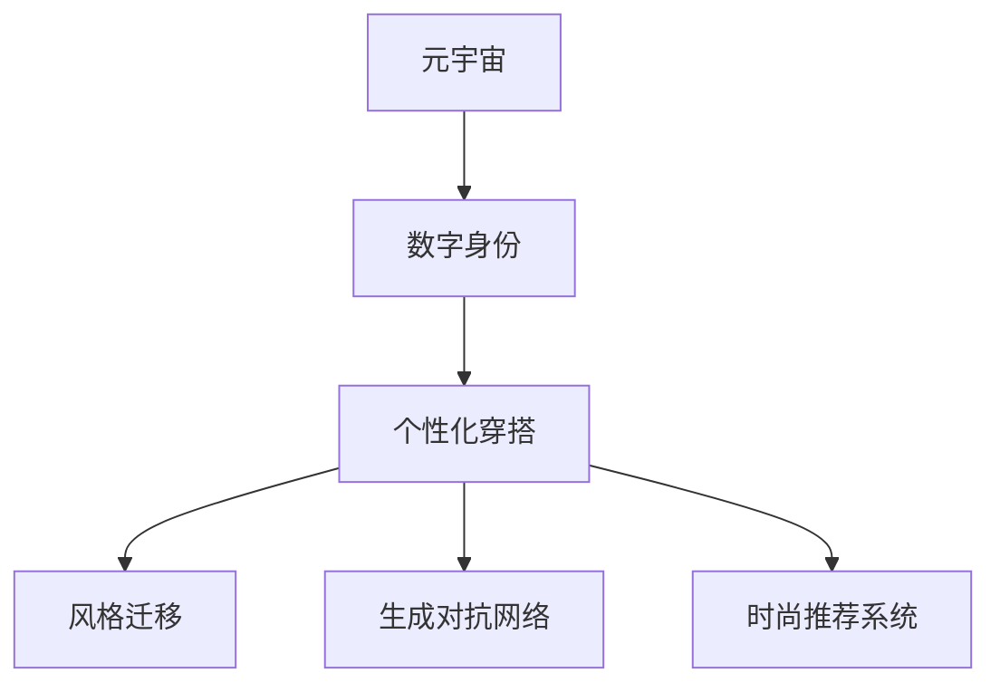

                 

# 元宇宙时尚：数字化穿搭与身份表达

## 1. 背景介绍

### 1.1 问题由来
随着虚拟现实和增强现实技术的飞速发展，元宇宙（Metaverse）的概念被广泛提及，其融合了虚拟世界与现实世界，为用户提供了一种全新的沉浸式体验。在元宇宙中，用户不再受物理世界的限制，可以进行交流、互动、娱乐等活动。数字化身份表达和个性化穿搭成为用户在元宇宙中展示自我、塑造形象的重要方式。

### 1.2 问题核心关键点
如何构建能够表达用户个性、风格和身份的数字化穿搭系统，成为了元宇宙时尚发展的重要课题。传统的基于图像的穿搭生成技术（如风格迁移、图像生成对抗网络）虽然可以实现个性化的穿搭效果，但往往缺乏与用户身份的关联。如何在元宇宙中，根据用户的身份信息和偏好，智能推荐合适的穿搭和个性化物品，是一个亟待解决的问题。

### 1.3 问题研究意义
数字身份表达和个性化穿搭，不仅能够提升用户的元宇宙体验，还能促进时尚元素的创新和传播。通过对用户身份和偏好的智能分析，实现穿搭的个性化定制，使每个用户在元宇宙中都能拥有独特的身份和风格，这不仅提升了用户粘性，还为时尚品牌和设计师提供了新的展示和销售渠道。

## 2. 核心概念与联系

### 2.1 核心概念概述

为了更好地理解元宇宙时尚的应用，本节将介绍几个密切相关的核心概念：

- **元宇宙（Metaverse）**：一个虚拟的、沉浸式的网络空间，由用户创建和维护，可以在其中进行社交、商业、娱乐等多种活动。
- **数字身份（Digital Identity）**：用户在元宇宙中的虚拟化身，代表了其在虚拟世界中的形象、行为和身份。
- **个性化穿搭（Personalized Outfit）**：根据用户偏好和风格，自动生成的数字化服装、饰品等穿搭元素。
- **风格迁移（Style Transfer）**：将一幅图像转换成另一幅图像的风格的技术，可以应用于元宇宙中的穿搭生成。
- **生成对抗网络（GANs）**：一种通过对抗训练生成逼真图像的深度学习模型，可以用于元宇宙中的虚拟场景和物品生成。
- **时尚推荐系统（Fashion Recommendation）**：根据用户偏好和历史行为，推荐时尚单品和穿搭组合的系统。

这些核心概念之间的逻辑关系可以通过以下Mermaid流程图来展示：



这个流程图展示了几者之间的核心联系：

1. 用户通过数字身份进入元宇宙，具有虚拟形象。
2. 在元宇宙中，用户可以根据自身偏好生成个性化穿搭。
3. 生成个性化穿搭涉及风格迁移、生成对抗网络等技术。
4. 时尚推荐系统可以辅助用户获取更多穿搭灵感。

## 3. 核心算法原理 & 具体操作步骤
### 3.1 算法原理概述

元宇宙时尚的核心算法原理基于深度学习，特别是生成模型和推荐系统的融合。其核心思想是：利用深度学习模型生成具有个性化风格的穿搭，并通过推荐系统根据用户偏好和历史行为，智能推荐合适的穿搭元素。

具体而言，用户在元宇宙中创建数字身份后，系统会采集其行为、兴趣、偏好等信息，作为生成个性化穿搭的依据。系统通过风格迁移、生成对抗网络等技术，生成符合用户风格的穿搭，并结合时尚推荐系统，进一步优化和推荐，最终生成用户满意的穿搭。

### 3.2 算法步骤详解

元宇宙时尚的应用通常包括以下几个关键步骤：

**Step 1: 数据收集与预处理**
- 收集用户的数字身份信息、行为数据、兴趣偏好等，作为个性生成穿搭的依据。
- 对收集的数据进行清洗和标注，构建用户特征向量，便于后续生成和推荐。

**Step 2: 搭建生成模型**
- 选择适合的风格迁移模型或生成对抗网络模型，用于生成符合用户风格的穿搭。
- 训练模型，使其能够在大量穿搭数据上生成具有个性化风格的穿搭。

**Step 3: 集成推荐系统**
- 搭建时尚推荐系统，根据用户特征向量，推荐适合其风格的穿搭元素。
- 将推荐结果与生成模型的输出进行融合，进一步优化穿搭生成。

**Step 4: 用户交互与反馈**
- 用户在元宇宙中进行穿搭生成，并选择生成结果。
- 系统根据用户反馈，不断调整和优化模型，提升个性化穿搭的效果。

**Step 5: 模型部署与维护**
- 将优化后的模型部署到元宇宙平台，供用户使用。
- 定期更新模型，确保其能够适应新的数据分布和用户需求。

以上是元宇宙时尚的核心算法步骤，但每个步骤的实现细节和关键点还需根据具体需求进行优化和调整。

### 3.3 算法优缺点

元宇宙时尚的生成模型和推荐系统融合方法具有以下优点：
1. 个性生成：通过风格迁移和生成对抗网络，能够生成具有个性化风格的穿搭，满足用户多样化的需求。
2. 高效推荐：时尚推荐系统可以快速筛选和推荐适合的穿搭元素，提升用户体验。
3. 智能优化：系统能够根据用户反馈不断调整模型，持续改进穿搭生成效果。

同时，该方法也存在一定的局限性：
1. 数据依赖：高质量的训练数据和用户数据对模型性能至关重要，获取和标注成本较高。
2. 计算资源需求高：生成和推荐模型往往需要较大的计算资源，用户端的设备可能无法支持。
3. 隐私风险：用户的隐私信息需妥善保护，防止数据泄露和滥用。
4. 用户体验不稳定：模型的输出与生成的穿搭效果，可能与用户的期望不符，需要进一步优化。

尽管存在这些局限性，但基于生成模型和推荐系统的融合，元宇宙时尚已经展现出了强大的应用潜力。未来相关研究的重点在于如何进一步降低数据和计算资源的依赖，提升用户体验，同时兼顾隐私保护和伦理安全。

### 3.4 算法应用领域

元宇宙时尚的应用场景主要包括以下几个方面：

- **虚拟购物平台**：用户可以在虚拟商店中进行穿搭试穿，系统根据用户偏好生成个性化穿搭。
- **虚拟试衣间**：用户创建数字身份后，可以在虚拟试衣间中实时生成和试穿穿搭。
- **社交网络平台**：在虚拟社交网络中，用户可以展示自己的穿搭风格，获取朋友的点赞和评论。
- **虚拟活动和派对**：在虚拟活动和派对中，系统根据活动主题，推荐合适的穿搭，提升用户体验。
- **游戏和模拟**：在游戏和模拟应用中，用户可以根据角色需求生成个性化穿搭，提升沉浸感。

这些应用场景展示了元宇宙时尚的多样性和广阔前景。随着技术的进步和应用的推广，元宇宙时尚必将在更多领域中得到应用，为用户的数字生活带来更多乐趣和可能性。

## 4. 数学模型和公式 & 详细讲解  
### 4.1 数学模型构建

本节将使用数学语言对元宇宙时尚的应用进行更加严格的刻画。

记用户特征向量为 $\mathbf{x} \in \mathbb{R}^n$，生成模型为 $G_\theta$，推荐模型为 $R_\phi$。假设用户生成穿搭的目标函数为 $L(G_\theta, R_\phi, \mathbf{x})$。

模型的目标是最小化目标函数，即找到最优的生成和推荐模型：

$$
\mathop{\arg\min}_{\theta, \phi} L(G_\theta, R_\phi, \mathbf{x})
$$

其中 $G_\theta$ 和 $R_\phi$ 分别为生成模型和推荐模型的参数，$\mathbf{x}$ 为用户的特征向量。

### 4.2 公式推导过程

以生成对抗网络（GANs）为例，推导个性化穿搭生成的数学公式。

假设生成模型 $G_\theta$ 能够生成穿搭图像 $z \sim G_\theta(x)$，推荐模型 $R_\phi$ 能够评估穿搭质量 $R_\phi(z)$。目标函数可以定义为生成器和判别器的联合损失：

$$
L(G_\theta, R_\phi, \mathbf{x}) = \mathbb{E}_{x \sim p(x)} [\log D(R_\phi(G_\theta(x)))] + \mathbb{E}_{z \sim p(z)} [-\log D(G_\theta(z))]
$$

其中 $D$ 为判别器，$z$ 为噪声向量，$p(x)$ 和 $p(z)$ 分别为真实数据和噪声数据的分布。

在训练过程中，通过对抗训练的方式更新生成器和判别器的参数：

$$
G_\theta = \mathop{\arg\min}_{\theta} \mathbb{E}_{x \sim p(x)} [-\log D(R_\phi(G_\theta(x)))]
$$

$$
D = \mathop{\arg\max}_{\phi} \mathbb{E}_{x \sim p(x)} [\log D(R_\phi(G_\theta(x)))] + \mathbb{E}_{z \sim p(z)} [-\log D(G_\theta(z))]
$$

通过不断迭代优化，生成模型能够生成逼真的穿搭图像，推荐模型能够对生成的穿搭进行评分，最终生成符合用户风格的穿搭。

## 5. 项目实践：代码实例和详细解释说明
### 5.1 开发环境搭建

在进行元宇宙时尚开发前，我们需要准备好开发环境。以下是使用Python进行PyTorch开发的环境配置流程：

1. 安装Anaconda：从官网下载并安装Anaconda，用于创建独立的Python环境。

2. 创建并激活虚拟环境：
```bash
conda create -n fashion-env python=3.8 
conda activate fashion-env
```

3. 安装PyTorch：根据CUDA版本，从官网获取对应的安装命令。例如：
```bash
conda install pytorch torchvision torchaudio cudatoolkit=11.1 -c pytorch -c conda-forge
```

4. 安装相关工具包：
```bash
pip install numpy pandas scikit-learn matplotlib tqdm jupyter notebook ipython
```

完成上述步骤后，即可在`fashion-env`环境中开始元宇宙时尚的开发实践。

### 5.2 源代码详细实现

下面我们以生成对抗网络（GANs）在元宇宙时尚中的应用为例，给出使用PyTorch的代码实现。

首先，定义生成器和判别器的结构：

```python
import torch
import torch.nn as nn
import torch.optim as optim

class Generator(nn.Module):
    def __init__(self, latent_dim, img_size):
        super(Generator, self).__init__()
        self.img_size = img_size
        self.latent_dim = latent_dim
        self.model = nn.Sequential(
            nn.Linear(latent_dim, 256),
            nn.BatchNorm1d(256),
            nn.LeakyReLU(0.2),
            nn.Linear(256, 512),
            nn.BatchNorm1d(512),
            nn.LeakyReLU(0.2),
            nn.Linear(512, 1024),
            nn.BatchNorm1d(1024),
            nn.LeakyReLU(0.2),
            nn.Linear(1024, img_size*img_size),
            nn.Tanh()
        )
        
    def forward(self, z):
        return self.model(z)

class Discriminator(nn.Module):
    def __init__(self, img_size):
        super(Discriminator, self).__init__()
        self.img_size = img_size
        self.model = nn.Sequential(
            nn.Linear(img_size*img_size, 1024),
            nn.LeakyReLU(0.2),
            nn.Dropout(0.5),
            nn.Linear(1024, 512),
            nn.LeakyReLU(0.2),
            nn.Dropout(0.5),
            nn.Linear(512, 1),
            nn.Sigmoid()
        )
        
    def forward(self, x):
        return self.model(x)
```

然后，定义优化器和损失函数：

```python
from torch.optim import Adam

# 设置生成器和判别器的初始参数
G_optimizer = Adam(G.parameters(), lr=0.0002)
D_optimizer = Adam(D.parameters(), lr=0.0002)

# 定义生成器和判别器的损失函数
G_loss_fn = nn.BCELoss()
D_loss_fn = nn.BCELoss()

# 定义对抗训练的损失函数
D_real_loss_fn = nn.BCELoss()
D_fake_loss_fn = nn.BCELoss()
```

接着，定义训练和评估函数：

```python
from torch.utils.data import DataLoader
from tqdm import tqdm
from torchvision.utils import save_image

def train_epoch(G, D, G_optimizer, D_optimizer, real_images, latent_dim, batch_size):
    real_images = real_images.to(device)
    G.to(device)
    D.to(device)
    
    for batch_i in tqdm(range(len(real_images)//batch_size)):
        z = torch.randn(batch_size, latent_dim).to(device)
        
        G_loss = 0
        D_loss = 0
        
        real_labels = torch.ones(batch_size, 1).to(device)
        fake_labels = torch.zeros(batch_size, 1).to(device)
        
        real_images = real_images[batch_i*batch_size:(batch_i+1)*batch_size]
        
        fake_images = G(z)
        real_loss = D_loss_fn(D(fake_images), real_labels)
        fake_loss = D_loss_fn(D(fake_images), fake_labels)
        
        real_loss = D_real_loss_fn(D(real_images), real_labels)
        fake_loss = D_fake_loss_fn(D(fake_images), fake_labels)
        
        G_optimizer.zero_grad()
        D_optimizer.zero_grad()
        
        real_loss.backward()
        fake_loss.backward()
        
        G_optimizer.step()
        D_optimizer.step()
        
        G_loss += fake_loss.item()
        D_loss += (real_loss + fake_loss).item()
        
    return G_loss, D_loss
```

最后，启动训练流程并在测试集上评估：

```python
epochs = 100

for epoch_i in range(epochs):
    G_loss, D_loss = train_epoch(G, D, G_optimizer, D_optimizer, real_images, latent_dim, batch_size)
    
    if (epoch_i + 1) % 20 == 0:
        print(f"Epoch {epoch_i+1}, G_loss: {G_loss:.4f}, D_loss: {D_loss:.4f}")
        
        # 每20个epoch保存一次模型
        save_image(G(torch.randn(64, latent_dim).to(device)), f"out/{epoch_i+1}.png", nrow=8)
```

以上就是使用PyTorch对生成对抗网络（GANs）进行元宇宙时尚应用开发的完整代码实现。可以看到，得益于PyTorch的强大封装，我们可以用相对简洁的代码完成GAN的搭建和训练。

### 5.3 代码解读与分析

让我们再详细解读一下关键代码的实现细节：

**Generator和Discriminator类**：
- `__init__`方法：定义生成器和判别器的结构。
- `forward`方法：定义前向传播过程。

**优化器和损失函数**：
- `Adam`类：定义优化器。
- `nn.BCELoss`类：定义二分类交叉熵损失函数。

**train_epoch函数**：
- 定义对抗训练的损失函数，包括真实样本和生成样本的损失。
- 在每个批次上进行前向传播和反向传播，更新模型参数。
- 记录每个epoch的生成器和判别器的损失。
- 每20个epoch保存一次模型图像。

通过以上步骤，我们实现了基于GAN的元宇宙时尚应用。进一步的优化和改进可以包括：
- 引入数据增强技术，提升生成器生成的多样性。
- 优化生成器的结构，减少噪声向量的影响。
- 调整生成器的训练策略，如学习率调度、权重衰减等。

## 6. 实际应用场景
### 6.1 虚拟购物平台

在虚拟购物平台中，用户可以通过元宇宙身份进入虚拟商店，查看并试穿各种穿搭。系统根据用户的偏好和历史行为，智能推荐个性化的穿搭组合，提升购物体验。

具体而言，用户在虚拟商店中浏览穿搭商品，系统会采集其点击、浏览、购买行为等数据，构建用户特征向量。将特征向量输入到推荐模型中，生成个性化穿搭推荐，并在界面展示。用户可以根据推荐结果选择试穿，系统自动生成相应的穿搭效果，供用户查看和选择。

### 6.2 虚拟试衣间

虚拟试衣间是元宇宙时尚的重要应用场景之一。用户可以通过数字身份进入虚拟试衣间，实时生成和试穿穿搭。系统根据用户的偏好和历史行为，动态调整穿搭风格，提升试穿体验。

用户输入数字身份信息后，系统会采集其历史试穿数据和偏好设置，生成初始的穿搭建议。用户试穿后，系统会记录试穿结果，进一步优化穿搭建议。同时，系统会收集用户的试穿反馈，不断调整生成模型和推荐模型，提升个性化穿搭的效果。

### 6.3 社交网络平台

在社交网络平台中，用户可以展示自己的穿搭风格，获取朋友的点赞和评论。系统根据用户的社交行为和兴趣偏好，智能推荐适合的穿搭和物品。

用户上传穿搭图片或视频后，系统会采集其社交数据和历史评论，构建用户特征向量。将特征向量输入到推荐模型中，生成适合的穿搭和物品推荐，并在界面展示。用户可以进一步调整和优化穿搭，系统实时更新推荐结果，提升用户体验。

### 6.4 未来应用展望

随着元宇宙时尚的不断发展，未来在更多领域将会有新的应用场景涌现：

- **虚拟教育和培训**：在虚拟教育平台中，系统根据学生的学习行为和偏好，生成个性化教学内容和穿搭，提升学习体验。
- **虚拟健身和运动**：在虚拟健身平台中，系统根据用户的运动数据和偏好，生成个性化穿搭和物品推荐，提升运动体验。
- **虚拟旅行和旅游**：在虚拟旅游平台中，系统根据用户的旅行行为和偏好，生成个性化穿搭和物品推荐，提升旅行体验。
- **虚拟娱乐和游戏**：在游戏和虚拟娱乐场景中，系统根据用户的角色需求和偏好，生成个性化穿搭和物品，提升游戏体验。

总之，元宇宙时尚的未来应用前景广阔，将进一步拓展虚拟世界的深度和广度，为用户的数字生活带来更多可能和乐趣。

## 7. 工具和资源推荐
### 7.1 学习资源推荐

为了帮助开发者系统掌握元宇宙时尚的理论基础和实践技巧，这里推荐一些优质的学习资源：

1. **《深度学习与Python编程》**：这本书系统介绍了深度学习的基本概念和实践技巧，包括PyTorch等框架的使用。

2. **《生成对抗网络：理论与实践》**：这本书深入浅出地介绍了生成对抗网络的原理和应用，适合初学者和进阶读者。

3. **《Python深度学习》**：这本书详细介绍了深度学习在NLP、计算机视觉等领域的经典应用，包括时尚推荐系统等。

4. **Coursera的《深度学习》课程**：斯坦福大学开设的深度学习课程，系统讲解了深度学习的基本原理和应用。

5. **Kaggle上的时尚推荐系统竞赛**：Kaggle是一个数据科学竞赛平台，通过参与时尚推荐系统竞赛，可以实践并提升深度学习应用技能。

通过对这些资源的学习实践，相信你一定能够快速掌握元宇宙时尚的核心技术，并应用于实际项目中。

### 7.2 开发工具推荐

高效的开发离不开优秀的工具支持。以下是几款用于元宇宙时尚开发的常用工具：

1. **PyTorch**：基于Python的开源深度学习框架，灵活动态的计算图，适合快速迭代研究。支持生成对抗网络等深度学习模型。

2. **TensorFlow**：由Google主导开发的开源深度学习框架，生产部署方便，支持分布式训练和模型部署。

3. **HuggingFace的Transformers库**：包含多个预训练语言模型和时尚推荐系统，适合快速搭建和微调深度学习模型。

4. **Weights & Biases**：模型训练的实验跟踪工具，可以记录和可视化模型训练过程中的各项指标，方便对比和调优。

5. **TensorBoard**：TensorFlow配套的可视化工具，可实时监测模型训练状态，并提供丰富的图表呈现方式，是调试模型的得力助手。

6. **Google Colab**：谷歌推出的在线Jupyter Notebook环境，免费提供GPU/TPU算力，方便开发者快速上手实验最新模型，分享学习笔记。

合理利用这些工具，可以显著提升元宇宙时尚开发的效率，加速创新迭代的步伐。

### 7.3 相关论文推荐

元宇宙时尚的发展得益于学界的持续研究。以下是几篇奠基性的相关论文，推荐阅读：

1. **《Image-to-Image Translation with Conditional Adversarial Networks》**：该论文提出条件对抗生成网络，用于图像风格迁移，为元宇宙时尚的应用提供了基础。

2. **《A Style-Based Generator Architecture for Generative Adversarial Networks》**：该论文提出风格生成器架构，用于生成逼真的穿搭图像，进一步提升了元宇宙时尚的沉浸感。

3. **《Generative Adversarial Networks》**：该论文详细介绍了生成对抗网络的基本原理和实现方法，是理解元宇宙时尚生成模型的基础。

4. **《Fashion Recommendation with Deep Reinforcement Learning》**：该论文提出基于深度强化学习的时尚推荐系统，为元宇宙时尚推荐模型提供了新的思路。

5. **《Fashion Recommendation Using Deep Neural Networks with Visual Attention》**：该论文提出使用视觉注意力机制的时尚推荐系统，进一步提升了推荐效果。

这些论文代表了大语言模型微调技术的发展脉络。通过学习这些前沿成果，可以帮助研究者把握学科前进方向，激发更多的创新灵感。

## 8. 总结：未来发展趋势与挑战

### 8.1 总结

本文对元宇宙时尚的应用进行了全面系统的介绍。首先阐述了元宇宙时尚的发展背景和意义，明确了其作为数字身份表达和个性化穿搭的独特价值。其次，从原理到实践，详细讲解了基于生成对抗网络（GANs）的穿搭生成和时尚推荐系统，给出了元宇宙时尚应用的完整代码实现。同时，本文还广泛探讨了元宇宙时尚在虚拟购物平台、虚拟试衣间、社交网络平台等多个领域的应用前景，展示了其广阔的发展潜力。此外，本文精选了元宇宙时尚的学习资源，力求为读者提供全方位的技术指引。

通过本文的系统梳理，可以看到，元宇宙时尚作为新兴的数字化表达方式，已经展现出了强大的应用潜力。数字身份表达和个性化穿搭，不仅提升了用户的元宇宙体验，还为时尚产业带来了新的发展机遇。未来，伴随技术的不懈探索和应用实践，元宇宙时尚必将在更多领域中得到应用，为用户的数字生活带来更多乐趣和可能性。

### 8.2 未来发展趋势

展望未来，元宇宙时尚的发展将呈现以下几个趋势：

1. **个性化定制**：基于用户的数字身份和历史行为，智能生成个性化穿搭，满足用户的个性化需求。
2. **跨领域融合**：结合时尚、设计、艺术等多个领域的技术，提升穿搭生成和推荐的效果。
3. **实时互动**：结合自然语言处理和语音识别技术，实现穿搭生成和推荐过程的实时互动。
4. **虚拟仿真**：利用虚拟仿真技术，生成逼真的穿搭效果，提升用户的沉浸感。
5. **跨模态融合**：结合视觉、听觉、触觉等多种模态，提升穿搭生成和推荐的效果。
6. **社区协同**：建立用户社区，通过社区互动和分享，提升穿搭生成和推荐的效果。

以上趋势凸显了元宇宙时尚的广阔前景。这些方向的探索发展，将进一步提升用户体验，推动时尚产业的数字化转型。

### 8.3 面临的挑战

尽管元宇宙时尚已经展现了巨大的应用潜力，但在迈向更加智能化、普适化应用的过程中，它仍面临着诸多挑战：

1. **数据依赖**：高质量的训练数据和用户数据对模型性能至关重要，获取和标注成本较高。
2. **计算资源需求高**：生成和推荐模型往往需要较大的计算资源，用户端的设备可能无法支持。
3. **隐私风险**：用户的隐私信息需妥善保护，防止数据泄露和滥用。
4. **用户体验不稳定**：模型的输出与生成的穿搭效果，可能与用户的期望不符，需要进一步优化。

尽管存在这些挑战，但基于生成对抗网络（GANs）和时尚推荐系统的融合，元宇宙时尚已经展现出了强大的应用潜力。未来相关研究的重点在于如何进一步降低数据和计算资源的依赖，提升用户体验，同时兼顾隐私保护和伦理安全。

### 8.4 研究展望

面对元宇宙时尚所面临的挑战，未来的研究需要在以下几个方面寻求新的突破：

1. **无监督和半监督学习**：摆脱对大规模标注数据的依赖，利用自监督学习、主动学习等无监督和半监督范式，最大限度利用非结构化数据，实现更加灵活高效的穿搭生成。
2. **多模态融合**：结合视觉、听觉、触觉等多种模态，提升穿搭生成和推荐的效果。
3. **生成对抗网络的优化**：优化生成器的结构和训练策略，减少噪声向量的影响，提升生成器生成的多样性和逼真度。
4. **时尚推荐系统的优化**：结合强化学习、深度学习等技术，进一步提升推荐模型的效果。
5. **用户隐私保护**：加强数据隐私保护技术，如差分隐私、联邦学习等，确保用户隐私安全。
6. **社区协同和互动**：建立用户社区，通过社区互动和分享，提升穿搭生成和推荐的效果。

这些研究方向的探索，必将引领元宇宙时尚技术迈向更高的台阶，为构建安全、可靠、可解释、可控的智能系统铺平道路。面向未来，元宇宙时尚需要与其他人工智能技术进行更深入的融合，如自然语言处理、语音识别等，多路径协同发力，共同推动时尚产业的数字化转型。只有勇于创新、敢于突破，才能不断拓展数字身份表达和个性化穿搭的边界，让元宇宙时尚成为数字时代的时尚新标杆。

## 9. 附录：常见问题与解答

**Q1：如何构建用户的数字身份？**

A: 用户的数字身份可以通过多种方式构建，如通过社交网络平台采集用户的个人信息、行为数据、兴趣偏好等，生成数字化的虚拟化身。具体而言，可以从用户的头像、昵称、签名等社交数据中提取特征，构建数字身份向量。

**Q2：生成对抗网络在元宇宙时尚中的应用有哪些？**

A: 生成对抗网络（GANs）在元宇宙时尚中的应用主要包括以下几个方面：
1. 生成逼真的穿搭图像：通过生成器生成逼真的穿搭图像，提升穿搭生成的逼真度和多样性。
2. 增强用户互动：通过判别器评估生成的穿搭图像，提供用户实时反馈，提升穿搭生成效果。

**Q3：元宇宙时尚中推荐系统的应用场景有哪些？**

A: 推荐系统在元宇宙时尚中的应用场景主要包括：
1. 虚拟购物平台：根据用户的偏好和历史行为，智能推荐穿搭组合。
2. 虚拟试衣间：根据用户的试穿反馈，不断优化穿搭推荐。
3. 社交网络平台：根据用户的社交行为和兴趣偏好，智能推荐适合的穿搭和物品。

**Q4：元宇宙时尚面临的主要技术挑战有哪些？**

A: 元宇宙时尚面临的主要技术挑战包括：
1. 数据依赖：高质量的训练数据和用户数据对模型性能至关重要，获取和标注成本较高。
2. 计算资源需求高：生成和推荐模型往往需要较大的计算资源，用户端的设备可能无法支持。
3. 隐私风险：用户的隐私信息需妥善保护，防止数据泄露和滥用。
4. 用户体验不稳定：模型的输出与生成的穿搭效果，可能与用户的期望不符，需要进一步优化。

**Q5：如何提升元宇宙时尚的系统性能？**

A: 提升元宇宙时尚的系统性能可以从以下几个方面入手：
1. 数据增强：通过回译、近义替换等方式扩充训练集，提升穿搭生成的多样性。
2. 正则化技术：使用L2正则、Dropout等正则化技术，防止模型过拟合。
3. 对抗训练：引入对抗样本，提高模型鲁棒性，避免灾难性遗忘。
4. 参数高效微调：只调整少量参数，减少计算资源消耗，提高微调效率。
5. 多模态融合：结合视觉、听觉、触觉等多种模态，提升穿搭生成和推荐的效果。

这些技术手段可以显著提升元宇宙时尚的系统性能，为用户带来更好的体验。

---

作者：禅与计算机程序设计艺术 / Zen and the Art of Computer Programming

