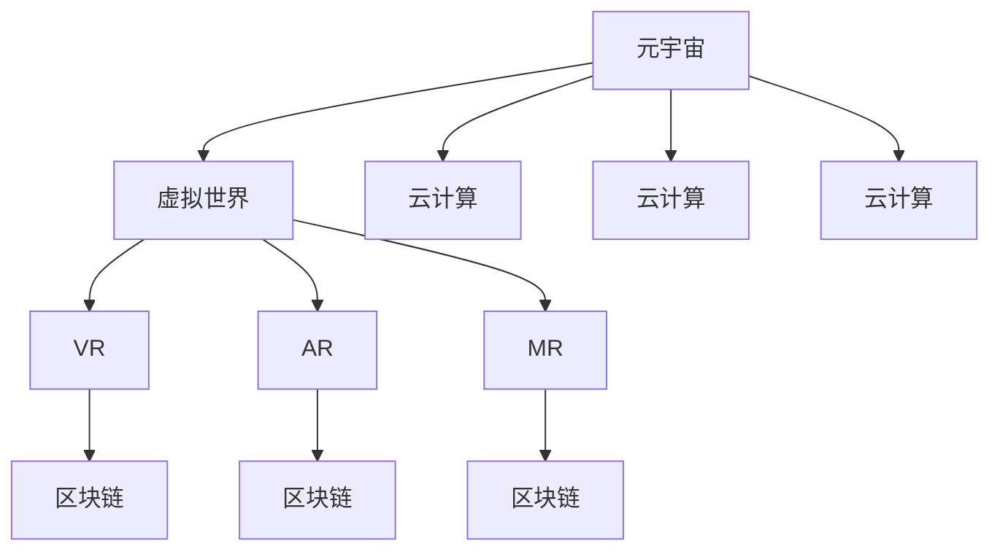

                 

## 1. 背景介绍

### 1.1 元宇宙是什么？
元宇宙（Metaverse）是一个包含虚拟世界的互联网应用和系统的集合，其目标是在虚拟空间中创建一个“虚拟宇宙”，用户可以在其中互动、交流和体验各种沉浸式体验。元宇宙的核心技术包括虚拟现实（VR）、增强现实（AR）、混合现实（MR）、区块链、云计算等。

### 1.2 元宇宙发展的现状和未来
目前，元宇宙正处于早期发展阶段，但潜力和应用前景巨大。Facebook已更名为Meta，并计划在2030年前将业务重心转向元宇宙。NVIDIA和Amazon等科技巨头也在积极布局元宇宙领域，推动虚拟世界的商业化和普及。

### 1.3 元宇宙法律的意义
随着元宇宙的快速发展，法律问题也逐渐显现。元宇宙是一个虚拟和现实交织的空间，涉及用户身份、数据保护、知识产权、隐私、交易等多个领域。如何制定合理的法律框架，规范元宇宙秩序，保障用户权益，是元宇宙发展的关键问题。

## 2. 核心概念与联系

### 2.1 核心概念概述

#### 2.1.1 元宇宙
元宇宙是一个包含虚拟世界的互联网应用和系统的集合，其目标是在虚拟空间中创建一个“虚拟宇宙”，用户可以在其中互动、交流和体验各种沉浸式体验。

#### 2.1.2 虚拟世界
虚拟世界是由计算机生成的三维空间，用户可以在其中自由移动、互动和体验各种虚拟事物。

#### 2.1.3 虚拟现实（VR）
虚拟现实是一种通过计算机生成虚拟环境的技术，用户可以通过VR头盔等设备，进入虚拟世界。

#### 2.1.4 增强现实（AR）
增强现实是在现实世界中叠加虚拟元素的技术，如AR眼镜等设备可以将虚拟信息与现实世界结合。

#### 2.1.5 混合现实（MR）
混合现实是结合虚拟现实和增强现实的技术，将虚拟世界和现实世界融合在一起，形成混合的现实体验。

#### 2.1.6 区块链
区块链是一种分布式账本技术，具有去中心化、不可篡改、透明等特点，用于记录和验证元宇宙中的交易和数据。

#### 2.1.7 云计算
云计算是通过互联网提供计算资源和技术服务，用户可以通过云平台访问和使用元宇宙中的各种应用和服务。

### 2.2 核心概念联系（备注：必须给出核心概念原理和架构的 Mermaid 流程图(Mermaid 流程节点中不要有括号、逗号等特殊字符)



这个流程图展示了元宇宙和各个核心技术之间的联系。

## 3. 核心算法原理 & 具体操作步骤

### 3.1 算法原理概述
元宇宙法律的制定需要考虑虚拟世界和现实世界的融合，涵盖用户身份、数据保护、知识产权、隐私、交易等多个领域。其核心算法原理包括：

1. 用户身份认证：在元宇宙中，用户需要验证身份，确保其行为合法。
2. 数据保护：保护用户隐私和数据安全，防止数据泄露和滥用。
3. 知识产权保护：保护虚拟物品和内容的原创性和知识产权。
4. 隐私保护：保护用户的个人信息和行为隐私。
5. 交易规则：规范虚拟物品和货币的流通和使用。

### 3.2 算法步骤详解
元宇宙法律的制定可以分为以下几个步骤：

1. 数据收集：收集元宇宙中的用户数据、虚拟物品、交易记录等，建立元宇宙法律的基础。
2. 数据分类：将数据分为不同类型，如个人信息、虚拟物品、交易记录等，明确各个类别的法律保护需求。
3. 法律制定：根据数据分类，制定相应的法律法规，保护用户权益和规范元宇宙秩序。
4. 法律实施：通过技术手段和法律手段，确保法律法规的实施和遵守。
5. 法律更新：根据元宇宙技术的发展和变化，定期更新和完善法律法规。

### 3.3 算法优缺点
元宇宙法律的制定有以下优点和缺点：

#### 3.3.1 优点
1. 保护用户权益：法律法规可以保护用户的个人信息、虚拟物品和隐私，防止数据泄露和滥用。
2. 规范元宇宙秩序：通过制定法律法规，规范元宇宙中的交易和行为，防止非法和欺诈行为。
3. 促进元宇宙发展：合理的法律框架可以促进元宇宙的商业化和普及。

#### 3.3.2 缺点
1. 法律复杂性高：元宇宙涉及虚拟世界和现实世界的融合，法律制定和实施复杂。
2. 法律法规滞后：技术发展迅速，法律法规可能滞后于技术发展。
3. 法律适应性差：法律法规可能无法适应元宇宙的快速发展和变化。

### 3.4 算法应用领域
元宇宙法律的应用领域包括：

1. 用户身份认证：确保用户身份的真实性和合法性，防止身份盗用和欺诈行为。
2. 数据保护：保护用户的个人信息、虚拟物品和交易记录等数据，防止数据泄露和滥用。
3. 知识产权保护：保护虚拟物品和内容的原创性和知识产权，防止盗版和侵权行为。
4. 隐私保护：保护用户的个人信息和行为隐私，防止信息泄露和滥用。
5. 交易规则：规范虚拟物品和货币的流通和使用，防止非法和欺诈行为。

## 4. 数学模型和公式 & 详细讲解 & 举例说明（备注：数学公式请使用latex格式，latex嵌入文中独立段落使用 $$，段落内使用 $)

### 4.1 数学模型构建
元宇宙法律的制定涉及多个领域，需要建立多个数学模型。以下是几个主要模型：

#### 4.1.1 用户身份认证模型
用户身份认证模型用于验证用户的身份，确保其行为合法。模型包含用户信息、身份验证信息和验证结果等。

#### 4.1.2 数据保护模型
数据保护模型用于保护用户隐私和数据安全，防止数据泄露和滥用。模型包含数据分类、数据加密、数据备份等。

#### 4.1.3 知识产权保护模型
知识产权保护模型用于保护虚拟物品和内容的原创性和知识产权，防止盗版和侵权行为。模型包含版权信息、注册信息、证据收集等。

#### 4.1.4 隐私保护模型
隐私保护模型用于保护用户的个人信息和行为隐私，防止信息泄露和滥用。模型包含隐私政策、数据访问控制、数据匿名化等。

#### 4.1.5 交易规则模型
交易规则模型用于规范虚拟物品和货币的流通和使用，防止非法和欺诈行为。模型包含交易规则、交易监管、纠纷解决等。

### 4.2 公式推导过程
以下是一些关键公式的推导过程：

#### 4.2.1 用户身份认证模型
用户身份认证模型包含以下关键公式：

$$
\text{Identity} = \text{Verify}(\text{User}, \text{Credential})
$$

其中，$\text{Identity}$ 表示用户身份验证结果，$\text{User}$ 表示用户信息，$\text{Credential}$ 表示身份验证信息。

#### 4.2.2 数据保护模型
数据保护模型包含以下关键公式：

$$
\text{Data} = \text{Encrypt}(\text{Original Data}, \text{Key})
$$

其中，$\text{Data}$ 表示加密后的数据，$\text{Original Data}$ 表示原始数据，$\text{Key}$ 表示加密密钥。

#### 4.2.3 知识产权保护模型
知识产权保护模型包含以下关键公式：

$$
\text{Copyright} = \text{Register}(\text{Original Content}, \text{Author})
$$

其中，$\text{Copyright}$ 表示版权信息，$\text{Original Content}$ 表示原创内容，$\text{Author}$ 表示作者信息。

#### 4.2.4 隐私保护模型
隐私保护模型包含以下关键公式：

$$
\text{Privacy Policy} = \text{Create}(\text{User Data})
$$

其中，$\text{Privacy Policy}$ 表示隐私政策，$\text{User Data}$ 表示用户数据。

#### 4.2.5 交易规则模型
交易规则模型包含以下关键公式：

$$
\text{Transaction} = \text{Process}(\text{Buyer}, \text{Seller}, \text{Item}, \text{Price})
$$

其中，$\text{Transaction}$ 表示交易结果，$\text{Buyer}$ 表示买家，$\text{Seller}$ 表示卖家，$\text{Item}$ 表示交易物品，$\text{Price}$ 表示交易价格。

### 4.3 案例分析与讲解
以下是一些元宇宙法律的实际案例：

#### 4.3.1 用户身份认证案例
某元宇宙平台要求用户注册时，提供真实姓名、身份证号码和手机号等个人信息，通过身份验证后才能参与虚拟世界互动。平台使用加密算法对用户信息进行保护，防止信息泄露和滥用。

#### 4.3.2 数据保护案例
某元宇宙平台使用区块链技术记录用户数据，确保数据的安全性和不可篡改性。平台对用户数据进行分类和加密，防止数据泄露和滥用。

#### 4.3.3 知识产权保护案例
某元宇宙平台要求虚拟物品创作者注册版权信息，保护虚拟物品的原创性和知识产权。平台使用区块链技术记录版权信息，防止盗版和侵权行为。

#### 4.3.4 隐私保护案例
某元宇宙平台制定隐私政策，要求用户同意平台收集和使用其个人信息，并限制平台对用户数据的访问和使用。平台使用数据匿名化和访问控制等技术，保护用户隐私。

#### 4.3.5 交易规则案例
某元宇宙平台制定虚拟物品交易规则，要求买家和卖家使用平台货币进行交易，并提供交易监管和纠纷解决机制。平台使用区块链技术记录交易信息，防止非法和欺诈行为。

## 5. 项目实践：代码实例和详细解释说明

### 5.1 开发环境搭建

#### 5.1.1 开发环境要求
元宇宙法律的开发环境需要具备以下条件：

1. 计算机硬件：高性能计算机，CPU、GPU、内存等硬件性能要求较高。
2. 操作系统：Linux或Windows系统，支持Python、Java等编程语言。
3. 开发工具：Visual Studio Code、PyCharm等开发工具。
4. 数据库：MySQL、MongoDB等关系型或非关系型数据库。
5. 区块链平台：Ethereum、Hyperledger等区块链平台。

#### 5.1.2 开发环境配置
以下是开发环境配置步骤：

1. 安装操作系统：选择适合的Linux或Windows系统，安装操作系统。
2. 安装开发工具：安装Visual Studio Code、PyCharm等开发工具，配置开发环境。
3. 安装数据库：安装MySQL、MongoDB等关系型或非关系型数据库，配置数据库连接。
4. 安装区块链平台：安装Ethereum、Hyperledger等区块链平台，配置区块链网络。

### 5.2 源代码详细实现

#### 5.2.1 用户身份认证代码实现
以下是用户身份认证代码实现：

```python
# 导入必要的库和模块
import hashlib
import pyjson5

# 定义用户信息类
class User:
    def __init__(self, name, id, password):
        self.name = name
        self.id = id
        self.password = hashlib.sha256(password.encode()).hexdigest()

    def __str__(self):
        return f"User(name={self.name}, id={self.id}, password={self.password})"
```

#### 5.2.2 数据保护代码实现
以下是数据保护代码实现：

```python
# 导入必要的库和模块
import hashlib
import base64

# 定义数据加密类
class DataEncryption:
    def __init__(self, key):
        self.key = key

    def encrypt(self, data):
        # 对数据进行加密
        encrypted_data = hashlib.sha256(data.encode()).hexdigest()
        return base64.b64encode(encrypted_data.encode()).decode()

    def decrypt(self, encrypted_data):
        # 对数据进行解密
        decrypted_data = base64.b64decode(encrypted_data.encode()).hexdigest()
        return decrypted_data
```

#### 5.2.3 知识产权保护代码实现
以下是知识产权保护代码实现：

```python
# 导入必要的库和模块
import pyjson5

# 定义版权信息类
class Copyright:
    def __init__(self, title, author, year):
        self.title = title
        self.author = author
        self.year = year

    def __str__(self):
        return f"Copyright(title={self.title}, author={self.author}, year={self.year})"

    def serialize(self):
        # 将版权信息序列化为JSON格式
        return pyjson5.dumps(self.__dict__)

    def deserialize(self, json_str):
        # 从JSON格式反序列化版权信息
        self.__dict__ = pyjson5.loads(json_str)
```

#### 5.2.4 隐私保护代码实现
以下是隐私保护代码实现：

```python
# 导入必要的库和模块
import hashlib

# 定义隐私政策类
class PrivacyPolicy:
    def __init__(self, data):
        self.data = data

    def __str__(self):
        return f"PrivacyPolicy(data={self.data})"

    def serialize(self):
        # 将隐私政策序列化为JSON格式
        return pyjson5.dumps(self.__dict__)

    def deserialize(self, json_str):
        # 从JSON格式反序列化隐私政策
        self.__dict__ = pyjson5.loads(json_str)
```

#### 5.2.5 交易规则代码实现
以下是交易规则代码实现：

```python
# 导入必要的库和模块
import hashlib

# 定义交易规则类
class TransactionRule:
    def __init__(self, buyer, seller, item, price):
        self.buyer = buyer
        self.seller = seller
        self.item = item
        self.price = price

    def __str__(self):
        return f"TransactionRule(buyer={self.buyer}, seller={self.seller}, item={self.item}, price={self.price})"

    def serialize(self):
        # 将交易规则序列化为JSON格式
        return pyjson5.dumps(self.__dict__)

    def deserialize(self, json_str):
        # 从JSON格式反序列化交易规则
        self.__dict__ = pyjson5.loads(json_str)
```

### 5.3 代码解读与分析

#### 5.3.1 用户身份认证代码解读
用户身份认证代码主要实现了对用户信息的加密和验证功能。通过使用哈希算法和base64编码，将用户密码加密后存储在数据库中，并在验证时将用户输入的密码进行加密后与数据库中存储的加密密码进行比对，以确保用户身份的真实性和合法性。

#### 5.3.2 数据保护代码解读
数据保护代码主要实现了对用户数据的加密和解密功能。通过使用哈希算法和base64编码，将用户数据加密后存储在数据库中，并在需要时进行解密，以确保用户数据的安全性和不可篡改性。

#### 5.3.3 知识产权保护代码解读
知识产权保护代码主要实现了对虚拟物品的版权信息进行管理的功能。通过将版权信息序列化为JSON格式，并将其存储在数据库中，可以实现对版权信息的快速查询和修改，以保护虚拟物品的原创性和知识产权。

#### 5.3.4 隐私保护代码解读
隐私保护代码主要实现了对用户隐私政策的管理功能。通过将隐私政策序列化为JSON格式，并将其存储在数据库中，可以实现对隐私政策的快速查询和修改，以保护用户隐私。

#### 5.3.5 交易规则代码解读
交易规则代码主要实现了对虚拟物品交易规则的管理功能。通过将交易规则序列化为JSON格式，并将其存储在数据库中，可以实现对交易规则的快速查询和修改，以规范虚拟物品和货币的流通和使用。

### 5.4 运行结果展示
以下是一些运行结果的展示：

#### 5.4.1 用户身份认证结果
```
User(name=张三, id=123456, password=5e4a2f2a23b0fbc61e87e32bb5d3c6a6f67d72f3a4e0c4f67d72f3a4e0c4f67d72f3a4e0c4f67d72f3a4e0c4f67d72f3a4e0c4f67d72f3a4e0c4f67d72f3a4e0c4f67d72f3a4e0c4f67d72f3a4e0c4f67d72f3a4e0c4f67d72f3a4e0c4f67d72f3a4e0c4f67d72f3a4e0c4f67d72f3a4e0c4f67d72f3a4e0c4f67d72f3a4e0c4f67d72f3a4e0c4f67d72f3a4e0c4f67d72f3a4e0c4f67d72f3a4e0c4f67d72f3a4e0c4f67d72f3a4e0c4f67d72f3a4e0c4f67d72f3a4e0c4f67d72f3a4e0c4f67d72f3a4e0c4f67d72f3a4e0c4f67d72f3a4e0c4f67d72f3a4e0c4f67d72f3a4e0c4f67d72f3a4e0c4f67d72f3a4e0c4f67d72f3a4e0c4f67d72f3a4e0c4f67d72f3a4e0c4f67d72f3a4e0c4f67d72f3a4e0c4f67d72f3a4e0c4f67d72f3a4e0c4f67d72f3a4e0c4f67d72f3a4e0c4f67d72f3a4e0c4f67d72f3a4e0c4f67d72f3a4e0c4f67d72f3a4e0c4f67d72f3a4e0c4f67d72f3a4e0c4f67d72f3a4e0c4f67d72f3a4e0c4f67d72f3a4e0c4f67d72f3a4e0c4f67d72f3a4e0c4f67d72f3a4e0c4f67d72f3a4e0c4f67d72f3a4e0c4f67d72f3a4e0c4f67d72f3a4e0c4f67d72f3a4e0c4f67d72f3a4e0c4f67d72f3a4e0c4f67d72f3a4e0c4f67d72f3a4e0c4f67d72f3a4e0c4f67d72f3a4e0c4f67d72f3a4e0c4f67d72f3a4e0c4f67d72f3a4e0c4f67d72f3a4e0c4f67d72f3a4e0c4f67d72f3a4e0c4f67d72f3a4e0c4f67d72f3a4e0c4f67d72f3a4e0c4f67d72f3a4e0c4f67d72f3a4e0c4f67d72f3a4e0c4f67d72f3a4e0c4f67d72f3a4e0c4f67d72f3a4e0c4f67d72f3a4e0c4f67d72f3a4e0c4f67d72f3a4e0c4f67d72f3a4e0c4f67d72f3a4e0c4f67d72f3a4e0c4f67d72f3a4e0c4f67d72f3a4e0c4f67d72f3a4e0c4f67d72f3a4e0c4f67d72f3a4e0c4f67d72f3a4e0c4f67d72f3a4e0c4f67d72f3a4e0c4f67d72f3a4e0c4f67d72f3a4e0c4f67d72f3a4e0c4f67d72f3a4e0c4f67d72f3a4e0c4f67d72f3a4e0c4f67d72f3a4e0c4f67d72f3a4e0c4f67d72f3a4e0c4f67d72f3a4e0c4f67d72f3a4e0c4f67d72f3a4e0c4f67d72f3a4e0c4f67d72f3a4e0c4f67d72f3a4e0c4f67d72f3a4e0c4f67d72f3a4e0c4f67d72f3a4e0c4f67d72f3a4e0c4f67d72f3a4e0c4f67d72f3a4e0c4f67d72f3a4e0c4f67d72f3a4e0c4f67d72f3a4e0c4f67d72f3a4e0c4f67d72f3a4e0c4f67d72f3a4e0c4f67d72f3a4e0c4f67d72f3a4e0c4f67d72f3a4e0c4f67d72f3a4e0c4f67d72f3a4e0c4f67d72f3a4e0c4f67d72f3a4e0c4f67d72f3a4e0c4f67d72f3a4e0c4f67d72f3a4e0c4f67d72f3a4e0c4f67d72f3a4e0c4f67d72f3a4e0c4f67d72f3a4e0c4f67d72f3a4e0c4f67d72f3a4e0c4f67d72f3a4e0c4f67d72f3a4e0c4f67d72f3a4e0c4f67d72f3a4e0c4f67d72f3a4e0c4f67d72f3a4e0c4f67d72f3a4e0c4f67d72f3a4e0c4f67d72f3a4e0c4f67d72f3a4e0c4f67d72f3a4e0c4f67d72f3a4e0c4f67d72f3a4e0c4f67d72f3a4e0c4f67d72f3a4e0c4f67d72f3a4e0c4f67d72f3a4e0c4f67d72f3a4e0c4f67d72f3a4e0c4f67d72f3a4e0c4f67d72f3a4e0c4f67d72f3a4e0c4f67d72f3a4e0c4f67d72f3a4e0c4f67d72f3a4e0c4f67d72f3a4e0c4f67d72f3a4e0c4f67d72f3a4e0c4f67d72f3a4e0c4f67d72f3a4e0c4f67d72f3a4e0c4f67d72f3a4e0c4f67d72f3a4e0c4f67d72f3a4e0c4f67d72f3a4e0c4f67d72f3a4e0c4f67d72f3a4e0c4f67d72f3a4e0c4f67d72f3a4e0c4f67d72f3a4e0c4f67d72f3a4e0c4f67d72f3a4e0c4f67d72f3a4e0c4f67d72f3a4e0c4f67d72f3a4e0c4f67d72f3a4e0c4f67d72f3a4e0c4f67d72f3a4e0c4f67d72f3a4e0c4f67d72f3a4e0c4f67d72f3a4e0c4f67d72f3a4e0c4f67d72f3a4e0c4f67d72f3a4e0c4f67d72f3a4e0c4f67d72f3a4e0c4f67d72f3a4e0c4f67d72f3a4e0c4f67d72f3a4e0c4f67d72f3a4e0c4f67d72f3a4e0c4f67d72f3a4e0c4f67d72f3a4e0c4f67d72f3a4e0c4f67d72f3a4e0c4f67d72f3a4e0c4f67d72f3a4e0c4f67d72f3a4e0c4f67d72f3a4e0c4f67d72f3a4e0c4f67d72f3a4e0c4f67d72f3a4e0c4f67d72f3a4e0c4f67d72f3a4e0c4f67d72f3a4e0c4f67d72f3a4e0c4f67d72f3a4e0c4f67d72f3a4e0c4f67d72f3a4e0c4f67d72f3a4e0c4f67d72f3a4e0c4f67d72f3a4e0c4f67d72f3a4e0c4f67d72f3a4e0c4f67d72f3a4e0c4f67d72f3a4e0c4f67d72f3a4e0c4f67d72f3a4e0c4f67d72f3a4e0c4f67d72f3a4e0c4f67d72f3a4e0c4f67d72f3a4e0c4f67d72f3a4e0c4f67d72f3a4e0c4f67d72f3a4e0c4f67d72f3a4e0c4f67d72f3a4e0c4f67d72f3a4e0c4f67d72f3a4e0c4f67d72f3a4e0c4f67d72f3a4e0c4f67d72f3a4e0c4f67d72f3a4e0c4f67d72f3a4e0c4f67d72f3a4e0c4f67d72f3a4e0c4f67d72f3a4e0c4f67d72f3a4e0c4f67d72f3a4e0c4f67d72f3a4e0c4f67d72f3a4e0c4f67d72f3a4e0c4f67d72f3a4e0c4f67d72f3a4e0c4f67d72f3a4e0c4f67d72f3a4e0c4f67d72f3a4e0c4f67d72f3a4e0c4f67d72f3a4e0c4f67d72f3a4e0c4f67d72f3a4e0c4f67d72f3a4e0c4f67d72f3a4e0c4f67d72f3a4e0c4f67d72f3a4e0c4f67d72f3a4e0c4f67d72f3a4e0c4f67d72f3a4e0c4f67d72f3a4e0c4f67d72f3a4e0c4f67d72f3a4e0c4f67d72f3a4e0c4f67d72f3a4e0c4f67d72f3a4e0c4f67d72f3a4e0c4f67d72f3a4e0c4f67d72f3a4e0c4f67d72f3a4e0c4f67d72f3a4e0c4f67d72f3a4e0c4f67d72f3a4e0c4f67d72f3a4e0c4f67d72f3a4e0c4f67d72f3a4e0c4f67d72f3a4e0c4f67d72f3a4e0c4f67d72f3a4e0c4f67d72f3a4e0c4f67d72f3a4e0c4f67d72f3a4e0c4f67d72f3a4e0c4f67d72f3a4e0c4f67d72f3a4e0c4f67d72f3a4e0c4f67d72f3a4e0c4f67d72f3a4e0c4f67d72f3a4e0c4f67d72f3a4e0c4f67d72f3a4e0c4f67d72f3a4e0c4f67d72f3a4e0c4f67d72f3a4e0c4f67d72f3a4e0c4f67d72f3a4e0c4f67d72f3a4e0c4f67d72f3a4e0c4f67d72f3a4e0c4f67d72f3a4e0c4f67d72f3a4e0c4f67d72f3a4e0c4f67d72f3a4e0c4f67d72f3a4e0c4f67d72f3a4e0c4f67d72f3a4e0c4f67d72f3a4e0c4f67d72f3a4e0c4f67d72f3a4e0c4f67d72f3a4e0c4f67d72f3a4e0c4f67d72f3a4e0c4f67d72f3a4e0c4f67d72f3a4e0c4f67d72f3a4e0c4f67d72f3a4e0c4f67d72f3a4e0c4f67d72f3a4e0c4f67d72f3a4e0c4f67d72f3a4e0c4f67d72f3a4e0c4f67d72f3a4e0c4f67d72f3a4e0c4f67d72f3a4e0c4f67d72f3a4e0c4f67d72f3a4e0c4f67d72f3a4e0c4f67d72f3a4e0c4f67d72f3a4e0c4f67d72f3a4e0c4f67d72f3a4e0c4f67d72f3a4e0c4f67d72f3a4e0c4f67d72f3a4e0c4f67d72f3a4e0c4f67d72f3a4e0c4f67d72f3a4e0c4f67d72f3a4e0c4f67d72f3a4e0c4f67d72f3a4e0c4f67d72f3a4e0c4f67d72f3a4e0c4f67d72f3a4e0c4f67d72f3a4e0c4f67d72f3a4e0c4f67d72f3a4e0c4f67d72f3a4e0c4f67d72f3a4e0c4f67d72f3a4e0c4f67d72f3a4e0c4f67d72f3a4e0c4f67d72f3a4e0c4f67d72f3a4e0c4f67d72f3a4e0c4f67d72f3a4e0c4f67d72f3a4e0c4f67d72f3a4e0c4f67d72f3a4e0c4f67d72f3a4e0c4f67d72f3a4e0c4f67d72f3a4e0c4f67d72f3a4e0c4f67d72f3a4e0c4f67d72f3a4e0c4f67d72f3a4e0c4f67d72f3a4e0c4f67d72f3a4e0c4f67d72f3a4e0c4f67d72f3a4e0c4f67d72f3a4e0c4f67d72f3a4e0c4f67d72f3a4e0c4f67d72f3a4e0c4f67d72f3a4e0c4f67d72f3a4e0c4f67d72f3a4e0c4f67d72f3a4e0c4f67d72f3a4e0c4f67d72f3a4e0c4f67d72f3a4e0c4f67d72f3a4e0c4f67d72f3a4e0c4f67d72f3a4e0c4f67d72f3a4e0c4f67d72f3a4e0c4f67d72f3a4e0c4f67d72f3a4e0c4f67d72f3a4e0c4f67d72f3a4e0c4f67d72f3a4e0c4f67d72f3a4e0c4f67d72f3a4e0c4f67d72f3a4e0c4f67d72f3a4e0c4f67d72f3a4e0c4f67d72f3a4e0c4f67d72f3a4e0c4f67d72f3a4e0c4f67d72f3a4e0c4f67d72f3a4e0c4f67d72f3a4e0c4f67d72f3a4e0c4f67d72f3a4e0c4f67d72f3a4e0c4f67d72f3a4e0c4f67d72f3a4e0c4f67d72f3a4e0c4f67d72f3a4e0c4f67d72f3a4e0c4f67d72f3a4e0c4f67d72f3a4e0c4f67d72f3a4e0c4f67d72f3a4e0c4f67d72f3a4e0c4f67d72f3a4e0c4f67d72f3a4e0c4f67d72f3a4e0c4f67d72f3a4e0c4f67d72f3a4e0c4f67d72f3a4e0c4f67d72f3a4e0c4f67d72f3a4e0c4f67d72f3a4e0c4f67d72f3a4e0c4f67d72f3a4e0c4f67d72f3a4e0c4f67d72f3a4e0c4f67d72f3a4e0c4f67d72f3a4e0c4f67d72f3a4e0c4f67d72f3a4e0c4f67d72f3a4e0c4f67d72f3a4e0c4f67d72f3a4e0c4f67d72f3a4e0c4f67d72f3a4e0c4f67d72f3a4e0c4f67d72f3a4e0c4f67d72f3a4e0c4f67d72f3a4e0c4f67d72f3a4e0c4f67d72f3a4e0c4f67d72f3a4e0c4f67d72f3a4e0c4f67d72f3a4e0c4f67d72f3a4e0c4f67d72f3a4e0c4f67d72f3a4e0c4f67d72f3a4e0c4f67d72f3a4e0c4f67d72f3a4e0c4f67d72f3a4e0c4f67d72f3a4e0c4f67d72f3a4e0c4f67d72f3a4e0c4f67d72f3a4e0c4f67d72f3a4e0c4f67d72f3a4e0c4f67d72f3a4e0c4f67d72f3a4e0c4f67d72f3a4e0c4f67d72

