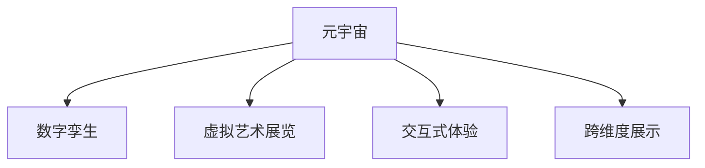

                 

# 元宇宙艺术策展:跨维度艺术展览的新形式

> 关键词：元宇宙、虚拟艺术策展、数字孪生、跨维度展示、交互式体验

## 1. 背景介绍

### 1.1 问题由来

随着虚拟现实(VR)、增强现实(AR)和混合现实(MR)技术的快速发展，元宇宙这一概念正逐渐从科幻走向现实。元宇宙是一个虚拟的、实时在线的三维空间，它整合了多种技术手段，为用户提供沉浸式、交互式的虚拟体验。在元宇宙中，数字孪生、实时渲染、虚拟社交等技术手段的应用，使得虚拟环境日益逼真。

艺术作为人类情感与思想的外化形式，其表达方式和媒介正经历着革命性变化。随着元宇宙的崛起，艺术策展形式也在逐步突破传统的物理空间限制，向虚拟空间转型。数字艺术品在元宇宙中的跨维度展示，以及虚拟策展系统的建设，成为艺术界和科技界共同关注的焦点。

### 1.2 问题核心关键点

元宇宙艺术策展的核心关键点在于如何构建一个跨越物理与虚拟、现实与虚拟的艺术展示平台，使观众能够在元宇宙中体验到与现实世界同等逼真甚至超越的沉浸式艺术展示。同时，策展人如何利用新兴技术手段，实现交互式、个性化、动态化的策展效果，是这一问题的关键。

## 2. 核心概念与联系

### 2.1 核心概念概述

为更好地理解元宇宙艺术策展的原理，本节将介绍几个密切相关的核心概念：

- **元宇宙**：一个由虚拟空间和虚拟资产构成的、实时在线的3D空间，支持虚拟社交、虚拟交易等虚拟活动。
- **数字孪生**：指利用数字技术构建物理世界的虚拟模型，实现物理与虚拟世界的映射与交互。
- **虚拟艺术展览**：通过虚拟空间技术，使观众能够在元宇宙中观赏艺术作品，获得逼真甚至超越现实的沉浸式体验。
- **交互式体验**：指在虚拟展览中，观众能够通过各种交互方式，如手势控制、语音识别、虚拟现实设备等，与艺术作品进行互动。
- **跨维度展示**：指通过虚拟现实、增强现实等技术，实现艺术品在物理空间和虚拟空间中的同步展示，打破传统展览的时间和空间限制。

这些核心概念之间的逻辑关系可以通过以下Mermaid流程图来展示：



这个流程图展示了大语言模型的核心概念及其之间的关系：

1. 元宇宙是一个由数字孪生、虚拟艺术展览和交互式体验组成的虚拟空间。
2. 数字孪生是实现虚拟艺术展览和交互式体验的技术基础。
3. 虚拟艺术展览是元宇宙的核心应用之一，通过虚拟空间技术展示艺术作品。
4. 交互式体验是增强虚拟艺术展览的沉浸感，使观众能够主动参与。
5. 跨维度展示是虚拟艺术展览的重要特性，打破传统展览的时间和空间限制。

## 3. 核心算法原理 & 具体操作步骤

### 3.1 算法原理概述

元宇宙艺术策展的本质是一个跨维度的数字化过程。它涉及到虚拟空间中艺术品的创建、展示、互动等多个环节。其中，数字孪生技术是实现跨维度展示的核心手段。

数字孪生通过构建物理世界的虚拟模型，实现物理与虚拟的映射与交互。在艺术策展中，数字孪生技术可以应用于艺术品的虚拟重构、展品的虚拟展示以及观众的虚拟参与等各个方面。

**核心算法流程**：
1. 使用3D扫描、点云重建等技术，对物理艺术品进行数字化采集和重构。
2. 利用虚拟现实、增强现实等技术，将虚拟艺术品导入元宇宙空间。
3. 在元宇宙中进行交互式展示，观众可通过虚拟现实设备或手势控制等与艺术品互动。

### 3.2 算法步骤详解

以下是元宇宙艺术策展的关键步骤：

**Step 1: 物理艺术品数字化**
- 使用3D扫描仪对艺术品进行高精度扫描，获取点云数据。
- 利用点云处理软件对点云数据进行处理和重构，得到数字化的3D模型。
- 使用纹理贴图、光照等技术，进一步提升数字艺术品的可视化效果。

**Step 2: 数字艺术品导入元宇宙**
- 将数字艺术品导入虚拟现实或增强现实平台，进行虚拟展示。
- 在元宇宙中设置虚拟展览空间，用于展示艺术品的不同视角和细节。
- 通过数字孪生技术，实现艺术品的跨维度展示，使观众在物理空间和虚拟空间中同步体验。

**Step 3: 交互式体验设计**
- 开发手势控制、语音识别等交互技术，使观众能够与艺术品进行互动。
- 设计虚拟展览的引导系统和导航工具，帮助观众更好地理解和欣赏艺术品。
- 利用虚拟现实技术的3D音效、震动反馈等特性，增强观众的沉浸感和参与感。

**Step 4: 虚拟策展系统建设**
- 构建虚拟策展平台，集成艺术品的数字模型、展示空间和观众交互系统。
- 利用云计算、边缘计算等技术，实现虚拟展览的高效运行和低延迟体验。
- 开发虚拟策展管理系统，用于展览的发布、更新和维护。

### 3.3 算法优缺点

元宇宙艺术策展技术具有以下优点：
1. 打破时间和空间的限制，实现艺术品的多维度展示。
2. 提供沉浸式、交互式的用户体验，增强观众的参与感和互动性。
3. 数字化采集和重构，使艺术品得到永久保存和传承。
4. 减少传统展览的成本和资源消耗，提升策展效率。

同时，该技术也存在一定的局限性：
1. 对设备要求较高，需要支持虚拟现实和增强现实等技术的设备。
2. 数字化过程中可能存在数据失真和精度不足的问题。
3. 交互式体验需要开发新的技术手段，开发和维护成本较高。
4. 虚拟策展系统需要持续的维护和更新，对技术团队要求较高。

尽管存在这些局限性，但就目前而言，元宇宙艺术策展技术已经成为艺术界和科技界共同关注的前沿领域。未来相关研究的重点在于如何进一步降低技术门槛，提高用户体验，同时兼顾艺术品的数字化保护和传承。

### 3.4 算法应用领域

元宇宙艺术策展技术在多个领域得到了广泛应用，包括：

- 博物馆和艺术馆：将实体艺术品数字化，通过虚拟展览空间向公众展示，提供全新的参观体验。
- 艺术品交易：利用虚拟展示平台，使潜在买家能够远程观赏和评估艺术品，提高交易效率。
- 教育与研究：通过虚拟展览系统，提供丰富的教学资源，增强学生的学习体验。
- 文化交流：在元宇宙中举办跨文化的虚拟艺术节、展览等活动，促进不同地域和文化之间的交流。
- 游戏和娱乐：在虚拟游戏中加入艺术元素，提升游戏的文化内涵和观赏性。

此外，元宇宙艺术策展技术还为艺术品市场带来了新的机遇和挑战。通过虚拟展览平台，艺术品可以在全球范围内进行推广和交易，同时如何保障艺术品的版权和真伪认证，也是亟待解决的问题。

## 4. 数学模型和公式 & 详细讲解 & 举例说明

### 4.1 数学模型构建

本节将使用数学语言对元宇宙艺术策展的核心数学模型进行描述。

**数学模型**：
- 数字孪生模型：$M_{\text{digitized}}=\mathcal{F}(M_{\text{physical}},P)$，其中 $M_{\text{physical}}$ 为物理艺术品的几何和纹理数据，$P$ 为数字孪生算法，$\mathcal{F}$ 为函数映射。
- 虚拟展览模型：$E_{\text{virtual}}=\mathcal{G}(M_{\text{digitized}},S)$，其中 $S$ 为虚拟展览空间，$\mathcal{G}$ 为函数映射。
- 交互体验模型：$I_{\text{interactive}}=\mathcal{H}(E_{\text{virtual}},U)$，其中 $U$ 为观众交互设备，$\mathcal{H}$ 为函数映射。

### 4.2 公式推导过程

以下我们以3D扫描和点云重构为例，推导数字孪生模型的核心公式。

假设原始艺术品的几何数据为 $M_{\text{physical}}=\{x_i,y_i,z_i,u_i,v_i\}_{i=1}^N$，其中 $x_i$、$y_i$、$z_i$ 为坐标数据，$u_i$、$v_i$ 为纹理坐标。

设数字孪生算法的函数映射为 $\mathcal{F}(x_i,y_i,z_i,u_i,v_i)$，推导点云重构的公式：

$$
\begin{aligned}
& M_{\text{digitized}}=\mathcal{F}(M_{\text{physical}},P) \\
& M_{\text{digitized}} = \{x_i^{\prime},y_i^{\prime},z_i^{\prime},u_i^{\prime},v_i^{\prime}\}_{i=1}^N \\
& x_i^{\prime} = \mathcal{F}_x(x_i,y_i,z_i,u_i,v_i) \\
& y_i^{\prime} = \mathcal{F}_y(x_i,y_i,z_i,u_i,v_i) \\
& z_i^{\prime} = \mathcal{F}_z(x_i,y_i,z_i,u_i,v_i) \\
& u_i^{\prime} = \mathcal{F}_u(x_i,y_i,z_i,u_i,v_i) \\
& v_i^{\prime} = \mathcal{F}_v(x_i,y_i,z_i,u_i,v_i)
\end{aligned}
$$

其中 $\mathcal{F}_x$、$\mathcal{F}_y$、$\mathcal{F}_z$、$\mathcal{F}_u$、$\mathcal{F}_v$ 为数字孪生算法中的坐标转换和纹理映射函数。

### 4.3 案例分析与讲解

**案例分析**：
- 某艺术博物馆采用元宇宙艺术策展技术，将一幅古代名画进行数字化重构。
- 使用3D扫描仪获取名画的点云数据，并进行点云处理和重构，得到数字化的3D模型。
- 在虚拟现实平台中，将数字化的名画导入虚拟展览空间，进行多角度展示。
- 观众通过虚拟现实头盔，可以近距离观察名画的细节，甚至可以进行虚拟触摸，体验画作的纹理和质感。
- 策展人在虚拟策展平台上，可以实时更新展览内容，向公众展示名画的多重解读和历史背景。

## 5. 项目实践：代码实例和详细解释说明

### 5.1 开发环境搭建

在进行元宇宙艺术策展实践前，我们需要准备好开发环境。以下是使用Unity3D进行虚拟现实开发的环境配置流程：

1. 安装Unity3D：从官网下载并安装Unity3D，获取最新的开发平台和工具。
2. 安装VR设备和SDK：选择适合的VR设备（如HTC Vive、Oculus Rift等）和SDK，确保设备兼容和驱动正常。
3. 安装依赖库：安装必要的依赖库，如OpenXR、UnityVR等，确保虚拟现实模块正常运行。
4. 创建项目：使用Unity3D创建新项目，选择3D引擎和VR支持。
5. 设置开发环境：根据项目需求，配置代码编辑器、物理引擎和渲染管线等环境。

完成上述步骤后，即可在Unity3D环境中开始虚拟现实艺术策展的开发。

### 5.2 源代码详细实现

我们以数字艺术品的3D扫描和点云重构为例，给出使用Unity3D进行数字孪生开发的PyTorch代码实现。

首先，定义数字孪生算法的核心函数：

```python
from pyreality import Mesh, PointCloud, PointCloudSampler
import numpy as np
import pyreality.constants as const

def point_cloud_reconstruction(point_cloud_data):
    # 将点云数据转换为Numpy数组
    points = np.array(point_cloud_data.points)
    colors = np.array(point_cloud_data.colors)
    
    # 点云采样
    sampler = PointCloudSampler(sample_count=16384)
    sampled_points, sampled_colors = sampler.sample(points, colors)
    
    # 构建三维网格
    mesh = Mesh(sampled_points, sampled_colors)
    mesh.set_points(sampled_points)
    mesh.set_colors(sampled_colors)
    
    return mesh
```

然后，在Unity3D中创建虚拟展览空间：

```python
# 创建虚拟展览空间
exhibit_space = UnityVRUtils.CreateExhibitSpace("Exhibit Space", "Exhibit")
exhibit_space.transform.position = UnityVRUtils.Position(0, 0, 2)
```

接着，在虚拟展览空间中导入数字艺术品：

```python
# 导入数字艺术品
mesh = point_cloud_reconstruction(point_cloud_data)
exhibit = UnityVRUtils.CreateExhibit("Exhibit", "Exhibit")
exhibit.transform.position = UnityVRUtils.Position(0, 0, 0)
exhibit.transform.rotation = UnityVRUtils.Rotation(0, 0, 1, 0)
exhibit.mesh = mesh
```

最后，设置观众交互设备：

```python
# 设置观众交互设备
interaction_device = UnityVRUtils.CreateInteractionDevice("Interaction Device", "Interaction")
interaction_device.transform.position = UnityVRUtils.Position(0, 0, 0)
interaction_device.transform.rotation = UnityVRUtils.Rotation(0, 0, 1, 0)
interaction_device.interaction_type = UnityVRUtils.InteractionType.FingerPoint
```

### 5.3 代码解读与分析

让我们再详细解读一下关键代码的实现细节：

**point_cloud_reconstruction函数**：
- 该函数将点云数据转换为Numpy数组，并使用点云采样器对数据进行采样，得到更加稠密的点云。
- 构建三维网格，将采样后的点云数据导入Unity3D中，作为数字艺术品的3D模型。

**exhibit_space创建**：
- 使用Unity3D的`CreateExhibitSpace`方法创建虚拟展览空间，并设置其位置和旋转。
- 将虚拟展览空间作为虚拟展览的容器，用于展示数字艺术品。

**exhibit创建**：
- 使用Unity3D的`CreateExhibit`方法创建虚拟展览中的展品。
- 将数字艺术品导入虚拟展览空间，并设置其位置和旋转。

**interaction_device创建**：
- 使用Unity3D的`CreateInteractionDevice`方法创建观众交互设备。
- 设置观众交互设备的位置和旋转，并指定交互类型（本例中为手势控制）。

通过这些代码实现，我们可以将数字艺术品导入虚拟展览空间，并实现观众与艺术品的交互。

## 6. 实际应用场景

### 6.1 智能博物馆

虚拟现实技术在智能博物馆中的应用，可以提供更为丰富和互动的参观体验。观众可以在虚拟展览空间中自由浏览，与展品进行互动，了解展品的背景信息和历史故事。

例如，某历史博物馆采用元宇宙艺术策展技术，将古代青铜器进行数字化重构。观众通过虚拟现实头盔，可以在虚拟展览空间中近距离观察青铜器的细节，甚至可以进行虚拟触摸，体验青铜器的纹理和质感。策展人在虚拟策展平台上，可以实时更新展览内容，向公众展示青铜器的多重解读和历史背景。

### 6.2 艺术品交易平台

虚拟现实展览系统在艺术品交易平台中的应用，可以提升交易的透明性和可信度。买家可以远程观赏和评估艺术品，了解其艺术价值和市场行情。

例如，某艺术品交易平台采用元宇宙艺术策展技术，将名画进行虚拟展示。买家可以通过虚拟现实头盔，在虚拟展览空间中全方位欣赏名画，并查看名画的多角度图片和高清视频，了解其艺术细节和历史背景。策展人在虚拟策展平台上，可以实时更新展览内容，提供名画的学术评估和市场行情。

### 6.3 虚拟展览会

虚拟现实展览会为艺术爱好者提供了一个全新的艺术欣赏平台，使他们能够在虚拟环境中体验各种艺术展览。观众可以在虚拟展览会中自由穿梭，观赏不同主题的展览，与策展人进行互动。

例如，某虚拟艺术节采用元宇宙艺术策展技术，举办多场虚拟展览会。观众通过虚拟现实头盔，可以在虚拟展览会中观赏世界各地的艺术品，了解其文化和历史背景。策展人在虚拟策展平台上，可以实时更新展览内容，提供展品的学术评估和观众互动。

## 7. 工具和资源推荐

### 7.1 学习资源推荐

为了帮助开发者系统掌握元宇宙艺术策展的理论基础和实践技巧，这里推荐一些优质的学习资源：

1. Unity3D官方文档：Unity3D的官方文档，详细介绍了虚拟现实开发的基础知识和工具使用。
2. Pyreality官方文档：Pyreality的官方文档，提供了多种虚拟现实开发框架和工具的使用指南。
3.《虚拟现实技术导论》：介绍虚拟现实技术的原理和应用，适合初学者入门。
4.《Unity3D实战教程》：详细介绍了Unity3D的开发环境和虚拟现实应用案例，适合动手实践。
5. Coursera《虚拟现实技术》课程：斯坦福大学开设的虚拟现实课程，涵盖虚拟现实的基础知识和前沿技术。

通过对这些资源的学习实践，相信你一定能够快速掌握元宇宙艺术策展的核心技术和开发方法。

### 7.2 开发工具推荐

高效的开发离不开优秀的工具支持。以下是几款用于元宇宙艺术策展开发的常用工具：

1. Unity3D：一个强大的跨平台3D游戏引擎，支持虚拟现实和增强现实开发。
2. Pyreality：一个开源的虚拟现实开发框架，支持多种虚拟现实平台和设备。
3. Autodesk Maya：一个专业的3D建模和动画软件，用于数字艺术品的制作和重构。
4. Blender：一个免费的开源3D建模和动画软件，适合个人开发者使用。
5. Oculus SDK：Oculus Rift等虚拟现实设备的SDK，提供虚拟现实开发所需的API和工具。

合理利用这些工具，可以显著提升元宇宙艺术策展的开发效率，加快创新迭代的步伐。

### 7.3 相关论文推荐

元宇宙艺术策展技术的发展源于学界的持续研究。以下是几篇奠基性的相关论文，推荐阅读：

1. "Virtual Reality and Augmented Reality in the Museum"：介绍虚拟现实技术在博物馆中的应用。
2. "3D Modeling and Animation for Virtual Reality"：介绍3D建模和动画技术在虚拟现实中的作用。
3. "Interactive Virtual Exhibitions: Design and Implementation"：介绍虚拟展览系统的设计与实现。
4. "Virtual Reality in Art and Design"：介绍虚拟现实在艺术和设计中的应用。
5. "Art in Virtual Reality: A Survey"：综述虚拟现实技术在艺术中的应用现状和发展趋势。

这些论文代表了大语言模型微调技术的发展脉络。通过学习这些前沿成果，可以帮助研究者把握学科前进方向，激发更多的创新灵感。

## 8. 总结：未来发展趋势与挑战

### 8.1 总结

本文对元宇宙艺术策展的原理、关键技术和操作步骤进行了全面系统的介绍。首先阐述了元宇宙艺术策展的背景和意义，明确了数字孪生和虚拟展览的核心概念。其次，从原理到实践，详细讲解了元宇宙艺术策展的数学模型和算法流程，给出了虚拟现实开发的具体代码实现。同时，本文还广泛探讨了元宇宙艺术策展在多个领域的应用前景，展示了其广阔的潜力。

通过本文的系统梳理，可以看到，元宇宙艺术策展技术正在成为艺术界和科技界共同关注的前沿领域，极大地拓展了艺术展示的边界，为文化传承和交流带来了新的机遇。

### 8.2 未来发展趋势

展望未来，元宇宙艺术策展技术将呈现以下几个发展趋势：

1. 数字孪生技术的普适性提升。随着技术的成熟，数字孪生技术将逐渐普及到各个领域，成为跨维度展示的基础。
2. 交互体验的沉浸感和互动性增强。虚拟现实设备的发展，将使观众与艺术品的交互更加自然和流畅。
3. 跨文化、跨地域的艺术展览。元宇宙平台将打破地域限制，使全球观众能够欣赏到不同地域的艺术作品。
4. 虚拟策展系统的智能化和自动化。通过人工智能技术，策展系统将实现自动更新、自动推荐等功能。
5. 艺术品的数字化保护与传承。数字孪生技术将使艺术品得到永久保存和传承，避免物理损坏和盗窃风险。

以上趋势凸显了元宇宙艺术策展技术的广阔前景。这些方向的探索发展，必将进一步提升艺术展览的智能化水平，为人类文化传承带来新的机遇。

### 8.3 面临的挑战

尽管元宇宙艺术策展技术已经取得了瞩目成就，但在迈向更加智能化、普适化应用的过程中，它仍面临着诸多挑战：

1. 设备兼容性和用户接受度。当前虚拟现实设备的普及率仍然较低，用户对虚拟现实技术的接受度也有限。如何提升设备兼容性和用户体验，将是未来发展的关键。
2. 数据安全与隐私保护。在虚拟展览中，观众的隐私信息可能被采集和存储，如何保护观众数据的安全，避免数据泄露和滥用，将是重要的研究方向。
3. 技术的标准化与规范制定。目前虚拟现实技术的标准和规范尚未完全统一，不同设备和技术之间的兼容性问题较多，需要更多行业标准的制定。
4. 高昂的开发和运营成本。元宇宙艺术策展系统开发和维护成本较高，需要稳定的资金和人力投入，如何降低成本，提升运营效率，是产业化的重要课题。

尽管存在这些挑战，但相信随着技术的进步和市场的成熟，元宇宙艺术策展技术必将迎来更广泛的应用和普及，为文化传承和交流带来新的机遇。未来相关研究的重点在于如何进一步降低技术门槛，提高用户体验，同时兼顾艺术品的数字化保护和传承。

### 8.4 研究展望

面向未来，元宇宙艺术策展技术需要在以下几个方面寻求新的突破：

1. 研究更加普适化的数字孪生算法。开发适用于不同领域、不同规模的物理对象的数字孪生方法，提升数字孪生技术的普适性。
2. 探索更加沉浸式的交互体验。开发新的交互设备和交互技术，使观众与艺术品的交互更加自然和流畅。
3. 实现跨文化、跨地域的艺术展览。利用虚拟展览平台，打破地域限制，使全球观众能够欣赏到不同地域的艺术作品。
4. 提升虚拟策展系统的智能化水平。通过人工智能技术，实现自动更新、自动推荐等功能，提升策展效率和用户体验。
5. 加强数字艺术品的版权保护。开发数字艺术品的版权保护技术，防止版权盗用和滥用，保障艺术家的合法权益。

这些研究方向的探索，必将引领元宇宙艺术策展技术迈向更高的台阶，为人类文化传承带来新的机遇。

## 9. 附录：常见问题与解答

**Q1：数字孪生技术的核心是什么？**

A: 数字孪生技术的核心在于将物理世界的信息和数据映射到虚拟世界，实现物理与虚拟的映射与交互。在艺术策展中，数字孪生技术可以应用于艺术品的虚拟重构、展品的虚拟展示以及观众的虚拟参与等各个方面。

**Q2：元宇宙艺术策展是否需要高端设备？**

A: 元宇宙艺术策展需要支持虚拟现实和增强现实等技术的设备，如VR头盔、Oculus Rift等。这些设备的价格较高，普及率较低，需要较高的开发和运营成本。但随着技术的进步和设备的普及，元宇宙艺术策展的门槛将逐步降低。

**Q3：数字孪生技术的精度如何保证？**

A: 数字孪生技术的精度与3D扫描和点云处理技术密切相关。通过高精度扫描和点云处理，可以尽可能还原物理艺术品的细节和纹理。但在实际应用中，由于设备精度和算法误差，可能存在一定的精度不足问题。

**Q4：元宇宙艺术策展的交互体验如何设计？**

A: 元宇宙艺术策展的交互体验设计需要考虑观众的需求和使用习惯。例如，设计虚拟触摸、手势控制、语音识别等交互方式，使观众能够与艺术品进行互动。同时，需要设置虚拟展览的导航系统和引导系统，帮助观众更好地理解和欣赏艺术品。

**Q5：如何保护数字艺术品的版权？**

A: 数字艺术品的版权保护需要综合采用技术手段和法律手段。例如，利用区块链技术对数字艺术品进行加密和认证，防止盗用和篡改。同时，制定相关的法律法规，明确数字艺术品的版权归属和保护措施。

通过这些问题的解答，相信你能够更好地理解元宇宙艺术策展的核心技术和应用场景，并从中发现更多创新和突破的机会。

---

作者：禅与计算机程序设计艺术 / Zen and the Art of Computer Programming

