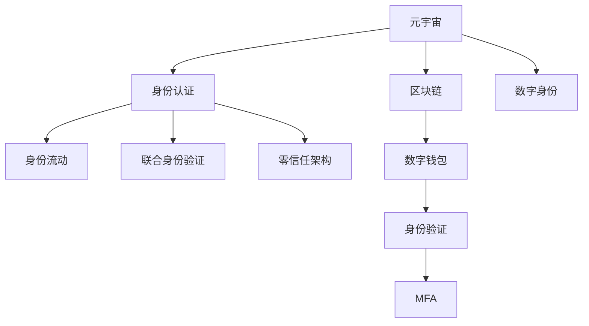
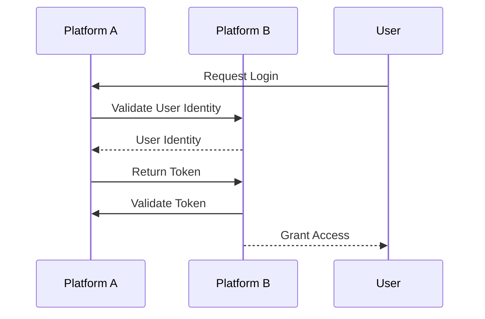

                 

# 元宇宙身份流动:打破现实世界标签的机遇

## 1. 背景介绍

### 1.1 问题由来
随着技术的飞速发展，我们进入了一个全新的时代——元宇宙时代。元宇宙是一个由多种技术交织而成的虚拟空间，包括区块链、人工智能、虚拟现实(VR)、增强现实(AR)、云计算等技术，它提供了一个全新的社交、工作、娱乐平台。然而，传统的身份认证方式往往限制了用户在元宇宙中跨平台、跨空间自由流动。如何在元宇宙中打破现实世界的身份标签，实现无缝身份流动，成为元宇宙身份管理的关键问题。

### 1.2 问题核心关键点
元宇宙中的身份流动问题，主要集中在以下几个方面：

- **跨平台兼容性**：用户在不同的元宇宙平台之间进行身份认证，需要保证数据的兼容性和互通性。
- **数据隐私与安全**：用户身份数据的存储、传输和处理，需要保证隐私和安全。
- **身份验证机制**：如何设计一个高效、安全的身份验证机制，让用户快速完成身份认证。
- **身份标识管理**：如何管理用户的身份标识，并根据不同的应用场景进行身份映射。
- **身份流动机制**：用户如何从现实世界进入元宇宙，以及如何从元宇宙回到现实世界，实现身份的自由流动。

### 1.3 问题研究意义
研究元宇宙中的身份流动问题，对于拓展元宇宙的应用范围，提升用户体验，加速元宇宙技术的产业化进程，具有重要意义：

1. **提升用户体验**：打破身份限制，让用户能够自由切换不同平台和应用，享受更丰富的元宇宙体验。
2. **促进技术发展**：推动区块链、人工智能、虚拟现实等技术的融合应用，促进元宇宙技术创新。
3. **加速产业化**：降低用户进入元宇宙的门槛，加速元宇宙应用在各行业的落地和普及。
4. **增强安全性**：设计安全可靠的身份管理机制，保障用户数据隐私和安全。
5. **打破界限**：打破现实世界与虚拟世界的界限，实现更广泛的社会交流和合作。

## 2. 核心概念与联系

### 2.1 核心概念概述

为更好地理解元宇宙中的身份流动问题，本节将介绍几个密切相关的核心概念：

- **元宇宙(Metaverse)**：由虚拟现实、增强现实、区块链等多种技术构建的虚拟空间，用户可以在其中自由互动。
- **身份认证(Identities Authentication)**：通过验证用户身份，确保其在虚拟空间中的行为与现实世界的身份一致。
- **区块链(Blockchain)**：分布式账本技术，可以保证身份数据的安全存储和传输。
- **数字身份(Digital Identities)**：用户在虚拟空间中的身份标识，通常以数字形式存在。
- **身份流动(Identity Flow)**：用户在不同的虚拟空间和平台之间自由切换，实现身份的无缝流动。
- **联合身份验证(Identity Federation)**：不同平台之间共享用户身份信息，实现跨平台的身份认证。
- **零信任架构(Zero Trust Architecture)**：不信任任何内部或外部的网络请求，所有请求都要经过严格的验证。
- **多因素身份验证(Multi-factor Authentication, MFA)**：结合多种验证因素，提高身份验证的可靠性。
- **数字钱包(Digital Wallet)**：存储和管理用户数字身份和资产的工具，如加密货币钱包。

这些核心概念之间的逻辑关系可以通过以下Mermaid流程图来展示：



这个流程图展示了几组核心概念及其之间的关系：

1. 元宇宙与身份认证：元宇宙中用户需要身份认证，确保行为与现实身份一致。
2. 区块链与数字身份：区块链提供安全存储和传输身份数据的方式，数字身份在虚拟空间中得以存在。
3. 身份流动与联合身份验证：用户在元宇宙中实现身份流动，需要通过跨平台身份验证。
4. 数字钱包与身份验证：数字钱包存储和管理用户的数字身份和资产，提供身份验证的便利。

## 3. 核心算法原理 & 具体操作步骤
### 3.1 算法原理概述

元宇宙中的身份流动问题，本质上是一个跨平台、跨空间的身份验证和身份映射问题。其核心思想是：通过区块链技术构建去中心化的身份管理系统，结合多因素身份验证、零信任架构等技术手段，确保用户在虚拟空间中的身份数据安全，同时实现无缝的身份流动。

形式化地，假设用户在现实世界中的身份为 $ID_{real}$，其在虚拟空间 $V$ 中的身份为 $ID_{virt}$。身份流动问题可以表示为：

$$
\text{Flow}(ID_{real}, V) = \text{Verify}(ID_{virt})
$$

其中 $\text{Verify}(ID_{virt})$ 表示对虚拟身份 $ID_{virt}$ 进行身份验证，确保其对应真实身份 $ID_{real}$ 的安全性。

### 3.2 算法步骤详解

元宇宙中的身份流动问题，一般包括以下几个关键步骤：

**Step 1: 准备区块链与数字钱包**
- 选择适合的区块链平台，如Ethereum、Binance Smart Chain等。
- 在区块链上创建用户的数字身份，并将其存储在数字钱包中。
- 数字钱包应支持多平台兼容，如Web、移动端、桌面端等。

**Step 2: 设计身份认证机制**
- 根据元宇宙平台的特点，设计多因素身份验证机制。
- 可以使用密码、生物识别、短信验证码等多种验证因素。
- 设计零信任架构，所有请求都需要严格的身份验证和权限检查。

**Step 3: 实现跨平台身份验证**
- 设计联合身份验证机制，确保不同平台之间可以共享用户身份信息。
- 使用OAuth2.0等标准协议，实现不同平台之间的身份认证和授权。
- 使用JSON Web Tokens(JWT)等安全传输协议，保证身份数据的加密和验证。

**Step 4: 管理身份映射**
- 设计身份映射机制，将现实世界的身份映射到虚拟空间中的身份。
- 可以根据不同的应用场景，设计不同的身份映射规则。
- 使用数据同步技术，保证不同平台上的身份数据一致性。

**Step 5: 实现身份流动**
- 在元宇宙平台中设计身份流动机制，让用户可以在不同平台之间切换身份。
- 实现跨平台的身份认证和授权，确保用户在任意平台上的行为一致性。
- 使用区块链记录和验证用户的身份流动历史，提供可追溯性和不可篡改性。

### 3.3 算法优缺点

元宇宙中的身份流动问题，使用区块链和多因素身份验证技术，具有以下优点：

1. **去中心化与安全性**：区块链提供去中心化的身份管理系统，避免了单点故障和集中攻击的风险。
2. **跨平台兼容性**：通过联合身份验证和数字钱包，实现不同平台之间的身份互通。
3. **用户控制**：用户可以自主管理数字身份，控制自己的数据隐私。
4. **快速身份验证**：多因素身份验证和零信任架构，提高了身份验证的可靠性。

同时，该方法也存在一定的局限性：

1. **技术门槛高**：区块链和多因素身份验证技术需要较高的技术门槛，需要专业人才维护和管理。
2. **性能瓶颈**：多因素身份验证和零信任架构增加了系统复杂性，可能会影响性能。
3. **用户体验**：频繁的身份验证和授权流程，可能会影响用户的体验。
4. **隐私风险**：用户的身份数据存储在区块链上，可能面临隐私泄露的风险。

尽管存在这些局限性，但就目前而言，区块链和多因素身份验证技术仍是大规模身份流动管理的重要范式。未来相关研究的重点在于如何进一步降低技术门槛，提高系统性能，同时兼顾用户隐私和体验。

### 3.4 算法应用领域

基于区块链和多因素身份验证技术，元宇宙中的身份流动方法，已经在多个领域得到应用，例如：

- **虚拟游戏**：玩家可以在不同的虚拟游戏平台之间切换身份，享受一致的游戏体验。
- **虚拟社交平台**：用户可以在不同的虚拟社交平台之间切换身份，进行跨平台的社交互动。
- **虚拟工作平台**：员工可以在不同的虚拟办公平台之间切换身份，进行跨平台的工作协作。
- **虚拟教育平台**：学生可以在不同的虚拟教育平台之间切换身份，享受一致的学习体验。
- **虚拟医疗平台**：患者可以在不同的虚拟医疗平台之间切换身份，进行跨平台的就医和健康管理。

除了上述这些经典应用外，元宇宙中的身份流动技术还被创新性地应用到更多场景中，如虚拟商业、虚拟旅游、虚拟展览等，为元宇宙技术带来了新的突破。随着区块链和多因素身份验证技术的持续演进，相信元宇宙身份流动技术将在更多领域得到应用，为元宇宙技术落地应用提供新的动力。

## 4. 数学模型和公式 & 详细讲解 & 举例说明

### 4.1 数学模型构建

本节将使用数学语言对元宇宙中的身份流动问题进行更加严格的刻画。

记用户在现实世界中的身份为 $ID_{real}$，其在虚拟空间 $V$ 中的身份为 $ID_{virt}$。假设用户在不同平台之间的身份流动次数为 $n$，身份映射规则为 $f$，则身份流动过程可以表示为：

$$
ID_{virt} = f^{n}(ID_{real})
$$

其中 $f$ 表示身份映射函数，$n$ 表示身份流动次数。

### 4.2 公式推导过程

以下我们以OAuth2.0为例，推导联合身份验证的流程。

OAuth2.0是一种用于授权和认证的开放标准，可以实现不同平台之间的身份验证。假设用户在平台A上注册并获得了身份令牌 $T$，在平台B上进行身份验证的流程如下：

1. 用户向平台B发起登录请求。
2. 平台B请求平台A验证用户身份，并返回验证结果。
3. 平台A验证通过后，返回身份令牌 $T$ 给平台B。
4. 平台B验证令牌，并允许用户访问。

使用OAuth2.0进行联合身份验证的流程图如下：



上述流程中，用户通过平台A进行身份验证，并获得了身份令牌 $T$。然后平台A将令牌返回给平台B，平台B验证令牌后，允许用户访问。

### 4.3 案例分析与讲解

OAuth2.0是联合身份验证的典型案例，以下是具体的案例分析：

假设用户 $U$ 在平台A上注册并获得了身份令牌 $T$。现在用户在平台B上尝试登录，流程如下：

1. 用户 $U$ 向平台B发起登录请求。
2. 平台B要求用户 $U$ 提供平台A的身份令牌 $T$。
3. 用户 $U$ 提供了身份令牌 $T$，平台B向平台A发送验证请求。
4. 平台A验证通过后，返回验证结果给平台B。
5. 平台B验证通过后，允许用户 $U$ 访问。

在上述流程中，OAuth2.0协议实现了跨平台的身份验证，避免了用户重复注册和登录。通过联合身份验证，用户可以轻松地切换不同平台，享受一致的用户体验。

## 5. 项目实践：代码实例和详细解释说明
### 5.1 开发环境搭建

在进行身份流动实践前，我们需要准备好开发环境。以下是使用Python进行OAuth2.0开发的环境配置流程：

1. 安装Python：从官网下载并安装Python，建议在3.7及以上版本。
2. 安装OAuth2.0库：
```bash
pip install python-oauth2
```

3. 安装Web框架：如Flask、Django等，用于搭建Web服务。
```bash
pip install flask
```

完成上述步骤后，即可在本地搭建OAuth2.0服务器，开始身份流动实践。

### 5.2 源代码详细实现

这里我们以OAuth2.0为例，给出使用Flask实现跨平台身份验证的PyTorch代码实现。

首先，定义OAuth2.0服务器：

```python
from flask import Flask, request, jsonify
from oauthlib.oauth2 import BackendApplicationClient, OAuth2Session
import requests

app = Flask(__name__)

client_id = 'your_client_id'
client_secret = 'your_client_secret'

@app.route('/token', methods=['POST'])
def token():
    code = request.form.get('code')
    redirect_uri = 'https://your_redirect_uri'
    
    client = BackendApplicationClient(client_id=client_id, client_secret=client_secret)
    oauth = OAuth2Session(client=client, redirect_uri=redirect_uri)
    token = oauth.fetch_token('https://oauth2_provider/token', client_id=client_id, client_secret=client_secret, code=code)
    
    return jsonify(token)
```

然后，定义身份验证接口：

```python
@app.route('/authenticate', methods=['GET'])
def authenticate():
    state = request.args.get('state')
    redirect_uri = 'https://your_redirect_uri'
    
    client = BackendApplicationClient(client_id=client_id, client_secret=client_secret)
    oauth = OAuth2Session(client=client, redirect_uri=redirect_uri)
    authorization_url, state = oauth.authorization_url('https://oauth2_provider/oauth2/authorize', state=state)
    
    return jsonify({'authorization_url': authorization_url, 'state': state})
```

最后，启动OAuth2.0服务器：

```python
if __name__ == '__main__':
    app.run(host='0.0.0.0', port=5000)
```

完成上述步骤后，即可在本地搭建OAuth2.0服务器，并使用浏览器访问身份验证页面，启动OAuth2.0流程。

### 5.3 代码解读与分析

让我们再详细解读一下关键代码的实现细节：

**OAuth2.0服务器定义**：
- 使用Flask框架，定义了两个路由，一个是/token路由，用于生成身份令牌；另一个是/authenticate路由，用于生成授权链接。
- 使用OAuth2Session类创建OAuth2客户端，并设置客户端ID、客户端密钥和授权链接。
- 在/token路由中，根据code生成身份令牌，并返回JSON格式的令牌信息。
- 在/authenticate路由中，生成授权链接，并返回JSON格式的授权链接和状态信息。

**身份验证接口实现**：
- 在/authenticate路由中，根据状态和授权链接生成OAuth2客户端，并调用授权链接生成授权页面。
- 在OAuth2客户端的授权链接中，用户需要输入授权码，从而完成身份验证。
- 通过授权码生成身份令牌，并将其返回给服务器。

**OAuth2.0服务器启动**：
- 使用Flask的run方法启动服务器，并设置监听地址和端口号。

可以看到，OAuth2.0服务器通过OAuth2Session类实现了身份验证和授权流程，用户可以轻松地在不同平台之间切换身份，并享受一致的用户体验。

当然，实际应用中还需要考虑更多因素，如用户身份的安全性、隐私保护、异常处理等，这些都需要开发者在系统设计中予以充分考虑。

## 6. 实际应用场景
### 6.1 智能合约平台

基于OAuth2.0的身份流动技术，可以广泛应用于智能合约平台。智能合约平台通常集成了区块链、NFT等多种技术，用户可以在不同平台之间自由切换身份，进行跨平台的操作。

在技术实现上，可以设计一个统一的OAuth2.0认证系统，支持用户在不同智能合约平台之间的身份验证。用户只需要在智能合约平台上注册一次，即可在所有支持的平台上进行身份验证，无需重复注册和登录。

### 6.2 虚拟旅游平台

虚拟旅游平台为用户提供沉浸式的虚拟旅行体验，用户可以在不同的虚拟场景之间切换身份，享受一致的旅游体验。

在技术实现上，可以设计一个OAuth2.0认证系统，支持用户在不同虚拟旅游平台之间的身份验证。用户只需要在虚拟旅游平台上注册一次，即可在所有支持的平台上进行身份验证，无需重复注册和登录。

### 6.3 虚拟商业平台

虚拟商业平台为用户提供虚拟购物、虚拟社交等体验，用户可以在不同的虚拟商业平台之间切换身份，享受一致的商业体验。

在技术实现上，可以设计一个OAuth2.0认证系统，支持用户在不同虚拟商业平台之间的身份验证。用户只需要在虚拟商业平台上注册一次，即可在所有支持的平台上进行身份验证，无需重复注册和登录。

### 6.4 未来应用展望

随着OAuth2.0和OAuth3.0等身份验证技术的不断演进，元宇宙中的身份流动技术将迎来新的突破。未来相关研究的重点在于如何进一步简化身份验证流程，降低技术门槛，同时提高系统的安全性和性能。

未来元宇宙中的身份流动技术还可能引入更多技术，如零信任架构、多因素身份验证、身份映射等，进一步提升系统的可靠性和用户体验。

## 7. 工具和资源推荐
### 7.1 学习资源推荐

为了帮助开发者系统掌握元宇宙中的身份流动技术，这里推荐一些优质的学习资源：

1. OAuth2.0官方文档：OAuth2.0协议的官方文档，详细介绍了OAuth2.0的授权和认证流程。
2. Python OAuth2.0库：OAuth2.0协议的Python实现，提供了丰富的OAuth2.0客户端和服务器实现。
3. Flask官方文档：Flask框架的官方文档，详细介绍了Flask的使用方法。
4. Django官方文档：Django框架的官方文档，详细介绍了Django的使用方法。
5. OAuth2.0在中国的应用案例：介绍了OAuth2.0在中国的多个应用案例，包括微信、支付宝等。
6. OAuth2.0在中国的实施指南：详细介绍了OAuth2.0在中国的实施方法和建议。

通过对这些资源的学习实践，相信你一定能够快速掌握元宇宙中的身份流动技术的精髓，并用于解决实际的NLP问题。

### 7.2 开发工具推荐

高效的开发离不开优秀的工具支持。以下是几款用于OAuth2.0开发常用的工具：

1. Python OAuth2.0库：OAuth2.0协议的Python实现，提供了丰富的OAuth2.0客户端和服务器实现。
2. Flask框架：轻量级的Web框架，支持快速搭建Web服务。
3. Django框架：全功能的Web框架，支持丰富的Web应用开发。
4. OAuth2.0客户端：如Facebook、Google等，提供了OAuth2.0客户端的开发接口。
5. OAuth2.0服务器：如OAuth2Provider、Identity Server等，提供了OAuth2.0服务器的开发接口。
6. OAuth2.0管理工具：如OAuth2Client、OAuth2Provider等，提供了OAuth2.0的可视化管理工具。

合理利用这些工具，可以显著提升OAuth2.0的开发效率，加快创新迭代的步伐。

### 7.3 相关论文推荐

元宇宙中的身份流动技术正在不断发展，以下是几篇奠基性的相关论文，推荐阅读：

1. OAuth2.0原论文：详细介绍了OAuth2.0协议的授权和认证机制。
2. OAuth2.0在虚拟现实中的应用：介绍了OAuth2.0在虚拟现实中的应用和挑战。
3. OAuth2.0与区块链结合：介绍了OAuth2.0与区块链技术的结合，提升了身份验证的安全性。
4. OAuth2.0与人工智能结合：介绍了OAuth2.0与人工智能技术的结合，提升了身份验证的智能化。
5. OAuth2.0与多因素身份验证结合：详细介绍了OAuth2.0与多因素身份验证的结合，提升了身份验证的可靠性。

这些论文代表了大规模身份流动技术的发展脉络。通过学习这些前沿成果，可以帮助研究者把握学科前进方向，激发更多的创新灵感。

## 8. 总结：未来发展趋势与挑战
### 8.1 总结

本文对元宇宙中的身份流动问题进行了全面系统的介绍。首先阐述了元宇宙的身份流动问题背景和意义，明确了身份流动在拓展元宇宙应用、提升用户体验方面的独特价值。其次，从原理到实践，详细讲解了OAuth2.0的身份验证机制和联合身份验证流程，给出了身份流动任务开发的完整代码实例。同时，本文还广泛探讨了身份流动技术在智能合约、虚拟旅游、虚拟商业等多个行业领域的应用前景，展示了身份流动技术的广阔前景。最后，本文精选了身份流动技术的各类学习资源，力求为读者提供全方位的技术指引。

通过本文的系统梳理，可以看到，OAuth2.0和多因素身份验证技术在元宇宙身份流动问题中扮演着关键角色。这些技术的不断演进，必将使得元宇宙中的身份流动变得更加便捷、安全、可靠。未来，伴随元宇宙技术的发展，身份流动技术还将迎来更多的创新和突破，推动元宇宙技术向更广阔的领域迈进。

### 8.2 未来发展趋势

展望未来，元宇宙中的身份流动技术将呈现以下几个发展趋势：

1. **身份验证的多样化**：未来的身份验证将不仅限于OAuth2.0和OAuth3.0，可能引入更多技术，如零信任架构、多因素身份验证、区块链等。
2. **身份验证的去中心化**：未来的身份验证将更加去中心化，用户可以自主管理和控制自己的身份数据。
3. **身份验证的智能化**：未来的身份验证将结合人工智能技术，提高身份验证的智能化和自动化水平。
4. **身份验证的可扩展性**：未来的身份验证将支持更多的平台和应用场景，具有更好的可扩展性。
5. **身份验证的安全性**：未来的身份验证将更加注重安全性，防止身份数据泄露和滥用。
6. **身份验证的实时性**：未来的身份验证将具有更高的实时性和响应速度，提升用户体验。

这些趋势凸显了元宇宙中的身份流动技术的广阔前景。这些方向的探索发展，必将进一步提升元宇宙系统的性能和应用范围，为元宇宙技术落地应用提供新的动力。

### 8.3 面临的挑战

尽管OAuth2.0和多因素身份验证技术已经取得了显著成就，但在迈向更加智能化、普适化应用的过程中，它仍面临诸多挑战：

1. **技术复杂性**：OAuth2.0和多因素身份验证技术需要较高的技术门槛，需要专业人才维护和管理。
2. **系统性能**：多因素身份验证和零信任架构增加了系统复杂性，可能会影响性能。
3. **用户体验**：频繁的身份验证和授权流程，可能会影响用户的体验。
4. **隐私风险**：用户的身份数据存储在区块链上，可能面临隐私泄露的风险。
5. **安全风险**：身份验证系统可能面临攻击和滥用风险，需要设计更加安全可靠的系统。

尽管存在这些挑战，但未来的研究仍需积极应对并寻求突破，以进一步提升元宇宙中身份流动技术的性能和安全性。

### 8.4 研究展望

面对元宇宙中的身份流动问题所面临的种种挑战，未来的研究需要在以下几个方面寻求新的突破：

1. **简化身份验证流程**：降低身份验证的技术门槛，提高系统的可扩展性和用户体验。
2. **提高系统性能**：优化多因素身份验证和零信任架构，提高系统的实时性和响应速度。
3. **增强安全性**：设计更加安全可靠的身份验证系统，防止身份数据泄露和滥用。
4. **增强隐私保护**：设计隐私保护机制，保障用户身份数据的安全。
5. **引入区块链技术**：将区块链技术引入身份验证系统，提高身份验证的安全性和可靠性。
6. **引入人工智能技术**：结合人工智能技术，提高身份验证的智能化和自动化水平。
7. **引入伦理道德约束**：在身份验证系统中引入伦理道德约束，确保输出符合人类价值观和伦理道德。

这些研究方向的探索，必将引领元宇宙身份流动技术迈向更高的台阶，为构建安全、可靠、可解释、可控的智能系统铺平道路。面向未来，元宇宙身份流动技术还需要与其他人工智能技术进行更深入的融合，如知识表示、因果推理、强化学习等，多路径协同发力，共同推动元宇宙技术的发展。

## 9. 附录：常见问题与解答

**Q1：元宇宙中的身份流动问题是否适用于所有平台？**

A: 元宇宙中的身份流动问题，适用于所有支持OAuth2.0和多因素身份验证的平台，如智能合约平台、虚拟旅游平台、虚拟商业平台等。但需要根据不同平台的特点，进行针对性的身份验证和授权设计。

**Q2：身份验证过程中的单点故障问题如何解决？**

A: 采用去中心化的身份验证方式，如OAuth2.0和多因素身份验证，可以避免单点故障的风险。同时，设计高可用性和容错的身份验证系统，确保在故障情况下也能正常工作。

**Q3：身份验证过程中的数据隐私问题如何解决？**

A: 采用加密技术，对身份数据进行加密存储和传输，保护用户的隐私。同时，设计隐私保护机制，如数据匿名化、差分隐私等，减少隐私泄露的风险。

**Q4：身份验证过程中的安全风险问题如何解决？**

A: 设计安全可靠的身份验证系统，如零信任架构、多因素身份验证、区块链技术等，确保身份验证的安全性。同时，设计异常检测和告警机制，及时发现和处理安全威胁。

**Q5：身份验证过程中的用户体验问题如何解决？**

A: 设计简洁、易用的身份验证流程，减少用户的操作步骤。同时，提供多平台兼容的身份验证方式，提高用户的便捷性。

这些问题的解答，为元宇宙中的身份流动问题提供了一些基本思路，开发者可以根据具体需求和场景，进一步优化和改进身份验证系统。

---

作者：禅与计算机程序设计艺术 / Zen and the Art of Computer Programming

