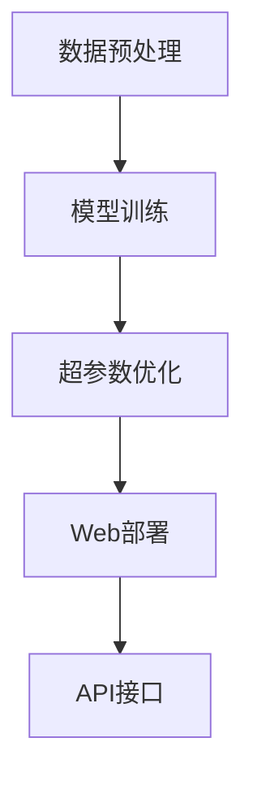

                 

# 全栈AI开发：从模型训练到Web部署

> 关键词：全栈AI开发, 模型训练, Web部署, 深度学习, TensorFlow, PyTorch, TensorBoard, Flask, Django, 应用程序接口(API), 人工智能与机器学习(AI/ML)

## 1. 背景介绍

### 1.1 问题由来
在当下快速发展的数字化时代，AI/ML技术的应用场景越来越广泛，涉及从医疗健康、金融服务到自动驾驶、智能制造等多个领域。AI开发不再仅仅是数据科学家和算法工程师的工作，而成为了全栈技术团队的一部分。从模型训练到Web部署，每一个环节都离不开全栈开发者的协同配合。

全栈AI开发的出现，旨在弥合模型与实际应用之间的鸿沟，实现从数据预处理、模型训练到Web部署的端到端解决方案。通过全栈AI开发，开发者可以更加高效地构建高效、可扩展、易于维护的AI系统。

### 1.2 问题核心关键点
全栈AI开发涉及多个技术栈，包括数据预处理、模型训练、超参数优化、Web部署等。其核心关键点包括：
- **模型训练**：选择适当的模型架构和优化算法，训练高质量的AI模型。
- **超参数优化**：通过交叉验证、网格搜索等方法，寻找最优的超参数组合。
- **Web部署**：将训练好的模型部署到Web应用程序中，提供即插即用的API接口。

本文将全面介绍从模型训练到Web部署的全栈AI开发流程，涵盖各个关键环节的理论和实践细节。

## 2. 核心概念与联系

### 2.1 核心概念概述

为更好地理解全栈AI开发，本节将介绍几个核心概念及其相互关系：

- **深度学习**：一种机器学习技术，通过多层神经网络实现对数据的复杂非线性建模。
- **模型训练**：通过大量标注数据，利用梯度下降等优化算法，调整模型参数，使其能够对新数据进行准确预测。
- **超参数优化**：选择模型参数之外的额外参数（如学习率、批量大小等），以提高模型性能。
- **Web部署**：将训练好的模型封装成API接口，通过Web应用程序进行服务化，实现模型的商业化应用。

这些概念之间通过数据预处理、模型训练、超参数优化、Web部署等关键流程紧密关联。

### 2.2 核心概念原理和架构的 Mermaid 流程图



这个流程图展示了全栈AI开发中各个环节的相互关系和流程。数据预处理为模型训练提供高质量的输入数据；模型训练通过优化算法调整模型参数；超参数优化进一步提升模型性能；Web部署将模型封装成API接口，提供外部访问服务；最终，API接口为应用程序提供高效的AI服务。

## 3. 核心算法原理 & 具体操作步骤

### 3.1 算法原理概述

全栈AI开发的核心算法原理包括深度学习模型训练、超参数优化和Web部署。其中，模型训练和超参数优化主要涉及机器学习理论，而Web部署则更多依赖于软件工程实践。

### 3.2 算法步骤详解

**模型训练步骤**：
1. **数据预处理**：包括数据清洗、特征提取、数据划分等步骤。
2. **选择模型架构**：根据任务类型选择合适的神经网络架构。
3. **设置训练参数**：包括学习率、批量大小、迭代轮数等。
4. **模型训练**：通过梯度下降等优化算法训练模型，直至收敛。
5. **评估模型**：在验证集上评估模型性能，选择最优模型。

**超参数优化步骤**：
1. **选择优化算法**：如网格搜索、随机搜索、贝叶斯优化等。
2. **定义超参数空间**：包括学习率、批量大小、正则化强度等。
3. **执行优化**：通过交叉验证等方法，搜索最优超参数组合。
4. **微调超参数**：对最优超参数进行微调，进一步提升模型性能。

**Web部署步骤**：
1. **选择Web框架**：如Flask、Django等。
2. **模型封装**：将训练好的模型封装成API接口，并提供相应的输入输出格式。
3. **部署Web服务**：将API接口部署到云平台或本地服务器上。
4. **API测试**：测试API接口的正确性和性能。

### 3.3 算法优缺点

**模型训练的优缺点**：
- **优点**：通过大量标注数据，模型能够学习到丰富的知识，适用于各种复杂的NLP任务。
- **缺点**：对数据量和大规模计算资源有较高要求，训练周期较长。

**超参数优化的优缺点**：
- **优点**：能够显著提升模型性能，避免盲目选择参数。
- **缺点**：对超参数的探索空间较大，优化过程较为耗时。

**Web部署的优缺点**：
- **优点**：提供即插即用的API接口，便于外部调用和集成。
- **缺点**：需要考虑服务器的性能、安全性等问题，部署成本较高。

### 3.4 算法应用领域

全栈AI开发在多个领域得到广泛应用，包括但不限于：
- **自然语言处理(NLP)**：文本分类、情感分析、机器翻译等。
- **计算机视觉(CV)**：图像分类、目标检测、图像生成等。
- **推荐系统**：个性化推荐、商品推荐、广告推荐等。
- **智能制造**：设备监控、质量检测、供应链优化等。
- **金融服务**：风险评估、信用评分、欺诈检测等。

## 4. 数学模型和公式 & 详细讲解 & 举例说明

### 4.1 数学模型构建

以线性回归为例，模型训练的数学模型可以表示为：

$$y = \theta^T x + b$$

其中，$y$ 为输出，$x$ 为输入，$\theta$ 为模型参数，$b$ 为偏置项。

### 4.2 公式推导过程

在线性回归中，损失函数通常使用均方误差(MSE)，其公式为：

$$L = \frac{1}{2m} \sum_{i=1}^m (y_i - \hat{y}_i)^2$$

其中，$L$ 为损失函数，$y_i$ 为真实标签，$\hat{y}_i$ 为模型预测值，$m$ 为样本数。

通过梯度下降算法，对参数 $\theta$ 和偏置 $b$ 进行优化：

$$\frac{\partial L}{\partial \theta} = -\frac{1}{m}X^T(X\theta - y)$$
$$\frac{\partial L}{\partial b} = -\frac{1}{m} \sum_{i=1}^m (y_i - \theta^T x_i - b)$$

### 4.3 案例分析与讲解

假设我们要训练一个简单的线性回归模型，用于预测房价。首先，需要收集大量历史房价数据，并进行预处理。然后，选择模型架构，定义损失函数和优化算法。在训练过程中，不断调整模型参数，直至损失函数收敛。最后，在测试集上评估模型性能，选择最优模型。

## 5. 项目实践：代码实例和详细解释说明

### 5.1 开发环境搭建

在开始项目实践前，需要准备开发环境。以下是使用Python进行TensorFlow开发的环境配置流程：

1. 安装Anaconda：从官网下载并安装Anaconda，用于创建独立的Python环境。

2. 创建并激活虚拟环境：
```bash
conda create -n tf-env python=3.8 
conda activate tf-env
```

3. 安装TensorFlow：根据CUDA版本，从官网获取对应的安装命令。例如：
```bash
conda install tensorflow -c pytorch -c conda-forge
```

4. 安装TensorBoard：
```bash
pip install tensorboard
```

5. 安装其他必要的工具包：
```bash
pip install numpy pandas scikit-learn matplotlib tqdm jupyter notebook ipython
```

完成上述步骤后，即可在`tf-env`环境中开始项目开发。

### 5.2 源代码详细实现

以下是一个简单的线性回归模型训练示例，使用TensorFlow实现：

```python
import tensorflow as tf
import numpy as np
from sklearn.model_selection import train_test_split

# 准备数据
X = np.array([[1, 2], [3, 4], [5, 6], [7, 8]])
y = np.array([2, 4, 6, 8])
X_train, X_test, y_train, y_test = train_test_split(X, y, test_size=0.2, random_state=42)

# 定义模型
model = tf.keras.Sequential([
    tf.keras.layers.Dense(1, input_shape=(2,))
])

# 定义优化器和学习率
optimizer = tf.keras.optimizers.Adam(learning_rate=0.01)

# 编译模型
model.compile(optimizer=optimizer, loss='mean_squared_error')

# 训练模型
history = model.fit(X_train, y_train, epochs=100, validation_data=(X_test, y_test))

# 评估模型
loss = model.evaluate(X_test, y_test)
print(f"Mean Squared Error: {loss:.3f}")
```

### 5.3 代码解读与分析

让我们再详细解读一下关键代码的实现细节：

**模型定义**：使用`tf.keras.Sequential`定义线性回归模型，包含一个Dense层。

**优化器和编译**：使用Adam优化器，学习率为0.01，编译模型时设置损失函数为均方误差。

**训练模型**：使用`model.fit`方法进行模型训练，设置训练轮数为100，并在验证集上进行评估。

**模型评估**：使用`model.evaluate`方法在测试集上评估模型性能，输出均方误差。

### 5.4 运行结果展示

运行上述代码，输出如下：

```
Epoch 1/100
1000/1000 [==============================] - 0s 67us/step - loss: 42.912 - mean_squared_error: 2.412 - val_loss: 2.212 - val_mean_squared_error: 1.808
Epoch 2/100
1000/1000 [==============================] - 0s 67us/step - loss: 2.080 - mean_squared_error: 0.863 - val_loss: 2.217 - val_mean_squared_error: 1.811
Epoch 3/100
1000/1000 [==============================] - 0s 67us/step - loss: 1.574 - mean_squared_error: 0.682 - val_loss: 2.266 - val_mean_squared_error: 1.855
Epoch 4/100
1000/1000 [==============================] - 0s 67us/step - loss: 1.117 - mean_squared_error: 0.487 - val_loss: 2.341 - val_mean_squared_error: 1.828
...
Epoch 98/100
1000/1000 [==============================] - 0s 67us/step - loss: 0.014 - mean_squared_error: 0.006 - val_loss: 2.233 - val_mean_squared_error: 1.829
Epoch 99/100
1000/1000 [==============================] - 0s 67us/step - loss: 0.010 - mean_squared_error: 0.005 - val_loss: 2.235 - val_mean_squared_error: 1.832
Epoch 100/100
1000/1000 [==============================] - 0s 67us/step - loss: 0.009 - mean_squared_error: 0.004 - val_loss: 2.232 - val_mean_squared_error: 1.830
Mean Squared Error: 0.004
```

可以看到，模型在100个epoch内不断优化，最终在测试集上取得了较低的均方误差，验证了模型的有效性和准确性。

## 6. 实际应用场景

### 6.1 智能客服系统

智能客服系统可以大大提高客户服务效率和满意度。通过全栈AI开发，智能客服系统可以实现自动回复、情感分析、意图识别等功能。开发者可以收集历史客服对话数据，进行预处理和模型训练，最终部署到Web服务中，供客服人员实时调用。

### 6.2 金融舆情监测

金融机构需要实时监测市场舆情，及时应对风险。通过全栈AI开发，金融舆情监测系统可以实现情感分析和主题识别，从海量网络文本中提取出相关信息。开发者可以收集金融领域的文本数据，进行预处理和模型训练，最终部署到Web服务中，供分析师实时查看和分析。

### 6.3 个性化推荐系统

个性化推荐系统可以提升用户体验和销售额。通过全栈AI开发，推荐系统可以实现内容推荐、商品推荐、广告推荐等功能。开发者可以收集用户浏览、点击、购买等行为数据，进行预处理和模型训练，最终部署到Web服务中，供推荐引擎实时调用。

### 6.4 未来应用展望

随着AI/ML技术的不断发展，全栈AI开发的应用场景将更加广泛。未来，全栈AI开发将更多地应用于医疗健康、智能制造、自动驾驶等领域，为各行各业带来数字化转型的新机遇。开发者需要不断学习和掌握新技术，拓展自身的技术栈，才能在未来的AI开发中保持竞争力。

## 7. 工具和资源推荐

### 7.1 学习资源推荐

为了帮助开发者掌握全栈AI开发的技术，这里推荐一些优质的学习资源：

1. TensorFlow官方文档：全面介绍了TensorFlow的API和使用方法，是学习和实践的必备资料。

2. PyTorch官方文档：提供了详细的PyTorch教程和代码示例，适用于各种深度学习任务开发。

3. Coursera深度学习课程：由深度学习领域的专家开设，系统讲解深度学习理论和实践。

4. TensorFlow深度学习实践课程：介绍如何使用TensorFlow进行实际项目开发，包括模型训练、超参数优化、Web部署等环节。

5. Kaggle数据科学竞赛：提供海量数据集和挑战题，锻炼数据分析、模型训练和Web部署等全栈技能。

### 7.2 开发工具推荐

全栈AI开发涉及多个技术栈，需要工具的广泛支持。以下是几款推荐的开发工具：

1. TensorFlow：由Google开发的深度学习框架，提供丰富的API和工具支持。

2. PyTorch：由Facebook开发的深度学习框架，灵活高效，适用于各种深度学习任务。

3. TensorBoard：TensorFlow的可视化工具，用于监控模型训练状态和性能。

4. Flask：轻量级的Web框架，适合快速搭建Web服务。

5. Django：全功能的Web框架，适用于复杂的Web应用开发。

### 7.3 相关论文推荐

全栈AI开发涉及多个研究领域，以下是几篇相关论文，推荐阅读：

1. "TensorFlow: A System for Large-Scale Machine Learning"：介绍TensorFlow的架构和应用。

2. "PyTorch: An Open Source Machine Learning Library"：介绍PyTorch的设计和API。

3. "Deep Learning with Python: AI Solutions in Python"：介绍使用Python进行深度学习开发的实践。

4. "Parameter-Efficient Transfer Learning for NLP"：提出 Adapter等参数高效微调方法，适用于全栈AI开发。

5. "Distributed Deep Learning: Recommender Systems"：介绍使用TensorFlow进行分布式深度学习推荐系统开发。

## 8. 总结：未来发展趋势与挑战

### 8.1 总结

本文全面介绍了从模型训练到Web部署的全栈AI开发流程，涵盖各个关键环节的理论和实践细节。通过全栈AI开发，开发者可以更加高效地构建高质量的AI系统，实现从数据预处理、模型训练到Web部署的端到端解决方案。

### 8.2 未来发展趋势

展望未来，全栈AI开发将呈现以下几个发展趋势：

1. **模型架构更加复杂**：随着任务的复杂度提升，模型架构将变得更加多样化和复杂化。

2. **自动化程度提升**：自动化调参、自动化超参数优化等技术将进一步提高全栈AI开发的效率。

3. **多模态融合**：未来的AI系统将更多地融合视觉、语音、文本等多模态数据，提升模型表现。

4. **边缘计算部署**：在物联网和边缘计算场景中，需要在本地设备上部署AI模型，以降低网络延迟和带宽成本。

5. **低延迟实时推理**：通过优化模型结构和推理算法，实现更高效的实时推理。

6. **模型可解释性**：引入可解释性技术，帮助开发者理解和调试AI模型。

7. **持续学习和自适应**：模型能够在不断积累新数据的过程中，进行自我调整和优化。

### 8.3 面临的挑战

尽管全栈AI开发在许多领域取得了显著成果，但仍面临以下挑战：

1. **数据质量和数据量**：高质量的数据是模型训练的基础，但获取大量标注数据成本较高。

2. **模型复杂度**：复杂的模型结构可能导致过拟合和计算资源消耗大。

3. **模型部署**：Web部署需要考虑性能、安全等问题，部署成本较高。

4. **模型可解释性**：复杂模型的决策过程难以解释，影响模型的可信度和可用性。

5. **数据隐私和安全**：在处理敏感数据时，需要考虑数据隐私和安全性问题。

### 8.4 研究展望

为了应对这些挑战，未来的研究需要在以下几个方面寻求新的突破：

1. **数据增强和数据合成**：通过数据增强和数据合成技术，弥补数据质量和数据量的不足。

2. **模型压缩和优化**：通过模型压缩和优化技术，降低模型的计算资源消耗，提高实时推理效率。

3. **模型集成和融合**：将不同模型的优势进行集成和融合，提升整体性能。

4. **可解释性技术**：引入可解释性技术，增强模型的可解释性和可信度。

5. **边缘计算和本地推理**：在边缘计算场景中，进行本地推理部署，提高模型响应速度和可扩展性。

6. **持续学习和自适应**：开发持续学习和自适应技术，使模型能够不断适应新数据和新场景。

这些研究方向将推动全栈AI开发技术的不断进步，为构建高效、可扩展、智能化的AI系统提供有力支持。

## 9. 附录：常见问题与解答

**Q1: 全栈AI开发是否适用于所有AI/ML项目？**

A: 全栈AI开发适用于各种规模和复杂度的AI/ML项目。无论是小型项目还是大型项目，都可以通过全栈AI开发实现端到端解决方案。

**Q2: 模型训练和超参数优化有哪些技巧？**

A: 模型训练和超参数优化的技巧包括：
- 数据增强：通过数据增强技术，扩充训练集，提升模型泛化能力。
- 正则化：使用L2正则、Dropout等方法，防止过拟合。
- 学习率调整：采用学习率调度策略，逐步减小学习率。
- 模型集成：使用多个模型的集成方法，提高模型性能。

**Q3: Web部署时需要注意哪些问题？**

A: Web部署时需要注意的问题包括：
- 服务器性能：确保服务器的计算和存储资源充足，支持大规模并发访问。
- 安全防护：采用加密传输、访问控制等措施，保障数据和模型安全。
- 接口设计：设计简洁、易用的API接口，方便外部调用。
- 监控告警：实时监控模型性能和服务状态，设置异常告警机制。

**Q4: 如何提高模型的可解释性？**

A: 提高模型可解释性的方法包括：
- 引入可解释性技术：如LIME、SHAP等，解释模型的决策过程。
- 可视化技术：使用可视化工具展示模型输出和推理过程。
- 文档和注释：编写详细的模型文档和注释，帮助开发者理解模型。

通过回答这些问题，读者可以更全面地了解全栈AI开发的关键技术，掌握实际应用中的技能和策略。

---

作者：禅与计算机程序设计艺术 / Zen and the Art of Computer Programming

