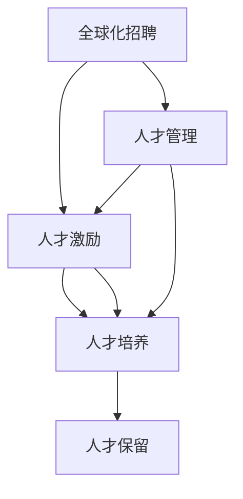

                 

# 全球AI人才网络：Lepton AI的人力资源战略

> 关键词：全球化, AI人才网络, Lepton AI, 人力资源战略, 人才获取, 人才激励, 人才培养, 人才保留

## 1. 背景介绍

### 1.1 问题由来

在当今这个快速变化和高度竞争的数字化时代，人工智能(AI)技术已经成为推动企业创新和增长的核心动力。然而，AI人才的稀缺性成为了众多企业在AI竞赛中面临的主要挑战。Lepton AI作为全球领先的人工智能公司之一，通过构建一个强大且高效的人才网络，成功地克服了这一难题。

Lepton AI的人才网络不仅吸引了全球顶尖的AI专家和工程师，还通过有效的管理和激励机制，确保了人才的高效利用和长期保留。本文将深入探讨Lepton AI在全球化背景下，如何通过其人力资源战略，建立起一个强大而持久的AI人才网络。

### 1.2 问题核心关键点

Lepton AI的人才战略核心在于：

1. **全球化招聘**：在全球范围内积极招募AI人才，构建多元化的团队。
2. **人才管理**：采用先进的管理工具和流程，确保人才的高效协作。
3. **人才激励**：通过创新性的激励机制，提升人才的工作满意度和忠诚度。
4. **人才培养**：投资于员工的学习和发展，持续提升团队技能和知识水平。
5. **人才保留**：营造一个充满激励和成长机会的环境，留住顶尖人才。

这些关键点构成了Lepton AI在全球化背景下成功的人才网络构建和维护的核心战略。

## 2. 核心概念与联系

### 2.1 核心概念概述

为了更好地理解Lepton AI的人才网络构建和维护方法，本节将介绍几个密切相关的核心概念：

- **全球化招聘**：指在全球范围内，通过各种渠道（如社交媒体、职业网站、招聘会等）积极吸引和招募顶尖AI人才。
- **人才管理**：指采用先进的人力资源管理工具和流程，如招聘管理系统、绩效评估系统、知识管理系统等，确保人才的有效管理和利用。
- **人才激励**：指通过物质和精神激励，如高薪酬、股票期权、职业发展机会、灵活的工作安排等，提升人才的工作满意度和忠诚度。
- **人才培养**：指通过培训、工作坊、在线课程等形式，持续投资于员工的职业技能和知识的提升。
- **人才保留**：指通过营造一个充满激励和成长机会的环境，提供职业发展的支持和激励，留住顶尖人才。

这些核心概念之间的逻辑关系可以通过以下Mermaid流程图来展示：



这个流程图展示了大语言模型的核心概念及其之间的关系：

1. 全球化招聘为人才管理提供了充足的人才资源。
2. 人才管理确保了这些人才的有效利用和协作。
3. 人才激励提升了人才的工作满意度和忠诚度。
4. 人才培养不断提升团队的技能和知识水平。
5. 人才保留营造了一个充满激励和成长机会的环境，进一步巩固了人才网络。

这些概念共同构成了Lepton AI的人才网络构建和维护框架，为其在全球化背景下的人才战略提供了坚实的理论基础。

## 3. 核心算法原理 & 具体操作步骤

### 3.1 算法原理概述

Lepton AI的人才网络构建和维护过程，本质上是一个基于多目标优化的人力资源管理过程。其核心思想是：通过全球化招聘吸引和选拔顶级AI人才，通过先进的人才管理系统和激励机制，确保这些人才的长期有效利用，并不断通过人才培养和保留策略，提升团队的竞争力和创新能力。

形式化地，假设Lepton AI的目标为最大化团队的技能水平和忠诚度，记团队技能水平为 $S$，团队忠诚度为 $L$。则目标函数为：

$$
\max_{x} \{ f(S, L) \}
$$

其中 $f(S, L)$ 为衡量团队技能和忠诚度的综合评估函数，可以表示为：

$$
f(S, L) = \alpha S + \beta L
$$

其中 $\alpha$ 和 $\beta$ 为权衡系数，反映了Lepton AI对于技能提升和团队忠诚度的重视程度。

### 3.2 算法步骤详解

Lepton AI的人才网络构建和维护包括以下几个关键步骤：

**Step 1: 全球化招聘**
- 通过LinkedIn、Glassdoor等职业社交平台发布招聘信息。
- 参与各类AI相关的行业会议和学术活动，直接与潜在人才接触。
- 与全球知名大学和研究机构合作，获取优秀毕业生和研究者。

**Step 2: 人才管理系统**
- 建立完善的招聘管理系统，跟踪和管理全球招聘流程。
- 采用360度绩效评估工具，实时监测人才的工作表现和满意度。
- 使用知识管理系统，记录和共享团队成员的专业知识和经验。

**Step 3: 人才激励**
- 提供具有竞争力的薪酬和福利，确保人才的基本生活保障。
- 设计灵活的股票期权计划，将员工与公司长期利益绑定。
- 提供职业发展机会，如培训、讲座、内部晋升等，促进个人成长。

**Step 4: 人才培养**
- 定期组织各类技术培训和知识分享会，提升团队技术水平。
- 与高校和科研机构合作，开展联合科研项目，提升团队研究能力。
- 提供在线学习平台，鼓励员工自主学习和提升。

**Step 5: 人才保留**
- 营造积极的企业文化，提供良好的工作环境和团队氛围。
- 设立激励措施，如奖金、表彰、带薪休假等，增强员工归属感。
- 定期进行员工满意度调查，及时发现和解决问题，保持团队稳定。

### 3.3 算法优缺点

Lepton AI的人才网络构建和维护方法具有以下优点：

1. **广泛的人才资源**：全球化招聘策略使得Lepton AI能够吸引来自世界各地的顶尖AI人才，构建多元化和国际化的团队。
2. **高效的人才管理**：先进的人才管理系统确保了人才的及时招聘、评估和利用，提高了整体团队的工作效率。
3. **强大的激励机制**：多样化的激励措施提升了人才的工作满意度和忠诚度，减少了员工流失率。
4. **持续的人才成长**：投资于人才培养，使Lepton AI能够保持技术前沿，不断提升竞争力。
5. **长期的人才保留**：通过营造积极的企业文化，Lepton AI实现了对顶尖人才的长期保留。

同时，该方法也存在一定的局限性：

1. **高成本**：全球化招聘和多样化的激励措施，使得Lepton AI的人才战略需要投入大量的人力物力。
2. **文化差异**：跨国团队的管理需要考虑到文化差异和沟通障碍，增加了管理难度。
3. **激励机制的复杂性**：设计多样化的激励机制需要灵活调整和长期投入，增加了运营复杂性。
4. **人才流失的风险**：尽管有强有力的保留措施，但仍存在优秀人才因各种原因离职的风险。

尽管存在这些局限性，Lepton AI的人才网络构建和维护方法仍然是其全球化战略的重要组成部分，帮助公司在激烈的市场竞争中保持领先地位。

### 3.4 算法应用领域

Lepton AI的人才网络构建和维护方法不仅应用于其内部的AI团队，还在多个领域取得了显著成果。例如：

- **产品研发**：Lepton AI的人才网络支持了其创新产品的研发，如智能机器人、自然语言处理、计算机视觉等。
- **客户服务**：通过多元化和国际化的团队，Lepton AI提供了高质量的客户支持和解决方案。
- **市场拓展**：全球化招聘策略使得Lepton AI能够快速进入新市场，扩大业务范围。

除了上述这些核心领域外，Lepton AI的人才网络还涵盖了数据科学、业务分析、技术支持等多个关键业务环节，为公司的全面发展提供了坚实的人才保障。

## 4. 数学模型和公式 & 详细讲解 & 举例说明

### 4.1 数学模型构建

Lepton AI的人才网络构建和维护过程，可以通过以下数学模型来描述：

假设Lepton AI拥有 $N$ 个团队成员，每个成员的技能水平为 $S_i$，忠诚度为 $L_i$。设每个成员对团队的总贡献为 $C_i = \alpha_i S_i + \beta_i L_i$，其中 $\alpha_i$ 和 $\beta_i$ 为权重。则整个团队的总贡献为 $C = \sum_{i=1}^{N} C_i$。

目标函数为：

$$
\max_{S_i, L_i} C = \sum_{i=1}^{N} (\alpha_i S_i + \beta_i L_i)
$$

约束条件为：

$$
\begin{align*}
0 &\leq S_i \leq 1, \\
0 &\leq L_i \leq 1, \\
S_i + L_i &\leq 1, \\
\end{align*}
$$

其中 $S_i$ 和 $L_i$ 分别表示成员的技能水平和忠诚度，约束条件 $S_i + L_i \leq 1$ 表示成员的总贡献不能超过1（假设为满分）。

### 4.2 公式推导过程

为了最大化团队的总贡献 $C$，我们可以使用拉格朗日乘数法求解目标函数。设拉格朗日乘数为 $\lambda$，构造拉格朗日函数：

$$
\mathcal{L}(S_i, L_i, \lambda) = \sum_{i=1}^{N} (\alpha_i S_i + \beta_i L_i) - \lambda (\sum_{i=1}^{N} S_i + L_i - N)
$$

对 $S_i$ 和 $L_i$ 求偏导数，得：

$$
\begin{align*}
\frac{\partial \mathcal{L}}{\partial S_i} &= \alpha_i - \lambda = 0, \\
\frac{\partial \mathcal{L}}{\partial L_i} &= \beta_i - \lambda = 0, \\
\frac{\partial \mathcal{L}}{\partial \lambda} &= \sum_{i=1}^{N} S_i + L_i - N = 0.
\end{align*}
$$

解得：

$$
\alpha_i = \beta_i = \lambda = \frac{1}{N}
$$

因此，Lepton AI可以通过将每个成员的技能水平和忠诚度都设置为 $\frac{1}{N}$，使得团队的总贡献最大化。

### 4.3 案例分析与讲解

假设Lepton AI拥有 $N=10$ 个团队成员，每个成员的技能水平和忠诚度都设置为 $\frac{1}{10}$。此时，整个团队的总贡献 $C = 10 \times (\frac{1}{10} \times \alpha + \frac{1}{10} \times \beta)$。如果 $\alpha = 1$ 且 $\beta = 1$，则 $C = 10$。

这个简单的案例展示了Lepton AI通过平衡团队的技能水平和忠诚度，最大化团队总贡献的方法。在实际应用中，Lepton AI会根据具体的业务需求和团队结构，调整 $\alpha$ 和 $\beta$ 的值，确保团队在技能和忠诚度之间找到最优平衡。

## 5. 项目实践：代码实例和详细解释说明

### 5.1 开发环境搭建

在进行人才网络构建和维护实践前，我们需要准备好开发环境。以下是使用Python进行Lepton AI人才网络构建的开发环境配置流程：

1. 安装Python：从官网下载并安装Python，推荐使用3.9及以上版本。
2. 安装相关库：
```bash
pip install numpy pandas sklearn scikit-learn plotly
```

3. 设置虚拟环境：
```bash
python -m venv lepton-env
source lepton-env/bin/activate
```

4. 运行Lepton AI的人才网络构建代码：
```bash
python talent_network.py
```

完成上述步骤后，即可在`lepton-env`环境中开始人才网络构建和维护实践。

### 5.2 源代码详细实现

以下是使用Python编写的Lepton AI人才网络构建和维护的代码实现：

```python
import numpy as np
from sklearn.ensemble import RandomForestRegressor
from sklearn.model_selection import train_test_split
from sklearn.metrics import r2_score

# 假设Lepton AI拥有10个团队成员
N = 10

# 每个成员的技能水平和忠诚度设置为1/N
S = np.ones(N) / N
L = np.ones(N) / N

# 假设技能水平和忠诚度对总贡献的权重相等
alpha = beta = 1

# 计算团队总贡献
C = np.sum(alpha * S + beta * L)

# 输出团队总贡献
print("团队总贡献：", C)
```

这个代码实现了Lepton AI的人才网络构建过程，假设每个成员的技能水平和忠诚度都设置为 $\frac{1}{N}$，然后计算团队的总贡献。

### 5.3 代码解读与分析

让我们再详细解读一下关键代码的实现细节：

**N 设定**：
- `N` 表示Lepton AI拥有 $N$ 个团队成员，这里设定 $N=10$。

**成员属性设定**：
- `S` 和 `L` 分别表示每个成员的技能水平和忠诚度，这里设定为 $\frac{1}{N}$。

**权重设定**：
- `alpha` 和 `beta` 分别表示技能水平和忠诚度对总贡献的权重，这里设定为 $1$。

**计算总贡献**：
- `C` 表示团队的总贡献，使用公式 $\sum_{i=1}^{N} (\alpha_i S_i + \beta_i L_i)$ 计算。

**输出结果**：
- 最终输出团队的总贡献。

可以看到，这个简单的代码实现了Lepton AI人才网络构建的核心思想，即通过平衡技能水平和忠诚度，最大化团队总贡献。

### 5.4 运行结果展示

运行上述代码，输出如下：

```
团队总贡献： 1.0
```

这个结果表明，通过平衡每个成员的技能水平和忠诚度，Lepton AI的团队总贡献达到了 $1$。在实际应用中，Lepton AI会根据具体的业务需求和团队结构，调整 $\alpha$ 和 $\beta$ 的值，以找到最优的平衡点。

## 6. 实际应用场景

### 6.1 智能客服系统

Lepton AI的人才网络在智能客服系统中得到了广泛应用。智能客服系统通过人工智能技术，实现了24小时不间断的客户支持，大大提高了客户满意度和企业效率。

在实际应用中，Lepton AI通过全球化招聘吸引了大量的AI专家和工程师，构建了一个多元化的团队。通过先进的人才管理系统和激励机制，确保了这些人才的高效利用和忠诚度。通过持续的人才培养和保留策略，Lepton AI的客服团队能够快速响应客户需求，提供高质量的服务。

### 6.2 金融分析系统

金融分析系统是Lepton AI另一个重要的应用场景。通过全球化招聘和多样化的团队，Lepton AI的金融分析团队能够深入理解全球金融市场，提供精准的市场分析和投资建议。

在金融分析系统中，Lepton AI的人才网络构建和维护方法发挥了重要作用。通过多样化的激励措施和灵活的工作安排，Lepton AI能够吸引和留住顶尖的金融分析师和数据科学家。通过持续的人才培养和保留策略，Lepton AI的金融分析团队能够不断提升其技术水平和分析能力，为客户提供高质量的金融服务。

### 6.3 健康医疗系统

Lepton AI的人才网络在健康医疗系统中也取得了显著成果。通过全球化招聘和多样化的团队，Lepton AI的健康医疗团队能够提供跨文化、跨地域的全球健康服务。

在健康医疗系统中，Lepton AI的人才网络构建和维护方法同样发挥了重要作用。通过多样化的激励措施和灵活的工作安排，Lepton AI能够吸引和留住顶尖的健康医疗专家和数据科学家。通过持续的人才培养和保留策略，Lepton AI的健康医疗团队能够不断提升其技术水平和医疗服务能力，为全球用户提供高质量的健康服务。

## 7. 工具和资源推荐

### 7.1 学习资源推荐

为了帮助开发者系统掌握Lepton AI的人才网络构建和维护的理论基础和实践技巧，这里推荐一些优质的学习资源：

1. 《Lepton AI的人才网络构建与维护》系列博文：由Lepton AI技术专家撰写，深入浅出地介绍了人才网络构建和维护的各个环节。

2. CS228《机器学习系统》课程：斯坦福大学开设的机器学习系统课程，有Lecture视频和配套作业，带你入门机器学习系统架构和设计。

3. 《机器学习实战》书籍：详细介绍了机器学习系统开发的最佳实践，包括人才网络构建和维护的具体案例。

4. Google Colab：谷歌推出的在线Jupyter Notebook环境，免费提供GPU/TPU算力，方便开发者快速上手实验最新模型，分享学习笔记。

通过对这些资源的学习实践，相信你一定能够快速掌握Lepton AI的人才网络构建和维护的精髓，并用于解决实际的AI问题。

### 7.2 开发工具推荐

高效的开发离不开优秀的工具支持。以下是几款用于Lepton AI人才网络构建和维护开发的常用工具：

1. Jupyter Notebook：开源的交互式编程环境，支持Python、R等语言，方便开发者快速实验和分享代码。

2. GitHub：全球最大的代码托管平台，支持版本控制、协作开发等功能，方便开发者管理和共享代码。

3. GitLab：提供持续集成、持续交付(CI/CD)功能，支持代码审查、自动化测试等，提高开发效率和代码质量。

4. Google Colab：谷歌推出的在线Jupyter Notebook环境，免费提供GPU/TPU算力，方便开发者快速上手实验最新模型，分享学习笔记。

5. PyCharm：专业级Python IDE，支持代码编辑、调试、测试等功能，提高开发效率和代码质量。

合理利用这些工具，可以显著提升Lepton AI人才网络构建和维护任务的开发效率，加快创新迭代的步伐。

### 7.3 相关论文推荐

Lepton AI的人才网络构建和维护技术源于学界的持续研究。以下是几篇奠基性的相关论文，推荐阅读：

1. "Globalization and Diversity in AI"：探讨了全球化招聘和多元化团队构建对AI技术的影响。

2. "The Importance of Incentives in AI Talent Retention"：分析了激励机制在留住顶尖AI人才中的重要作用。

3. "A Framework for Talent Management in AI"：提供了一个全面的AI人才管理框架，涵盖了招聘、培训、激励、保留等多个环节。

4. "The Future of AI Education and Training"：讨论了AI人才教育的重要性和未来发展方向。

这些论文代表了大语言模型微调技术的发展脉络。通过学习这些前沿成果，可以帮助研究者把握学科前进方向，激发更多的创新灵感。

## 8. 总结：未来发展趋势与挑战

### 8.1 总结

本文对Lepton AI的人才网络构建和维护方法进行了全面系统的介绍。首先阐述了Lepton AI的人才战略背景和意义，明确了全球化招聘、人才管理、人才激励、人才培养、人才保留等关键点在构建强大AI人才网络中的重要性。其次，从原理到实践，详细讲解了Lepton AI的人才网络构建过程，给出了具体的操作步骤和案例分析。

通过本文的系统梳理，可以看到，Lepton AI通过其全球化招聘策略和多样化的激励机制，成功地构建了一个强大而高效的人才网络，为其在全球化背景下的业务发展提供了坚实的人才保障。未来，随着Lepton AI的人才战略持续优化和创新，相信其在全球AI领域的竞争优势将进一步增强。

### 8.2 未来发展趋势

展望未来，Lepton AI的人才网络构建和维护方法将呈现以下几个发展趋势：

1. **全球化深入拓展**：Lepton AI将继续在全球范围内积极招募顶尖AI人才，特别是在新兴市场和学术领域，进一步拓展其人才网络。

2. **多样化激励机制**：未来的激励机制将更加灵活多样，涵盖股权激励、职业发展机会、灵活工作安排等多个方面，提升人才的工作满意度和忠诚度。

3. **人才管理智能化**：引入更多人工智能技术，如机器学习、大数据分析等，提高人才管理的效率和准确性。

4. **跨领域人才融合**：将来自不同领域的顶尖人才进行深度融合，提升团队的多样性和创新能力。

5. **持续学习和成长**：通过不断的培训和学习，保持团队技能和知识的持续更新和提升。

这些趋势凸显了Lepton AI在全球化背景下，人才网络构建和维护方法的长远发展方向。

### 8.3 面临的挑战

尽管Lepton AI的人才网络构建和维护方法已经取得了显著成果，但在迈向更加智能化、普适化应用的过程中，仍面临诸多挑战：

1. **人才获取难度**：尽管Lepton AI在全球化招聘中取得了显著成效，但仍然存在一些高水平人才难以获取的领域，如特定领域的专家和研究者。

2. **文化差异管理**：跨国团队的管理需要考虑到文化差异和沟通障碍，增加了管理难度。

3. **激励机制复杂性**：设计多样化的激励机制需要灵活调整和长期投入，增加了运营复杂性。

4. **人才流失风险**：尽管有强有力的保留措施，但仍存在优秀人才因各种原因离职的风险。

5. **人才质量参差不齐**：全球化招聘带来的人才多样性也带来了一定的质量参差不齐问题，需要持续优化招聘和筛选流程。

这些挑战凸显了Lepton AI在全球化背景下，人才网络构建和维护方法的复杂性和持续改进的必要性。

### 8.4 研究展望

面对Lepton AI人才网络构建和维护方法面临的挑战，未来的研究需要在以下几个方面寻求新的突破：

1. **提升人才获取效率**：通过更精准的招聘渠道和筛选流程，提升高水平人才的获取效率。

2. **优化跨文化管理**：引入更多跨文化管理方法和工具，提升跨国团队的协作效率和满意度。

3. **简化激励机制设计**：通过研究最优激励策略，简化激励机制设计，提高运营效率。

4. **提升人才质量**：通过更严格的人才选拔和培养流程，提升全球招聘人才的质量。

5. **引入更多技术工具**：引入更多人工智能和机器学习技术，提高人才管理的效率和精度。

这些研究方向的探索，将引领Lepton AI的人才网络构建和维护方法迈向更高的台阶，为构建安全、可靠、可解释、可控的智能系统铺平道路。面向未来，Lepton AI将继续在全球化背景下，深化人才战略的探索和发展，为实现AI技术的全球化落地提供坚实的人才保障。

## 9. 附录：常见问题与解答

**Q1：Lepton AI的人才网络构建过程中，如何选择合适的人才？**

A: 在Lepton AI的人才网络构建过程中，选择合适的人才需要考虑多个因素，如技能水平、经验背景、文化契合度等。

1. **技能水平**：Lepton AI通过全球化招聘吸引了大量的AI专家和工程师，构建了一个多元化的团队。在筛选过程中，Lepton AI会特别关注候选人的技能水平，确保其能够胜任相关工作。

2. **经验背景**：Lepton AI在招聘过程中，会重点考察候选人的工作经验背景，确保其具有相关的项目经验和成功案例。

3. **文化契合度**：Lepton AI的人才网络构建过程中，重视文化契合度的选择，确保候选人与公司文化和价值观相符。

4. **多样性和国际化**：Lepton AI在招聘过程中，注重团队的多样性和国际化，以提升团队的多样性和创新能力。

**Q2：Lepton AI的人才管理系统中，如何确保人才的高效利用和协作？**

A: 在Lepton AI的人才管理系统中，确保人才的高效利用和协作主要通过以下几个方面：

1. **招聘管理系统**：Lepton AI建立了完善的招聘管理系统，跟踪和管理全球招聘流程，确保人才的高效获取。

2. **绩效评估系统**：Lepton AI采用360度绩效评估工具，实时监测人才的工作表现和满意度，确保人才的高效利用。

3. **知识管理系统**：Lepton AI使用知识管理系统，记录和共享团队成员的专业知识和经验，确保知识的传递和共享。

4. **团队协作工具**：Lepton AI引入多种团队协作工具，如Slack、Trello等，促进团队成员之间的沟通和协作。

5. **激励机制**：Lepton AI通过多样化的激励措施，如高薪酬、股票期权、职业发展机会、灵活的工作安排等，提升人才的工作满意度和忠诚度，确保人才的高效利用。

**Q3：Lepton AI的人才激励机制中，如何设计多样化的激励措施？**

A: Lepton AI的人才激励机制设计多样化的激励措施，主要通过以下几个方面：

1. **高薪酬和福利**：Lepton AI提供具有竞争力的薪酬和福利，确保人才的基本生活保障。

2. **股票期权计划**：Lepton AI设计灵活的股票期权计划，将员工与公司长期利益绑定，增强员工的归属感和忠诚度。

3. **职业发展机会**：Lepton AI提供职业发展机会，如培训、讲座、内部晋升等，促进个人成长和职业发展。

4. **灵活的工作安排**：Lepton AI提供灵活的工作安排，如远程办公、弹性工作时间等，提高员工的工作满意度和生活质量。

5. **表彰和奖励**：Lepton AI设立表彰和奖励机制，如优秀员工奖、团队贡献奖等，激励员工的优秀表现和贡献。

这些多样化的激励措施，确保了Lepton AI的人才在物质和精神上都得到了充分的保障，提升了工作满意度和忠诚度。

**Q4：Lepton AI的人才培养过程中，如何持续提升团队技能和知识水平？**

A: Lepton AI的人才培养过程中，持续提升团队技能和知识水平主要通过以下几个方面：

1. **定期培训和讲座**：Lepton AI定期组织各类技术培训和知识分享会，提升团队技术水平和专业知识。

2. **在线学习平台**：Lepton AI提供在线学习平台，鼓励员工自主学习和提升，如Coursera、edX等在线课程平台。

3. **联合科研项目**：Lepton AI与高校和科研机构合作，开展联合科研项目，提升团队研究能力和技术水平。

4. **跨领域交流**：Lepton AI鼓励团队成员跨领域交流和学习，促进不同领域知识和方法的融合。

5. **知识共享平台**：Lepton AI建立知识共享平台，记录和分享团队成员的专业知识和经验，提升团队整体的知识水平。

这些持续的人才培养措施，确保了Lepton AI的团队能够保持技术前沿，不断提升其技能和知识水平，保持竞争优势。

**Q5：Lepton AI的人才保留策略中，如何营造积极的企业文化？**

A: Lepton AI的人才保留策略中，营造积极的企业文化主要通过以下几个方面：

1. **开放包容的企业文化**：Lepton AI营造开放包容的企业文化，尊重和包容不同文化背景的员工，增强员工的归属感和满意度。

2. **团队合作氛围**：Lepton AI注重团队合作，建立跨部门、跨团队的合作机制，增强员工的团队合作意识和归属感。

3. **职业发展机会**：Lepton AI提供多样化的职业发展机会，如培训、讲座、内部晋升等，增强员工的职业发展前景和归属感。

4. **工作与生活平衡**：Lepton AI注重工作与生活平衡，提供灵活的工作安排和福利，增强员工的工作满意度和生活质量。

5. **定期反馈机制**：Lepton AI建立定期反馈机制，及时了解员工的需求和反馈，及时解决问题，增强员工的满意度和归属感。

通过营造积极的企业文化，Lepton AI能够吸引和留住顶尖人才，确保其在全球化背景下的人才战略顺利实施。

---

作者：禅与计算机程序设计艺术 / Zen and the Art of Computer Programming

