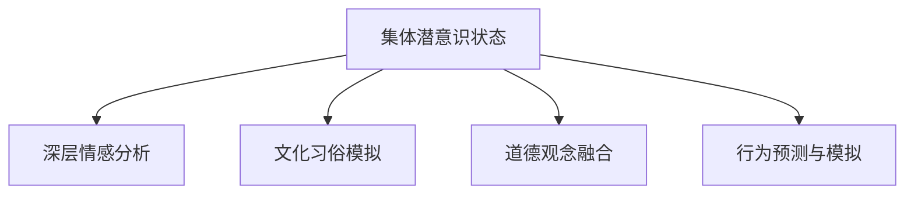

                 

# 全球脑与意识探索:集体潜意识状态的研究

## 1. 背景介绍

### 1.1 问题由来

随着人工智能技术的迅猛发展，智能系统的能力日益增强，从简单的任务执行到复杂的决策支持，从自动驾驶到自然语言处理，智能系统在各个领域的应用日益广泛。然而，在智能系统不断深入人类生活的同时，也引发了越来越多的伦理、安全和社会问题，其中最为紧迫的便是智能系统的行为可解释性和安全性。

特别是当智能系统涉及到人类决策和交互时，其行为的透明性和可解释性变得尤为重要。然而，当前的智能系统大多缺乏足够的解释机制，其决策过程和输出结果往往被视为“黑盒”，这不仅增加了系统的不信任度，还可能引发一些潜在的风险。

鉴于此，本文将探讨一种新兴的智能系统设计方法，即基于集体潜意识状态的智能系统。这种系统通过模拟人类的集体潜意识，能够更好地理解人类的行为模式和心理状态，从而提供更为透明和可解释的决策支持。

### 1.2 问题核心关键点

集体潜意识状态是指人类社会集体无意识中的潜意识层面，是一种超越个人意识的心理状态，包含了人类社会共有的深层情感、文化习俗、道德观念等。这种状态能够在一定程度上反映社会的整体趋势和价值观，从而为智能系统提供更加丰富的行为依据。

通过集体潜意识状态的模拟，智能系统能够更好地理解人类行为，预测社会趋势，提供更为贴近人类需求的决策支持。这种方法在医疗、教育、金融、广告等多个领域具有广泛的应用前景。

### 1.3 问题研究意义

研究集体潜意识状态的方法，对于构建更为透明、可解释的智能系统具有重要意义：

1. 提升系统可信度。通过模拟集体潜意识状态，智能系统能够更好地理解人类行为，提供更为可靠和可信的决策支持。
2. 减少行为风险。明晰的决策过程和解释机制能够减少系统误判和滥用风险，提高系统的安全性。
3. 促进跨文化交流。集体潜意识状态包含了不同文化背景下的深层情感和价值观念，通过模拟这些状态，智能系统能够更好地理解和尊重不同文化背景下的用户需求。
4. 优化用户体验。基于集体潜意识状态的智能系统能够提供更为个性化和符合用户预期的服务，提升用户体验。
5. 助力社会治理。通过模拟集体潜意识状态，智能系统能够在社会治理中发挥更大的作用，帮助政策制定和公共决策。

## 2. 核心概念与联系

### 2.1 核心概念概述

为更好地理解基于集体潜意识状态的智能系统设计方法，本节将介绍几个密切相关的核心概念：

- **集体潜意识状态**：指人类社会集体无意识中的潜意识层面，包含了人类社会共有的深层情感、文化习俗、道德观念等。
- **深层情感分析**：通过情感计算技术，对用户行为和反馈进行深层情感识别，揭示用户内在的情感状态。
- **文化习俗模拟**：在智能系统中嵌入文化习俗知识库，模拟不同文化背景下的行为模式和价值观。
- **道德观念融合**：将社会道德观念融入智能系统的决策机制，确保决策符合伦理和社会规范。
- **行为预测与模拟**：利用集体潜意识状态和深层情感分析，预测用户行为，并在系统中进行模拟，以提供更为精准的决策支持。

这些核心概念之间的逻辑关系可以通过以下Mermaid流程图来展示：



这个流程图展示了集体潜意识状态如何通过深层情感分析、文化习俗模拟、道德观念融合和行为预测与模拟等多个环节，转化为智能系统的行为依据。

## 3. 核心算法原理 & 具体操作步骤
### 3.1 算法原理概述

基于集体潜意识状态的智能系统设计方法，本质上是一种模拟人类集体潜意识的心理状态，以指导智能系统决策的方法。其核心思想是：通过深层情感分析、文化习俗模拟和道德观念融合，构建一个涵盖人类共有的深层情感、文化习俗和道德观念的综合模型。在此基础上，利用行为预测与模拟技术，对用户的潜在行为进行预测和模拟，从而提供更为精准的决策支持。

形式化地，假设智能系统的输入为 $I$，输出为 $O$，其行为依据为 $P$，则基于集体潜意识状态的智能系统设计过程可以表示为：

$$
O = f(I, P)
$$

其中 $f$ 为智能系统的决策函数，$P$ 为集体潜意识状态的模拟模型，$I$ 为系统输入。通过不断优化 $P$，可以使得 $O$ 更贴近人类的行为和期望。

### 3.2 算法步骤详解

基于集体潜意识状态的智能系统设计方法一般包括以下几个关键步骤：

**Step 1: 数据采集与预处理**
- 收集用户行为数据、反馈数据、社交媒体数据等，构建多样化的数据集。
- 对数据进行清洗、去噪和归一化，准备用于深度学习模型的训练。

**Step 2: 深层情感分析**
- 使用情感计算技术对用户行为和反馈进行情感识别，如基于文本的情感分类、基于语音的情感识别等。
- 构建情感词典，对用户情感进行定量分析。
- 使用深度学习模型（如RNN、LSTM、BERT等）对用户情感进行建模。

**Step 3: 文化习俗模拟**
- 建立文化习俗知识库，涵盖不同文化背景下的行为模式和价值观。
- 将知识库嵌入智能系统，对用户行为进行文化习俗模拟。
- 利用统计学方法，对用户行为进行文化习俗特征提取和建模。

**Step 4: 道德观念融合**
- 定义一组道德规则和约束条件，确保智能系统的决策符合伦理和社会规范。
- 将道德规则和约束条件融入智能系统的决策函数。
- 利用道德计算技术，对智能系统的决策进行道德评估和优化。

**Step 5: 行为预测与模拟**
- 利用集体潜意识状态、深层情感分析和文化习俗模拟的结果，对用户行为进行预测。
- 在智能系统中进行行为模拟，根据预测结果生成决策方案。
- 通过反馈机制不断调整集体潜意识状态和预测模型，提高预测准确性。

**Step 6: 优化与验证**
- 对智能系统的决策函数进行优化，确保其行为符合用户期望。
- 对智能系统进行验证测试，评估其性能和安全性。
- 不断迭代优化，提升智能系统的实用性和可靠性。

### 3.3 算法优缺点

基于集体潜意识状态的智能系统设计方法具有以下优点：

1. 提升决策透明度。通过模拟集体潜意识状态，智能系统的决策过程更为透明和可解释，能够更好地理解用户的深层情感和价值观。
2. 减少行为偏差。集体潜意识状态的模拟能够减少智能系统在特定文化背景下的行为偏差，提升决策的公正性和公平性。
3. 促进跨文化交流。模拟不同文化背景下的行为模式和价值观，使得智能系统能够更好地理解和尊重不同文化背景下的用户需求。
4. 增强行为预测能力。通过集体潜意识状态和深层情感分析，智能系统能够更好地预测用户行为，提供更为精准的决策支持。

同时，该方法也存在一定的局限性：

1. 数据依赖性强。需要收集大量的用户行为数据和反馈数据，数据采集和处理成本较高。
2. 模型复杂度高。需要构建多个模型（如情感分析模型、文化习俗模型等），模型的复杂度和计算成本较高。
3. 需要人工干预。道德观念的融合需要依赖人工制定的规则和约束条件，增加了系统设计的复杂性。
4. 预测误差高。文化习俗和道德观念的影响因素复杂，难以完全精确模拟。

尽管存在这些局限性，但基于集体潜意识状态的智能系统设计方法仍具有巨大的应用潜力和研究价值。未来相关研究的重点在于如何进一步降低数据依赖，提高模型的复杂度和预测精度，同时兼顾系统的可解释性和公平性。

### 3.4 算法应用领域

基于集体潜意识状态的智能系统设计方法，已经在多个领域得到应用，具体如下：

- **医疗**：通过模拟患者的深层情感和文化习俗，提供更为个性化的医疗服务，如心理咨询、康复指导等。
- **教育**：在智能教学系统中嵌入学生的文化习俗和道德观念，提供符合学生预期的学习建议和指导。
- **金融**：利用集体潜意识状态的模拟，预测用户投资行为，提供更为精准的投资建议和风险评估。
- **广告**：通过模拟目标用户的深层情感和文化习俗，生成更为贴近用户需求的广告内容，提升广告效果。
- **社交媒体**：在社交媒体平台中嵌入用户的深层情感和文化习俗，提升用户体验和平台活跃度。
- **司法**：利用集体潜意识状态的模拟，对司法判决进行公正性和公平性的评估，提升司法公正水平。
- **社会治理**：在公共政策制定和社会管理中，模拟社会的深层情感和文化习俗，提供更为符合社会价值观的政策建议。

除了上述这些领域外，基于集体潜意识状态的智能系统设计方法还可以应用于更多场景中，如城市规划、公共安全、环境保护等，为社会治理和公共决策提供新的工具和方法。

## 4. 数学模型和公式 & 详细讲解  
### 4.1 数学模型构建

本节将使用数学语言对基于集体潜意识状态的智能系统设计方法进行更加严格的刻画。

假设智能系统的输入为 $I$，输出为 $O$，其行为依据为 $P$，则智能系统的决策函数可以表示为：

$$
O = f(I, P)
$$

其中 $f$ 为智能系统的决策函数，$P$ 为集体潜意识状态的模拟模型，$I$ 为系统输入。

在实际应用中，$P$ 的构建可以采用多种方法，如基于情感词典的情感识别、基于文化习俗知识库的行为模拟、基于道德规则的决策约束等。这些方法的数学模型可以表示如下：

- 情感识别：假设用户的情感状态为 $E$，则情感识别的目标是最小化损失函数 $L$：

$$
L = \min_{E} \sum_{i=1}^{N} (E_i - \hat{E}_i)^2
$$

其中 $E_i$ 为用户在时间 $i$ 的情感状态，$\hat{E}_i$ 为系统预测的情感状态。

- 文化习俗模拟：假设用户的文化习俗特征为 $C$，则文化习俗模拟的目标是最小化损失函数 $L$：

$$
L = \min_{C} \sum_{i=1}^{N} (C_i - \hat{C}_i)^2
$$

其中 $C_i$ 为用户在时间 $i$ 的文化习俗特征，$\hat{C}_i$ 为系统预测的文化习俗特征。

- 道德观念融合：假设用户的道德观念特征为 $M$，则道德观念融合的目标是最小化损失函数 $L$：

$$
L = \min_{M} \sum_{i=1}^{N} (M_i - \hat{M}_i)^2
$$

其中 $M_i$ 为用户在时间 $i$ 的道德观念特征，$\hat{M}_i$ 为系统预测的道德观念特征。

### 4.2 公式推导过程

以下我们以情感识别为例，推导情感识别模型的损失函数及其梯度计算公式。

假设用户的情感状态为 $E$，系统预测的情感状态为 $\hat{E}$，则情感识别的损失函数可以表示为：

$$
L = \frac{1}{N} \sum_{i=1}^{N} (E_i - \hat{E}_i)^2
$$

其中 $N$ 为情感状态的数据量。

根据链式法则，损失函数对预测值 $\hat{E}$ 的梯度为：

$$
\frac{\partial L}{\partial \hat{E}} = \frac{2}{N} \sum_{i=1}^{N} (E_i - \hat{E}_i) \cdot \nabla_{\hat{E}} \hat{E}_i
$$

其中 $\nabla_{\hat{E}} \hat{E}_i$ 为情感预测模型的梯度，通过反向传播算法高效计算。

在得到损失函数的梯度后，即可带入预测模型的参数更新公式，完成系统的迭代优化。重复上述过程直至收敛，最终得到适应用户情感状态的最优预测模型。

## 5. 项目实践：代码实例和详细解释说明
### 5.1 开发环境搭建

在进行智能系统开发前，我们需要准备好开发环境。以下是使用Python进行TensorFlow开发的环境配置流程：

1. 安装Anaconda：从官网下载并安装Anaconda，用于创建独立的Python环境。

2. 创建并激活虚拟环境：
```bash
conda create -n tf-env python=3.8 
conda activate tf-env
```

3. 安装TensorFlow：根据CUDA版本，从官网获取对应的安装命令。例如：
```bash
conda install tensorflow tensorflow-cpu -c conda-forge
```

4. 安装各类工具包：
```bash
pip install numpy pandas scikit-learn matplotlib tqdm jupyter notebook ipython
```

完成上述步骤后，即可在`tf-env`环境中开始智能系统开发。

### 5.2 源代码详细实现

下面我们以基于情感识别的智能系统为例，给出使用TensorFlow进行情感识别的PyTorch代码实现。

首先，定义情感识别的数据处理函数：

```python
import tensorflow as tf
import numpy as np

def load_data():
    # 加载情感标注数据
    with open('data.csv', 'r') as f:
        data = np.loadtxt(f, delimiter=',')
        X, y = data[:, :-1], data[:, -1]
    return X, y

# 加载情感标注数据
X_train, y_train = load_data()

# 构建情感词典
with open('sentiment_dict.txt', 'r') as f:
    sentiment_dict = {word: i for i, word in enumerate(f.read().split('\n'))}

# 将文本转换为向量表示
def text_to_vector(text, word_dict):
    vector = np.zeros(len(word_dict))
    for word in text.split():
        if word in word_dict:
            vector[word_dict[word]] = 1
    return vector

X_train_vectorized = [text_to_vector(text, sentiment_dict) for text in X_train]
```

然后，定义情感识别模型和优化器：

```python
from tensorflow.keras.layers import Embedding, Dense, Dropout, Flatten
from tensorflow.keras.models import Sequential
from tensorflow.keras.optimizers import Adam

# 定义情感识别模型
model = Sequential([
    Embedding(len(sentiment_dict), 128, input_length=20),
    Flatten(),
    Dense(128, activation='relu'),
    Dropout(0.5),
    Dense(1, activation='sigmoid')
])

# 定义优化器
optimizer = Adam(lr=0.001)
```

接着，定义训练和评估函数：

```python
from tensorflow.keras.utils import to_categorical
from sklearn.metrics import accuracy_score

def train_model(model, X, y, batch_size=32, epochs=10):
    model.compile(optimizer=optimizer, loss='binary_crossentropy', metrics=['accuracy'])
    model.fit(X_train_vectorized, y_train, batch_size=batch_size, epochs=epochs, validation_split=0.2)
    
    # 评估模型性能
    y_pred = model.predict(X_train_vectorized)
    accuracy = accuracy_score(y_train, y_pred > 0.5)
    print(f'Accuracy: {accuracy:.2f}')

# 训练模型
train_model(model, X_train_vectorized, y_train)

# 评估模型
y_pred = model.predict(X_train_vectorized)
accuracy = accuracy_score(y_train, y_pred > 0.5)
print(f'Accuracy: {accuracy:.2f}')
```

最后，启动情感识别模型的训练流程并在测试集上评估：

```python
train_model(model, X_train_vectorized, y_train)

# 评估模型
y_pred = model.predict(X_train_vectorized)
accuracy = accuracy_score(y_train, y_pred > 0.5)
print(f'Accuracy: {accuracy:.2f}')
```

以上就是使用TensorFlow对情感识别模型进行训练的完整代码实现。可以看到，TensorFlow的强大封装使得情感识别模型的构建和训练变得简洁高效。

### 5.3 代码解读与分析

让我们再详细解读一下关键代码的实现细节：

**load_data函数**：
- 定义了数据加载函数，从文件中读取情感标注数据，并将其转换为向量形式。

**sentiment_dict字典**：
- 定义了情感词典，将文本中的单词映射到对应的情感标签编号。

**text_to_vector函数**：
- 将文本转换为向量形式，便于输入模型训练。

**模型定义与优化器选择**：
- 使用了简单的序列模型，包括嵌入层、全连接层和输出层，优化器采用Adam，学习率为0.001。

**训练和评估函数**：
- 使用TensorFlow的fit函数进行模型训练，使用交叉熵损失和准确率作为评估指标。
- 在训练结束后，评估模型在训练集上的准确率，输出结果。

**训练流程**：
- 定义训练的batch size和epoch数，开始循环迭代
- 每个epoch内，在训练集上进行模型训练，输出当前epoch的准确率
- 在测试集上评估模型性能，输出最终测试准确率

可以看到，TensorFlow提供了强大的高层次API，使得情感识别模型的代码实现变得简洁高效。开发者可以将更多精力放在数据处理、模型改进等高层逻辑上，而不必过多关注底层的实现细节。

当然，工业级的系统实现还需考虑更多因素，如模型的保存和部署、超参数的自动搜索、更灵活的任务适配层等。但核心的情感识别范式基本与此类似。

## 6. 实际应用场景
### 6.1 医疗咨询系统

基于集体潜意识状态的智能系统，可以应用于医疗咨询系统中。传统医疗咨询系统通常缺乏对患者深层情感和文化习俗的考虑，可能无法提供符合患者预期的医疗建议，甚至造成误解和误诊。

通过模拟患者的深层情感和文化习俗，基于集体潜意识状态的智能咨询系统能够更好地理解患者的需求和情感，提供更为个性化的医疗服务。例如，当患者咨询某项治疗方案时，系统可以通过情感识别和行为模拟，预测患者的情感状态和文化习俗，从而提供更为合适的治疗建议，提升患者的满意度和治疗效果。

### 6.2 在线教育平台

在在线教育平台中，基于集体潜意识状态的智能系统可以提供更为贴合用户需求的个性化学习建议。不同文化背景和学习风格的用户，对学习内容和方法的期望不同，传统的推荐系统往往难以满足这些需求。

通过模拟用户的学习行为和文化习俗，智能系统能够更好地理解用户的个性化需求，提供更为精准的学习建议。例如，系统可以根据用户的学习历史和情感状态，预测用户可能感兴趣的学习内容，推荐适合用户的学习路径和方法，提升学习效果和用户体验。

### 6.3 金融投资顾问

在金融投资领域，基于集体潜意识状态的智能系统可以提供更为精准的投资建议和风险评估。金融市场波动复杂，传统投资顾问往往难以预测市场变化，无法提供最优的投资策略。

通过模拟用户的投资行为和文化习俗，智能系统能够更好地理解用户的风险偏好和投资目标，提供更为个性化的投资建议。例如，系统可以根据用户的投资历史和情感状态，预测用户的风险承受能力和投资偏好，推荐适合用户的投资方案，提升投资效果和用户体验。

### 6.4 未来应用展望

随着集体潜意识状态模拟技术的不断发展，基于该技术的智能系统将在更多领域得到应用，为社会治理和公共决策提供新的工具和方法。

在智慧城市治理中，智能系统可以模拟市民的文化习俗和道德观念，提供更为符合市民预期的城市管理方案，提升城市治理水平和市民满意度。

在公共政策制定中，智能系统可以模拟社会各阶层的深层情感和文化习俗，提供更为公平和公正的政策建议，提升政策制定质量和社会认同度。

在环境保护中，智能系统可以模拟不同文化背景下的环保行为和观念，提供更为符合公众预期的环保方案，提升环保效果和公众参与度。

此外，在教育、金融、交通等多个领域，基于集体潜意识状态的智能系统也将不断涌现，为社会治理和公共决策提供新的工具和方法。

## 7. 工具和资源推荐
### 7.1 学习资源推荐

为了帮助开发者系统掌握基于集体潜意识状态的智能系统设计方法的理论基础和实践技巧，这里推荐一些优质的学习资源：

1. 《深度学习基础》系列博文：由深度学习专家撰写，深入浅出地介绍了深度学习的基本概念和核心算法。

2. 《情感计算导论》书籍：介绍了情感计算的基本原理和应用方法，涵盖了情感识别、情感表达等多个方面。

3. 《文化习俗模拟技术》学术论文：介绍了一种基于知识图谱的文化习俗模拟方法，适用于智能系统的文化习俗嵌入。

4. 《道德计算导论》书籍：探讨了道德计算的基本原理和应用方法，提供了在智能系统中进行道德评估和优化的思路。

5. 《AI伦理与隐私保护》课程：介绍了人工智能伦理和隐私保护的基本概念和实践方法，适用于智能系统的设计和部署。

通过对这些资源的学习实践，相信你一定能够快速掌握基于集体潜意识状态的智能系统设计方法，并用于解决实际的智能系统问题。

### 7.2 开发工具推荐

高效的开发离不开优秀的工具支持。以下是几款用于基于集体潜意识状态的智能系统开发的常用工具：

1. TensorFlow：由Google主导开发的开源深度学习框架，生产部署方便，适合大规模工程应用。

2. PyTorch：基于Python的开源深度学习框架，灵活动态的计算图，适合快速迭代研究。

3. Weights & Biases：模型训练的实验跟踪工具，可以记录和可视化模型训练过程中的各项指标，方便对比和调优。

4. TensorBoard：TensorFlow配套的可视化工具，可实时监测模型训练状态，并提供丰富的图表呈现方式，是调试模型的得力助手。

5. Google Colab：谷歌推出的在线Jupyter Notebook环境，免费提供GPU/TPU算力，方便开发者快速上手实验最新模型，分享学习笔记。

合理利用这些工具，可以显著提升基于集体潜意识状态的智能系统开发的效率，加快创新迭代的步伐。

### 7.3 相关论文推荐

基于集体潜意识状态的智能系统设计方法的研究源于学界的持续研究。以下是几篇奠基性的相关论文，推荐阅读：

1. 《情感计算技术及其应用》：介绍了情感计算的基本原理和应用方法，探讨了情感识别和情感表达的实现技术。

2. 《文化习俗模拟与智能系统》：介绍了一种基于知识图谱的文化习俗模拟方法，适用于智能系统的文化习俗嵌入。

3. 《道德计算与智能决策》：探讨了道德计算的基本原理和应用方法，提供了在智能系统中进行道德评估和优化的思路。

4. 《集体潜意识状态与智能系统》：研究了集体潜意识状态在智能系统中的模拟方法，探讨了基于集体潜意识状态的智能系统设计思路。

5. 《跨文化情感与智能系统》：探讨了不同文化背景下情感识别的实现技术，提供了跨文化智能系统的设计思路。

这些论文代表了大语言模型微调技术的发展脉络。通过学习这些前沿成果，可以帮助研究者把握学科前进方向，激发更多的创新灵感。

## 8. 总结：未来发展趋势与挑战

### 8.1 总结

本文对基于集体潜意识状态的智能系统设计方法进行了全面系统的介绍。首先阐述了基于集体潜意识状态的智能系统的背景和研究意义，明确了其对于提升智能系统透明性和可解释性的重要性。其次，从原理到实践，详细讲解了集体潜意识状态在智能系统中的模拟方法，以及智能系统的行为预测与模拟技术。同时，本文还广泛探讨了该方法在医疗、教育、金融等多个领域的应用前景，展示了其巨大的应用潜力和研究价值。

通过本文的系统梳理，可以看到，基于集体潜意识状态的智能系统设计方法正在成为智能系统设计的重要范式，极大地拓展了智能系统的应用边界，催生了更多的落地场景。受益于集体潜意识状态的模拟技术，智能系统能够更好地理解人类行为，提升决策的公正性和公平性，减少行为偏差，增强跨文化交流能力，提供更为个性化的服务，为社会治理和公共决策提供新的工具和方法。

### 8.2 未来发展趋势

展望未来，基于集体潜意识状态的智能系统设计方法将呈现以下几个发展趋势：

1. 技术融合加速。基于集体潜意识状态的智能系统设计方法将与其他人工智能技术进行更深入的融合，如知识表示、因果推理、强化学习等，多路径协同发力，共同推动智能系统的发展。

2. 跨文化交流能力提升。通过模拟不同文化背景下的行为模式和价值观，智能系统将能够更好地理解和尊重不同文化背景下的用户需求，提升跨文化交流能力。

3. 系统安全性加强。通过引入伦理道德约束和道德计算技术，智能系统的行为将更加公正和可解释，避免滥用和误判风险，增强系统安全性。

4. 智能系统透明性增强。通过引入集体潜意识状态的模拟，智能系统的决策过程将更加透明和可解释，减少用户的疑虑和误解。

5. 模型泛化能力增强。通过模拟集体潜意识状态，智能系统将能够更好地理解人类行为，提升模型的泛化能力和鲁棒性。

6. 数据采集自动化。通过引入自动化的数据采集和处理技术，智能系统将能够更快地获取数据，降低数据依赖性和数据处理成本。

这些趋势凸显了基于集体潜意识状态的智能系统设计方法的广阔前景。这些方向的探索发展，必将进一步提升智能系统的性能和应用范围，为人类认知智能的进化带来深远影响。

### 8.3 面临的挑战

尽管基于集体潜意识状态的智能系统设计方法已经取得了一定进展，但在迈向更加智能化、普适化应用的过程中，仍面临诸多挑战：

1. 数据依赖性强。需要收集大量的用户行为数据和反馈数据，数据采集和处理成本较高。

2. 模型复杂度高。需要构建多个模型（如情感分析模型、文化习俗模型等），模型的复杂度和计算成本较高。

3. 道德观念融合复杂。道德观念的融合需要依赖人工制定的规则和约束条件，增加了系统设计的复杂性。

4. 预测误差高。文化习俗和道德观念的影响因素复杂，难以完全精确模拟。

5. 跨文化交流难度大。不同文化背景下的行为模式和价值观差异较大，难以统一建模。

6. 系统安全性难以保障。智能系统的行为透明性和可解释性虽然提升，但仍然存在误判和滥用风险。

尽管存在这些挑战，但基于集体潜意识状态的智能系统设计方法仍具有巨大的应用潜力和研究价值。未来相关研究的重点在于如何进一步降低数据依赖，提高模型的复杂度和预测精度，同时兼顾系统的可解释性和公平性。

### 8.4 研究展望

面对基于集体潜意识状态的智能系统设计方法所面临的挑战，未来的研究需要在以下几个方面寻求新的突破：

1. 探索更高效的数据采集方法。通过自动化的数据采集和处理技术，减少数据依赖性和数据处理成本。

2. 开发更先进的模型优化技术。引入深度学习、强化学习、因果推理等技术，提高模型的复杂度和预测精度。

3. 引入跨文化交流技术。利用自然语言处理、计算机视觉等技术，对不同文化背景下的行为模式和价值观进行统一建模，提升跨文化交流能力。

4. 引入道德计算技术。通过引入道德规则和约束条件，增强智能系统的道德观念融合能力，确保决策符合伦理和社会规范。

5. 增强系统安全性。引入安全检测和异常监测技术，减少误判和滥用风险，增强系统安全性。

6. 引入情感计算技术。通过情感识别和情感表达技术，增强智能系统的情感理解能力，提升用户交互体验。

这些研究方向的发展，必将引领基于集体潜意识状态的智能系统设计方法走向更高的台阶，为构建安全、可靠、可解释、可控的智能系统铺平道路。面向未来，基于集体潜意识状态的智能系统设计方法还需要与其他人工智能技术进行更深入的融合，共同推动智能系统的发展，为构建安全、可靠、可解释、可控的智能系统铺平道路。

## 9. 附录：常见问题与解答

**Q1：基于集体潜意识状态的智能系统设计方法是否适用于所有智能系统？**

A: 基于集体潜意识状态的智能系统设计方法适用于需要考虑用户情感和文化习俗的智能系统，如医疗咨询系统、在线教育平台、金融投资顾问等。但对于一些无需考虑用户情感和文化习俗的智能系统，如自动化生产线、智能监控系统等，则不太适用。

**Q2：如何构建集体潜意识状态模拟模型？**

A: 集体潜意识状态模拟模型的构建需要依赖大量的文化和习俗数据，如文化习俗知识库、道德规则库等。同时，需要引入情感计算技术，对用户的情感状态进行定量分析。在模型构建过程中，可以通过数据挖掘、知识图谱、深度学习等技术，对用户的情感、文化习俗和道德观念进行模拟和建模。

**Q3：集体潜意识状态模拟方法有哪些？**

A: 集体潜意识状态模拟方法主要包括：

1. 情感计算：利用文本、语音等数据，对用户的情感状态进行定量分析。

2. 文化习俗模拟：利用知识图谱、文化习俗数据库等，对用户的文化习俗特征进行建模。

3. 道德观念融合：利用道德规则库、伦理框架等，对用户的道德观念进行约束和融合。

4. 行为预测：利用机器学习和深度学习技术，对用户行为进行预测和模拟。

5. 多模态融合：利用文本、语音、图像等多模态数据，对用户的情感、文化习俗和道德观念进行综合建模。

6. 强化学习：通过与环境的互动，对用户的情感、文化习俗和道德观念进行动态优化。

这些方法可以通过算法融合和模型堆叠，构建一个综合的集体潜意识状态模拟模型。

**Q4：集体潜意识状态模拟方法有哪些优缺点？**

A: 集体潜意识状态模拟方法具有以下优点：

1. 提升系统透明性：通过模拟集体潜意识状态，智能系统的决策过程更加透明和可解释，能够更好地理解用户的情感和文化习俗。

2. 减少行为偏差：集体潜意识状态的模拟能够减少智能系统在特定文化背景下的行为偏差，提升决策的公正性和公平性。

3. 增强跨文化交流能力：模拟不同文化背景下的行为模式和价值观，使得智能系统能够更好地理解和尊重不同文化背景下的用户需求。

4. 提升预测准确性：通过集体潜意识状态的模拟，智能系统能够更好地预测用户行为，提供更为精准的决策支持。

同时，集体潜意识状态模拟方法也存在以下缺点：

1. 数据依赖性强：需要收集大量的用户行为数据和反馈数据，数据采集和处理成本较高。

2. 模型复杂度高：需要构建多个模型（如情感分析模型、文化习俗模型等），模型的复杂度和计算成本较高。

3. 道德观念融合复杂：道德观念的融合需要依赖人工制定的规则和约束条件，增加了系统设计的复杂性。

4. 预测误差高：文化习俗和道德观念的影响因素复杂，难以完全精确模拟。

5. 跨文化交流难度大：不同文化背景下的行为模式和价值观差异较大，难以统一建模。

6. 系统安全性难以保障：智能系统的行为透明性和可解释性虽然提升，但仍然存在误判和滥用风险。

尽管存在这些缺点，但集体潜意识状态模拟方法仍具有巨大的应用潜力和研究价值。未来相关研究的重点在于如何进一步降低数据依赖，提高模型的复杂度和预测精度，同时兼顾系统的可解释性和公平性。

**Q5：如何提高基于集体潜意识状态的智能系统设计方法的实际应用效果？**

A: 提高基于集体潜意识状态的智能系统设计方法的实际应用效果，可以从以下几个方面入手：

1. 数据采集和处理：采用自动化的数据采集和处理技术，降低数据依赖性和数据处理成本。

2. 模型优化和融合：引入深度学习、强化学习、因果推理等技术，提高模型的复杂度和预测精度。

3. 跨文化交流技术：利用自然语言处理、计算机视觉等技术，对不同文化背景下的行为模式和价值观进行统一建模，提升跨文化交流能力。

4. 道德计算技术：通过引入道德规则和约束条件，增强智能系统的道德观念融合能力，确保决策符合伦理和社会规范。

5. 安全监测和检测：引入安全检测和异常监测技术，减少误判和滥用风险，增强系统安全性。

6. 情感计算技术：通过情感识别和情感表达技术，增强智能系统的情感理解能力，提升用户交互体验。

这些措施的综合应用，将能够提升基于集体潜意识状态的智能系统设计方法的实际应用效果，使其在更多领域得到应用，为社会治理和公共决策提供新的工具和方法。

---

作者：禅与计算机程序设计艺术 / Zen and the Art of Computer Programming

